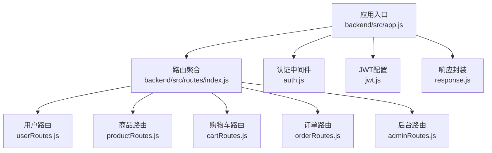
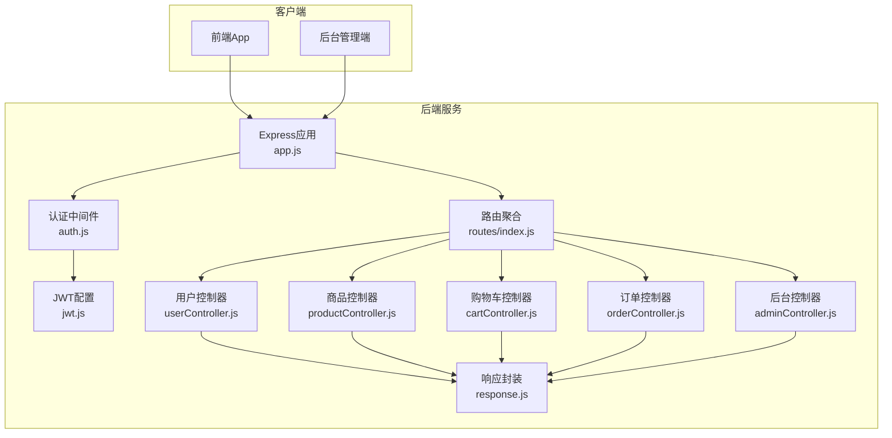
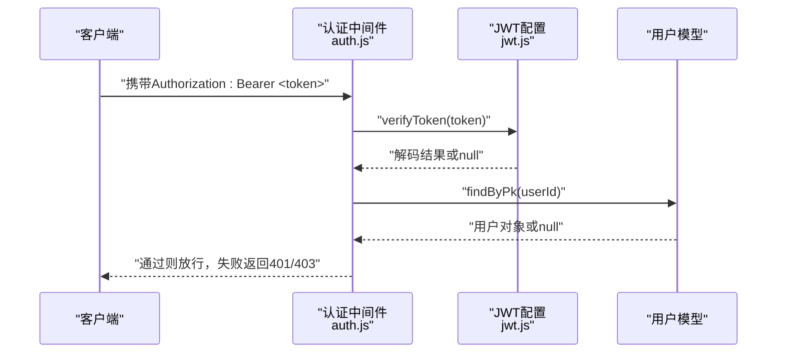
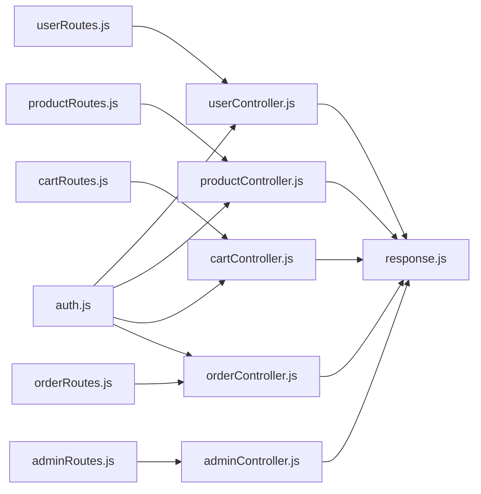

# API接口文档

<cite>
**本文引用的文件**
- [backend/src/app.js](file://backend/src/app.js)
- [backend/src/routes/index.js](file://backend/src/routes/index.js)
- [backend/src/routes/userRoutes.js](file://backend/src/routes/userRoutes.js)
- [backend/src/routes/productRoutes.js](file://backend/src/routes/productRoutes.js)
- [backend/src/routes/cartRoutes.js](file://backend/src/routes/cartRoutes.js)
- [backend/src/routes/orderRoutes.js](file://backend/src/routes/orderRoutes.js)
- [backend/src/routes/adminRoutes.js](file://backend/src/routes/adminRoutes.js)
- [backend/src/middlewares/auth.js](file://backend/src/middlewares/auth.js)
- [backend/src/config/jwt.js](file://backend/src/config/jwt.js)
- [backend/src/utils/response.js](file://backend/src/utils/response.js)
- [backend/src/controllers/userController.js](file://backend/src/controllers/userController.js)
- [backend/src/controllers/productController.js](file://backend/src/controllers/productController.js)
- [backend/src/controllers/cartController.js](file://backend/src/controllers/cartController.js)
- [backend/src/controllers/orderController.js](file://backend/src/controllers/orderController.js)
- [backend/src/controllers/adminController.js](file://backend/src/controllers/adminController.js)
</cite>

## 目录
1. [简介](#简介)
2. [项目结构](#项目结构)
3. [核心组件](#核心组件)
4. [架构总览](#架构总览)
5. [详细组件分析](#详细组件分析)
6. [依赖关系分析](#依赖关系分析)
7. [性能考量](#性能考量)
8. [故障排查指南](#故障排查指南)
9. [结论](#结论)
10. [附录](#附录)

## 简介
本文件为“趣配鲜”项目的完整API接口文档，覆盖用户认证、商品管理、购物车、订单处理、后台管理等模块。文档基于实际代码实现，提供接口规范、认证机制、错误码与处理策略、版本与兼容性建议、测试与调试方法，帮助开发者快速、准确地集成与维护。

## 项目结构
后端采用Express框架，路由按功能分组挂载于统一入口，中间件负责安全与日志，控制器实现业务逻辑，响应工具统一封装返回格式。

图表来源
- [backend/src/app.js:49-53](file://backend/src/app.js#L49-L53)
- [backend/src/routes/index.js:11-16](file://backend/src/routes/index.js#L11-L16)

章节来源
- [backend/src/app.js:17-84](file://backend/src/app.js#L17-L84)
- [backend/src/routes/index.js:1-27](file://backend/src/routes/index.js#L1-L27)

## 核心组件
- 应用入口与中间件
  - 安全与防护：Helmet、CORS、XSS清理、Mongo防注入、限流
  - 日志：Morgan结合自定义logger
  - 静态资源：上传目录映射
  - 路由前缀：可配置的API前缀
- 认证与授权
  - JWT：生成、刷新、校验
  - 用户认证中间件：Bearer令牌解析、用户状态校验、软删除与黑名单处理
  - 可选认证：用于匿名访问场景
- 响应封装
  - 统一success/error/paginate返回结构，便于前端一致处理

章节来源
- [backend/src/app.js:19-47](file://backend/src/app.js#L19-L47)
- [backend/src/config/jwt.js:10-32](file://backend/src/config/jwt.js#L10-L32)
- [backend/src/middlewares/auth.js:4-148](file://backend/src/middlewares/auth.js#L4-L148)
- [backend/src/utils/response.js:1-32](file://backend/src/utils/response.js#L1-L32)

## 架构总览
系统采用前后端分离，后端提供RESTful API，前端通过HTTP客户端调用；后台管理端独立路由，具备更高权限。

图表来源
- [backend/src/app.js:17-53](file://backend/src/app.js#L17-L53)
- [backend/src/routes/index.js:4-16](file://backend/src/routes/index.js#L4-L16)
- [backend/src/middlewares/auth.js:1-181](file://backend/src/middlewares/auth.js#L1-L181)
- [backend/src/config/jwt.js:1-41](file://backend/src/config/jwt.js#L1-L41)
- [backend/src/utils/response.js:1-32](file://backend/src/utils/response.js#L1-L32)

## 详细组件分析

### 认证与授权机制
- 令牌类型
  - 访问令牌：用户登录签发，有效期可配置
  - 刷新令牌：用于刷新访问令牌（当前路由未暴露刷新接口）
- 令牌校验流程
  - 请求头携带Authorization: Bearer <token>
  - 中间件解析令牌，校验有效性
  - 解析用户ID，查询用户状态与软删除标记
  - 支持根据手机号回退查找用户（开发环境）
- 权限控制
  - 普通用户路由：auth中间件
  - 后台管理路由：adminAuth中间件（后台控制器内使用）
  - 可选认证：optionalAuth，仅在令牌有效时注入用户上下文

图表来源
- [backend/src/middlewares/auth.js:4-148](file://backend/src/middlewares/auth.js#L4-L148)
- [backend/src/config/jwt.js:18-32](file://backend/src/config/jwt.js#L18-L32)

章节来源
- [backend/src/middlewares/auth.js:4-181](file://backend/src/middlewares/auth.js#L4-L181)
- [backend/src/config/jwt.js:1-41](file://backend/src/config/jwt.js#L1-L41)

### 用户认证与资料
- 注册
  - 方法与路径：POST /users/register
  - 请求头：Content-Type: application/json
  - 请求体字段：phone, password, nickname
  - 成功返回：user基础信息与token
- 登录
  - 方法与路径：POST /users/login
  - 请求体字段：phone, password
  - 成功返回：用户信息与token
- 忘记密码
  - 方法与路径：POST /users/forgot-password
  - 请求体字段：phone
  - 返回临时密码（开发环境演示用途）

章节来源
- [backend/src/routes/userRoutes.js:7-8](file://backend/src/routes/userRoutes.js#L7-L8)
- [backend/src/controllers/userController.js:7-42](file://backend/src/controllers/userController.js#L7-L42)
- [backend/src/controllers/userController.js:44-93](file://backend/src/controllers/userController.js#L44-L93)
- [backend/src/controllers/userController.js:153-171](file://backend/src/controllers/userController.js#L153-L171)

### 用户资料与地址管理
- 获取个人资料
  - 方法与路径：GET /users/profile
  - 需要登录
  - 返回字段：id, phone, nickname, email, real_name, member_level, member_expire_time, points, balance, status, created_at
- 更新个人资料
  - 方法与路径：PUT /users/profile
  - 请求体字段：nickname, email, real_name
- 修改登录密码
  - 方法与路径：PUT /users/profile/password
  - 请求体字段：old_password, new_password
- 收货地址
  - 查询：GET /users/addresses
  - 新增：POST /users/addresses
  - 更新：PUT /users/addresses/:id
  - 删除：DELETE /users/addresses/:id
  - 设为默认：PUT /users/addresses/:id/default

章节来源
- [backend/src/routes/userRoutes.js:10-17](file://backend/src/routes/userRoutes.js#L10-L17)
- [backend/src/controllers/userController.js:95-127](file://backend/src/controllers/userController.js#L95-L127)
- [backend/src/controllers/userController.js:129-151](file://backend/src/controllers/userController.js#L129-L151)
- [backend/src/controllers/userController.js:173-302](file://backend/src/controllers/userController.js#L173-L302)

### 商品浏览与收藏
- 分类查询
  - 方法与路径：GET /products/categories
- 商品列表
  - 方法与路径：GET /products/
  - 查询参数：page, pageSize, category_id, keyword, is_new, is_hot, is_recommend
- 商品详情（匿名/登录）
  - 方法与路径：GET /products/:id
  - 可选登录：optionalAuth
  - 返回字段：商品详情、是否收藏、最近评论、合规信息
- 收藏与历史
  - 收藏切换：POST /products/favorites/toggle
  - 收藏列表：GET /products/favorites/list?page=&pageSize=&type=
  - 浏览历史：GET /products/history/view?page=&pageSize=&type=

章节来源
- [backend/src/routes/productRoutes.js:6-12](file://backend/src/routes/productRoutes.js#L6-L12)
- [backend/src/controllers/productController.js:6-42](file://backend/src/controllers/productController.js#L6-L42)
- [backend/src/controllers/productController.js:44-108](file://backend/src/controllers/productController.js#L44-L108)
- [backend/src/controllers/productController.js:123-179](file://backend/src/controllers/productController.js#L123-L179)
- [backend/src/controllers/productController.js:181-208](file://backend/src/controllers/productController.js#L181-L208)

### 购物车
- 查看购物车：GET /cart/（可匿名）
- 加入购物车：POST /cart/add
  - 请求体字段：product_id, spec_id, quantity=1, dietary_note
- 修改数量/勾选/备注：PUT /cart/:id
  - 请求体字段：quantity, selected, dietary_note
- 删除单项：DELETE /cart/:id
- 清空购物车：DELETE /cart/

章节来源
- [backend/src/routes/cartRoutes.js:6-11](file://backend/src/routes/cartRoutes.js#L6-L11)
- [backend/src/controllers/cartController.js:4-35](file://backend/src/controllers/cartController.js#L4-L35)
- [backend/src/controllers/cartController.js:37-70](file://backend/src/controllers/cartController.js#L37-L70)
- [backend/src/controllers/cartController.js:72-96](file://backend/src/controllers/cartController.js#L72-L96)
- [backend/src/controllers/cartController.js:98-129](file://backend/src/controllers/cartController.js#L98-L129)

### 订单处理
- 创建订单
  - 方法与路径：POST /orders/create
  - 请求体字段：address_id, items[], remark, user_coupon_id, delivery_method, invoice_type, invoice_title, invoice_tax_no
  - 校验：地址归属、商品状态与库存、优惠券可用性、门槛与有效期
  - 运费：满99免邮，否则5元
- 订单列表
  - 方法与路径：GET /orders/
  - 查询参数：page, pageSize, status
- 订单详情
  - 方法与路径：GET /orders/:id
- 取消订单
  - 方法与路径：PUT /orders/:id/cancel
  - 仅待付款可取消，自动回滚库存
- 确认收货
  - 方法与路径：PUT /orders/:id/confirm
  - 仅待收货可确认
- 售后申请
  - 方法与路径：POST /orders/after-sales
  - 请求体字段：order_id, order_item_id, type, reason, images[]
- 售后列表
  - 方法与路径：GET /orders/after-sales/list?page=&pageSize=
- 评价
  - 方法与路径：POST /orders/reviews
  - 请求体字段：order_item_id, rating, content, images[]
  - 仅已完成订单可评价

章节来源
- [backend/src/routes/orderRoutes.js:6-16](file://backend/src/routes/orderRoutes.js#L6-L16)
- [backend/src/controllers/orderController.js:6-122](file://backend/src/controllers/orderController.js#L6-L122)
- [backend/src/controllers/orderController.js:124-150](file://backend/src/controllers/orderController.js#L124-L150)
- [backend/src/controllers/orderController.js:152-185](file://backend/src/controllers/orderController.js#L152-L185)
- [backend/src/controllers/orderController.js:187-220](file://backend/src/controllers/orderController.js#L187-L220)
- [backend/src/controllers/orderController.js:222-241](file://backend/src/controllers/orderController.js#L222-L241)
- [backend/src/controllers/orderController.js:243-271](file://backend/src/controllers/orderController.js#L243-L271)
- [backend/src/controllers/orderController.js:273-294](file://backend/src/controllers/orderController.js#L273-L294)
- [backend/src/controllers/orderController.js:296-333](file://backend/src/controllers/orderController.js#L296-L333)

### 后台管理
- 登录
  - 方法与路径：POST /admin/login
  - 请求体字段：username, password
- 个人资料与统计
  - GET /admin/profile
  - GET /admin/stats
- 管理员管理
  - GET /admin/admins
  - GET /admin/admins/:id
  - POST /admin/admins
  - PUT /admin/admins/:id
  - PUT /admin/admins/:id/password
  - DELETE /admin/admins/:id
  - GET /admin/roles
  - PUT /admin/profile/password
  - PUT /admin/admins/:id/force-reset
- 商品管理
  - GET /admin/products
  - GET /admin/products/:id
  - POST /admin/products
  - PUT /admin/products/:id
  - PUT /admin/products/:id/sale
  - DELETE /admin/products/:id
  - GET /admin/categories
  - POST /admin/categories
  - PUT /admin/categories/:id
  - DELETE /admin/categories/:id
- 订单管理
  - GET /admin/orders
  - GET /admin/orders/export
  - GET /admin/orders/:id
  - PUT /admin/orders/:id/status
- 用户管理
  - GET /admin/users
  - GET /admin/users/:id
  - PUT /admin/users/:id/status
- 优惠券管理
  - GET /admin/coupons
  - POST /admin/coupons
  - PUT /admin/coupons/:id
  - PUT /admin/coupons/:id/status
  - DELETE /admin/coupons/:id
  - POST /admin/coupons/:id/issue
- 食谱、轮播、公告、设置
  - 对应路由：/admin/recipes, /admin/banners, /admin/notices, /admin/settings

章节来源
- [backend/src/routes/adminRoutes.js:14-29](file://backend/src/routes/adminRoutes.js#L14-L29)
- [backend/src/routes/adminRoutes.js:21-31](file://backend/src/routes/adminRoutes.js#L21-L31)
- [backend/src/routes/adminRoutes.js:32-42](file://backend/src/routes/adminRoutes.js#L32-L42)
- [backend/src/routes/adminRoutes.js:44-47](file://backend/src/routes/adminRoutes.js#L44-L47)
- [backend/src/routes/adminRoutes.js:49-51](file://backend/src/routes/adminRoutes.js#L49-L51)
- [backend/src/routes/adminRoutes.js:53-58](file://backend/src/routes/adminRoutes.js#L53-L58)
- [backend/src/routes/adminRoutes.js:60-69](file://backend/src/routes/adminRoutes.js#L60-L69)
- [backend/src/routes/adminRoutes.js:71-74](file://backend/src/routes/adminRoutes.js#L71-L74)
- [backend/src/routes/adminRoutes.js:76-77](file://backend/src/routes/adminRoutes.js#L76-L77)
- [backend/src/controllers/adminController.js:8-49](file://backend/src/controllers/adminController.js#L8-L49)
- [backend/src/controllers/adminController.js:392-439](file://backend/src/controllers/adminController.js#L392-L439)

## 依赖关系分析
- 路由到控制器
  - 各路由文件将HTTP请求映射到对应控制器函数
- 控制器到模型与工具
  - 控制器依赖模型进行数据读写，依赖响应封装统一返回
- 中间件到控制器
  - 认证中间件在进入控制器前注入用户上下文，影响后续鉴权与业务逻辑
- 错误处理
  - 统一错误处理器捕获未处理异常，避免进程崩溃

图表来源
- [backend/src/routes/userRoutes.js:3-4](file://backend/src/routes/userRoutes.js#L3-L4)
- [backend/src/routes/productRoutes.js:3-4](file://backend/src/routes/productRoutes.js#L3-L4)
- [backend/src/routes/cartRoutes.js:3-4](file://backend/src/routes/cartRoutes.js#L3-L4)
- [backend/src/routes/orderRoutes.js:3-4](file://backend/src/routes/orderRoutes.js#L3-L4)
- [backend/src/routes/adminRoutes.js:3-12](file://backend/src/routes/adminRoutes.js#L3-L12)
- [backend/src/middlewares/auth.js:1-181](file://backend/src/middlewares/auth.js#L1-L181)
- [backend/src/utils/response.js:1-32](file://backend/src/utils/response.js#L1-L32)

章节来源
- [backend/src/routes/index.js:4-16](file://backend/src/routes/index.js#L4-L16)
- [backend/src/middlewares/auth.js:1-181](file://backend/src/middlewares/auth.js#L1-L181)
- [backend/src/utils/response.js:1-32](file://backend/src/utils/response.js#L1-L32)

## 性能考量
- 速率限制：全局限流，窗口与最大请求数可配置
- 数据库查询：分页参数默认值来自常量，避免大结果集
- 响应封装：统一JSON结构，减少前端分支判断
- 建议
  - 对高频接口增加缓存层（如Redis）
  - 大字段查询时使用select白名单
  - 对批量导入/导出（如订单导出）使用异步任务队列

章节来源
- [backend/src/app.js:32-39](file://backend/src/app.js#L32-L39)
- [backend/src/controllers/productController.js:6-42](file://backend/src/controllers/productController.js#L6-L42)
- [backend/src/utils/response.js:17-29](file://backend/src/utils/response.js#L17-L29)

## 故障排查指南
- 通用错误结构
  - 字段：success（布尔）、message（字符串）、data或errors（可选）
- 常见HTTP状态与含义
  - 400：参数校验失败、业务规则不满足（如库存不足、优惠券不可用）
  - 401：未提供/无效/过期令牌、用户不存在
  - 403：账号被禁用/拉黑
  - 404：资源不存在
  - 500：服务器内部错误
- 排查步骤
  - 检查Authorization头是否为Bearer <token>
  - 核对令牌有效期与签发方
  - 确认用户状态与软删除标记
  - 关注控制器中的条件分支与异常捕获
  - 查看服务端日志（Morgan输出）

章节来源
- [backend/src/utils/response.js:1-32](file://backend/src/utils/response.js#L1-L32)
- [backend/src/middlewares/auth.js:4-148](file://backend/src/middlewares/auth.js#L4-L148)
- [backend/src/controllers/userController.js:129-151](file://backend/src/controllers/userController.js#L129-L151)
- [backend/src/controllers/orderController.js:6-122](file://backend/src/controllers/orderController.js#L6-L122)

## 结论
本API文档基于现有代码实现，覆盖主要业务模块与认证授权流程。建议在生产环境中完善令牌刷新、更细粒度的权限控制、以及针对高并发场景的缓存与限流策略，并持续以本文件为准进行回归验证。

## 附录

### 接口版本管理与兼容性
- 版本策略
  - 当前未显式实现语义化版本号（如v1、v2），建议在路由前缀中引入版本号（例如 /api/v1/...）
- 兼容性建议
  - 新增字段以可选方式返回，避免破坏既有客户端
  - 移除字段时保留但标注废弃，提供过渡期
  - 对于破坏性变更，优先新增接口并逐步引导客户端迁移

### API测试指南与调试技巧
- 常用工具
  - curl、Postman、Insomnia
- 建议流程
  - 先用注册/登录获取token，再携带Authorization头调用受保护接口
  - 使用GET /health检查服务健康状态
  - 对分页接口测试边界值（page=1, pageSize超大）
  - 对订单流程按状态机顺序测试（创建→支付→发货→收货→售后→评价）
- 调试要点
  - 开启开发环境日志，关注认证中间件的用户ID解析与状态校验
  - 对数据库约束错误（外键、唯一性）进行捕获与友好提示

章节来源
- [backend/src/routes/index.js:18-24](file://backend/src/routes/index.js#L18-L24)
- [backend/src/middlewares/auth.js:4-148](file://backend/src/middlewares/auth.js#L4-L148)