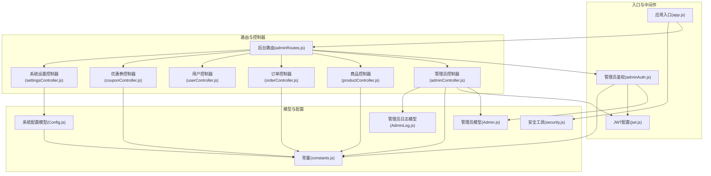
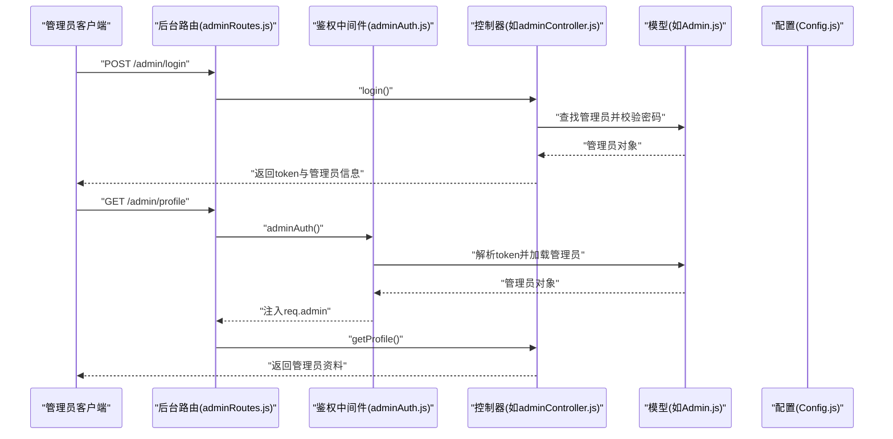
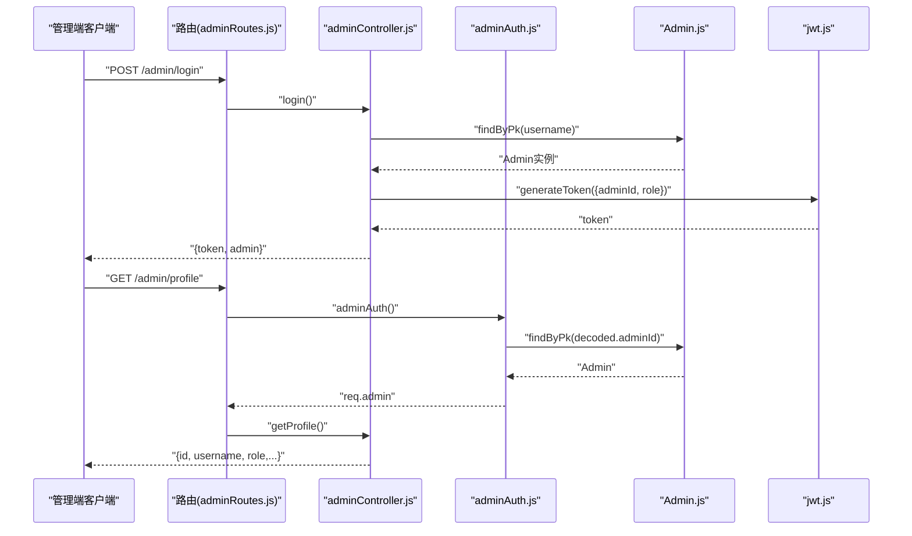
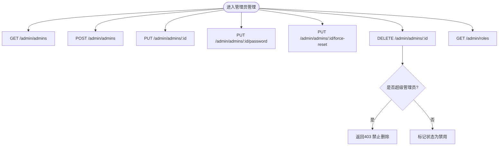
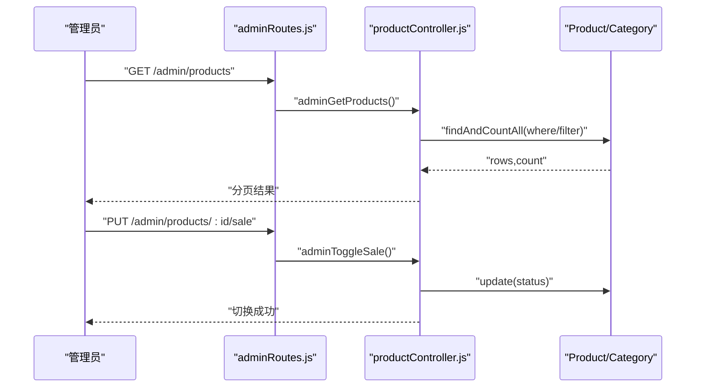
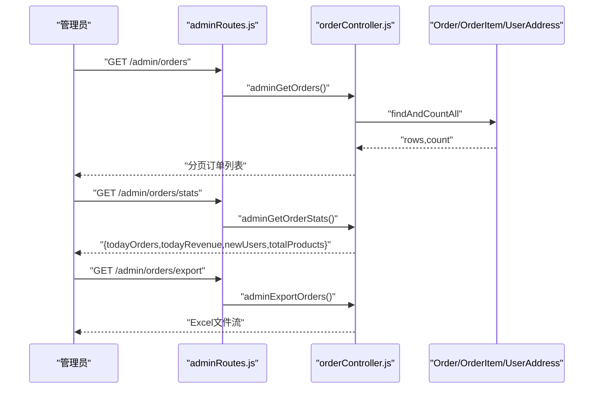
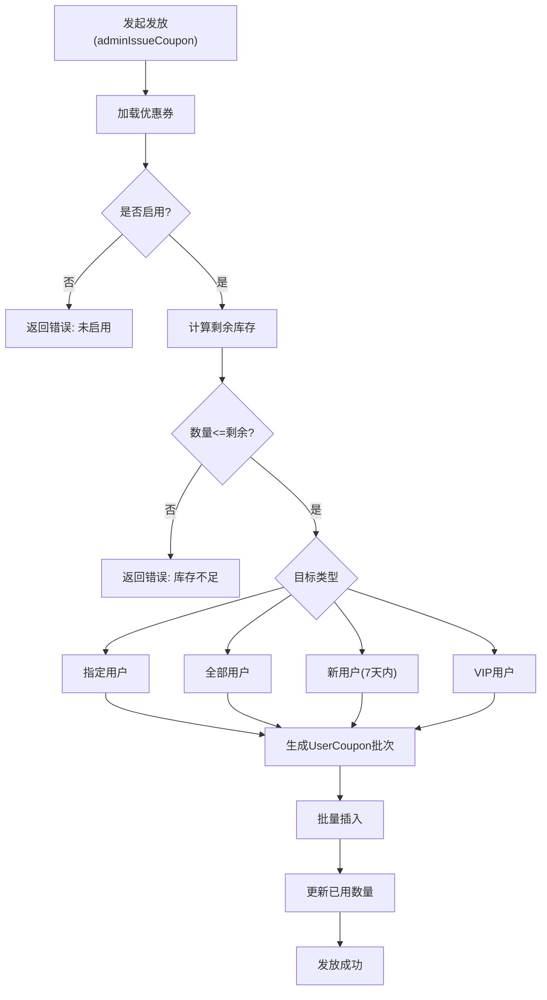
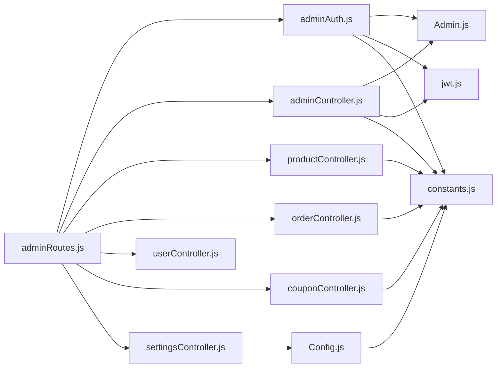
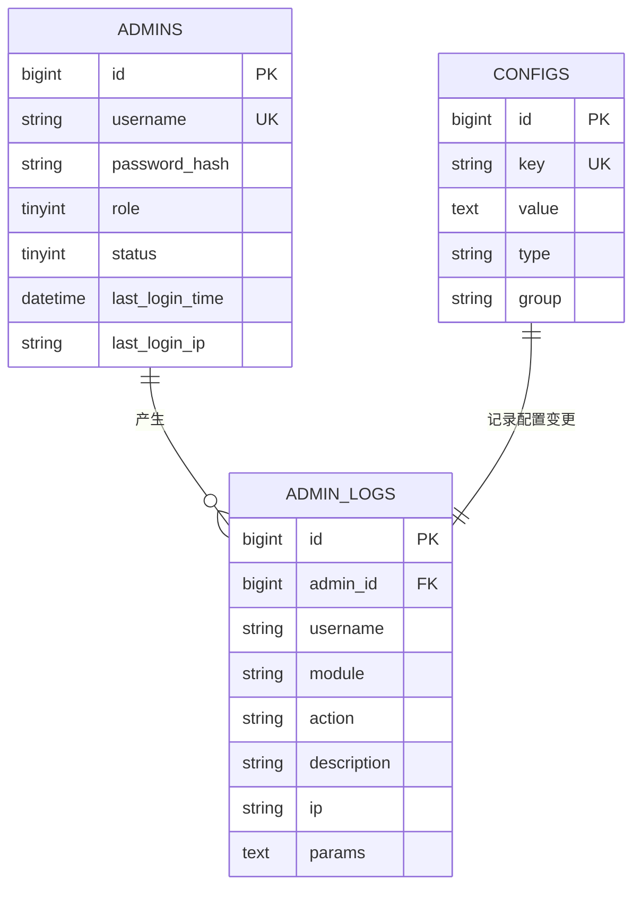

# 后台管理接口

<cite>
**本文引用的文件**
- [backend/src/routes/adminRoutes.js](file://backend/src/routes/adminRoutes.js)
- [backend/src/controllers/adminController.js](file://backend/src/controllers/adminController.js)
- [backend/src/middlewares/adminAuth.js](file://backend/src/middlewares/adminAuth.js)
- [backend/src/models/Admin.js](file://backend/src/models/Admin.js)
- [backend/src/models/AdminLog.js](file://backend/src/models/AdminLog.js)
- [backend/src/config/constants.js](file://backend/src/config/constants.js)
- [backend/src/config/jwt.js](file://backend/src/config/jwt.js)
- [backend/src/utils/security.js](file://backend/src/utils/security.js)
- [backend/src/controllers/productController.js](file://backend/src/controllers/productController.js)
- [backend/src/controllers/orderController.js](file://backend/src/controllers/orderController.js)
- [backend/src/controllers/userController.js](file://backend/src/controllers/userController.js)
- [backend/src/controllers/couponController.js](file://backend/src/controllers/couponController.js)
- [backend/src/controllers/settingsController.js](file://backend/src/controllers/settingsController.js)
- [backend/src/models/Config.js](file://backend/src/models/Config.js)
- [backend/src/app.js](file://backend/src/app.js)
</cite>

## 目录
1. [简介](#简介)
2. [项目结构](#项目结构)
3. [核心组件](#核心组件)
4. [架构总览](#架构总览)
5. [详细组件分析](#详细组件分析)
6. [依赖关系分析](#依赖关系分析)
7. [性能与安全考虑](#性能与安全考虑)
8. [故障排查指南](#故障排查指南)
9. [结论](#结论)
10. [附录](#附录)

## 简介
本文件为后台管理系统接口的权威文档，覆盖管理员登录、商品管理、订单管理、用户管理、优惠券管理、系统设置、统计与报表、日志与审计等模块。文档同时阐述管理员权限验证机制与角色控制策略，提供批量操作、导入导出、统计分析、配置管理、安全与访问控制等能力说明，并给出请求与响应示例路径，帮助前后端协作与运维部署。

## 项目结构
后台采用 Express + Sequelize 的典型分层架构：
- 路由层：定义后台接口路由与鉴权中间件挂载点
- 控制器层：实现业务逻辑与数据聚合
- 模型层：基于 Sequelize 定义数据表结构与钩子
- 中间件层：统一鉴权、错误处理、安全加固
- 配置层：常量、JWT、日志、数据库等配置
- 工具层：安全脱敏、响应封装等通用工具

图表来源
- [backend/src/app.js:1-84](file://backend/src/app.js#L1-L84)
- [backend/src/routes/adminRoutes.js:1-82](file://backend/src/routes/adminRoutes.js#L1-L82)
- [backend/src/middlewares/adminAuth.js:1-77](file://backend/src/middlewares/adminAuth.js#L1-L77)
- [backend/src/controllers/adminController.js:1-457](file://backend/src/controllers/adminController.js#L1-L457)
- [backend/src/controllers/productController.js:1-200](file://backend/src/controllers/productController.js#L1-L200)
- [backend/src/controllers/orderController.js:1-200](file://backend/src/controllers/orderController.js#L1-L200)
- [backend/src/controllers/userController.js:1-200](file://backend/src/controllers/userController.js#L1-L200)
- [backend/src/controllers/couponController.js:1-200](file://backend/src/controllers/couponController.js#L1-L200)
- [backend/src/controllers/settingsController.js:1-50](file://backend/src/controllers/settingsController.js#L1-L50)
- [backend/src/models/Admin.js:1-96](file://backend/src/models/Admin.js#L1-L96)
- [backend/src/models/AdminLog.js:1-53](file://backend/src/models/AdminLog.js#L1-L53)
- [backend/src/models/Config.js:1-45](file://backend/src/models/Config.js#L1-L45)
- [backend/src/config/constants.js:1-132](file://backend/src/config/constants.js#L1-L132)
- [backend/src/config/jwt.js:1-41](file://backend/src/config/jwt.js#L1-L41)
- [backend/src/utils/security.js:1-48](file://backend/src/utils/security.js#L1-L48)

章节来源
- [backend/src/app.js:1-84](file://backend/src/app.js#L1-L84)
- [backend/src/routes/adminRoutes.js:1-82](file://backend/src/routes/adminRoutes.js#L1-L82)

## 核心组件
- 管理员鉴权中间件：校验 Bearer Token、管理员状态、角色权限
- 管理员控制器：登录、资料、角色管理、统计、短信找回密码
- 商品控制器：商品与分类的增删改查、上下架
- 订单控制器：订单列表、详情、状态变更、导出
- 用户控制器：用户列表、状态变更
- 优惠券控制器：优惠券管理、发放
- 系统设置控制器：配置读取与保存
- 日志模型：后台操作审计记录
- 常量与配置：状态码、角色、文案、分页等

章节来源
- [backend/src/middlewares/adminAuth.js:1-77](file://backend/src/middlewares/adminAuth.js#L1-L77)
- [backend/src/controllers/adminController.js:1-457](file://backend/src/controllers/adminController.js#L1-L457)
- [backend/src/controllers/productController.js:1-200](file://backend/src/controllers/productController.js#L1-L200)
- [backend/src/controllers/orderController.js:1-200](file://backend/src/controllers/orderController.js#L1-L200)
- [backend/src/controllers/userController.js:1-200](file://backend/src/controllers/userController.js#L1-L200)
- [backend/src/controllers/couponController.js:1-200](file://backend/src/controllers/couponController.js#L1-L200)
- [backend/src/controllers/settingsController.js:1-50](file://backend/src/controllers/settingsController.js#L1-L50)
- [backend/src/models/AdminLog.js:1-53](file://backend/src/models/AdminLog.js#L1-L53)
- [backend/src/config/constants.js:1-132](file://backend/src/config/constants.js#L1-L132)

## 架构总览
后台接口统一通过路由层暴露，所有后台接口均受管理员鉴权中间件保护。控制器负责调用模型与常量进行业务处理，返回统一的成功/失败响应。系统配置通过 Config 表集中管理，支持字符串与 JSON 类型配置项。

图表来源
- [backend/src/routes/adminRoutes.js:14-19](file://backend/src/routes/adminRoutes.js#L14-L19)
- [backend/src/middlewares/adminAuth.js:5-50](file://backend/src/middlewares/adminAuth.js#L5-L50)
- [backend/src/controllers/adminController.js:8-49](file://backend/src/controllers/adminController.js#L8-L49)
- [backend/src/models/Admin.js:1-96](file://backend/src/models/Admin.js#L1-L96)

## 详细组件分析

### 管理员登录与权限验证
- 登录流程：用户名+密码校验，状态检查，更新最近登录信息，签发 JWT
- 权限验证：从 Authorization 头提取 Bearer Token，解码并加载管理员，检查状态
- 角色控制：超级管理员放行，其他角色根据 requireRole 白名单校验

图表来源
- [backend/src/routes/adminRoutes.js:14-19](file://backend/src/routes/adminRoutes.js#L14-L19)
- [backend/src/controllers/adminController.js:8-49](file://backend/src/controllers/adminController.js#L8-L49)
- [backend/src/middlewares/adminAuth.js:5-50](file://backend/src/middlewares/adminAuth.js#L5-L50)
- [backend/src/models/Admin.js:1-96](file://backend/src/models/Admin.js#L1-L96)
- [backend/src/config/jwt.js:10-24](file://backend/src/config/jwt.js#L10-L24)

章节来源
- [backend/src/controllers/adminController.js:8-49](file://backend/src/controllers/adminController.js#L8-L49)
- [backend/src/middlewares/adminAuth.js:5-50](file://backend/src/middlewares/adminAuth.js#L5-L50)
- [backend/src/config/constants.js:62-68](file://backend/src/config/constants.js#L62-L68)

### 管理员管理与角色控制
- 列表、详情、创建、更新、密码修改、删除、角色选项、强制重置密码
- 删除限制：禁止删除超级管理员
- 角色枚举：超级管理员、运营、客服、财务

图表来源
- [backend/src/routes/adminRoutes.js:21-30](file://backend/src/routes/adminRoutes.js#L21-L30)
- [backend/src/controllers/adminController.js:68-236](file://backend/src/controllers/adminController.js#L68-L236)
- [backend/src/config/constants.js:62-68](file://backend/src/config/constants.js#L62-L68)

章节来源
- [backend/src/routes/adminRoutes.js:21-30](file://backend/src/routes/adminRoutes.js#L21-L30)
- [backend/src/controllers/adminController.js:68-236](file://backend/src/controllers/adminController.js#L68-L236)
- [backend/src/config/constants.js:62-68](file://backend/src/config/constants.js#L62-L68)

### 商品管理
- 商品：列表、详情、创建、更新、删除、上下架
- 分类：列表、创建、更新、删除
- 支持关键词、分类筛选、新品/热销/推荐过滤
- 上下架：通过 PUT /admin/products/:id/sale 控制

图表来源
- [backend/src/routes/adminRoutes.js:32-42](file://backend/src/routes/adminRoutes.js#L32-L42)
- [backend/src/controllers/productController.js:6-42](file://backend/src/controllers/productController.js#L6-L42)

章节来源
- [backend/src/routes/adminRoutes.js:32-42](file://backend/src/routes/adminRoutes.js#L32-L42)
- [backend/src/controllers/productController.js:6-42](file://backend/src/controllers/productController.js#L6-L42)

### 订单管理
- 订单：列表、详情、状态更新、导出
- 统计：今日订单数、收入、新增用户、商品总数
- 导出：Excel 导出（服务端生成）

图表来源
- [backend/src/routes/adminRoutes.js:44-48](file://backend/src/routes/adminRoutes.js#L44-L48)
- [backend/src/controllers/orderController.js:126-187](file://backend/src/controllers/orderController.js#L126-L187)
- [backend/src/controllers/adminController.js:392-439](file://backend/src/controllers/adminController.js#L392-L439)

章节来源
- [backend/src/routes/adminRoutes.js:44-48](file://backend/src/routes/adminRoutes.js#L44-L48)
- [backend/src/controllers/orderController.js:126-187](file://backend/src/controllers/orderController.js#L126-L187)
- [backend/src/controllers/adminController.js:392-439](file://backend/src/controllers/adminController.js#L392-L439)

### 用户管理
- 用户：列表、详情、状态更新、统计
- 与前台用户控制器不同，后台仅做管理用途的数据查询与状态变更

章节来源
- [backend/src/routes/adminRoutes.js:50-53](file://backend/src/routes/adminRoutes.js#L50-L53)
- [backend/src/controllers/userController.js:1-200](file://backend/src/controllers/userController.js#L1-L200)

### 优惠券管理
- 优惠券：列表、创建、更新、状态更新、删除
- 发放：支持指定用户、全部用户、新用户、VIP 用户等多目标批量发放
- 库存校验与过期校验、使用门槛校验

图表来源
- [backend/src/routes/adminRoutes.js:60](file://backend/src/routes/adminRoutes.js#L60)
- [backend/src/controllers/couponController.js:128-199](file://backend/src/controllers/couponController.js#L128-L199)

章节来源
- [backend/src/routes/adminRoutes.js:55-61](file://backend/src/routes/adminRoutes.js#L55-L61)
- [backend/src/controllers/couponController.js:5-199](file://backend/src/controllers/couponController.js#L5-L199)

### 系统设置
- 获取设置：读取 Config 表，自动尝试 JSON 解析
- 保存设置：逐项 upsert，支持字符串与 JSON

章节来源
- [backend/src/routes/adminRoutes.js:78-79](file://backend/src/routes/adminRoutes.js#L78-L79)
- [backend/src/controllers/settingsController.js:4-44](file://backend/src/controllers/settingsController.js#L4-L44)
- [backend/src/models/Config.js:1-45](file://backend/src/models/Config.js#L1-L45)

### 后台操作日志与审计
- AdminLog 模型记录管理员操作：模块、动作、描述、IP、请求参数
- 可用于审计与追踪管理员行为

章节来源
- [backend/src/models/AdminLog.js:1-53](file://backend/src/models/AdminLog.js#L1-L53)

### 安全与访问控制
- 鉴权：Bearer Token，超时与失效处理
- 状态：管理员状态为禁用时拒绝访问
- 角色：requireRole 白名单控制细粒度权限
- 数据脱敏：敏感字段掩码工具（手机号、姓名、身份证、邮箱）
- 传输安全：Helmet、CORS、XSS 清理、Mongo Sanitize、速率限制、Morgan 日志

章节来源
- [backend/src/middlewares/adminAuth.js:52-74](file://backend/src/middlewares/adminAuth.js#L52-L74)
- [backend/src/utils/security.js:16-38](file://backend/src/utils/security.js#L16-L38)
- [backend/src/app.js:19-45](file://backend/src/app.js#L19-L45)

## 依赖关系分析
- 路由依赖中间件：adminAuth 对所有后台接口生效
- 控制器依赖模型与常量：Admin、Order、Product、Coupon、Config 等
- 鉴权依赖 JWT：生成与校验 token
- 安全依赖工具：脱敏、速率限制、日志

图表来源
- [backend/src/routes/adminRoutes.js:1-82](file://backend/src/routes/adminRoutes.js#L1-L82)
- [backend/src/middlewares/adminAuth.js:1-77](file://backend/src/middlewares/adminAuth.js#L1-L77)
- [backend/src/controllers/adminController.js:1-457](file://backend/src/controllers/adminController.js#L1-L457)
- [backend/src/controllers/productController.js:1-200](file://backend/src/controllers/productController.js#L1-L200)
- [backend/src/controllers/orderController.js:1-200](file://backend/src/controllers/orderController.js#L1-L200)
- [backend/src/controllers/userController.js:1-200](file://backend/src/controllers/userController.js#L1-L200)
- [backend/src/controllers/couponController.js:1-200](file://backend/src/controllers/couponController.js#L1-L200)
- [backend/src/controllers/settingsController.js:1-50](file://backend/src/controllers/settingsController.js#L1-L50)
- [backend/src/models/Admin.js:1-96](file://backend/src/models/Admin.js#L1-L96)
- [backend/src/models/Config.js:1-45](file://backend/src/models/Config.js#L1-L45)
- [backend/src/config/constants.js:1-132](file://backend/src/config/constants.js#L1-L132)
- [backend/src/config/jwt.js:1-41](file://backend/src/config/jwt.js#L1-L41)

章节来源
- [backend/src/routes/adminRoutes.js:1-82](file://backend/src/routes/adminRoutes.js#L1-L82)
- [backend/src/middlewares/adminAuth.js:1-77](file://backend/src/middlewares/adminAuth.js#L1-L77)

## 性能与安全考虑
- 性能
  - 分页查询：默认每页 20 条，最大 100 条
  - 并发统计：使用 Promise.all 并行查询今日订单、收入、新增用户、商品总数
  - 导出：服务端生成 Excel，建议对大数据量分批导出
- 安全
  - 强制使用 HTTPS 传输
  - 管理员密码使用 bcrypt 存储，避免明文
  - 敏感字段脱敏输出
  - 速率限制与日志审计
  - CORS 与 Helmet 配置

章节来源
- [backend/src/config/constants.js:125-130](file://backend/src/config/constants.js#L125-L130)
- [backend/src/controllers/adminController.js:392-439](file://backend/src/controllers/adminController.js#L392-L439)
- [backend/src/app.js:19-45](file://backend/src/app.js#L19-L45)
- [backend/src/utils/security.js:16-38](file://backend/src/utils/security.js#L16-L38)

## 故障排查指南
- 401 未提供认证令牌/无效或过期的令牌
  - 检查 Authorization 头是否以 Bearer 开头
  - 检查 JWT_SECRET 是否正确
- 403 账号已被禁用/权限不足
  - 确认管理员 status=1
  - 检查角色是否在 requireRole 白名单中
- 404 管理员不存在/资源不存在
  - 核对 ID 或用户名是否存在
- 500 服务器内部错误
  - 查看服务器日志定位具体异常

章节来源
- [backend/src/middlewares/adminAuth.js:8-49](file://backend/src/middlewares/adminAuth.js#L8-L49)
- [backend/src/controllers/adminController.js:12-24](file://backend/src/controllers/adminController.js#L12-L24)

## 结论
本后台接口体系以管理员为中心，通过统一鉴权与角色控制确保后台操作安全可控；围绕商品、订单、用户、优惠券、系统设置等核心业务提供完备的 CRUD 与统计分析能力；配合日志与审计模型，满足合规与运维需求。建议在生产环境强化密钥管理、网络隔离与监控告警。

## 附录

### 接口清单与示例路径
- 管理员登录
  - 请求: POST /admin/login
  - 成功响应示例路径: [backend/src/controllers/adminController.js:33-44](file://backend/src/controllers/adminController.js#L33-L44)
- 获取管理员资料
  - 请求: GET /admin/profile
  - 成功响应示例路径: [backend/src/controllers/adminController.js:54-61](file://backend/src/controllers/adminController.js#L54-L61)
- 获取后台统计
  - 请求: GET /admin/stats
  - 成功响应示例路径: [backend/src/controllers/adminController.js:429-434](file://backend/src/controllers/adminController.js#L429-L434)
- 管理员列表
  - 请求: GET /admin/admins
  - 成功响应示例路径: [backend/src/controllers/adminController.js:77-82](file://backend/src/controllers/adminController.js#L77-L82)
- 创建管理员
  - 请求: POST /admin/admins
  - 成功响应示例路径: [backend/src/controllers/adminController.js:134-141](file://backend/src/controllers/adminController.js#L134-L141)
- 更新管理员密码
  - 请求: PUT /admin/admins/:id/password
  - 成功响应示例路径: [backend/src/controllers/adminController.js:204](file://backend/src/controllers/adminController.js#L204)
- 商品列表
  - 请求: GET /admin/products
  - 成功响应示例路径: [backend/src/controllers/productController.js:32-37](file://backend/src/controllers/productController.js#L32-L37)
- 商品上下架
  - 请求: PUT /admin/products/:id/sale
  - 成功响应示例路径: [backend/src/controllers/productController.js:1-200](file://backend/src/controllers/productController.js#L1-L200)
- 订单列表
  - 请求: GET /admin/orders
  - 成功响应示例路径: [backend/src/controllers/orderController.js:142-147](file://backend/src/controllers/orderController.js#L142-L147)
- 订单统计
  - 请求: GET /admin/orders/stats
  - 成功响应示例路径: [backend/src/controllers/adminController.js:429-434](file://backend/src/controllers/adminController.js#L429-L434)
- 订单导出
  - 请求: GET /admin/orders/export
  - 成功响应示例路径: [backend/src/controllers/orderController.js:1-200](file://backend/src/controllers/orderController.js#L1-L200)
- 用户列表
  - 请求: GET /admin/users
  - 成功响应示例路径: [backend/src/controllers/userController.js:1-200](file://backend/src/controllers/userController.js#L1-L200)
- 优惠券列表
  - 请求: GET /admin/coupons
  - 成功响应示例路径: [backend/src/controllers/couponController.js:24-29](file://backend/src/controllers/couponController.js#L24-L29)
- 发放优惠券
  - 请求: POST /admin/coupons/:id/issue
  - 成功响应示例路径: [backend/src/controllers/couponController.js:194](file://backend/src/controllers/couponController.js#L194)
- 系统设置
  - 请求: GET /admin/settings
  - 成功响应示例路径: [backend/src/controllers/settingsController.js:17](file://backend/src/controllers/settingsController.js#L17)
  - 请求: PUT /admin/settings
  - 成功响应示例路径: [backend/src/controllers/settingsController.js:39](file://backend/src/controllers/settingsController.js#L39)

### 关键数据模型关系

图表来源
- [backend/src/models/Admin.js:1-96](file://backend/src/models/Admin.js#L1-L96)
- [backend/src/models/AdminLog.js:1-53](file://backend/src/models/AdminLog.js#L1-L53)
- [backend/src/models/Config.js:1-45](file://backend/src/models/Config.js#L1-L45)