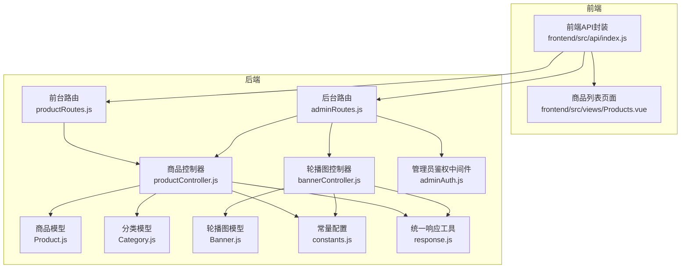
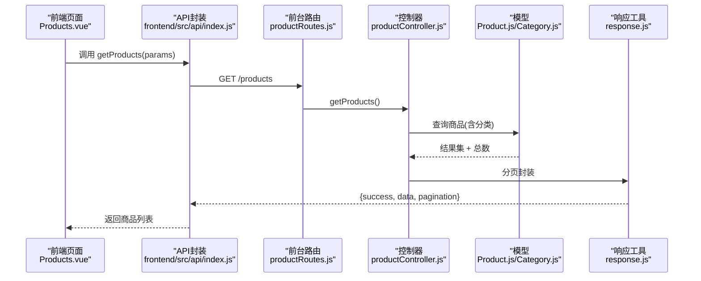
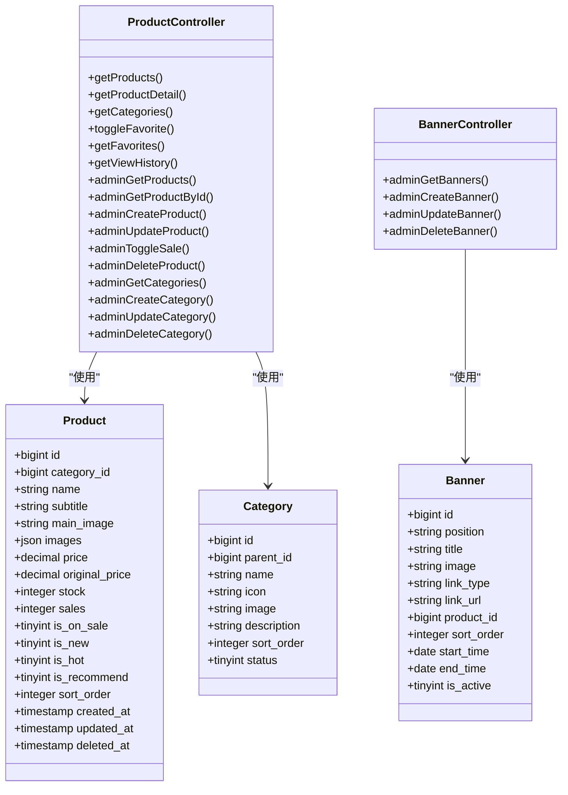

# 商品管理接口

<cite>
**本文引用的文件**
- [productController.js](file://backend/src/controllers/productController.js)
- [productRoutes.js](file://backend/src/routes/productRoutes.js)
- [adminRoutes.js](file://backend/src/routes/adminRoutes.js)
- [Product.js](file://backend/src/models/Product.js)
- [Category.js](file://backend/src/models/Category.js)
- [bannerController.js](file://backend/src/controllers/bannerController.js)
- [Banner.js](file://backend/src/models/Banner.js)
- [constants.js](file://backend/src/config/constants.js)
- [adminAuth.js](file://backend/src/middlewares/adminAuth.js)
- [response.js](file://backend/src/utils/response.js)
- [index.js](file://frontend/src/api/index.js)
- [Products.vue](file://frontend/src/views/Products.vue)
- [test-product-create.js](file://backend/test-product-create.js)
- [test-endpoint.js](file://backend/test-endpoint.js)
</cite>

## 目录
1. [简介](#简介)
2. [项目结构](#项目结构)
3. [核心组件](#核心组件)
4. [架构总览](#架构总览)
5. [详细组件分析](#详细组件分析)
6. [依赖关系分析](#依赖关系分析)
7. [性能与扩展性](#性能与扩展性)
8. [故障排查指南](#故障排查指南)
9. [结论](#结论)
10. [附录](#附录)

## 简介
本文件面向商品管理相关接口，覆盖商品列表查询、商品详情查看、商品搜索、商品分类、轮播图管理以及商品 CRUD 的完整规范。同时说明商品状态管理、库存控制、价格计算逻辑、分页/排序/过滤参数、请求与响应示例、以及商品审核与权限控制机制。文档以仓库现有实现为依据，确保接口定义与实际代码一致。

## 项目结构
- 后端采用 Express + Sequelize，路由位于 routes，控制器位于 controllers，模型位于 models，通用工具位于 utils，配置常量位于 config。
- 商品相关接口分为两类：
  - 前台公开接口：商品列表、详情、分类、收藏、浏览历史等
  - 后台管理接口：商品与分类的增删改查、上下架、轮播图管理等

图表来源
- [productRoutes.js:1-15](file://backend/src/routes/productRoutes.js#L1-L15)
- [adminRoutes.js:1-80](file://backend/src/routes/adminRoutes.js#L1-L80)
- [productController.js:1-527](file://backend/src/controllers/productController.js#L1-L527)
- [bannerController.js:1-86](file://backend/src/controllers/bannerController.js#L1-L86)
- [Product.js:1-190](file://backend/src/models/Product.js#L1-L190)
- [Category.js:1-56](file://backend/src/models/Category.js#L1-L56)
- [Banner.js:1-70](file://backend/src/models/Banner.js#L1-L70)
- [constants.js:1-132](file://backend/src/config/constants.js#L1-L132)
- [adminAuth.js:1-77](file://backend/src/middlewares/adminAuth.js#L1-L77)
- [response.js:1-32](file://backend/src/utils/response.js#L1-L32)

章节来源
- [productRoutes.js:1-15](file://backend/src/routes/productRoutes.js#L1-L15)
- [adminRoutes.js:1-80](file://backend/src/routes/adminRoutes.js#L1-L80)

## 核心组件
- 商品控制器：实现商品列表、详情、分类、收藏、浏览历史、以及后台商品/分类 CRUD 和上下架等业务逻辑。
- 轮播图控制器：实现轮播图的增删改查。
- 商品/分类/轮播图模型：定义字段、约束与时间戳。
- 常量配置：分页默认值、文案、收藏/浏览类型等。
- 管理员鉴权中间件：提供后台接口的认证与角色校验。
- 统一响应工具：封装成功/失败/分页响应格式。

章节来源
- [productController.js:1-527](file://backend/src/controllers/productController.js#L1-L527)
- [bannerController.js:1-86](file://backend/src/controllers/bannerController.js#L1-L86)
- [Product.js:1-190](file://backend/src/models/Product.js#L1-L190)
- [Category.js:1-56](file://backend/src/models/Category.js#L1-L56)
- [Banner.js:1-70](file://backend/src/models/Banner.js#L1-L70)
- [constants.js:125-132](file://backend/src/config/constants.js#L125-L132)
- [adminAuth.js:1-77](file://backend/src/middlewares/adminAuth.js#L1-L77)
- [response.js:1-32](file://backend/src/utils/response.js#L1-L32)

## 架构总览
- 前台公开接口：无需登录即可访问，如商品列表、详情、分类等。
- 后台管理接口：需要管理员 Token 鉴权，部分接口支持角色分级。
- 控制器负责参数解析、校验、调用模型层、返回统一响应。
- 前端通过 API 封装调用后端接口，页面组件负责参数组装与分页加载。

图表来源
- [Products.vue:91-130](file://frontend/src/views/Products.vue#L91-L130)
- [index.js:32-42](file://frontend/src/api/index.js#L32-L42)
- [productRoutes.js:6-8](file://backend/src/routes/productRoutes.js#L6-L8)
- [productController.js:6-42](file://backend/src/controllers/productController.js#L6-L42)
- [Product.js:1-190](file://backend/src/models/Product.js#L1-L190)
- [Category.js:1-56](file://backend/src/models/Category.js#L1-L56)
- [response.js:17-29](file://backend/src/utils/response.js#L17-L29)

## 详细组件分析

### 商品列表查询
- 接口路径：GET /products
- 权限：公开
- 查询参数
  - page：页码，默认值见常量
  - pageSize：每页数量，默认值见常量，最大值见常量
  - category_id：分类ID（可选）
  - keyword：关键词（可选，匹配名称或副标题）
  - is_new/is_hot/is_recommend：布尔筛选（可选）
- 排序：sort_order 升序，创建时间降序
- 返回：分页对象，包含 data 与 pagination 字段
- 示例
  - 请求：GET /products?page=1&pageSize=20&category_id=1&keyword=鸡
  - 响应：包含商品数组与分页信息

章节来源
- [productController.js:6-42](file://backend/src/controllers/productController.js#L6-L42)
- [productRoutes.js:7](file://backend/src/routes/productRoutes.js#L7)
- [constants.js:125-130](file://backend/src/config/constants.js#L125-L130)
- [response.js:17-29](file://backend/src/utils/response.js#L17-L29)

### 商品详情查看
- 接口路径：GET /products/:id
- 权限：公开（可选登录）
- 查询逻辑
  - 仅返回 is_on_sale=1 且未软删除的商品
  - 登录用户访问时，记录浏览历史并累加计数
  - 返回商品详情、是否收藏、最近评价前 10 条、合规文案
- 示例
  - 请求：GET /products/123
  - 响应：包含商品详情、isFavorite、reviews、complianceInfo

章节来源
- [productController.js:44-108](file://backend/src/controllers/productController.js#L44-L108)
- [productRoutes.js:8](file://backend/src/routes/productRoutes.js#L8)
- [constants.js:92-97](file://backend/src/config/constants.js#L92-L97)

### 商品搜索
- 接口路径：GET /products
- 关键参数：keyword
- 匹配规则：名称或副标题模糊匹配
- 与列表查询复用同一接口，通过 keyword 参数触发

章节来源
- [productController.js:14-18](file://backend/src/controllers/productController.js#L14-L18)
- [productRoutes.js:7](file://backend/src/routes/productRoutes.js#L7)

### 商品分类
- 接口路径：GET /products/categories
- 权限：公开
- 查询逻辑：status=1 的分类，按 sort_order 升序
- 返回：分类数组

章节来源
- [productController.js:110-121](file://backend/src/controllers/productController.js#L110-L121)
- [productRoutes.js:6](file://backend/src/routes/productRoutes.js#L6)
- [Category.js:42-47](file://backend/src/models/Category.js#L42-L47)

### 收藏与浏览历史
- 收藏切换
  - 方法：POST /products/favorites/toggle
  - 权限：登录用户
  - 请求体：{ type, target_id }
  - 返回：{ isFavorite } 与提示信息
- 收藏列表
  - 方法：GET /products/favorites/list
  - 权限：登录用户
  - 查询参数：type（可选），page/pageSize
- 浏览历史
  - 方法：GET /products/history/view
  - 权限：登录用户
  - 查询参数：type（可选），page/pageSize
  - 排序：last_view_time 降序

章节来源
- [productController.js:123-208](file://backend/src/controllers/productController.js#L123-L208)
- [productRoutes.js:10-12](file://backend/src/routes/productRoutes.js#L10-L12)

### 商品状态管理与库存控制
- 上下架控制（后台）
  - PUT /admin/products/:id/sale
  - 请求体：{ is_on_sale }
  - 返回：{ id, is_on_sale } 与提示信息
- 库存字段
  - stock：库存数量（整型）
  - stock_type：库存类型（TINYINT）
  - 销量 sales：整型
- 价格字段
  - price：现价（DECIMAL 10,2）
  - original_price：原价（可空）
  - member_price：会员价（可空）

章节来源
- [productController.js:397-414](file://backend/src/controllers/productController.js#L397-L414)
- [Product.js:60-89](file://backend/src/models/Product.js#L60-L89)
- [Product.js:45-59](file://backend/src/models/Product.js#L45-L59)
- [Product.js:50-54](file://backend/src/models/Product.js#L50-L54)

### 价格计算逻辑
- 现价 price 必填，原价 original_price 默认等于现价
- 会员价 member_price 可选
- 前端页面使用原价与现价进行展示对比（参考前端组件）

章节来源
- [productController.js:268-325](file://backend/src/controllers/productController.js#L268-L325)
- [Product.js:45-59](file://backend/src/models/Product.js#L45-L59)
- [Product.js:50-54](file://backend/src/models/Product.js#L50-L54)

### 商品图片上传与存储策略
- 主图字段：main_image（字符串，必填）
- 轮播图字段：images（JSON 数组，可空）
- 文件格式与大小限制：代码中未显式校验，建议由上传服务端策略或前端上传组件约束
- 存储策略：建议使用云存储（如 OSS/COS/MinIO），返回可访问的 URL

说明：本节为通用实践建议，具体实现需结合上传服务端配置。

### 商品 CRUD（后台）
- 列表（带筛选）
  - GET /admin/products
  - 查询参数：category_id、keyword、is_on_sale、page、pageSize
  - 排序：sort_order 升序，created_at 降序
- 详情
  - GET /admin/products/:id
- 新增
  - POST /admin/products
  - 请求体字段：name、subtitle、description、price、original_price、category_id、main_image/images、is_new/is_hot/is_recommend/is_on_sale/sort_order、stock、unit/ingredients、serving_size、origin、shelf_life、storage_conditions、cooking_time 等
  - 校验：名称、价格、分类ID、主图必填；价格与分类ID需为数字
- 修改
  - PUT /admin/products/:id
  - 支持部分字段更新，未传入字段保持不变
- 上下架
  - PUT /admin/products/:id/sale
- 删除（软删除）
  - DELETE /admin/products/:id

章节来源
- [adminRoutes.js:32-37](file://backend/src/routes/adminRoutes.js#L32-L37)
- [productController.js:210-244](file://backend/src/controllers/productController.js#L210-L244)
- [productController.js:246-264](file://backend/src/controllers/productController.js#L246-L264)
- [productController.js:266-346](file://backend/src/controllers/productController.js#L266-L346)
- [productController.js:348-395](file://backend/src/controllers/productController.js#L348-L395)
- [productController.js:397-414](file://backend/src/controllers/productController.js#L397-L414)
- [productController.js:416-432](file://backend/src/controllers/productController.js#L416-L432)

### 商品分类 CRUD（后台）
- 获取分类
  - GET /admin/categories
- 新增分类
  - POST /admin/categories
  - 请求体：{ name, sort_order, status }
- 更新分类
  - PUT /admin/categories/:id
- 删除分类
  - DELETE /admin/categories/:id
  - 若分类下存在商品则禁止删除

章节来源
- [adminRoutes.js:39-42](file://backend/src/routes/adminRoutes.js#L39-L42)
- [productController.js:434-444](file://backend/src/controllers/productController.js#L434-L444)
- [productController.js:446-465](file://backend/src/controllers/productController.js#L446-L465)
- [productController.js:467-484](file://backend/src/controllers/productController.js#L467-L484)
- [productController.js:486-507](file://backend/src/controllers/productController.js#L486-L507)

### 轮播图管理（后台）
- 获取轮播图
  - GET /admin/banners
- 新增轮播图
  - POST /admin/banners
  - 请求体：{ title, image, link_url, product_id, sort_order, status }
- 更新轮播图
  - PUT /admin/banners/:id
- 删除轮播图
  - DELETE /admin/banners/:id

章节来源
- [adminRoutes.js:66-69](file://backend/src/routes/adminRoutes.js#L66-L69)
- [bannerController.js:4-15](file://backend/src/controllers/bannerController.js#L4-L15)
- [bannerController.js:17-35](file://backend/src/controllers/bannerController.js#L17-L35)
- [bannerController.js:37-61](file://backend/src/controllers/bannerController.js#L37-L61)
- [bannerController.js:63-78](file://backend/src/controllers/bannerController.js#L63-L78)

### 权限控制与鉴权
- 管理员鉴权中间件
  - 要求请求头携带 Bearer Token
  - 校验管理员存在与状态
  - 提供 requireRole 角色校验高阶函数
- 后台接口均受 adminAuth 保护

章节来源
- [adminAuth.js:5-50](file://backend/src/middlewares/adminAuth.js#L5-L50)
- [adminAuth.js:52-74](file://backend/src/middlewares/adminAuth.js#L52-L74)
- [adminRoutes.js:32-69](file://backend/src/routes/adminRoutes.js#L32-L69)

### 审核流程与状态字段
- 商品状态字段
  - is_on_sale：是否上架（TINYINT）
  - is_new/is_hot/is_recommend：标签位（TINYINT）
  - deleted_at：软删除时间戳（用于逻辑删除）
- 审核流程
  - 代码未实现独立审核状态机，通常可通过 is_on_sale 或新增审核字段配合工作流实现
  - 建议：新增审核状态枚举与审批接口，结合管理员角色实现

章节来源
- [Product.js:145-179](file://backend/src/models/Product.js#L145-L179)
- [constants.js:62-68](file://backend/src/config/constants.js#L62-L68)

### 分页、排序与过滤
- 分页
  - 默认页码与页大小：见常量配置
  - 最大页大小：见常量配置
- 排序
  - 商品列表：sort_order ASC → created_at DESC
  - 分类列表：sort_order ASC
  - 浏览历史：last_view_time DESC
- 过滤
  - 商品列表：category_id、keyword（名称/副标题）、is_new/is_hot/is_recommend
  - 后台商品列表：category_id、keyword、is_on_sale

章节来源
- [constants.js:125-130](file://backend/src/config/constants.js#L125-L130)
- [productController.js:24-30](file://backend/src/controllers/productController.js#L24-L30)
- [productController.js:216-232](file://backend/src/controllers/productController.js#L216-L232)
- [productController.js:112-115](file://backend/src/controllers/productController.js#L112-L115)
- [productController.js:191-196](file://backend/src/controllers/productController.js#L191-L196)

### 请求与响应示例
- 商品列表
  - 请求：GET /products?page=1&pageSize=20&category_id=1&keyword=鸡
  - 响应：{ success: true, data: [...], pagination: { page, pageSize, total, totalPages } }
- 商品详情
  - 请求：GET /products/123
  - 响应：{ success: true, data: { ...商品详情..., isFavorite, reviews, complianceInfo } }
- 新增商品（后台）
  - 请求：POST /admin/products
  - 请求体：包含 name、price、category_id、main_image 等必要字段
  - 响应：{ success: true, message, data: 新商品 }
- 轮播图管理
  - 请求：POST /admin/banners { title, image, link_url, product_id, sort_order, status }
  - 响应：{ success: true, message, data: 新轮播图 }

章节来源
- [response.js:1-15](file://backend/src/utils/response.js#L1-L15)
- [response.js:17-29](file://backend/src/utils/response.js#L17-L29)
- [productController.js:6-42](file://backend/src/controllers/productController.js#L6-L42)
- [productController.js:44-108](file://backend/src/controllers/productController.js#L44-L108)
- [productController.js:266-346](file://backend/src/controllers/productController.js#L266-L346)
- [bannerController.js:17-35](file://backend/src/controllers/bannerController.js#L17-L35)

## 依赖关系分析

图表来源
- [Product.js:4-187](file://backend/src/models/Product.js#L4-L187)
- [Category.js:4-53](file://backend/src/models/Category.js#L4-L53)
- [Banner.js:4-67](file://backend/src/models/Banner.js#L4-L67)
- [productController.js:1-527](file://backend/src/controllers/productController.js#L1-L527)
- [bannerController.js:1-86](file://backend/src/controllers/bannerController.js#L1-L86)

## 性能与扩展性
- 分页与排序
  - 使用 OFFSET/LIMIT 实现分页，建议对高频查询字段建立索引（如 category_id、is_on_sale、sort_order、created_at）
- 查询优化
  - 列表查询使用 where 条件与 OR 组合，建议为 name/subtitle 建立模糊索引或全文索引
- 缓存策略
  - 对热门分类与首页轮播图可引入缓存（Redis/Memcached）
- 图片存储
  - 建议使用 CDN 与缩略图策略，减少首屏加载时间

[本节为通用建议，不直接分析具体文件]

## 故障排查指南
- 常见错误与处理
  - 参数校验失败：检查必填字段与类型（名称、价格、分类ID、主图）
  - 外键约束错误：确认分类 ID 存在
  - 数据库错误：检查字段长度与数值精度
  - 未提供/无效 Token：确认 Bearer Token 是否正确传递
- 日志与调试
  - 控制器内捕获异常并输出错误日志
  - 前端可打印请求参数与响应结构辅助定位

章节来源
- [productController.js:330-345](file://backend/src/controllers/productController.js#L330-L345)
- [productController.js:384-394](file://backend/src/controllers/productController.js#L384-L394)
- [adminAuth.js:4-50](file://backend/src/middlewares/adminAuth.js#L4-L50)
- [test-endpoint.js:126-143](file://backend/test-endpoint.js#L126-L143)

## 结论
本文档基于现有代码实现了商品管理相关接口的完整规范，涵盖前台公开接口与后台管理接口、数据模型字段、权限控制与响应格式。建议后续补充：
- 商品审核状态与审批流程
- 图片上传的格式与大小限制策略
- 高频查询字段的索引与缓存方案
- 更完善的错误码与国际化文案

[本节为总结性内容，不直接分析具体文件]

## 附录

### 前端调用示例（来自现有实现）
- 商品列表
  - 路由：/products
  - 参数：page、pageSize、category_id、keyword
  - 参考：[Products.vue:91-130](file://frontend/src/views/Products.vue#L91-L130)，[index.js:32-42](file://frontend/src/api/index.js#L32-L42)
- 商品详情
  - 路由：/products/:id
  - 参考：[Products.vue:144-146](file://frontend/src/views/Products.vue#L144-L146)，[index.js:37](file://frontend/src/api/index.js#L37)
- 后台商品管理
  - 路由：/admin/products/*
  - 参考：[adminRoutes.js:32-37](file://backend/src/routes/adminRoutes.js#L32-L37)，[index.js:72-78](file://frontend/src/api/index.js#L72-L78)

### 测试用例参考
- 商品创建测试
  - 参考：[test-product-create.js:26-58](file://backend/test-product-create.js#L26-L58)
- 端点测试（本地模拟）
  - 参考：[test-endpoint.js:45-144](file://backend/test-endpoint.js#L45-L144)