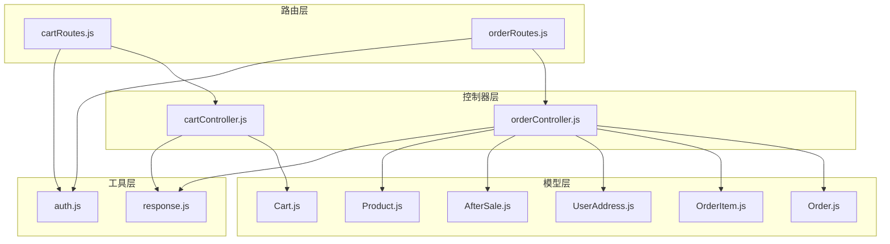
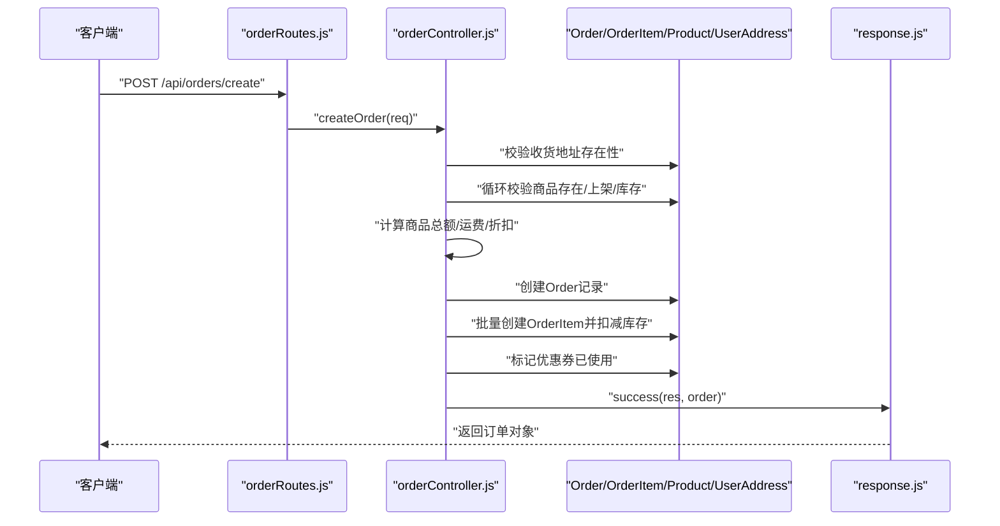
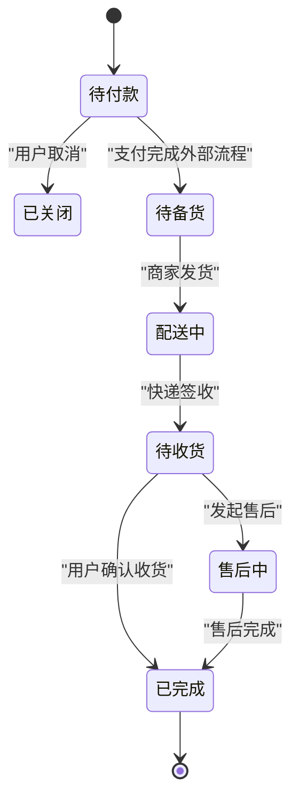
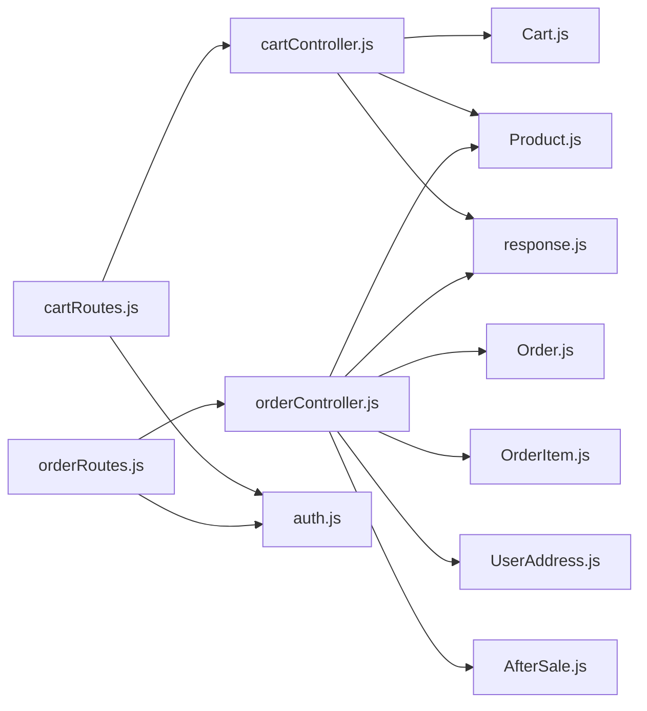

# 订单与购物车接口

<cite>
**本文档引用的文件**
- [cartController.js](file://backend/src/controllers/cartController.js)
- [orderController.js](file://backend/src/controllers/orderController.js)
- [cartRoutes.js](file://backend/src/routes/cartRoutes.js)
- [orderRoutes.js](file://backend/src/routes/orderRoutes.js)
- [Cart.js](file://backend/src/models/Cart.js)
- [Order.js](file://backend/src/models/Order.js)
- [OrderItem.js](file://backend/src/models/OrderItem.js)
- [UserAddress.js](file://backend/src/models/UserAddress.js)
- [AfterSale.js](file://backend/src/models/AfterSale.js)
- [Product.js](file://backend/src/models/Product.js)
- [response.js](file://backend/src/utils/response.js)
- [auth.js](file://backend/src/middlewares/auth.js)
</cite>

## 目录
1. [简介](#简介)
2. [项目结构](#项目结构)
3. [核心组件](#核心组件)
4. [架构总览](#架构总览)
5. [详细组件分析](#详细组件分析)
6. [依赖关系分析](#依赖关系分析)
7. [性能考虑](#性能考虑)
8. [故障排除指南](#故障排除指南)
9. [结论](#结论)
10. [附录](#附录)

## 简介
本文件为订单与购物车相关接口的完整API文档，覆盖购物车管理、订单创建、订单查询、订单状态更新、售后与评价、以及管理员端订单管理等能力。文档基于后端控制器、路由、模型与工具函数的实际实现整理而成，确保接口定义与业务逻辑一致。

## 项目结构
后端采用典型的分层架构：
- 路由层：定义HTTP端点与访问控制中间件
- 控制器层：实现业务逻辑与数据校验
- 模型层：定义数据库表结构与字段约束
- 工具层：统一响应格式与认证中间件

图表来源
- [cartRoutes.js:1-13](file://backend/src/routes/cartRoutes.js#L1-L13)
- [orderRoutes.js:1-18](file://backend/src/routes/orderRoutes.js#L1-L18)
- [cartController.js:1-138](file://backend/src/controllers/cartController.js#L1-L138)
- [orderController.js:1-609](file://backend/src/controllers/orderController.js#L1-L609)
- [Cart.js:1-50](file://backend/src/models/Cart.js#L1-L50)
- [Order.js:1-160](file://backend/src/models/Order.js#L1-L160)
- [OrderItem.js:1-68](file://backend/src/models/OrderItem.js#L1-L68)
- [UserAddress.js:1-86](file://backend/src/models/UserAddress.js#L1-L86)
- [AfterSale.js:1-85](file://backend/src/models/AfterSale.js#L1-L85)
- [Product.js:1-190](file://backend/src/models/Product.js#L1-L190)
- [response.js:1-32](file://backend/src/utils/response.js#L1-L32)
- [auth.js:1-181](file://backend/src/middlewares/auth.js#L1-L181)

章节来源
- [cartRoutes.js:1-13](file://backend/src/routes/cartRoutes.js#L1-L13)
- [orderRoutes.js:1-18](file://backend/src/routes/orderRoutes.js#L1-L18)
- [cartController.js:1-138](file://backend/src/controllers/cartController.js#L1-L138)
- [orderController.js:1-609](file://backend/src/controllers/orderController.js#L1-L609)
- [response.js:1-32](file://backend/src/utils/response.js#L1-L32)
- [auth.js:1-181](file://backend/src/middlewares/auth.js#L1-L181)

## 核心组件
- 购物车控制器：提供获取购物车、添加商品、修改数量/选中状态/忌口备注、删除单项、清空购物车等接口
- 订单控制器：提供创建订单、查询订单列表、订单详情、取消订单、确认收货、售后申请与列表、评价创建、管理员订单管理与导出等接口
- 数据模型：Cart、Order、OrderItem、UserAddress、AfterSale、Product等，支撑购物车与订单全生命周期
- 响应工具：统一success/error/paginate响应格式
- 认证中间件：提供强制认证与可选认证，保障接口安全

章节来源
- [cartController.js:1-138](file://backend/src/controllers/cartController.js#L1-L138)
- [orderController.js:1-609](file://backend/src/controllers/orderController.js#L1-L609)
- [Cart.js:1-50](file://backend/src/models/Cart.js#L1-L50)
- [Order.js:1-160](file://backend/src/models/Order.js#L1-L160)
- [OrderItem.js:1-68](file://backend/src/models/OrderItem.js#L1-L68)
- [UserAddress.js:1-86](file://backend/src/models/UserAddress.js#L1-L86)
- [AfterSale.js:1-85](file://backend/src/models/AfterSale.js#L1-L85)
- [Product.js:1-190](file://backend/src/models/Product.js#L1-L190)
- [response.js:1-32](file://backend/src/utils/response.js#L1-L32)
- [auth.js:1-181](file://backend/src/middlewares/auth.js#L1-L181)

## 架构总览
以下序列图展示“创建订单”从客户端到数据库的关键调用链路，包括地址校验、商品校验、库存扣减、优惠券核销、订单与订单项创建等步骤。

图表来源
- [orderRoutes.js:6](file://backend/src/routes/orderRoutes.js#L6)
- [orderController.js:6-124](file://backend/src/controllers/orderController.js#L6-L124)
- [Order.js:1-160](file://backend/src/models/Order.js#L1-L160)
- [OrderItem.js:1-68](file://backend/src/models/OrderItem.js#L1-L68)
- [Product.js:1-190](file://backend/src/models/Product.js#L1-L190)
- [UserAddress.js:1-86](file://backend/src/models/UserAddress.js#L1-L86)
- [response.js:1-15](file://backend/src/utils/response.js#L1-L15)

## 详细组件分析

### 购物车接口
- 获取购物车
  - 方法与路径：GET /api/carts
  - 认证：可选认证（游客可获取空购物车）
  - 功能：按用户维度查询购物车，计算选中商品总价与数量
  - 关键字段：items、totalAmount、selectedCount
  - 响应：success(data, message, code)
  - 错误：服务端异常统一返回error(message, code)

- 添加商品到购物车
  - 方法与路径：POST /api/carts/add
  - 认证：强制认证
  - 请求体参数：product_id、spec_id、quantity、dietary_note
  - 逻辑：若同款商品已存在则累加数量，否则新增一条购物车记录
  - 错误：商品不存在/未上架、添加失败

- 修改购物车项
  - 方法与路径：PUT /api/carts/:id
  - 认证：强制认证
  - 请求体参数：quantity、selected、dietary_note
  - 逻辑：仅允许修改当前用户的购物车项
  - 错误：购物车项不存在、更新失败

- 删除购物车项
  - 方法与路径：DELETE /api/carts/:id
  - 认证：强制认证
  - 逻辑：仅允许删除当前用户的购物车项
  - 错误：购物车项不存在、删除失败

- 清空购物车
  - 方法与路径：DELETE /api/carts
  - 认证：强制认证
  - 逻辑：删除当前用户所有购物车项
  - 错误：清空失败

章节来源
- [cartRoutes.js:6-10](file://backend/src/routes/cartRoutes.js#L6-L10)
- [cartController.js:4-35](file://backend/src/controllers/cartController.js#L4-L35)
- [cartController.js:37-70](file://backend/src/controllers/cartController.js#L37-L70)
- [cartController.js:72-96](file://backend/src/controllers/cartController.js#L72-L96)
- [cartController.js:98-116](file://backend/src/controllers/cartController.js#L98-L116)
- [cartController.js:118-129](file://backend/src/controllers/cartController.js#L118-L129)
- [response.js:1-15](file://backend/src/utils/response.js#L1-L15)
- [auth.js:150-178](file://backend/src/middlewares/auth.js#L150-L178)

### 订单接口
- 创建订单
  - 方法与路径：POST /api/orders/create
  - 认证：强制认证
  - 请求体参数：address_id、items[]、remark、user_coupon_id、delivery_method、invoice_type、invoice_title、invoice_tax_no
  - 校验逻辑：
    - 收货地址必须属于当前用户
    - 商品必须存在且处于上架状态，库存充足
    - 计算商品总额、运费（满99免邮）、折扣（优惠券门槛与有效期校验）
    - 生成唯一订单号，创建订单与订单明细，扣减商品库存
    - 使用优惠券时标记为已使用并绑定订单
  - 返回：订单对象
  - 错误：地址不存在、商品不存在/下架/库存不足、优惠券无效、创建失败

- 查询订单列表
  - 方法与路径：GET /api/orders
  - 认证：强制认证
  - 查询参数：page、pageSize、status
  - 返回：分页数据（data、total、page、pageSize）

- 订单详情
  - 方法与路径：GET /api/orders/:id
  - 认证：强制认证
  - 返回：订单及包含的订单项、收货地址信息
  - 错误：订单不存在或非本人订单

- 取消订单
  - 方法与路径：PUT /api/orders/:id/cancel
  - 认证：强制认证
  - 限制：仅待付款状态可取消
  - 行为：将订单状态置为已关闭，并回退商品库存

- 确认收货
  - 方法与路径：PUT /api/orders/:id/confirm
  - 认证：强制认证
  - 限制：仅待收货状态可确认
  - 行为：将订单状态置为已完成

- 售后申请
  - 方法与路径：POST /api/orders/after-sales
  - 认证：强制认证
  - 请求体参数：order_id、order_item_id、type、reason、images[]
  - 限制：仅已完成订单可申请售后
  - 返回：售后单对象

- 售后列表
  - 方法与路径：GET /api/orders/after-sales/list
  - 认证：强制认证
  - 返回：分页的售后记录

- 评价创建
  - 方法与路径：POST /api/orders/reviews
  - 认证：强制认证
  - 请求体参数：order_item_id、rating、content、images[]
  - 限制：仅已完成订单可评价；同一订单项不可重复评价
  - 返回：评价对象

章节来源
- [orderRoutes.js:6-15](file://backend/src/routes/orderRoutes.js#L6-L15)
- [orderController.js:6-124](file://backend/src/controllers/orderController.js#L6-L124)
- [orderController.js:126-152](file://backend/src/controllers/orderController.js#L126-L152)
- [orderController.js:154-187](file://backend/src/controllers/orderController.js#L154-L187)
- [orderController.js:189-222](file://backend/src/controllers/orderController.js#L189-L222)
- [orderController.js:224-243](file://backend/src/controllers/orderController.js#L224-L243)
- [orderController.js:245-273](file://backend/src/controllers/orderController.js#L245-L273)
- [orderController.js:275-296](file://backend/src/controllers/orderController.js#L275-L296)
- [orderController.js:298-335](file://backend/src/controllers/orderController.js#L298-L335)
- [response.js:1-29](file://backend/src/utils/response.js#L1-L29)
- [auth.js:4-148](file://backend/src/middlewares/auth.js#L4-L148)

### 订单状态流转
订单状态枚举（数字到中文映射）：
- 0：待付款
- 1：待备货
- 2：配送中
- 3：待收货
- 4：已完成
- 5：售后中
- 6：已关闭

状态转换流程（概念图）：

说明：
- 本系统支持的状态转换以业务约束为准，例如“确认收货”仅在待收货状态下允许；“取消订单”仅在待付款状态下允许。
- 支付完成属于外部流程，订单状态需由管理员或回调机制更新至“待备货”。

章节来源
- [orderController.js:189-222](file://backend/src/controllers/orderController.js#L189-L222)
- [orderController.js:224-243](file://backend/src/controllers/orderController.js#L224-L243)
- [Order.js:111-116](file://backend/src/models/Order.js#L111-L116)

### 数据模型与字段说明
- 购物车（Cart）
  - 字段要点：user_id、product_id、spec_id、quantity、selected、dietary_note
  - 关系：与Product通过product_id关联，用于购物车展示与结算

- 订单（Order）
  - 字段要点：order_no、user_id、address_id、total_amount、discount_amount、freight、pay_amount、coupon_id、delivery_method、invoice_*、status、时间戳字段
  - 关系：与UserAddress关联获取收货信息；与OrderItem关联形成订单明细

- 订单项（OrderItem）
  - 字段要点：order_id、product_id、product_name、product_image、spec_name、price、quantity、total_price、dietary_note
  - 关系：与Order、Product关联，保存下单时的商品快照

- 用户地址（UserAddress）
  - 字段要点：user_id、real_name、phone、province、city、district、detail_address、full_address、is_default
  - 关系：与Order关联，作为收货信息

- 售后（AfterSale）
  - 字段要点：after_sale_no、order_id、order_item_id、user_id、type、reason、images、refund_amount、status、时间戳字段
  - 关系：与Order、OrderItem关联，记录售后流程

- 商品（Product）
  - 字段要点：name、main_image、price、member_price、stock、sales、is_on_sale等
  - 关系：被OrderItem引用，作为下单时的价格与库存快照

章节来源
- [Cart.js:1-50](file://backend/src/models/Cart.js#L1-L50)
- [Order.js:1-160](file://backend/src/models/Order.js#L1-L160)
- [OrderItem.js:1-68](file://backend/src/models/OrderItem.js#L1-L68)
- [UserAddress.js:1-86](file://backend/src/models/UserAddress.js#L1-L86)
- [AfterSale.js:1-85](file://backend/src/models/AfterSale.js#L1-L85)
- [Product.js:1-190](file://backend/src/models/Product.js#L1-L190)

### 统一响应与认证
- 统一响应
  - 成功响应：success(res, data, message, statusCode)
  - 失败响应：error(res, message, statusCode, errors)
  - 分页响应：paginate(res, data, pagination, message)
- 认证中间件
  - 强制认证：auth，校验Bearer Token、用户存在性、启用状态
  - 可选认证：optionalAuth，仅在携带有效Token时注入用户上下文

章节来源
- [response.js:1-32](file://backend/src/utils/response.js#L1-L32)
- [auth.js:4-148](file://backend/src/middlewares/auth.js#L4-L148)
- [auth.js:150-178](file://backend/src/middlewares/auth.js#L150-L178)

## 依赖关系分析
- 路由到控制器：cartRoutes与orderRoutes分别挂载到对应控制器方法
- 控制器到模型：购物车与订单控制器均依赖相应模型进行数据读写
- 控制器到工具：统一使用response.js输出标准响应
- 路由到中间件：购物车路由对GET使用可选认证，其余使用强制认证；订单路由全部使用强制认证

图表来源
- [cartRoutes.js:1-13](file://backend/src/routes/cartRoutes.js#L1-L13)
- [orderRoutes.js:1-18](file://backend/src/routes/orderRoutes.js#L1-L18)
- [cartController.js:1-138](file://backend/src/controllers/cartController.js#L1-L138)
- [orderController.js:1-609](file://backend/src/controllers/orderController.js#L1-L609)
- [Cart.js:1-50](file://backend/src/models/Cart.js#L1-L50)
- [Order.js:1-160](file://backend/src/models/Order.js#L1-L160)
- [OrderItem.js:1-68](file://backend/src/models/OrderItem.js#L1-L68)
- [UserAddress.js:1-86](file://backend/src/models/UserAddress.js#L1-L86)
- [AfterSale.js:1-85](file://backend/src/models/AfterSale.js#L1-L85)
- [Product.js:1-190](file://backend/src/models/Product.js#L1-L190)
- [response.js:1-32](file://backend/src/utils/response.js#L1-L32)
- [auth.js:1-181](file://backend/src/middlewares/auth.js#L1-L181)

章节来源
- [cartRoutes.js:1-13](file://backend/src/routes/cartRoutes.js#L1-L13)
- [orderRoutes.js:1-18](file://backend/src/routes/orderRoutes.js#L1-L18)
- [cartController.js:1-138](file://backend/src/controllers/cartController.js#L1-L138)
- [orderController.js:1-609](file://backend/src/controllers/orderController.js#L1-L609)
- [response.js:1-32](file://backend/src/utils/response.js#L1-L32)
- [auth.js:1-181](file://backend/src/middlewares/auth.js#L1-L181)

## 性能考虑
- 购物车查询：按用户ID过滤，包含商品信息并按创建时间倒序，适合中等规模数据；建议对user_id建立索引
- 订单查询：支持按状态与分页查询，建议对user_id、status、created_at建立复合索引
- 订单创建：循环校验商品与库存、计算金额、批量插入订单项，注意事务与并发控制；建议在高并发场景下使用数据库事务包裹
- 导出功能：Excel导出使用XLSX库，大数据量时建议异步任务与分批导出

## 故障排除指南
- 401 未提供认证令牌/无效或过期的令牌/令牌中未包含用户ID
  - 排查：确认请求头Authorization格式为Bearer Token，检查token有效性与用户状态
- 403 账号已被禁用
  - 排查：用户状态status不为1或被拉黑
- 404 地址不存在/订单不存在/购物车项不存在
  - 排查：确认资源归属与存在性
- 400 库存不足/未满足优惠券使用门槛/订单状态不允许
  - 排查：检查商品库存、优惠券有效期与订单状态机
- 500 服务端异常
  - 排查：查看后端日志，定位具体控制器方法中的异常

章节来源
- [auth.js:4-148](file://backend/src/middlewares/auth.js#L4-L148)
- [cartController.js:37-70](file://backend/src/controllers/cartController.js#L37-L70)
- [cartController.js:72-96](file://backend/src/controllers/cartController.js#L72-L96)
- [cartController.js:98-116](file://backend/src/controllers/cartController.js#L98-L116)
- [orderController.js:6-124](file://backend/src/controllers/orderController.js#L6-L124)
- [orderController.js:126-152](file://backend/src/controllers/orderController.js#L126-L152)
- [orderController.js:154-187](file://backend/src/controllers/orderController.js#L154-L187)
- [orderController.js:189-222](file://backend/src/controllers/orderController.js#L189-L222)
- [orderController.js:224-243](file://backend/src/controllers/orderController.js#L224-L243)

## 结论
本API文档基于实际代码实现，覆盖了购物车与订单的核心业务流程。通过明确的接口规范、状态机约束与统一响应格式，能够帮助前后端协作与后续扩展。建议在生产环境中配合完善的日志、监控与测试用例，确保接口稳定性与一致性。

## 附录

### 请求与响应示例（路径引用）
- 获取购物车
  - 请求：GET /api/carts
  - 响应：success({ items, totalAmount, selectedCount })
  - 参考：[cartController.js:4-35](file://backend/src/controllers/cartController.js#L4-L35)

- 添加商品到购物车
  - 请求：POST /api/carts/add
  - 请求体：{ product_id, spec_id, quantity, dietary_note }
  - 响应：success(null, "添加成功")
  - 参考：[cartController.js:37-70](file://backend/src/controllers/cartController.js#L37-L70)

- 修改购物车项
  - 请求：PUT /api/carts/:id
  - 请求体：{ quantity, selected, dietary_note }
  - 响应：success(null, "更新成功")
  - 参考：[cartController.js:72-96](file://backend/src/controllers/cartController.js#L72-L96)

- 删除购物车项
  - 请求：DELETE /api/carts/:id
  - 响应：success(null, "删除成功")
  - 参考：[cartController.js:98-116](file://backend/src/controllers/cartController.js#L98-L116)

- 清空购物车
  - 请求：DELETE /api/carts
  - 响应：success(null, "清空成功")
  - 参考：[cartController.js:118-129](file://backend/src/controllers/cartController.js#L118-L129)

- 创建订单
  - 请求：POST /api/orders/create
  - 请求体：{ address_id, items[], remark, user_coupon_id, delivery_method, invoice_type, invoice_title, invoice_tax_no }
  - 响应：success(order, "订单创建成功")
  - 参考：[orderController.js:6-124](file://backend/src/controllers/orderController.js#L6-L124)

- 订单列表
  - 请求：GET /api/orders?page=1&pageSize=10&status=0
  - 响应：success({ data, total, page, pageSize })
  - 参考：[orderController.js:126-152](file://backend/src/controllers/orderController.js#L126-L152)

- 订单详情
  - 请求：GET /api/orders/:id
  - 响应：success(order)
  - 参考：[orderController.js:154-187](file://backend/src/controllers/orderController.js#L154-L187)

- 取消订单
  - 请求：PUT /api/orders/:id/cancel
  - 响应：success(null, "订单已取消")
  - 参考：[orderController.js:189-222](file://backend/src/controllers/orderController.js#L189-L222)

- 确认收货
  - 请求：PUT /api/orders/:id/confirm
  - 响应：success(null, "已确认收货")
  - 参考：[orderController.js:224-243](file://backend/src/controllers/orderController.js#L224-L243)

- 售后申请
  - 请求：POST /api/orders/after-sales
  - 请求体：{ order_id, order_item_id, type, reason, images[] }
  - 响应：success(afterSale, "售后申请已提交")
  - 参考：[orderController.js:245-273](file://backend/src/controllers/orderController.js#L245-L273)

- 售后列表
  - 请求：GET /api/orders/after-sales/list?page=1&pageSize=10
  - 响应：success({ data, total, page, pageSize })
  - 参考：[orderController.js:275-296](file://backend/src/controllers/orderController.js#L275-L296)

- 评价创建
  - 请求：POST /api/orders/reviews
  - 请求体：{ order_item_id, rating, content, images[] }
  - 响应：success(review, "评价成功")
  - 参考：[orderController.js:298-335](file://backend/src/controllers/orderController.js#L298-L335)