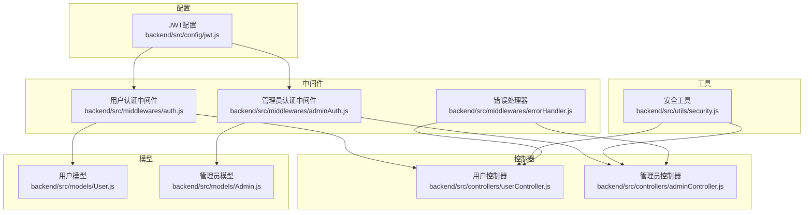
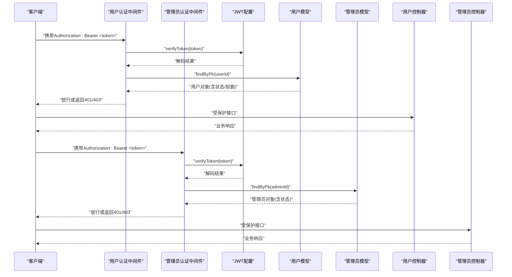
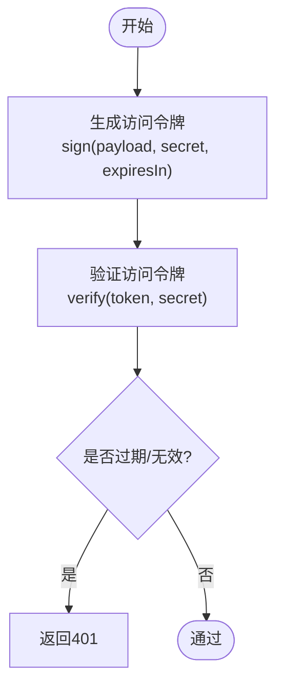
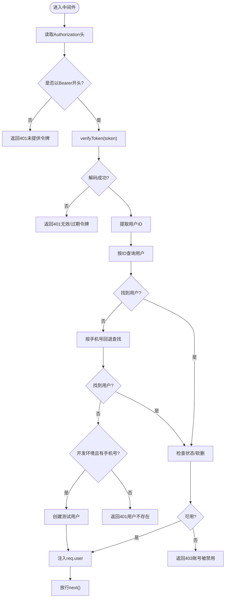
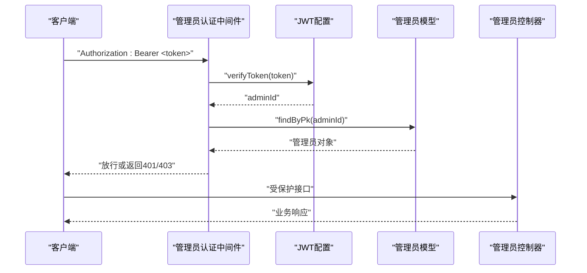
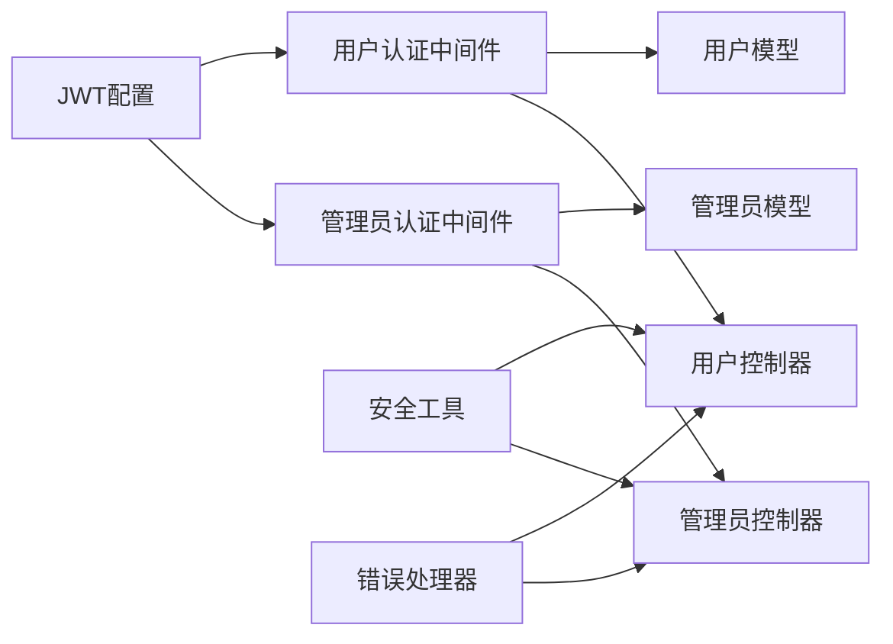

# 认证与安全机制

<cite>
**本文引用的文件**
- [backend/src/config/jwt.js](file://backend/src/config/jwt.js)
- [backend/src/middlewares/auth.js](file://backend/src/middlewares/auth.js)
- [backend/src/middlewares/adminAuth.js](file://backend/src/middlewares/adminAuth.js)
- [backend/src/middlewares/errorHandler.js](file://backend/src/middlewares/errorHandler.js)
- [backend/src/utils/security.js](file://backend/src/utils/security.js)
- [backend/src/controllers/userController.js](file://backend/src/controllers/userController.js)
- [backend/src/controllers/adminController.js](file://backend/src/controllers/adminController.js)
- [backend/src/models/User.js](file://backend/src/models/User.js)
- [backend/src/models/Admin.js](file://backend/src/models/Admin.js)
</cite>

## 目录
1. [简介](#简介)
2. [项目结构](#项目结构)
3. [核心组件](#核心组件)
4. [架构总览](#架构总览)
5. [详细组件分析](#详细组件分析)
6. [依赖关系分析](#依赖关系分析)
7. [性能考量](#性能考量)
8. [故障排查指南](#故障排查指南)
9. [结论](#结论)
10. [附录](#附录)

## 简介
本文件系统化梳理后端API的认证与安全机制，覆盖JWT令牌生成与验证、刷新流程、用户与管理员认证中间件、错误处理、安全配置（CORS、CSRF、输入校验）、API版本与兼容策略、安全最佳实践、测试与调试注意事项以及HTTPS与证书管理要求。目标是帮助开发者快速理解并正确配置与扩展认证体系。

## 项目结构
围绕认证与安全的关键目录与文件如下：
- 配置层：JWT密钥与过期策略、日志与环境变量
- 中间件层：通用用户认证、可选认证、管理员认证与权限控制
- 控制器层：用户与管理员登录、资料、密码管理等
- 模型层：用户与管理员实体、密码哈希与比较
- 工具层：加解密与敏感信息脱敏

图表来源
- [backend/src/config/jwt.js:1-41](file://backend/src/config/jwt.js#L1-L41)
- [backend/src/middlewares/auth.js:1-181](file://backend/src/middlewares/auth.js#L1-L181)
- [backend/src/middlewares/adminAuth.js:1-77](file://backend/src/middlewares/adminAuth.js#L1-L77)
- [backend/src/middlewares/errorHandler.js:1-47](file://backend/src/middlewares/errorHandler.js#L1-L47)
- [backend/src/controllers/userController.js:1-426](file://backend/src/controllers/userController.js#L1-L426)
- [backend/src/controllers/adminController.js:1-457](file://backend/src/controllers/adminController.js#L1-L457)
- [backend/src/models/User.js:1-150](file://backend/src/models/User.js#L1-L150)
- [backend/src/models/Admin.js:1-96](file://backend/src/models/Admin.js#L1-L96)
- [backend/src/utils/security.js:1-48](file://backend/src/utils/security.js#L1-L48)

章节来源
- [backend/src/config/jwt.js:1-41](file://backend/src/config/jwt.js#L1-L41)
- [backend/src/middlewares/auth.js:1-181](file://backend/src/middlewares/auth.js#L1-L181)
- [backend/src/middlewares/adminAuth.js:1-77](file://backend/src/middlewares/adminAuth.js#L1-L77)
- [backend/src/middlewares/errorHandler.js:1-47](file://backend/src/middlewares/errorHandler.js#L1-L47)
- [backend/src/utils/security.js:1-48](file://backend/src/utils/security.js#L1-L48)
- [backend/src/controllers/userController.js:1-426](file://backend/src/controllers/userController.js#L1-L426)
- [backend/src/controllers/adminController.js:1-457](file://backend/src/controllers/adminController.js#L1-L457)
- [backend/src/models/User.js:1-150](file://backend/src/models/User.js#L1-L150)
- [backend/src/models/Admin.js:1-96](file://backend/src/models/Admin.js#L1-L96)

## 核心组件
- JWT配置与工具：统一管理签名密钥、过期时间、签发与校验函数
- 用户认证中间件：强制校验Bearer令牌，解析用户并注入上下文
- 可选认证中间件：在令牌存在时尝试解析用户，失败不中断流程
- 管理员认证中间件：校验管理员令牌与状态，并支持角色权限检查
- 错误处理器：标准化错误响应与日志记录
- 安全工具：对敏感字段进行加解密与脱敏显示
- 用户/管理员控制器：登录、资料、密码管理等业务接口
- 用户/管理员模型：密码哈希、比较、软删除与状态控制

章节来源
- [backend/src/config/jwt.js:1-41](file://backend/src/config/jwt.js#L1-L41)
- [backend/src/middlewares/auth.js:1-181](file://backend/src/middlewares/auth.js#L1-L181)
- [backend/src/middlewares/adminAuth.js:1-77](file://backend/src/middlewares/adminAuth.js#L1-L77)
- [backend/src/middlewares/errorHandler.js:1-47](file://backend/src/middlewares/errorHandler.js#L1-L47)
- [backend/src/utils/security.js:1-48](file://backend/src/utils/security.js#L1-L48)
- [backend/src/controllers/userController.js:1-426](file://backend/src/controllers/userController.js#L1-L426)
- [backend/src/controllers/adminController.js:1-457](file://backend/src/controllers/adminController.js#L1-L457)
- [backend/src/models/User.js:1-150](file://backend/src/models/User.js#L1-L150)
- [backend/src/models/Admin.js:1-96](file://backend/src/models/Admin.js#L1-L96)

## 架构总览
下图展示从客户端到控制器的认证与安全流程，包括用户与管理员两条路径。

图表来源
- [backend/src/middlewares/auth.js:1-181](file://backend/src/middlewares/auth.js#L1-L181)
- [backend/src/middlewares/adminAuth.js:1-77](file://backend/src/middlewares/adminAuth.js#L1-L77)
- [backend/src/config/jwt.js:1-41](file://backend/src/config/jwt.js#L1-L41)
- [backend/src/models/User.js:1-150](file://backend/src/models/User.js#L1-L150)
- [backend/src/models/Admin.js:1-96](file://backend/src/models/Admin.js#L1-L96)
- [backend/src/controllers/userController.js:1-426](file://backend/src/controllers/userController.js#L1-L426)
- [backend/src/controllers/adminController.js:1-457](file://backend/src/controllers/adminController.js#L1-L457)

## 详细组件分析

### JWT配置与令牌生命周期
- 密钥与过期策略：分别配置访问令牌与刷新令牌的密钥与过期时间，支持通过环境变量覆盖默认值
- 生成与验证：提供生成访问令牌、生成刷新令牌、验证访问令牌、验证刷新令牌的统一接口
- 使用建议：生产环境务必设置强随机密钥与合理过期时间；避免在令牌中存放敏感信息

图表来源
- [backend/src/config/jwt.js:1-41](file://backend/src/config/jwt.js#L1-L41)

章节来源
- [backend/src/config/jwt.js:1-41](file://backend/src/config/jwt.js#L1-L41)

### 用户认证中间件（强制）
- 请求头校验：要求Authorization以Bearer开头
- 令牌验证：调用JWT验证函数，提取用户ID
- 数据库校验：按ID查询用户，排除敏感字段；若ID不匹配则回退按手机号查找
- 账户状态：软删除、禁用、拉黑均拒绝访问
- 开发模式回退：当手机号存在且为开发环境时，可自动创建测试用户
- 异常处理：捕获异常并返回统一401

图表来源
- [backend/src/middlewares/auth.js:1-181](file://backend/src/middlewares/auth.js#L1-L181)

章节来源
- [backend/src/middlewares/auth.js:1-181](file://backend/src/middlewares/auth.js#L1-L181)

### 用户认证中间件（可选）
- 仅在存在有效令牌时尝试解析用户
- 解析成功且用户状态正常则注入req.user，否则继续放行
- 异常时安全降级，调用next()

章节来源
- [backend/src/middlewares/auth.js:150-178](file://backend/src/middlewares/auth.js#L150-L178)

### 管理员认证中间件与角色控制
- 令牌校验：要求Bearer格式，解码后必须包含adminId
- 账户校验：按ID查询管理员，检查状态
- 角色控制：提供requireRole高阶函数，支持超级管理员豁免与角色白名单

图表来源
- [backend/src/middlewares/adminAuth.js:1-77](file://backend/src/middlewares/adminAuth.js#L1-L77)
- [backend/src/config/jwt.js:1-41](file://backend/src/config/jwt.js#L1-L41)
- [backend/src/models/Admin.js:1-96](file://backend/src/models/Admin.js#L1-L96)

章节来源
- [backend/src/middlewares/adminAuth.js:1-77](file://backend/src/middlewares/adminAuth.js#L1-L77)

### 错误处理与错误码
- 统一错误响应：根据错误类型映射HTTP状态码与消息
- 常见错误类型：数据验证失败、未授权、禁止访问、资源不存在、资源冲突
- 开发/生产差异：生产环境隐藏堆栈细节，开发环境输出详细信息
- 404处理：单独的notFoundHandler

章节来源
- [backend/src/middlewares/errorHandler.js:1-47](file://backend/src/middlewares/errorHandler.js#L1-L47)

### 安全工具与敏感信息处理
- 对称加解密：基于对称密钥的AES加解密，用于特定字段的加密存储与解密展示
- 敏感信息脱敏：手机号、姓名、身份证、邮箱的脱敏显示策略
- 使用建议：密钥需妥善保管；脱敏仅用于展示，不替代数据库字段设计

章节来源
- [backend/src/utils/security.js:1-48](file://backend/src/utils/security.js#L1-L48)

### 用户与管理员控制器中的认证集成
- 用户登录：校验手机号与密码，成功后签发访问令牌
- 管理员登录：校验用户名与密码，成功后签发管理员令牌
- 其他接口：依赖中间件注入的req.user或req.admin进行业务处理

章节来源
- [backend/src/controllers/userController.js:45-94](file://backend/src/controllers/userController.js#L45-L94)
- [backend/src/controllers/adminController.js:8-49](file://backend/src/controllers/adminController.js#L8-L49)

### 模型层的认证支撑
- 用户模型：密码哈希与比较、软删除、状态字段
- 管理员模型：密码哈希与比较、角色与权限、状态字段

章节来源
- [backend/src/models/User.js:131-147](file://backend/src/models/User.js#L131-L147)
- [backend/src/models/Admin.js:77-93](file://backend/src/models/Admin.js#L77-L93)

## 依赖关系分析
- 中间件依赖JWT配置与模型层
- 控制器依赖中间件与模型层
- 安全工具独立于业务逻辑，可被控制器复用
- 错误处理器作为全局中间件，位于路由之前

图表来源
- [backend/src/config/jwt.js:1-41](file://backend/src/config/jwt.js#L1-L41)
- [backend/src/middlewares/auth.js:1-181](file://backend/src/middlewares/auth.js#L1-L181)
- [backend/src/middlewares/adminAuth.js:1-77](file://backend/src/middlewares/adminAuth.js#L1-L77)
- [backend/src/middlewares/errorHandler.js:1-47](file://backend/src/middlewares/errorHandler.js#L1-L47)
- [backend/src/utils/security.js:1-48](file://backend/src/utils/security.js#L1-L48)
- [backend/src/controllers/userController.js:1-426](file://backend/src/controllers/userController.js#L1-L426)
- [backend/src/controllers/adminController.js:1-457](file://backend/src/controllers/adminController.js#L1-L457)
- [backend/src/models/User.js:1-150](file://backend/src/models/User.js#L1-L150)
- [backend/src/models/Admin.js:1-96](file://backend/src/models/Admin.js#L1-L96)

章节来源
- [backend/src/config/jwt.js:1-41](file://backend/src/config/jwt.js#L1-L41)
- [backend/src/middlewares/auth.js:1-181](file://backend/src/middlewares/auth.js#L1-L181)
- [backend/src/middlewares/adminAuth.js:1-77](file://backend/src/middlewares/adminAuth.js#L1-L77)
- [backend/src/middlewares/errorHandler.js:1-47](file://backend/src/middlewares/errorHandler.js#L1-L47)
- [backend/src/utils/security.js:1-48](file://backend/src/utils/security.js#L1-L48)
- [backend/src/controllers/userController.js:1-426](file://backend/src/controllers/userController.js#L1-L426)
- [backend/src/controllers/adminController.js:1-457](file://backend/src/controllers/adminController.js#L1-L457)
- [backend/src/models/User.js:1-150](file://backend/src/models/User.js#L1-L150)
- [backend/src/models/Admin.js:1-96](file://backend/src/models/Admin.js#L1-L96)

## 性能考量
- 令牌验证成本低，主要开销在数据库查询与密码比对
- 建议在网关或反向代理层缓存频繁访问的公开接口
- 对用户/管理员查询使用索引字段（如ID、手机号），避免全表扫描
- 合理设置令牌过期时间，平衡安全性与用户体验

## 故障排查指南
- 401 未提供认证令牌：确认请求头Authorization格式为Bearer <token>
- 401 无效或过期的令牌：检查密钥一致性与过期时间
- 401 令牌中未包含用户ID：检查签发payload是否包含id或userId
- 401 用户不存在：确认用户ID存在且未软删除、未禁用、未拉黑
- 403 账号已被禁用：检查用户状态与黑名单标记
- 401 管理员不存在/账号被禁用：检查管理员ID与状态
- 401 权限不足：确认管理员角色是否满足requireRole要求
- 500 服务器内部错误：查看日志中的错误堆栈定位问题

章节来源
- [backend/src/middlewares/auth.js:1-181](file://backend/src/middlewares/auth.js#L1-L181)
- [backend/src/middlewares/adminAuth.js:1-77](file://backend/src/middlewares/adminAuth.js#L1-L77)
- [backend/src/middlewares/errorHandler.js:1-47](file://backend/src/middlewares/errorHandler.js#L1-L47)

## 结论
本项目采用JWT作为统一认证载体，结合用户与管理员双通道认证中间件、严格的账户状态校验与可选认证策略，形成完整的认证与授权闭环。配合标准化错误处理与安全工具，能够满足大多数Web应用的安全需求。建议在生产环境中强化密钥管理、引入刷新令牌策略、完善审计日志与监控告警。

## 附录

### API请求安全防护要点
- CORS配置：明确允许来源、方法与头部，避免通配符滥用
- CSRF防护：对无Cookie上下文的API通常无需CSRF；若使用Cookie会话，应启用同源策略与Samesite Cookie
- 输入验证：对所有入参进行类型与范围校验，结合ORM约束与白名单策略
- 速率限制：对登录与验证码接口实施限流，降低暴力破解风险
- 日志与审计：记录关键操作与异常事件，便于追踪与取证

### API版本管理与向后兼容
- 版本策略：建议在URL路径或请求头中显式声明版本号
- 兼容策略：新增字段采用默认值；移除字段保留但标注废弃；严格遵循语义化版本控制
- 文档同步：版本变更需同步更新接口文档与迁移指南

### 安全最佳实践
- 强密码策略：最小长度、复杂度与定期更换
- 最小权限原则：管理员角色细分，接口粒度授权
- 传输安全：强制HTTPS，禁用弱密码套件与协议
- 密钥管理：密钥轮换、环境变量隔离、CI/CD安全注入
- 令牌安全：短令牌有效期、服务端存储刷新令牌、撤销机制

### 测试与调试安全注意事项
- 测试环境：避免使用生产密钥；清理测试数据与临时令牌
- 调试日志：避免输出敏感信息；生产环境关闭详细堆栈
- 接口测试：模拟401/403场景，验证错误处理与提示

### HTTPS配置与证书管理
- 证书：优先使用受信任CA签发的证书；支持OCSP Stapling
- 协议与套件：禁用SSLv2/3、TLS_FALLBACK_SCSV；启用HSTS
- 证书更新：自动化续期与滚动部署，确保零停机
- 中间件：在反向代理层统一终止TLS，后端保持明文通信或内网HTTPS