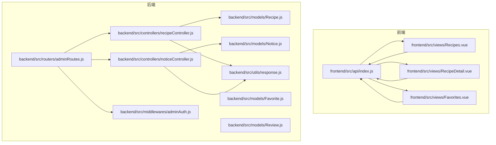
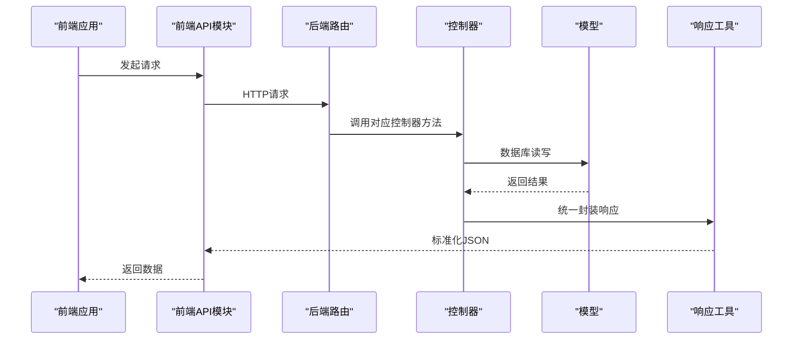
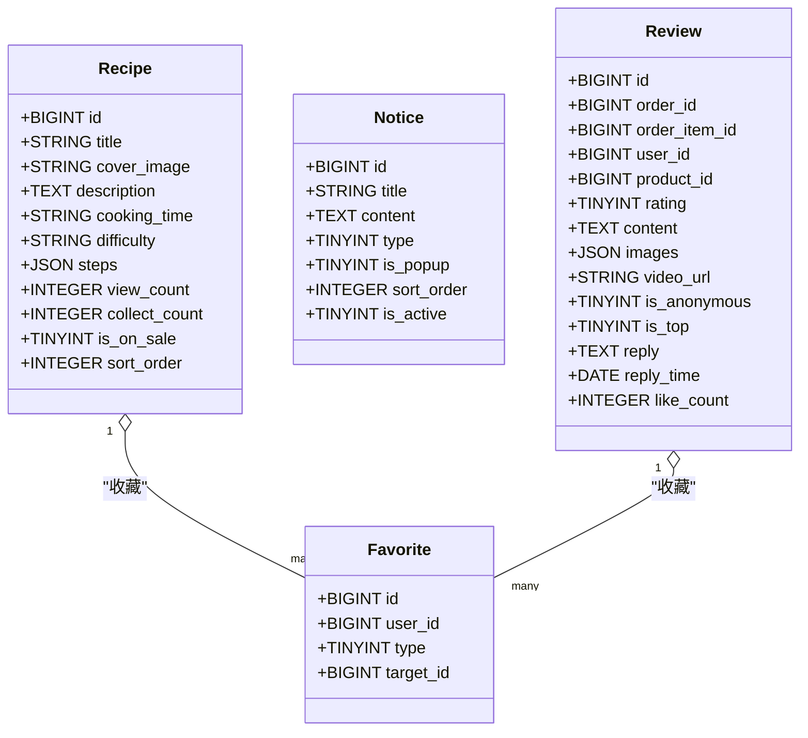

# 食谱内容接口

<cite>
**本文引用的文件**
- [backend/src/controllers/recipeController.js](file://backend/src/controllers/recipeController.js)
- [backend/src/controllers/noticeController.js](file://backend/src/controllers/noticeController.js)
- [backend/src/models/Recipe.js](file://backend/src/models/Recipe.js)
- [backend/src/models/Notice.js](file://backend/src/models/Notice.js)
- [backend/src/models/Favorite.js](file://backend/src/models/Favorite.js)
- [backend/src/models/Review.js](file://backend/src/models/Review.js)
- [backend/src/routers/adminRoutes.js](file://backend/src/routers/adminRoutes.js)
- [backend/src/middlewares/adminAuth.js](file://backend/src/middlewares/adminAuth.js)
- [backend/src/utils/response.js](file://backend/src/utils/response.js)
- [backend/src/config/constants.js](file://backend/src/config/constants.js)
- [frontend/src/api/index.js](file://frontend/src/api/index.js)
- [frontend/src/views/RecipeDetail.vue](file://frontend/src/views/RecipeDetail.vue)
- [frontend/src/views/Recipes.vue](file://frontend/src/views/Recipes.vue)
- [frontend/src/views/Favorites.vue](file://frontend/src/views/Favorites.vue)
- [database/schema.sql](file://database/schema.sql)
</cite>

## 目录
1. [简介](#简介)
2. [项目结构](#项目结构)
3. [核心组件](#核心组件)
4. [架构总览](#架构总览)
5. [详细组件分析](#详细组件分析)
6. [依赖关系分析](#依赖关系分析)
7. [性能考量](#性能考量)
8. [故障排查指南](#故障排查指南)
9. [结论](#结论)
10. [附录](#附录)

## 简介
本文件为“食谱与内容管理”相关接口的权威API文档，覆盖以下能力：
- 食谱列表查询、食谱详情查看
- 食谱收藏与取消收藏、收藏列表查询
- 食谱评论体系（含评价、回复、点赞等）
- 公告管理（首页公告展示与后台管理）
- 内容权限控制与审核机制说明
- 请求与响应示例路径指引（以源码为准）

## 项目结构
后端采用控制器-模型-路由-中间件分层，前端通过统一API模块调用后端接口。

图表来源
- [backend/src/routers/adminRoutes.js:1-80](file://backend/src/routers/adminRoutes.js#L1-L80)
- [backend/src/controllers/recipeController.js:1-126](file://backend/src/controllers/recipeController.js#L1-L126)
- [backend/src/controllers/noticeController.js:1-89](file://backend/src/controllers/noticeController.js#L1-L89)
- [backend/src/models/Recipe.js:1-124](file://backend/src/models/Recipe.js#L1-L124)
- [backend/src/models/Notice.js:1-52](file://backend/src/models/Notice.js#L1-L52)
- [backend/src/models/Favorite.js:1-33](file://backend/src/models/Favorite.js#L1-L33)
- [backend/src/models/Review.js:1-86](file://backend/src/models/Review.js#L1-L86)
- [backend/src/middlewares/adminAuth.js:1-77](file://backend/src/middlewares/adminAuth.js#L1-L77)
- [backend/src/utils/response.js:1-32](file://backend/src/utils/response.js#L1-L32)
- [frontend/src/api/index.js:1-136](file://frontend/src/api/index.js#L1-L136)
- [frontend/src/views/Recipes.vue:1-228](file://frontend/src/views/Recipes.vue#L1-L228)
- [frontend/src/views/RecipeDetail.vue:1-328](file://frontend/src/views/RecipeDetail.vue#L1-L328)
- [frontend/src/views/Favorites.vue:1-96](file://frontend/src/views/Favorites.vue#L1-L96)

章节来源
- [backend/src/routers/adminRoutes.js:1-80](file://backend/src/routers/adminRoutes.js#L1-L80)
- [frontend/src/api/index.js:1-136](file://frontend/src/api/index.js#L1-L136)

## 核心组件
- 食谱控制器：提供食谱的增删改查与列表检索
- 公告控制器：提供公告的增删改查与列表检索
- 模型定义：Recipe、Notice、Favorite、Review
- 权限中间件：管理员鉴权与角色校验
- 响应工具：统一封装成功/失败响应与分页格式

章节来源
- [backend/src/controllers/recipeController.js:1-126](file://backend/src/controllers/recipeController.js#L1-L126)
- [backend/src/controllers/noticeController.js:1-89](file://backend/src/controllers/noticeController.js#L1-L89)
- [backend/src/models/Recipe.js:1-124](file://backend/src/models/Recipe.js#L1-L124)
- [backend/src/models/Notice.js:1-52](file://backend/src/models/Notice.js#L1-L52)
- [backend/src/models/Favorite.js:1-33](file://backend/src/models/Favorite.js#L1-L33)
- [backend/src/models/Review.js:1-86](file://backend/src/models/Review.js#L1-L86)
- [backend/src/middlewares/adminAuth.js:1-77](file://backend/src/middlewares/adminAuth.js#L1-L77)
- [backend/src/utils/response.js:1-32](file://backend/src/utils/response.js#L1-L32)

## 架构总览
后端通过路由将请求分发至对应控制器，控制器使用模型进行数据库操作，并通过响应工具返回标准格式。管理员端接口均受鉴权中间件保护。

图表来源
- [backend/src/routers/adminRoutes.js:1-80](file://backend/src/routers/adminRoutes.js#L1-L80)
- [backend/src/controllers/recipeController.js:1-126](file://backend/src/controllers/recipeController.js#L1-L126)
- [backend/src/controllers/noticeController.js:1-89](file://backend/src/controllers/noticeController.js#L1-L89)
- [backend/src/utils/response.js:1-32](file://backend/src/utils/response.js#L1-L32)

## 详细组件分析

### 食谱接口（管理员端）
- 列表查询
  - 方法：GET
  - 路径：/admin/recipes
  - 查询参数：page、pageSize、keyword
  - 响应：分页数据，包含总数、当前页、每页条数
- 详情查询
  - 方法：GET
  - 路径：/admin/recipes/:id
  - 响应：食谱详情对象
- 新增食谱
  - 方法：POST
  - 路径：/admin/recipes
  - 请求体字段：title、description、cover_image、cooking_time、difficulty、ingredients、steps、tips
  - 响应：新增食谱对象
- 更新食谱
  - 方法：PUT
  - 路径：/admin/recipes/:id
  - 请求体字段：同上（可选）
  - 响应：更新后的食谱对象
- 删除食谱
  - 方法：DELETE
  - 路径：/admin/recipes/:id
  - 响应：删除成功提示

章节来源
- [backend/src/routers/adminRoutes.js:60-64](file://backend/src/routers/adminRoutes.js#L60-L64)
- [backend/src/controllers/recipeController.js:5-126](file://backend/src/controllers/recipeController.js#L5-L126)

### 公告接口（管理员端）
- 列表查询
  - 方法：GET
  - 路径：/admin/notices
  - 查询参数：page、pageSize
  - 响应：分页数据
- 新增公告
  - 方法：POST
  - 路径：/admin/notices
  - 请求体字段：title、content、status
  - 响应：新增公告对象
- 更新公告
  - 方法：PUT
  - 路径：/admin/notices/:id
  - 请求体字段：title、content、status
  - 响应：更新后的公告对象
- 删除公告
  - 方法：DELETE
  - 路径：/admin/notices/:id
  - 响应：删除成功提示

章节来源
- [backend/src/routers/adminRoutes.js:71-74](file://backend/src/routers/adminRoutes.js#L71-L74)
- [backend/src/controllers/noticeController.js:4-89](file://backend/src/controllers/noticeController.js#L4-L89)

### 食谱收藏与取消收藏（前端）
- 收藏/取消收藏
  - 方法：POST
  - 路径：/home/recipes/favorites/toggle
  - 请求体字段：type=1（食谱）、target_id=食谱ID
  - 响应：包含布尔字段表示当前收藏状态
- 收藏列表查询
  - 方法：GET
  - 路径：/home/recipes/favorites/list
  - 查询参数：type=1
  - 响应：收藏列表（包含关联食谱信息）

章节来源
- [frontend/src/api/index.js:102-106](file://frontend/src/api/index.js#L102-L106)
- [frontend/src/api/index.js:115-119](file://frontend/src/api/index.js#L115-L119)
- [backend/src/models/Favorite.js:1-33](file://backend/src/models/Favorite.js#L1-L33)

### 食谱评论系统（前端）
- 评价发布
  - 方法：POST
  - 路径：/orders/reviews
  - 请求体字段：order_id、order_item_id、user_id、product_id、rating、content、images、video_url、is_anonymous
  - 响应：新建评价对象
- 商家回复
  - 方法：PUT
  - 路径：/orders/reviews/:id/reply
  - 请求体字段：reply、reply_time
  - 响应：更新后的评价对象
- 评价列表
  - 方法：GET
  - 路径：/orders/reviews
  - 查询参数：product_id、order_id、rating
  - 响应：评价列表
- 点赞/取消点赞
  - 方法：POST
  - 路径：/orders/reviews/:id/like
  - 请求体字段：user_id
  - 响应：更新后的like_count

章节来源
- [frontend/src/api/index.js:60](file://frontend/src/api/index.js#L60)
- [backend/src/models/Review.js:1-86](file://backend/src/models/Review.js#L1-L86)
- [database/schema.sql:385-412](file://database/schema.sql#L385-L412)

### 食谱展示接口（前端）
- 首页食谱列表
  - 方法：GET
  - 路径：/home/recipes
  - 查询参数：page、pageSize、cuisine、filter
  - 响应：分页数据
- 食谱详情
  - 方法：GET
  - 路径：/home/recipes/:id
  - 响应：食谱详情对象（包含收藏状态字段）

章节来源
- [frontend/src/api/index.js:10-11](file://frontend/src/api/index.js#L10-L11)
- [frontend/src/api/index.js:14-16](file://frontend/src/api/index.js#L14-L16)
- [frontend/src/views/Recipes.vue:85-111](file://frontend/src/views/Recipes.vue#L85-L111)
- [frontend/src/views/RecipeDetail.vue:101-110](file://frontend/src/views/RecipeDetail.vue#L101-L110)

### 内容权限控制与审核机制
- 管理员鉴权
  - 所有管理员端接口均需携带 Bearer Token，中间件校验有效性与管理员状态
- 角色控制
  - 提供 requireRole 中间件，支持超级管理员与其他运营/客服/财务角色的细粒度权限
- 审核与状态
  - 食谱与公告均具备状态字段，支持上架/下架与启用/禁用
  - 评价支持匿名、置顶、回复等属性

章节来源
- [backend/src/middlewares/adminAuth.js:1-77](file://backend/src/middlewares/adminAuth.js#L1-L77)
- [backend/src/config/constants.js:50-68](file://backend/src/config/constants.js#L50-L68)
- [backend/src/models/Recipe.js:97-108](file://backend/src/models/Recipe.js#L97-L108)
- [backend/src/models/Notice.js:38-43](file://backend/src/models/Notice.js#L38-L43)
- [backend/src/models/Review.js:50-77](file://backend/src/models/Review.js#L50-L77)

## 依赖关系分析

图表来源
- [backend/src/models/Recipe.js:1-124](file://backend/src/models/Recipe.js#L1-L124)
- [backend/src/models/Notice.js:1-52](file://backend/src/models/Notice.js#L1-L52)
- [backend/src/models/Favorite.js:1-33](file://backend/src/models/Favorite.js#L1-L33)
- [backend/src/models/Review.js:1-86](file://backend/src/models/Review.js#L1-L86)

章节来源
- [backend/src/models/Recipe.js:1-124](file://backend/src/models/Recipe.js#L1-L124)
- [backend/src/models/Notice.js:1-52](file://backend/src/models/Notice.js#L1-L52)
- [backend/src/models/Favorite.js:1-33](file://backend/src/models/Favorite.js#L1-L33)
- [backend/src/models/Review.js:1-86](file://backend/src/models/Review.js#L1-L86)

## 性能考量
- 分页查询：列表接口统一支持分页参数，避免一次性返回大量数据
- JSON字段：食谱步骤、食材清单、公告内容等采用JSON存储，便于扩展但需注意查询条件限制
- 索引建议：根据实际查询模式对常用过滤字段建立索引（如食谱的标题、状态、排序等）
- 缓存策略：首页食谱列表可考虑缓存热点数据，降低数据库压力

## 故障排查指南
- 401 未授权
  - 检查请求头 Authorization 是否为 Bearer Token
  - 确认管理员账户状态正常
- 403 权限不足
  - 确认管理员角色是否满足接口要求
- 404 资源不存在
  - 验证ID是否存在，特别是食谱与公告
- 500 服务器错误
  - 查看后端日志中的错误堆栈，定位具体控制器与模型操作

章节来源
- [backend/src/middlewares/adminAuth.js:8-49](file://backend/src/middlewares/adminAuth.js#L8-L49)
- [backend/src/controllers/recipeController.js:38-40](file://backend/src/controllers/recipeController.js#L38-L40)
- [backend/src/controllers/noticeController.js:49-51](file://backend/src/controllers/noticeController.js#L49-L51)

## 结论
本文档梳理了食谱与内容管理相关接口的职责边界、数据模型、权限控制与典型调用流程。前端通过统一API模块对接后端，后端通过控制器与模型完成业务逻辑与数据持久化。建议在生产环境中结合索引优化、缓存策略与监控告警进一步提升稳定性与性能。

## 附录

### 接口一览与示例路径
- 食谱列表（管理员）
  - GET /admin/recipes
  - 示例路径：[backend/src/controllers/recipeController.js:14-26](file://backend/src/controllers/recipeController.js#L14-L26)
- 食谱详情（管理员）
  - GET /admin/recipes/:id
  - 示例路径：[backend/src/controllers/recipeController.js:33-42](file://backend/src/controllers/recipeController.js#L33-L42)
- 新增食谱（管理员）
  - POST /admin/recipes
  - 示例路径：[backend/src/controllers/recipeController.js:49-66](file://backend/src/controllers/recipeController.js#L49-L66)
- 更新食谱（管理员）
  - PUT /admin/recipes/:id
  - 示例路径：[backend/src/controllers/recipeController.js:73-95](file://backend/src/controllers/recipeController.js#L73-L95)
- 删除食谱（管理员）
  - DELETE /admin/recipes/:id
  - 示例路径：[backend/src/controllers/recipeController.js:102-116](file://backend/src/controllers/recipeController.js#L102-L116)
- 公告列表（管理员）
  - GET /admin/notices
  - 示例路径：[backend/src/controllers/noticeController.js:8-19](file://backend/src/controllers/noticeController.js#L8-L19)
- 公告详情（管理员）
  - GET /admin/notices/:id
  - 示例路径：[backend/src/controllers/noticeController.js:43-59](file://backend/src/controllers/noticeController.js#L43-L59)
- 新增公告（管理员）
  - POST /admin/notices
  - 示例路径：[backend/src/controllers/noticeController.js:26-36](file://backend/src/controllers/noticeController.js#L26-L36)
- 更新公告（管理员）
  - PUT /admin/notices/:id
  - 示例路径：[backend/src/controllers/noticeController.js:43-59](file://backend/src/controllers/noticeController.js#L43-L59)
- 删除公告（管理员）
  - DELETE /admin/notices/:id
  - 示例路径：[backend/src/controllers/noticeController.js:66-80](file://backend/src/controllers/noticeController.js#L66-L80)
- 食谱收藏/取消收藏（前端）
  - POST /home/recipes/favorites/toggle
  - 示例路径：[frontend/src/api/index.js:102-106](file://frontend/src/api/index.js#L102-L106)
- 收藏列表（前端）
  - GET /home/recipes/favorites/list
  - 示例路径：[frontend/src/api/index.js:115-119](file://frontend/src/api/index.js#L115-L119)
- 食谱列表（前端）
  - GET /home/recipes
  - 示例路径：[frontend/src/api/index.js:10-11](file://frontend/src/api/index.js#L10-L11)
- 食谱详情（前端）
  - GET /home/recipes/:id
  - 示例路径：[frontend/src/api/index.js:11](file://frontend/src/api/index.js#L11)
- 评价发布（前端）
  - POST /orders/reviews
  - 示例路径：[frontend/src/api/index.js:60](file://frontend/src/api/index.js#L60)
- 商家回复（前端）
  - PUT /orders/reviews/:id/reply
  - 示例路径：[database/schema.sql:397-408](file://database/schema.sql#L397-L408)
- 评价列表（前端）
  - GET /orders/reviews
  - 示例路径：[backend/src/models/Review.js:1-86](file://backend/src/models/Review.js#L1-L86)
- 点赞/取消点赞（前端）
  - POST /orders/reviews/:id/like
  - 示例路径：[backend/src/models/Review.js:72-77](file://backend/src/models/Review.js#L72-L77)