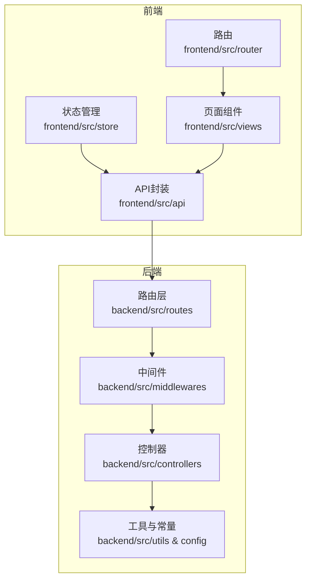
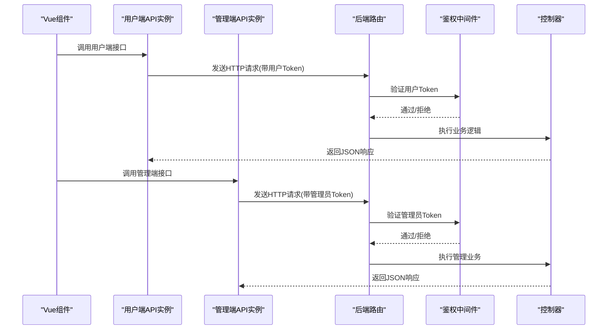
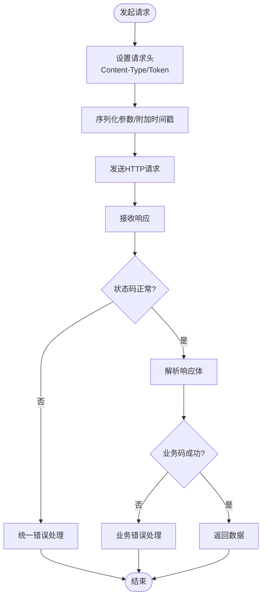
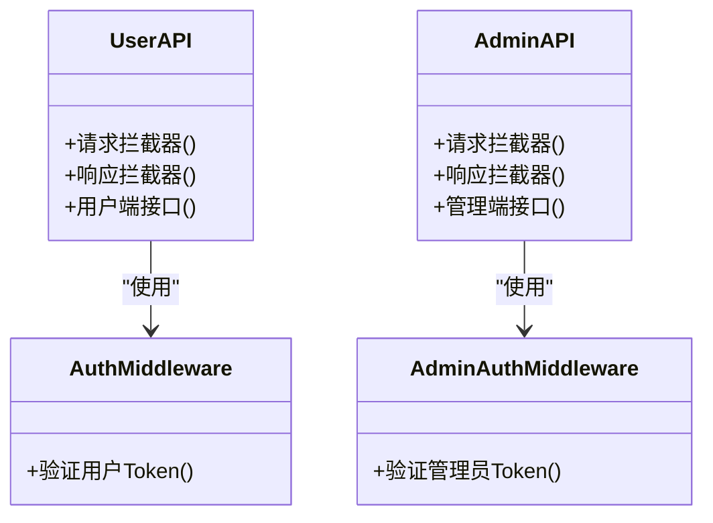
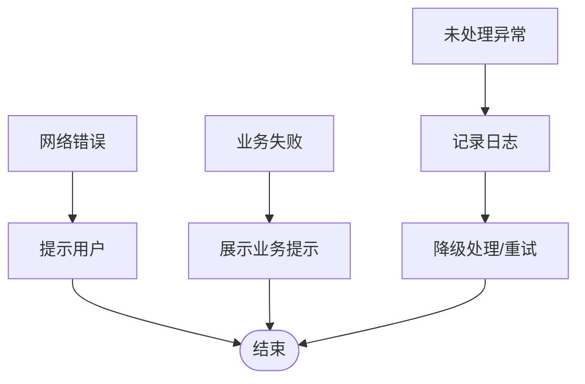
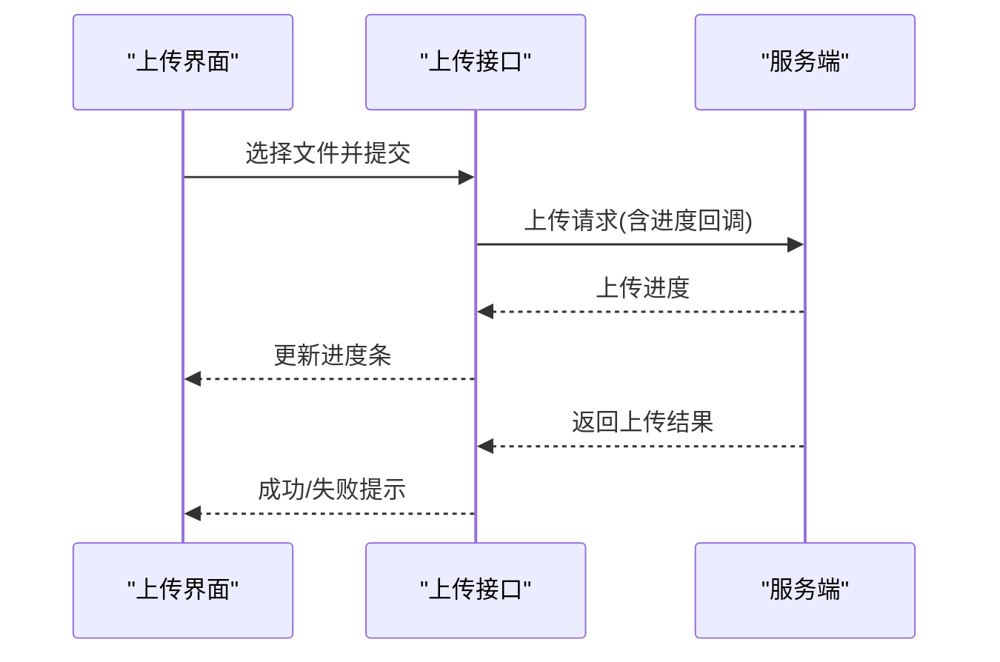
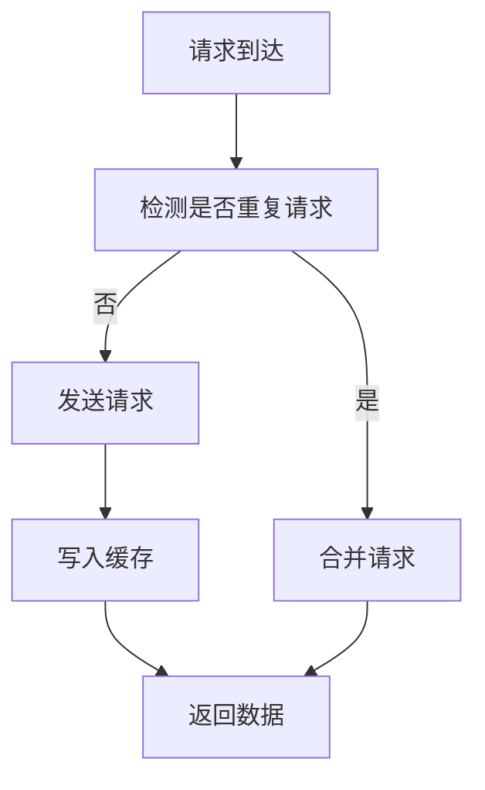
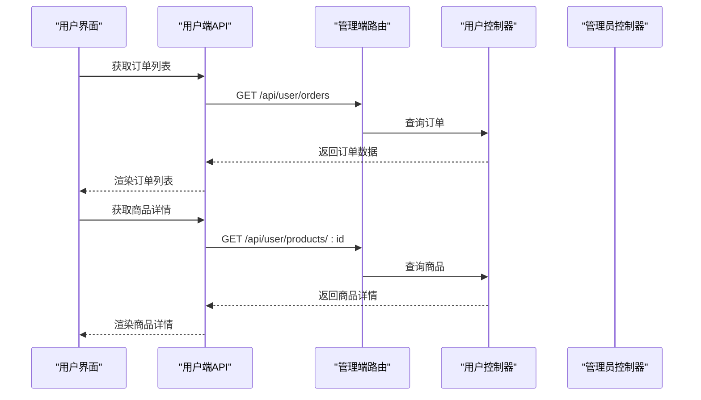
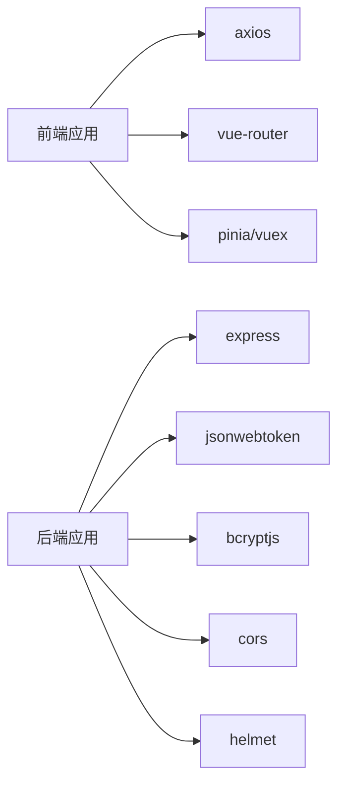

# API集成

<cite>
**本文引用的文件**
- [frontend/src/api/index.js](file://frontend/src/api/index.js)
- [frontend/src/api/request.js](file://frontend/src/api/request.js)
- [frontend/src/api/adminRequest.js](file://frontend/src/api/adminRequest.js)
- [frontend/src/store/user.js](file://frontend/src/store/user.js)
- [frontend/src/views/Login.vue](file://frontend/src/views/Login.vue)
- [frontend/src/views/Orders.vue](file://frontend/src/views/Orders.vue)
- [frontend/src/views/ProductDetail.vue](file://frontend/src/views/ProductDetail.vue)
- [frontend/src/views/Cart.vue](file://frontend/src/views/Cart.vue)
- [frontend/src/router/index.js](file://frontend/src/router/index.js)
- [backend/src/middlewares/auth.js](file://backend/src/middlewares/auth.js)
- [backend/src/middlewares/adminAuth.js](file://backend/src/middlewares/adminAuth.js)
- [backend/src/middlewares/errorHandler.js](file://backend/src/middlewares/errorHandler.js)
- [backend/src/controllers/userController.js](file://backend/src/controllers/userController.js)
- [backend/src/controllers/adminController.js](file://backend/src/controllers/adminController.js)
- [backend/src/controllers/orderController.js](file://backend/src/controllers/orderController.js)
- [backend/src/controllers/productController.js](file://backend/src/controllers/productController.js)
- [backend/src/routes/userRoutes.js](file://backend/src/routes/userRoutes.js)
- [backend/src/routes/adminRoutes.js](file://backend/src/routes/adminRoutes.js)
- [backend/src/utils/response.js](file://backend/src/utils/response.js)
- [backend/src/config/constants.js](file://backend/src/config/constants.js)
- [backend/package.json](file://backend/package.json)
- [frontend/package.json](file://frontend/package.json)
- [docs/api.md](file://docs/api.md)
</cite>

## 目录
1. [简介](#简介)
2. [项目结构](#项目结构)
3. [核心组件](#核心组件)
4. [架构总览](#架构总览)
5. [详细组件分析](#详细组件分析)
6. [依赖关系分析](#依赖关系分析)
7. [性能考虑](#性能考虑)
8. [故障排查指南](#故障排查指南)
9. [结论](#结论)
10. [附录](#附录)

## 简介
本文件为“趣配鲜”项目的API集成文档，聚焦于前端对后端REST API的封装与管理，涵盖以下主题：
- axios配置、请求/响应拦截器实现
- 用户端与管理端API差异（请求头、认证、权限）
- 统一错误处理机制（网络错误、业务错误）
- 文件上传（图片上传、进度、错误处理）
- API缓存策略（数据缓存、请求去重、失效机制）
- 测试与调试（Mock、接口测试、联调）
- 性能优化（请求合并、预加载、CDN）

## 项目结构
前端采用Vite构建，API封装位于frontend/src/api目录；后端基于Express，路由在src/routes下，控制器在src/controllers中，中间件在src/middlewares中。

**图表来源**
- [frontend/src/api/index.js](file://frontend/src/api/index.js)
- [frontend/src/api/request.js](file://frontend/src/api/request.js)
- [frontend/src/api/adminRequest.js](file://frontend/src/api/adminRequest.js)
- [backend/src/routes/userRoutes.js](file://backend/src/routes/userRoutes.js)
- [backend/src/routes/adminRoutes.js](file://backend/src/routes/adminRoutes.js)
- [backend/src/middlewares/auth.js](file://backend/src/middlewares/auth.js)
- [backend/src/middlewares/adminAuth.js](file://backend/src/middlewares/adminAuth.js)
- [backend/src/controllers/userController.js](file://backend/src/controllers/userController.js)
- [backend/src/controllers/adminController.js](file://backend/src/controllers/adminController.js)

**章节来源**
- [frontend/src/api/index.js](file://frontend/src/api/index.js)
- [frontend/src/api/request.js](file://frontend/src/api/request.js)
- [frontend/src/api/adminRequest.js](file://frontend/src/api/adminRequest.js)
- [backend/src/routes/userRoutes.js](file://backend/src/routes/userRoutes.js)
- [backend/src/routes/adminRoutes.js](file://backend/src/routes/adminRoutes.js)

## 核心组件
- 前端API封装：包含通用请求实例与管理端请求实例，分别用于用户端与后台管理端接口调用。
- 中间件：鉴权中间件（用户/管理员）、错误处理器。
- 控制器：用户、管理员、订单、商品等业务接口的实现。
- 工具与常量：统一响应格式、系统常量。

**章节来源**
- [frontend/src/api/request.js](file://frontend/src/api/request.js)
- [frontend/src/api/adminRequest.js](file://frontend/src/api/adminRequest.js)
- [backend/src/middlewares/auth.js](file://backend/src/middlewares/auth.js)
- [backend/src/middlewares/adminAuth.js](file://backend/src/middlewares/adminAuth.js)
- [backend/src/utils/response.js](file://backend/src/utils/response.js)

## 架构总览
前端通过两个axios实例分别对接用户端与管理端API，请求前缀不同，认证方式与权限模型也不同。后端路由分用户与管理两条线，均通过中间件进行鉴权与错误处理。

**图表来源**
- [frontend/src/api/request.js](file://frontend/src/api/request.js)
- [frontend/src/api/adminRequest.js](file://frontend/src/api/adminRequest.js)
- [backend/src/middlewares/auth.js](file://backend/src/middlewares/auth.js)
- [backend/src/middlewares/adminAuth.js](file://backend/src/middlewares/adminAuth.js)
- [backend/src/controllers/userController.js](file://backend/src/controllers/userController.js)
- [backend/src/controllers/adminController.js](file://backend/src/controllers/adminController.js)

## 详细组件分析

### 前端API封装与拦截器
- 通用请求实例：负责用户端接口调用，包含请求拦截器（设置默认头、序列化参数、添加时间戳防缓存）、响应拦截器（统一错误处理、业务码判断）。
- 管理端请求实例：与通用实例类似，但前缀不同，且仅在登录后可用，用于后台管理功能。
- 请求头设置：通用实例默认Content-Type为application/json；管理端实例在登录成功后携带管理员Token。
- 认证处理：用户端通过登录接口获取Token并存储到状态管理；管理端通过登录页获取管理员Token。
- 权限控制：用户端与管理端分别对应不同的路由守卫与中间件，确保访问隔离。

**图表来源**
- [frontend/src/api/request.js](file://frontend/src/api/request.js)
- [frontend/src/api/adminRequest.js](file://frontend/src/api/adminRequest.js)
- [backend/src/middlewares/errorHandler.js](file://backend/src/middlewares/errorHandler.js)
- [backend/src/utils/response.js](file://backend/src/utils/response.js)

**章节来源**
- [frontend/src/api/request.js](file://frontend/src/api/request.js)
- [frontend/src/api/adminRequest.js](file://frontend/src/api/adminRequest.js)
- [frontend/src/store/user.js](file://frontend/src/store/user.js)
- [frontend/src/views/Login.vue](file://frontend/src/views/Login.vue)

### 用户端API与管理端API差异
- 请求头：用户端与管理端分别维护独立的Token，管理端在登录后才启用。
- 认证：用户端通过用户登录接口获取Token；管理端通过管理员登录接口获取Token。
- 权限：用户端路由与管理端路由分离，访问权限由对应中间件控制。
- 接口前缀：用户端与管理端API前缀不同，避免冲突。

**图表来源**
- [frontend/src/api/request.js](file://frontend/src/api/request.js)
- [frontend/src/api/adminRequest.js](file://frontend/src/api/adminRequest.js)
- [backend/src/middlewares/auth.js](file://backend/src/middlewares/auth.js)
- [backend/src/middlewares/adminAuth.js](file://backend/src/middlewares/adminAuth.js)

**章节来源**
- [frontend/src/api/request.js](file://frontend/src/api/request.js)
- [frontend/src/api/adminRequest.js](file://frontend/src/api/adminRequest.js)
- [backend/src/middlewares/auth.js](file://backend/src/middlewares/auth.js)
- [backend/src/middlewares/adminAuth.js](file://backend/src/middlewares/adminAuth.js)

### 错误处理机制
- 网络错误：拦截器捕获网络异常，提示用户或进行重试。
- 业务错误：根据后端统一响应格式中的业务码进行分支处理，展示友好提示。
- 异常情况：全局错误处理器统一捕获未处理异常，记录日志并反馈给用户。

**图表来源**
- [backend/src/middlewares/errorHandler.js](file://backend/src/middlewares/errorHandler.js)
- [backend/src/utils/response.js](file://backend/src/utils/response.js)
- [frontend/src/api/request.js](file://frontend/src/api/request.js)

**章节来源**
- [backend/src/middlewares/errorHandler.js](file://backend/src/middlewares/errorHandler.js)
- [backend/src/utils/response.js](file://backend/src/utils/response.js)
- [frontend/src/api/request.js](file://frontend/src/api/request.js)

### 文件上传功能
- 图片上传：支持多图上传，按需选择文件后触发上传请求。
- 进度显示：通过上传进度事件实时更新UI，提升用户体验。
- 错误处理：上传失败时根据错误类型提示具体原因，并允许重新上传。

**图表来源**
- [frontend/src/views/ProductDetail.vue](file://frontend/src/views/ProductDetail.vue)
- [frontend/src/views/Cart.vue](file://frontend/src/views/Cart.vue)

**章节来源**
- [frontend/src/views/ProductDetail.vue](file://frontend/src/views/ProductDetail.vue)
- [frontend/src/views/Cart.vue](file://frontend/src/views/Cart.vue)

### API缓存策略
- 数据缓存：对列表类接口采用内存缓存，结合组件生命周期进行缓存管理。
- 请求去重：同一URL与参数的并发请求合并为单次请求，减少重复网络开销。
- 缓存失效：针对需要实时性的接口（如购物车、订单），采用短缓存或禁用缓存策略。

**图表来源**
- [frontend/src/api/request.js](file://frontend/src/api/request.js)

**章节来源**
- [frontend/src/api/request.js](file://frontend/src/api/request.js)

### 订单与商品API示例
- 订单接口：用户可查询历史订单、创建新订单、取消订单等。
- 商品接口：用户可浏览商品列表、详情、加入购物车等。
- 管理端接口：管理员可管理商品、订单、公告、轮播图等。

**图表来源**
- [backend/src/controllers/orderController.js](file://backend/src/controllers/orderController.js)
- [backend/src/controllers/productController.js](file://backend/src/controllers/productController.js)
- [backend/src/routes/userRoutes.js](file://backend/src/routes/userRoutes.js)

**章节来源**
- [backend/src/controllers/orderController.js](file://backend/src/controllers/orderController.js)
- [backend/src/controllers/productController.js](file://backend/src/controllers/productController.js)
- [backend/src/routes/userRoutes.js](file://backend/src/routes/userRoutes.js)

## 依赖关系分析
- 前端依赖：axios用于HTTP请求，pinia/vuex用于状态管理，vue-router用于路由控制。
- 后端依赖：express、jsonwebtoken、bcryptjs、cors、helmet等。
- 前后端交互：通过RESTful接口，遵循统一响应格式与错误处理规范。

**图表来源**
- [frontend/package.json](file://frontend/package.json)
- [backend/package.json](file://backend/package.json)

**章节来源**
- [frontend/package.json](file://frontend/package.json)
- [backend/package.json](file://backend/package.json)

## 性能考虑
- 请求合并：对相同URL与参数的并发请求进行合并，减少网络请求次数。
- 数据预加载：在进入页面前预取必要数据，缩短首屏等待时间。
- CDN加速：静态资源与图片资源通过CDN分发，降低延迟。
- 缓存策略：合理设置缓存时间与失效策略，平衡实时性与性能。

**章节来源**
- [frontend/src/api/request.js](file://frontend/src/api/request.js)
- [backend/src/config/constants.js](file://backend/src/config/constants.js)

## 故障排查指南
- 登录问题：检查登录接口返回的Token是否正确存储，确认请求头是否携带Token。
- 权限问题：确认路由守卫与后端中间件是否正确匹配，避免跨域访问。
- 错误码：根据后端统一响应格式中的业务码定位问题，查看日志与错误处理器输出。
- 网络问题：检查拦截器中的网络错误处理逻辑，确认是否有重试机制。

**章节来源**
- [frontend/src/store/user.js](file://frontend/src/store/user.js)
- [frontend/src/views/Login.vue](file://frontend/src/views/Login.vue)
- [backend/src/middlewares/errorHandler.js](file://backend/src/middlewares/errorHandler.js)
- [backend/src/utils/response.js](file://backend/src/utils/response.js)

## 结论
本项目通过清晰的前后端职责划分与统一的API封装，实现了用户端与管理端的差异化访问与安全控制。配合完善的错误处理、文件上传、缓存与性能优化策略，能够满足日常业务需求并具备良好的扩展性。

## 附录
- 接口文档：参考项目内文档文件，了解各接口的请求方法、参数与返回格式。
- 路由与权限：用户端与管理端路由分离，确保权限边界清晰。

**章节来源**
- [docs/api.md](file://docs/api.md)
- [frontend/src/router/index.js](file://frontend/src/router/index.js)