# Vue.js应用架构

<cite>
**本文档引用的文件**
- [frontend/src/main.js](file://frontend/src/main.js)
- [frontend/src/App.vue](file://frontend/src/App.vue)
- [frontend/src/router/index.js](file://frontend/src/router/index.js)
- [frontend/vite.config.js](file://frontend/vite.config.js)
- [frontend/package.json](file://frontend/package.json)
- [frontend/src/layouts/TabbarLayout.vue](file://frontend/src/layouts/TabbarLayout.vue)
- [frontend/src/store/user.js](file://frontend/src/store/user.js)
- [frontend/src/store/cart.js](file://frontend/src/store/cart.js)
- [frontend/src/api/request.js](file://frontend/src/api/request.js)
- [frontend/src/api/adminRequest.js](file://frontend/src/api/adminRequest.js)
- [frontend/src/api/index.js](file://frontend/src/api/index.js)
- [frontend/src/views/Home.vue](file://frontend/src/views/Home.vue)
- [frontend/src/views/Cart.vue](file://frontend/src/views/Cart.vue)
- [frontend/src/views/Profile.vue](file://frontend/src/views/Profile.vue)
- [frontend/src/style.css](file://frontend/src/style.css)
- [frontend/tailwind.config.js](file://frontend/tailwind.config.js)
- [frontend/postcss.config.js](file://frontend/postcss.config.js)
</cite>

## 目录
1. [引言](#引言)
2. [项目结构](#项目结构)
3. [核心组件](#核心组件)
4. [架构总览](#架构总览)
5. [详细组件分析](#详细组件分析)
6. [依赖关系分析](#依赖关系分析)
7. [性能考虑](#性能考虑)
8. [故障排除指南](#故障排除指南)
9. [结论](#结论)

## 引言
本项目为“趣配鲜”Vue.js 3.x移动端电商应用，采用Composition API与模块化架构设计，结合Vant移动端UI组件库、Pinia状态管理、Vue Router路由系统以及Vite构建工具链，实现从应用入口到页面组件的完整前端架构。本文档将深入解析应用入口配置、根组件结构、应用初始化流程、Composition API使用模式、组件层次结构、应用配置选项、组件通信模式以及模块化组织方式。

## 项目结构
前端项目采用按功能模块划分的目录结构，主要包含以下关键目录：
- src：源代码目录
  - api：封装HTTP请求与拦截器（含用户端与管理端）
  - store：Pinia状态管理（用户与购物车）
  - views：页面级组件（首页、商品、食谱、购物车、个人中心等）
  - layouts：布局组件（Tabbar布局）
  - router：路由配置与导航守卫
  - main.js：应用入口
  - App.vue：根组件
  - style.css：全局样式（Tailwind集成）
- 构建相关：vite.config.js、package.json、tailwind.config.js、postcss.config.js
- 入口HTML：index.html

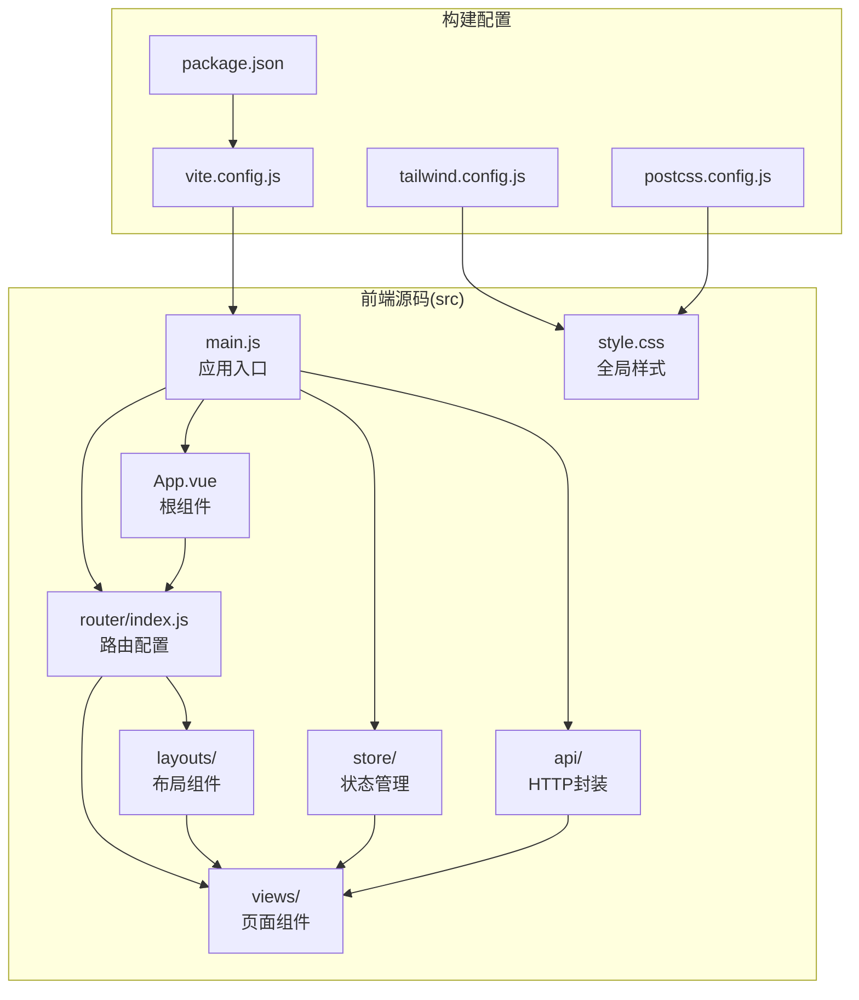

**图表来源**
- [frontend/src/main.js:1-56](file://frontend/src/main.js#L1-L56)
- [frontend/src/App.vue:1-10](file://frontend/src/App.vue#L1-L10)
- [frontend/src/router/index.js:1-192](file://frontend/src/router/index.js#L1-L192)
- [frontend/vite.config.js:1-26](file://frontend/vite.config.js#L1-L26)
- [frontend/package.json:1-26](file://frontend/package.json#L1-L26)
- [frontend/src/style.css:1-71](file://frontend/src/style.css#L1-L71)

**章节来源**
- [frontend/src/main.js:1-56](file://frontend/src/main.js#L1-L56)
- [frontend/src/router/index.js:1-192](file://frontend/src/router/index.js#L1-L192)
- [frontend/vite.config.js:1-26](file://frontend/vite.config.js#L1-L26)
- [frontend/package.json:1-26](file://frontend/package.json#L1-L26)

## 核心组件
本节聚焦应用的核心组件与初始化流程，包括应用入口、根组件、路由与状态管理的协作关系。

- 应用入口（main.js）：创建Vue实例、安装Pinia与路由插件、引入全局样式与Vant组件、初始化用户会话并挂载应用。
- 根组件（App.vue）：最外层容器，通过router-view承载当前路由视图。
- 路由系统（router/index.js）：定义多级嵌套路由，包含Tabbar布局与页面视图，并实现导航守卫以控制访问权限与标题设置。
- 状态管理（store/user.js、store/cart.js）：基于Pinia的组合式Store，分别管理用户认证态与购物车数据。
- API封装（api/request.js、api/adminRequest.js、api/index.js）：统一HTTP客户端与拦截器，处理鉴权头、加载态、错误提示与重定向逻辑。

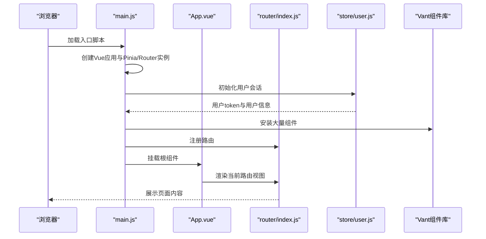

**图表来源**
- [frontend/src/main.js:10-56](file://frontend/src/main.js#L10-L56)
- [frontend/src/App.vue:1-10](file://frontend/src/App.vue#L1-10)
- [frontend/src/router/index.js:150-192](file://frontend/src/router/index.js#L150-L192)
- [frontend/src/store/user.js:69-83](file://frontend/src/store/user.js#L69-L83)

**章节来源**
- [frontend/src/main.js:1-56](file://frontend/src/main.js#L1-L56)
- [frontend/src/App.vue:1-10](file://frontend/src/App.vue#L1-L10)
- [frontend/src/router/index.js:1-192](file://frontend/src/router/index.js#L1-L192)
- [frontend/src/store/user.js:1-96](file://frontend/src/store/user.js#L1-L96)
- [frontend/src/store/cart.js:1-68](file://frontend/src/store/cart.js#L1-L68)
- [frontend/src/api/request.js:1-111](file://frontend/src/api/request.js#L1-L111)
- [frontend/src/api/adminRequest.js:1-93](file://frontend/src/api/adminRequest.js#L1-L93)
- [frontend/src/api/index.js:1-136](file://frontend/src/api/index.js#L1-L136)

## 架构总览
应用采用“入口初始化 → 路由驱动 → 组件渲染 → 状态管理”的整体架构。路由负责页面级导航与权限控制，布局组件负责底部Tabbar与页面内容区域，页面组件通过Composition API声明响应式数据与生命周期钩子，Pinia Store提供跨组件共享的状态，API模块统一处理网络请求与错误处理。

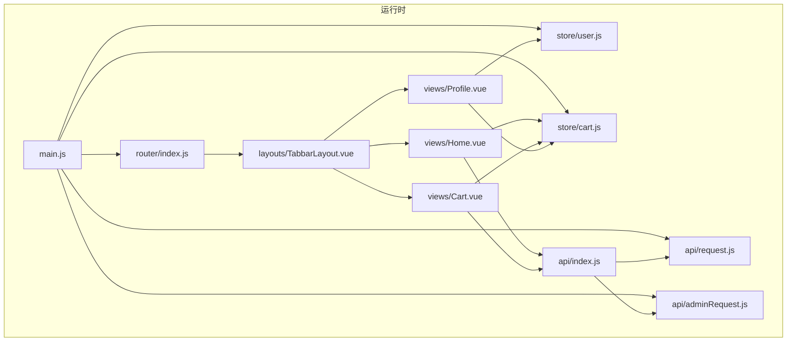

**图表来源**
- [frontend/src/main.js:1-56](file://frontend/src/main.js#L1-L56)
- [frontend/src/router/index.js:1-192](file://frontend/src/router/index.js#L1-L192)
- [frontend/src/layouts/TabbarLayout.vue:1-99](file://frontend/src/layouts/TabbarLayout.vue#L1-L99)
- [frontend/src/views/Home.vue:1-376](file://frontend/src/views/Home.vue#L1-L376)
- [frontend/src/views/Cart.vue:1-241](file://frontend/src/views/Cart.vue#L1-L241)
- [frontend/src/views/Profile.vue:1-210](file://frontend/src/views/Profile.vue#L1-L210)
- [frontend/src/store/user.js:1-96](file://frontend/src/store/user.js#L1-L96)
- [frontend/src/store/cart.js:1-68](file://frontend/src/store/cart.js#L1-L68)
- [frontend/src/api/request.js:1-111](file://frontend/src/api/request.js#L1-L111)
- [frontend/src/api/adminRequest.js:1-93](file://frontend/src/api/adminRequest.js#L1-L93)
- [frontend/src/api/index.js:1-136](file://frontend/src/api/index.js#L1-L136)

## 详细组件分析

### 应用入口与初始化流程
- 创建应用实例与插件：使用createApp创建应用，安装Pinia与Vue Router。
- 全局样式与UI库：引入全局样式与Vant全部组件，确保页面统一风格与交互体验。
- 用户会话初始化：在挂载前调用用户Store的initUserSession方法，从localStorage恢复token与用户信息。
- 应用挂载：将根组件挂载至DOM节点。

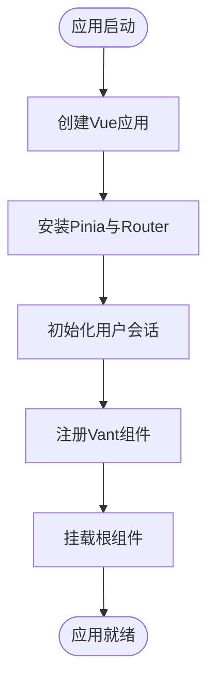

**图表来源**
- [frontend/src/main.js:10-56](file://frontend/src/main.js#L10-L56)
- [frontend/src/store/user.js:69-83](file://frontend/src/store/user.js#L69-L83)

**章节来源**
- [frontend/src/main.js:1-56](file://frontend/src/main.js#L1-L56)
- [frontend/src/store/user.js:1-96](file://frontend/src/store/user.js#L1-L96)

### 根组件与路由架构
- 根组件：通过router-view承载当前路由视图，无额外业务逻辑。
- 路由系统：采用history模式，定义TabbarLayout作为主布局，包含首页、商品、食谱、购物车、个人中心等子路由；同时支持登录、注册与管理后台路由。
- 导航守卫：根据meta字段控制页面标题、是否需要登录、是否管理员权限，并在缺失或异常时进行重定向。

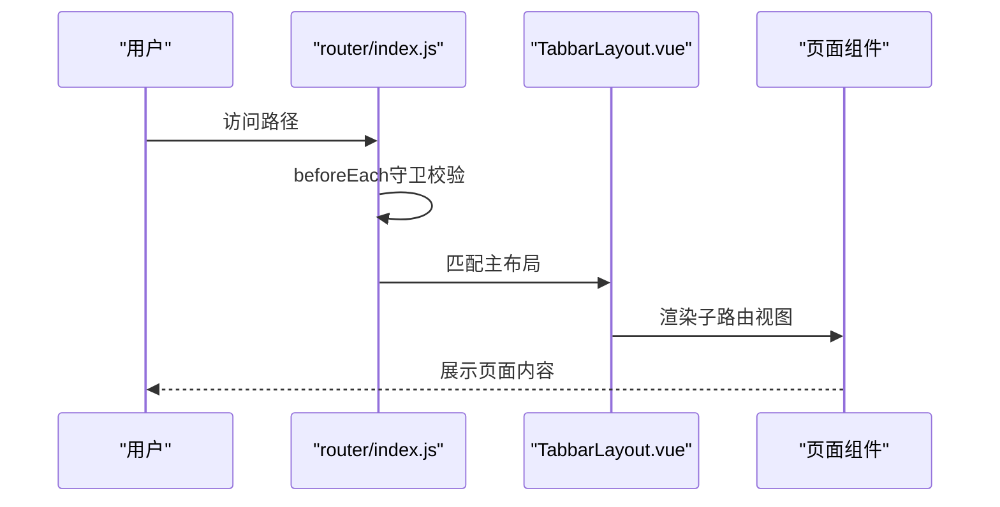

**图表来源**
- [frontend/src/App.vue:1-10](file://frontend/src/App.vue#L1-L10)
- [frontend/src/router/index.js:150-192](file://frontend/src/router/index.js#L150-L192)
- [frontend/src/layouts/TabbarLayout.vue:1-99](file://frontend/src/layouts/TabbarLayout.vue#L1-L99)

**章节来源**
- [frontend/src/App.vue:1-10](file://frontend/src/App.vue#L1-L10)
- [frontend/src/router/index.js:1-192](file://frontend/src/router/index.js#L1-L192)
- [frontend/src/layouts/TabbarLayout.vue:1-99](file://frontend/src/layouts/TabbarLayout.vue#L1-L99)

### 布局组件设计（TabbarLayout）
- 功能职责：提供底部Tabbar导航、页面内容区域适配（隐藏Tabbar、额外底部空间）、路由变化监听与滚动复位。
- 响应式与生命周期：使用ref、computed、watch、onMounted等Composition API特性，实现Tab与路由的双向同步、动态样式类与滚动行为控制。

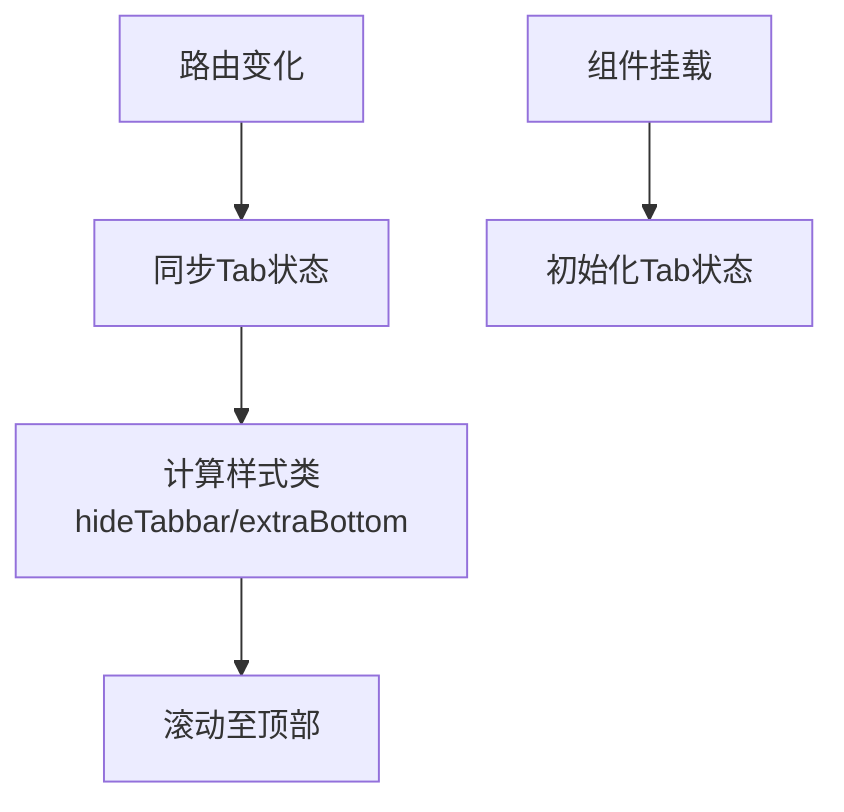

**图表来源**
- [frontend/src/layouts/TabbarLayout.vue:22-76](file://frontend/src/layouts/TabbarLayout.vue#L22-L76)

**章节来源**
- [frontend/src/layouts/TabbarLayout.vue:1-99](file://frontend/src/layouts/TabbarLayout.vue#L1-L99)

### 页面组件与Composition API使用
- 页面组件普遍采用<script setup>语法，集中声明响应式数据、计算属性、事件处理函数与生命周期钩子。
- 示例组件：
  - Home.vue：声明多个响应式引用，使用onMounted加载首页数据，调用Store与API模块。
  - Cart.vue：维护选中项与数量，计算总价，处理增删改与结算跳转。
  - Profile.vue：展示用户信息与统计数据，处理登出与跳转。

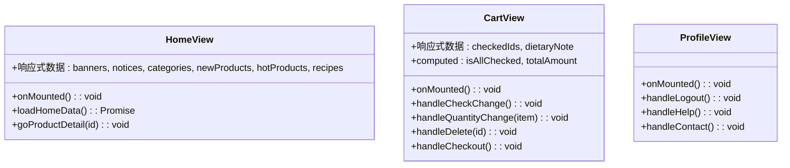

**图表来源**
- [frontend/src/views/Home.vue:107-184](file://frontend/src/views/Home.vue#L107-L184)
- [frontend/src/views/Cart.vue:43-123](file://frontend/src/views/Cart.vue#L43-L123)
- [frontend/src/views/Profile.vue:90-131](file://frontend/src/views/Profile.vue#L90-L131)

**章节来源**
- [frontend/src/views/Home.vue:1-376](file://frontend/src/views/Home.vue#L1-L376)
- [frontend/src/views/Cart.vue:1-241](file://frontend/src/views/Cart.vue#L1-L241)
- [frontend/src/views/Profile.vue:1-210](file://frontend/src/views/Profile.vue#L1-L210)

### 状态管理（Pinia Store）
- 用户Store（user.js）：管理token与用户信息，提供登录态判断、设置、拉取资料与登出清理逻辑。
- 购物车Store（cart.js）：管理购物车列表、选中项与数量，提供增删改查与价格计算。

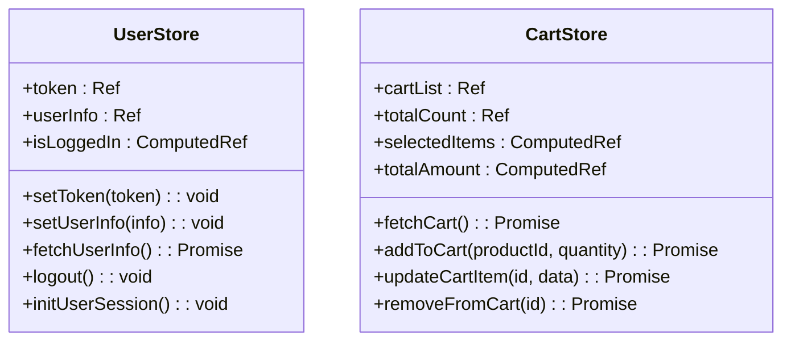

**图表来源**
- [frontend/src/store/user.js:24-95](file://frontend/src/store/user.js#L24-L95)
- [frontend/src/store/cart.js:5-67](file://frontend/src/store/cart.js#L5-L67)

**章节来源**
- [frontend/src/store/user.js:1-96](file://frontend/src/store/user.js#L1-L96)
- [frontend/src/store/cart.js:1-68](file://frontend/src/store/cart.js#L1-L68)

### API封装与错误处理
- 请求客户端（request.js）：基于Axios创建基础实例，注入Authorization头，统一请求/响应拦截器，处理加载态、错误提示与登录态失效重定向。
- 管理端请求（adminRequest.js）：独立客户端，针对管理后台接口的特殊处理与错误分支。
- API聚合（index.js）：按业务域导出API对象，统一调用入口。

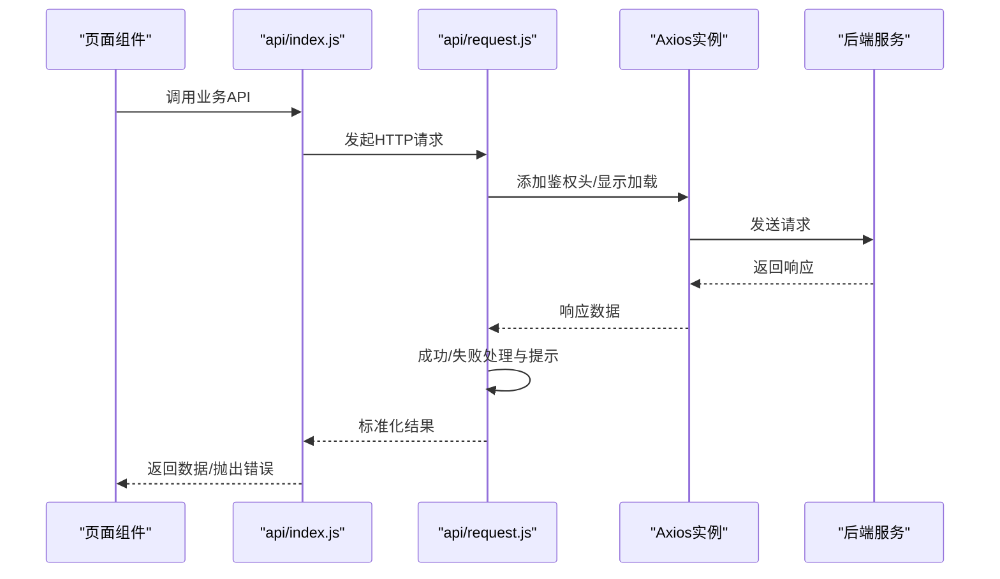

**图表来源**
- [frontend/src/api/index.js:1-136](file://frontend/src/api/index.js#L1-L136)
- [frontend/src/api/request.js:29-109](file://frontend/src/api/request.js#L29-L109)
- [frontend/src/api/adminRequest.js:29-91](file://frontend/src/api/adminRequest.js#L29-L91)

**章节来源**
- [frontend/src/api/request.js:1-111](file://frontend/src/api/request.js#L1-L111)
- [frontend/src/api/adminRequest.js:1-93](file://frontend/src/api/adminRequest.js#L1-L93)
- [frontend/src/api/index.js:1-136](file://frontend/src/api/index.js#L1-L136)

### 组件通信模式最佳实践
- 父子组件通信：通过props向下传递数据，通过事件向上反馈状态变更（如Cart.vue中的选中状态与数量变更）。
- 兄弟组件通信：通过共享的Pinia Store进行状态同步（如购物车Store被多个页面共享）。
- 跨层级组件通信：通过全局状态管理（Pinia）与路由参数传递（如登录后重定向）实现解耦。

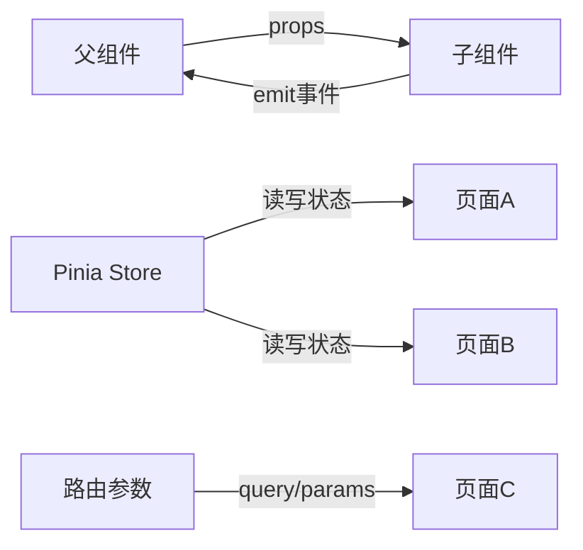

[此图为概念性示意，无需图表来源]

## 依赖关系分析
- 运行时依赖：Vue 3、Vue Router、Pinia、Axios、Vant、Day.js。
- 开发依赖：Vite、@vitejs/plugin-vue、TailwindCSS、PostCSS、Autoprefixer。
- 构建配置：Vite别名映射@指向src，开发服务器代理/api到后端，生产构建输出dist。

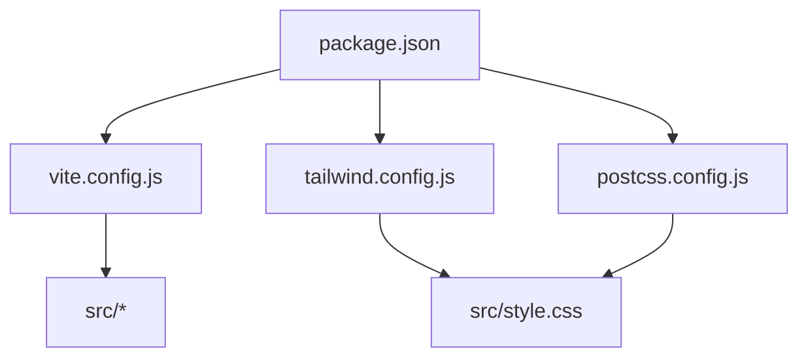

**图表来源**
- [frontend/package.json:1-26](file://frontend/package.json#L1-L26)
- [frontend/vite.config.js:1-26](file://frontend/vite.config.js#L1-L26)
- [frontend/tailwind.config.js:1-24](file://frontend/tailwind.config.js#L1-L24)
- [frontend/postcss.config.js:1-7](file://frontend/postcss.config.js#L1-L7)

**章节来源**
- [frontend/package.json:1-26](file://frontend/package.json#L1-L26)
- [frontend/vite.config.js:1-26](file://frontend/vite.config.js#L1-L26)
- [frontend/tailwind.config.js:1-24](file://frontend/tailwind.config.js#L1-L24)
- [frontend/postcss.config.js:1-7](file://frontend/postcss.config.js#L1-L7)

## 性能考虑
- 懒加载路由：路由组件采用动态导入，减少首屏体积与加载时间。
- 组件懒加载：Vant组件在入口一次性注册，实际使用按需加载可进一步优化（当前为全量引入）。
- 状态缓存：用户与购物车状态持久化至localStorage，避免重复请求。
- 图片与列表：首页轮播与商品列表使用占位图策略，提升首屏体验。
- 构建优化：生产构建关闭source map，减少产物体积。

[本节为通用指导，不直接分析具体文件]

## 故障排除指南
- 登录态失效：请求拦截器检测401错误并移除token，跳转登录页；管理端与用户端分别处理不同路径。
- 网络错误：统一toast提示，区分401/403/404/500等状态码给出相应反馈。
- 数据解析异常：用户信息JSON解析失败时清理本地存储并强制重定向登录。
- 购物车同步：数量变更与选中状态变更均触发后端更新与本地状态刷新。

**章节来源**
- [frontend/src/api/request.js:65-108](file://frontend/src/api/request.js#L65-L108)
- [frontend/src/api/adminRequest.js:67-91](file://frontend/src/api/adminRequest.js#L67-L91)
- [frontend/src/store/user.js:13-22](file://frontend/src/store/user.js#L13-L22)

## 结论
“趣配鲜”Vue.js应用通过清晰的模块化组织、完善的路由与布局体系、基于Composition API的组件设计、Pinia状态管理与统一的API封装，实现了高内聚低耦合的前端架构。建议后续在组件按需加载、状态粒度拆分与错误边界细化方面持续优化，以进一步提升性能与可维护性。