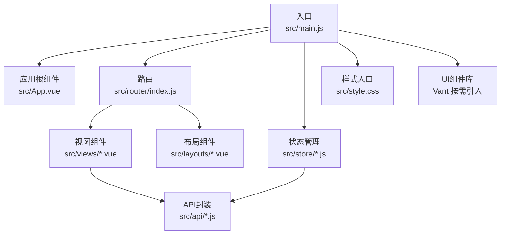
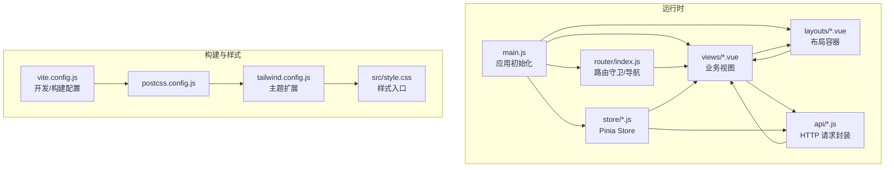
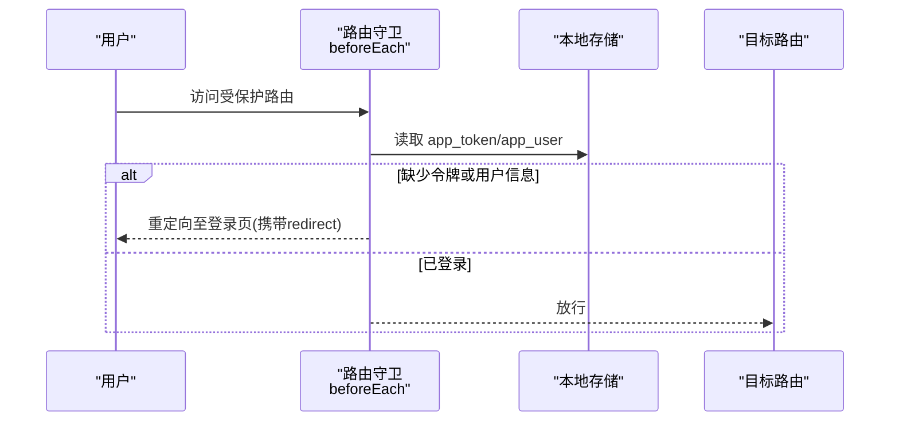
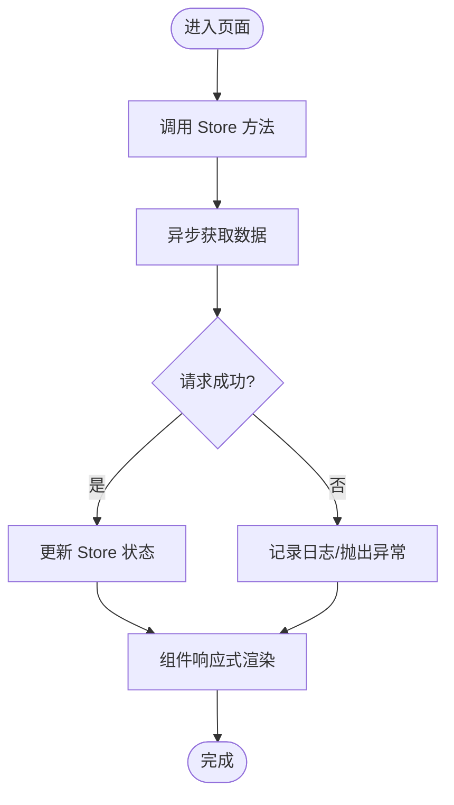
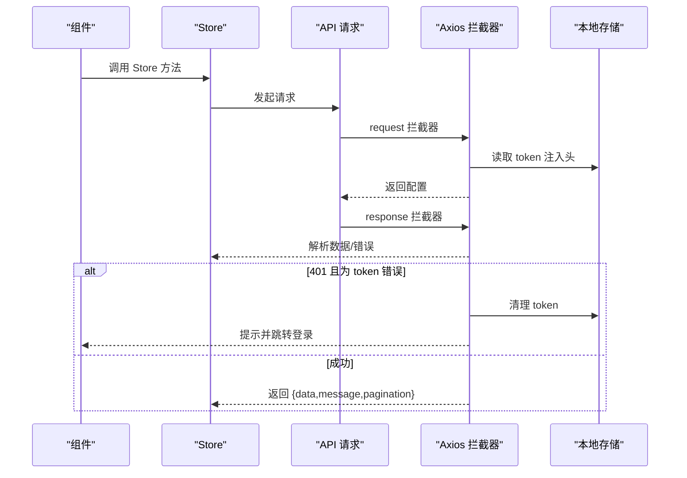
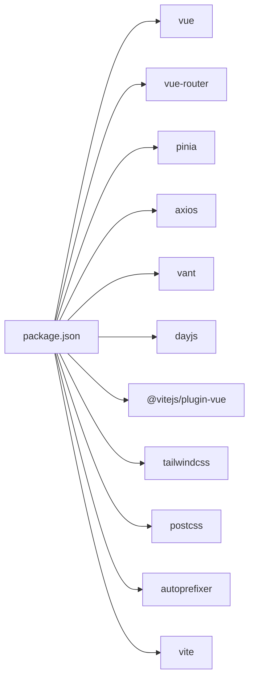

# 前端开发指南

<cite>
**本文引用的文件**
- [frontend/package.json](file://frontend/package.json)
- [frontend/vite.config.js](file://frontend/vite.config.js)
- [frontend/tailwind.config.js](file://frontend/tailwind.config.js)
- [frontend/postcss.config.js](file://frontend/postcss.config.js)
- [frontend/src/main.js](file://frontend/src/main.js)
- [frontend/src/App.vue](file://frontend/src/App.vue)
- [frontend/src/router/index.js](file://frontend/src/router/index.js)
- [frontend/src/store/user.js](file://frontend/src/store/user.js)
- [frontend/src/store/cart.js](file://frontend/src/store/cart.js)
- [frontend/src/api/request.js](file://frontend/src/api/request.js)
- [frontend/src/api/adminRequest.js](file://frontend/src/api/adminRequest.js)
- [frontend/src/style.css](file://frontend/src/style.css)
- [frontend/src/layouts/TabbarLayout.vue](file://frontend/src/layouts/TabbarLayout.vue)
- [frontend/src/views/Home.vue](file://frontend/src/views/Home.vue)
- [frontend/src/views/Login.vue](file://frontend/src/views/Login.vue)
- [frontend/src/admin/views/Home.vue](file://frontend/src/admin/views/Home.vue)
</cite>

## 目录
1. [简介](#简介)
2. [项目结构](#项目结构)
3. [核心组件](#核心组件)
4. [架构总览](#架构总览)
5. [详细组件分析](#详细组件分析)
6. [依赖关系分析](#依赖关系分析)
7. [性能考虑](#性能考虑)
8. [故障排查指南](#故障排查指南)
9. [结论](#结论)
10. [附录](#附录)

## 简介
本指南面向趣配鲜前端团队，系统性介绍 Vue.js 3.x 应用的架构与开发实践，涵盖组件化与 Composition API 使用、响应式数据管理、Vite 构建与优化、Tailwind CSS 样式体系、Vant UI 组件库集成、状态管理（Pinia）、路由与导航、样式开发规范、以及代码与工具配置建议。文档以仓库现有实现为依据，结合可落地的最佳实践，帮助团队统一开发标准、提升协作效率与交付质量。

## 项目结构
前端工程位于 frontend 目录，采用典型的 Vue 3 单页应用结构：
- 入口与应用根组件：src/main.js、src/App.vue
- 路由：src/router/index.js
- 状态管理：src/store 下的用户与购物车 Store
- API 封装：src/api 下的通用请求与管理端请求
- 视图与布局：src/views 与 src/layouts
- 样式：src/style.css，Tailwind 配置与 PostCSS 集成
- 构建：vite.config.js、tailwind.config.js、postcss.config.js
- 依赖：frontend/package.json

图表来源
- [frontend/src/main.js:1-56](file://frontend/src/main.js#L1-L56)
- [frontend/src/App.vue:1-10](file://frontend/src/App.vue#L1-L10)
- [frontend/src/router/index.js:1-192](file://frontend/src/router/index.js#L1-L192)
- [frontend/src/store/user.js:1-96](file://frontend/src/store/user.js#L1-L96)
- [frontend/src/store/cart.js:1-68](file://frontend/src/store/cart.js#L1-L68)
- [frontend/src/api/request.js:1-111](file://frontend/src/api/request.js#L1-L111)
- [frontend/src/style.css:1-71](file://frontend/src/style.css#L1-L71)

章节来源
- [frontend/package.json:1-26](file://frontend/package.json#L1-L26)
- [frontend/src/main.js:1-56](file://frontend/src/main.js#L1-L56)
- [frontend/src/App.vue:1-10](file://frontend/src/App.vue#L1-L10)
- [frontend/src/router/index.js:1-192](file://frontend/src/router/index.js#L1-L192)
- [frontend/src/style.css:1-71](file://frontend/src/style.css#L1-L71)

## 核心组件
- 应用入口与全局注册
  - 在入口文件中创建应用实例、挂载 Pinia 与路由，并一次性按需注册 Vant 组件，避免重复引入。
  - 启动时初始化用户会话，从本地存储恢复登录态。
- 根组件
  - 通过路由视图承载页面内容，保持最小化结构。
- 路由与导航
  - 使用 History 模式，支持嵌套路由与懒加载；在 beforeEach 中集中处理标题、鉴权与跳转逻辑。
- 状态管理
  - 用户 Store：维护 token 与用户信息，提供登录态判断、拉取资料、登出与会话初始化。
  - 购物车 Store：维护购物车列表、选中项与总价计算，提供增删改查等操作。
- API 封装
  - 通用请求：统一设置基础路径、超时、请求头、加载态与错误提示；对 401 进行统一处理（区分前台/管理端）。
  - 管理端请求：独立实例，针对管理端接口进行鉴权与错误处理。
- 样式与主题
  - Tailwind CSS 开箱即用，自定义主色、辅助色与字体族；全局样式统一基础排版与交互。

章节来源
- [frontend/src/main.js:1-56](file://frontend/src/main.js#L1-L56)
- [frontend/src/App.vue:1-10](file://frontend/src/App.vue#L1-L10)
- [frontend/src/router/index.js:155-189](file://frontend/src/router/index.js#L155-L189)
- [frontend/src/store/user.js:24-95](file://frontend/src/store/user.js#L24-L95)
- [frontend/src/store/cart.js:5-67](file://frontend/src/store/cart.js#L5-L67)
- [frontend/src/api/request.js:4-111](file://frontend/src/api/request.js#L4-L111)
- [frontend/src/api/adminRequest.js:4-93](file://frontend/src/api/adminRequest.js#L4-L93)
- [frontend/src/style.css:1-71](file://frontend/src/style.css#L1-L71)

## 架构总览
整体采用“入口注册 → 路由驱动 → 组件渲染 → 状态与 API 交互”的单页应用架构。路由负责页面级导航与鉴权，组件通过 Composition API 与 Store 进行数据与行为管理，API 层统一处理认证、错误与加载态，UI 层基于 Vant 与 Tailwind 实现一致的视觉与交互体验。

图表来源
- [frontend/src/main.js:1-56](file://frontend/src/main.js#L1-L56)
- [frontend/src/router/index.js:1-192](file://frontend/src/router/index.js#L1-L192)
- [frontend/src/store/user.js:1-96](file://frontend/src/store/user.js#L1-L96)
- [frontend/src/store/cart.js:1-68](file://frontend/src/store/cart.js#L1-L68)
- [frontend/src/api/request.js:1-111](file://frontend/src/api/request.js#L1-L111)
- [frontend/vite.config.js:1-26](file://frontend/vite.config.js#L1-L26)
- [frontend/postcss.config.js:1-7](file://frontend/postcss.config.js#L1-L7)
- [frontend/tailwind.config.js:1-24](file://frontend/tailwind.config.js#L1-L24)
- [frontend/src/style.css:1-71](file://frontend/src/style.css#L1-L71)

## 详细组件分析

### 路由与导航
- 路由结构
  - 主应用与管理后台双路由树，主应用通过 TabbarLayout 包裹子路由，实现底部标签栏与页面切换。
  - 子路由覆盖首页、商品、食谱、购物车、个人中心及多级详情页，支持 keep-alive、隐藏 Tabbar、额外底部安全区等元信息。
- 导航守卫
  - beforeEach 中根据 meta 字段设置页面标题；对 requiresAuth 与 isAdmin 的路由进行鉴权拦截，缺失 token 或用户信息时自动跳转登录页并携带 redirect 参数。
- 懒加载与嵌套路由
  - 所有视图均使用动态导入实现懒加载；TabbarLayout 作为父级布局，子路由按需加载，减少首屏体积。

图表来源
- [frontend/src/router/index.js:155-189](file://frontend/src/router/index.js#L155-L189)

章节来源
- [frontend/src/router/index.js:1-192](file://frontend/src/router/index.js#L1-L192)

### 状态管理（Pinia）
- 用户 Store
  - 状态：token、用户信息、登录态计算属性。
  - 行为：设置 token 与用户信息、拉取资料、登出、初始化会话。
  - 数据持久化：通过 localStorage 同步状态，启动时恢复。
- 购物车 Store
  - 状态：购物车列表、总数量。
  - 计算：选中项过滤、总价计算（优先使用会员价）。
  - 行为：获取、添加、更新、移除购物车项，失败时抛出异常供组件处理。

图表来源
- [frontend/src/store/user.js:51-67](file://frontend/src/store/user.js#L51-L67)
- [frontend/src/store/cart.js:17-55](file://frontend/src/store/cart.js#L17-L55)

章节来源
- [frontend/src/store/user.js:1-96](file://frontend/src/store/user.js#L1-L96)
- [frontend/src/store/cart.js:1-68](file://frontend/src/store/cart.js#L1-L68)

### API 封装与错误处理
- 通用请求
  - 基础配置：baseURL、超时；自动注入 Authorization 头；统一显示/关闭加载提示。
  - 响应处理：success 字段判断，失败时弹出消息；401 统一处理：前台清理本地存储并跳转登录。
- 管理端请求
  - 独立实例，401 清理管理端 token 并跳转管理登录页；对 blob 类型响应特殊处理。

图表来源
- [frontend/src/api/request.js:29-109](file://frontend/src/api/request.js#L29-L109)
- [frontend/src/api/adminRequest.js:29-91](file://frontend/src/api/adminRequest.js#L29-L91)

章节来源
- [frontend/src/api/request.js:1-111](file://frontend/src/api/request.js#L1-L111)
- [frontend/src/api/adminRequest.js:1-93](file://frontend/src/api/adminRequest.js#L1-L93)

### 样式与主题（Tailwind CSS）
- 配置要点
  - content 覆盖 src 与 index.html，确保按需生成样式。
  - 主题扩展：primary/secondary/success/warning/danger/info 颜色，sans 字体族。
- 全局样式
  - 重置基础样式，统一字体与背景；定义品牌横幅、安全提示、产品标签等复用样式类。
- 组件内样式
  - 大量使用 Tailwind 工具类，配合 scoped 样式实现局部隔离与主题一致性。

章节来源
- [frontend/tailwind.config.js:1-24](file://frontend/tailwind.config.js#L1-L24)
- [frontend/postcss.config.js:1-7](file://frontend/postcss.config.js#L1-L7)
- [frontend/src/style.css:1-71](file://frontend/src/style.css#L1-L71)

### UI 组件库（Vant）集成与使用
- 全量按需引入
  - 在入口文件中一次性注册常用组件，避免重复注册与打包冗余。
- 组件使用范式
  - 导航栏、轮播、卡片、标签、表单、弹窗、加载与提示等广泛用于首页、登录页与管理后台。
- 自定义与扩展
  - 可在现有基础上新增组件注册与样式覆盖，遵循统一命名与主题规范。

章节来源
- [frontend/src/main.js:8-53](file://frontend/src/main.js#L8-L53)
- [frontend/src/views/Home.vue:1-376](file://frontend/src/views/Home.vue#L1-L376)
- [frontend/src/views/Login.vue:1-152](file://frontend/src/views/Login.vue#L1-L152)
- [frontend/src/admin/views/Home.vue:1-242](file://frontend/src/admin/views/Home.vue#L1-L242)

### 布局与页面示例
- TabbarLayout
  - 通过 meta 控制是否显示 Tabbar 与额外底部安全区；监听路由变化同步激活项；滚动回到顶部。
- Home 页面
  - 展示横幅、公告、分类导航、新品/热销/食谱区块；点击跳转详情；首次进入拉取购物车数据。
- Login 页面
  - 表单校验、登录提交、成功后写入本地存储与 Store，并按 redirect 跳转。
- 管理后台首页
  - 侧边菜单、面包屑式标题、内容区域过渡动画、退出登录对话框。

章节来源
- [frontend/src/layouts/TabbarLayout.vue:1-99](file://frontend/src/layouts/TabbarLayout.vue#L1-L99)
- [frontend/src/views/Home.vue:1-376](file://frontend/src/views/Home.vue#L1-L376)
- [frontend/src/views/Login.vue:1-152](file://frontend/src/views/Login.vue#L1-L152)
- [frontend/src/admin/views/Home.vue:1-242](file://frontend/src/admin/views/Home.vue#L1-L242)

## 依赖关系分析
- 运行时依赖
  - Vue 3、Vue Router、Pinia、Axios、Vant、Day.js。
- 开发依赖
  - Vite、@vitejs/plugin-vue、Tailwind CSS、PostCSS、Autoprefixer。
- 关键耦合点
  - main.js 作为全局装配点，耦合路由、状态与 UI 组件注册。
  - 路由守卫与 Store/本地存储共同决定鉴权流程。
  - API 封装与拦截器统一处理认证与错误。

图表来源
- [frontend/package.json:1-26](file://frontend/package.json#L1-L26)

章节来源
- [frontend/package.json:1-26](file://frontend/package.json#L1-L26)

## 性能考虑
- 构建与打包
  - 生产构建默认启用压缩与资源优化；如需进一步优化，可在 Vite 配置中开启资源内联阈值、拆包策略与产物分析。
- 代码分割与懒加载
  - 路由与视图均采用动态导入，减少首屏 JS 体积；建议对大组件继续拆分，按需加载。
- 图片与静态资源
  - 使用 CDN 或服务端压缩；图片懒加载与尺寸控制，避免阻塞渲染。
- 状态与渲染
  - 使用 computed 与响应式引用降低不必要重渲染；对长列表使用虚拟滚动或分页。
- 网络层
  - 合理使用缓存与节流；对高频请求增加防抖；统一错误提示与降级策略。

## 故障排查指南
- 登录态失效
  - 现象：401 弹窗并跳转登录。
  - 排查：检查本地存储 token 是否存在与有效；确认拦截器是否正确注入 Authorization 头；核对后端返回的错误码与消息。
- 路由跳转异常
  - 现象：无法进入受保护页面或被重定向。
  - 排查：确认路由 meta.requiresAuth/isAdmin 设置；检查本地存储 app_token 与 app_user 是否完整；查看守卫日志输出。
- 购物车数据不同步
  - 现象：页面显示与实际不一致。
  - 排查：确认 Store 的 fetchCart 是否在页面挂载时调用；检查 API 返回结构与字段映射。
- 样式未生效
  - 现象：Tailwind 类无效或主题颜色不生效。
  - 排查：确认 content 路径包含当前文件；检查 PostCSS 插件顺序；重启开发服务器使变更生效。

章节来源
- [frontend/src/router/index.js:155-189](file://frontend/src/router/index.js#L155-L189)
- [frontend/src/api/request.js:70-105](file://frontend/src/api/request.js#L70-L105)
- [frontend/src/store/cart.js:17-25](file://frontend/src/store/cart.js#L17-L25)
- [frontend/tailwind.config.js:3-6](file://frontend/tailwind.config.js#L3-L6)
- [frontend/postcss.config.js:1-7](file://frontend/postcss.config.js#L1-L7)

## 结论
本指南基于现有代码库总结了趣配鲜前端的架构与开发实践，围绕路由、状态、API、样式与 UI 组件展开，提供了可执行的优化建议与故障排查路径。建议团队在后续迭代中持续完善组件设计、增强测试覆盖、统一代码风格与提交规范，以保障长期演进的质量与稳定性。

## 附录
- 开发与构建命令
  - dev：启动 Vite 开发服务器
  - build：生产构建
  - preview：本地预览构建产物
- 环境变量
  - 建议在开发环境通过 .env 文件配置 API 基础地址，便于切换不同后端环境。
- 代码规范与工具配置
  - 统一使用 Composition API 与 TypeScript（可选）；ESLint + Prettier；Git Hooks 预检；Commitizen 规范提交信息。

章节来源
- [frontend/package.json:5-8](file://frontend/package.json#L5-L8)
- [frontend/vite.config.js:12-24](file://frontend/vite.config.js#L12-L24)