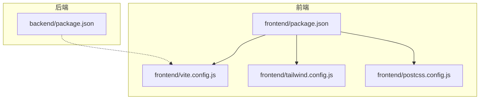
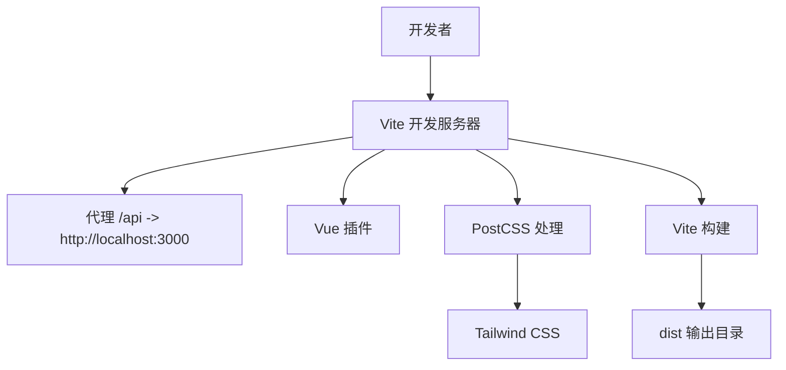
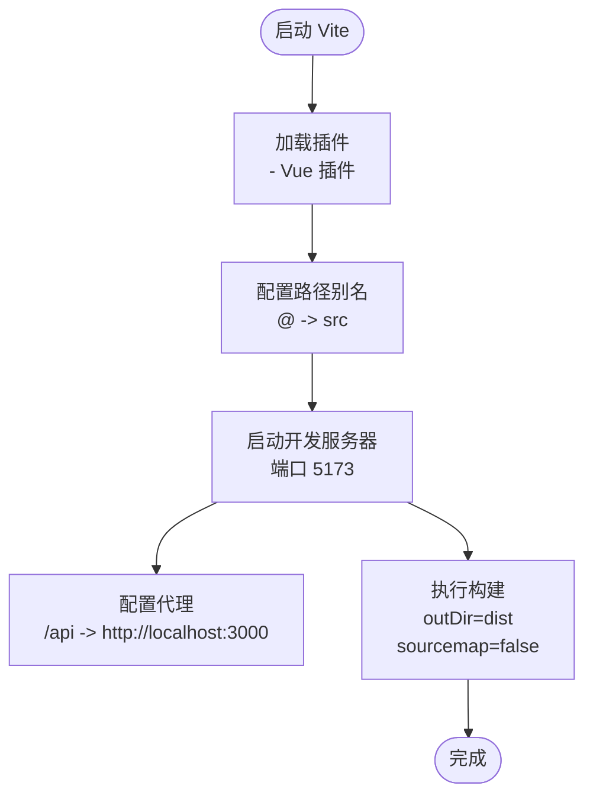
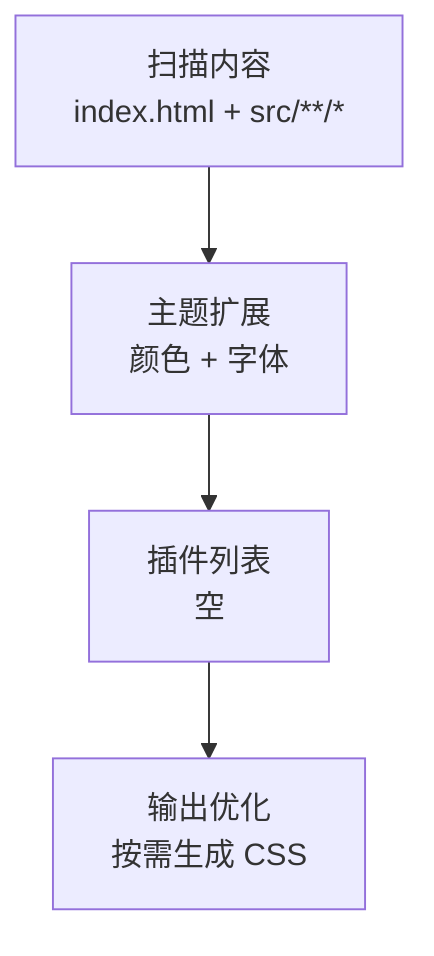
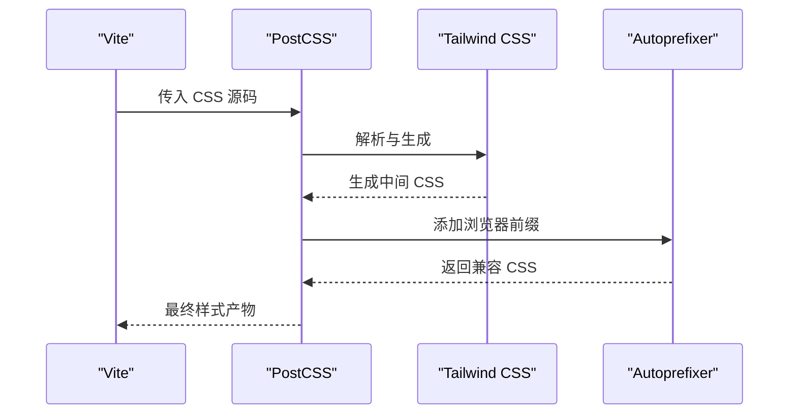
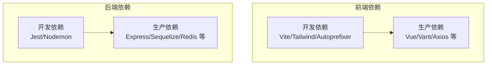

# 开发工具配置

<cite>
**本文档引用的文件**
- [frontend/package.json](file://frontend/package.json)
- [frontend/vite.config.js](file://frontend/vite.config.js)
- [frontend/tailwind.config.js](file://frontend/tailwind.config.js)
- [frontend/postcss.config.js](file://frontend/postcss.config.js)
- [backend/package.json](file://backend/package.json)
</cite>

## 目录
1. [简介](#简介)
2. [项目结构](#项目结构)
3. [核心组件](#核心组件)
4. [架构总览](#架构总览)
5. [详细组件分析](#详细组件分析)
6. [依赖关系分析](#依赖关系分析)
7. [性能考虑](#性能考虑)
8. [故障排除指南](#故障排除指南)
9. [结论](#结论)
10. [附录](#附录)

## 简介
本文件面向趣配鲜项目的前端与后端开发团队，系统化梳理开发工具链的配置与最佳实践，重点覆盖以下方面：
- Vite 构建工具：开发服务器、热重载、代理、生产构建优化
- 依赖管理：脚本命令、依赖分类（生产/开发/工具）
- Tailwind CSS：主题定制、插件与输出优化
- PostCSS：插件生态与自动前缀、压缩策略
- 开发环境：环境变量、代理设置、调试工具
- 代码质量：ESLint、Prettier、Git hooks
- 构建优化：代码分割、资源压缩、缓存策略

## 项目结构
前端与后端分别拥有独立的包管理与工具配置，采用分层组织方式：
- 前端目录包含 Vite 配置、Tailwind CSS 配置、PostCSS 配置以及 Vue 应用源码
- 后端目录包含 Node.js 服务端应用与测试工具配置

图表来源
- [frontend/package.json:1-26](file://frontend/package.json#L1-L26)
- [frontend/vite.config.js:1-26](file://frontend/vite.config.js#L1-L26)
- [frontend/tailwind.config.js:1-24](file://frontend/tailwind.config.js#L1-L24)
- [frontend/postcss.config.js:1-7](file://frontend/postcss.config.js#L1-L7)
- [backend/package.json:1-50](file://backend/package.json#L1-L50)

章节来源
- [frontend/package.json:1-26](file://frontend/package.json#L1-L26)
- [frontend/vite.config.js:1-26](file://frontend/vite.config.js#L1-L26)
- [frontend/tailwind.config.js:1-24](file://frontend/tailwind.config.js#L1-L24)
- [frontend/postcss.config.js:1-7](file://frontend/postcss.config.js#L1-L7)
- [backend/package.json:1-50](file://backend/package.json#L1-L50)

## 核心组件
本节从工具链视角概述各配置文件的作用与职责：
- Vite：前端开发服务器、代理、构建产物输出与源码映射控制
- Tailwind CSS：内容扫描路径、主题扩展（颜色、字体）、插件列表
- PostCSS：插件管线（Tailwind CSS、Autoprefixer），用于样式处理与兼容性增强
- 依赖管理：前端与后端各自维护的依赖与脚本命令，明确生产与开发阶段的工具边界

章节来源
- [frontend/vite.config.js:5-25](file://frontend/vite.config.js#L5-L25)
- [frontend/tailwind.config.js:2-23](file://frontend/tailwind.config.js#L2-L23)
- [frontend/postcss.config.js:1-7](file://frontend/postcss.config.js#L1-L7)
- [frontend/package.json:5-24](file://frontend/package.json#L5-L24)
- [backend/package.json:6-45](file://backend/package.json#L6-L45)

## 架构总览
下图展示前端开发工具链在本地开发与生产构建中的交互关系：

图表来源
- [frontend/vite.config.js:12-24](file://frontend/vite.config.js#L12-L24)
- [frontend/postcss.config.js:1-7](file://frontend/postcss.config.js#L1-L7)
- [frontend/tailwind.config.js:3-6](file://frontend/tailwind.config.js#L3-L6)

## 详细组件分析

### Vite 配置分析
- 插件体系
  - Vue 插件启用单文件组件支持与热重载
- 路径别名
  - 将 @ 指向 src 目录，提升导入可读性
- 开发服务器
  - 端口固定为 5173
  - 代理规则：将 /api 前缀转发到后端服务地址，支持跨域场景
- 构建输出
  - 输出目录为 dist
  - 关闭源码映射以减少构建体积与泄露风险

图表来源
- [frontend/vite.config.js:6-24](file://frontend/vite.config.js#L6-L24)

章节来源
- [frontend/vite.config.js:5-25](file://frontend/vite.config.js#L5-L25)

### Tailwind CSS 配置分析
- 内容扫描
  - 扫描入口 HTML 与 src 下所有 Vue/JS/TS 文件，确保按需生成样式
- 主题扩展
  - 定义品牌主色、辅助色、语义色（成功/警告/危险/信息）
  - 自定义无衬线字体族，适配中文字体显示
- 插件列表
  - 当前未启用额外插件，保持基础功能稳定

图表来源
- [frontend/tailwind.config.js:3-23](file://frontend/tailwind.config.js#L3-L23)

章节来源
- [frontend/tailwind.config.js:2-23](file://frontend/tailwind.config.js#L2-L23)

### PostCSS 配置分析
- 插件管线
  - Tailwind CSS：解析与生成样式
  - Autoprefixer：自动添加浏览器前缀，提升兼容性
- 作用范围
  - 在构建流程中对 CSS 进行统一处理，确保最终产物具备良好兼容性

图表来源
- [frontend/postcss.config.js:1-7](file://frontend/postcss.config.js#L1-L7)

章节来源
- [frontend/postcss.config.js:1-7](file://frontend/postcss.config.js#L1-L7)

### 依赖管理与脚本命令
- 前端
  - 生产依赖：Vue 3、路由、状态管理、HTTP 客户端、移动端 UI 组件库、日期处理等
  - 开发依赖：Vite、Vue 插件、PostCSS、Tailwind CSS、Autoprefixer
  - 脚本命令：dev、build、preview
- 后端
  - 生产依赖：Express、数据库连接、安全、日志、验证、缓存等
  - 开发依赖：测试框架、热重载工具、测试辅助
  - 脚本命令：start、dev、test

章节来源
- [frontend/package.json:10-24](file://frontend/package.json#L10-L24)
- [frontend/package.json:5-9](file://frontend/package.json#L5-L9)
- [backend/package.json:18-45](file://backend/package.json#L18-L45)
- [backend/package.json:6-10](file://backend/package.json#L6-L10)

### 开发环境配置
- 环境变量
  - 后端使用 dotenv 加载环境变量，建议在开发时通过 .env 文件管理敏感配置
- 代理设置
  - 前端 Vite 将 /api 请求代理至后端服务地址，便于前后端联调
- 调试工具
  - 后端使用 nodemon 实现开发期自动重启
  - 建议结合浏览器开发者工具与后端日志进行联调

章节来源
- [backend/package.json:24](file://backend/package.json#L24)
- [frontend/vite.config.js:14-19](file://frontend/vite.config.js#L14-L19)
- [backend/package.json:8](file://backend/package.json#L8)

### 代码质量工具配置
- ESLint
  - 建议在项目根目录新增 eslint.config.* 或 .eslintrc.*，统一前端与后端规则
  - 可参考官方推荐规则集，结合团队规范制定
- Prettier
  - 建议新增 .prettierrc 或 prettier.config.*，并与 ESLint 的格式化规则保持一致
- Git hooks
  - 建议集成 lint-staged 与 husky，在提交前自动运行 ESLint/Prettier，保证代码风格一致性

[本节为通用实践指导，不直接分析具体文件，故不附加章节来源]

### 构建优化策略
- 代码分割
  - 使用动态导入拆分路由与组件，降低首屏体积
- 资源压缩
  - 生产构建默认启用压缩；如需进一步优化，可在 Vite 中启用更严格的压缩策略
- 缓存策略
  - 对静态资源启用长效缓存，结合文件指纹命名避免缓存污染
  - 合理设置 HTTP 缓存头，平衡更新频率与性能

[本节为通用实践指导，不直接分析具体文件，故不附加章节来源]

## 依赖关系分析
前端与后端的依赖关系如下所示：

图表来源
- [frontend/package.json:10-24](file://frontend/package.json#L10-L24)
- [backend/package.json:18-45](file://backend/package.json#L18-L45)

章节来源
- [frontend/package.json:10-24](file://frontend/package.json#L10-L24)
- [backend/package.json:18-45](file://backend/package.json#L18-L45)

## 性能考虑
- 构建阶段
  - 关闭源码映射可显著减少构建时间与产物体积（前端已关闭）
  - 启用压缩与 Tree Shaking，移除未使用代码
- 运行阶段
  - 合理拆分路由与组件，利用懒加载降低首屏负载
  - 对第三方库进行按需引入，避免全量打包

[本节为通用实践指导，不直接分析具体文件，故不附加章节来源]

## 故障排除指南
- 代理请求失败
  - 确认后端服务已在 3000 端口运行
  - 检查代理目标地址与跨域配置
- 热重载失效
  - 确认开发服务器端口未被占用
  - 检查 Vue 插件是否正确加载
- 样式未生效
  - 确认 Tailwind 内容扫描路径包含相关文件
  - 检查 PostCSS 插件顺序与版本兼容性

章节来源
- [frontend/vite.config.js:12-24](file://frontend/vite.config.js#L12-L24)
- [frontend/tailwind.config.js:3-6](file://frontend/tailwind.config.js#L3-L6)
- [frontend/postcss.config.js:1-7](file://frontend/postcss.config.js#L1-L7)

## 结论
本配置文档基于现有配置文件，系统梳理了 Vite、Tailwind CSS、PostCSS 与依赖管理的关键点，并补充了代码质量与构建优化的通用实践建议。建议团队在后续迭代中逐步完善 ESLint、Prettier 与 Git hooks 的落地，持续提升开发效率与代码质量。

## 附录
- 快速对照表
  - 前端脚本命令：dev、build、preview
  - 前端开发服务器端口：5173
  - 前端代理规则：/api -> http://localhost:3000
  - 前端构建输出目录：dist
  - Tailwind 内容扫描路径：index.html、src/**/*.{vue,js,ts,jsx,tsx}
  - Tailwind 主题扩展：品牌色、语义色、自定义字体
  - PostCSS 插件：tailwindcss、autoprefixer
  - 后端脚本命令：start、dev、test
  - 后端环境变量：dotenv 支持

章节来源
- [frontend/package.json:5-9](file://frontend/package.json#L5-L9)
- [frontend/vite.config.js:12-24](file://frontend/vite.config.js#L12-L24)
- [frontend/tailwind.config.js:3-23](file://frontend/tailwind.config.js#L3-L23)
- [frontend/postcss.config.js:1-7](file://frontend/postcss.config.js#L1-L7)
- [backend/package.json:6-10](file://backend/package.json#L6-L10)
- [backend/package.json:24](file://backend/package.json#L24)