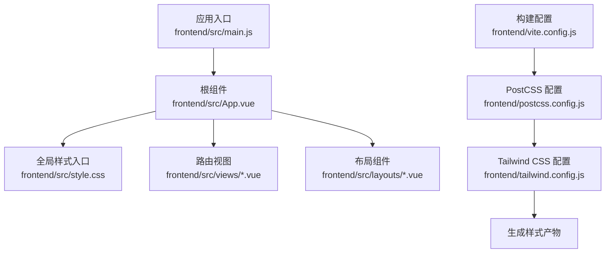
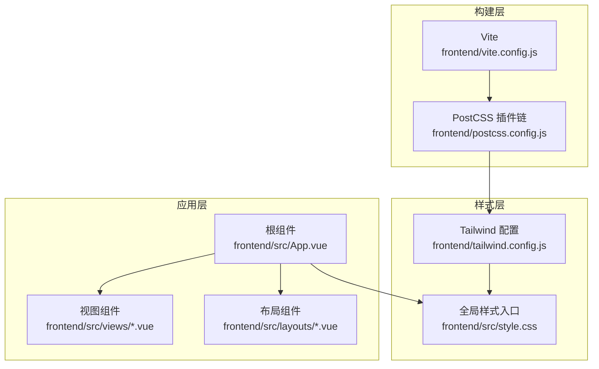
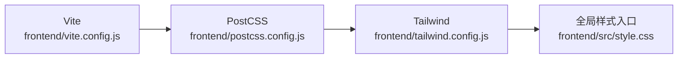

# 样式系统

<cite>
**本文引用的文件**
- [tailwind.config.js](file://frontend/tailwind.config.js)
- [postcss.config.js](file://frontend/postcss.config.js)
- [vite.config.js](file://frontend/vite.config.js)
- [style.css](file://frontend/src/style.css)
- [App.vue](file://frontend/src/App.vue)
- [Home.vue](file://frontend/src/views/Home.vue)
- [Products.vue](file://frontend/src/views/Products.vue)
- [ProductDetail.vue](file://frontend/src/views/ProductDetail.vue)
- [Cart.vue](file://frontend/src/views/Cart.vue)
- [Checkout.vue](file://frontend/src/views/Checkout.vue)
- [OrderDetail.vue](file://frontend/src/views/OrderDetail.vue)
- [UserProfile.vue](file://frontend/src/views/Profile.vue)
- [Login.vue](file://frontend/src/views/Login.vue)
- [TabbarLayout.vue](file://frontend/src/layouts/TabbarLayout.vue)
- [package.json](file://frontend/package.json)
</cite>

## 目录
1. [简介](#简介)
2. [项目结构](#项目结构)
3. [核心组件](#核心组件)
4. [架构总览](#架构总览)
5. [详细组件分析](#详细组件分析)
6. [依赖关系分析](#依赖关系分析)
7. [性能考量](#性能考量)
8. [故障排查指南](#故障排查指南)
9. [结论](#结论)
10. [附录](#附录)

## 简介
本文件面向趣配鲜项目的样式系统，系统性梳理 Tailwind CSS 配置与使用、CSS 变量体系、样式组织最佳实践、响应式设计策略、动画与过渡效果、PostCSS 配置与插件、以及调试与优化技巧。目标是帮助前端与设计团队在统一规范下高效协作，确保跨设备一致体验与良好性能。

## 项目结构
前端样式相关的核心文件集中在 frontend 目录，关键配置与入口如下：
- Tailwind CSS 配置：frontend/tailwind.config.js
- PostCSS 配置：frontend/postcss.config.js
- 构建配置（Vite）：frontend/vite.config.js
- 全局样式入口：frontend/src/style.css
- 应用根组件：frontend/src/App.vue
- 视图与布局：frontend/src/views/*.vue、frontend/src/layouts/*.vue

**图表来源**
- [vite.config.js](file://frontend/vite.config.js)
- [postcss.config.js](file://frontend/postcss.config.js)
- [tailwind.config.js](file://frontend/tailwind.config.js)
- [style.css](file://frontend/src/style.css)
- [App.vue](file://frontend/src/App.vue)

**章节来源**
- [tailwind.config.js](file://frontend/tailwind.config.js)
- [postcss.config.js](file://frontend/postcss.config.js)
- [vite.config.js](file://frontend/vite.config.js)
- [style.css](file://frontend/src/style.css)
- [App.vue](file://frontend/src/App.vue)

## 核心组件
- Tailwind CSS 配置：定义工具类扩展、响应式断点、内容路径扫描、暗色模式等。
- PostCSS 配置：集成自动前缀、CSS 压缩、插件链路。
- 构建配置：Vite 中对 PostCSS 的集成与开发/生产环境差异。
- 全局样式入口：集中引入 Tailwind 指令、重置样式、CSS 变量与基础排版。
- 组件样式：通过 Tailwind 工具类实现原子化样式，配合局部样式隔离与主题变量。

**章节来源**
- [tailwind.config.js](file://frontend/tailwind.config.js)
- [postcss.config.js](file://frontend/postcss.config.js)
- [vite.config.js](file://frontend/vite.config.js)
- [style.css](file://frontend/src/style.css)

## 架构总览
样式系统以 Tailwind 为核心，借助 PostCSS 完成编译与优化，Vite 提供开发与打包能力。全局样式入口负责注入基础规则与变量，各业务视图通过原子化工具类快速实现设计稿。

**图表来源**
- [vite.config.js](file://frontend/vite.config.js)
- [postcss.config.js](file://frontend/postcss.config.js)
- [tailwind.config.js](file://frontend/tailwind.config.js)
- [style.css](file://frontend/src/style.css)
- [App.vue](file://frontend/src/App.vue)

## 详细组件分析

### Tailwind CSS 配置与使用
- 工具类命名规范
  - 使用语义化前缀与分组，如颜色、间距、排版、阴影、边框等，避免随意拼接。
  - 通过扩展配置新增品牌色板与业务专用工具类，保持一致性。
- 响应式断点
  - 在配置中定义移动端到桌面端的断点映射，确保在不同设备上正确生效。
  - 优先使用相对单位与流式布局，减少固定像素依赖。
- 自定义配置
  - 内容扫描路径包含所有视图与布局文件，确保按需生成样式。
  - 启用暗色模式并定义主题切换逻辑，保证视觉一致性。
- 实践建议
  - 将常用组合封装为组件或指令，降低重复代码。
  - 严格控制工具类数量，避免过度嵌套与无意义堆叠。

**章节来源**
- [tailwind.config.js](file://frontend/tailwind.config.js)

### CSS 变量与主题系统
- 主题色定义
  - 在全局样式入口中定义 CSS 变量，集中管理主色、强调色、状态色与背景色。
  - 通过变量名语义化区分明暗模式下的颜色值，便于维护与扩展。
- 字体大小规范
  - 建立字号层级表，结合媒体查询在不同断点下调整字号与行高。
  - 使用相对单位（rem/em/%）提升可访问性与可读性。
- 间距系统
  - 采用步进式间距（如 0.25 的倍数），形成统一的网格系统。
  - 通过变量与工具类结合，确保组件间间距一致。

**章节来源**
- [style.css](file://frontend/src/style.css)

### 样式组织最佳实践
- 样式模块化
  - 将通用样式拆分为独立模块，按功能域划分目录，避免全局污染。
- 组件样式隔离
  - 利用作用域样式与 BEM 或变体命名法，防止样式冲突。
- 全局样式管理
  - 在全局入口中统一引入重置、排版与主题变量，确保一致性。
- 视图与布局
  - 视图组件专注业务样式，布局组件负责容器与栅格，职责清晰。

**章节来源**
- [App.vue](file://frontend/src/App.vue)
- [TabbarLayout.vue](file://frontend/src/layouts/TabbarLayout.vue)
- [Home.vue](file://frontend/src/views/Home.vue)
- [Products.vue](file://frontend/src/views/Products.vue)
- [ProductDetail.vue](file://frontend/src/views/ProductDetail.vue)
- [Cart.vue](file://frontend/src/views/Cart.vue)
- [Checkout.vue](file://frontend/src/views/Checkout.vue)
- [OrderDetail.vue](file://frontend/src/views/OrderDetail.vue)
- [UserProfile.vue](file://frontend/src/views/Profile.vue)
- [Login.vue](file://frontend/src/views/Login.vue)

### 响应式设计实现
- 移动端适配
  - 使用窄屏优先策略，先满足手机体验再逐步增强至平板与桌面。
  - 控制触摸目标最小尺寸，保证可点击区域与间距合理。
- 屏幕尺寸适配
  - 结合断点与流式布局，避免固定宽度导致的溢出。
  - 图片与媒体资源采用响应式尺寸与懒加载。
- 触摸设备优化
  - 减少 hover 依赖，使用 active/focus 状态替代。
  - 适当增大点击热区，避免误触。

**章节来源**
- [tailwind.config.js](file://frontend/tailwind.config.js)
- [style.css](file://frontend/src/style.css)

### 动画与过渡效果
- 页面切换动画
  - 使用路由级过渡与页面级动画，控制入场/离场时序与缓动曲线。
- 组件进入/退出动画
  - 对弹窗、抽屉、列表项等使用显式动画，避免突兀切换。
- 交互反馈效果
  - 按钮按下、选中态、加载态等使用过渡与微动效，提升感知质量。
- 性能建议
  - 优先使用 transform 与 opacity，减少重排与重绘。
  - 控制动画时长与数量，避免影响滚动性能。

**章节来源**
- [App.vue](file://frontend/src/App.vue)
- [Home.vue](file://frontend/src/views/Home.vue)
- [Products.vue](file://frontend/src/views/Products.vue)

### PostCSS 配置与插件
- 自动前缀
  - 通过插件链自动添加浏览器前缀，减少手工维护成本。
- CSS 压缩
  - 生产环境启用压缩与去空白，减小包体积。
- 预处理器配置
  - 在 Vite 中集成 PostCSS，确保开发与生产行为一致。
- 插件选择
  - 优先选择稳定、活跃维护且与 Tailwind 兼容的插件。

**章节来源**
- [postcss.config.js](file://frontend/postcss.config.js)
- [vite.config.js](file://frontend/vite.config.js)

### 样式调试与优化
- 浏览器兼容性
  - 关注旧版浏览器的特性支持，必要时提供降级方案或 polyfill。
- 性能优化
  - 按需生成样式，避免未使用类导致的体积膨胀。
  - 合理拆分样式与脚本，利用缓存与懒加载。
- 调试技巧
  - 使用开发者工具检查元素样式来源与覆盖关系。
  - 通过伪类与可视化网格辅助定位布局问题。

**章节来源**
- [tailwind.config.js](file://frontend/tailwind.config.js)
- [postcss.config.js](file://frontend/postcss.config.js)
- [vite.config.js](file://frontend/vite.config.js)

## 依赖关系分析
- Tailwind 与 PostCSS
  - Tailwind 通过 PostCSS 插件链进行编译，最终输出 CSS。
- 构建与运行
  - Vite 负责开发服务器与打包，PostCSS 在其构建流程中执行。
- 样式入口
  - 全局样式入口集中引入 Tailwind 指令与变量，确保组件共享主题。

**图表来源**
- [vite.config.js](file://frontend/vite.config.js)
- [postcss.config.js](file://frontend/postcss.config.js)
- [tailwind.config.js](file://frontend/tailwind.config.js)
- [style.css](file://frontend/src/style.css)

**章节来源**
- [vite.config.js](file://frontend/vite.config.js)
- [postcss.config.js](file://frontend/postcss.config.js)
- [tailwind.config.js](file://frontend/tailwind.config.js)
- [style.css](file://frontend/src/style.css)

## 性能考量
- 样式体积控制
  - 仅生成实际使用的工具类，定期清理未使用类。
- 渲染性能
  - 避免复杂选择器与深层嵌套，减少重排与重绘。
- 加载性能
  - 启用压缩与缓存策略，拆分首屏样式与非关键样式。
- 可访问性
  - 保障对比度与键盘导航，使用合适的动画时长与频闪限制。

## 故障排查指南
- Tailwind 未生成样式
  - 检查内容扫描路径是否包含目标文件。
  - 确认构建命令与开发服务器启动方式。
- PostCSS 报错
  - 核对插件版本与兼容性，确保配置语法正确。
- 样式冲突
  - 使用作用域与更具体的选择器，避免全局污染。
- 响应式异常
  - 检查断点设置与媒体查询顺序，确认设备模拟与真机测试。

**章节来源**
- [tailwind.config.js](file://frontend/tailwind.config.js)
- [postcss.config.js](file://frontend/postcss.config.js)
- [vite.config.js](file://frontend/vite.config.js)

## 结论
通过统一的 Tailwind 配置、PostCSS 插件链与全局样式入口，趣配鲜项目实现了可维护、可扩展、高性能的样式体系。建议持续完善主题变量与断点规范，强化组件化与隔离策略，并在迭代中不断优化动画与交互细节，以获得更佳的用户体验。

## 附录
- 依赖清单
  - Tailwind CSS、PostCSS 及相关插件由前端包管理器维护，建议定期更新以获取安全补丁与性能改进。
- 版本与兼容
  - 确保 Node.js 与构建工具版本满足依赖要求，避免因版本不匹配引发的问题。

**章节来源**
- [package.json](file://frontend/package.json)