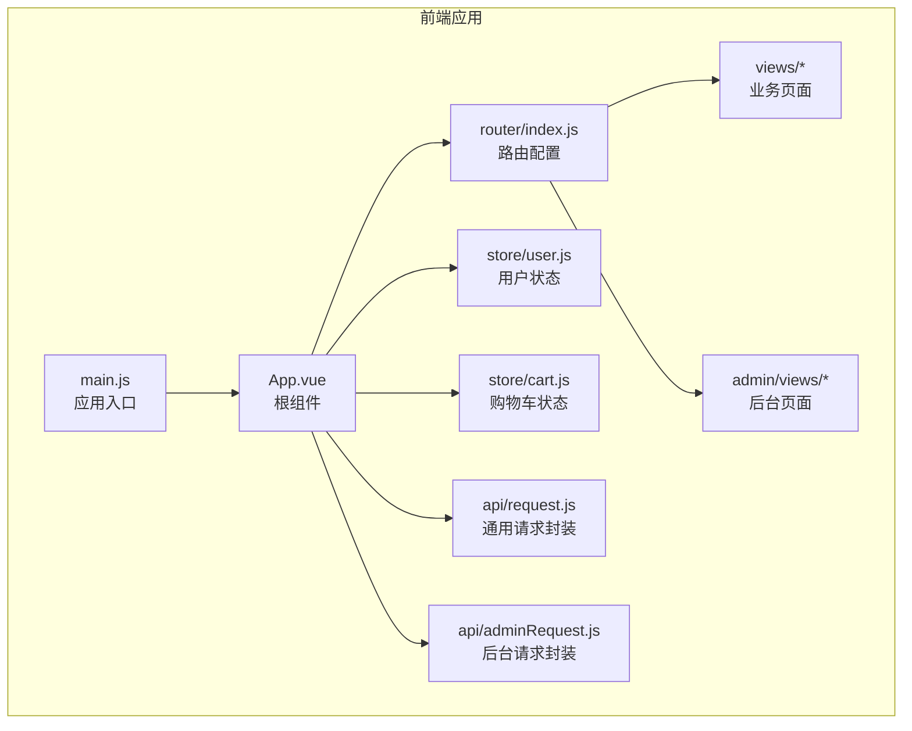
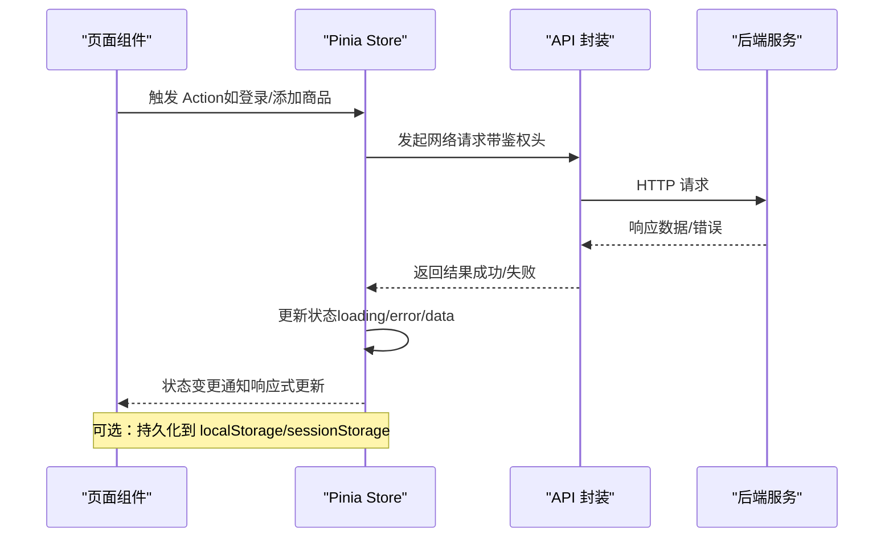
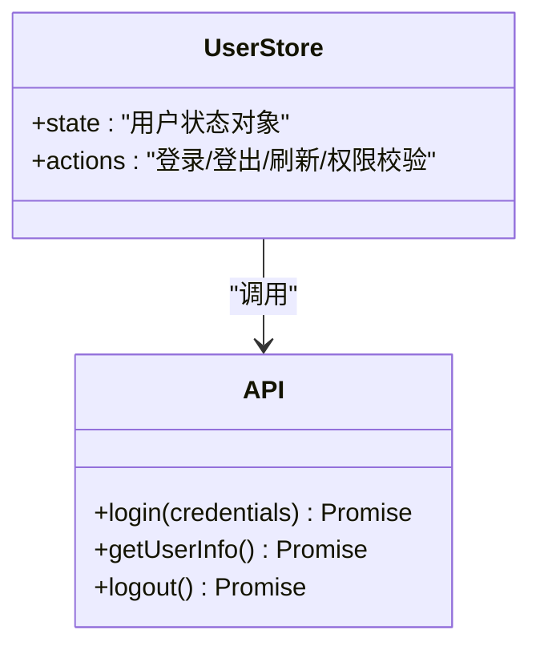
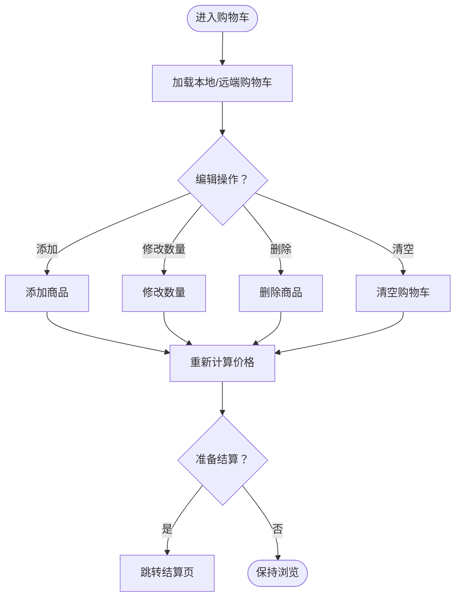
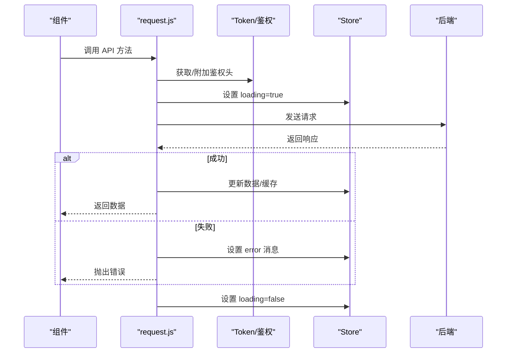
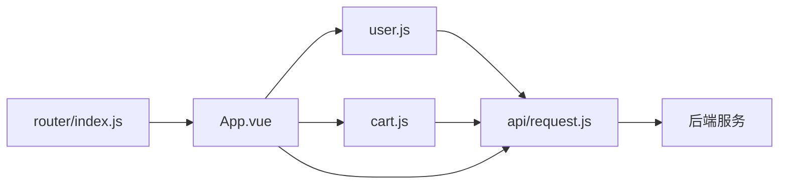

# 状态管理

<cite>
**本文引用的文件**
- [cart.js](file://frontend/src/store/cart.js)
- [user.js](file://frontend/src/store/user.js)
- [main.js](file://frontend/src/main.js)
- [App.vue](file://frontend/src/App.vue)
- [Checkout.vue](file://frontend/src/views/Checkout.vue)
- [Cart.vue](file://frontend/src/views/Cart.vue)
- [Login.vue](file://frontend/src/views/Login.vue)
- [Profile.vue](file://frontend/src/views/Profile.vue)
- [Orders.vue](file://frontend/src/views/Orders.vue)
- [OrderDetail.vue](file://frontend/src/views/OrderDetail.vue)
- [ProductDetail.vue](file://frontend/src/views/ProductDetail.vue)
- [Products.vue](file://frontend/src/views/Products.vue)
- [Favorites.vue](file://frontend/src/views/Favorites.vue)
- [Coupons.vue](file://frontend/src/views/Coupons.vue)
- [Addresses.vue](file://frontend/src/views/Addresses.vue)
- [AddressEdit.vue](file://frontend/src/views/AddressEdit.vue)
- [Qualifications.vue](file://frontend/src/views/Qualifications.vue)
- [RecipeDetail.vue](file://frontend/src/views/RecipeDetail.vue)
- [Recipes.vue](file://frontend/src/views/Recipes.vue)
- [AfterSales.vue](file://frontend/src/views/AfterSales.vue)
- [admin/Login.vue](file://frontend/src/admin/views/Login.vue)
- [admin/Home.vue](file://frontend/src/admin/views/Home.vue)
- [admin/Orders.vue](file://frontend/src/admin/views/Orders.vue)
- [admin/Products.vue](file://frontend/src/admin/views/Products.vue)
- [admin/Coupons.vue](file://frontend/src/admin/views/Coupons.vue)
- [admin/Banners.vue](file://frontend/src/admin/views/Banners.vue)
- [admin/Stats.vue](file://frontend/src/admin/views/Stats.vue)
- [admin/Settings.vue](file://frontend/src/admin/views/Settings.vue)
- [admin/Users.vue](file://frontend/src/admin/views/Users.vue)
- [admin/Notices.vue](file://frontend/src/admin/views/Notices.vue)
- [admin/Recipes.vue](file://frontend/src/admin/views/Recipes.vue)
- [router/index.js](file://frontend/src/router/index.js)
- [api/request.js](file://frontend/src/api/request.js)
- [api/adminRequest.js](file://frontend/src/api/adminRequest.js)
- [api/index.js](file://frontend/src/api/index.js)
- [package.json](file://frontend/package.json)
</cite>

## 目录
1. [简介](#简介)
2. [项目结构](#项目结构)
3. [核心组件](#核心组件)
4. [架构总览](#架构总览)
5. [详细组件分析](#详细组件分析)
6. [依赖关系分析](#依赖关系分析)
7. [性能考虑](#性能考虑)
8. [故障排查指南](#故障排查指南)
9. [结论](#结论)
10. [附录](#附录)

## 简介
本文件围绕“趣配鲜”前端项目的状态管理进行系统化梳理，重点覆盖以下方面：
- Pinia 状态管理库的使用：store 定义、状态声明与 action 实现
- 用户状态管理：登录状态、个人信息、权限控制
- 购物车状态管理：商品添加、数量修改、结算流程
- API 请求状态管理：loading、错误、缓存策略
- 状态持久化：localStorage/sessionStorage 的使用建议
- 状态同步机制：跨组件共享与全局更新
- 状态调试：Vue DevTools 配置与监控方法

## 项目结构
前端采用 Vite 构建，状态管理位于 frontend/src/store 目录，包含用户与购物车两个核心 store；路由在 frontend/src/router/index.js 中集中管理；API 封装在 frontend/src/api 下；各页面视图位于 frontend/src/views 与 frontend/src/admin/views。

图表来源
- [main.js](file://frontend/src/main.js)
- [App.vue](file://frontend/src/App.vue)
- [router/index.js](file://frontend/src/router/index.js)
- [user.js](file://frontend/src/store/user.js)
- [cart.js](file://frontend/src/store/cart.js)
- [api/request.js](file://frontend/src/api/request.js)
- [api/adminRequest.js](file://frontend/src/api/adminRequest.js)

章节来源
- [main.js](file://frontend/src/main.js)
- [App.vue](file://frontend/src/App.vue)
- [router/index.js](file://frontend/src/router/index.js)

## 核心组件
- 用户状态模块（user.js）：负责用户登录态、用户信息、权限标识等
- 购物车状态模块（cart.js）：负责购物车商品列表、数量、选中状态、结算状态等
- API 模块（request.js、adminRequest.js）：统一处理请求、响应、错误与鉴权头注入
- 应用入口（main.js）：挂载 Pinia 并初始化应用
- 根组件（App.vue）：承载全局布局与状态消费

章节来源
- [user.js](file://frontend/src/store/user.js)
- [cart.js](file://frontend/src/store/cart.js)
- [api/request.js](file://frontend/src/api/request.js)
- [api/adminRequest.js](file://frontend/src/api/adminRequest.js)
- [main.js](file://frontend/src/main.js)
- [App.vue](file://frontend/src/App.vue)

## 架构总览
下图展示状态从页面到 store 再到 API 的流转路径，以及状态持久化与调试的交互位置。

图表来源
- [user.js](file://frontend/src/store/user.js)
- [cart.js](file://frontend/src/store/cart.js)
- [api/request.js](file://frontend/src/api/request.js)
- [api/adminRequest.js](file://frontend/src/api/adminRequest.js)

## 详细组件分析

### 用户状态模块（user.js）
职责边界
- 维护登录态（token、过期时间）
- 存储用户基本信息（id、昵称、角色/权限）
- 提供登录、登出、刷新令牌、权限校验等动作
- 与 API 层协作完成认证与授权

关键能力示意
- 状态字段：用户标识、登录态、权限集合、加载标志
- 动作方法：登录、登出、获取用户信息、设置权限
- 生命周期：应用启动时可尝试恢复登录态

图表来源
- [user.js](file://frontend/src/store/user.js)
- [api/request.js](file://frontend/src/api/request.js)

章节来源
- [user.js](file://frontend/src/store/user.js)
- [Login.vue](file://frontend/src/views/Login.vue)
- [Profile.vue](file://frontend/src/views/Profile.vue)
- [Orders.vue](file://frontend/src/views/Orders.vue)
- [OrderDetail.vue](file://frontend/src/views/OrderDetail.vue)

### 购物车状态模块（cart.js）
职责边界
- 维护购物车商品列表与数量
- 计算小计、合计、优惠与运费
- 支持商品增删改、全选/反选、清空
- 结算前的数据校验与状态标记

关键能力示意
- 状态字段：商品项数组、选中状态、数量映射、结算状态
- 动作方法：添加商品、修改数量、删除、清空、计算价格
- 与页面联动：Cart.vue、Checkout.vue、ProductDetail.vue

图表来源
- [cart.js](file://frontend/src/store/cart.js)
- [Cart.vue](file://frontend/src/views/Cart.vue)
- [Checkout.vue](file://frontend/src/views/Checkout.vue)
- [ProductDetail.vue](file://frontend/src/views/ProductDetail.vue)

章节来源
- [cart.js](file://frontend/src/store/cart.js)
- [Cart.vue](file://frontend/src/views/Cart.vue)
- [Checkout.vue](file://frontend/src/views/Checkout.vue)
- [ProductDetail.vue](file://frontend/src/views/ProductDetail.vue)

### API 请求状态管理（request.js、adminRequest.js）
职责边界
- 统一拦截器：注入 token、处理 401/403、错误提示
- 加载与错误状态：通过 store 或组件局部状态反馈 loading/error
- 缓存策略：按需缓存 GET 请求结果，支持失效与刷新
- 后台通道：adminRequest.js 用于后台管理接口

关键能力示意
- 请求前：鉴权头注入、loading 开启
- 响应后：成功回调、错误处理、loading 关闭
- 缓存：内存缓存或 localStorage 缓存（按接口粒度）

图表来源
- [api/request.js](file://frontend/src/api/request.js)
- [api/adminRequest.js](file://frontend/src/api/adminRequest.js)
- [user.js](file://frontend/src/store/user.js)

章节来源
- [api/request.js](file://frontend/src/api/request.js)
- [api/adminRequest.js](file://frontend/src/api/adminRequest.js)
- [api/index.js](file://frontend/src/api/index.js)

### 状态持久化方案
目标：在刷新或关闭浏览器后仍能保留关键状态
- localStorage：适合长期保存（如用户登录态、购物车）
- sessionStorage：适合会话级保存（如临时表单数据）
- 推荐实践：
  - 登录态：持久化 token 与用户信息，应用启动时恢复
  - 购物车：持久化商品清单与数量，页面加载时合并远端数据
  - 配置类：仅缓存必要字段，避免存储敏感信息

章节来源
- [user.js](file://frontend/src/store/user.js)
- [cart.js](file://frontend/src/store/cart.js)

### 状态同步与跨组件共享
- 全局状态：Pinia store 在 App.vue 下对所有页面生效
- 跨页面共享：通过路由守卫与 store 共享用户态与购物车态
- 组件间通信：通过 store 的响应式状态自动驱动视图更新
- 权限控制：结合路由守卫与用户 store 的权限字段进行访问控制

章节来源
- [App.vue](file://frontend/src/App.vue)
- [router/index.js](file://frontend/src/router/index.js)
- [user.js](file://frontend/src/store/user.js)

### 状态调试与监控（Vue DevTools）
- 安装与启用：确保开发环境安装 Vue DevTools 扩展
- 调试步骤：
  - 查看组件树与状态快照
  - 观察 store 的 actions 与 mutations（在 Pinia 中为 actions）
  - 追踪状态变化的时间线，定位异步请求与副作用
  - 监控 loading/error 状态，验证 API 流程
- 最佳实践：
  - 为关键状态命名清晰的字段名
  - 使用分层 store（如 user/cart）隔离关注点
  - 对复杂流程增加日志或断点

章节来源
- [main.js](file://frontend/src/main.js)
- [user.js](file://frontend/src/store/user.js)
- [cart.js](file://frontend/src/store/cart.js)

## 依赖关系分析
- store 依赖关系：user 与 cart 互不依赖，均依赖 API 封装
- 页面依赖关系：各页面通过路由集中管理，共享同一 store
- API 依赖关系：request.js 与 adminRequest.js 分别服务于前台与后台

图表来源
- [user.js](file://frontend/src/store/user.js)
- [cart.js](file://frontend/src/store/cart.js)
- [api/request.js](file://frontend/src/api/request.js)
- [App.vue](file://frontend/src/App.vue)
- [router/index.js](file://frontend/src/router/index.js)

章节来源
- [user.js](file://frontend/src/store/user.js)
- [cart.js](file://frontend/src/store/cart.js)
- [api/request.js](file://frontend/src/api/request.js)
- [router/index.js](file://frontend/src/router/index.js)

## 性能考虑
- 状态拆分：将用户与购物车拆分为独立 store，降低耦合与重渲染范围
- 数据缓存：对高频读取的列表与详情采用缓存，减少重复请求
- 异步优化：合理使用 loading 状态，避免阻塞 UI；批量更新状态以减少多次渲染
- 持久化策略：仅持久化必要数据，避免大体积对象频繁序列化/反序列化
- 路由守卫：在进入受保护页面前先检查 store 中的登录态，避免无效请求

## 故障排查指南
常见问题与解决思路
- 登录后页面未更新：检查 store 是否正确写入用户信息与 token，并确认组件是否订阅了相应状态
- 购物车数量不同步：检查 store 的数量更新逻辑与页面绑定，确保响应式更新
- 请求失败但无提示：检查 API 封装中的错误处理分支与 loading 状态是否正确切换
- 刷新丢失状态：确认持久化逻辑是否在应用启动时执行，且键名一致

章节来源
- [user.js](file://frontend/src/store/user.js)
- [cart.js](file://frontend/src/store/cart.js)
- [api/request.js](file://frontend/src/api/request.js)

## 结论
本项目采用 Pinia 进行状态管理，将用户与购物车状态解耦并集中管理，配合统一的 API 封装与路由守卫，实现了清晰的权限控制与良好的用户体验。通过合理的缓存与持久化策略，进一步提升了性能与可用性。建议在后续迭代中持续完善调试流程与错误监控，确保状态一致性与可观测性。

## 附录
- 依赖安装与运行
  - 安装依赖：使用包管理器安装 frontend 与 backend 的依赖
  - 启动前端：在 frontend 目录执行构建与运行命令
  - 启动后端：在 backend 目录执行启动脚本
- 版本与工具
  - 前端使用 Vite 构建，Pinia 作为状态管理库
  - Vue DevTools 用于状态调试与监控

章节来源
- [package.json](file://frontend/package.json)
- [main.js](file://frontend/src/main.js)