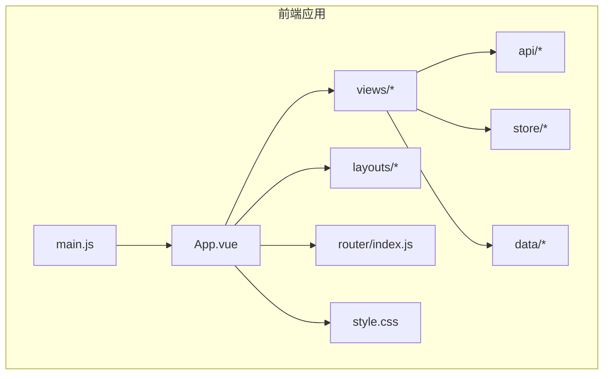
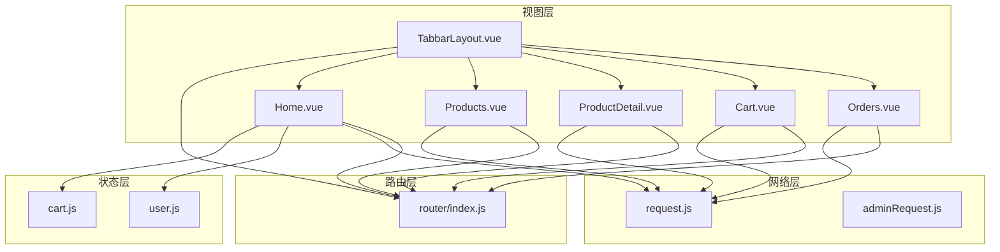
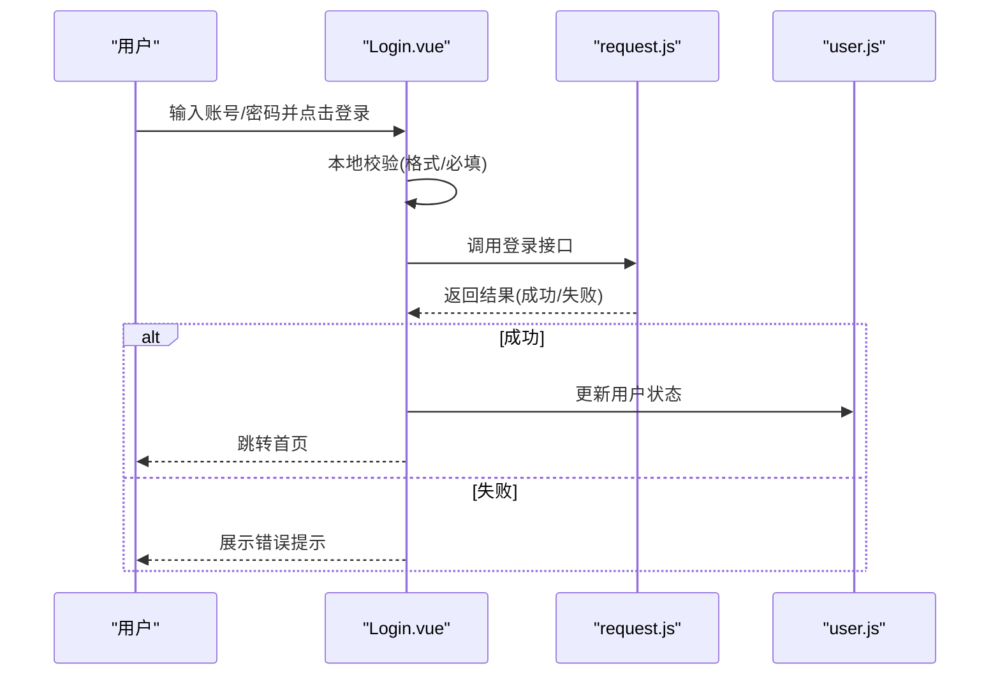
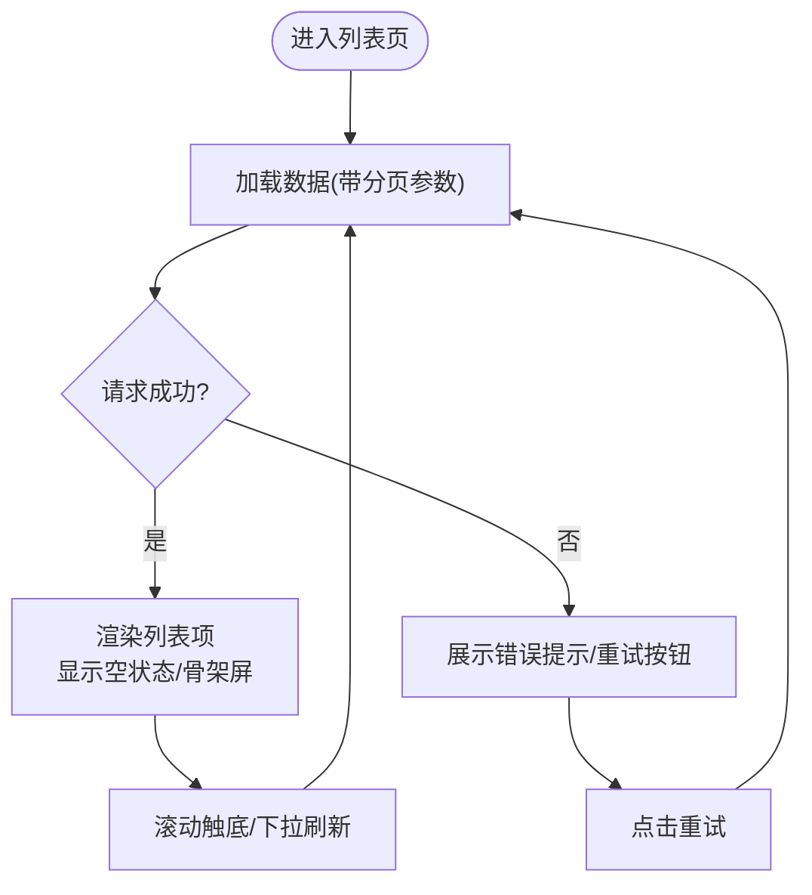
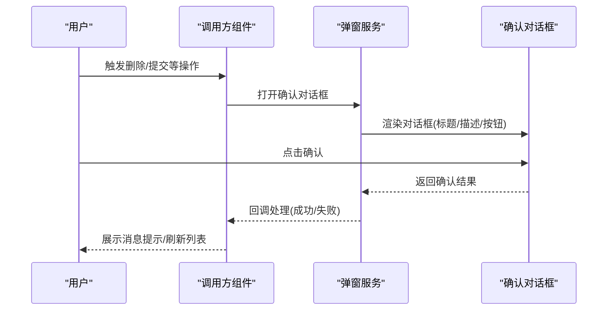
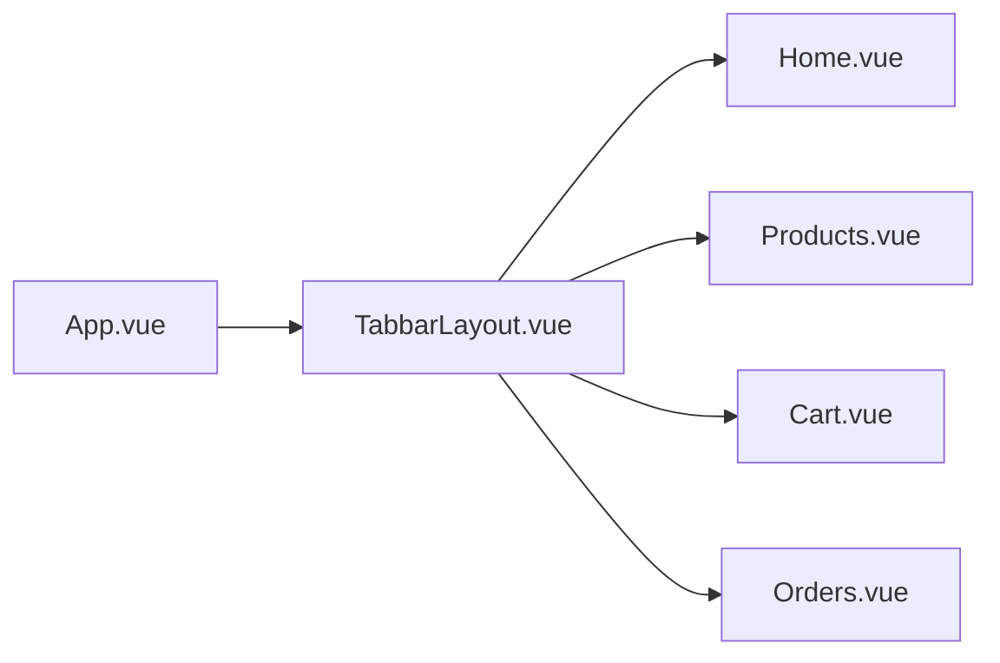
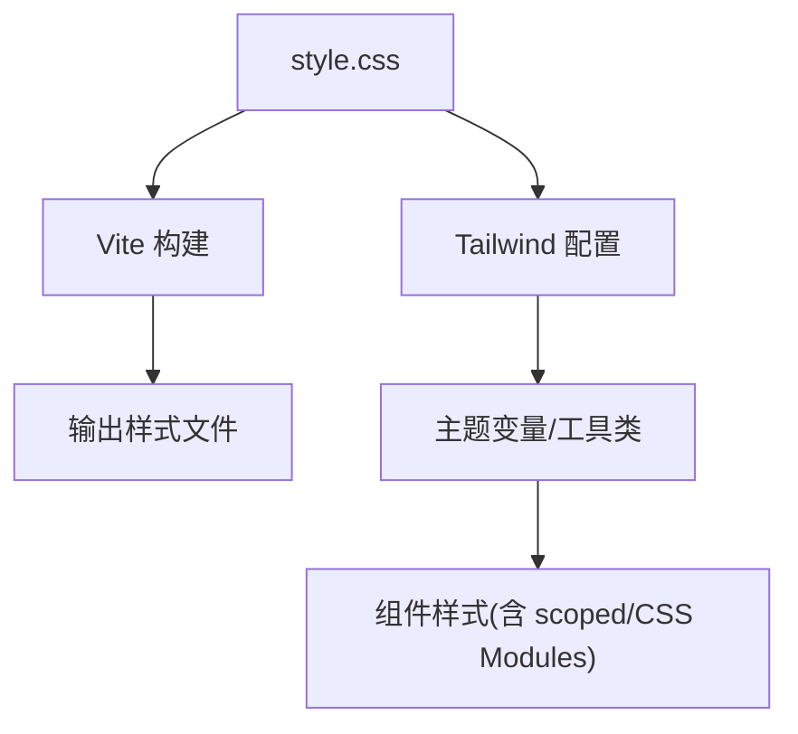
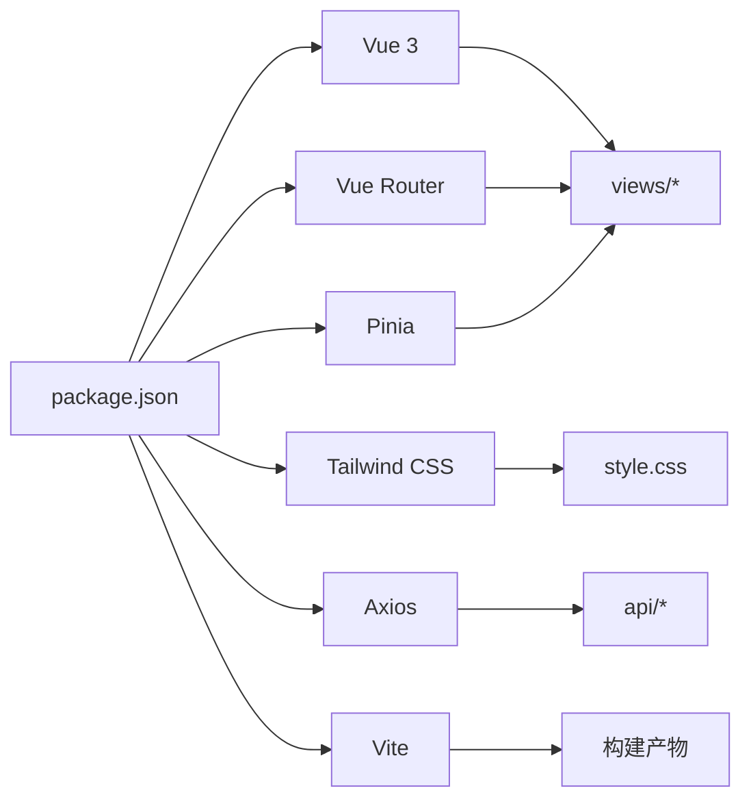

# 公共组件开发

<cite>
**本文引用的文件**
- [App.vue](file://frontend/src/App.vue)
- [main.js](file://frontend/src/main.js)
- [style.css](file://frontend/src/style.css)
- [TabbarLayout.vue](file://frontend/src/layouts/TabbarLayout.vue)
- [Home.vue](file://frontend/src/views/Home.vue)
- [Products.vue](file://frontend/src/views/Products.vue)
- [ProductDetail.vue](file://frontend/src/views/ProductDetail.vue)
- [Cart.vue](file://frontend/src/views/Cart.vue)
- [Checkout.vue](file://frontend/src/views/Checkout.vue)
- [Orders.vue](file://frontend/src/views/Orders.vue)
- [OrderDetail.vue](file://frontend/src/views/OrderDetail.vue)
- [Coupons.vue](file://frontend/src/views/Coupons.vue)
- [Favorites.vue](file://frontend/src/views/Favorites.vue)
- [Addresses.vue](file://frontend/src/views/Addresses.vue)
- [AddressEdit.vue](file://frontend/src/views/AddressEdit.vue)
- [Login.vue](file://frontend/src/views/Login.vue)
- [Register.vue](file://frontend/src/views/Register.vue)
- [Profile.vue](file://frontend/src/views/Profile.vue)
- [index.js](file://frontend/src/router/index.js)
- [cart.js](file://frontend/src/store/cart.js)
- [user.js](file://frontend/src/store/user.js)
- [request.js](file://frontend/src/api/request.js)
- [adminRequest.js](file://frontend/src/api/adminRequest.js)
- [regions.js](file://frontend/src/data/regions.js)
- [tailwind.config.js](file://frontend/tailwind.config.js)
- [postcss.config.js](file://frontend/postcss.config.js)
- [vite.config.js](file://frontend/vite.config.js)
- [package.json](file://frontend/package.json)
</cite>

## 目录
1. [引言](#引言)
2. [项目结构](#项目结构)
3. [核心组件](#核心组件)
4. [架构总览](#架构总览)
5. [详细组件分析](#详细组件分析)
6. [依赖分析](#依赖分析)
7. [性能考虑](#性能考虑)
8. [故障排查指南](#故障排查指南)
9. [结论](#结论)
10. [附录](#附录)

## 引言
本指南面向趣配鲜项目的前端开发团队，系统性地总结公共组件的设计原则与开发模式，覆盖职责划分、接口设计、状态管理、表单开发、列表实现、弹窗设计、样式封装策略、性能优化以及测试与调试方法。文档以现有代码为依据，结合实际组件进行分析，并提供可操作的最佳实践建议。

## 项目结构
前端采用 Vue 3 单页应用架构，主要目录组织如下：
- src：源码根目录
  - views：页面级组件（按业务模块划分）
  - layouts：布局组件（如 TabbarLayout）
  - api：HTTP 请求封装（含用户端与管理端请求）
  - store：状态管理（购物车、用户）
  - router：路由配置
  - data：静态数据（如地区数据）
  - style.css：全局样式入口
  - App.vue、main.js：应用入口与根组件
- 配置文件：tailwind.config.js、postcss.config.js、vite.config.js、package.json

**图表来源**
- [App.vue](file://frontend/src/App.vue)
- [main.js](file://frontend/src/main.js)
- [index.js](file://frontend/src/router/index.js)
- [request.js](file://frontend/src/api/request.js)
- [adminRequest.js](file://frontend/src/api/adminRequest.js)
- [cart.js](file://frontend/src/store/cart.js)
- [user.js](file://frontend/src/store/user.js)
- [regions.js](file://frontend/src/data/regions.js)
- [style.css](file://frontend/src/style.css)

**章节来源**
- [App.vue](file://frontend/src/App.vue)
- [main.js](file://frontend/src/main.js)
- [index.js](file://frontend/src/router/index.js)
- [style.css](file://frontend/src/style.css)

## 核心组件
- 页面组件：Home、Products、ProductDetail、Cart、Checkout、Orders、OrderDetail、Coupons、Favorites、Addresses、AddressEdit、Login、Register、Profile 等，承担具体业务页面的展示与交互。
- 布局组件：TabbarLayout 提供底部导航布局，统一页面结构与交互。
- 请求封装：request.js 与 adminRequest.js 分别封装用户端与管理端 API 调用，统一拦截器、错误处理与认证头注入。
- 状态管理：cart.js 与 user.js 管理购物车与用户信息，提供响应式数据与派发动作。
- 数据资源：regions.js 提供地区数据，供地址选择等场景使用。
- 全局样式：style.css 作为样式入口，配合 Tailwind CSS 实现主题与样式体系。

**章节来源**
- [Home.vue](file://frontend/src/views/Home.vue)
- [Products.vue](file://frontend/src/views/Products.vue)
- [ProductDetail.vue](file://frontend/src/views/ProductDetail.vue)
- [Cart.vue](file://frontend/src/views/Cart.vue)
- [Checkout.vue](file://frontend/src/views/Checkout.vue)
- [Orders.vue](file://frontend/src/views/Orders.vue)
- [OrderDetail.vue](file://frontend/src/views/OrderDetail.vue)
- [Coupons.vue](file://frontend/src/views/Coupons.vue)
- [Favorites.vue](file://frontend/src/views/Favorites.vue)
- [Addresses.vue](file://frontend/src/views/Addresses.vue)
- [AddressEdit.vue](file://frontend/src/views/AddressEdit.vue)
- [Login.vue](file://frontend/src/views/Login.vue)
- [Register.vue](file://frontend/src/views/Register.vue)
- [Profile.vue](file://frontend/src/views/Profile.vue)
- [TabbarLayout.vue](file://frontend/src/layouts/TabbarLayout.vue)
- [request.js](file://frontend/src/api/request.js)
- [adminRequest.js](file://frontend/src/api/adminRequest.js)
- [cart.js](file://frontend/src/store/cart.js)
- [user.js](file://frontend/src/store/user.js)
- [regions.js](file://frontend/src/data/regions.js)
- [style.css](file://frontend/src/style.css)

## 架构总览
应用采用“页面组件 + 布局组件 + 请求封装 + 状态管理”的分层架构。页面组件通过 API 封装访问后端服务，通过 Store 管理本地状态，通过路由进行页面跳转与参数传递；布局组件统一承载导航与通用交互。

**图表来源**
- [Home.vue](file://frontend/src/views/Home.vue)
- [Products.vue](file://frontend/src/views/Products.vue)
- [ProductDetail.vue](file://frontend/src/views/ProductDetail.vue)
- [Cart.vue](file://frontend/src/views/Cart.vue)
- [Orders.vue](file://frontend/src/views/Orders.vue)
- [TabbarLayout.vue](file://frontend/src/layouts/TabbarLayout.vue)
- [cart.js](file://frontend/src/store/cart.js)
- [user.js](file://frontend/src/store/user.js)
- [request.js](file://frontend/src/api/request.js)
- [adminRequest.js](file://frontend/src/api/adminRequest.js)
- [index.js](file://frontend/src/router/index.js)

## 详细组件分析

### 表单组件开发（以 Login 与 Register 为例）
- 设计原则
  - 单一职责：登录与注册分别独立组件，避免功能耦合。
  - 接口设计：统一暴露 v-model 绑定字段（如用户名、密码），对外提供提交事件与校验结果。
  - 状态管理：使用本地响应式数据维护表单字段，结合全局 Store 进行用户状态同步。
  - 输入验证：在组件内进行基础格式校验（长度、格式），在提交时调用 API 封装进行后端校验。
  - 错误提示：集中收集错误并在表单域或顶部统一展示，支持多字段错误聚合。
  - 数据绑定：双向绑定字段值，提交时序列化为请求体，失败时回填错误信息。
- 开发模式
  - 使用组合式 API 定义表单状态与校验逻辑。
  - 在提交前执行本地校验，减少无效请求。
  - 成功后通过路由跳转或触发回调，失败时更新错误状态。
- 可复用性
  - 抽象出通用表单基类或混入，封装校验、错误处理与提交流程，降低重复代码。

**图表来源**
- [Login.vue](file://frontend/src/views/Login.vue)
- [request.js](file://frontend/src/api/request.js)
- [user.js](file://frontend/src/store/user.js)

**章节来源**
- [Login.vue](file://frontend/src/views/Login.vue)
- [Register.vue](file://frontend/src/views/Register.vue)
- [request.js](file://frontend/src/api/request.js)
- [user.js](file://frontend/src/store/user.js)

### 列表组件实现（以 Products 与 Orders 为例）
- 设计原则
  - 数据渲染：接收数据数组，按需渲染卡片/表格行，支持占位图与空状态。
  - 分页处理：通过查询参数控制页码与条数，结合后端分页返回更新列表。
  - 加载状态：加载中显示骨架屏或进度指示，加载完成后切换为真实内容。
  - 交互优化：支持下拉刷新与上拉加载，避免频繁全量刷新。
- 开发模式
  - 使用组合式 API 管理列表数据、分页参数与加载状态。
  - 通过 API 封装统一发起请求，解析分页元数据并更新本地状态。
  - 在组件销毁或参数变化时取消未完成请求，防止内存泄漏。
- 可复用性
  - 抽象列表容器组件，封装分页、加载、空状态与错误重试逻辑。

**图表来源**
- [Products.vue](file://frontend/src/views/Products.vue)
- [Orders.vue](file://frontend/src/views/Orders.vue)
- [request.js](file://frontend/src/api/request.js)

**章节来源**
- [Products.vue](file://frontend/src/views/Products.vue)
- [Orders.vue](file://frontend/src/views/Orders.vue)
- [request.js](file://frontend/src/api/request.js)

### 弹窗组件设计（模态框、确认对话框、消息提示）
- 模态框
  - 结构：遮罩层 + 内容区域 + 关闭按钮，支持点击遮罩关闭或 ESC 键盘事件。
  - 行为：打开时锁定背景滚动，关闭时恢复；支持传入自定义内容与尺寸。
  - 状态：通过布尔值控制显隐，结合动画过渡提升体验。
- 确认对话框
  - 结构：标题、描述、确认/取消按钮。
  - 行为：异步确认流程，成功回调与失败回调分离。
- 消息提示
  - 结构：轻提示气泡，支持成功/失败/警告等类型。
  - 行为：自动消失或手动关闭，避免阻塞用户操作。
- 可复用性
  - 抽象弹窗服务或指令，统一封装打开/关闭逻辑与生命周期钩子。

**图表来源**
- [Products.vue](file://frontend/src/views/Products.vue)
- [Orders.vue](file://frontend/src/views/Orders.vue)

**章节来源**
- [Products.vue](file://frontend/src/views/Products.vue)
- [Orders.vue](file://frontend/src/views/Orders.vue)

### 布局组件（TabbarLayout）与页面导航
- 设计原则
  - 统一底部导航：在多个页面共享 TabbarLayout，保证一致的导航体验。
  - 路由集成：通过路由配置与导航守卫实现权限控制与页面跳转。
  - 响应式适配：在移动端与桌面端保持良好的交互与视觉效果。
- 开发模式
  - 在 App.vue 中引入布局组件，通过路由出口渲染页面组件。
  - 在布局组件中处理全局事件（如登录状态变更、购物车数量变化）。

**图表来源**
- [App.vue](file://frontend/src/App.vue)
- [TabbarLayout.vue](file://frontend/src/layouts/TabbarLayout.vue)
- [Home.vue](file://frontend/src/views/Home.vue)
- [Products.vue](file://frontend/src/views/Products.vue)
- [Cart.vue](file://frontend/src/views/Cart.vue)
- [Orders.vue](file://frontend/src/views/Orders.vue)

**章节来源**
- [App.vue](file://frontend/src/App.vue)
- [TabbarLayout.vue](file://frontend/src/layouts/TabbarLayout.vue)
- [Home.vue](file://frontend/src/views/Home.vue)
- [Products.vue](file://frontend/src/views/Products.vue)
- [Cart.vue](file://frontend/src/views/Cart.vue)
- [Orders.vue](file://frontend/src/views/Orders.vue)

### 样式封装策略（scoped、CSS 模块化、主题定制）
- scoped 样式
  - 使用 scoped 限定组件样式作用域，避免全局污染。
  - 对于需要穿透的子组件样式，使用深度选择器或 CSS 变量解耦。
- CSS 模块化
  - 对复杂组件的局部样式使用 CSS Modules，提升命名唯一性与可维护性。
- 主题定制
  - 借助 Tailwind CSS 的配置文件定义主题色板、字体、间距与断点。
  - 在全局样式中注入变量，组件内部通过类名或变量引用主题值。
- 工程化
  - PostCSS 与 Tailwind 配置确保构建时正确生成与压缩样式。

**图表来源**
- [style.css](file://frontend/src/style.css)
- [tailwind.config.js](file://frontend/tailwind.config.js)
- [postcss.config.js](file://frontend/postcss.config.js)
- [vite.config.js](file://frontend/vite.config.js)

**章节来源**
- [style.css](file://frontend/src/style.css)
- [tailwind.config.js](file://frontend/tailwind.config.js)
- [postcss.config.js](file://frontend/postcss.config.js)
- [vite.config.js](file://frontend/vite.config.js)

### 性能优化技巧（虚拟滚动、懒加载、渲染优化）
- 虚拟滚动
  - 对长列表使用虚拟滚动组件，仅渲染可视区域内的节点，显著降低 DOM 数量。
- 懒加载
  - 图片与组件按需加载，减少首屏压力；对非关键路径资源延迟加载。
- 渲染优化
  - 合理拆分组件，避免不必要的重渲染；使用计算属性缓存派生数据。
  - 使用 v-memo（若版本支持）或浅比较 props，减少子组件重渲染。
- 网络优化
  - 合并请求、启用缓存与节流；对图片与静态资源使用 CDN。

**章节来源**
- [Products.vue](file://frontend/src/views/Products.vue)
- [Orders.vue](file://frontend/src/views/Orders.vue)

### 组件测试方法与调试技巧
- 单元测试
  - 对纯函数与组合式逻辑进行单元测试，使用 JSDOM 或 Vitest。
- 集成测试
  - 使用 Vue Test Utils 挂载组件，模拟路由与 Store，验证交互与状态变更。
- 调试技巧
  - 使用浏览器开发者工具检查组件树与渲染性能；利用 Vue DevTools 观察状态变化。
  - 对异步流程添加日志与断点，定位请求失败与状态不一致问题。
- 可靠性
  - 在 API 封装中统一错误处理与重试机制，保障组件在异常情况下的稳定性。

**章节来源**
- [request.js](file://frontend/src/api/request.js)
- [adminRequest.js](file://frontend/src/api/adminRequest.js)
- [cart.js](file://frontend/src/store/cart.js)
- [user.js](file://frontend/src/store/user.js)

## 依赖分析
- 组件间依赖
  - 页面组件依赖布局组件、路由与状态管理；部分页面依赖 API 封装。
- 外部依赖
  - Vue 3、Vue Router、Pinia（Store）、Tailwind CSS、Axios（HTTP）、Vite（构建）。
- 版本与配置
  - package.json 中声明依赖版本；Vite、Tailwind、PostCSS 配置决定构建与样式管线。

**图表来源**
- [package.json](file://frontend/package.json)
- [vite.config.js](file://frontend/vite.config.js)
- [tailwind.config.js](file://frontend/tailwind.config.js)
- [request.js](file://frontend/src/api/request.js)
- [adminRequest.js](file://frontend/src/api/adminRequest.js)

**章节来源**
- [package.json](file://frontend/package.json)
- [vite.config.js](file://frontend/vite.config.js)
- [tailwind.config.js](file://frontend/tailwind.config.js)

## 性能考虑
- 渲染层面
  - 控制组件层级深度，避免深层嵌套导致的重渲染风暴。
  - 对高频交互使用防抖/节流，减少事件处理频率。
- 数据层面
  - 合理分页与懒加载，避免一次性加载大量数据。
  - 使用响应式数据结构，避免深拷贝与大对象频繁变动。
- 网络层面
  - 合并请求与缓存策略，减少重复请求。
  - 对图片与静态资源启用压缩与 CDN。
- 工具与监控
  - 使用性能分析工具识别瓶颈，持续优化关键路径。

[本节为通用指导，无需列出具体文件来源]

## 故障排查指南
- 登录/注册失败
  - 检查本地校验规则与后端返回错误码；确认请求头与 Token 注入是否正确。
- 列表无数据或分页异常
  - 核对分页参数与后端接口约定；检查空状态与加载状态切换逻辑。
- 弹窗无法关闭或遮罩穿透
  - 检查事件监听与键盘事件处理；确认 z-index 与定位层级。
- 样式冲突或主题不生效
  - 检查 scoped 作用域与深度选择器；核对 Tailwind 配置与构建产物。
- 路由跳转异常
  - 检查路由守卫与权限判断；确认路由参数与动态路由匹配。

**章节来源**
- [Login.vue](file://frontend/src/views/Login.vue)
- [Products.vue](file://frontend/src/views/Products.vue)
- [Orders.vue](file://frontend/src/views/Orders.vue)
- [TabbarLayout.vue](file://frontend/src/layouts/TabbarLayout.vue)
- [request.js](file://frontend/src/api/request.js)
- [tailwind.config.js](file://frontend/tailwind.config.js)

## 结论
通过明确的职责划分、清晰的接口设计、完善的请求与状态管理、规范的样式封装与性能优化策略，可以构建高可用、易维护的公共组件体系。建议在后续迭代中逐步抽象通用组件与服务，完善测试与文档，持续提升开发效率与用户体验。

## 附录
- 最佳实践清单
  - 组件单一职责、稳定接口、可测试性优先。
  - 表单与列表组件内置加载与错误处理，弹窗组件统一生命周期。
  - 样式使用 scoped/CSS Modules 与主题变量，避免全局污染。
  - 性能优化从渲染、数据与网络三方面入手，建立监控与回归测试。

[本节为概念性总结，无需列出具体文件来源]