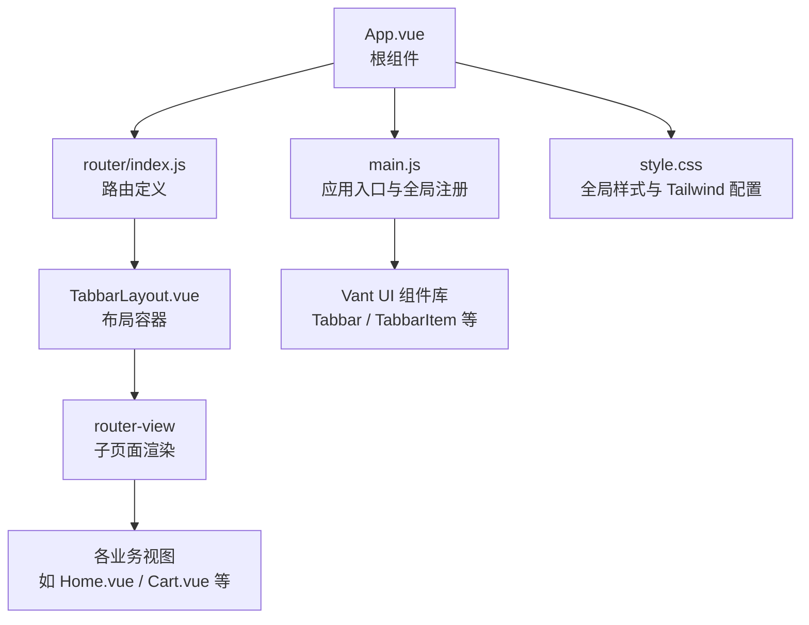
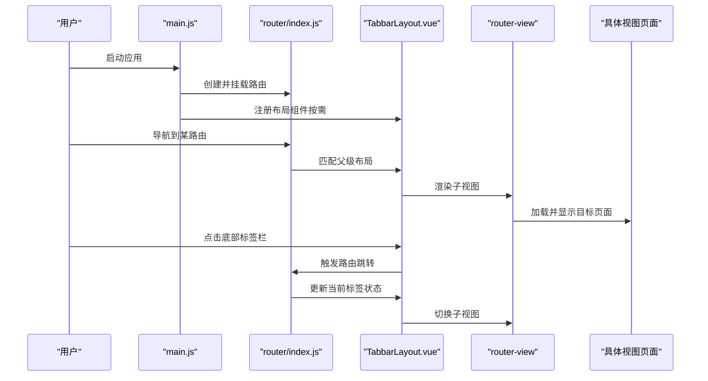
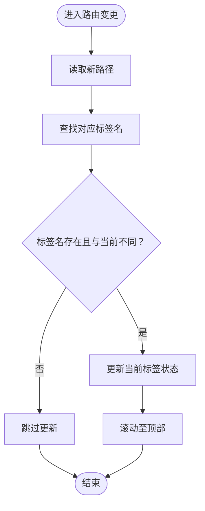
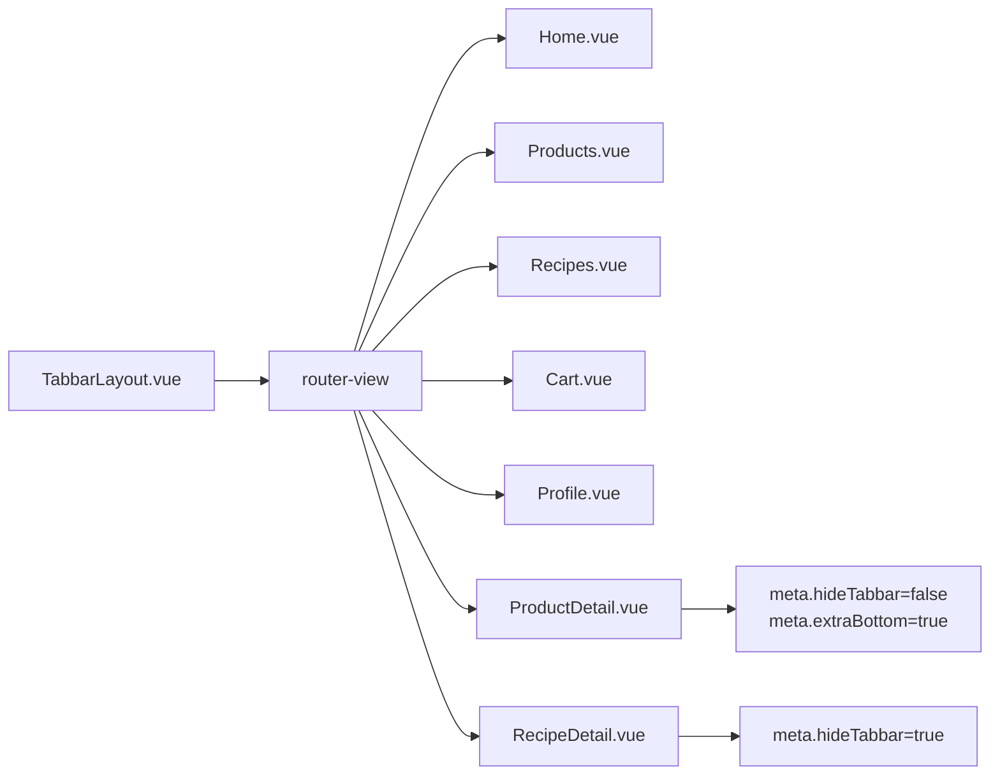
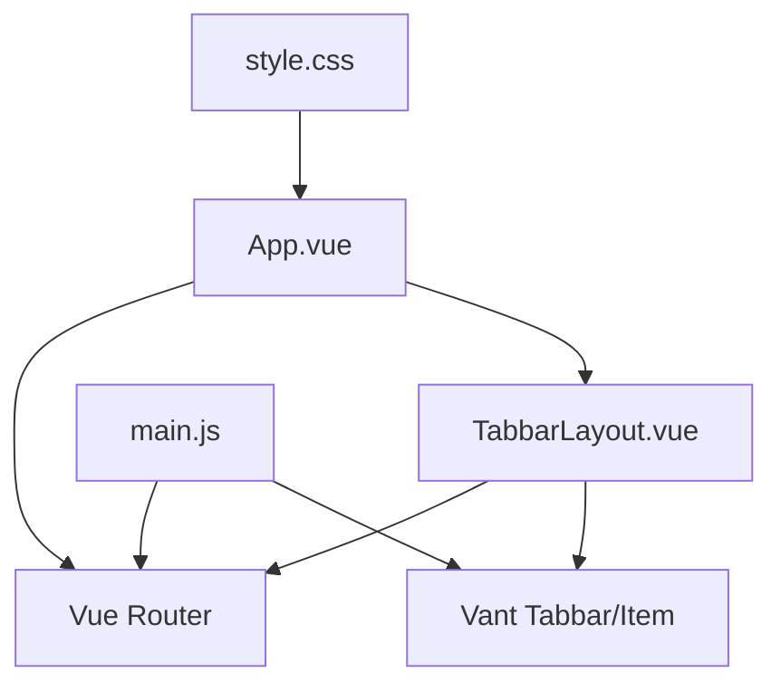

# 布局组件开发

<cite>
**本文引用的文件**
- [TabbarLayout.vue](file://frontend/src/layouts/TabbarLayout.vue)
- [App.vue](file://frontend/src/App.vue)
- [main.js](file://frontend/src/main.js)
- [router/index.js](file://frontend/src/router/index.js)
- [style.css](file://frontend/src/style.css)
</cite>

## 目录
1. [简介](#简介)
2. [项目结构](#项目结构)
3. [核心组件](#核心组件)
4. [架构总览](#架构总览)
5. [详细组件分析](#详细组件分析)
6. [依赖关系分析](#依赖关系分析)
7. [性能考虑](#性能考虑)
8. [故障排查指南](#故障排查指南)
9. [结论](#结论)
10. [附录](#附录)

## 简介
本指南面向趣配鲜项目的前端开发者，围绕布局组件（以 TabbarLayout.vue 为代表）提供从设计原理到实现细节的完整开发指引。内容涵盖：
- 布局组件在页面结构中的角色与组织方式（顶部导航、底部标签栏、侧边栏等）
- 响应式设计与移动端适配策略
- 状态管理与布局配置（菜单展开/收起、主题切换、布局断点）
- 样式定制方法（CSS 变量、主题系统、样式覆盖）
- 与路由、状态管理、UI 组件库的集成模式与通信机制

## 项目结构
前端采用 Vue 3 + Vite + Vant 移动端组件库的单页应用架构。布局层通过路由嵌套实现“Tabbar 布局”容器，内部通过 router-view 渲染子页面。

图表来源
- [App.vue:1-10](file://frontend/src/App.vue#L1-L10)
- [router/index.js:1-192](file://frontend/src/router/index.js#L1-L192)
- [TabbarLayout.vue:1-99](file://frontend/src/layouts/TabbarLayout.vue#L1-L99)
- [main.js:1-56](file://frontend/src/main.js#L1-L56)
- [style.css:1-71](file://frontend/src/style.css#L1-L71)

章节来源
- [App.vue:1-10](file://frontend/src/App.vue#L1-L10)
- [router/index.js:1-192](file://frontend/src/router/index.js#L1-L192)
- [main.js:1-56](file://frontend/src/main.js#L1-L56)
- [style.css:1-71](file://frontend/src/style.css#L1-L71)

## 核心组件
- TabbarLayout.vue：移动端底部标签栏布局容器，负责路由切换、标签栏状态同步、安全区域适配与页面内边距控制。
- App.vue：根组件，承载全局路由视图。
- main.js：应用入口，完成 Pinia、Vue Router 注册以及 Vant 组件按需注册。
- router/index.js：路由表，定义 TabbarLayout 作为父级布局，并在其中嵌套多个子路由（含隐藏标签栏与额外底部空间的场景）。
- style.css：全局样式，包含 Tailwind 基础、组件样式与通用类名。

章节来源
- [TabbarLayout.vue:1-99](file://frontend/src/layouts/TabbarLayout.vue#L1-L99)
- [App.vue:1-10](file://frontend/src/App.vue#L1-L10)
- [main.js:1-56](file://frontend/src/main.js#L1-L56)
- [router/index.js:1-192](file://frontend/src/router/index.js#L1-L192)
- [style.css:1-71](file://frontend/src/style.css#L1-L71)

## 架构总览
下图展示从应用启动到页面渲染的关键流程，以及布局组件与路由、UI 库的交互：

图表来源
- [main.js:1-56](file://frontend/src/main.js#L1-L56)
- [router/index.js:1-192](file://frontend/src/router/index.js#L1-L192)
- [TabbarLayout.vue:1-99](file://frontend/src/layouts/TabbarLayout.vue#L1-L99)

## 详细组件分析

### TabbarLayout 布局容器
- 设计定位
  - 作为移动端“Tabbar 布局”的根容器，统一承载页面主体内容与底部标签栏。
  - 通过路由元信息控制是否显示标签栏与底部额外空间，适配详情页等场景。
- 关键职责
  - 维护当前激活标签状态并与路由路径双向同步。
  - 处理标签点击事件，驱动路由跳转。
  - 在页面切换时滚动至顶部，提升用户体验。
  - 依据路由元信息动态调整页面内边距，兼容安全区域与额外按钮区。
- 数据结构与逻辑
  - 当前标签状态：使用响应式引用维护当前激活项。
  - 路由映射：提供“标签名↔路径”的双向映射表，确保状态与路由一致。
  - 计算属性：根据路由元信息决定是否隐藏标签栏与是否启用额外底部空间。
  - 生命周期：在挂载时根据当前路径初始化标签状态；监听路由变化进行同步与滚动复位。
- 样式要点
  - 容器高度最小化为视口全高，采用纵向 Flex 布局。
  - 页面内容区域根据标签栏显隐与额外底部空间动态计算底部内边距。
  - 使用环境变量适配刘海屏等安全区域。

图表来源
- [TabbarLayout.vue:58-68](file://frontend/src/layouts/TabbarLayout.vue#L58-L68)

章节来源
- [TabbarLayout.vue:1-99](file://frontend/src/layouts/TabbarLayout.vue#L1-L99)

### 路由与布局集成
- 布局嵌套
  - 顶层路由将 TabbarLayout 作为父级布局，其 children 中包含首页、分类、食谱、购物车、个人中心等子路由。
- 元信息控制
  - 通过 meta.hideTabbar 控制是否显示底部标签栏（如详情页、结算页）。
  - 通过 meta.extraBottom 控制页面底部额外空间（如详情页需要悬浮操作按钮时）。
- 权限与标题
  - 路由守卫根据 meta.requiresAuth/admin 判断访问权限，并设置页面标题。

图表来源
- [router/index.js:3-112](file://frontend/src/router/index.js#L3-L112)
- [TabbarLayout.vue:47-48](file://frontend/src/layouts/TabbarLayout.vue#L47-L48)

章节来源
- [router/index.js:1-192](file://frontend/src/router/index.js#L1-L192)
- [TabbarLayout.vue:1-99](file://frontend/src/layouts/TabbarLayout.vue#L1-L99)

### 样式与主题系统
- 全局样式
  - 使用 Tailwind CSS 提供基础与组件样式，统一字体、间距与颜色体系。
  - body 与 #app 设置最小高度为视口全高，保证布局占满屏幕。
- 布局容器样式
  - 容器采用纵向 Flex 布局，背景色与整体主题保持一致。
  - 页面内容区域根据标签栏显隐与额外底部空间动态计算底部内边距，兼容安全区域。
- 主题与覆盖
  - 可通过 CSS 变量或自定义类名覆盖默认样式，建议在业务页面中以局部样式优先，避免全局污染。
  - 与 Vant 组件库的样式可通过全局样式或按需引入的样式文件进行统一管理。

章节来源
- [style.css:1-71](file://frontend/src/style.css#L1-L71)
- [TabbarLayout.vue:78-99](file://frontend/src/layouts/TabbarLayout.vue#L78-L99)

### 与 UI 组件库的集成
- 按需注册
  - 在应用入口对 Vant 的 Tabbar、TabbarItem 等组件进行全局注册，减少打包体积。
- 组件使用
  - 布局中使用 Vant 的 Tabbar 与 TabbarItem 实现底部导航，支持安全区域适配。
- 扩展建议
  - 如需侧边栏或顶部导航，可引入相应 Vant 组件并在布局中组合使用，注意与现有标签栏的交互与冲突处理。

章节来源
- [main.js:7-30](file://frontend/src/main.js#L7-L30)
- [TabbarLayout.vue:7-18](file://frontend/src/layouts/TabbarLayout.vue#L7-L18)

## 依赖关系分析
- 组件耦合
  - TabbarLayout 与路由紧密耦合（通过路由元信息控制显示），与 UI 组件库（Vant）存在直接依赖。
- 外部依赖
  - Vue Router 负责路由与导航；Vant 提供移动端 UI 能力；Tailwind 提供原子化样式能力。
- 潜在风险
  - 若路由元信息缺失或不一致，可能导致标签状态与实际页面不匹配。
  - 安全区域与额外底部空间的计算依赖环境变量，需在真机上验证。

图表来源
- [TabbarLayout.vue:1-99](file://frontend/src/layouts/TabbarLayout.vue#L1-L99)
- [router/index.js:1-192](file://frontend/src/router/index.js#L1-L192)
- [main.js:1-56](file://frontend/src/main.js#L1-L56)
- [style.css:1-71](file://frontend/src/style.css#L1-L71)

章节来源
- [TabbarLayout.vue:1-99](file://frontend/src/layouts/TabbarLayout.vue#L1-L99)
- [router/index.js:1-192](file://frontend/src/router/index.js#L1-L192)
- [main.js:1-56](file://frontend/src/main.js#L1-L56)
- [style.css:1-71](file://frontend/src/style.css#L1-L71)

## 性能考虑
- 路由切换优化
  - 使用 keep-alive 缓存子路由组件，减少重复渲染开销（已在部分路由 meta 中启用）。
- 组件懒加载
  - 路由与布局均采用动态导入，降低首屏包体大小。
- 样式体积控制
  - Tailwind 原子类按需使用，避免无用类导致体积膨胀。
- 滚动行为
  - 页面切换时强制滚动至顶部，避免用户感知到历史滚动位置带来的视觉抖动。

章节来源
- [router/index.js:13-37](file://frontend/src/router/index.js#L13-L37)
- [TabbarLayout.vue:66-68](file://frontend/src/layouts/TabbarLayout.vue#L66-L68)

## 故障排查指南
- 标签栏不显示或显示异常
  - 检查路由 meta.hideTabbar 是否正确设置。
  - 确认 TabbarLayout 的计算属性与路由元信息一致。
- 标签状态不同步
  - 检查路由变更监听与 nextTick 的使用是否正确。
  - 确保标签名与路径映射表完整且无歧义。
- 底部留白异常
  - 检查 meta.extraBottom 与页面内容的底部空间是否冲突。
  - 确认安全区域变量在设备上的表现符合预期。
- 登录/权限相关问题
  - 检查路由守卫中 token 与用户信息的读取与校验逻辑。
  - 确保重定向参数正确传递，避免循环跳转。

章节来源
- [TabbarLayout.vue:47-48](file://frontend/src/layouts/TabbarLayout.vue#L47-L48)
- [TabbarLayout.vue:58-64](file://frontend/src/layouts/TabbarLayout.vue#L58-L64)
- [router/index.js:155-189](file://frontend/src/router/index.js#L155-L189)

## 结论
TabbarLayout 作为移动端布局的核心容器，通过与路由元信息的协同实现了灵活的标签栏控制与页面适配。结合 Vant 组件库与 Tailwind 样式体系，可在保证开发效率的同时兼顾性能与可维护性。后续可在保持现有解耦的基础上，逐步扩展顶部导航、侧边栏等布局元素，并完善主题系统与状态管理的统一入口。

## 附录
- 开发最佳实践
  - 将布局状态与路由元信息解耦，避免硬编码。
  - 对外暴露统一的布局配置接口，便于主题与断点的集中管理。
  - 在业务页面中尽量使用局部样式，减少全局副作用。
- 扩展方向
  - 引入 Pinia 管理布局配置（如主题、语言、布局模式），并通过 Composables 封装跨页面共享逻辑。
  - 增加顶部导航与侧边栏的可选组合，形成更丰富的布局模板集。