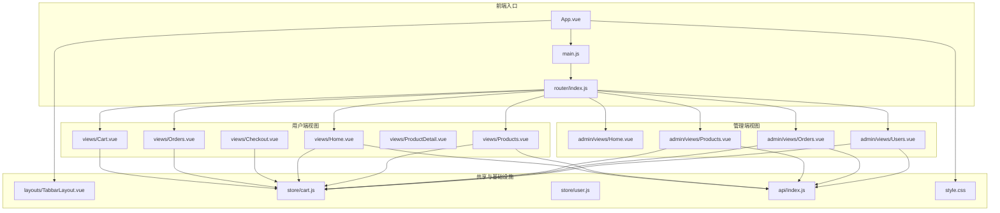
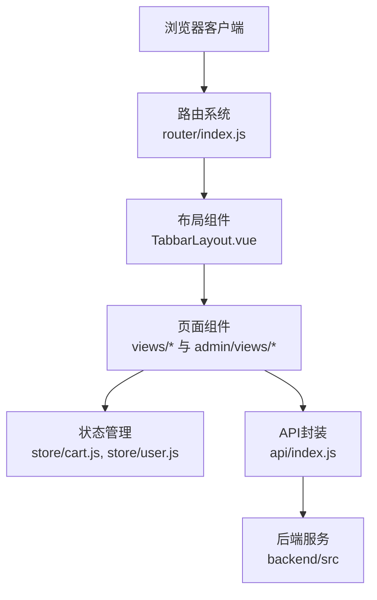
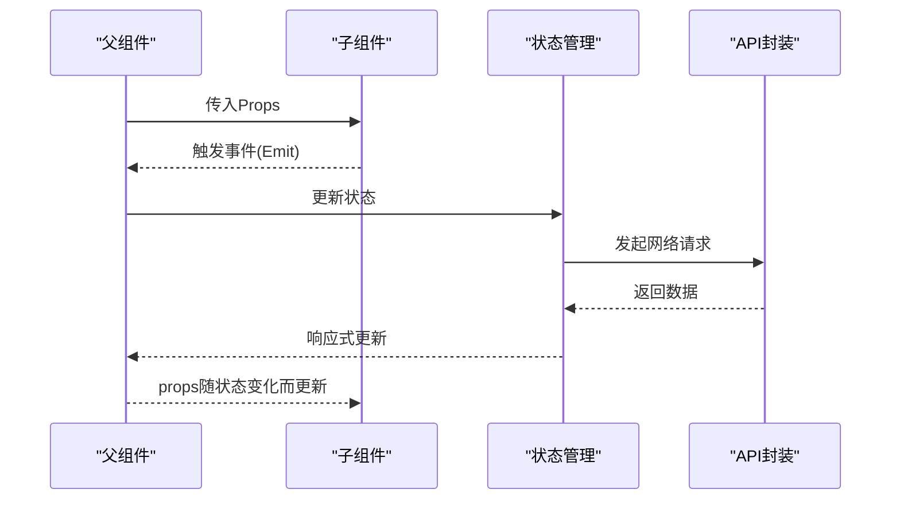
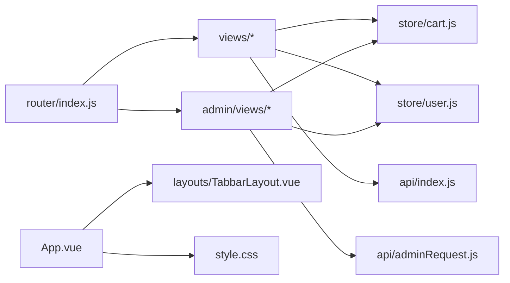

# 组件开发指南

<cite>
**本文引用的文件**
- [App.vue](file://frontend/src/App.vue)
- [main.js](file://frontend/src/main.js)
- [index.js](file://frontend/src/router/index.js)
- [TabbarLayout.vue](file://frontend/src/layouts/TabbarLayout.vue)
- [Home.vue](file://frontend/src/views/Home.vue)
- [Products.vue](file://frontend/src/views/Products.vue)
- [Cart.vue](file://frontend/src/views/Cart.vue)
- [Orders.vue](file://frontend/src/views/Orders.vue)
- [OrderDetail.vue](file://frontend/src/views/OrderDetail.vue)
- [ProductDetail.vue](file://frontend/src/views/ProductDetail.vue)
- [Checkout.vue](file://frontend/src/views/Checkout.vue)
- [Login.vue](file://frontend/src/views/Login.vue)
- [Register.vue](file://frontend/src/views/Register.vue)
- [Profile.vue](file://frontend/src/views/Profile.vue)
- [Coupons.vue](file://frontend/src/views/Coupons.vue)
- [Favorites.vue](file://frontend/src/views/Favorites.vue)
- [Addresses.vue](file://frontend/src/views/Addresses.vue)
- [AddressEdit.vue](file://frontend/src/views/AddressEdit.vue)
- [AfterSales.vue](file://frontend/src/views/AfterSales.vue)
- [Recipes.vue](file://frontend/src/views/Recipes.vue)
- [RecipeDetail.vue](file://frontend/src/views/RecipeDetail.vue)
- [Qualifications.vue](file://frontend/src/views/Qualifications.vue)
- [Agreement.vue](file://frontend/src/views/Agreement.vue)
- [Home.vue](file://frontend/src/admin/views/Home.vue)
- [Products.vue](file://frontend/src/admin/views/Products.vue)
- [Orders.vue](file://frontend/src/admin/views/Orders.vue)
- [Users.vue](file://frontend/src/admin/views/Users.vue)
- [Login.vue](file://frontend/src/admin/views/Login.vue)
- [Banners.vue](file://frontend/src/admin/views/Banners.vue)
- [Coupons.vue](file://frontend/src/admin/views/Coupons.vue)
- [Notices.vue](file://frontend/src/admin/views/Notices.vue)
- [Recipes.vue](file://frontend/src/admin/views/Recipes.vue)
- [Settings.vue](file://frontend/src/admin/views/Settings.vue)
- [Stats.vue](file://frontend/src/admin/views/Stats.vue)
- [cart.js](file://frontend/src/store/cart.js)
- [user.js](file://frontend/src/store/user.js)
- [request.js](file://frontend/src/api/request.js)
- [adminRequest.js](file://frontend/src/api/adminRequest.js)
- [index.js](file://frontend/src/api/index.js)
- [style.css](file://frontend/src/style.css)
- [vite.config.js](file://frontend/vite.config.js)
- [tailwind.config.js](file://frontend/tailwind.config.js)
- [postcss.config.js](file://frontend/postcss.config.js)
</cite>

## 目录
1. [简介](#简介)
2. [项目结构](#项目结构)
3. [核心组件](#核心组件)
4. [架构总览](#架构总览)
5. [详细组件分析](#详细组件分析)
6. [依赖关系分析](#依赖关系分析)
7. [性能考虑](#性能考虑)
8. [故障排查指南](#故障排查指南)
9. [结论](#结论)
10. [附录](#附录)

## 简介
本指南面向趣配鲜项目的Vue.js组件开发，系统性介绍用户端与管理端页面组件的开发模式、生命周期管理、组件间数据传递机制、样式封装策略、组件复用最佳实践以及性能优化技巧。文档以实际源码为依据，结合Mermaid图示帮助开发者快速理解并规范开发流程。

## 项目结构
前端采用Vite构建，采用单页应用架构，路由按功能划分，视图组件位于views与admin/views目录，布局组件位于layouts，状态管理位于store，API封装位于api，全局样式位于style.css，并通过PostCSS/Tailwind进行样式处理。

图表来源
- [App.vue](file://frontend/src/App.vue)
- [main.js](file://frontend/src/main.js)
- [index.js](file://frontend/src/router/index.js)
- [TabbarLayout.vue](file://frontend/src/layouts/TabbarLayout.vue)
- [cart.js](file://frontend/src/store/cart.js)
- [user.js](file://frontend/src/store/user.js)
- [index.js](file://frontend/src/api/index.js)
- [style.css](file://frontend/src/style.css)

章节来源
- [App.vue](file://frontend/src/App.vue)
- [main.js](file://frontend/src/main.js)
- [index.js](file://frontend/src/router/index.js)

## 核心组件
- 用户端页面组件：Home.vue、Products.vue、Cart.vue、Orders.vue、ProductDetail.vue、Checkout.vue、Login.vue、Register.vue、Profile.vue、Coupons.vue、Favorites.vue、Addresses.vue、AddressEdit.vue、AfterSales.vue、Recipes.vue、RecipeDetail.vue、Qualifications.vue、Agreement.vue。
- 管理端页面组件：Home.vue、Products.vue、Orders.vue、Users.vue、Login.vue、Banners.vue、Coupons.vue、Notices.vue、Recipes.vue、Settings.vue、Stats.vue。
- 布局与基础设施：TabbarLayout.vue、store/cart.js、store/user.js、api/index.js、style.css。

章节来源
- [Home.vue](file://frontend/src/views/Home.vue)
- [Products.vue](file://frontend/src/views/Products.vue)
- [Cart.vue](file://frontend/src/views/Cart.vue)
- [Orders.vue](file://frontend/src/views/Orders.vue)
- [ProductDetail.vue](file://frontend/src/views/ProductDetail.vue)
- [Checkout.vue](file://frontend/src/views/Checkout.vue)
- [Login.vue](file://frontend/src/views/Login.vue)
- [Register.vue](file://frontend/src/views/Register.vue)
- [Profile.vue](file://frontend/src/views/Profile.vue)
- [Coupons.vue](file://frontend/src/views/Coupons.vue)
- [Favorites.vue](file://frontend/src/views/Favorites.vue)
- [Addresses.vue](file://frontend/src/views/Addresses.vue)
- [AddressEdit.vue](file://frontend/src/views/AddressEdit.vue)
- [AfterSales.vue](file://frontend/src/views/AfterSales.vue)
- [Recipes.vue](file://frontend/src/views/Recipes.vue)
- [RecipeDetail.vue](file://frontend/src/views/RecipeDetail.vue)
- [Qualifications.vue](file://frontend/src/views/Qualifications.vue)
- [Agreement.vue](file://frontend/src/views/Agreement.vue)
- [Home.vue](file://frontend/src/admin/views/Home.vue)
- [Products.vue](file://frontend/src/admin/views/Products.vue)
- [Orders.vue](file://frontend/src/admin/views/Orders.vue)
- [Users.vue](file://frontend/src/admin/views/Users.vue)
- [Login.vue](file://frontend/src/admin/views/Login.vue)
- [Banners.vue](file://frontend/src/admin/views/Banners.vue)
- [Coupons.vue](file://frontend/src/admin/views/Coupons.vue)
- [Notices.vue](file://frontend/src/admin/views/Notices.vue)
- [Recipes.vue](file://frontend/src/admin/views/Recipes.vue)
- [Settings.vue](file://frontend/src/admin/views/Settings.vue)
- [Stats.vue](file://frontend/src/admin/views/Stats.vue)
- [TabbarLayout.vue](file://frontend/src/layouts/TabbarLayout.vue)
- [cart.js](file://frontend/src/store/cart.js)
- [user.js](file://frontend/src/store/user.js)
- [index.js](file://frontend/src/api/index.js)
- [style.css](file://frontend/src/style.css)

## 架构总览
用户端与管理端共享同一套基础架构：路由驱动页面切换，组件通过API层访问后端服务，状态通过Vuex-like store进行集中管理，布局组件统一承载导航与底部栏等通用UI。

图表来源
- [index.js](file://frontend/src/router/index.js)
- [TabbarLayout.vue](file://frontend/src/layouts/TabbarLayout.vue)
- [cart.js](file://frontend/src/store/cart.js)
- [user.js](file://frontend/src/store/user.js)
- [index.js](file://frontend/src/api/index.js)

## 详细组件分析

### 用户端页面组件开发模式
- 首页（Home.vue）：展示轮播、分类、推荐商品等，通常在挂载时拉取首页数据；注意在卸载时清理定时器或轮播资源。
- 商品列表（Products.vue）：分页加载、筛选排序、加入购物车；建议使用虚拟滚动优化长列表性能。
- 购物车（Cart.vue）：聚合购物车项、计算总价、批量勾选、下单入口；需与store/cart.js保持同步。
- 订单相关（Orders.vue、OrderDetail.vue、Checkout.vue）：订单查询、详情查看、地址选择、支付流程；注意鉴权与数据校验。
- 其他页面（Login.vue、Register.vue、Profile.vue、Coupons.vue、Favorites.vue、Addresses.vue、AddressEdit.vue、AfterSales.vue、Recipes.vue、RecipeDetail.vue、Qualifications.vue、Agreement.vue）：遵循统一的表单校验、错误提示与交互反馈规范。

章节来源
- [Home.vue](file://frontend/src/views/Home.vue)
- [Products.vue](file://frontend/src/views/Products.vue)
- [Cart.vue](file://frontend/src/views/Cart.vue)
- [Orders.vue](file://frontend/src/views/Orders.vue)
- [OrderDetail.vue](file://frontend/src/views/OrderDetail.vue)
- [ProductDetail.vue](file://frontend/src/views/ProductDetail.vue)
- [Checkout.vue](file://frontend/src/views/Checkout.vue)
- [Login.vue](file://frontend/src/views/Login.vue)
- [Register.vue](file://frontend/src/views/Register.vue)
- [Profile.vue](file://frontend/src/views/Profile.vue)
- [Coupons.vue](file://frontend/src/views/Coupons.vue)
- [Favorites.vue](file://frontend/src/views/Favorites.vue)
- [Addresses.vue](file://frontend/src/views/Addresses.vue)
- [AddressEdit.vue](file://frontend/src/views/AddressEdit.vue)
- [AfterSales.vue](file://frontend/src/views/AfterSales.vue)
- [Recipes.vue](file://frontend/src/views/Recipes.vue)
- [RecipeDetail.vue](file://frontend/src/views/RecipeDetail.vue)
- [Qualifications.vue](file://frontend/src/views/Qualifications.vue)
- [Agreement.vue](file://frontend/src/views/Agreement.vue)

### 管理端页面组件开发模式
- 管理端与用户端在路由与权限上分离，页面职责更偏向数据管理与运营支持。
- 典型页面：商品管理（Products.vue）、订单管理（Orders.vue）、用户管理（Users.vue）、首页（Home.vue）、登录（Login.vue）、Banner/优惠券/公告/菜谱/设置/统计（Banners.vue、Coupons.vue、Notices.vue、Recipes.vue、Settings.vue、Stats.vue）。
- 设计差异：管理端更强调表格、表单、批量操作与审计日志；对权限拦截与数据安全有更高要求。

章节来源
- [Home.vue](file://frontend/src/admin/views/Home.vue)
- [Products.vue](file://frontend/src/admin/views/Products.vue)
- [Orders.vue](file://frontend/src/admin/views/Orders.vue)
- [Users.vue](file://frontend/src/admin/views/Users.vue)
- [Login.vue](file://frontend/src/admin/views/Login.vue)
- [Banners.vue](file://frontend/src/admin/views/Banners.vue)
- [Coupons.vue](file://frontend/src/admin/views/Coupons.vue)
- [Notices.vue](file://frontend/src/admin/views/Notices.vue)
- [Recipes.vue](file://frontend/src/admin/views/Recipes.vue)
- [Settings.vue](file://frontend/src/admin/views/Settings.vue)
- [Stats.vue](file://frontend/src/admin/views/Stats.vue)

### 生命周期管理（onMounted、onUnmounted等）
- 在组件挂载时发起异步请求（如获取首页数据、商品列表、订单信息），避免在模板中直接调用副作用。
- 在组件卸载时清理定时器、取消订阅、释放媒体资源，防止内存泄漏。
- 对于需要响应式更新的场景，合理使用watch/watchEffect，避免不必要的重渲染。
- 列表类组件（如Products.vue、Orders.vue）在进入页面时加载第一页数据，在滚动到底部时触发下一页加载。

章节来源
- [Home.vue](file://frontend/src/views/Home.vue)
- [Products.vue](file://frontend/src/views/Products.vue)
- [Orders.vue](file://frontend/src/views/Orders.vue)
- [Cart.vue](file://frontend/src/views/Cart.vue)

### 组件间数据传递机制
- Props接收：父组件向子组件传递只读数据（如商品列表、订单状态），子组件通过props严格约束输入类型与默认值。
- Emit事件：子组件向上级派发事件（如“加入购物车”、“删除订单”、“表单提交成功”），上级组件监听并更新状态。
- Provide/Inject：用于跨层级传递共享配置（如主题、语言、API实例），减少多级props传递。
- 状态管理：购物车、用户信息等跨页面共享的状态通过store管理，组件通过mapState/mapGetters/mapActions等辅助函数访问。

图表来源
- [cart.js](file://frontend/src/store/cart.js)
- [user.js](file://frontend/src/store/user.js)
- [index.js](file://frontend/src/api/index.js)

章节来源
- [Products.vue](file://frontend/src/views/Products.vue)
- [Cart.vue](file://frontend/src/views/Cart.vue)
- [Orders.vue](file://frontend/src/views/Orders.vue)
- [cart.js](file://frontend/src/store/cart.js)
- [user.js](file://frontend/src/store/user.js)
- [index.js](file://frontend/src/api/index.js)

### 样式封装策略
- Scoped样式：为组件添加作用域，避免样式污染，适用于局部样式隔离。
- CSS模块化：通过模块化命名空间避免冲突，适合复杂组件内部样式组织。
- 样式继承与覆盖：全局样式由style.css统一管理，组件内使用Tailwind类名实现一致的视觉风格；必要时通过深度选择器或CSS变量进行主题定制。
- PostCSS/Tailwind：通过工具链自动优化与按需生成样式，提升开发效率与运行性能。

章节来源
- [style.css](file://frontend/src/style.css)
- [tailwind.config.js](file://frontend/tailwind.config.js)
- [postcss.config.js](file://frontend/postcss.config.js)

### 组件复用最佳实践
- 可复用组件设计原则：单一职责、明确的props接口、稳定的事件契约、清晰的插槽与具名作用域。
- 通用组件抽象：列表容器、分页控件、空态占位、加载骨架、模态框、表单控件等，形成组件库基线。
- 布局组件：TabbarLayout.vue作为通用布局，承载导航与底部栏，减少重复代码。
- 权限与路由：管理端与用户端路由分离，配合权限守卫实现访问控制，避免在组件内分散处理权限逻辑。

章节来源
- [TabbarLayout.vue](file://frontend/src/layouts/TabbarLayout.vue)

### 性能优化技巧
- 组件懒加载：对非首屏组件使用动态导入，降低初始包体与首屏渲染时间。
- 虚拟滚动：对长列表（商品列表、订单列表）使用虚拟滚动，仅渲染可视区域元素。
- 渲染优化：合理拆分组件、避免深层嵌套、减少不必要的响应式依赖；使用key确保列表稳定重排。
- 缓存策略：对静态或低频变更的数据进行缓存，减少重复请求；利用浏览器缓存与HTTP缓存头。
- 图片与资源：按需加载图片、使用WebP格式、懒加载与骨架屏提升感知性能。

章节来源
- [Products.vue](file://frontend/src/views/Products.vue)
- [Orders.vue](file://frontend/src/views/Orders.vue)
- [vite.config.js](file://frontend/vite.config.js)

## 依赖关系分析
- 组件到路由：所有页面组件均通过router/index.js注册与跳转。
- 组件到状态：用户端与管理端组件普遍依赖store/cart.js与store/user.js。
- 组件到API：通过api/index.js与api/adminRequest.js访问后端接口。
- 布局到组件：TabbarLayout.vue作为通用布局，被多个页面复用。

图表来源
- [index.js](file://frontend/src/router/index.js)
- [cart.js](file://frontend/src/store/cart.js)
- [user.js](file://frontend/src/store/user.js)
- [index.js](file://frontend/src/api/index.js)
- [adminRequest.js](file://frontend/src/api/adminRequest.js)
- [App.vue](file://frontend/src/App.vue)
- [TabbarLayout.vue](file://frontend/src/layouts/TabbarLayout.vue)
- [style.css](file://frontend/src/style.css)

章节来源
- [index.js](file://frontend/src/router/index.js)
- [cart.js](file://frontend/src/store/cart.js)
- [user.js](file://frontend/src/store/user.js)
- [index.js](file://frontend/src/api/index.js)
- [adminRequest.js](file://frontend/src/api/adminRequest.js)
- [App.vue](file://frontend/src/App.vue)
- [TabbarLayout.vue](file://frontend/src/layouts/TabbarLayout.vue)
- [style.css](file://frontend/src/style.css)

## 性能考虑
- 懒加载与代码分割：对非关键路径组件使用动态导入，缩短首屏加载时间。
- 列表渲染优化：使用虚拟滚动与分页，避免一次性渲染大量DOM节点。
- 网络请求节流：对搜索、筛选等高频请求进行防抖/节流，减少无效请求。
- 缓存与持久化：利用本地存储与HTTP缓存，减少重复请求与计算。
- 样式与资源优化：通过Tailwind按需生成样式，压缩图片与静态资源，启用Gzip/Brotli。

## 故障排查指南
- 路由问题：确认路由配置与页面组件路径一致，避免404；检查路由守卫是否正确拦截未授权访问。
- 状态不同步：核对store中的状态更新逻辑，确保组件通过正确的映射函数访问；检查异步动作是否正确dispatch。
- API请求失败：检查请求封装与错误处理中间件，确认网络异常与业务错误的区分；查看后端返回的错误码与消息。
- 样式冲突：使用scoped或CSS模块化隔离样式；避免全局样式的意外覆盖；检查Tailwind类名拼写与优先级。
- 内存泄漏：在onUnmounted中清理定时器、事件监听器与订阅；避免闭包持有大对象。

章节来源
- [index.js](file://frontend/src/router/index.js)
- [cart.js](file://frontend/src/store/cart.js)
- [user.js](file://frontend/src/store/user.js)
- [index.js](file://frontend/src/api/index.js)

## 结论
本指南总结了趣配鲜项目中Vue.js组件的开发范式与最佳实践，涵盖用户端与管理端的差异化设计、生命周期与数据流管理、样式封装与复用策略，以及性能优化与故障排查要点。建议在新功能开发中遵循统一的组件规范与架构约定，持续迭代组件库与工具链，提升开发效率与用户体验。

## 附录
- 开发环境：Vite + Vue 3 + Vue Router + Vuex-like Store + Tailwind CSS + PostCSS
- 关键文件清单：App.vue、main.js、router/index.js、layouts/TabbarLayout.vue、store/cart.js、store/user.js、api/index.js、api/adminRequest.js、style.css、vite.config.js、tailwind.config.js、postcss.config.js