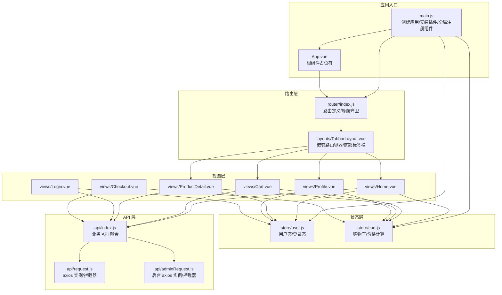
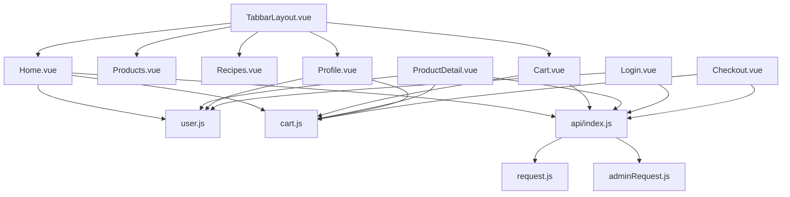
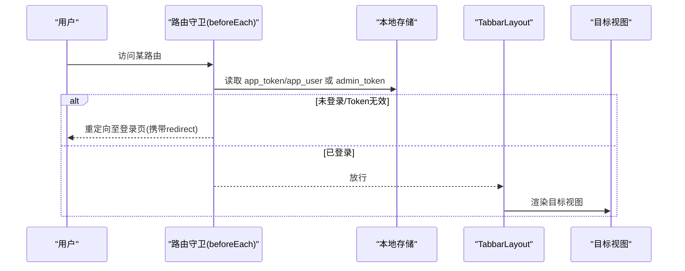
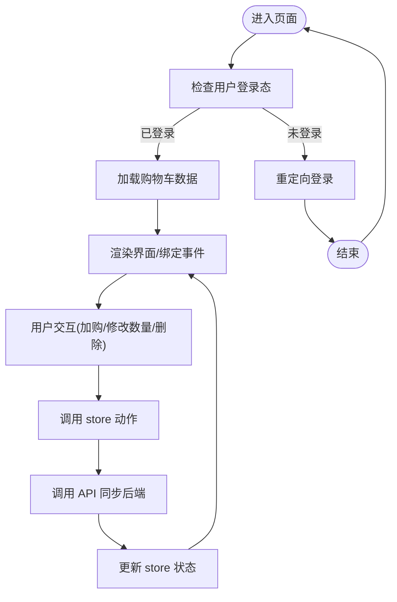
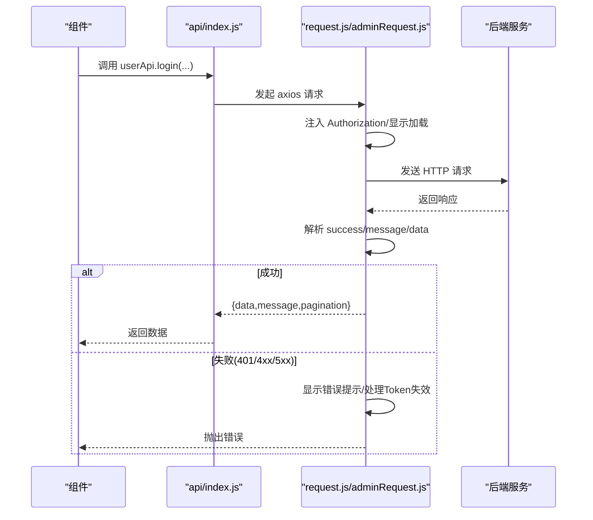
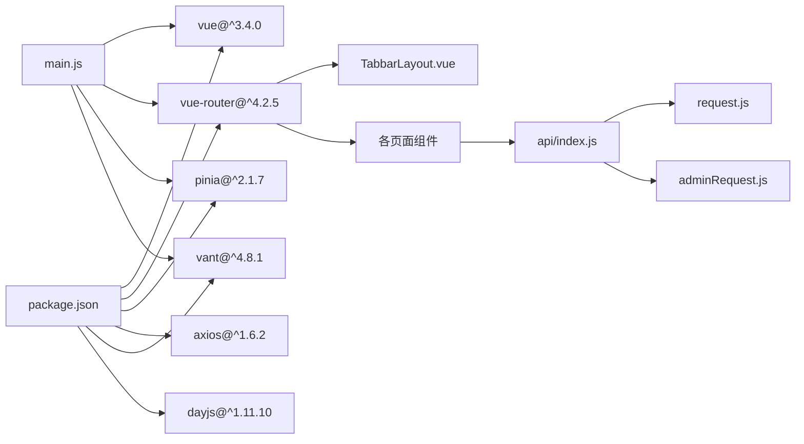

# 组件集成与通信

<cite>
**本文引用的文件**
- [frontend/src/main.js](file://frontend/src/main.js)
- [frontend/src/App.vue](file://frontend/src/App.vue)
- [frontend/src/router/index.js](file://frontend/src/router/index.js)
- [frontend/src/layouts/TabbarLayout.vue](file://frontend/src/layouts/TabbarLayout.vue)
- [frontend/src/store/user.js](file://frontend/src/store/user.js)
- [frontend/src/store/cart.js](file://frontend/src/store/cart.js)
- [frontend/src/api/index.js](file://frontend/src/api/index.js)
- [frontend/src/api/request.js](file://frontend/src/api/request.js)
- [frontend/src/api/adminRequest.js](file://frontend/src/api/adminRequest.js)
- [frontend/src/views/Home.vue](file://frontend/src/views/Home.vue)
- [frontend/src/views/Cart.vue](file://frontend/src/views/Cart.vue)
- [frontend/src/views/ProductDetail.vue](file://frontend/src/views/ProductDetail.vue)
- [frontend/src/views/Profile.vue](file://frontend/src/views/Profile.vue)
- [frontend/src/views/Login.vue](file://frontend/src/views/Login.vue)
- [frontend/src/views/Checkout.vue](file://frontend/src/views/Checkout.vue)
- [frontend/package.json](file://frontend/package.json)
</cite>

## 目录
1. [简介](#简介)
2. [项目结构](#项目结构)
3. [核心组件](#核心组件)
4. [架构总览](#架构总览)
5. [详细组件分析](#详细组件分析)
6. [依赖关系分析](#依赖关系分析)
7. [性能考量](#性能考量)
8. [故障排查指南](#故障排查指南)
9. [结论](#结论)
10. [附录](#附录)

## 简介
本指南围绕“趣配鲜”项目的前端部分，系统梳理组件间的通信机制与协作方式，涵盖：
- 父子组件通信（props/emit）
- 兄弟组件通信与跨层级通信
- Pinia 状态管理在组件通信中的应用（state、getters、actions）
- 路由在组件导航中的作用（参数传递、命名路由、路由守卫）
- API 调用在组件中的集成（请求封装、响应处理、错误管理）
- 组件生命周期的协调管理（挂载、更新、销毁时的资源清理）
- 最佳实践与常见问题解决方案

## 项目结构
前端采用 Vue 3 + Vite + Pinia + Vue Router + Vant 的技术栈，目录组织以功能域划分：
- 布局层：TabbarLayout 提供底部导航与页面切换容器
- 视图层：Home、Products、Recipes、Cart、Profile、Login、Checkout 等页面组件
- 状态层：Pinia Store（user、cart）集中管理用户态与购物车态
- API 层：按业务域拆分的 API 模块，统一通过 axios 封装请求拦截器与响应处理
- 路由层：基于 Vue Router 的嵌套路由与导航守卫

图表来源
- [frontend/src/main.js:1-56](file://frontend/src/main.js#L1-L56)
- [frontend/src/App.vue:1-10](file://frontend/src/App.vue#L1-L10)
- [frontend/src/router/index.js:1-192](file://frontend/src/router/index.js#L1-L192)
- [frontend/src/layouts/TabbarLayout.vue:1-99](file://frontend/src/layouts/TabbarLayout.vue#L1-L99)
- [frontend/src/store/user.js:1-96](file://frontend/src/store/user.js#L1-L96)
- [frontend/src/store/cart.js:1-68](file://frontend/src/store/cart.js#L1-L68)
- [frontend/src/api/index.js:1-138](file://frontend/src/api/index.js#L1-L138)
- [frontend/src/api/request.js:1-111](file://frontend/src/api/request.js#L1-L111)
- [frontend/src/api/adminRequest.js:1-93](file://frontend/src/api/adminRequest.js#L1-L93)

章节来源
- [frontend/src/main.js:1-56](file://frontend/src/main.js#L1-L56)
- [frontend/src/App.vue:1-10](file://frontend/src/App.vue#L1-L10)
- [frontend/src/router/index.js:1-192](file://frontend/src/router/index.js#L1-L192)
- [frontend/src/layouts/TabbarLayout.vue:1-99](file://frontend/src/layouts/TabbarLayout.vue#L1-L99)
- [frontend/src/store/user.js:1-96](file://frontend/src/store/user.js#L1-L96)
- [frontend/src/store/cart.js:1-68](file://frontend/src/store/cart.js#L1-L68)
- [frontend/src/api/index.js:1-138](file://frontend/src/api/index.js#L1-L138)
- [frontend/src/api/request.js:1-111](file://frontend/src/api/request.js#L1-L111)
- [frontend/src/api/adminRequest.js:1-93](file://frontend/src/api/adminRequest.js#L1-L93)

## 核心组件
- 应用入口与插件安装：在入口文件中创建应用实例、安装 Pinia、Vue Router，并全局注册 Vant 组件库，随后初始化用户会话。
- 根组件：App.vue 作为路由出口，承载所有页面渲染。
- 路由系统：定义多级嵌套路由，TabbarLayout 作为主布局容器，承载首页、分类、食谱、购物车、个人中心等子路由。
- 状态管理：Pinia Store 分离用户态与购物车态，提供响应式状态与派生计算。
- API 层：统一导出各业务 API，底层通过 axios 实例封装请求/响应拦截器，实现自动鉴权、加载提示、错误提示与 Token 过期处理。

章节来源
- [frontend/src/main.js:1-56](file://frontend/src/main.js#L1-L56)
- [frontend/src/App.vue:1-10](file://frontend/src/App.vue#L1-L10)
- [frontend/src/router/index.js:1-192](file://frontend/src/router/index.js#L1-L192)
- [frontend/src/store/user.js:1-96](file://frontend/src/store/user.js#L1-L96)
- [frontend/src/store/cart.js:1-68](file://frontend/src/store/cart.js#L1-L68)
- [frontend/src/api/index.js:1-138](file://frontend/src/api/index.js#L1-L138)
- [frontend/src/api/request.js:1-111](file://frontend/src/api/request.js#L1-L111)
- [frontend/src/api/adminRequest.js:1-93](file://frontend/src/api/adminRequest.js#L1-L93)

## 架构总览
从整体上看，应用采用“布局-视图-状态-API-路由”的分层架构：
- 布局层负责页面容器与导航（TabbarLayout）
- 视图层负责具体业务页面（Home、Cart、ProductDetail、Profile、Login、Checkout）
- 状态层通过 Pinia Store 管理共享数据（用户、购物车）
- API 层统一处理请求与响应（axios 拦截器）
- 路由层负责页面导航与权限控制（beforeEach 守卫）

图表来源
- [frontend/src/layouts/TabbarLayout.vue:1-99](file://frontend/src/layouts/TabbarLayout.vue#L1-L99)
- [frontend/src/views/Home.vue:1-376](file://frontend/src/views/Home.vue#L1-L376)
- [frontend/src/views/Cart.vue:1-241](file://frontend/src/views/Cart.vue#L1-L241)
- [frontend/src/views/ProductDetail.vue:1-560](file://frontend/src/views/ProductDetail.vue#L1-L560)
- [frontend/src/views/Profile.vue:1-210](file://frontend/src/views/Profile.vue#L1-L210)
- [frontend/src/views/Login.vue:1-152](file://frontend/src/views/Login.vue#L1-L152)
- [frontend/src/views/Checkout.vue:1-565](file://frontend/src/views/Checkout.vue#L1-L565)
- [frontend/src/store/user.js:1-96](file://frontend/src/store/user.js#L1-L96)
- [frontend/src/store/cart.js:1-68](file://frontend/src/store/cart.js#L1-L68)
- [frontend/src/api/index.js:1-138](file://frontend/src/api/index.js#L1-L138)
- [frontend/src/api/request.js:1-111](file://frontend/src/api/request.js#L1-L111)
- [frontend/src/api/adminRequest.js:1-93](file://frontend/src/api/adminRequest.js#L1-L93)

## 详细组件分析

### 路由与导航
- 嵌套路由：TabbarLayout 作为父路由，children 中包含 Home、Products、Recipes、Cart、Profile 等子路由，配合 keep-alive 与 meta 字段实现标题、缓存与 Tabbar 控制。
- 命名路由：各子路由均定义 name，便于编程式导航与面包屑生成。
- 参数传递：ProductDetail 使用动态路由参数 id；Checkout 通过 query/from 参数回传来源页面。
- 导航守卫：beforeEach 设置文档标题、校验登录态与管理员态，未登录或 Token 失效时重定向至登录页。

图表来源
- [frontend/src/router/index.js:155-189](file://frontend/src/router/index.js#L155-L189)
- [frontend/src/layouts/TabbarLayout.vue:1-99](file://frontend/src/layouts/TabbarLayout.vue#L1-L99)

章节来源
- [frontend/src/router/index.js:1-192](file://frontend/src/router/index.js#L1-L192)
- [frontend/src/layouts/TabbarLayout.vue:1-99](file://frontend/src/layouts/TabbarLayout.vue#L1-L99)

### 用户态与购物车状态管理
- 用户态（Pinia user store）：维护 token、用户信息、登录态，提供初始化、拉取资料、登出等动作；与本地存储交互。
- 购物车态（Pinia cart store）：维护购物车列表、选中项、总数量与总金额；提供增删改查与同步后端的动作。
- 组件内使用：各页面组件通过组合式 API 获取 store 实例，直接读写状态并触发异步动作。

图表来源
- [frontend/src/store/user.js:1-96](file://frontend/src/store/user.js#L1-L96)
- [frontend/src/store/cart.js:1-68](file://frontend/src/store/cart.js#L1-L68)
- [frontend/src/views/Cart.vue:1-241](file://frontend/src/views/Cart.vue#L1-L241)
- [frontend/src/views/ProductDetail.vue:1-560](file://frontend/src/views/ProductDetail.vue#L1-L560)
- [frontend/src/views/Profile.vue:1-210](file://frontend/src/views/Profile.vue#L1-L210)

章节来源
- [frontend/src/store/user.js:1-96](file://frontend/src/store/user.js#L1-L96)
- [frontend/src/store/cart.js:1-68](file://frontend/src/store/cart.js#L1-L68)
- [frontend/src/views/Cart.vue:1-241](file://frontend/src/views/Cart.vue#L1-L241)
- [frontend/src/views/ProductDetail.vue:1-560](file://frontend/src/views/ProductDetail.vue#L1-L560)
- [frontend/src/views/Profile.vue:1-210](file://frontend/src/views/Profile.vue#L1-L210)

### API 调用与错误处理
- 请求封装：request.js 与 adminRequest.js 分别封装前台与后台 API 的 axios 实例，统一设置 baseURL、超时、Authorization 头、加载提示与错误提示。
- 响应处理：拦截器解析 success/message/data/pagination，统一处理 401/403/4xx/5xx 场景，Token 失效时清理本地存储并跳转登录。
- 组件集成：各页面通过 api/index.js 导出的模块化 API 调用，如 userApi、productApi、cartApi、orderApi 等。

图表来源
- [frontend/src/api/index.js:1-138](file://frontend/src/api/index.js#L1-L138)
- [frontend/src/api/request.js:1-111](file://frontend/src/api/request.js#L1-L111)
- [frontend/src/api/adminRequest.js:1-93](file://frontend/src/api/adminRequest.js#L1-L93)
- [frontend/src/views/Login.vue:1-152](file://frontend/src/views/Login.vue#L1-L152)

章节来源
- [frontend/src/api/index.js:1-138](file://frontend/src/api/index.js#L1-L138)
- [frontend/src/api/request.js:1-111](file://frontend/src/api/request.js#L1-L111)
- [frontend/src/api/adminRequest.js:1-93](file://frontend/src/api/adminRequest.js#L1-L93)
- [frontend/src/views/Login.vue:1-152](file://frontend/src/views/Login.vue#L1-L152)

### 组件间通信模式
- 父子组件通信（props/emit）
  - 父传子：TabbarLayout 通过 meta 控制子路由的标题、是否隐藏 Tabbar、是否缓存等；Home 通过 props 接收数据并渲染。
  - 子传父：TabbarLayout 在 change 事件中向父路由推送路径，实现底部导航与页面联动。
- 兄弟组件通信
  - 通过 Pinia Store 共享状态：例如 Cart 与 Checkout 通过 cartStore 共享选中项与总金额。
- 跨层级通信
  - 通过 Pinia Store 实现跨层级共享：ProductDetail 与 Cart 通过 cartApi 与 cartStore 协同，无需层层 props 传递。
- 事件驱动
  - 组件内部通过事件（如点击、change）触发行为，再调用 API 或 Store 动作。

章节来源
- [frontend/src/layouts/TabbarLayout.vue:1-99](file://frontend/src/layouts/TabbarLayout.vue#L1-L99)
- [frontend/src/views/Cart.vue:1-241](file://frontend/src/views/Cart.vue#L1-L241)
- [frontend/src/views/Checkout.vue:1-565](file://frontend/src/views/Checkout.vue#L1-L565)
- [frontend/src/views/ProductDetail.vue:1-560](file://frontend/src/views/ProductDetail.vue#L1-L560)

### 生命周期协调与资源清理
- 挂载阶段：Home、Cart、ProductDetail、Profile、Checkout 在 onMounted 中拉取初始数据；Login 在提交后根据 redirect 参数返回。
- 更新阶段：TabbarLayout 通过 watch 监听路由变化，同步当前 Tab；Cart 通过 watch 监听 fullPath，滚动到顶部。
- 销毁阶段：组件卸载时依赖 axios 实例的自动清理；若组件内有定时器或订阅，应在 beforeUnmount 中清理（当前代码未见显式定时器/订阅，建议遵循最佳实践）。

章节来源
- [frontend/src/views/Home.vue:1-376](file://frontend/src/views/Home.vue#L1-L376)
- [frontend/src/views/Cart.vue:1-241](file://frontend/src/views/Cart.vue#L1-L241)
- [frontend/src/views/ProductDetail.vue:1-560](file://frontend/src/views/ProductDetail.vue#L1-L560)
- [frontend/src/views/Profile.vue:1-210](file://frontend/src/views/Profile.vue#L1-L210)
- [frontend/src/views/Checkout.vue:1-565](file://frontend/src/views/Checkout.vue#L1-L565)
- [frontend/src/layouts/TabbarLayout.vue:1-99](file://frontend/src/layouts/TabbarLayout.vue#L1-L99)

## 依赖关系分析
- 框架与库：Vue 3、Vue Router、Pinia、Axios、Vant、Day.js
- 关键耦合点：
  - main.js 依赖 router、store、Vant 组件库
  - router/index.js 依赖 TabbarLayout 与各页面组件
  - 各页面组件依赖对应 API 模块与 Pinia Store
  - API 模块依赖 axios 实例与拦截器

图表来源
- [frontend/package.json:1-26](file://frontend/package.json#L1-L26)
- [frontend/src/main.js:1-56](file://frontend/src/main.js#L1-L56)
- [frontend/src/router/index.js:1-192](file://frontend/src/router/index.js#L1-L192)
- [frontend/src/api/index.js:1-138](file://frontend/src/api/index.js#L1-L138)
- [frontend/src/api/request.js:1-111](file://frontend/src/api/request.js#L1-L111)
- [frontend/src/api/adminRequest.js:1-93](file://frontend/src/api/adminRequest.js#L1-L93)

章节来源
- [frontend/package.json:1-26](file://frontend/package.json#L1-L26)
- [frontend/src/main.js:1-56](file://frontend/src/main.js#L1-L56)
- [frontend/src/router/index.js:1-192](file://frontend/src/router/index.js#L1-L192)
- [frontend/src/api/index.js:1-138](file://frontend/src/api/index.js#L1-L138)
- [frontend/src/api/request.js:1-111](file://frontend/src/api/request.js#L1-L111)
- [frontend/src/api/adminRequest.js:1-93](file://frontend/src/api/adminRequest.js#L1-L93)

## 性能考量
- 路由缓存：TabbarLayout 为子路由设置 keepAlive，减少重复渲染与请求开销。
- 加载提示：请求拦截器统一显示/关闭加载提示，避免重复弹窗与阻塞 UI。
- 计算属性：购物车总价与选中项通过 computed 缓存，仅在依赖变化时重算。
- 懒加载路由：路由组件使用动态导入，降低首屏体积。
- 本地存储：用户 Token 与用户信息持久化，避免每次刷新都发起登录请求。

## 故障排查指南
- 登录后仍被重定向至登录页
  - 检查登录响应是否包含 token 与 user；确认 localStorage 是否正确写入；确认路由守卫逻辑。
  - 参考：[frontend/src/views/Login.vue:64-96](file://frontend/src/views/Login.vue#L64-L96)，[frontend/src/router/index.js:155-189](file://frontend/src/router/index.js#L155-L189)
- Token 失效导致频繁跳转登录
  - 检查拦截器对 401 的处理逻辑与错误码匹配；确认前后台错误码一致性。
  - 参考：[frontend/src/api/request.js:70-98](file://frontend/src/api/request.js#L70-L98)，[frontend/src/api/adminRequest.js:70-78](file://frontend/src/api/adminRequest.js#L70-L78)
- 购物车数据不同步
  - 确认调用 addToCart/updateCartItem/removeFromCart 后是否调用 fetchCart 刷新状态。
  - 参考：[frontend/src/views/Cart.vue:79-105](file://frontend/src/views/Cart.vue#L79-L105)，[frontend/src/store/cart.js:17-55](file://frontend/src/store/cart.js#L17-L55)
- 页面切换 Tabbar 不生效
  - 检查 TabbarLayout 的 watch 与 pathToTab 映射是否正确。
  - 参考：[frontend/src/layouts/TabbarLayout.vue:58-75](file://frontend/src/layouts/TabbarLayout.vue#L58-L75)

章节来源
- [frontend/src/views/Login.vue:1-152](file://frontend/src/views/Login.vue#L1-L152)
- [frontend/src/router/index.js:155-189](file://frontend/src/router/index.js#L155-L189)
- [frontend/src/api/request.js:1-111](file://frontend/src/api/request.js#L1-L111)
- [frontend/src/api/adminRequest.js:1-93](file://frontend/src/api/adminRequest.js#L1-L93)
- [frontend/src/views/Cart.vue:1-241](file://frontend/src/views/Cart.vue#L1-L241)
- [frontend/src/store/cart.js:1-68](file://frontend/src/store/cart.js#L1-L68)
- [frontend/src/layouts/TabbarLayout.vue:1-99](file://frontend/src/layouts/TabbarLayout.vue#L1-L99)

## 结论
本项目通过清晰的分层架构与 Pinia 状态管理，实现了组件间高效、稳定的通信与协作。路由守卫保障了访问安全与用户体验，API 层拦截器统一处理了鉴权与错误，组件生命周期管理确保了资源的合理分配与释放。建议在后续迭代中持续优化缓存策略、错误链路与性能监控，进一步提升系统的稳定性与可维护性。

## 附录
- 最佳实践
  - 使用 Pinia 管理跨层级共享状态，避免深层 props 与事件总线
  - 在路由守卫中统一处理权限与 Token 校验
  - 在组件内通过 computed 与 watch 降低重复计算与副作用
  - 对关键 API 调用增加重试与降级策略
- 常见问题
  - Token 失效：拦截器自动清理并跳转登录
  - 数据不一致：调用后端接口后主动刷新 store
  - 首屏加载慢：启用 keep-alive 与路由懒加载