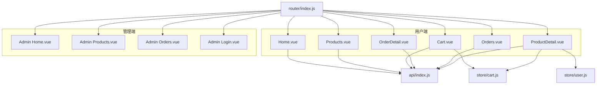
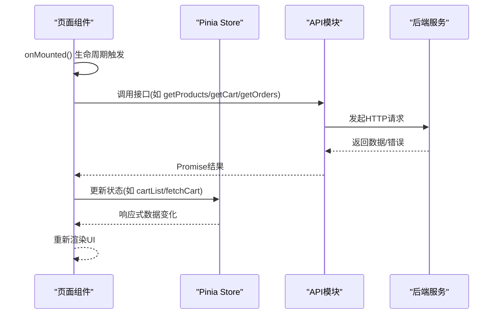
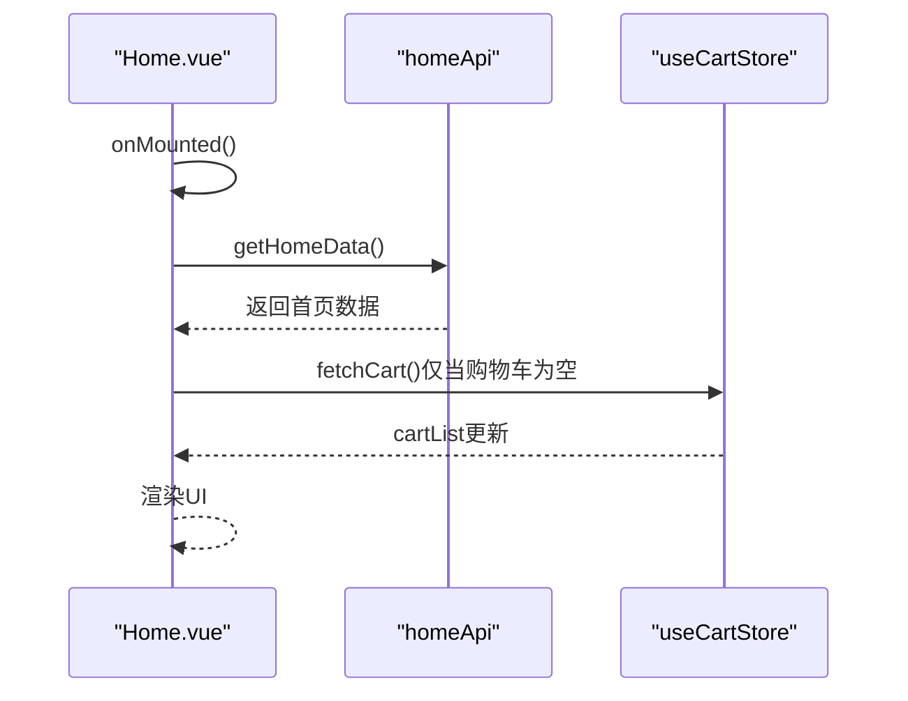
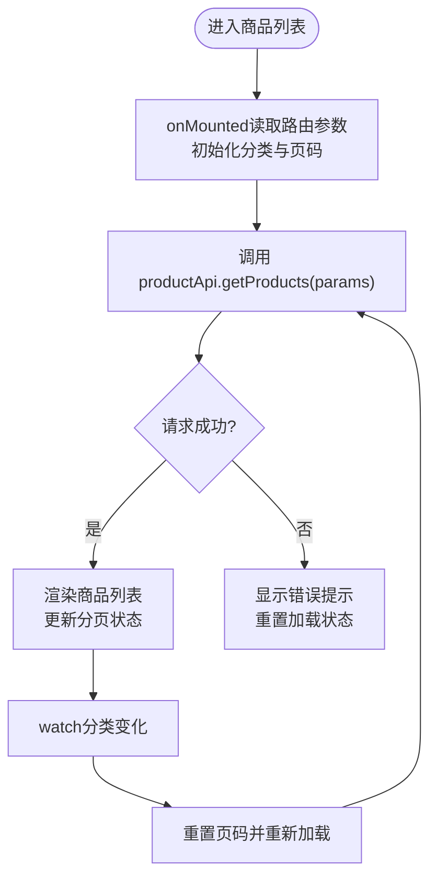
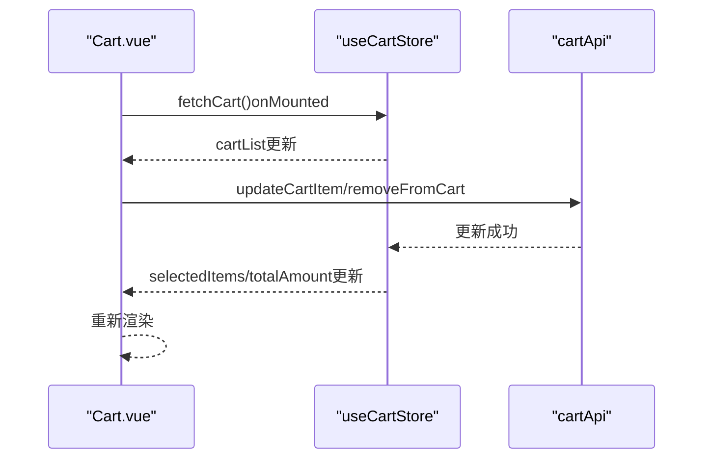
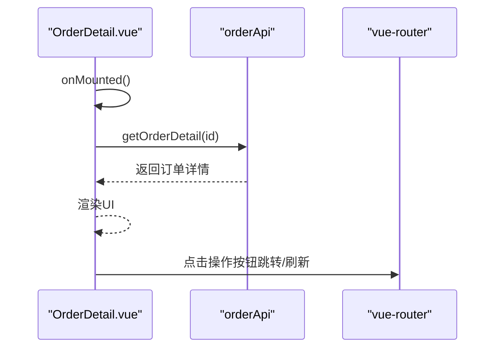
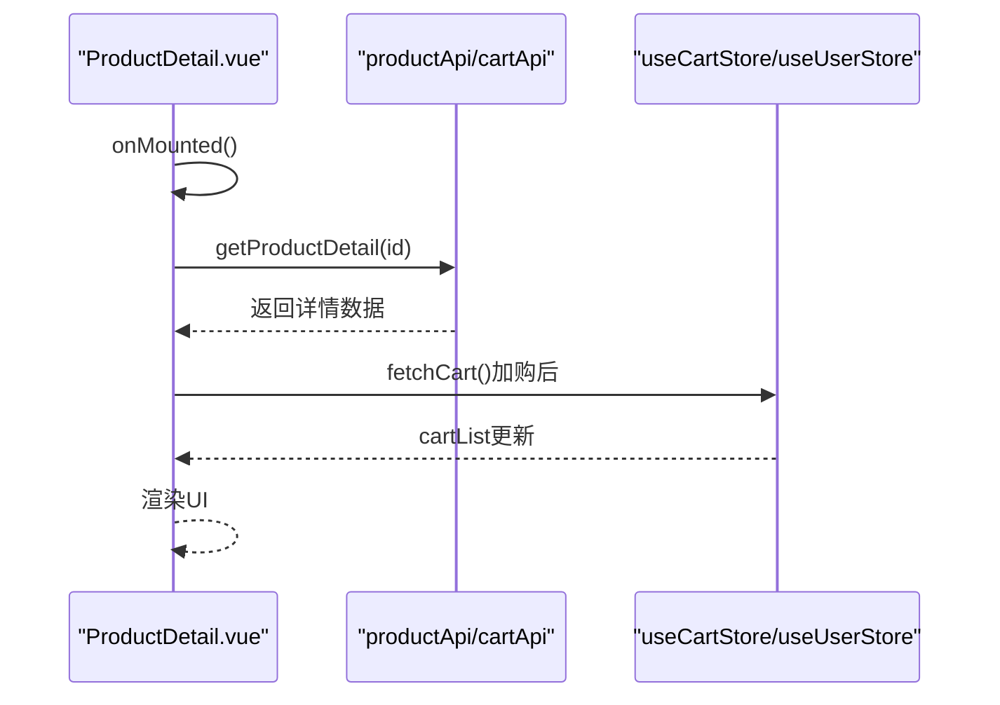
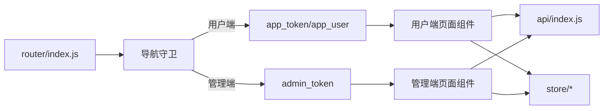

# 页面组件开发

<cite>
**本文档引用的文件**
- [Home.vue](file://frontend/src/views/Home.vue)
- [Products.vue](file://frontend/src/views/Products.vue)
- [Cart.vue](file://frontend/src/views/Cart.vue)
- [OrderDetail.vue](file://frontend/src/views/OrderDetail.vue)
- [Orders.vue](file://frontend/src/views/Orders.vue)
- [ProductDetail.vue](file://frontend/src/views/ProductDetail.vue)
- [Home.vue](file://frontend/src/admin/views/Home.vue)
- [Products.vue](file://frontend/src/admin/views/Products.vue)
- [Orders.vue](file://frontend/src/admin/views/Orders.vue)
- [Login.vue](file://frontend/src/admin/views/Login.vue)
- [index.js](file://frontend/src/router/index.js)
- [index.js](file://frontend/src/api/index.js)
- [cart.js](file://frontend/src/store/cart.js)
- [user.js](file://frontend/src/store/user.js)
</cite>

## 目录
1. [简介](#简介)
2. [项目结构](#项目结构)
3. [核心组件](#核心组件)
4. [架构总览](#架构总览)
5. [详细组件分析](#详细组件分析)
6. [依赖关系分析](#依赖关系分析)
7. [性能考虑](#性能考虑)
8. [故障排查指南](#故障排查指南)
9. [结论](#结论)
10. [附录](#附录)

## 简介
本指南面向趣配鲜项目的前端开发团队，系统性讲解用户端与管理端页面组件的开发模式、生命周期管理、数据获取策略、路由集成与性能优化。文档以实际源码为依据，结合Mermaid图表与路径引用，帮助开发者快速理解并高效实现页面组件。

## 项目结构
前端采用Vue 3 + Vite + Pinia + Vant 的技术栈，页面组件分为用户端与管理端两套体系：
- 用户端页面位于 `frontend/src/views/`，包含首页、商品列表、购物车、订单详情等
- 管理端页面位于 `frontend/src/admin/views/`，包含后台首页、商品管理、订单管理等
- 路由配置在 `frontend/src/router/index.js` 中统一管理
- API封装在 `frontend/src/api/index.js` 中按模块划分
- 状态管理使用Pinia，购物车与用户信息分别在 `frontend/src/store/cart.js` 和 `frontend/src/store/user.js`

**图表来源**
- [index.js:1-192](file://frontend/src/router/index.js#L1-L192)
- [index.js:1-138](file://frontend/src/api/index.js#L1-L138)
- [cart.js:1-68](file://frontend/src/store/cart.js#L1-L68)
- [user.js:1-96](file://frontend/src/store/user.js#L1-L96)

**章节来源**
- [index.js:1-192](file://frontend/src/router/index.js#L1-L192)

## 核心组件
本节概述用户端与管理端的关键页面组件及其职责：
- 用户端首页：聚合轮播、公告、分类导航、新品/热卖商品、食谱入口与安全提示
- 商品列表：分类筛选、关键词搜索、下拉刷新与上拉加载
- 购物车：多选、步进器、删除、结算流程
- 订单详情：状态展示、收货地址、商品清单、费用明细与操作按钮
- 订单列表：标签切换、状态过滤、批量操作
- 商品详情：轮播图、价格与标签、食材清单、烹饪步骤、评价展示与收藏/加购
- 管理端首页：侧边菜单、面包屑式标题、内容区路由占位
- 管理端商品管理：搜索、筛选、分页、库存/状态变更、弹窗表单
- 管理端订单管理：统计卡片、订单列表、状态变更、导出Excel
- 管理端登录：用户名密码登录、短信验证码找回密码流程

**章节来源**
- [Home.vue:1-376](file://frontend/src/views/Home.vue#L1-L376)
- [Products.vue:1-211](file://frontend/src/views/Products.vue#L1-L211)
- [Cart.vue:1-241](file://frontend/src/views/Cart.vue#L1-L241)
- [OrderDetail.vue:1-339](file://frontend/src/views/OrderDetail.vue#L1-L339)
- [Orders.vue:1-245](file://frontend/src/views/Orders.vue#L1-L245)
- [ProductDetail.vue:1-560](file://frontend/src/views/ProductDetail.vue#L1-L560)
- [Home.vue:1-242](file://frontend/src/admin/views/Home.vue#L1-L242)
- [Products.vue:1-720](file://frontend/src/admin/views/Products.vue#L1-L720)
- [Orders.vue:1-727](file://frontend/src/admin/views/Orders.vue#L1-L727)
- [Login.vue:1-315](file://frontend/src/admin/views/Login.vue#L1-L315)

## 架构总览
页面组件遵循“视图层 + 状态层 + 数据层”的分层架构：
- 视图层：各页面组件负责UI渲染与交互
- 状态层：Pinia Store管理购物车与用户信息
- 数据层：API模块封装REST接口，统一处理错误与加载态

**图表来源**
- [Products.vue:148-155](file://frontend/src/views/Products.vue#L148-L155)
- [Cart.vue:116-122](file://frontend/src/views/Cart.vue#L116-L122)
- [Orders.vue:137-139](file://frontend/src/views/Orders.vue#L137-L139)
- [index.js:32-61](file://frontend/src/api/index.js#L32-L61)
- [cart.js:17-25](file://frontend/src/store/cart.js#L17-L25)

## 详细组件分析

### 用户端首页 Home.vue
- 设计要点
  - 使用轮播图、公告栏、分类导航、新品/热卖商品、食谱入口与安全提示构成信息流
  - 顶部导航右侧提供客服入口，左侧搜索框跳转至商品列表
- 生命周期
  - onMounted：加载首页数据；若购物车为空则拉取购物车数据
- 数据获取
  - 通过 homeApi.getHomeData 获取品牌、轮播、公告、分类、新品、热卖、食谱与文案
- 路由集成
  - 横向商品卡片点击跳转至商品详情
  - 分类点击通过 query 参数传入 category_id
  - “更多”按钮跳转至商品列表并传入筛选条件

**图表来源**
- [Home.vue:178-183](file://frontend/src/views/Home.vue#L178-L183)
- [index.js:4-12](file://frontend/src/api/index.js#L4-L12)
- [cart.js:17-25](file://frontend/src/store/cart.js#L17-L25)

**章节来源**
- [Home.vue:107-184](file://frontend/src/views/Home.vue#L107-L184)

### 用户端商品列表 Products.vue
- 设计要点
  - 固定分类标签栏，支持关键词搜索与下拉刷新
  - 支持分页加载，上拉触底加载更多
- 生命周期与数据流
  - onMounted：读取路由 query 的 category_id 并初始化分类
  - watch 分类变化：重置页码并重新加载
  - loadProductList：根据页码与筛选条件调用 productApi.getProducts
- 错误处理
  - try/catch 包裹API调用，失败时显示Toast并重置加载状态

**图表来源**
- [Products.vue:148-161](file://frontend/src/views/Products.vue#L148-L161)
- [index.js:32-42](file://frontend/src/api/index.js#L32-L42)

**章节来源**
- [Products.vue:70-162](file://frontend/src/views/Products.vue#L70-L162)

### 用户端购物车 Cart.vue
- 设计要点
  - 多选组、步进器、删除、底部固定栏计算总价与结算
  - 无商品时显示空购物车与引导按钮
- 生命周期
  - onMounted：若本地购物车为空则拉取远端数据，并同步选中状态
- 数据与状态
  - 通过 useCartStore 管理 cartList、selectedItems、totalAmount
  - 每次数量变更或删除后调用 cartApi 并刷新本地状态

**图表来源**
- [Cart.vue:116-122](file://frontend/src/views/Cart.vue#L116-L122)
- [cart.js:17-25](file://frontend/src/store/cart.js#L17-L25)
- [index.js:44-50](file://frontend/src/api/index.js#L44-L50)

**章节来源**
- [Cart.vue:43-123](file://frontend/src/views/Cart.vue#L43-L123)
- [cart.js:1-68](file://frontend/src/store/cart.js#L1-L68)

### 用户端订单详情 OrderDetail.vue
- 设计要点
  - 状态栏高亮展示当前状态，收货地址、商品清单、费用明细清晰呈现
  - 根据状态显示不同操作按钮（取消、去支付、确认收货、评价、售后）
- 生命周期
  - onMounted：根据路由参数 id 加载订单详情
- 路由参数与导航
  - 通过 route.params.id 获取订单号，支持返回与跳转

**图表来源**
- [OrderDetail.vue:176-178](file://frontend/src/views/OrderDetail.vue#L176-L178)
- [index.js:52-61](file://frontend/src/api/index.js#L52-L61)

**章节来源**
- [OrderDetail.vue:80-179](file://frontend/src/views/OrderDetail.vue#L80-L179)

### 用户端订单列表 Orders.vue
- 设计要点
  - 顶部标签切换“全部/待付款/待备货/配送中/待收货”，支持取消/确认收货/评价/售后
- 生命周期
  - onMounted：默认加载全部订单
  - handleTabChange：根据标签映射状态参数重新加载

**章节来源**
- [Orders.vue:52-140](file://frontend/src/views/Orders.vue#L52-L140)

### 用户端商品详情 ProductDetail.vue
- 设计要点
  - 轮播图、价格与标签、食材清单、烹饪步骤、用户评价
  - 底部固定栏提供收藏、分享、客服与加入购物车/立即购买
- 登录校验
  - 收藏/加购前检查 app_token 与 app_user，未登录则跳转登录页并携带 redirect
- 数据获取
  - 通过 productApi.getProductDetail 获取详情、评价、收藏状态与合规信息
  - 加购后调用 cartApi.addToCart 并刷新购物车

**图表来源**
- [ProductDetail.vue:284-286](file://frontend/src/views/ProductDetail.vue#L284-L286)
- [index.js:32-42](file://frontend/src/api/index.js#L32-L42)
- [cart.js:17-25](file://frontend/src/store/cart.js#L17-L25)

**章节来源**
- [ProductDetail.vue:160-287](file://frontend/src/views/ProductDetail.vue#L160-L287)

### 管理端首页 Admin Home.vue
- 设计要点
  - 左侧菜单栏、右侧内容区通过 router-view 动态渲染子页面
  - 顶部标题根据当前路由动态显示
- 路由集成
  - handleMenuClick：根据菜单项 path 进行路由跳转
  - 退出登录：弹窗确认后清除 admin_token 并跳转登录页

**章节来源**
- [Home.vue:45-94](file://frontend/src/admin/views/Home.vue#L45-L94)

### 管理端商品管理 Admin Products.vue
- 设计要点
  - 搜索框、分类筛选、状态筛选、分页
  - 表格列：图片、名称、价格、库存、销量、状态、操作
  - 弹窗表单支持新增/编辑商品，包含分类选择器与开关控制
- 生命周期
  - onMounted：加载商品列表与分类列表
- 数据流
  - loadProducts：组合 keyword/category/status/pageSize
  - handleStockChange/handleStatusChange：实时更新库存与上下架状态
  - handleSubmit：新增/编辑商品并刷新列表

**章节来源**
- [Products.vue:230-519](file://frontend/src/admin/views/Products.vue#L230-L519)

### 管理端订单管理 Admin Orders.vue
- 设计要点
  - 统计卡片：待付款、待备货、配送中、已完成、售后中
  - 订单列表：订单号、时间、状态标签、商品清单、用户信息与操作
  - 弹窗详情：可直接在详情中修改订单状态
  - 导出Excel：下载订单数据
- 生命周期
  - onMounted：加载订单列表与统计

**章节来源**
- [Orders.vue:214-421](file://frontend/src/admin/views/Orders.vue#L214-L421)

### 管理端登录 Admin Login.vue
- 设计要点
  - 用户名/密码登录
  - 忘记密码三步流程：手机号 -> 验证码 -> 设置新密码
  - 登录成功后根据 redirect 参数跳转

**章节来源**
- [Login.vue:104-231](file://frontend/src/admin/views/Login.vue#L104-L231)

## 依赖关系分析
- 路由守卫
  - 用户端：requiresAuth 标记需要登录；管理端：isAdmin 标记需要管理员权限
  - 守卫中对 app_token 与 app_user 进行校验，异常时重定向至登录页
- API模块
  - 将用户端与管理端API分离，便于权限控制与错误处理
- 状态管理
  - 购物车与用户信息通过 Pinia Store 管理，避免跨组件重复请求

**图表来源**
- [index.js:155-189](file://frontend/src/router/index.js#L155-L189)
- [index.js:1-138](file://frontend/src/api/index.js#L1-L138)
- [cart.js:1-68](file://frontend/src/store/cart.js#L1-L68)
- [user.js:1-96](file://frontend/src/store/user.js#L1-L96)

**章节来源**
- [index.js:155-189](file://frontend/src/router/index.js#L155-L189)

## 性能考虑
- 懒加载与按需引入
  - 路由中使用动态导入，减少首屏体积
  - 参考：[index.js:7-111](file://frontend/src/router/index.js#L7-L111)
- 列表渲染优化
  - 使用 v-for + key，避免不必要的重排
  - 商品列表与订单列表采用分页与上拉加载，降低一次性渲染压力
- 状态缓存
  - 购物车与用户信息本地持久化，避免重复请求
  - 参考：[cart.js:17-25](file://frontend/src/store/cart.js#L17-L25)、[user.js:51-60](file://frontend/src/store/user.js#L51-L60)
- 图片与资源
  - 使用 object-fit 控制图片显示，合理设置尺寸与懒加载策略
- 请求去抖与防抖
  - 搜索与筛选建议在组件内做防抖，避免频繁请求
- 错误边界
  - 统一的错误提示与降级方案，提升用户体验

[本节为通用指导，无需特定文件引用]

## 故障排查指南
- 登录态失效
  - 现象：访问受保护页面被重定向至登录页
  - 排查：检查 localStorage 中 app_token 与 app_user 是否存在且有效
  - 参考：[index.js:155-189](file://frontend/src/router/index.js#L155-L189)、[user.js:62-67](file://frontend/src/store/user.js#L62-L67)
- 购物车数据不更新
  - 现象：加购/删减后总价不变
  - 排查：确认 cartApi 调用是否成功并调用 fetchCart 刷新
  - 参考：[Cart.vue:79-105](file://frontend/src/views/Cart.vue#L79-L105)、[cart.js:37-45](file://frontend/src/store/cart.js#L37-L45)
- 订单状态无法变更
  - 现象：管理端订单状态修改无效
  - 排查：确认 updateOrderStatus 调用与权限
  - 参考：[Orders.vue:376-385](file://frontend/src/admin/views/Orders.vue#L376-L385)
- 商品详情加载失败
  - 现象：商品详情空白或报错
  - 排查：检查 route.params.id 与 productApi.getProductDetail 返回
  - 参考：[ProductDetail.vue:195-210](file://frontend/src/views/ProductDetail.vue#L195-L210)

**章节来源**
- [index.js:155-189](file://frontend/src/router/index.js#L155-L189)
- [cart.js:37-45](file://frontend/src/store/cart.js#L37-L45)
- [Orders.vue:376-385](file://frontend/src/admin/views/Orders.vue#L376-L385)
- [ProductDetail.vue:195-210](file://frontend/src/views/ProductDetail.vue#L195-L210)

## 结论
本指南基于趣配鲜项目的实际代码，总结了用户端与管理端页面组件的开发范式：以生命周期钩子驱动数据加载、以API模块统一封装请求、以Pinia Store管理状态、以路由守卫保障权限。通过合理的性能优化与错误处理策略，可以构建稳定、易维护的页面组件体系。

[本节为总结性内容，无需特定文件引用]

## 附录
- 最佳实践清单
  - 在 onMounted 中进行数据加载，避免在模板中直接发起请求
  - 对外链与跳转使用明确的导航方法，保持一致性
  - 对关键操作（删除、取消、状态变更）增加二次确认
  - 对高频请求进行防抖与缓存策略
  - 统一错误提示与日志输出，便于定位问题

[本节为通用指导，无需特定文件引用]