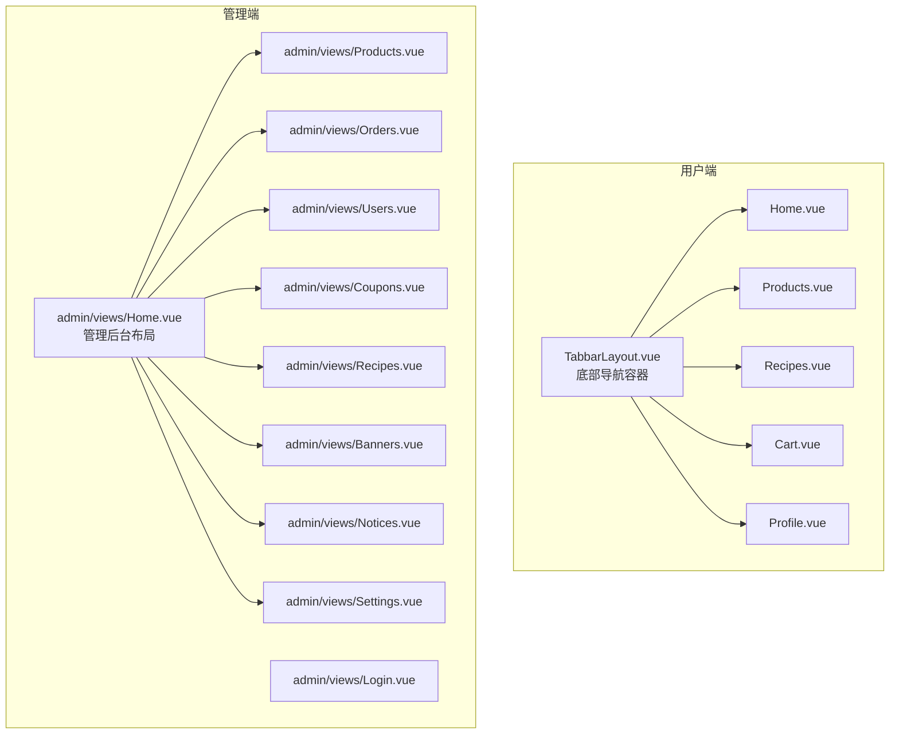
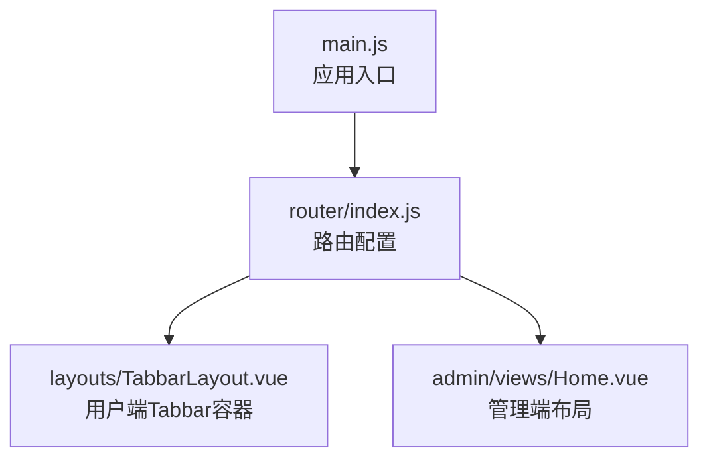
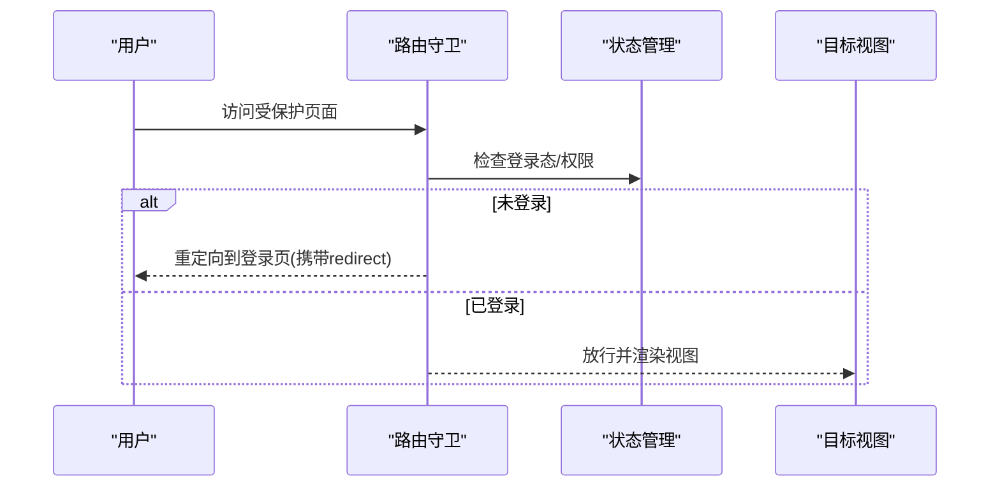
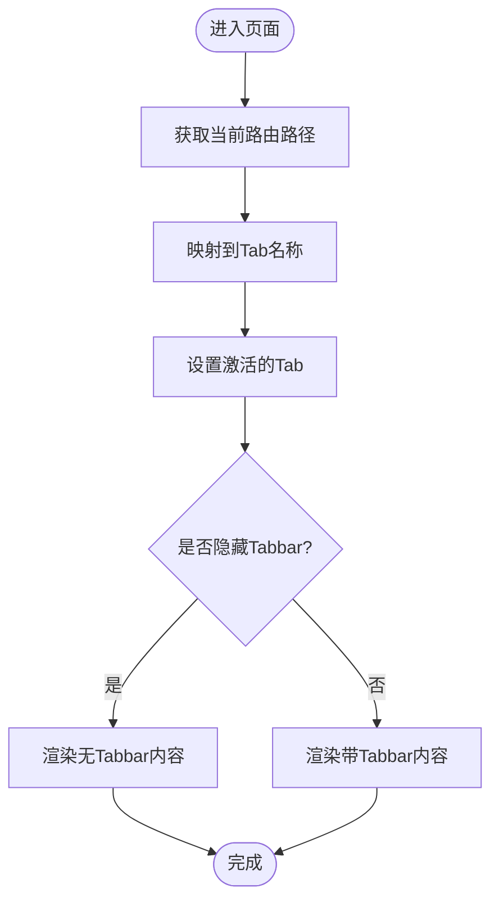
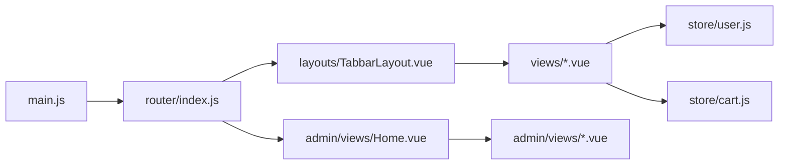

# 路由与导航

<cite>
**本文引用的文件**
- [frontend/src/router/index.js](file://frontend/src/router/index.js)
- [frontend/src/layouts/TabbarLayout.vue](file://frontend/src/layouts/TabbarLayout.vue)
- [frontend/src/views/Home.vue](file://frontend/src/views/Home.vue)
- [frontend/src/views/ProductDetail.vue](file://frontend/src/views/ProductDetail.vue)
- [frontend/src/views/RecipeDetail.vue](file://frontend/src/views/RecipeDetail.vue)
- [frontend/src/views/Cart.vue](file://frontend/src/views/Cart.vue)
- [frontend/src/views/Checkout.vue](file://frontend/src/views/Checkout.vue)
- [frontend/src/views/Orders.vue](file://frontend/src/views/Orders.vue)
- [frontend/src/views/OrderDetail.vue](file://frontend/src/views/OrderDetail.vue)
- [frontend/src/views/Favorites.vue](file://frontend/src/views/Favorites.vue)
- [frontend/src/views/Profile.vue](file://frontend/src/views/Profile.vue)
- [frontend/src/views/Login.vue](file://frontend/src/views/Login.vue)
- [frontend/src/views/Register.vue](file://frontend/src/views/Register.vue)
- [frontend/src/views/Recipes.vue](file://frontend/src/views/Recipes.vue)
- [frontend/src/admin/views/Home.vue](file://frontend/src/admin/views/Home.vue)
- [frontend/src/store/user.js](file://frontend/src/store/user.js)
- [frontend/src/store/cart.js](file://frontend/src/store/cart.js)
- [frontend/src/main.js](file://frontend/src/main.js)
- [frontend/vite.config.js](file://frontend/vite.config.js)
</cite>

## 目录
1. [简介](#简介)
2. [项目结构](#项目结构)
3. [核心组件](#核心组件)
4. [架构总览](#架构总览)
5. [详细组件分析](#详细组件分析)
6. [依赖关系分析](#依赖关系分析)
7. [性能考虑](#性能考虑)
8. [故障排查指南](#故障排查指南)
9. [结论](#结论)
10. [附录](#附录)

## 简介
本文件为“趣配鲜”项目的路由与导航专项文档，围绕 Vue Router 的配置与使用展开，覆盖以下主题：
- 路由定义与组织：用户端与管理端路由分离、动态路由与参数传递
- 导航守卫：全局前置守卫、路由独享守卫、组件内守卫的应用场景
- 底部导航栏：Tabbar 布局与页面切换效果
- 路由懒加载：代码分割与性能优化策略
- 面包屑导航：动态标题与路径展示方案
- 参数处理：query、params、路由元信息的使用

## 项目结构
前端路由主要位于用户端与管理端两套体系：
- 用户端路由：以 TabbarLayout 为容器，包含首页、分类、食谱、购物车、我的等页面
- 管理端路由：独立的后台布局与菜单，提供商品、订单、用户、优惠券、食谱、Banner、公告、系统设置等管理页面

图表来源
- [frontend/src/layouts/TabbarLayout.vue](file://frontend/src/layouts/TabbarLayout.vue)
- [frontend/src/views/Home.vue](file://frontend/src/views/Home.vue)
- [frontend/src/views/Products.vue](file://frontend/src/views/Products.vue)
- [frontend/src/views/Recipes.vue](file://frontend/src/views/Recipes.vue)
- [frontend/src/views/Cart.vue](file://frontend/src/views/Cart.vue)
- [frontend/src/views/Profile.vue](file://frontend/src/views/Profile.vue)
- [frontend/src/admin/views/Home.vue](file://frontend/src/admin/views/Home.vue)

章节来源
- [frontend/src/router/index.js](file://frontend/src/router/index.js)
- [frontend/src/layouts/TabbarLayout.vue](file://frontend/src/layouts/TabbarLayout.vue)

## 核心组件
- 路由入口与配置：集中于路由模块，定义用户端与管理端的路由表、导航守卫与懒加载策略
- 底部导航容器：TabbarLayout 提供统一的 Tabbar 切换、当前路由高亮与页面滚动控制
- 页面视图：各业务页面通过 $router.push/$router.back 实现页面跳转与返回
- 状态管理：用户与购物车状态在 store 中维护，为路由守卫与页面逻辑提供支撑

章节来源
- [frontend/src/router/index.js](file://frontend/src/router/index.js)
- [frontend/src/layouts/TabbarLayout.vue](file://frontend/src/layouts/TabbarLayout.vue)
- [frontend/src/store/user.js](file://frontend/src/store/user.js)
- [frontend/src/store/cart.js](file://frontend/src/store/cart.js)

## 架构总览
用户端与管理端采用双路由体系，通过不同的布局组件承载页面，实现清晰的职责分离。

图表来源
- [frontend/src/main.js](file://frontend/src/main.js)
- [frontend/src/router/index.js](file://frontend/src/router/index.js)
- [frontend/src/layouts/TabbarLayout.vue](file://frontend/src/layouts/TabbarLayout.vue)
- [frontend/src/admin/views/Home.vue](file://frontend/src/admin/views/Home.vue)

## 详细组件分析

### 路由配置与组织
- 用户端路由
  - 以 TabbarLayout 为根布局，内部包含首页、分类、食谱、购物车、我的五个 Tab
  - 每个 Tab 对应一个视图组件，通过路由切换实现页面切换
- 管理端路由
  - 独立的后台布局，包含侧边菜单与主内容区
  - 菜单项与路由路径一一对应，支持点击跳转与退出登录

章节来源
- [frontend/src/router/index.js](file://frontend/src/router/index.js)
- [frontend/src/layouts/TabbarLayout.vue](file://frontend/src/layouts/TabbarLayout.vue)
- [frontend/src/admin/views/Home.vue](file://frontend/src/admin/views/Home.vue)

### 导航守卫应用
- 全局前置守卫
  - 在用户端路由中，可基于登录态与权限判断决定是否放行
  - 可拦截未登录用户访问购物车、订单、个人中心等页面，引导至登录页并携带 redirect 参数
- 路由独享守卫
  - 商品详情、食谱详情等页面可校验登录态，未登录则跳转登录页并保留目标地址
- 组件内守卫
  - 在组件生命周期中根据路由参数加载数据，如商品详情页根据 params.id 加载详情

图表来源
- [frontend/src/views/ProductDetail.vue](file://frontend/src/views/ProductDetail.vue)
- [frontend/src/views/RecipeDetail.vue](file://frontend/src/views/RecipeDetail.vue)
- [frontend/src/store/user.js](file://frontend/src/store/user.js)

章节来源
- [frontend/src/views/ProductDetail.vue](file://frontend/src/views/ProductDetail.vue)
- [frontend/src/views/RecipeDetail.vue](file://frontend/src/views/RecipeDetail.vue)
- [frontend/src/store/user.js](file://frontend/src/store/user.js)

### 底部导航与页面切换
- TabbarLayout 统一管理底部导航栏，根据当前路由高亮对应 Tab
- 支持点击切换与编程式导航，同时控制页面滚动至顶部
- 通过路由元信息可控制某些页面隐藏 Tabbar 或增加额外底部区域

图表来源
- [frontend/src/layouts/TabbarLayout.vue](file://frontend/src/layouts/TabbarLayout.vue)

章节来源
- [frontend/src/layouts/TabbarLayout.vue](file://frontend/src/layouts/TabbarLayout.vue)

### 路由懒加载与性能优化
- 使用动态 import 实现按需加载视图组件，减少首屏体积
- 结合打包工具的代码分割策略，提升首屏加载速度与运行时性能
- 在管理端与用户端页面中均有懒加载体现，避免不必要的资源加载

章节来源
- [frontend/src/router/index.js](file://frontend/src/router/index.js)
- [frontend/vite.config.js](file://frontend/vite.config.js)

### 面包屑导航实现
- 动态标题：根据当前路由元信息或页面数据动态设置标题
- 路径展示：可在页面头部或内容区展示当前路径层级，便于用户定位
- 建议：结合路由元信息中的 title 字段与面包屑组件，实现一致性的导航体验

章节来源
- [frontend/src/layouts/TabbarLayout.vue](file://frontend/src/layouts/TabbarLayout.vue)

### 路由参数处理
- params 参数
  - 商品详情、食谱详情等页面通过 params.id 获取目标资源
  - 示例：商品详情页根据路由参数加载详情数据
- query 参数
  - 分类筛选、排序、分页等场景通过 query 传参
  - 示例：首页支持通过 query 过滤新品、热销商品
- 路由元信息
  - 通过 meta 字段控制页面标题、是否隐藏 Tabbar、额外底部区域等
  - 示例：TabbarLayout 通过路由元信息控制布局样式

章节来源
- [frontend/src/views/ProductDetail.vue](file://frontend/src/views/ProductDetail.vue)
- [frontend/src/views/RecipeDetail.vue](file://frontend/src/views/RecipeDetail.vue)
- [frontend/src/views/Home.vue](file://frontend/src/views/Home.vue)
- [frontend/src/layouts/TabbarLayout.vue](file://frontend/src/layouts/TabbarLayout.vue)

## 依赖关系分析
- 应用入口依赖路由模块，路由模块再依赖各视图组件与布局组件
- 视图组件依赖状态管理（用户、购物车），用于守卫判断与页面数据加载
- 管理端布局与菜单项依赖路由配置，实现点击跳转与高亮同步

图表来源
- [frontend/src/main.js](file://frontend/src/main.js)
- [frontend/src/router/index.js](file://frontend/src/router/index.js)
- [frontend/src/layouts/TabbarLayout.vue](file://frontend/src/layouts/TabbarLayout.vue)
- [frontend/src/admin/views/Home.vue](file://frontend/src/admin/views/Home.vue)
- [frontend/src/store/user.js](file://frontend/src/store/user.js)
- [frontend/src/store/cart.js](file://frontend/src/store/cart.js)

章节来源
- [frontend/src/main.js](file://frontend/src/main.js)
- [frontend/src/router/index.js](file://frontend/src/router/index.js)
- [frontend/src/layouts/TabbarLayout.vue](file://frontend/src/layouts/TabbarLayout.vue)
- [frontend/src/admin/views/Home.vue](file://frontend/src/admin/views/Home.vue)
- [frontend/src/store/user.js](file://frontend/src/store/user.js)
- [frontend/src/store/cart.js](file://frontend/src/store/cart.js)

## 性能考虑
- 路由懒加载：通过动态 import 将页面拆分为独立 chunk，按需加载
- 代码分割：结合构建工具的自动分包策略，避免重复依赖与冗余代码
- 首屏优化：将非关键页面延迟加载，缩短首屏渲染时间
- 缓存策略：在页面级缓存与路由级缓存之间平衡，兼顾性能与数据一致性

## 故障排查指南
- 登录态异常导致无法访问受保护页面
  - 检查全局前置守卫逻辑与状态管理中的登录标志
  - 确认登录后是否正确写入 token 与用户信息
- 路由跳转后 Tabbar 不高亮
  - 检查 TabbarLayout 是否正确映射当前路由到 Tab 名称
  - 确认路由元信息与 Tab 名称的一致性
- 动态参数加载失败
  - 检查视图组件是否在合适的生命周期中根据 params 加载数据
  - 确认网络请求与错误处理逻辑
- 管理端菜单点击无效
  - 检查路由配置中的路径与菜单项是否匹配
  - 确认点击事件绑定与路由 push 的调用

章节来源
- [frontend/src/store/user.js](file://frontend/src/store/user.js)
- [frontend/src/layouts/TabbarLayout.vue](file://frontend/src/layouts/TabbarLayout.vue)
- [frontend/src/views/ProductDetail.vue](file://frontend/src/views/ProductDetail.vue)
- [frontend/src/admin/views/Home.vue](file://frontend/src/admin/views/Home.vue)

## 结论
本项目采用清晰的用户端与管理端路由分离架构，配合 Tabbar 容器与懒加载策略，实现了良好的用户体验与性能表现。通过合理的导航守卫与参数处理机制，保障了页面访问控制与数据加载的稳定性。建议持续完善路由元信息与面包屑导航，进一步提升导航一致性与可维护性。

## 附录
- 关键实现位置参考
  - 路由配置与懒加载：[frontend/src/router/index.js](file://frontend/src/router/index.js)
  - 底部导航容器：[frontend/src/layouts/TabbarLayout.vue](file://frontend/src/layouts/TabbarLayout.vue)
  - 用户端页面示例：首页、商品详情、食谱详情、购物车、订单、个人中心等
  - 管理端页面示例：商品、订单、用户、优惠券、食谱、Banner、公告、设置等
  - 状态管理：用户与购物车状态
  - 应用入口：[frontend/src/main.js](file://frontend/src/main.js)
  - 构建配置：[frontend/vite.config.js](file://frontend/vite.config.js)