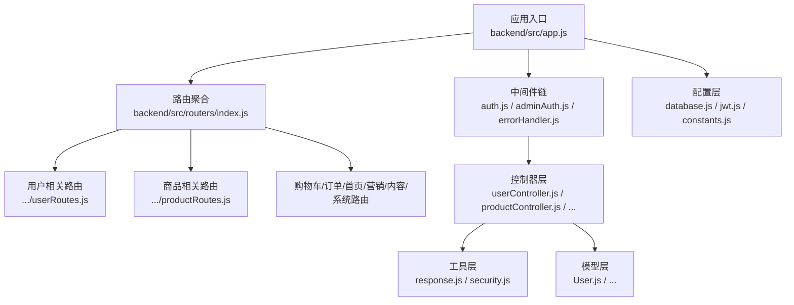
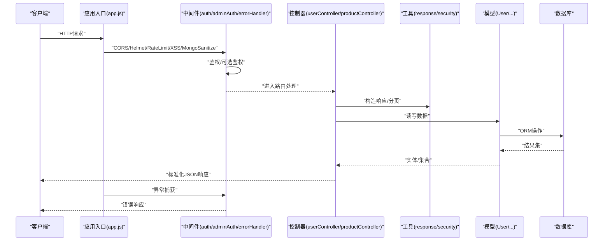
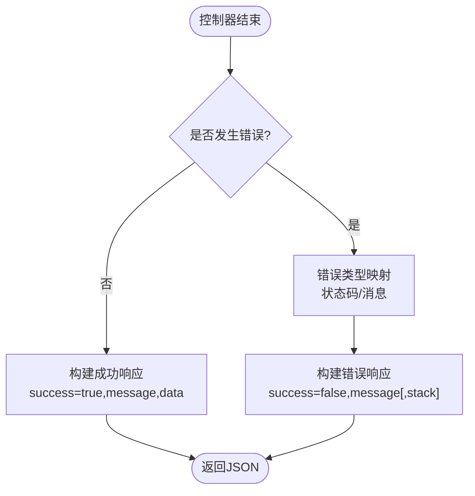
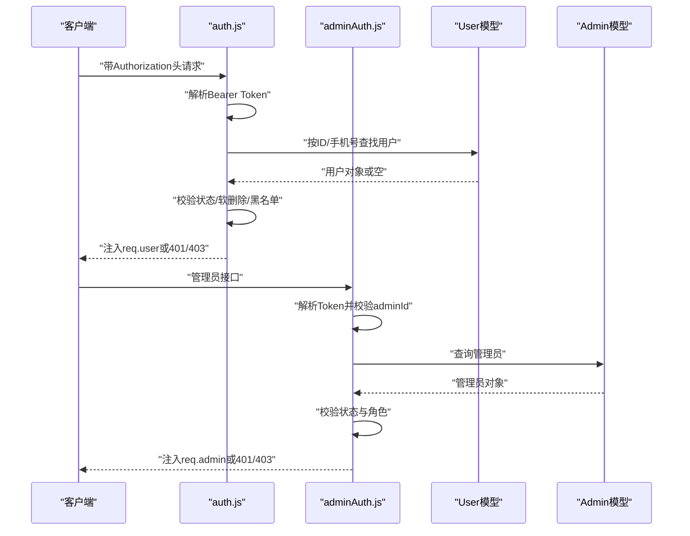
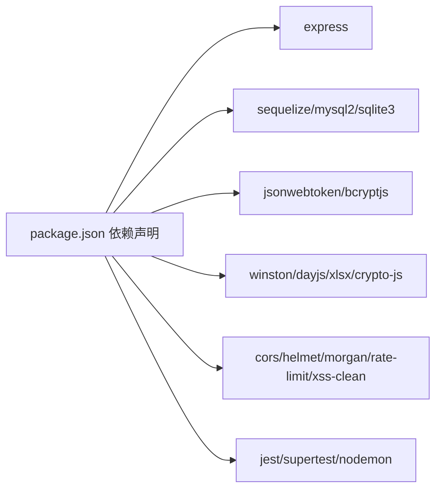
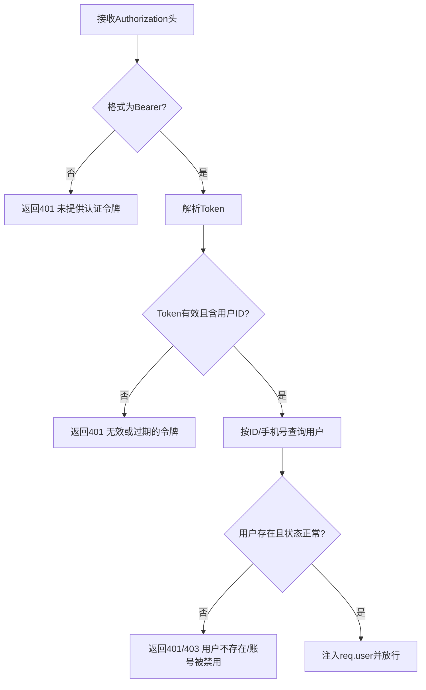

# API开发规范

<cite>
**本文引用的文件**
- [backend/src/app.js](file://backend/src/app.js)
- [backend/src/routers/index.js](file://backend/src/routers/index.js)
- [backend/src/controllers/userController.js](file://backend/src/controllers/userController.js)
- [backend/src/controllers/productController.js](file://backend/src/controllers/productController.js)
- [backend/src/middlewares/auth.js](file://backend/src/middlewares/auth.js)
- [backend/src/middlewares/adminAuth.js](file://backend/src/middlewares/adminAuth.js)
- [backend/src/middlewares/errorHandler.js](file://backend/src/middlewares/errorHandler.js)
- [backend/src/utils/response.js](file://backend/src/utils/response.js)
- [backend/src/config/constants.js](file://backend/src/config/constants.js)
- [backend/src/config/jwt.js](file://backend/src/config/jwt.js)
- [backend/src/config/database.js](file://backend/src/config/database.js)
- [backend/src/models/User.js](file://backend/src/models/User.js)
- [backend/package.json](file://backend/package.json)
- [docs/api.md](file://docs/api.md)
</cite>

## 目录
1. [引言](#引言)
2. [项目结构](#项目结构)
3. [核心组件](#核心组件)
4. [架构总览](#架构总览)
5. [详细组件分析](#详细组件分析)
6. [依赖分析](#依赖分析)
7. [性能考虑](#性能考虑)
8. [故障排查指南](#故障排查指南)
9. [结论](#结论)
10. [附录](#附录)

## 引言
本文件面向API开发者与维护者，系统化梳理本项目的RESTful API设计与实现，覆盖资源命名、HTTP方法与状态码规范、请求/响应格式标准化、分页机制、版本控制策略、文档生成与维护、输入验证与安全过滤、性能优化、测试方法以及监控与日志记录。目标是帮助团队在保持一致性的同时提升API的稳定性、可维护性与可扩展性。

## 项目结构
后端基于Express框架，采用“路由-中间件-控制器-工具-配置-模型”的分层组织方式，配合Sequelize ORM与数据库连接配置，统一输出标准化响应与错误处理。

图表来源
- [backend/src/app.js:1-84](file://backend/src/app.js#L1-L84)
- [backend/src/routers/index.js:1-27](file://backend/src/routers/index.js#L1-L27)

章节来源
- [backend/src/app.js:1-84](file://backend/src/app.js#L1-L84)
- [backend/src/routers/index.js:1-27](file://backend/src/routers/index.js#L1-L27)

## 核心组件
- 应用入口与中间件栈：统一启用CORS、Helmet、速率限制、XSS清理、Mongo注入清理、 Morgan日志流与静态资源托管；挂载统一错误处理器与404处理。
- 路由聚合：以/api前缀统一暴露业务路由，包含用户、商品、购物车、订单、首页、营销、内容与系统管理等模块。
- 控制器：封装业务逻辑，调用工具与模型，返回标准化响应或错误。
- 中间件：鉴权（用户/管理员）、可选鉴权、错误处理。
- 工具：统一响应格式、分页格式、安全过滤辅助。
- 配置：数据库连接、JWT密钥与过期策略、全局常量（状态码、文案、分页默认值）。
- 模型：用户模型定义与密码哈希钩子。

章节来源
- [backend/src/app.js:1-84](file://backend/src/app.js#L1-L84)
- [backend/src/routers/index.js:1-27](file://backend/src/routers/index.js#L1-L27)
- [backend/src/utils/response.js:1-32](file://backend/src/utils/response.js#L1-L32)
- [backend/src/middlewares/auth.js:1-181](file://backend/src/middlewares/auth.js#L1-L181)
- [backend/src/middlewares/adminAuth.js:1-77](file://backend/src/middlewares/adminAuth.js#L1-L77)
- [backend/src/middlewares/errorHandler.js:1-47](file://backend/src/middlewares/errorHandler.js#L1-L47)
- [backend/src/config/constants.js:1-132](file://backend/src/config/constants.js#L1-L132)
- [backend/src/config/jwt.js:1-41](file://backend/src/config/jwt.js#L1-L41)
- [backend/src/config/database.js:1-56](file://backend/src/config/database.js#L1-L56)
- [backend/src/models/User.js:1-150](file://backend/src/models/User.js#L1-L150)

## 架构总览
整体采用“请求-中间件-路由-控制器-模型-数据库”的线性调用链，错误通过统一中间件捕获并格式化输出。

图表来源
- [backend/src/app.js:1-84](file://backend/src/app.js#L1-L84)
- [backend/src/middlewares/auth.js:1-181](file://backend/src/middlewares/auth.js#L1-L181)
- [backend/src/middlewares/adminAuth.js:1-77](file://backend/src/middlewares/adminAuth.js#L1-L77)
- [backend/src/middlewares/errorHandler.js:1-47](file://backend/src/middlewares/errorHandler.js#L1-L47)
- [backend/src/utils/response.js:1-32](file://backend/src/utils/response.js#L1-L32)
- [backend/src/models/User.js:1-150](file://backend/src/models/User.js#L1-L150)

## 详细组件分析

### 统一响应与错误处理
- 成功响应：包含success布尔字段、message与data；分页场景使用paginate封装。
- 错误响应：包含success布尔字段与message；开发环境可附加stack；生产环境屏蔽细节。
- 404统一处理：notFoundHandler返回标准错误结构。
- 错误类型映射：ValidationError、UnauthorizedError、ForbiddenError、NotFoundError、ConflictError映射到对应HTTP状态码。

图表来源
- [backend/src/utils/response.js:1-32](file://backend/src/utils/response.js#L1-L32)
- [backend/src/middlewares/errorHandler.js:1-47](file://backend/src/middlewares/errorHandler.js#L1-L47)

章节来源
- [backend/src/utils/response.js:1-32](file://backend/src/utils/response.js#L1-L32)
- [backend/src/middlewares/errorHandler.js:1-47](file://backend/src/middlewares/errorHandler.js#L1-L47)

### 鉴权与权限控制
- 用户鉴权：从Authorization头解析Bearer Token，解码后查询用户，校验状态与软删除；支持开发环境下的“按手机号回退”与测试用户创建。
- 管理员鉴权：校验adminId存在性与管理员状态。
- 角色控制：requireRole根据角色白名单放行。
- 可选鉴权：允许匿名访问但尝试注入已登录上下文。

图表来源
- [backend/src/middlewares/auth.js:1-181](file://backend/src/middlewares/auth.js#L1-L181)
- [backend/src/middlewares/adminAuth.js:1-77](file://backend/src/middlewares/adminAuth.js#L1-L77)
- [backend/src/models/User.js:1-150](file://backend/src/models/User.js#L1-L150)

章节来源
- [backend/src/middlewares/auth.js:1-181](file://backend/src/middlewares/auth.js#L1-L181)
- [backend/src/middlewares/adminAuth.js:1-77](file://backend/src/middlewares/adminAuth.js#L1-L77)
- [backend/src/models/User.js:1-150](file://backend/src/models/User.js#L1-L150)

### 路由与资源命名
- 前缀：/api，后续按功能域细分，如/users、/products、/orders、/admin等。
- 健康检查：/api/health返回服务状态。
- 控制器职责：用户注册/登录/资料/地址；商品列表/详情/收藏/浏览历史；管理员商品/分类/用户/统计等。

章节来源
- [backend/src/routers/index.js:1-27](file://backend/src/routers/index.js#L1-L27)
- [backend/src/controllers/userController.js:1-426](file://backend/src/controllers/userController.js#L1-L426)
- [backend/src/controllers/productController.js:1-527](file://backend/src/controllers/productController.js#L1-L527)

### 输入验证与安全过滤
- 安全中间件：Helmet、xss-clean、express-mongo-sanitize、速率限制。
- 控制器内参数校验：如商品创建/更新对必填字段与类型进行显式校验，错误时返回400。
- 密码处理：User模型在beforeCreate/beforeUpdate钩子中自动哈希，避免明文存储。
- 日志：Morgan将请求日志写入统一logger，便于审计与排障。

章节来源
- [backend/src/app.js:1-84](file://backend/src/app.js#L1-L84)
- [backend/src/controllers/productController.js:266-346](file://backend/src/controllers/productController.js#L266-L346)
- [backend/src/models/User.js:131-147](file://backend/src/models/User.js#L131-L147)

### 分页机制
- 默认页码与每页大小：通过constants.js集中定义。
- 控制器实现：使用findAndCountAll，计算total与totalPages，统一通过paginate工具输出。
- 建议：前端传入page/pageSize，后端严格校验数值类型与边界。

章节来源
- [backend/src/config/constants.js:125-130](file://backend/src/config/constants.js#L125-L130)
- [backend/src/controllers/productController.js:6-42](file://backend/src/controllers/productController.js#L6-L42)
- [backend/src/utils/response.js:17-29](file://backend/src/utils/response.js#L17-L29)

### 版本控制策略
- 当前文档版本：v1（见docs/api.md）。
- 实践建议：
  - URL路径版本：/api/v1/...，便于平滑迁移与向后兼容。
  - 头部版本：Accept: application/vnd.company.v1+json。
  - 废弃策略：新增版本时保留旧版本至少90天，标注Deprecation并在响应头提示迁移时间点。
  - 语义化版本：PATCH仅修复，MINOR增加兼容新功能，MAJOR破坏性变更。

章节来源
- [docs/api.md:6](file://docs/api.md#L6)

### API文档生成与维护
- 现状：使用Markdown维护API文档（docs/api.md），包含端点、参数、示例与状态码。
- 建议：
  - 引入OpenAPI/Swagger：结合注释导出yaml/json，自动生成SDK与交互式文档。
  - CI集成：每次提交触发文档生成与校验，确保与代码一致。
  - 文档演进：随版本升级同步更新，标注变更摘要与迁移指引。

章节来源
- [docs/api.md:1-422](file://docs/api.md#L1-L422)

### 性能优化
- 连接池与数据库：MySQL连接池配置（最大/最小/获取超时/idle），SQLite开发模式。
- 缓存策略：热点数据（首页、分类、商品详情）引入Redis缓存，设置合理TTL与失效策略。
- 压缩传输：开启Gzip/Deflate（Express中间件），减少大响应体积。
- 并发控制：速率限制（express-rate-limit）与队列限流，避免突发流量击穿。
- 查询优化：索引覆盖常见查询条件（phone、id、状态、时间戳），避免N+1查询。

章节来源
- [backend/src/config/database.js:38-43](file://backend/src/config/database.js#L38-L43)
- [backend/src/app.js:32-39](file://backend/src/app.js#L32-L39)

### 测试方法
- 单元测试：针对控制器中的业务分支与参数校验编写用例。
- 集成测试：模拟HTTP请求，验证路由、中间件、控制器与数据库交互。
- 压力测试：使用压测工具评估QPS与延迟，识别瓶颈（数据库/缓存/网络）。
- 建议：覆盖率目标（函数/分支/行），持续集成中强制执行。

章节来源
- [backend/package.json:9](file://backend/package.json#L9)

### 监控与日志记录
- 请求日志：Morgan以“combined”格式输出，写入统一logger，便于链路追踪。
- 错误日志：统一错误中间件记录message、stack、URL、方法、IP等上下文。
- 建议：接入APM（如Sentry/OpenTelemetry）采集指标与错误，设置告警阈值。

章节来源
- [backend/src/app.js:41-45](file://backend/src/app.js#L41-L45)
- [backend/src/middlewares/errorHandler.js:3-10](file://backend/src/middlewares/errorHandler.js#L3-L10)

## 依赖分析
- Express生态：CORS、Helmet、rate-limit、xss-clean、mongo-sanitize、morgan。
- ORM与数据库：Sequelize、mysql2/sqlite3。
- 安全与认证：jsonwebtoken、bcryptjs。
- 工具与日志：winston、dayjs、xlsx、crypto-js。
- 测试：jest、supertest、nodemon。

图表来源
- [backend/package.json:18-45](file://backend/package.json#L18-L45)

章节来源
- [backend/package.json:1-50](file://backend/package.json#L1-L50)

## 性能考虑
- 数据库层：合理索引、连接池参数、读写分离（视业务规模）。
- 应用层：缓存热点数据、批量查询替代N+1、延迟序列化大对象。
- 网络层：启用压缩、CDN加速静态资源、限流与熔断。
- 监控：QPS、P95/P99延迟、错误率、数据库慢查询、Redis命中率。

## 故障排查指南
- 401未授权：检查Authorization头格式与Token有效性；确认用户状态与软删除。
- 403禁止访问：管理员权限不足或被禁用；核对角色与requireRole。
- 404资源不存在：确认ID类型与业务存在性；检查软删除与状态字段。
- 500服务器错误：查看错误中间件日志与堆栈；定位具体控制器与模型调用。
- 速率限制：调整express-rate-limit配置或引导客户端重试。

章节来源
- [backend/src/middlewares/errorHandler.js:12-36](file://backend/src/middlewares/errorHandler.js#L12-L36)
- [backend/src/middlewares/auth.js:5-148](file://backend/src/middlewares/auth.js#L5-L148)
- [backend/src/middlewares/adminAuth.js:5-49](file://backend/src/middlewares/adminAuth.js#L5-L49)

## 结论
本项目在Express基础上建立了清晰的分层架构与统一的响应/错误处理机制，具备基础的安全中间件与鉴权体系。建议在现有基础上完善版本控制、引入OpenAPI文档、强化缓存与监控，并持续优化数据库与网络层面的性能，以支撑业务增长与高并发场景。

## 附录

### REST设计要点速查
- 资源命名：复数名词，小写，连字符或下划线风格统一。
- HTTP方法：GET/POST/PUT/DELETE，幂等性明确。
- 状态码：200/201/204/400/401/403/404/409/500，语义化。
- 请求体：JSON，字段命名一致；必要时提供校验错误数组。
- 响应体：success/message/data/pagination（分页时），错误时仅包含message与可选错误详情。

### 关键流程图：登录鉴权

图表来源
- [backend/src/middlewares/auth.js:4-148](file://backend/src/middlewares/auth.js#L4-L148)