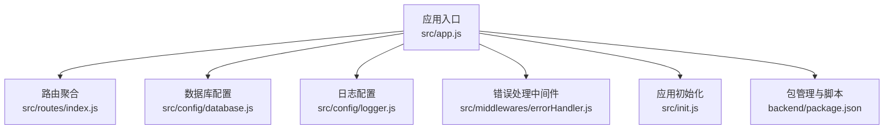
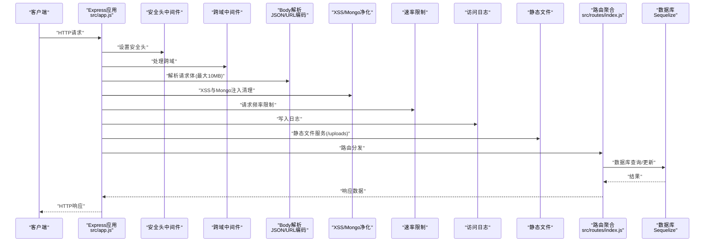
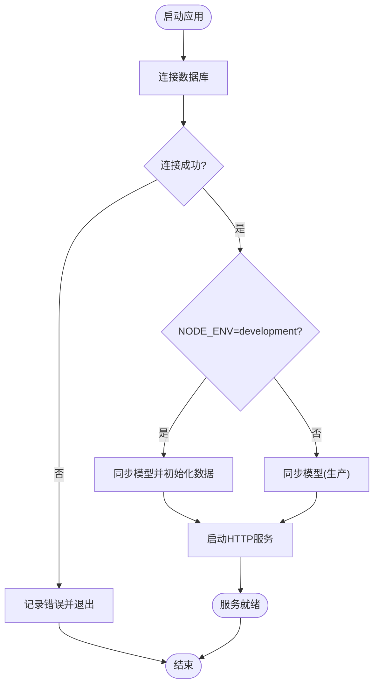
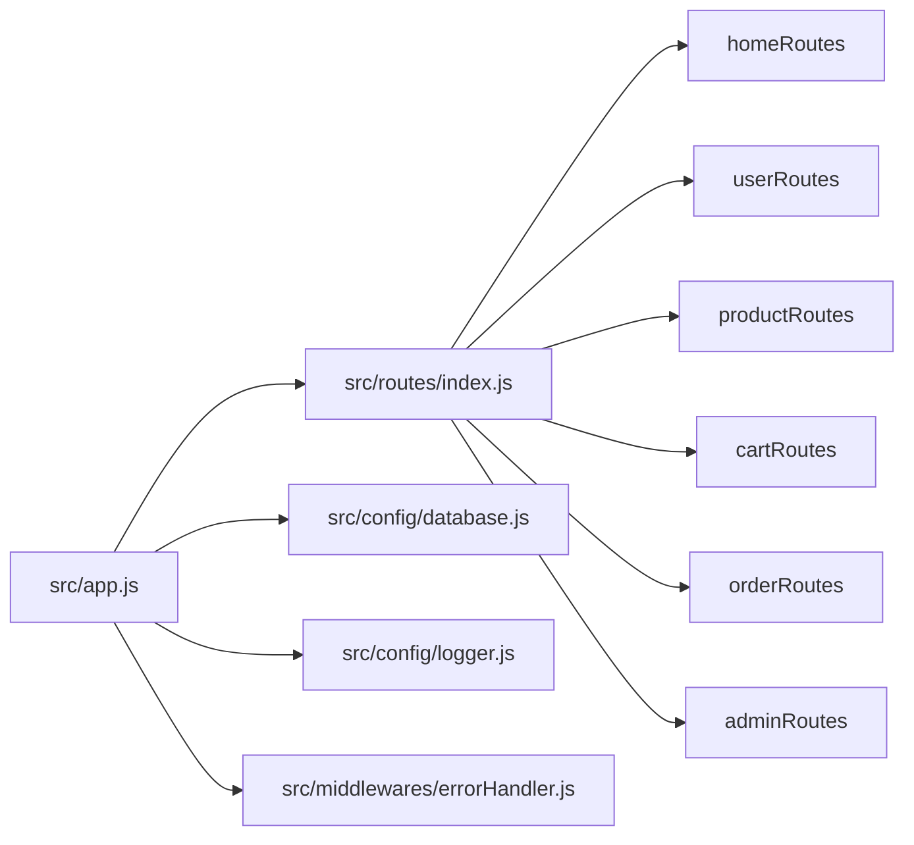

# Express.js框架配置

<cite>
**本文档引用的文件**
- [backend/src/app.js](file://backend/src/app.js)
- [backend/src/init.js](file://backend/src/init.js)
- [backend/src/config/database.js](file://backend/src/config/database.js)
- [backend/src/config/logger.js](file://backend/src/config/logger.js)
- [backend/src/middlewares/errorHandler.js](file://backend/src/middlewares/errorHandler.js)
- [backend/src/routes/index.js](file://backend/src/routes/index.js)
- [backend/package.json](file://backend/package.json)
</cite>

## 目录
1. [简介](#简介)
2. [项目结构](#项目结构)
3. [核心组件](#核心组件)
4. [架构总览](#架构总览)
5. [详细组件分析](#详细组件分析)
6. [依赖关系分析](#依赖关系分析)
7. [性能考虑](#性能考虑)
8. [故障排除指南](#故障排除指南)
9. [结论](#结论)
10. [附录](#附录)

## 简介
本文件面向Express.js后端服务的配置与部署，围绕应用入口点、中间件注册顺序、路由挂载、服务器启动流程、环境变量与端口、进程管理、静态文件与上传、CORS跨域、HTTPS与安全头、性能优化、日志与错误处理、健康检查以及开发/生产差异与Docker部署要点展开。文档基于仓库中的实际实现进行分析，确保读者能够准确理解当前系统的配置现状与最佳实践。

## 项目结构
后端采用模块化组织，核心入口位于src/app.js，数据库ORM配置在src/config/database.js，日志系统在src/config/logger.js，全局错误处理器在src/middlewares/errorHandler.js，路由聚合在src/routes/index.js，应用初始化逻辑在src/init.js。包管理与脚本定义在backend/package.json中。

图表来源
- [backend/src/app.js:1-84](file://backend/src/app.js#L1-L84)
- [backend/src/routes/index.js:1-27](file://backend/src/routes/index.js#L1-L27)
- [backend/src/config/database.js:1-56](file://backend/src/config/database.js#L1-L56)
- [backend/src/config/logger.js:1-52](file://backend/src/config/logger.js#L1-L52)
- [backend/src/middlewares/errorHandler.js:1-47](file://backend/src/middlewares/errorHandler.js#L1-L47)
- [backend/src/init.js:1-502](file://backend/src/init.js#L1-L502)
- [backend/package.json:1-50](file://backend/package.json#L1-L50)

章节来源
- [backend/src/app.js:1-84](file://backend/src/app.js#L1-L84)
- [backend/src/routes/index.js:1-27](file://backend/src/routes/index.js#L1-L27)
- [backend/src/config/database.js:1-56](file://backend/src/config/database.js#L1-L56)
- [backend/src/config/logger.js:1-52](file://backend/src/config/logger.js#L1-L52)
- [backend/src/middlewares/errorHandler.js:1-47](file://backend/src/middlewares/errorHandler.js#L1-L47)
- [backend/src/init.js:1-502](file://backend/src/init.js#L1-L502)
- [backend/package.json:1-50](file://backend/package.json#L1-L50)

## 核心组件
- 应用入口与中间件管线：在应用入口中集中注册安全头、CORS、JSON/URL编码解析、XSS与Mongo注入防护、限流、日志、静态文件服务、路由挂载与错误处理。
- 数据库配置：支持SQLite与MySQL两种模式，通过环境变量切换；定义连接池参数与命名约定。
- 日志系统：基于Winston，按级别输出到文件，开发环境同时输出到控制台。
- 错误处理：统一捕获异常，区分业务与认证相关错误，返回标准化响应。
- 路由聚合：按功能模块挂载子路由，并提供健康检查端点。
- 应用初始化：开发环境下自动同步模型并填充示例数据。

章节来源
- [backend/src/app.js:17-84](file://backend/src/app.js#L17-L84)
- [backend/src/config/database.js:9-53](file://backend/src/config/database.js#L9-L53)
- [backend/src/config/logger.js:10-52](file://backend/src/config/logger.js#L10-L52)
- [backend/src/middlewares/errorHandler.js:3-47](file://backend/src/middlewares/errorHandler.js#L3-L47)
- [backend/src/routes/index.js:11-27](file://backend/src/routes/index.js#L11-L27)
- [backend/src/init.js:5-492](file://backend/src/init.js#L5-L492)

## 架构总览
下图展示从HTTP请求进入应用到路由处理、数据库交互与响应返回的整体流程，以及关键中间件的作用位置。

图表来源
- [backend/src/app.js:19-50](file://backend/src/app.js#L19-L50)
- [backend/src/routes/index.js:11-27](file://backend/src/routes/index.js#L11-L27)
- [backend/src/config/database.js:24-52](file://backend/src/config/database.js#L24-L52)

## 详细组件分析

### 应用入口与中间件注册顺序
- 安全头：通过安全中间件统一设置安全相关响应头，提升安全性。
- 跨域：根据环境变量配置允许的源与凭据，支持开发与生产差异化。
- 请求体解析：限制JSON与URL编码请求体大小为10MB，避免过大请求导致内存压力。
- 内容安全：XSS清理与Mongo注入净化，降低常见Web攻击风险。
- 速率限制：基于环境变量配置窗口与最大请求数，标准头启用，减少暴力请求。
- 访问日志：使用Morgan并将输出重定向到Winston日志器，便于统一管理。
- 静态文件：对外暴露上传目录，便于前端访问图片等资源。
- 路由挂载：通过API前缀（默认/api）挂载聚合路由。
- 错误处理：兜底404与全局错误处理器，确保异常被记录与格式化返回。

章节来源
- [backend/src/app.js:19-50](file://backend/src/app.js#L19-L50)
- [backend/src/app.js:55-84](file://backend/src/app.js#L55-L84)

### 服务器启动流程
- 数据库连接：启动时先尝试连接数据库，连接成功后进入后续步骤。
- 模型同步：开发环境自动同步模型；生产环境仅同步，不进行强制重建。
- 初始化：开发环境执行数据库初始化脚本，创建管理员、用户、商品、食谱、横幅、公告、资质、协议等基础数据。
- 启动监听：绑定端口并输出服务地址与API前缀信息；异常时记录错误并退出进程。

图表来源
- [backend/src/app.js:57-81](file://backend/src/app.js#L57-L81)
- [backend/src/init.js:5-492](file://backend/src/init.js#L5-L492)

章节来源
- [backend/src/app.js:57-81](file://backend/src/app.js#L57-L81)
- [backend/src/init.js:5-492](file://backend/src/init.js#L5-L492)

### 环境变量配置、端口与进程管理
- 环境变量：CORS源、速率限制窗口与阈值、API前缀、日志目录与级别、数据库连接类型与SQLite文件名、MySQL主机/端口/用户名/密码/库名、日志目录与级别、节点版本要求等。
- 端口：默认3000，可通过环境变量覆盖。
- 进程管理：启动脚本使用Node运行入口文件；开发模式可使用热重载工具（通过脚本定义可见）。

章节来源
- [backend/src/app.js:21-24](file://backend/src/app.js#L21-L24)
- [backend/src/app.js:32-38](file://backend/src/app.js#L32-L38)
- [backend/src/app.js:41-45](file://backend/src/app.js#L41-L45)
- [backend/src/app.js:49](file://backend/src/app.js#L49)
- [backend/src/app.js:55](file://backend/src/app.js#L55)
- [backend/src/config/database.js:5](file://backend/src/config/database.js#L5)
- [backend/package.json:6-9](file://backend/package.json#L6-L9)

### 静态文件服务与文件上传
- 静态文件：通过Express内置静态中间件对外暴露上传目录，路径为项目根目录下的public/uploads。
- 文件上传：项目依赖中包含上传处理库，但当前入口未显式配置上传中间件或路由，如需上传功能需在路由层补充相应中间件与存储策略。

章节来源
- [backend/src/app.js:47](file://backend/src/app.js#L47)
- [backend/package.json:32](file://backend/package.json#L32)

### CORS跨域设置
- 源与凭据：跨域中间件支持通过环境变量配置允许的源与是否允许携带凭据，便于前后端分离部署时的跨域访问控制。

章节来源
- [backend/src/app.js:21-24](file://backend/src/app.js#L21-L24)

### HTTPS配置、SSL证书与安全头部
- 安全头部：应用已集成安全中间件，统一设置安全相关响应头。
- HTTPS：当前入口未见HTTPS服务器创建逻辑，若需启用HTTPS，应在入口处创建HTTPS服务器并加载SSL证书文件，或通过反向代理（如Nginx）终止TLS后转发至HTTP端口。

章节来源
- [backend/src/app.js:19](file://backend/src/app.js#L19)

### 性能优化配置
- 请求体大小限制：JSON与URL编码解析均限制为10MB，避免过大请求占用内存。
- 速率限制：可按环境变量动态调整窗口与最大请求数，缓解突发流量。
- 数据库连接池：MySQL模式下配置了最大连接数、最小连接数、获取超时与空闲超时，有助于稳定高并发场景。
- 日志轮转：Winston按大小轮转多个日志文件，避免单文件过大影响性能。

章节来源
- [backend/src/app.js:26-27](file://backend/src/app.js#L26-L27)
- [backend/src/app.js:32-38](file://backend/src/app.js#L32-L38)
- [backend/src/config/database.js:38-43](file://backend/src/config/database.js#L38-L43)
- [backend/src/config/logger.js:22-38](file://backend/src/config/logger.js#L22-L38)

### 日志记录与错误处理
- 日志：Winston按错误级别输出到不同文件，开发环境同时输出到控制台，便于调试。
- 错误处理：统一捕获异常，区分多种错误类型并返回对应状态码；生产环境隐藏堆栈细节，开发环境输出堆栈以便定位问题。

章节来源
- [backend/src/config/logger.js:10-52](file://backend/src/config/logger.js#L10-L52)
- [backend/src/middlewares/errorHandler.js:3-47](file://backend/src/middlewares/errorHandler.js#L3-L47)

### 健康检查端点
- 路由聚合中提供健康检查GET端点，返回服务状态、时间戳等信息，可用于Kubernetes/容器编排的存活探针与就绪探针。

章节来源
- [backend/src/routes/index.js:18-24](file://backend/src/routes/index.js#L18-L24)

### 开发环境与生产环境差异
- 模型同步：开发环境会同步模型并初始化数据；生产环境仅同步模型。
- 日志输出：开发环境输出到控制台，生产环境仅文件输出。
- 数据初始化：开发环境执行初始化脚本，生产环境跳过。

章节来源
- [backend/src/app.js:62-69](file://backend/src/app.js#L62-L69)
- [backend/src/config/logger.js:42-49](file://backend/src/config/logger.js#L42-L49)
- [backend/src/init.js:5-492](file://backend/src/init.js#L5-L492)

### Docker容器化部署要点
- 基础镜像：建议使用官方Node LTS镜像作为基础镜像，确保兼容性。
- 工作目录与依赖安装：在构建阶段安装依赖，运行阶段仅执行生产脚本。
- 环境变量：通过镜像环境变量或外部配置文件注入数据库、CORS、速率限制、日志等参数。
- 存储：将日志目录映射到宿主机或持久化卷，避免容器重启丢失日志。
- 健康检查：使用健康检查端点作为容器健康探针。
- HTTPS：推荐通过反向代理（如Nginx）在容器外终止TLS，容器内运行HTTP服务，简化证书管理。

[本节为通用部署建议，不直接分析具体文件，故无章节来源]

## 依赖关系分析
- 应用入口依赖数据库配置、日志配置、错误处理中间件与路由聚合。
- 路由聚合依赖各功能模块路由。
- 数据库配置根据环境变量选择SQLite或MySQL，并设置连接池。
- 错误处理中间件依赖日志配置以输出错误上下文。

图表来源
- [backend/src/app.js:11-15](file://backend/src/app.js#L11-L15)
- [backend/src/routes/index.js:4-16](file://backend/src/routes/index.js#L4-L16)
- [backend/src/config/database.js:1-56](file://backend/src/config/database.js#L1-L56)
- [backend/src/config/logger.js:1-52](file://backend/src/config/logger.js#L1-L52)
- [backend/src/middlewares/errorHandler.js:1](file://backend/src/middlewares/errorHandler.js#L1)

章节来源
- [backend/src/app.js:11-15](file://backend/src/app.js#L11-L15)
- [backend/src/routes/index.js:4-16](file://backend/src/routes/index.js#L4-L16)
- [backend/src/config/database.js:1-56](file://backend/src/config/database.js#L1-L56)
- [backend/src/config/logger.js:1-52](file://backend/src/config/logger.js#L1-L52)
- [backend/src/middlewares/errorHandler.js:1](file://backend/src/middlewares/errorHandler.js#L1)

## 性能考虑
- 请求体大小限制：合理设置JSON与URL编码解析上限，避免内存峰值过高。
- 速率限制：根据业务量调整窗口与阈值，防止恶意刷量与DDoS。
- 数据库连接池：在高并发场景下适当提高最大连接数，缩短获取超时，平衡吞吐与延迟。
- 日志轮转：控制单文件大小与保留数量，避免磁盘IO成为瓶颈。
- 静态文件：生产环境建议由CDN或反向代理缓存静态资源，减轻应用压力。

[本节提供通用指导，不直接分析具体文件，故无章节来源]

## 故障排除指南
- 启动失败：检查数据库连接参数与网络连通性；查看日志文件定位错误堆栈。
- 跨域问题：核对CORS源与凭据配置，确保前端域名与协议一致。
- 上传失败：确认上传中间件已在路由层配置，且上传目录权限正确。
- 404错误：确认API前缀与路由路径一致，检查路由是否正确挂载。
- 速率限制触发：适当提高阈值或延长窗口，或针对特定IP白名单放行。

章节来源
- [backend/src/app.js:75-78](file://backend/src/app.js#L75-L78)
- [backend/src/middlewares/errorHandler.js:3-47](file://backend/src/middlewares/errorHandler.js#L3-L47)

## 结论
该Express应用在入口层集成了安全、跨域、请求解析、内容净化、限流与日志等关键中间件，配合路由聚合与数据库配置，形成了清晰的请求处理链路。开发与生产环境通过环境变量实现差异化配置，日志与错误处理机制完善。若需增强上传能力、HTTPS支持与容器化部署，可在现有基础上扩展相应的中间件与配置项。

[本节为总结性内容，不直接分析具体文件，故无章节来源]

## 附录
- 包管理与脚本：通过npm脚本定义启动与开发模式，引擎版本要求Node >=16。
- 数据库选择：通过环境变量切换SQLite与MySQL，生产环境建议使用MySQL并配置连接池参数。

章节来源
- [backend/package.json:6-9](file://backend/package.json#L6-L9)
- [backend/package.json:46-48](file://backend/package.json#L46-L48)
- [backend/src/config/database.js:9-53](file://backend/src/config/database.js#L9-L53)