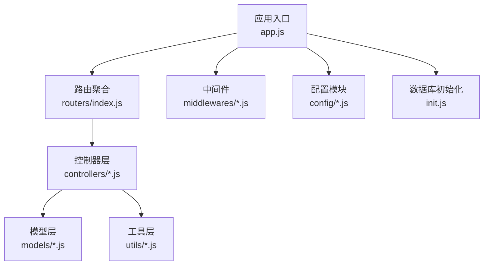
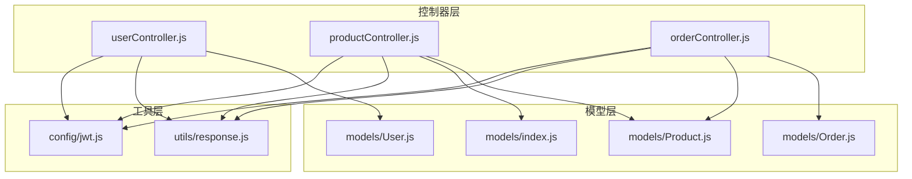
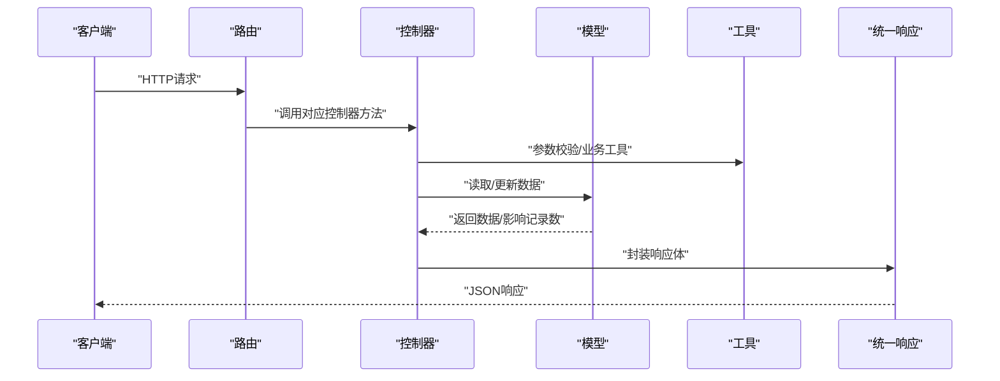
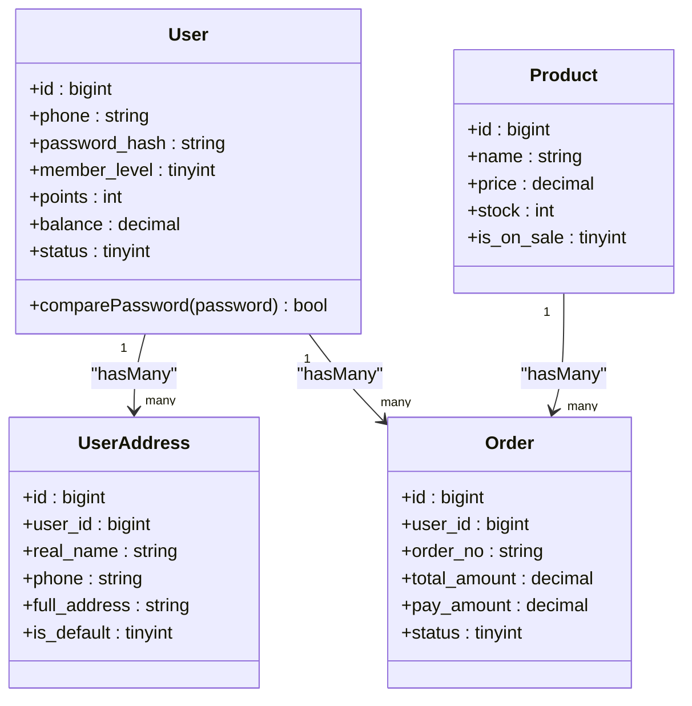
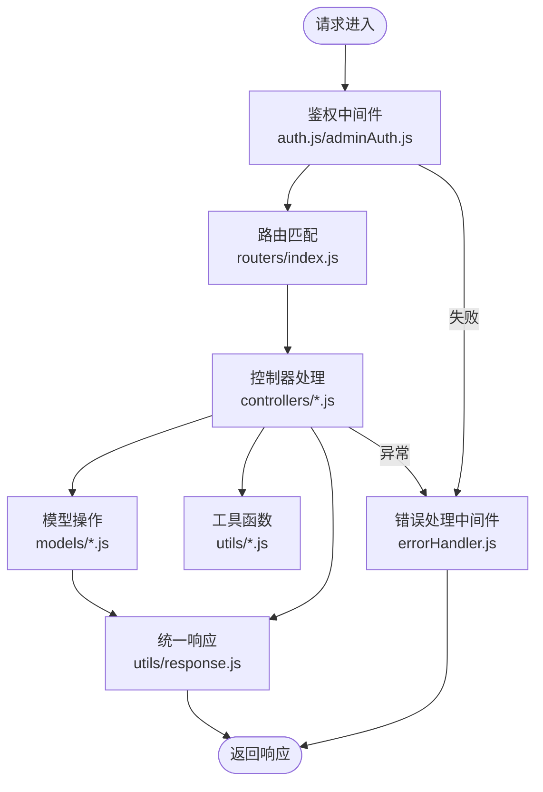
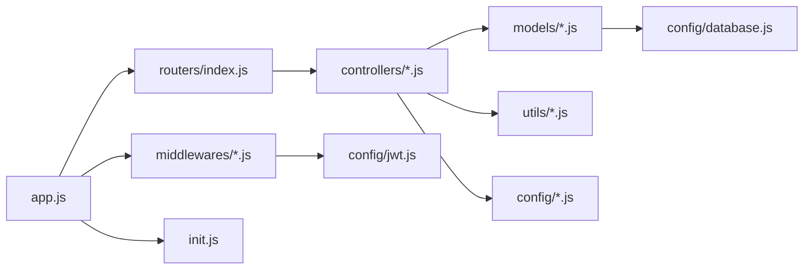

# MVC架构设计

<cite>
**本文档引用的文件**
- [backend/src/app.js](file://backend/src/app.js)
- [backend/src/init.js](file://backend/src/init.js)
- [backend/src/config/database.js](file://backend/src/config/database.js)
- [backend/src/config/jwt.js](file://backend/src/config/jwt.js)
- [backend/src/config/constants.js](file://backend/src/config/constants.js)
- [backend/src/middlewares/auth.js](file://backend/src/middlewares/auth.js)
- [backend/src/middlewares/adminAuth.js](file://backend/src/middlewares/adminAuth.js)
- [backend/src/middlewares/errorHandler.js](file://backend/src/middlewares/errorHandler.js)
- [backend/src/routers/index.js](file://backend/src/routers/index.js)
- [backend/src/controllers/userController.js](file://backend/src/controllers/userController.js)
- [backend/src/controllers/productController.js](file://backend/src/controllers/productController.js)
- [backend/src/controllers/orderController.js](file://backend/src/controllers/orderController.js)
- [backend/src/utils/response.js](file://backend/src/utils/response.js)
- [backend/src/models/User.js](file://backend/src/models/User.js)
- [backend/src/models/index.js](file://backend/src/models/index.js)
- [backend/package.json](file://backend/package.json)
</cite>

## 目录
1. [引言](#引言)
2. [项目结构](#项目结构)
3. [核心组件](#核心组件)
4. [架构总览](#架构总览)
5. [详细组件分析](#详细组件分析)
6. [依赖分析](#依赖分析)
7. [性能考虑](#性能考虑)
8. [故障排除指南](#故障排除指南)
9. [结论](#结论)
10. [附录](#附录)

## 引言
本文件系统性梳理并阐述该MVC架构项目的实现原理与设计原则，覆盖控制器层的职责划分、模型层的数据抽象、视图层的渲染策略、服务层的业务封装，以及MVC各层之间的交互模式（依赖注入、事件传递、错误传播）。同时提供代码组织最佳实践、命名规范与模块化设计建议，帮助开发者快速理解并高效维护系统。

## 项目结构
后端采用Express框架，按MVC分层组织，结合中间件、工具函数与配置模块，形成清晰的层次化架构：
- 应用入口与安全中间件：app.js
- 数据库初始化与同步：init.js
- 配置模块：database.js（数据库）、jwt.js（鉴权）、constants.js（常量）
- 中间件：auth.js（用户鉴权）、adminAuth.js（管理员鉴权）、errorHandler.js（错误处理）
- 路由聚合：routers/index.js
- 控制器：controllers/*（用户、商品、订单等）
- 模型：models/*（Sequelize定义与关联）
- 工具：utils/*（统一响应、安全、业务工具）
- 包管理：package.json

图表来源
- [backend/src/app.js:1-84](file://backend/src/app.js#L1-L84)
- [backend/src/routers/index.js:1-27](file://backend/src/routers/index.js#L1-L27)
- [backend/src/controllers/userController.js:1-409](file://backend/src/controllers/userController.js#L1-L409)
- [backend/src/models/index.js:1-92](file://backend/src/models/index.js#L1-L92)
- [backend/src/utils/response.js:1-32](file://backend/src/utils/response.js#L1-L32)
- [backend/src/middlewares/auth.js:1-181](file://backend/src/middlewares/auth.js#L1-L181)
- [backend/src/config/database.js:1-56](file://backend/src/config/database.js#L1-L56)
- [backend/src/init.js:1-502](file://backend/src/init.js#L1-L502)

章节来源
- [backend/src/app.js:1-84](file://backend/src/app.js#L1-L84)
- [backend/src/routers/index.js:1-27](file://backend/src/routers/index.js#L1-L27)
- [backend/package.json:1-50](file://backend/package.json#L1-L50)

## 核心组件
- 应用入口与启动流程：集中于app.js，负责中间件装载、静态资源服务、路由挂载、数据库连接与初始化、错误处理与启动监听。
- 数据库配置与连接：database.js根据环境变量选择SQLite或MySQL，统一Sequelize实例与表命名策略。
- 鉴权与授权：auth.js处理用户JWT校验与用户状态检查；adminAuth.js处理管理员令牌与角色校验。
- 统一响应格式：utils/response.js提供success/error/paginate三种响应封装。
- 模型与关联：models/index.js集中导入并定义多对多/一对多关联，User/Order/Product等核心模型定义字段与钩子。
- 控制器：按功能域拆分控制器，如userController、productController、orderController，承担请求处理、参数校验、调用模型与返回响应。

章节来源
- [backend/src/app.js:1-84](file://backend/src/app.js#L1-L84)
- [backend/src/config/database.js:1-56](file://backend/src/config/database.js#L1-L56)
- [backend/src/middlewares/auth.js:1-181](file://backend/src/middlewares/auth.js#L1-L181)
- [backend/src/middlewares/adminAuth.js:1-77](file://backend/src/middlewares/adminAuth.js#L1-L77)
- [backend/src/utils/response.js:1-32](file://backend/src/utils/response.js#L1-L32)
- [backend/src/models/index.js:1-92](file://backend/src/models/index.js#L1-L92)
- [backend/src/models/User.js:1-150](file://backend/src/models/User.js#L1-L150)

## 架构总览
MVC架构在本项目中的体现：
- Model（模型）：基于Sequelize ORM，定义数据结构、字段约束、钩子与关联关系，屏蔽底层数据库差异。
- View（视图）：本项目为API服务，不包含传统Web视图层；响应体作为“视图”输出给前端。
- Controller（控制器）：接收HTTP请求，解析参数，调用模型与工具，组装统一响应。

图表来源
- [backend/src/controllers/userController.js:1-409](file://backend/src/controllers/userController.js#L1-L409)
- [backend/src/controllers/productController.js:1-200](file://backend/src/controllers/productController.js#L1-L200)
- [backend/src/controllers/orderController.js:1-200](file://backend/src/controllers/orderController.js#L1-L200)
- [backend/src/models/User.js:1-150](file://backend/src/models/User.js#L1-L150)
- [backend/src/models/index.js:1-92](file://backend/src/models/index.js#L1-L92)
- [backend/src/utils/response.js:1-32](file://backend/src/utils/response.js#L1-L32)
- [backend/src/config/jwt.js:1-41](file://backend/src/config/jwt.js#L1-L41)

## 详细组件分析

### 控制器层职责划分
- 请求处理：解析路由参数与查询参数，进行基础校验（如ID合法性、必填项），调用模型层读写数据。
- 业务逻辑协调：在控制器内组合多个模型操作（如订单创建时校验地址、库存、优惠券、计算金额），保证事务一致性。
- 响应格式化：统一使用utils/response.js输出success/error/paginate，确保前后端契约一致。

图表来源
- [backend/src/routers/index.js:1-27](file://backend/src/routers/index.js#L1-L27)
- [backend/src/controllers/userController.js:1-409](file://backend/src/controllers/userController.js#L1-L409)
- [backend/src/utils/response.js:1-32](file://backend/src/utils/response.js#L1-L32)

章节来源
- [backend/src/controllers/userController.js:1-409](file://backend/src/controllers/userController.js#L1-L409)
- [backend/src/controllers/productController.js:1-200](file://backend/src/controllers/productController.js#L1-L200)
- [backend/src/controllers/orderController.js:1-200](file://backend/src/controllers/orderController.js#L1-L200)
- [backend/src/utils/response.js:1-32](file://backend/src/utils/response.js#L1-L32)

### 模型层数据抽象
- Sequelize模型定义：每个领域对象对应一个模型文件，定义字段类型、约束与注释，统一createdAt/updatedAt命名风格。
- 关联关系：models/index.js集中定义一对多/多对多关系，便于跨表查询与级联加载。
- 钩子与辅助方法：User模型定义beforeCreate/beforeUpdate钩子自动处理密码哈希，提供comparePassword实例方法。

图表来源
- [backend/src/models/User.js:1-150](file://backend/src/models/User.js#L1-L150)
- [backend/src/models/index.js:1-92](file://backend/src/models/index.js#L1-L92)

章节来源
- [backend/src/models/User.js:1-150](file://backend/src/models/User.js#L1-L150)
- [backend/src/models/index.js:1-92](file://backend/src/models/index.js#L1-L92)

### 视图层渲染策略
- 本项目为API后端，不包含传统Web视图层；响应体作为“视图”输出，遵循统一success/error/paginate格式。
- 静态资源服务：app.js中对/uploads目录提供静态文件服务，便于图片与上传资源访问。

章节来源
- [backend/src/app.js:47-47](file://backend/src/app.js#L47-L47)
- [backend/src/utils/response.js:1-32](file://backend/src/utils/response.js#L1-L32)

### 服务层业务封装
- 本项目未显式拆分独立的服务层文件夹，但业务逻辑集中在控制器中，形成“薄控制器、厚模型”的设计思路。
- 建议：将复杂业务逻辑抽取为独立服务模块（如订单服务、支付服务），控制器仅编排调用，提升可测试性与复用性。

章节来源
- [backend/src/controllers/orderController.js:1-200](file://backend/src/controllers/orderController.js#L1-L200)
- [backend/src/controllers/productController.js:1-200](file://backend/src/controllers/productController.js#L1-L200)

### MVC交互模式与错误传播
- 依赖注入：控制器通过require引入模型、工具与配置，形成自上而下的依赖链。
- 事件传递：中间件在请求链路中传递用户上下文（req.user/req.admin），供后续控制器使用。
- 错误传播：全局错误处理器捕获异常并统一返回error响应；控制器内部错误通过error工具函数返回。

图表来源
- [backend/src/middlewares/auth.js:1-181](file://backend/src/middlewares/auth.js#L1-L181)
- [backend/src/middlewares/adminAuth.js:1-77](file://backend/src/middlewares/adminAuth.js#L1-L77)
- [backend/src/routers/index.js:1-27](file://backend/src/routers/index.js#L1-L27)
- [backend/src/controllers/userController.js:1-409](file://backend/src/controllers/userController.js#L1-L409)
- [backend/src/utils/response.js:1-32](file://backend/src/utils/response.js#L1-L32)
- [backend/src/middlewares/errorHandler.js](file://backend/src/middlewares/errorHandler.js)

## 依赖分析
- Express应用：app.js集中装载中间件、路由、静态资源与错误处理。
- 数据库：database.js统一配置Sequelize，init.js在开发环境执行同步与初始化。
- 鉴权：jwt.js提供令牌生成与校验；auth.js/adminAuth.js分别处理用户与管理员鉴权。
- 控制器依赖：控制器依赖模型、工具与配置，形成清晰的单向依赖。
- 包管理：package.json声明Express、Sequelize、JWT、Bcrypt等核心依赖。

图表来源
- [backend/src/app.js:1-84](file://backend/src/app.js#L1-L84)
- [backend/src/routers/index.js:1-27](file://backend/src/routers/index.js#L1-L27)
- [backend/src/controllers/userController.js:1-409](file://backend/src/controllers/userController.js#L1-L409)
- [backend/src/models/index.js:1-92](file://backend/src/models/index.js#L1-L92)
- [backend/src/config/database.js:1-56](file://backend/src/config/database.js#L1-L56)
- [backend/src/config/jwt.js:1-41](file://backend/src/config/jwt.js#L1-L41)
- [backend/src/init.js:1-502](file://backend/src/init.js#L1-L502)

章节来源
- [backend/src/app.js:1-84](file://backend/src/app.js#L1-L84)
- [backend/src/config/database.js:1-56](file://backend/src/config/database.js#L1-L56)
- [backend/src/config/jwt.js:1-41](file://backend/src/config/jwt.js#L1-L41)
- [backend/src/init.js:1-502](file://backend/src/init.js#L1-L502)
- [backend/src/package.json:1-50](file://backend/src/package.json#L1-L50)

## 性能考虑
- 数据库连接池：database.js配置pool.max/min/idle/acquire，避免高并发下的连接争用。
- 查询优化：控制器中合理使用include、limit、offset与索引字段（如status、deleted_at），减少N+1查询。
- 缓存策略：可引入Redis缓存热点数据（如商品详情、分类列表）与会话令牌，降低数据库压力。
- 日志与监控：app.js集成Morgan与Winston，建议结合采样与异步日志，避免I/O阻塞。
- 静态资源：/uploads目录静态服务，建议配合CDN与压缩策略提升加载速度。

## 故障排除指南
- 认证失败：检查Authorization头格式（Bearer Token）、JWT密钥配置与令牌有效期；查看auth.js/adminAuth.js日志。
- 数据库连接：确认.env中DB_*变量、数据库服务可用性；init.js在开发环境自动sync与初始化。
- 响应格式异常：统一使用utils/response.js，若出现格式不一致，检查控制器是否直接res.json。
- 参数校验：控制器中对ID、状态等进行显式校验，避免SQL注入与非法状态变更。

章节来源
- [backend/src/middlewares/auth.js:1-181](file://backend/src/middlewares/auth.js#L1-L181)
- [backend/src/middlewares/adminAuth.js:1-77](file://backend/src/middlewares/adminAuth.js#L1-L77)
- [backend/src/utils/response.js:1-32](file://backend/src/utils/response.js#L1-L32)
- [backend/src/init.js:1-502](file://backend/src/init.js#L1-L502)

## 结论
本项目以Express为核心，构建了清晰的MVC分层架构：控制器专注请求编排与业务编排，模型层通过Sequelize实现数据抽象与关联映射，工具层提供统一响应与安全能力，中间件贯穿认证与错误处理。建议在保持现有结构的基础上，进一步抽取服务层、引入缓存与监控、完善单元测试，持续提升系统的可维护性与扩展性。

## 附录
- 代码组织最佳实践
  - 文件命名：控制器使用名词复数形式（如userController.js），模型使用首字母大写（如User.js）。
  - 模块导出：控制器导出方法集合，路由按功能域拆分并聚合。
  - 常量与配置：constants.js集中管理枚举与默认值，config/*.js集中管理外部依赖配置。
- 命名规范
  - 字段命名：采用下划线命名（underscored），createdAt/updatedAt统一。
  - 方法命名：控制器方法语义明确（如getProducts/createOrder），工具函数纯函数化。
- 模块化设计原则
  - 单一职责：每个控制器聚焦单一资源或业务域。
  - 可测试性：将复杂逻辑下沉至服务模块，控制器仅编排。
  - 可扩展性：通过中间件与配置模块解耦横切关注点（鉴权、限流、日志）。