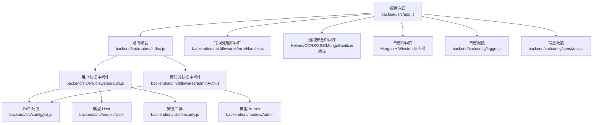
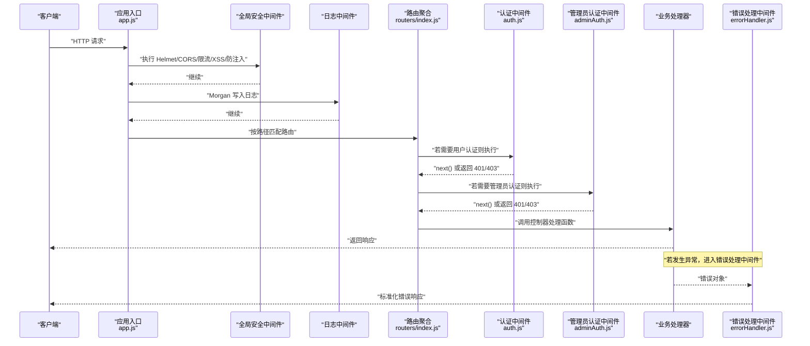
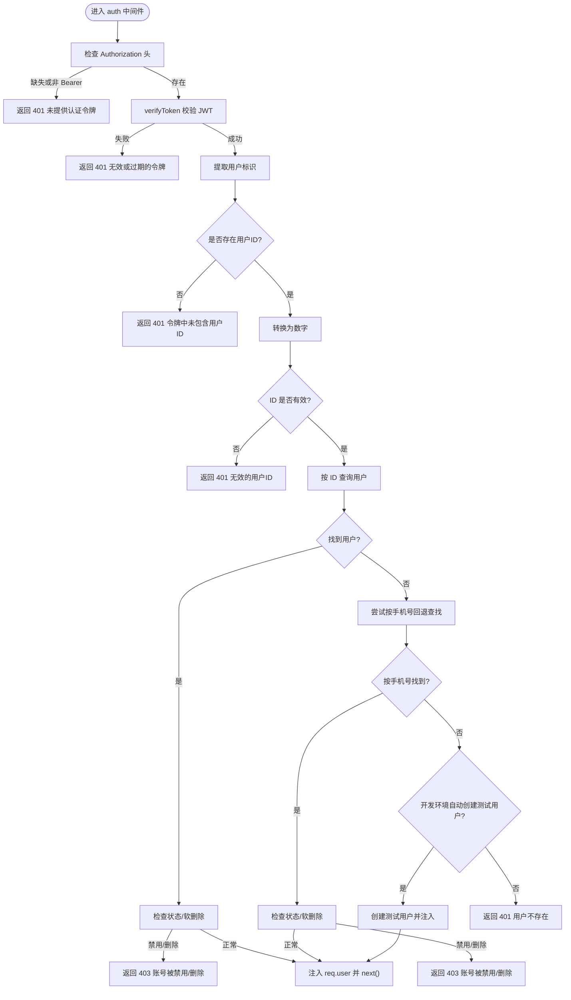
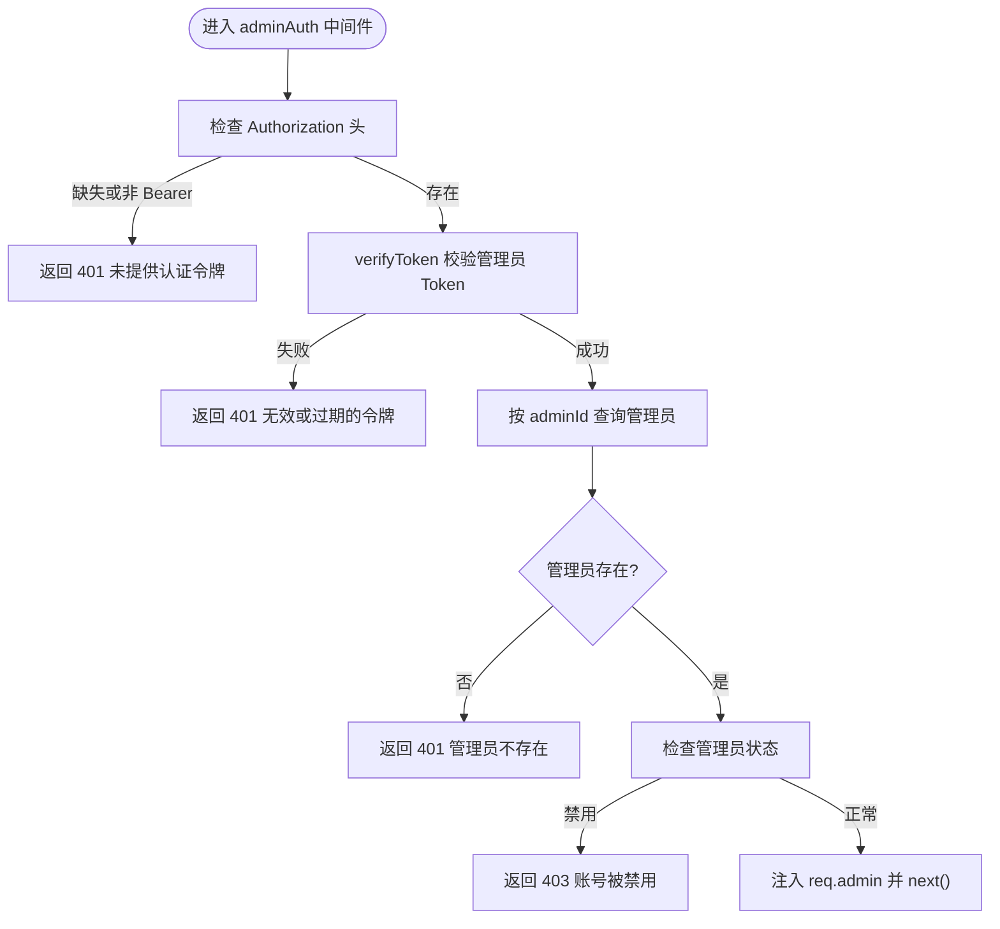
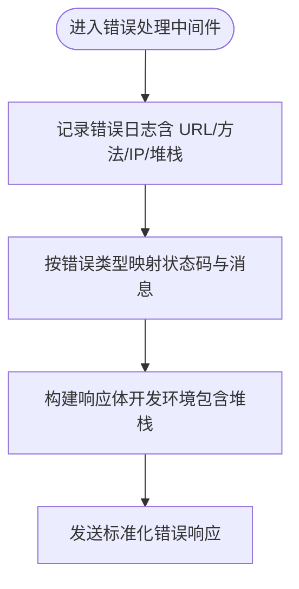
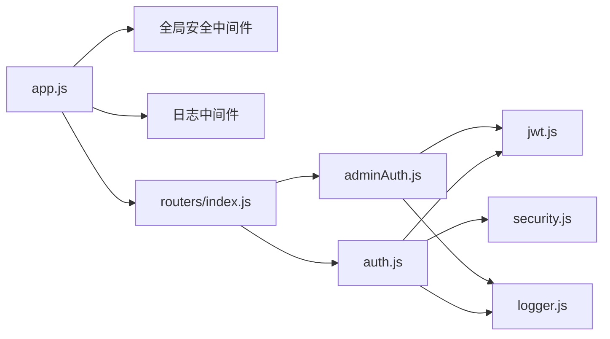

# 中间件开发

<cite>
**本文引用的文件**   
- [backend/src/app.js](file://backend/src/app.js)
- [backend/src/middlewares/auth.js](file://backend/src/middlewares/auth.js)
- [backend/src/middlewares/adminAuth.js](file://backend/src/middlewares/adminAuth.js)
- [backend/src/middlewares/errorHandler.js](file://backend/src/middlewares/errorHandler.js)
- [backend/src/config/jwt.js](file://backend/src/config/jwt.js)
- [backend/src/config/logger.js](file://backend/src/config/logger.js)
- [backend/src/config/constants.js](file://backend/src/config/constants.js)
- [backend/src/routers/index.js](file://backend/src/routers/index.js)
- [backend/src/utils/security.js](file://backend/src/utils/security.js)
</cite>

## 目录
1. [引言](#引言)
2. [项目结构](#项目结构)
3. [核心组件](#核心组件)
4. [架构总览](#架构总览)
5. [详细组件分析](#详细组件分析)
6. [依赖关系分析](#依赖关系分析)
7. [性能考量](#性能考量)
8. [故障排查指南](#故障排查指南)
9. [结论](#结论)
10. [附录](#附录)

## 引言
本技术文档面向中间件开发，围绕 Express 应用中的中间件工作原理与执行顺序展开，系统讲解请求拦截、响应处理与错误传播机制。文档结合项目现有中间件实现，深入剖析认证中间件、管理员认证中间件、错误处理中间件与安全工具模块，并给出自定义中间件（同步与异步）的开发方法、常见中间件类型（认证、日志、CORS、安全）的实现要点、中间件组合与复用策略（条件与动态）、错误处理最佳实践、测试方法以及性能优化与调试技巧。

## 项目结构
后端采用模块化组织，核心入口应用文件负责全局中间件注册与路由挂载；认证与管理员认证中间件分别处理用户与后台用户的鉴权；错误处理中间件统一捕获异常并输出标准化响应；配置模块提供 JWT、日志与常量等支撑；安全工具模块提供加密与脱敏能力；路由模块集中管理各业务模块路由。

图表来源
- [backend/src/app.js:1-84](file://backend/src/app.js#L1-L84)
- [backend/src/routers/index.js:1-27](file://backend/src/routers/index.js#L1-L27)
- [backend/src/middlewares/auth.js:1-181](file://backend/src/middlewares/auth.js#L1-L181)
- [backend/src/middlewares/adminAuth.js:1-77](file://backend/src/middlewares/adminAuth.js#L1-L77)
- [backend/src/middlewares/errorHandler.js:1-47](file://backend/src/middlewares/errorHandler.js#L1-L47)
- [backend/src/config/jwt.js:1-41](file://backend/src/config/jwt.js#L1-L41)
- [backend/src/config/logger.js:1-52](file://backend/src/config/logger.js#L1-L52)
- [backend/src/config/constants.js:1-132](file://backend/src/config/constants.js#L1-L132)
- [backend/src/utils/security.js:1-48](file://backend/src/utils/security.js#L1-L48)

章节来源
- [backend/src/app.js:1-84](file://backend/src/app.js#L1-L84)
- [backend/src/routers/index.js:1-27](file://backend/src/routers/index.js#L1-L27)

## 核心组件
- 应用入口与全局中间件
  - 全局安全与防护：Helmet、CORS、XSS 清理、Mongo 注入清理、速率限制。
  - 请求体解析：JSON 与 URL 编码，设置大小限制。
  - 日志：Morgan 输出到 Winston 文件流。
  - 路由挂载：以 API 前缀挂载路由。
  - 未匹配路由与错误处理：notFoundHandler、errorHandler。
- 认证中间件
  - 必需认证：从 Authorization 头提取 Bearer Token，校验 JWT，查询用户并注入 req.user。
  - 可选认证：仅在存在有效 Token 且用户可用时注入 req.user。
- 管理员认证中间件
  - 必需管理员认证：校验管理员 Token 并检查状态。
  - 角色控制：超级管理员放行，其他角色进行白名单校验。
- 错误处理中间件
  - 统一记录错误日志（含 URL、方法、IP、堆栈）。
  - 按错误类型映射标准 HTTP 状态码与消息。
  - 开发环境返回堆栈，生产环境隐藏细节。
- 安全与日志
  - JWT 配置：签名密钥、过期时间、刷新密钥与刷新过期时间。
  - 日志器：Winston 多文件输出，支持错误、访问、综合日志。
  - 安全工具：AES 加解密、手机号/姓名/身份证/邮箱脱敏。

章节来源
- [backend/src/app.js:1-84](file://backend/src/app.js#L1-L84)
- [backend/src/middlewares/auth.js:1-181](file://backend/src/middlewares/auth.js#L1-L181)
- [backend/src/middlewares/adminAuth.js:1-77](file://backend/src/middlewares/adminAuth.js#L1-L77)
- [backend/src/middlewares/errorHandler.js:1-47](file://backend/src/middlewares/errorHandler.js#L1-L47)
- [backend/src/config/jwt.js:1-41](file://backend/src/config/jwt.js#L1-L41)
- [backend/src/config/logger.js:1-52](file://backend/src/config/logger.js#L1-L52)
- [backend/src/utils/security.js:1-48](file://backend/src/utils/security.js#L1-L48)

## 架构总览
Express 中间件遵循“请求进入 -> 自上而下执行 -> 遇到 next() 向下 -> 遇到错误或响应结束”的执行模型。本项目中，全局中间件先于路由执行，随后路由内的中间件（如认证）按注册顺序执行，最后由错误处理中间件统一兜底。

图表来源
- [backend/src/app.js:1-84](file://backend/src/app.js#L1-L84)
- [backend/src/routers/index.js:1-27](file://backend/src/routers/index.js#L1-L27)
- [backend/src/middlewares/auth.js:1-181](file://backend/src/middlewares/auth.js#L1-L181)
- [backend/src/middlewares/adminAuth.js:1-77](file://backend/src/middlewares/adminAuth.js#L1-L77)
- [backend/src/middlewares/errorHandler.js:1-47](file://backend/src/middlewares/errorHandler.js#L1-L47)

## 详细组件分析

### 认证中间件（auth.js）
- 功能要点
  - 从 Authorization 头解析 Bearer Token。
  - 使用 JWT 配置进行校验，提取用户标识。
  - 查询用户模型，排除敏感字段，注入 req.user。
  - 支持软删除与禁用状态检查，必要时回退到按手机号查找或开发环境自动创建测试用户。
  - 可选认证（optionalAuth）仅在 Token 有效且用户可用时注入。
- 执行流程（必需认证）

图表来源
- [backend/src/middlewares/auth.js:1-181](file://backend/src/middlewares/auth.js#L1-L181)
- [backend/src/config/jwt.js:1-41](file://backend/src/config/jwt.js#L1-L41)

章节来源
- [backend/src/middlewares/auth.js:1-181](file://backend/src/middlewares/auth.js#L1-L181)
- [backend/src/config/jwt.js:1-41](file://backend/src/config/jwt.js#L1-L41)

### 管理员认证中间件（adminAuth.js）
- 功能要点
  - 从 Authorization 头解析 Bearer Token，校验管理员 Token。
  - 查询管理员模型并检查状态。
  - 提供 requireRole 高阶中间件，支持超级管理员放行与角色白名单校验。
- 执行流程（管理员认证）

图表来源
- [backend/src/middlewares/adminAuth.js:1-77](file://backend/src/middlewares/adminAuth.js#L1-L77)
- [backend/src/config/jwt.js:1-41](file://backend/src/config/jwt.js#L1-L41)
- [backend/src/config/constants.js:1-132](file://backend/src/config/constants.js#L1-L132)

章节来源
- [backend/src/middlewares/adminAuth.js:1-77](file://backend/src/middlewares/adminAuth.js#L1-L77)
- [backend/src/config/constants.js:1-132](file://backend/src/config/constants.js#L1-L132)

### 错误处理中间件（errorHandler.js）
- 功能要点
  - 使用日志器记录错误上下文（消息、堆栈、URL、方法、IP）。
  - 将常见错误类型映射为标准 HTTP 状态码与消息。
  - 在开发环境返回堆栈，生产环境隐藏细节。
  - 提供 notFoundHandler 处理 404。
- 执行流程（错误处理）

图表来源
- [backend/src/middlewares/errorHandler.js:1-47](file://backend/src/middlewares/errorHandler.js#L1-L47)
- [backend/src/config/logger.js:1-52](file://backend/src/config/logger.js#L1-L52)

章节来源
- [backend/src/middlewares/errorHandler.js:1-47](file://backend/src/middlewares/errorHandler.js#L1-L47)
- [backend/src/config/logger.js:1-52](file://backend/src/config/logger.js#L1-L52)

### 安全与日志（jwt.js、logger.js、security.js）
- JWT 配置：提供生成与校验 Token 的封装，支持主密钥与刷新密钥。
- 日志器：Winston 多文件输出，支持错误、访问、综合日志，控制台输出（非生产）。
- 安全工具：AES 对称加解密与多种字段脱敏（手机号、姓名、身份证、邮箱）。

章节来源
- [backend/src/config/jwt.js:1-41](file://backend/src/config/jwt.js#L1-L41)
- [backend/src/config/logger.js:1-52](file://backend/src/config/logger.js#L1-L52)
- [backend/src/utils/security.js:1-48](file://backend/src/utils/security.js#L1-L48)

## 依赖关系分析
- 中间件耦合与职责
  - 认证中间件依赖 JWT 配置与用户模型；可选认证降低对用户存在的强制要求。
  - 管理员认证中间件依赖 JWT 配置与管理员模型及角色常量。
  - 错误处理中间件依赖日志器，形成统一错误上报与响应格式。
- 外部依赖与集成点
  - Helmet、CORS、XSS 清理、Mongo 注入清理、速率限制、Morgan、Winston。
- 潜在循环依赖
  - 当前结构清晰，中间件之间通过配置与模型间接耦合，未见直接循环依赖。

图表来源
- [backend/src/app.js:1-84](file://backend/src/app.js#L1-L84)
- [backend/src/routers/index.js:1-27](file://backend/src/routers/index.js#L1-L27)
- [backend/src/middlewares/auth.js:1-181](file://backend/src/middlewares/auth.js#L1-L181)
- [backend/src/middlewares/adminAuth.js:1-77](file://backend/src/middlewares/adminAuth.js#L1-L77)
- [backend/src/config/jwt.js:1-41](file://backend/src/config/jwt.js#L1-L41)
- [backend/src/config/logger.js:1-52](file://backend/src/config/logger.js#L1-L52)
- [backend/src/utils/security.js:1-48](file://backend/src/utils/security.js#L1-L48)

章节来源
- [backend/src/app.js:1-84](file://backend/src/app.js#L1-L84)
- [backend/src/routers/index.js:1-27](file://backend/src/routers/index.js#L1-L27)

## 性能考量
- 中间件顺序优化
  - 将高开销中间件（如数据库查询）置于低开销之后，避免对静态资源与无需认证接口造成额外负担。
  - 速率限制与安全中间件应尽量前置，尽早拒绝恶意请求。
- 数据库与缓存
  - 认证中间件涉及数据库查询，建议在用户层引入缓存（如 Redis）存储 Token 与用户信息，减少重复查询。
- 日志与监控
  - 控制日志级别与文件轮转，避免磁盘 IO 抖动；对高频错误进行聚合统计。
- 资源限制
  - 合理设置请求体大小与超时时间，防止内存与连接池耗尽。

## 故障排查指南
- 常见问题定位
  - 401 未提供/无效令牌：检查 Authorization 头格式与 JWT 密钥配置。
  - 403 账号被禁用/删除：检查用户状态与软删除标记。
  - 404 路由不存在：确认路由前缀与路径拼接。
  - 500 服务器内部错误：查看错误日志堆栈，定位具体异常来源。
- 调试技巧
  - 在开发环境开启详细日志与堆栈输出。
  - 使用可选认证中间件在不影响主流程的前提下注入用户上下文，便于联调。
  - 对关键中间件增加日志埋点，记录输入参数与关键分支。

章节来源
- [backend/src/middlewares/errorHandler.js:1-47](file://backend/src/middlewares/errorHandler.js#L1-L47)
- [backend/src/config/logger.js:1-52](file://backend/src/config/logger.js#L1-L52)
- [backend/src/middlewares/auth.js:1-181](file://backend/src/middlewares/auth.js#L1-L181)
- [backend/src/middlewares/adminAuth.js:1-77](file://backend/src/middlewares/adminAuth.js#L1-L77)

## 结论
本项目通过全局安全中间件、认证中间件、管理员认证中间件与统一错误处理中间件，构建了清晰、可扩展的中间件体系。认证中间件兼顾健壮性与开发体验，管理员认证中间件提供细粒度权限控制，错误处理中间件确保异常可控与可观测。建议在生产环境中进一步引入缓存、限流与监控告警，持续优化中间件性能与稳定性。

## 附录
- 自定义中间件开发方法
  - 同步中间件：直接返回或调用 next()，适合轻量逻辑（如头解析、简单校验）。
  - 异步中间件：使用 async/await 或 Promise，适合数据库查询、外部服务调用。
- 常见中间件类型
  - 认证中间件：基于 Token 的用户/管理员身份校验。
  - 日志中间件：统一记录请求与错误信息。
  - CORS 中间件：跨域配置与预检处理。
  - 安全中间件：XSS 清理、Mongo 注入清理、速率限制、Helmet。
- 组合与复用策略
  - 条件中间件：根据请求路径或方法动态启用。
  - 动态中间件：高阶函数返回中间件，注入依赖或配置。
- 测试方法
  - 单元测试：针对中间件逻辑（Token 校验、状态判断）编写断言。
  - 集成测试：通过模拟请求验证中间件链路与错误处理。
- 性能优化与调试
  - 优先级排序、缓存、资源限制与日志分级。
  - 使用日志与监控定位瓶颈，逐步优化关键路径。