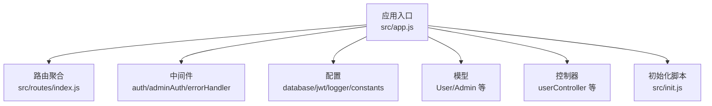
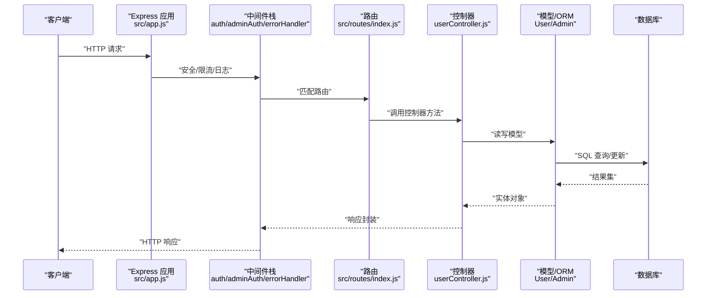
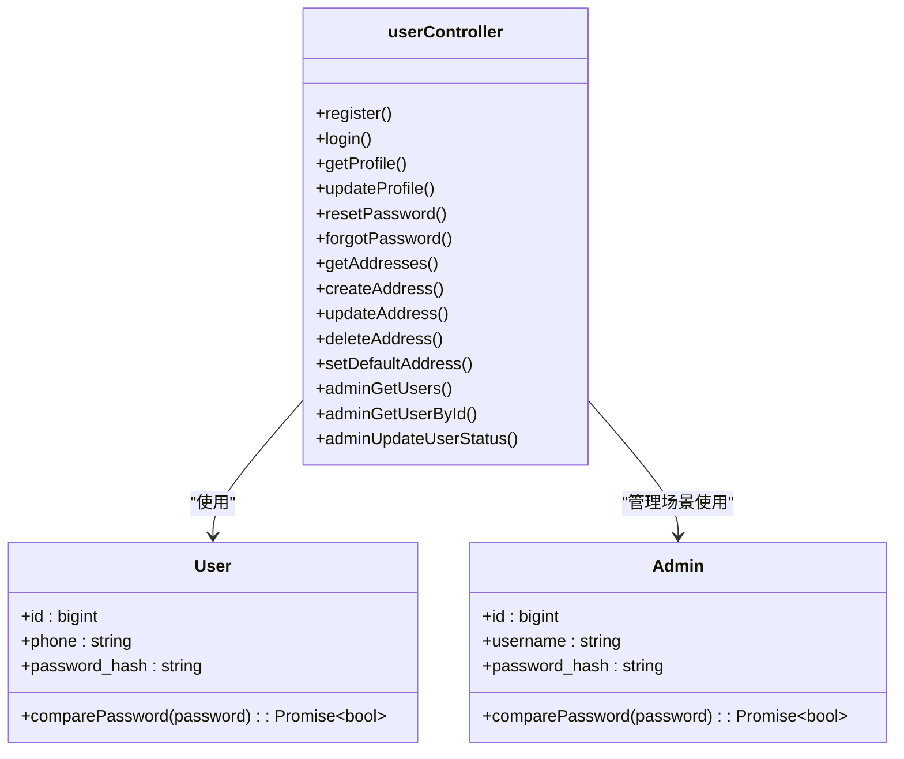
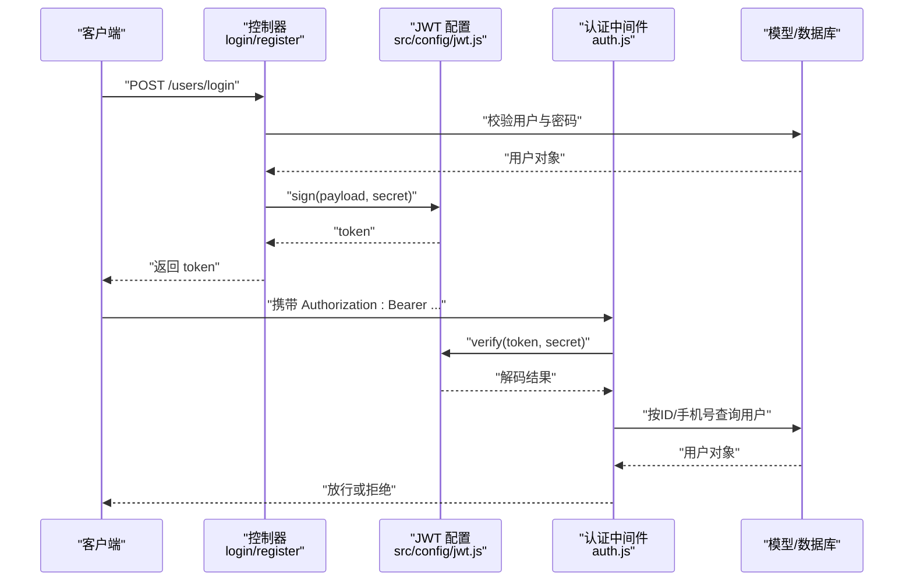
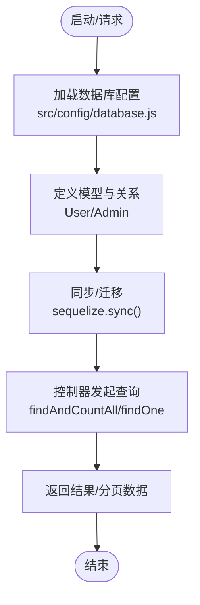
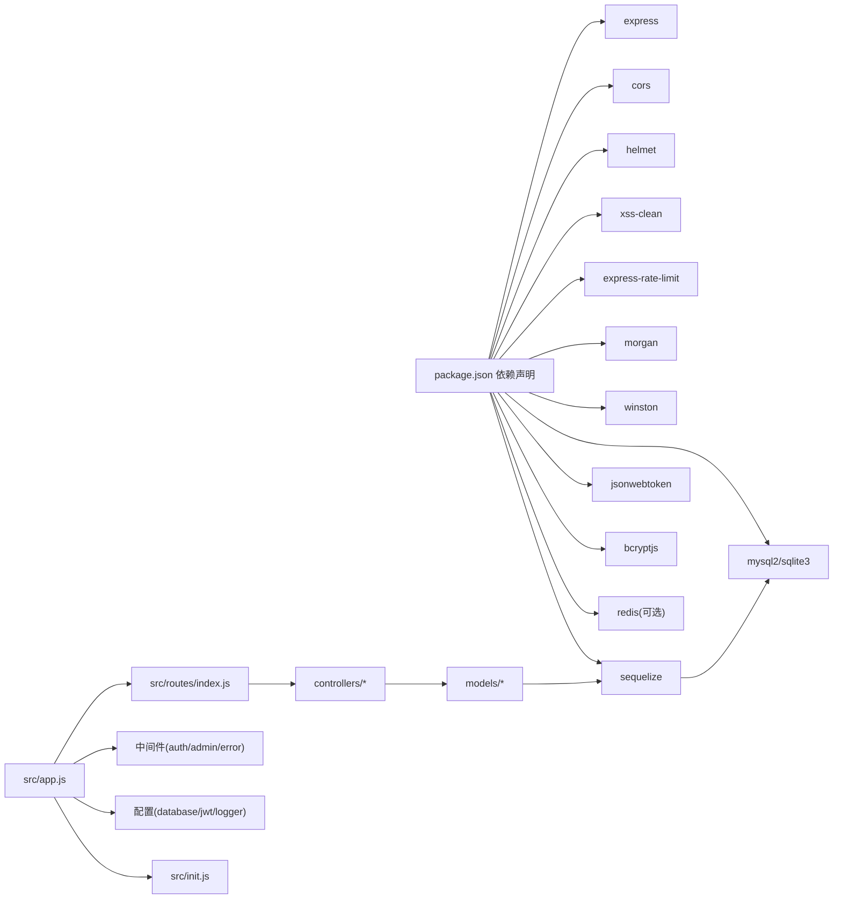

# 后端开发指南

<cite>
**本文引用的文件**
- [backend/src/app.js](file://backend/src/app.js)
- [backend/src/init.js](file://backend/src/init.js)
- [backend/src/config/database.js](file://backend/src/config/database.js)
- [backend/src/config/jwt.js](file://backend/src/config/jwt.js)
- [backend/src/config/logger.js](file://backend/src/config/logger.js)
- [backend/src/middlewares/auth.js](file://backend/src/middlewares/auth.js)
- [backend/src/middlewares/adminAuth.js](file://backend/src/middlewares/adminAuth.js)
- [backend/src/middlewares/errorHandler.js](file://backend/src/middlewares/errorHandler.js)
- [backend/src/routes/index.js](file://backend/src/routes/index.js)
- [backend/src/models/User.js](file://backend/src/models/User.js)
- [backend/src/models/Admin.js](file://backend/src/models/Admin.js)
- [backend/src/controllers/userController.js](file://backend/src/controllers/userController.js)
- [backend/src/utils/security.js](file://backend/src/utils/security.js)
- [backend/src/config/constants.js](file://backend/src/config/constants.js)
- [backend/package.json](file://backend/package.json)
</cite>

## 目录
1. [简介](#简介)
2. [项目结构](#项目结构)
3. [核心组件](#核心组件)
4. [架构总览](#架构总览)
5. [组件详解](#组件详解)
6. [依赖关系分析](#依赖关系分析)
7. [性能与优化](#性能与优化)
8. [故障排查指南](#故障排查指南)
9. [结论](#结论)
10. [附录](#附录)

## 简介
本指南面向趣配鲜后端团队，系统讲解基于 Express.js 的服务架构与开发实践，涵盖中间件体系、路由管理、MVC 设计、JWT 认证、Sequelize ORM 使用、数据库连接池与事务、中间件开发、API 版本与兼容、安全加固、性能优化与可观测性配置。文档以仓库现有实现为依据，提供可操作的开发与运维建议。

## 项目结构
后端采用模块化分层组织：
- 配置层：数据库、JWT、日志、常量等
- 中间件层：认证、管理员认证、错误处理
- 路由层：按业务域划分的路由聚合
- 控制器层：业务接口实现
- 模型层：Sequelize 定义与钩子
- 工具与通用模块：安全工具、响应封装等
- 启动与初始化：应用启动、数据库初始化

图表来源
- [backend/src/app.js:1-84](file://backend/src/app.js#L1-L84)
- [backend/src/routes/index.js:1-27](file://backend/src/routes/index.js#L1-L27)

章节来源
- [backend/src/app.js:1-84](file://backend/src/app.js#L1-L84)
- [backend/src/routes/index.js:1-27](file://backend/src/routes/index.js#L1-L27)

## 核心组件
- 应用入口与中间件栈
  - 安全与防护：Helmet、XSS 清理、Mongo 注入清理、速率限制
  - 日志：Morgan 输出到自定义 Winston 日志器
  - 静态资源：上传目录映射
  - API 前缀与路由挂载
  - 错误与 404 处理
- 数据库与 ORM
  - 支持 SQLite/MySQL 双形态，连接池参数可调
  - 统一时间戳命名与下划线风格
- JWT 与认证
  - 登录签发与校验、管理员鉴权、可选认证
- 初始化脚本
  - 开发环境自动建表与种子数据注入

章节来源
- [backend/src/app.js:19-53](file://backend/src/app.js#L19-L53)
- [backend/src/config/database.js:9-53](file://backend/src/config/database.js#L9-L53)
- [backend/src/config/jwt.js:10-32](file://backend/src/config/jwt.js#L10-L32)
- [backend/src/middlewares/auth.js:4-148](file://backend/src/middlewares/auth.js#L4-L148)
- [backend/src/middlewares/adminAuth.js:5-49](file://backend/src/middlewares/adminAuth.js#L5-L49)
- [backend/src/middlewares/errorHandler.js:3-44](file://backend/src/middlewares/errorHandler.js#L3-L44)
- [backend/src/init.js:5-492](file://backend/src/init.js#L5-L492)

## 架构总览
整体请求处理链路如下：

图表来源
- [backend/src/app.js:19-53](file://backend/src/app.js#L19-L53)
- [backend/src/middlewares/auth.js:4-148](file://backend/src/middlewares/auth.js#L4-L148)
- [backend/src/middlewares/adminAuth.js:5-49](file://backend/src/middlewares/adminAuth.js#L5-L49)
- [backend/src/routes/index.js:11-16](file://backend/src/routes/index.js#L11-L16)
- [backend/src/controllers/userController.js:7-93](file://backend/src/controllers/userController.js#L7-L93)
- [backend/src/models/User.js:131-147](file://backend/src/models/User.js#L131-L147)
- [backend/src/models/Admin.js:77-93](file://backend/src/models/Admin.js#L77-L93)

## 组件详解

### Express 中间件体系
- 安全与防护
  - Helmet 设置安全响应头
  - XSS 清理与 Mongo 注入清理
  - CORS 配置支持跨域与凭据
  - 速率限制窗口与阈值可配置
- 日志
  - Morgan 将访问日志写入自定义 Winston Logger
- 静态资源
  - 上传目录静态映射
- 错误与 404
  - 统一错误处理器与 404 处理器

章节来源
- [backend/src/app.js:19-53](file://backend/src/app.js#L19-L53)
- [backend/src/middlewares/errorHandler.js:3-44](file://backend/src/middlewares/errorHandler.js#L3-L44)

### 路由管理与 API 前缀
- 路由聚合：首页、用户、商品、购物车、订单、后台
- 健康检查端点
- API 前缀可配置，默认 “/api”

章节来源
- [backend/src/routes/index.js:4-26](file://backend/src/routes/index.js#L4-L26)
- [backend/src/app.js:49-50](file://backend/src/app.js#L49-L50)

### MVC 架构实现
- 视图层
  - 本项目为纯 API 服务，无视图层
- 控制器层
  - 示例：用户注册/登录/资料、地址 CRUD、管理员用户管理等
  - 统一响应封装与错误处理
- 模型层
  - 用户与管理员模型定义、密码哈希钩子、辅助方法
  - 统一时间戳字段命名与软删除支持

图表来源
- [backend/src/models/User.js:131-147](file://backend/src/models/User.js#L131-L147)
- [backend/src/models/Admin.js:77-93](file://backend/src/models/Admin.js#L77-L93)
- [backend/src/controllers/userController.js:7-409](file://backend/src/controllers/userController.js#L7-L409)

章节来源
- [backend/src/controllers/userController.js:7-409](file://backend/src/controllers/userController.js#L7-L409)
- [backend/src/models/User.js:131-147](file://backend/src/models/User.js#L131-L147)
- [backend/src/models/Admin.js:77-93](file://backend/src/models/Admin.js#L77-L93)

### JWT 认证机制
- 签发与校验
  - 登录成功后签发访问令牌
  - 中间件从 Authorization 头解析 Bearer 令牌并校验
- 用户与管理员
  - 用户认证中间件支持严格与可选两种模式
  - 管理员认证中间件校验管理员角色与状态
- 令牌回退与容错
  - 当按 ID 无法找到用户时，按手机号回退查找
  - 开发环境下可自动创建测试用户

图表来源
- [backend/src/controllers/userController.js:44-93](file://backend/src/controllers/userController.js#L44-L93)
- [backend/src/config/jwt.js:10-32](file://backend/src/config/jwt.js#L10-L32)
- [backend/src/middlewares/auth.js:4-148](file://backend/src/middlewares/auth.js#L4-L148)

章节来源
- [backend/src/config/jwt.js:10-32](file://backend/src/config/jwt.js#L10-L32)
- [backend/src/middlewares/auth.js:4-148](file://backend/src/middlewares/auth.js#L4-L148)
- [backend/src/middlewares/adminAuth.js:5-49](file://backend/src/middlewares/adminAuth.js#L5-L49)

### Sequelize ORM 使用
- 连接配置
  - 支持 SQLite 与 MySQL，统一时间戳命名、下划线风格、冻结表名
  - 连接池参数可配置（最大/最小/空闲/获取超时）
- 模型定义与钩子
  - 用户与管理员模型定义、密码哈希钩子、比较方法
- 查询与分页
  - 控制器示例展示条件查询、分页、排序与聚合统计

图表来源
- [backend/src/config/database.js:9-53](file://backend/src/config/database.js#L9-L53)
- [backend/src/models/User.js:131-147](file://backend/src/models/User.js#L131-L147)
- [backend/src/models/Admin.js:77-93](file://backend/src/models/Admin.js#L77-L93)
- [backend/src/controllers/userController.js:304-343](file://backend/src/controllers/userController.js#L304-L343)

章节来源
- [backend/src/config/database.js:9-53](file://backend/src/config/database.js#L9-L53)
- [backend/src/models/User.js:131-147](file://backend/src/models/User.js#L131-L147)
- [backend/src/models/Admin.js:77-93](file://backend/src/models/Admin.js#L77-L93)
- [backend/src/controllers/userController.js:304-343](file://backend/src/controllers/userController.js#L304-L343)

### 数据库连接池、事务与并发
- 连接池
  - MySQL 连接池参数可调，含最大/最小/空闲/获取超时
- 事务
  - 可在控制器或服务层使用 Sequelize 事务 API 实现一致性
- 并发控制
  - 速率限制中间件与数据库连接池共同承担并发压力

章节来源
- [backend/src/config/database.js:38-43](file://backend/src/config/database.js#L38-L43)
- [backend/src/app.js:32-39](file://backend/src/app.js#L32-L39)

### 中间件开发指南
- 认证中间件
  - 严格认证：必须提供有效令牌且用户状态正常
  - 可选认证：仅在令牌有效时注入用户上下文
- 管理员认证中间件
  - 校验管理员身份、角色与状态
- 错误处理中间件
  - 统一记录错误日志与响应格式
- CORS 配置
  - 支持跨域与凭据，生产环境建议限定来源

章节来源
- [backend/src/middlewares/auth.js:4-148](file://backend/src/middlewares/auth.js#L4-L148)
- [backend/src/middlewares/adminAuth.js:5-49](file://backend/src/middlewares/adminAuth.js#L5-L49)
- [backend/src/middlewares/errorHandler.js:3-44](file://backend/src/middlewares/errorHandler.js#L3-L44)
- [backend/src/app.js:21-24](file://backend/src/app.js#L21-L24)

### API 版本控制与向后兼容
- 版本策略
  - 通过 API 前缀区分版本（如 “/api/v1”），当前路由挂载于 “/api”
- 向后兼容
  - 新增字段建议保持默认值；变更字段需提供迁移脚本与兼容逻辑

章节来源
- [backend/src/app.js:49-50](file://backend/src/app.js#L49-L50)
- [backend/src/routes/index.js:11-16](file://backend/src/routes/index.js#L11-L16)

### 安全配置
- 安全头与防护
  - Helmet、XSS 清理、Mongo 注入清理、速率限制
- 速率限制
  - 窗口与最大请求数可配置
- 加密与脱敏
  - 密码使用 bcrypt 哈希
  - 敏感信息脱敏显示（手机号、姓名、身份证、邮箱）

章节来源
- [backend/src/app.js:19-39](file://backend/src/app.js#L19-L39)
- [backend/src/utils/security.js:16-38](file://backend/src/utils/security.js#L16-L38)
- [backend/src/models/User.js:131-147](file://backend/src/models/User.js#L131-L147)

### 日志记录与监控
- 日志
  - Winston 输出到文件与控制台，支持错误/访问/综合日志分离
- 监控
  - 建议结合外部 APM/指标系统采集 QPS、延迟、错误率与数据库慢查询

章节来源
- [backend/src/config/logger.js:10-49](file://backend/src/config/logger.js#L10-L49)
- [backend/src/app.js:41-45](file://backend/src/app.js#L41-L45)

## 依赖关系分析

图表来源
- [backend/package.json:18-39](file://backend/package.json#L18-L39)
- [backend/src/app.js:11-15](file://backend/src/app.js#L11-L15)
- [backend/src/routes/index.js:4-9](file://backend/src/routes/index.js#L4-L9)

章节来源
- [backend/package.json:18-39](file://backend/package.json#L18-L39)
- [backend/src/app.js:11-15](file://backend/src/app.js#L11-L15)

## 性能与优化
- 数据库查询优化
  - 使用索引覆盖常见查询条件（手机号、昵称、状态）
  - 分页查询避免一次性加载大结果集
- 缓存策略
  - 对热点读取（商品详情、首页数据）引入 Redis 缓存
- 内存管理
  - 合理释放临时对象，避免大对象常驻
- 连接池与并发
  - 根据 QPS 调整连接池大小与超时
- 日志与追踪
  - 结合请求 ID 串联日志，定位慢查询与异常

[本节为通用指导，无需特定文件引用]

## 故障排查指南
- 认证失败
  - 检查 Authorization 头格式与令牌有效性
  - 核对用户状态与是否被拉黑
- 数据库连接失败
  - 校验环境变量与连接参数
  - 开发环境可启用同步与初始化脚本
- 错误日志
  - 查看 Winston 文件与控制台输出
  - 统一错误处理器会记录请求上下文

章节来源
- [backend/src/middlewares/auth.js:4-148](file://backend/src/middlewares/auth.js#L4-L148)
- [backend/src/config/database.js:9-53](file://backend/src/config/database.js#L9-L53)
- [backend/src/middlewares/errorHandler.js:3-44](file://backend/src/middlewares/errorHandler.js#L3-L44)
- [backend/src/config/logger.js:10-49](file://backend/src/config/logger.js#L10-L49)

## 结论
本指南基于现有代码梳理了趣配鲜后端的核心能力：安全中间件栈、路由与控制器分层、JWT 认证、Sequelize ORM、数据库初始化与连接池、统一错误处理与日志。建议在后续迭代中完善事务处理、Redis 缓存、指标监控与 API 版本演进策略，持续提升系统稳定性与可维护性。

## 附录
- 常量与文案
  - 状态码、枚举、品牌文案与页面文案集中管理
- 启动与初始化
  - 开发环境自动建表与种子数据注入

章节来源
- [backend/src/config/constants.js:1-132](file://backend/src/config/constants.js#L1-L132)
- [backend/src/init.js:5-492](file://backend/src/init.js#L5-L492)