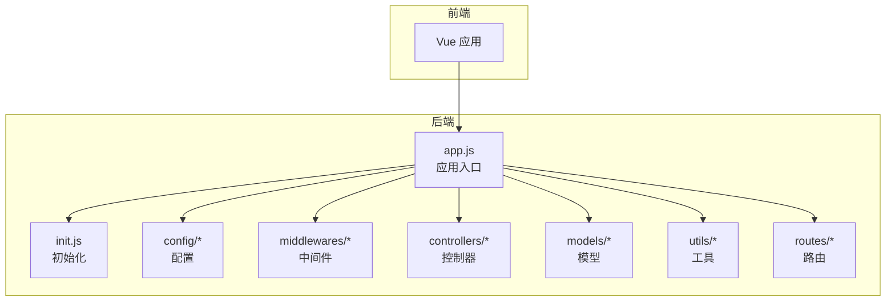
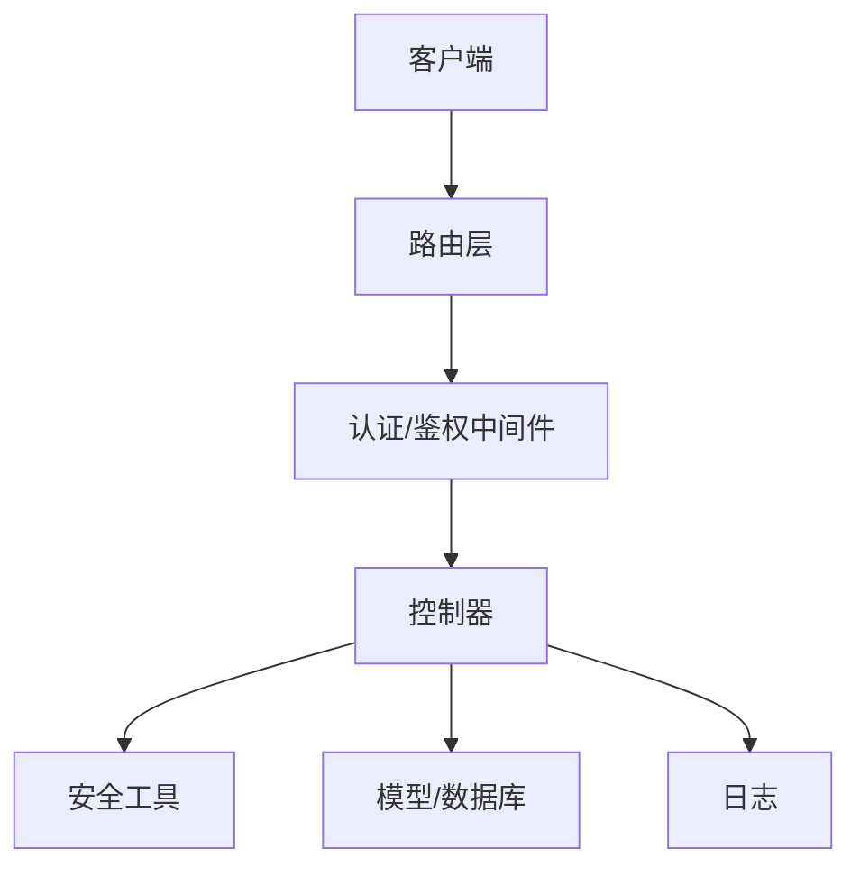
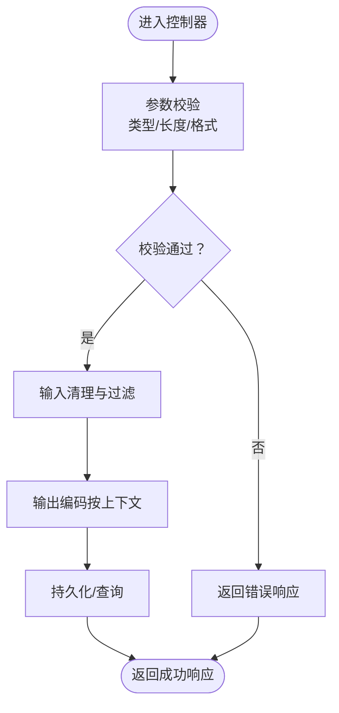
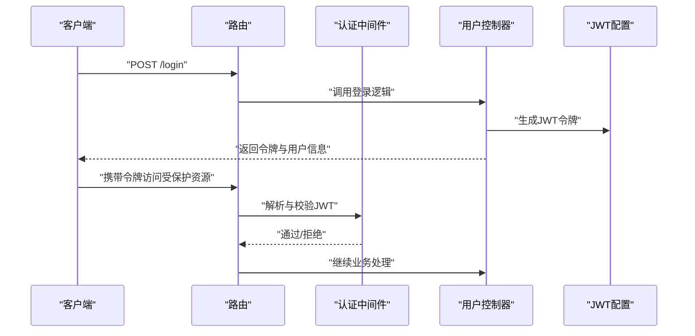
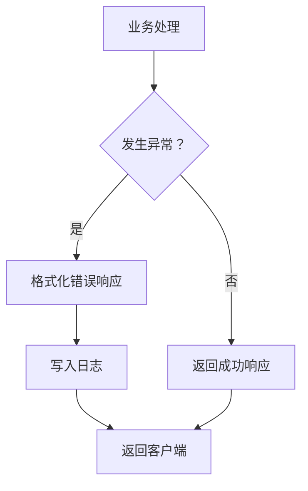
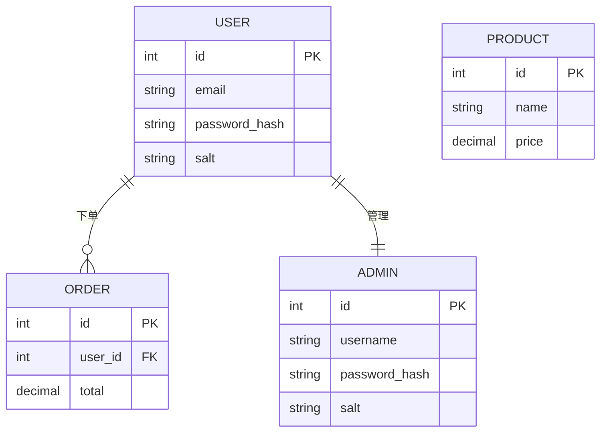
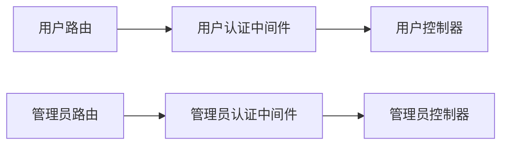
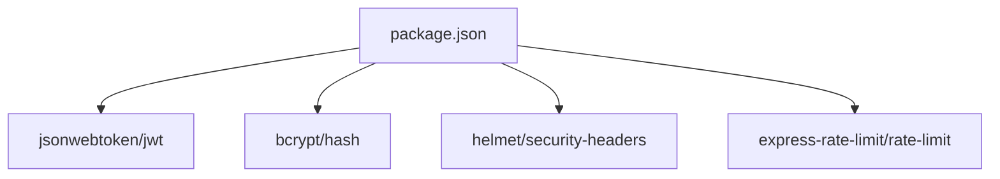

# 安全配置

<cite>
**本文引用的文件**
- [app.js](file://backend/src/app.js)
- [init.js](file://backend/src/init.js)
- [security.js](file://backend/src/utils/security.js)
- [response.js](file://backend/src/utils/response.js)
- [errorHandler.js](file://backend/src/middlewares/errorHandler.js)
- [auth.js](file://backend/src/middlewares/auth.js)
- [adminAuth.js](file://backend/src/middlewares/adminAuth.js)
- [jwt.js](file://backend/src/config/jwt.js)
- [logger.js](file://backend/src/config/logger.js)
- [constants.js](file://backend/src/config/constants.js)
- [userController.js](file://backend/src/controllers/userController.js)
- [adminController.js](file://backend/src/controllers/adminController.js)
- [orderController.js](file://backend/src/controllers/orderController.js)
- [productController.js](file://backend/src/controllers/productController.js)
- [cartController.js](file://backend/src/controllers/cartController.js)
- [couponController.js](file://backend/src/controllers/couponController.js)
- [noticeController.js](file://backend/src/controllers/noticeController.js)
- [bannerController.js](file://backend/src/controllers/bannerController.js)
- [recipeController.js](file://backend/src/controllers/recipeController.js)
- [settingsController.js](file://backend/src/controllers/settingsController.js)
- [homeController.js](file://backend/src/controllers/homeController.js)
- [userRoutes.js](file://backend/src/routes/userRoutes.js)
- [adminRoutes.js](file://backend/src/routes/adminRoutes.js)
- [orderRoutes.js](file://backend/src/routes/orderRoutes.js)
- [productRoutes.js](file://backend/src/routes/productRoutes.js)
- [cartRoutes.js](file://backend/src/routes/cartRoutes.js)
- [couponRoutes.js](file://backend/src/routes/couponRoutes.js)
- [noticeRoutes.js](file://backend/src/routes/noticeRoutes.js)
- [bannerRoutes.js](file://backend/src/routes/bannerRoutes.js)
- [recipeRoutes.js](file://backend/src/routes/recipeRoutes.js)
- [homeRoutes.js](file://backend/src/routes/homeRoutes.js)
- [User.js](file://backend/src/models/User.js)
- [Admin.js](file://backend/src/models/Admin.js)
- [Order.js](file://backend/src/models/Order.js)
- [Product.js](file://backend/src/models/Product.js)
- [Cart.js](file://backend/src/models/Cart.js)
- [Coupon.js](file://backend/src/models/Coupon.js)
- [Notice.js](file://backend/src/models/Notice.js)
- [Banner.js](file://backend/src/models/Banner.js)
- [Recipe.js](file://backend/src/models/Recipe.js)
- [check_users.js](file://backend/scripts/check_users.js)
- [reset-admin-password.js](file://backend/scripts/reset-admin-password.js)
- [package.json](file://backend/package.json)
- [schema.sql](file://database/schema.sql)
</cite>

## 目录
1. [引言](#引言)
2. [项目结构](#项目结构)
3. [核心组件](#核心组件)
4. [架构总览](#架构总览)
5. [详细组件分析](#详细组件分析)
6. [依赖分析](#依赖分析)
7. [性能考虑](#性能考虑)
8. [故障排除指南](#故障排除指南)
9. [结论](#结论)
10. [附录](#附录)

## 引言
本文件面向Web应用安全配置，结合后端代码库现状，系统梳理常见安全威胁（XSS、SQL注入、CSRF、点击劫持）与防护策略，重点覆盖Helmet安全头、输入验证与输出编码、速率限制与防暴力破解、敏感数据保护、安全审计与漏洞扫描以及安全事件响应流程。由于当前仓库中未发现显式的Helmet中间件或统一的安全头配置实现，本文在“现有实现”基础上提出可落地的加固建议，并通过图示帮助读者理解安全机制在系统中的位置与交互。

## 项目结构
后端采用模块化分层设计：入口文件负责初始化应用与路由挂载；中间件层提供认证、鉴权与错误处理；控制器层承载业务逻辑；模型层定义数据结构；工具层封装通用能力（如安全、响应格式化等）。前端为Vue单页应用，通过API与后端交互。

**图表来源**
- [app.js](file://backend/src/app.js)
- [init.js](file://backend/src/init.js)
- [userRoutes.js](file://backend/src/routes/userRoutes.js)
- [adminRoutes.js](file://backend/src/routes/adminRoutes.js)

**章节来源**
- [app.js](file://backend/src/app.js)
- [init.js](file://backend/src/init.js)

## 核心组件
- 安全工具：封装通用安全能力（如输入清理、输出编码建议等），为控制器与服务层提供统一接口。
- 中间件：认证与鉴权（用户/管理员）、错误处理。
- 配置：JWT密钥与过期时间、日志记录、常量定义。
- 控制器：业务处理单元，需严格进行输入校验与输出编码。
- 模型：数据库实体定义，需配合参数化查询防止SQL注入。
- 路由：暴露API端点，应结合中间件实现访问控制。

**章节来源**
- [security.js](file://backend/src/utils/security.js)
- [auth.js](file://backend/src/middlewares/auth.js)
- [adminAuth.js](file://backend/src/middlewares/adminAuth.js)
- [jwt.js](file://backend/src/config/jwt.js)
- [logger.js](file://backend/src/config/logger.js)
- [constants.js](file://backend/src/config/constants.js)
- [userController.js](file://backend/src/controllers/userController.js)
- [adminController.js](file://backend/src/controllers/adminController.js)

## 架构总览
下图展示安全相关组件在请求生命周期中的交互关系，强调从路由到控制器、再到模型与数据库的链路中各环节的安全职责。

**图表来源**
- [userRoutes.js](file://backend/src/routes/userRoutes.js)
- [auth.js](file://backend/src/middlewares/auth.js)
- [adminAuth.js](file://backend/src/middlewares/adminAuth.js)
- [userController.js](file://backend/src/controllers/userController.js)
- [security.js](file://backend/src/utils/security.js)
- [logger.js](file://backend/src/config/logger.js)

## 详细组件分析

### 输入验证与输出编码
- 输入验证：控制器接收参数后应进行类型、长度、范围与格式校验；对用户可控输入执行白名单过滤或严格模式校验。
- 输出编码：向模板或响应体输出前，确保对HTML、JS、CSS、URL等上下文进行相应转义，避免XSS。
- 数据清理：去除多余空白、标准化换行、过滤危险字符，必要时使用参数化查询或ORM安全方法。

**图表来源**
- [userController.js](file://backend/src/controllers/userController.js)
- [security.js](file://backend/src/utils/security.js)
- [response.js](file://backend/src/utils/response.js)

**章节来源**
- [userController.js](file://backend/src/controllers/userController.js)
- [security.js](file://backend/src/utils/security.js)
- [response.js](file://backend/src/utils/response.js)

### 认证与会话管理
- JWT配置：密钥与过期时间在配置中集中管理，避免硬编码；建议使用强随机密钥并定期轮换。
- 用户认证：登录成功签发JWT，后续请求通过中间件解析与校验；失败返回明确错误。
- 管理员鉴权：独立中间件区分管理员权限，防止越权操作。

**图表来源**
- [userRoutes.js](file://backend/src/routes/userRoutes.js)
- [auth.js](file://backend/src/middlewares/auth.js)
- [jwt.js](file://backend/src/config/jwt.js)
- [userController.js](file://backend/src/controllers/userController.js)

**章节来源**
- [auth.js](file://backend/src/middlewares/auth.js)
- [adminAuth.js](file://backend/src/middlewares/adminAuth.js)
- [jwt.js](file://backend/src/config/jwt.js)
- [userController.js](file://backend/src/controllers/userController.js)
- [adminController.js](file://backend/src/controllers/adminController.js)

### 错误处理与日志
- 统一错误处理：捕获异常并格式化响应，避免泄露内部细节；记录错误堆栈与上下文。
- 日志记录：记录关键操作（登录、订单、敏感变更）与异常事件，支持审计与追踪。

**图表来源**
- [errorHandler.js](file://backend/src/middlewares/errorHandler.js)
- [logger.js](file://backend/src/config/logger.js)

**章节来源**
- [errorHandler.js](file://backend/src/middlewares/errorHandler.js)
- [logger.js](file://backend/src/config/logger.js)

### 数据模型与SQL注入防护
- ORM/参数化：模型层应使用参数化查询或ORM安全方法，避免拼接用户输入。
- 字段白名单：仅允许受控字段参与查询，减少注入面。
- 权限隔离：不同角色访问不同表/字段，结合中间件实现。

**图表来源**
- [User.js](file://backend/src/models/User.js)
- [Admin.js](file://backend/src/models/Admin.js)
- [Order.js](file://backend/src/models/Order.js)
- [Product.js](file://backend/src/models/Product.js)

**章节来源**
- [User.js](file://backend/src/models/User.js)
- [Admin.js](file://backend/src/models/Admin.js)
- [Order.js](file://backend/src/models/Order.js)
- [Product.js](file://backend/src/models/Product.js)

### 速率限制与防暴力破解
- 建议策略：基于IP的登录尝试次数限制、时间窗口内的请求频率控制、账户临时锁定与解锁机制。
- 实施方式：可在中间件层引入内存/Redis计数器，超过阈值阻断请求并记录日志。
- 与日志联动：记录异常行为，触发告警与审计。

**章节来源**
- [logger.js](file://backend/src/config/logger.js)
- [errorHandler.js](file://backend/src/middlewares/errorHandler.js)

### 敏感数据保护
- 密码加密：使用强哈希算法与盐值，避免明文存储；定期轮换密钥与策略。
- 传输加密：强制HTTPS，禁用不安全协议；设置安全Cookie属性（HttpOnly、Secure、SameSite）。
- 存储加密：对高敏字段（如身份证号）在数据库层面启用透明数据加密（TDE）或应用层加密。

**章节来源**
- [User.js](file://backend/src/models/User.js)
- [Admin.js](file://backend/src/models/Admin.js)
- [jwt.js](file://backend/src/config/jwt.js)

### 路由与访问控制
- 路由分层：用户路由与管理员路由分离，分别绑定对应鉴权中间件。
- 受保护端点：登录、下单、支付、管理后台等端点必须经过认证与授权。

**图表来源**
- [userRoutes.js](file://backend/src/routes/userRoutes.js)
- [adminRoutes.js](file://backend/src/routes/adminRoutes.js)
- [auth.js](file://backend/src/middlewares/auth.js)
- [adminAuth.js](file://backend/src/middlewares/adminAuth.js)

**章节来源**
- [userRoutes.js](file://backend/src/routes/userRoutes.js)
- [adminRoutes.js](file://backend/src/routes/adminRoutes.js)
- [auth.js](file://backend/src/middlewares/auth.js)
- [adminAuth.js](file://backend/src/middlewares/adminAuth.js)

### 安全审计与漏洞扫描
- 定期检查：代码审查关注输入校验、错误处理、敏感信息处理；数据库权限最小化。
- 渗透测试：模拟XSS、SQL注入、CSRF、点击劫持等攻击路径，验证防护有效性。
- 工具链：结合静态分析（ESLint规则、依赖漏洞扫描）与动态测试（OWASP ZAP、Burp Suite）。

**章节来源**
- [security.js](file://backend/src/utils/security.js)
- [errorHandler.js](file://backend/src/middlewares/errorHandler.js)

### 安全事件响应流程
- 入侵检测：日志监控异常登录、高频请求、敏感操作失败等指标。
- 事件处理：快速定位受影响端点与用户，冻结账户、撤销令牌、回滚风险操作。
- 恢复策略：修复漏洞、更新策略、通知用户、复盘总结与改进。

**章节来源**
- [logger.js](file://backend/src/config/logger.js)
- [errorHandler.js](file://backend/src/middlewares/errorHandler.js)

## 依赖分析
后端依赖通过包管理器声明，建议定期更新以修复已知漏洞；安全相关依赖（如JWT库、加密库）应保持最新版本。

**图表来源**
- [package.json](file://backend/package.json)

**章节来源**
- [package.json](file://backend/package.json)

## 性能考虑
- 中间件顺序：将轻量校验前置，避免无效计算；缓存热点数据减少数据库压力。
- 查询优化：使用索引、分页与投影字段，降低注入风险的同时提升性能。
- 日志异步：避免阻塞请求线程，采用异步写入或批量提交。

## 故障排除指南
- 登录失败：检查JWT密钥一致性、过期时间与客户端存储；确认中间件是否正确解析令牌。
- 参数错误：核对控制器参数校验规则与前端传参格式；查看统一错误响应与日志。
- 权限不足：确认路由绑定的中间件与用户角色；排查模型层权限过滤逻辑。
- 注入风险：确保所有用户输入均经参数化查询或ORM安全方法；避免字符串拼接。

**章节来源**
- [auth.js](file://backend/src/middlewares/auth.js)
- [adminAuth.js](file://backend/src/middlewares/adminAuth.js)
- [errorHandler.js](file://backend/src/middlewares/errorHandler.js)
- [logger.js](file://backend/src/config/logger.js)

## 结论
本项目具备清晰的分层架构与基础安全能力（认证、日志、错误处理），但缺少统一的安全头配置与输入输出编码规范。建议尽快引入Helmet安全头、完善输入验证与输出编码、实施速率限制与防暴力破解、强化敏感数据保护，并建立持续的安全审计与事件响应机制，以全面提升系统的安全性与韧性。

## 附录
- 脚本工具：提供用户检查与重置管理员密码脚本，便于运维场景下的安全处置与恢复。

**章节来源**
- [check_users.js](file://backend/scripts/check_users.js)
- [reset-admin-password.js](file://backend/scripts/reset-admin-password.js)