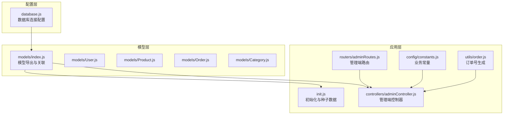
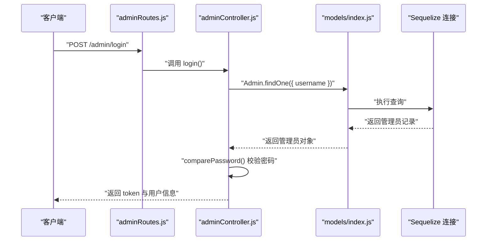
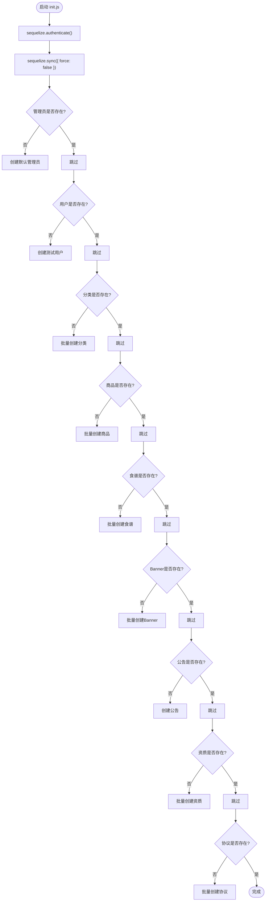
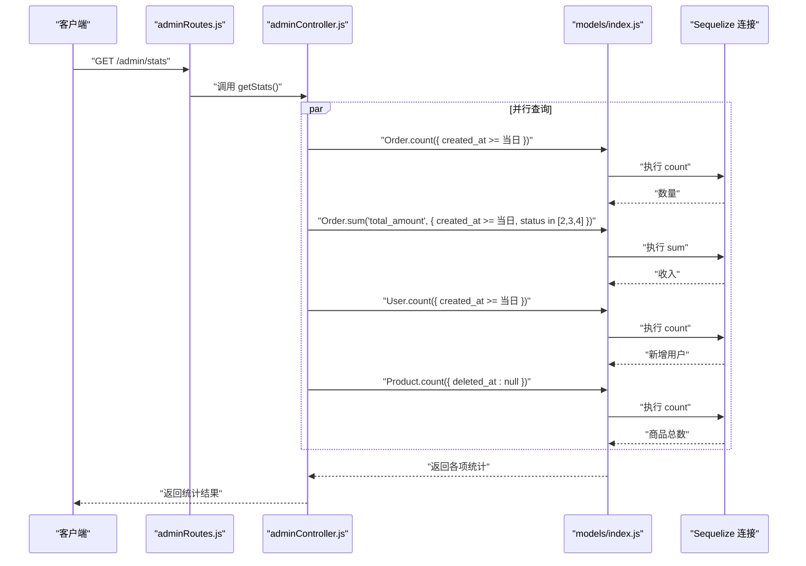
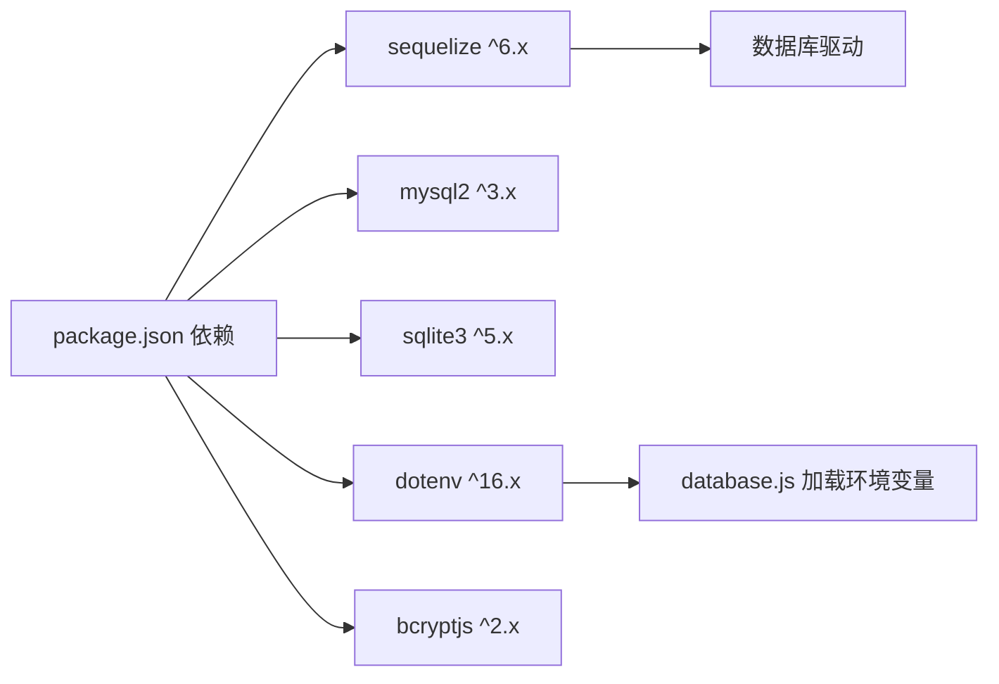

# 数据库操作

<cite>
**本文引用的文件**
- [backend/src/config/database.js](file://backend/src/config/database.js)
- [backend/src/models/index.js](file://backend/src/models/index.js)
- [backend/src/init.js](file://backend/src/init.js)
- [backend/package.json](file://backend/package.json)
- [backend/src/models/User.js](file://backend/src/models/User.js)
- [backend/src/models/Product.js](file://backend/src/models/Product.js)
- [backend/src/models/Order.js](file://backend/src/models/Order.js)
- [backend/src/models/Category.js](file://backend/src/models/Category.js)
- [backend/src/controllers/adminController.js](file://backend/src/controllers/adminController.js)
- [backend/src/routers/adminRoutes.js](file://backend/src/routers/adminRoutes.js)
- [backend/src/config/constants.js](file://backend/src/config/constants.js)
- [backend/src/utils/order.js](file://backend/src/utils/order.js)
</cite>

## 目录
1. [简介](#简介)
2. [项目结构](#项目结构)
3. [核心组件](#核心组件)
4. [架构总览](#架构总览)
5. [详细组件分析](#详细组件分析)
6. [依赖分析](#依赖分析)
7. [性能考虑](#性能考虑)
8. [故障排查指南](#故障排查指南)
9. [结论](#结论)
10. [附录](#附录)

## 简介
本文件面向数据库操作与维护，围绕 Sequelize ORM 的配置与使用展开，覆盖数据库连接、模型定义与关系映射、CRUD 实现、复杂查询、迁移与版本管理、性能优化、监控与故障排查等主题。文档以仓库中的实际代码为依据，结合业务模型（用户、商品、订单、分类等）进行系统化梳理，帮助开发者与运维人员高效、稳定地管理数据库。

## 项目结构
后端采用模块化组织，数据库相关的关键位置如下：
- 连接配置：backend/src/config/database.js
- 模型定义与关联：backend/src/models/*
- 初始化脚本：backend/src/init.js
- 控制器与路由：backend/src/controllers/*、backend/src/routers/*
- 常量与工具：backend/src/config/constants.js、backend/src/utils/order.js
- 依赖声明：backend/package.json

图表来源
- [backend/src/config/database.js:1-56](file://backend/src/config/database.js#L1-L56)
- [backend/src/models/index.js:1-92](file://backend/src/models/index.js#L1-L92)
- [backend/src/init.js:1-502](file://backend/src/init.js#L1-L502)
- [backend/src/routers/adminRoutes.js:1-80](file://backend/src/routers/adminRoutes.js#L1-L80)
- [backend/src/controllers/adminController.js:1-457](file://backend/src/controllers/adminController.js#L1-L457)
- [backend/src/config/constants.js:1-132](file://backend/src/config/constants.js#L1-L132)
- [backend/src/utils/order.js:1-16](file://backend/src/utils/order.js#L1-L16)

章节来源
- [backend/src/config/database.js:1-56](file://backend/src/config/database.js#L1-L56)
- [backend/src/models/index.js:1-92](file://backend/src/models/index.js#L1-L92)
- [backend/src/init.js:1-502](file://backend/src/init.js#L1-L502)
- [backend/src/routers/adminRoutes.js:1-80](file://backend/src/routers/adminRoutes.js#L1-L80)
- [backend/src/controllers/adminController.js:1-457](file://backend/src/controllers/adminController.js#L1-L457)
- [backend/src/config/constants.js:1-132](file://backend/src/config/constants.js#L1-L132)
- [backend/src/utils/order.js:1-16](file://backend/src/utils/order.js#L1-L16)

## 核心组件
- 数据库连接与方言配置：支持 SQLite 与 MySQL，统一时间戳命名、表名冻结、日志开关等。
- 模型与关联：用户、商品、订单、分类等核心实体及一对多/多对一/一对一关系。
- 初始化流程：连接校验、表同步、管理员/用户/商品/食谱/公告等种子数据写入。
- 控制器与路由：管理端登录、统计、管理员管理、商品/订单/用户/优惠券/食谱/Banner/公告/设置等接口。
- 常量与工具：订单号/售后号生成、状态码、分页参数等。

章节来源
- [backend/src/config/database.js:1-56](file://backend/src/config/database.js#L1-L56)
- [backend/src/models/index.js:1-92](file://backend/src/models/index.js#L1-L92)
- [backend/src/init.js:1-502](file://backend/src/init.js#L1-L502)
- [backend/src/controllers/adminController.js:1-457](file://backend/src/controllers/adminController.js#L1-L457)
- [backend/src/routers/adminRoutes.js:1-80](file://backend/src/routers/adminRoutes.js#L1-L80)
- [backend/src/config/constants.js:1-132](file://backend/src/config/constants.js#L1-L132)
- [backend/src/utils/order.js:1-16](file://backend/src/utils/order.js#L1-L16)

## 架构总览
下图展示从路由到控制器、模型与数据库的交互路径，以及初始化流程与模型关联。

图表来源
- [backend/src/routers/adminRoutes.js:14](file://backend/src/routers/adminRoutes.js#L14)
- [backend/src/controllers/adminController.js:8-49](file://backend/src/controllers/adminController.js#L8-L49)
- [backend/src/models/index.js:68-91](file://backend/src/models/index.js#L68-L91)

## 详细组件分析

### 数据库连接与配置
- 方言选择：根据环境变量选择 SQLite 或 MySQL，MySQL 下设置字符集、时区、连接池、日志级别等。
- 时间戳与命名：统一使用下划线命名、冻结表名、开启时间戳字段。
- 日志控制：开发环境下输出 SQL 日志，生产环境关闭。

章节来源
- [backend/src/config/database.js:10-53](file://backend/src/config/database.js#L10-L53)

### 模型定义与关系映射
- 用户模型：包含基础字段、安全字段（密码哈希）、状态与黑名单、标签、登录信息、软删除等。
- 商品模型：价格、库存、销量、评分、标签、产地与保质期、是否上架/新品/热销、排序等。
- 订单模型：订单号唯一、金额与优惠、配送与支付信息、状态与各节点时间、管理员备注等。
- 分类模型：父子关系、图标/图片、排序与状态。
- 关系映射：用户-地址、用户-订单、分类-商品、订单-订单项、订单-地址、用户-购物车/收藏/浏览/优惠券、用户-评价/售后、食谱-商品、用户-优惠券-优惠券等。

```mermaid
classDiagram
class User {
+BIGINT id
+STRING openid
+STRING unionid
+STRING nickname
+STRING avatar
+STRING phone
+STRING phone_encrypted
+STRING email
+STRING password_hash
+STRING real_name
+STRING id_card
+TINYINT member_level
+DATE member_expire_time
+INTEGER points
+DECIMAL balance
+TINYINT status
+TINYINT is_blacklist
+JSON tags
+DATE last_login_time
+STRING last_login_ip
+TINYINT need_reset_password
+DATE deleted_at
}
class Product {
+BIGINT id
+BIGINT category_id
+STRING name
+STRING subtitle
+STRING main_image
+JSON images
+STRING video_url
+TEXT description
+DECIMAL price
+DECIMAL member_price
+DECIMAL original_price
+INTEGER stock
+TINYINT stock_type
+INTEGER sales
+DECIMAL rating
+INTEGER review_count
+STRING serving_size
+STRING cooking_time
+STRING difficulty
+JSON tags
+STRING origin
+STRING packing_date
+STRING shelf_life
+STRING storage_conditions
+TEXT ingredient_list
+TEXT producer_info
+BIGINT recipe_id
+TINYINT is_on_sale
+TINYINT is_new
+TINYINT is_hot
+TINYINT is_recommend
+INTEGER sort_order
+DATE deleted_at
}
class Order {
+BIGINT id
+STRING order_no
+BIGINT user_id
+BIGINT address_id
+DECIMAL total_amount
+DECIMAL discount_amount
+DECIMAL freight
+DECIMAL pay_amount
+INTEGER points_used
+INTEGER points_earned
+BIGINT coupon_id
+TINYINT delivery_method
+DATE delivery_time
+STRING delivery_remark
+STRING pay_method
+DATE pay_time
+STRING transaction_id
+STRING invoice_title
+STRING invoice_tax_no
+STRING invoice_type
+TINYINT status
+STRING cancel_reason
+DATE cancel_time
+DATE prepare_time
+DATE ship_time
+DATE receive_time
+DATE complete_time
+STRING admin_remark
}
class Category {
+BIGINT id
+BIGINT parent_id
+STRING name
+STRING icon
+STRING image
+STRING description
+INTEGER sort_order
+TINYINT status
}
User "1" <-- "many" Order : "hasMany"
Order "many" --> "1" User : "belongsTo"
Category "1" <-- "many" Product : "hasMany"
Product "1" --> "1" Category : "belongsTo"
User "1" <-- "many" Cart : "hasMany"
Cart "1" --> "1" User : "belongsTo"
Cart "1" --> "1" Product : "belongsTo"
```

图表来源
- [backend/src/models/User.js:5-129](file://backend/src/models/User.js#L5-L129)
- [backend/src/models/Product.js:4-187](file://backend/src/models/Product.js#L4-L187)
- [backend/src/models/Order.js:4-157](file://backend/src/models/Order.js#L4-L157)
- [backend/src/models/Category.js:4-53](file://backend/src/models/Category.js#L4-L53)
- [backend/src/models/index.js:27-67](file://backend/src/models/index.js#L27-L67)

章节来源
- [backend/src/models/User.js:1-150](file://backend/src/models/User.js#L1-L150)
- [backend/src/models/Product.js:1-190](file://backend/src/models/Product.js#L1-L190)
- [backend/src/models/Order.js:1-160](file://backend/src/models/Order.js#L1-L160)
- [backend/src/models/Category.js:1-56](file://backend/src/models/Category.js#L1-L56)
- [backend/src/models/index.js:27-67](file://backend/src/models/index.js#L27-L67)

### 初始化流程与种子数据
- 连接验证与表同步：启动时先验证连接，再同步模型定义到数据库。
- 种子数据：管理员、测试用户、分类、商品、食谱、Banner、公告、资质、协议等。
- 批量写入：使用批量插入提升效率，避免逐条写入的性能损耗。

图表来源
- [backend/src/init.js:5-492](file://backend/src/init.js#L5-L492)

章节来源
- [backend/src/init.js:5-492](file://backend/src/init.js#L5-L492)

### CRUD 与复杂查询
- 登录与权限：管理员登录校验密码、更新登录信息、签发令牌；路由层鉴权中间件保护。
- 统计查询：今日订单数、今日收入（过滤状态）、今日新增用户、商品总数等，使用聚合函数与范围查询。
- 分页与筛选：findAndCountAll 结合 offset/limit 实现分页，属性选择减少传输。
- 订单号生成：基于时间戳与随机数生成唯一编号，避免并发冲突。

图表来源
- [backend/src/routers/adminRoutes.js:19](file://backend/src/routers/adminRoutes.js#L19)
- [backend/src/controllers/adminController.js:392-439](file://backend/src/controllers/adminController.js#L392-L439)
- [backend/src/models/index.js:68-91](file://backend/src/models/index.js#L68-L91)

章节来源
- [backend/src/controllers/adminController.js:8-49](file://backend/src/controllers/adminController.js#L8-L49)
- [backend/src/controllers/adminController.js:392-439](file://backend/src/controllers/adminController.js#L392-L439)
- [backend/src/routers/adminRoutes.js:14-19](file://backend/src/routers/adminRoutes.js#L14-L19)
- [backend/src/utils/order.js:3-13](file://backend/src/utils/order.js#L3-L13)

### 数据模型设计原则
- 字段设计：遵循业务语义命名，数值精度使用 DECIMAL，JSON 存储结构化数据，时间字段区分不同业务节点。
- 约束与索引：订单号唯一、软删除字段 deleted_at、布尔状态字段统一取值范围。
- 关系设计：外键明确、命名规范、一对多/一对一关系清晰，便于联表查询与级联访问。

章节来源
- [backend/src/models/User.js:5-129](file://backend/src/models/User.js#L5-L129)
- [backend/src/models/Product.js:4-187](file://backend/src/models/Product.js#L4-L187)
- [backend/src/models/Order.js:4-157](file://backend/src/models/Order.js#L4-L157)
- [backend/src/models/Category.js:4-53](file://backend/src/models/Category.js#L4-L53)
- [backend/src/models/index.js:27-67](file://backend/src/models/index.js#L27-L67)

### 复杂查询与事务
- 聚合查询：使用 sum/count/范围查询实现统计报表。
- 联表查询：通过 belongsTo/hasMany 在模型层自动拼接关联查询，简化控制器逻辑。
- 事务处理：对于涉及多表写入的业务（如下单扣减库存、生成订单与订单项），建议在控制器内使用事务包裹，确保一致性。

章节来源
- [backend/src/controllers/adminController.js:392-439](file://backend/src/controllers/adminController.js#L392-L439)
- [backend/src/models/index.js:27-67](file://backend/src/models/index.js#L27-L67)

### 迁移与版本管理
- 表结构同步：通过 sequelize.sync({ force: false }) 将模型定义同步到数据库，适用于开发环境。
- 强制重建：force: true 可用于开发调试，但会丢弃现有数据，谨慎使用。
- 迁移工具：项目未集成 Sequelize CLI 迁移脚本，建议后续引入迁移机制，配合版本控制管理 Schema 变更。

章节来源
- [backend/src/config/database.js:14](file://backend/src/config/database.js#L14)
- [backend/src/init.js:14](file://backend/src/init.js#L14)

### 性能优化策略
- 查询优化：合理使用 where 条件、范围查询与聚合函数；避免 N+1 查询，优先使用 include 预加载关联。
- 索引设计：对高频过滤字段（如 created_at、order_no、user_id、category_id）建立索引；对 JSON 字段避免在查询中频繁解析。
- 缓存策略：热点数据（如商品详情、分类、公告）可引入 Redis 缓存，降低数据库压力。
- 连接池：MySQL 连接池参数已配置，可根据并发与响应要求调整 max/min/acquire/idle。
- 批量操作：批量插入/更新使用 bulkCreate/bulkUpdate，减少往返次数。

章节来源
- [backend/src/config/database.js:38-43](file://backend/src/config/database.js#L38-L43)
- [backend/src/init.js:63, 285, 383, 397, 424:63-63](file://backend/src/init.js#L63-L63)
- [backend/src/controllers/adminController.js:71-82](file://backend/src/controllers/adminController.js#L71-L82)

### 数据备份与恢复
- SQLite：storage 文件即数据库文件，定期复制 storage 文件进行备份。
- MySQL：使用 mysqldump 或物理备份策略，结合只读快照与增量备份，确保可恢复点。

章节来源
- [backend/src/config/database.js:12-14](file://backend/src/config/database.js#L12-L14)
- [backend/src/config/database.js:26-52](file://backend/src/config/database.js#L26-L52)

## 依赖分析
- Sequelize：ORM 核心，提供连接、模型、关联、查询与事务能力。
- mysql2/sqlite3：数据库驱动，分别对应 MySQL 与 SQLite。
- dotenv：环境变量加载，确保连接参数可配置。
- bcryptjs：密码哈希，模型层自动处理密码加密。

图表来源
- [backend/package.json:18-39](file://backend/package.json#L18-L39)
- [backend/src/config/database.js:1-5](file://backend/src/config/database.js#L1-L5)

章节来源
- [backend/package.json:18-39](file://backend/package.json#L18-L39)
- [backend/src/config/database.js:1-5](file://backend/src/config/database.js#L1-L5)

## 性能考虑
- 查询层面：尽量使用索引列过滤，避免 SELECT *；对大表使用分页与范围查询。
- 写入层面：批量写入、事务合并、避免重复更新。
- 连接池：根据 QPS 调整 max/min/acquire/idle，避免连接不足或过度占用。
- 缓存：热点读取使用缓存，写入后失效或更新缓存；注意缓存与数据库的一致性。

## 故障排查指南
- 连接失败：检查 .env 中数据库连接参数、网络连通性、MySQL/SQLite 服务状态。
- 同步失败：确认模型字段与数据库字段兼容，必要时使用 force: false 并查看报错信息。
- 密码校验失败：确认 bcrypt 加密流程与 comparePassword 使用正确。
- 统计异常：核对状态枚举与范围查询条件，确保数据状态与业务一致。
- 初始化失败：查看控制台错误堆栈，定位具体种子数据写入步骤。

章节来源
- [backend/src/config/database.js:9-53](file://backend/src/config/database.js#L9-L53)
- [backend/src/init.js:488-491](file://backend/src/init.js#L488-L491)
- [backend/src/models/User.js:131-147](file://backend/src/models/User.js#L131-L147)
- [backend/src/controllers/adminController.js:392-439](file://backend/src/controllers/adminController.js#L392-L439)

## 结论
本项目以 Sequelize 为核心，构建了清晰的模型与关联关系，配合初始化流程与管理端接口，实现了从连接、模型、查询到统计的完整链路。建议后续引入迁移机制、完善索引与缓存策略，并在高并发场景下进一步优化连接池与查询计划，确保系统在功能完备的同时具备良好的性能与稳定性。

## 附录
- 常量与状态：订单状态、售后状态、配送方式、优惠券类型、管理员角色等集中定义，便于统一管理与扩展。
- 订单号生成：提供稳定的编号生成策略，避免重复与冲突。

章节来源
- [backend/src/config/constants.js:1-132](file://backend/src/config/constants.js#L1-L132)
- [backend/src/utils/order.js:3-13](file://backend/src/utils/order.js#L3-L13)