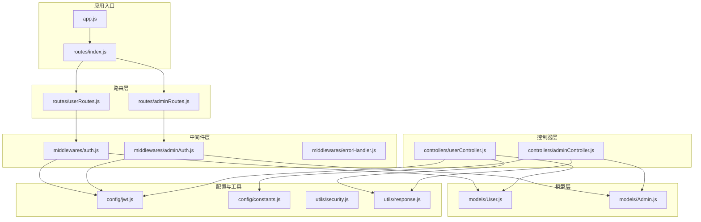
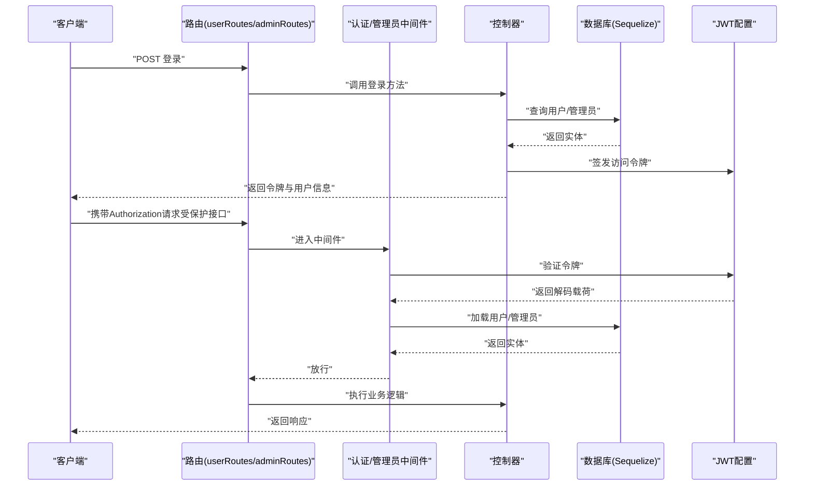
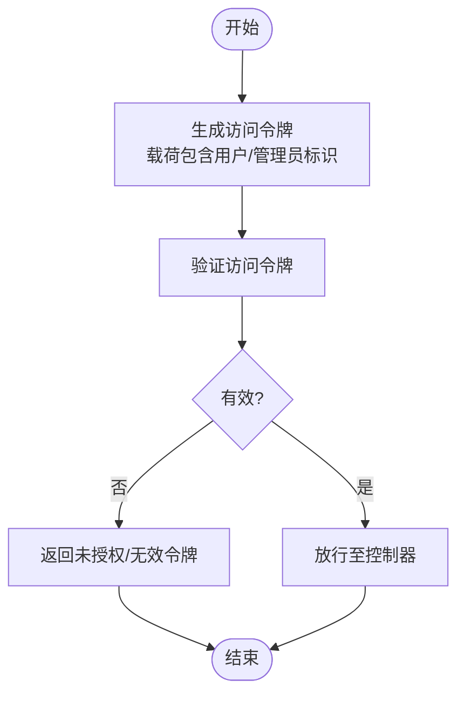
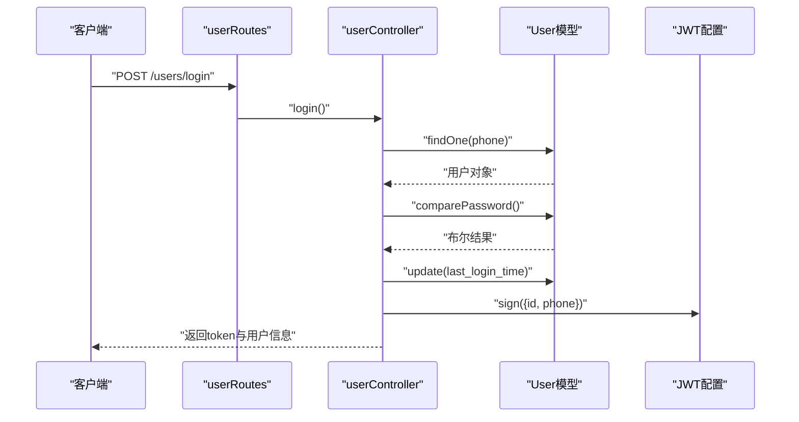
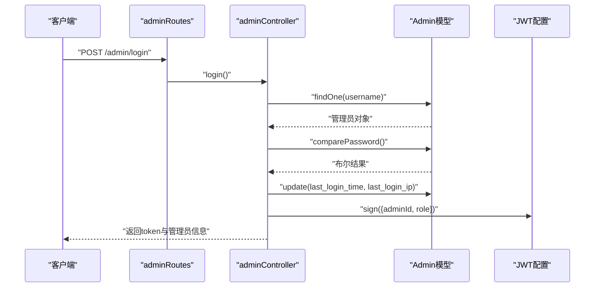
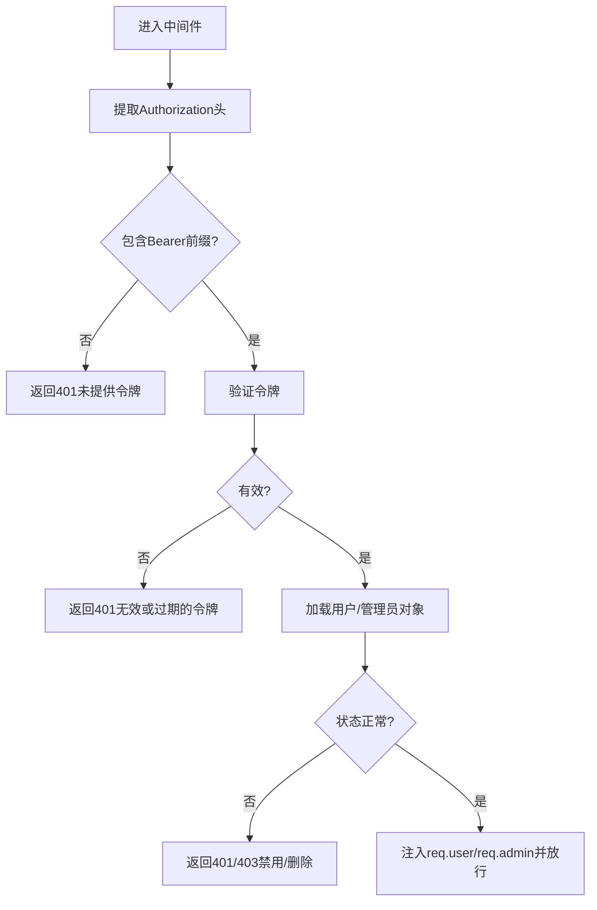
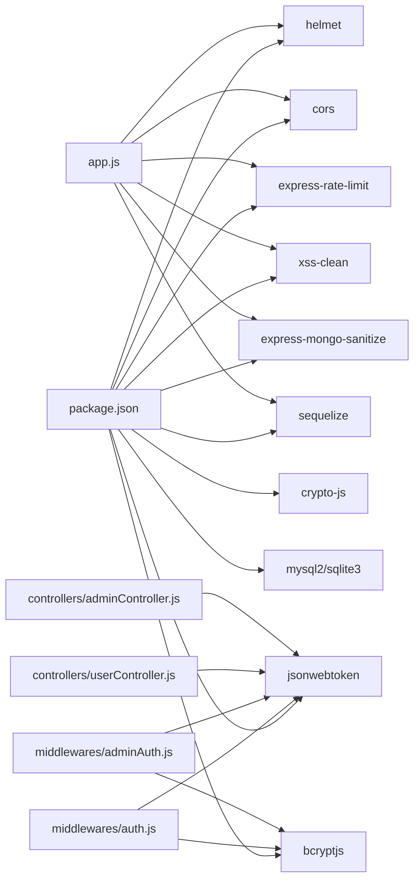

# 认证与授权

<cite>
**本文引用的文件**
- [backend/src/config/jwt.js](file://backend/src/config/jwt.js)
- [backend/src/middlewares/auth.js](file://backend/src/middlewares/auth.js)
- [backend/src/middlewares/adminAuth.js](file://backend/src/middlewares/adminAuth.js)
- [backend/src/models/User.js](file://backend/src/models/User.js)
- [backend/src/models/Admin.js](file://backend/src/models/Admin.js)
- [backend/src/controllers/userController.js](file://backend/src/controllers/userController.js)
- [backend/src/controllers/adminController.js](file://backend/src/controllers/adminController.js)
- [backend/src/utils/security.js](file://backend/src/utils/security.js)
- [backend/src/config/constants.js](file://backend/src/config/constants.js)
- [backend/src/middlewares/errorHandler.js](file://backend/src/middlewares/errorHandler.js)
- [backend/src/routes/index.js](file://backend/src/routes/index.js)
- [backend/src/routes/userRoutes.js](file://backend/src/routes/userRoutes.js)
- [backend/src/routes/adminRoutes.js](file://backend/src/routes/adminRoutes.js)
- [backend/src/utils/response.js](file://backend/src/utils/response.js)
- [backend/src/app.js](file://backend/src/app.js)
- [backend/package.json](file://backend/package.json)
</cite>

## 目录
1. [简介](#简介)
2. [项目结构](#项目结构)
3. [核心组件](#核心组件)
4. [架构总览](#架构总览)
5. [详细组件分析](#详细组件分析)
6. [依赖关系分析](#依赖关系分析)
7. [性能考虑](#性能考虑)
8. [故障排查指南](#故障排查指南)
9. [结论](#结论)
10. [附录](#附录)

## 简介
本技术文档围绕认证与授权系统进行深入解析，覆盖以下主题：
- JWT 令牌机制：生成、签名验证、过期处理与刷新策略现状
- 用户认证流程：密码加密、登录验证、会话管理与用户状态校验
- 权限控制：角色定义、权限检查与访问控制列表
- 中间件实现：认证中间件、管理员认证与权限中间件、错误处理中间件
- 多层级权限设计：用户权限、管理员权限与超级管理员权限
- 安全最佳实践：令牌刷新策略、防暴力破解与会话劫持防护
- 第三方认证与 OAuth2.0 集成方案与实施建议

## 项目结构
后端采用 Express + Sequelize 架构，模块化组织如下：
- 配置层：JWT、常量、数据库、日志等配置
- 中间件层：通用认证、管理员认证、错误处理
- 模型层：用户与管理员实体及密码哈希钩子
- 控制器层：用户与管理员业务逻辑
- 工具层：响应封装、安全工具（加密与脱敏）
- 路由层：REST 接口聚合
- 应用入口：安全中间件、CORS、速率限制、静态资源与全局错误处理

图表来源
- [backend/src/app.js:1-84](file://backend/src/app.js#L1-L84)
- [backend/src/routes/index.js:1-27](file://backend/src/routes/index.js#L1-L27)
- [backend/src/routes/userRoutes.js:1-25](file://backend/src/routes/userRoutes.js#L1-L25)
- [backend/src/routes/adminRoutes.js:1-80](file://backend/src/routes/adminRoutes.js#L1-L80)
- [backend/src/middlewares/auth.js:1-181](file://backend/src/middlewares/auth.js#L1-L181)
- [backend/src/middlewares/adminAuth.js:1-77](file://backend/src/middlewares/adminAuth.js#L1-L77)
- [backend/src/controllers/userController.js:1-409](file://backend/src/controllers/userController.js#L1-L409)
- [backend/src/controllers/adminController.js:1-457](file://backend/src/controllers/adminController.js#L1-L457)
- [backend/src/models/User.js:1-150](file://backend/src/models/User.js#L1-L150)
- [backend/src/models/Admin.js:1-96](file://backend/src/models/Admin.js#L1-L96)
- [backend/src/config/jwt.js:1-41](file://backend/src/config/jwt.js#L1-L41)
- [backend/src/config/constants.js:62-68](file://backend/src/config/constants.js#L62-L68)
- [backend/src/utils/response.js:1-32](file://backend/src/utils/response.js#L1-L32)
- [backend/src/utils/security.js:1-48](file://backend/src/utils/security.js#L1-L48)

章节来源
- [backend/src/app.js:1-84](file://backend/src/app.js#L1-L84)
- [backend/src/routes/index.js:1-27](file://backend/src/routes/index.js#L1-L27)

## 核心组件
- JWT 配置与工具：提供对称密钥签名、过期时间配置、令牌生成与验证方法
- 用户模型与密码钩子：自动对明文密码进行哈希处理，提供密码比较方法
- 管理员模型与角色常量：定义管理员角色枚举，支持角色级权限控制
- 认证中间件：从 Authorization 头解析 Bearer 令牌，解码并加载用户信息，进行状态校验
- 管理员认证中间件：校验管理员令牌，加载管理员对象并进行状态校验
- 错误处理中间件：统一记录错误日志并返回标准化错误响应
- 响应工具：统一封装成功与失败响应格式
- 安全工具：提供敏感信息脱敏与对称加密能力

章节来源
- [backend/src/config/jwt.js:1-41](file://backend/src/config/jwt.js#L1-L41)
- [backend/src/models/User.js:131-147](file://backend/src/models/User.js#L131-L147)
- [backend/src/models/Admin.js:77-93](file://backend/src/models/Admin.js#L77-L93)
- [backend/src/middlewares/auth.js:1-181](file://backend/src/middlewares/auth.js#L1-L181)
- [backend/src/middlewares/adminAuth.js:1-77](file://backend/src/middlewares/adminAuth.js#L1-L77)
- [backend/src/middlewares/errorHandler.js:1-47](file://backend/src/middlewares/errorHandler.js#L1-L47)
- [backend/src/utils/response.js:1-32](file://backend/src/utils/response.js#L1-L32)
- [backend/src/utils/security.js:1-48](file://backend/src/utils/security.js#L1-L48)
- [backend/src/config/constants.js:62-68](file://backend/src/config/constants.js#L62-L68)

## 架构总览
认证与授权的整体流程如下：
- 客户端通过用户或管理员登录接口提交凭据
- 服务端验证凭据并签发 JWT 令牌
- 客户端在后续请求中携带 Bearer 令牌
- 中间件解析并验证令牌，加载用户或管理员对象
- 控制器根据用户或管理员身份执行业务逻辑
- 统一错误处理中间件捕获异常并输出标准化响应

图表来源
- [backend/src/routes/userRoutes.js:7-22](file://backend/src/routes/userRoutes.js#L7-L22)
- [backend/src/routes/adminRoutes.js:14-18](file://backend/src/routes/adminRoutes.js#L14-L18)
- [backend/src/middlewares/auth.js:4-148](file://backend/src/middlewares/auth.js#L4-L148)
- [backend/src/middlewares/adminAuth.js:5-49](file://backend/src/middlewares/adminAuth.js#L5-L49)
- [backend/src/controllers/userController.js:44-93](file://backend/src/controllers/userController.js#L44-L93)
- [backend/src/controllers/adminController.js:8-48](file://backend/src/controllers/adminController.js#L8-L48)
- [backend/src/config/jwt.js:10-32](file://backend/src/config/jwt.js#L10-L32)

## 详细组件分析

### JWT 令牌机制
- 配置项
  - 秘钥与过期时间：分别用于访问令牌与刷新令牌的签名与有效期
  - 刷新令牌：独立秘钥与过期时间，便于单独管理
- 生成与验证
  - 访问令牌：基于用户或管理员标识生成，包含过期时间
  - 刷新令牌：独立生成与验证，当前仓库未在登录流程中使用刷新令牌接口
- 过期处理
  - 解码阶段若过期则视为无效，中间件返回未授权

图表来源
- [backend/src/config/jwt.js:10-32](file://backend/src/config/jwt.js#L10-L32)
- [backend/src/middlewares/auth.js:18-27](file://backend/src/middlewares/auth.js#L18-L27)
- [backend/src/middlewares/adminAuth.js:16-23](file://backend/src/middlewares/adminAuth.js#L16-L23)

章节来源
- [backend/src/config/jwt.js:1-41](file://backend/src/config/jwt.js#L1-L41)
- [backend/src/middlewares/auth.js:1-181](file://backend/src/middlewares/auth.js#L1-L181)
- [backend/src/middlewares/adminAuth.js:1-77](file://backend/src/middlewares/adminAuth.js#L1-L77)

### 用户认证流程
- 登录与注册
  - 注册：校验手机号唯一性，对明文密码进行哈希后保存，签发访问令牌返回
  - 登录：查询用户，校验状态，使用 bcrypt 对比密码，更新最近登录时间，签发访问令牌
- 会话管理
  - 中间件从 Authorization 头提取 Bearer 令牌，解码后加载用户对象
  - 对用户软删除、禁用、拉黑状态进行严格校验
  - 开发环境下支持基于 token 内手机号回退创建测试用户
- 密码加密
  - 使用 bcryptjs，自动在创建与更新时对密码字段进行哈希处理

图表来源
- [backend/src/routes/userRoutes.js:7-8](file://backend/src/routes/userRoutes.js#L7-L8)
- [backend/src/controllers/userController.js:44-93](file://backend/src/controllers/userController.js#L44-L93)
- [backend/src/models/User.js:131-147](file://backend/src/models/User.js#L131-L147)
- [backend/src/config/jwt.js:10-11](file://backend/src/config/jwt.js#L10-L11)

章节来源
- [backend/src/controllers/userController.js:1-409](file://backend/src/controllers/userController.js#L1-L409)
- [backend/src/models/User.js:1-150](file://backend/src/models/User.js#L1-L150)
- [backend/src/middlewares/auth.js:1-181](file://backend/src/middlewares/auth.js#L1-L181)

### 管理员认证与权限控制
- 登录
  - 校验用户名存在与密码正确性，检查状态，更新最近登录信息，签发包含管理员标识与角色的访问令牌
- 权限中间件
  - 校验 Bearer 令牌，确保包含管理员标识
  - 加载管理员对象并校验状态
- 角色与权限
  - 角色枚举：超级管理员、运营、客服、财务
  - requireRole 中间件：超级管理员可豁免，其他角色需满足白名单要求

图表来源
- [backend/src/routes/adminRoutes.js:14-18](file://backend/src/routes/adminRoutes.js#L14-L18)
- [backend/src/controllers/adminController.js:8-48](file://backend/src/controllers/adminController.js#L8-L48)
- [backend/src/models/Admin.js:77-93](file://backend/src/models/Admin.js#L77-L93)
- [backend/src/config/jwt.js:10-11](file://backend/src/config/jwt.js#L10-L11)
- [backend/src/middlewares/adminAuth.js:5-49](file://backend/src/middlewares/adminAuth.js#L5-L49)
- [backend/src/config/constants.js:62-68](file://backend/src/config/constants.js#L62-L68)

章节来源
- [backend/src/controllers/adminController.js:1-457](file://backend/src/controllers/adminController.js#L1-L457)
- [backend/src/middlewares/adminAuth.js:1-77](file://backend/src/middlewares/adminAuth.js#L1-L77)
- [backend/src/config/constants.js:62-68](file://backend/src/config/constants.js#L62-L68)

### 中间件实现原理
- 认证中间件
  - 提取 Authorization 头，校验 Bearer 前缀
  - 验证令牌有效性，解析用户标识
  - 查询用户并进行软删除、禁用、拉黑状态校验
  - 可选认证模式：仅在令牌有效且用户可用时注入 req.user
- 管理员认证中间件
  - 校验 Bearer 令牌并解析管理员标识
  - 查询管理员并校验状态
- 错误处理中间件
  - 记录错误日志（含 URL、方法、IP、堆栈）
  - 将常见错误类型映射为标准 HTTP 状态码
  - 生产环境隐藏堆栈细节

图表来源
- [backend/src/middlewares/auth.js:4-148](file://backend/src/middlewares/auth.js#L4-L148)
- [backend/src/middlewares/adminAuth.js:5-49](file://backend/src/middlewares/adminAuth.js#L5-L49)
- [backend/src/middlewares/errorHandler.js:3-37](file://backend/src/middlewares/errorHandler.js#L3-L37)

章节来源
- [backend/src/middlewares/auth.js:1-181](file://backend/src/middlewares/auth.js#L1-L181)
- [backend/src/middlewares/adminAuth.js:1-77](file://backend/src/middlewares/adminAuth.js#L1-L77)
- [backend/src/middlewares/errorHandler.js:1-47](file://backend/src/middlewares/errorHandler.js#L1-L47)

### 多层级权限设计
- 用户权限
  - 通过用户态中间件鉴权，支持可选认证场景
- 管理员权限
  - 超级管理员：拥有最高权限，可绕过角色校验
  - 其他角色：通过 requireRole 白名单控制
- 权限检查与访问控制
  - 在路由层通过中间件组合实现“登录+角色”双重校验
  - 控制器内可进一步细化业务权限判断

章节来源
- [backend/src/middlewares/adminAuth.js:52-74](file://backend/src/middlewares/adminAuth.js#L52-L74)
- [backend/src/config/constants.js:62-68](file://backend/src/config/constants.js#L62-L68)
- [backend/src/routes/adminRoutes.js:1-80](file://backend/src/routes/adminRoutes.js#L1-L80)

### 安全最佳实践
- 令牌刷新策略
  - 当前实现未提供刷新令牌接口，建议引入独立刷新令牌端点与黑名单机制
- 防暴力破解
  - 已启用速率限制中间件，可通过环境变量调整窗口与最大请求数
- 会话劫持防护
  - 建议增加设备指纹、IP 绑定、令牌撤销列表与滑动过期策略
- 数据安全
  - 敏感字段脱敏与对称加密工具可用于日志与传输中的数据保护

章节来源
- [backend/src/app.js:32-39](file://backend/src/app.js#L32-L39)
- [backend/src/utils/security.js:1-48](file://backend/src/utils/security.js#L1-L48)
- [backend/src/utils/response.js:1-32](file://backend/src/utils/response.js#L1-L32)

### 第三方认证与 OAuth2.0 实施建议
- 微信登录（用户态）
  - User 模型包含 openid/unionid 字段，可在登录流程中结合第三方回调完成绑定
- OAuth2.0 集成
  - 建议新增第三方登录路由与回调处理，使用 state 参数防 CSRF，使用 code 换取 access_token 并映射到用户实体
  - 令牌签发与刷新策略同上

章节来源
- [backend/src/models/User.js:11-20](file://backend/src/models/User.js#L11-L20)
- [backend/src/controllers/userController.js:44-93](file://backend/src/controllers/userController.js#L44-L93)

## 依赖关系分析
- 模块耦合
  - 中间件依赖 JWT 配置与模型层
  - 控制器依赖模型层与响应工具
  - 路由层聚合中间件与控制器
- 外部依赖
  - 安全：Helmet、CORS、XSS 清理、Mongo 注入清理
  - 速率限制：express-rate-limit
  - 日志：Morgan + Winston
  - 数据库：Sequelize + MySQL/SQLite
  - 加密：bcryptjs、CryptoJS

图表来源
- [backend/package.json:18-40](file://backend/package.json#L18-L40)
- [backend/src/app.js:1-84](file://backend/src/app.js#L1-L84)
- [backend/src/middlewares/auth.js:1-2](file://backend/src/middlewares/auth.js#L1-L2)
- [backend/src/middlewares/adminAuth.js:1-3](file://backend/src/middlewares/adminAuth.js#L1-L3)
- [backend/src/controllers/userController.js:1-6](file://backend/src/controllers/userController.js#L1-L6)
- [backend/src/controllers/adminController.js:1-6](file://backend/src/controllers/adminController.js#L1-L6)

章节来源
- [backend/package.json:1-50](file://backend/package.json#L1-L50)
- [backend/src/app.js:1-84](file://backend/src/app.js#L1-L84)

## 性能考虑
- 速率限制：通过环境变量可调，建议按接口粒度细分
- 数据库查询：中间件与控制器尽量减少 N+1 查询，使用关联加载与分页
- 日志与监控：Morgan + Winston 组合记录请求日志，建议接入集中式日志与指标采集
- 缓存：对只读配置与权限列表可引入 Redis 缓存以降低数据库压力

## 故障排查指南
- 401 未提供令牌
  - 检查请求头 Authorization 是否以 Bearer 开头
- 401 无效或过期的令牌
  - 核对 JWT 秘钥一致性与过期时间配置
- 401 用户不存在/被删除/禁用
  - 检查用户状态、软删除标记与拉黑状态
- 403 权限不足
  - 确认管理员角色与 requireRole 白名单
- 500 服务器内部错误
  - 查看日志输出，定位具体控制器与模型调用链

章节来源
- [backend/src/middlewares/auth.js:8-13](file://backend/src/middlewares/auth.js#L8-L13)
- [backend/src/middlewares/auth.js:21-27](file://backend/src/middlewares/auth.js#L21-L27)
- [backend/src/middlewares/adminAuth.js:8-13](file://backend/src/middlewares/adminAuth.js#L8-L13)
- [backend/src/middlewares/adminAuth.js:18-23](file://backend/src/middlewares/adminAuth.js#L18-L23)
- [backend/src/middlewares/errorHandler.js:3-37](file://backend/src/middlewares/errorHandler.js#L3-L37)

## 结论
本系统基于 JWT 实现了用户与管理员双通道认证，配合中间件与模型钩子完成了密码安全与状态校验。当前缺少刷新令牌与更细粒度的权限控制，建议补充刷新端点、权限矩阵与会话安全策略，以满足生产环境的安全与稳定性需求。

## 附录
- 环境变量与默认值
  - JWT 秘钥与过期时间、刷新秘钥与过期时间
  - CORS 允许来源、速率限制窗口与最大请求数、API 前缀、端口
- 响应格式
  - 成功与失败统一封装，支持分页响应

章节来源
- [backend/src/config/jwt.js:3-8](file://backend/src/config/jwt.js#L3-L8)
- [backend/src/app.js:55-56](file://backend/src/app.js#L55-L56)
- [backend/src/utils/response.js:1-32](file://backend/src/utils/response.js#L1-L32)