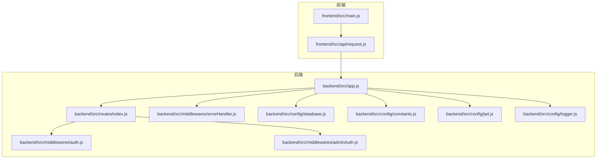
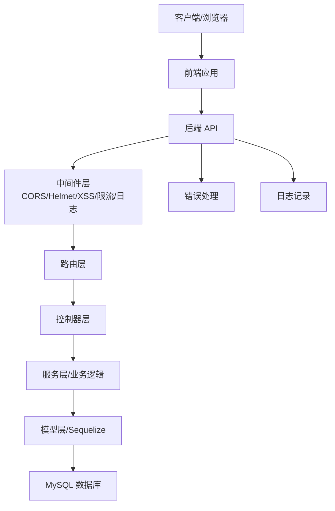
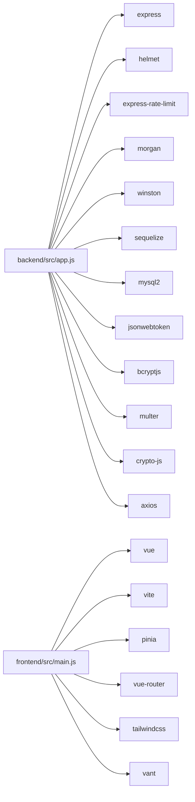

# 代码审查流程

<cite>
**本文引用的文件**
- [README.md](file://README.md)
- [backend/src/app.js](file://backend/src/app.js)
- [backend/package.json](file://backend/package.json)
- [docs/api.md](file://docs/api.md)
- [docs/deploy.md](file://docs/deploy.md)
- [backend/src/controllers/userController.js](file://backend/src/controllers/userController.js)
- [backend/src/controllers/orderController.js](file://backend/src/controllers/orderController.js)
- [backend/src/controllers/productController.js](file://backend/src/controllers/productController.js)
- [backend/src/middlewares/auth.js](file://backend/src/middlewares/auth.js)
- [backend/src/middlewares/adminAuth.js](file://backend/src/middlewares/adminAuth.js)
- [backend/src/middlewares/errorHandler.js](file://backend/src/middlewares/errorHandler.js)
- [backend/src/utils/security.js](file://backend/src/utils/security.js)
- [backend/src/utils/response.js](file://backend/src/utils/response.js)
- [backend/src/models/User.js](file://backend/src/models/User.js)
- [backend/src/models/Order.js](file://backend/src/models/Order.js)
- [backend/src/models/Product.js](file://backend/src/models/Product.js)
- [backend/src/routes/index.js](file://backend/src/routes/index.js)
- [backend/src/config/constants.js](file://backend/src/config/constants.js)
- [backend/src/config/jwt.js](file://backend/src/config/jwt.js)
- [backend/src/config/database.js](file://backend/src/config/database.js)
- [backend/src/config/logger.js](file://backend/src/config/logger.js)
- [frontend/src/api/request.js](file://frontend/src/api/request.js)
- [frontend/src/main.js](file://frontend/src/main.js)
- [frontend/package.json](file://frontend/package.json)
</cite>

## 目录
1. 引言
2. 项目结构
3. 核心组件
4. 架构总览
5. 详细组件分析
6. 依赖关系分析
7. 性能考量
8. 故障排查指南
9. 结论
10. 附录

## 引言
本文件面向趣配鲜项目的代码审查工作，提供从 Pull Request 规范、审查标准、审查清单、工具与流程、反馈机制、多轮审查策略、效率提升到最佳实践的完整指导。目标是统一审查质量、降低回归风险、加速交付周期，并促进团队知识沉淀。

## 项目结构
趣配鲜采用前后端分离架构：前端基于 Vue 3 + Vite，后端基于 Node.js + Express + Sequelize，数据库为 MySQL。项目包含用户端（H5/小程序）、运营后台、API 文档与部署指南等模块。整体结构清晰，便于按功能域进行审查。

图表来源
- [backend/src/app.js:1-84](file://backend/src/app.js#L1-L84)
- [backend/src/routes/index.js](file://backend/src/routes/index.js)
- [backend/src/middlewares/auth.js](file://backend/src/middlewares/auth.js)
- [backend/src/middlewares/adminAuth.js](file://backend/src/middlewares/adminAuth.js)
- [backend/src/middlewares/errorHandler.js](file://backend/src/middlewares/errorHandler.js)
- [backend/src/config/database.js](file://backend/src/config/database.js)
- [backend/src/config/constants.js](file://backend/src/config/constants.js)
- [backend/src/config/jwt.js](file://backend/src/config/jwt.js)
- [backend/src/config/logger.js](file://backend/src/config/logger.js)
- [frontend/src/main.js](file://frontend/src/main.js)
- [frontend/src/api/request.js](file://frontend/src/api/request.js)

章节来源
- [README.md:46-83](file://README.md#L46-L83)
- [backend/src/app.js:1-84](file://backend/src/app.js#L1-L84)
- [frontend/src/main.js](file://frontend/src/main.js)

## 核心组件
- 应用入口与中间件：后端应用在入口文件中集中配置安全中间件（CORS、Helmet、XSS 清洗、MongoSanitize、限流）、日志、静态资源与路由挂载；错误处理中间件统一拦截异常。
- 路由与控制器：路由集中定义，控制器负责业务处理与调用服务层，遵循单一职责。
- 鉴权与权限：用户鉴权中间件用于普通用户认证，管理员鉴权中间件用于后台管理接口。
- 工具与通用响应：安全工具与统一响应封装，保证接口一致性与安全性。
- 配置模块：数据库、JWT、常量与日志配置模块化，便于审查与替换。

章节来源
- [backend/src/app.js:1-84](file://backend/src/app.js#L1-L84)
- [backend/src/middlewares/auth.js](file://backend/src/middlewares/auth.js)
- [backend/src/middlewares/adminAuth.js](file://backend/src/middlewares/adminAuth.js)
- [backend/src/middlewares/errorHandler.js](file://backend/src/middlewares/errorHandler.js)
- [backend/src/utils/security.js](file://backend/src/utils/security.js)
- [backend/src/utils/response.js](file://backend/src/utils/response.js)
- [backend/src/config/database.js](file://backend/src/config/database.js)
- [backend/src/config/jwt.js](file://backend/src/config/jwt.js)
- [backend/src/config/constants.js](file://backend/src/config/constants.js)
- [backend/src/config/logger.js](file://backend/src/config/logger.js)

## 架构总览
后端通过 Express 提供 RESTful API，前端通过 axios 发起请求并与路由交互。数据库通过 Sequelize 进行 ORM 管理，JWT 实现认证，Helmet、XSS 清洗与限流保障安全。

图表来源
- [backend/src/app.js:1-84](file://backend/src/app.js#L1-L84)
- [backend/src/routes/index.js](file://backend/src/routes/index.js)
- [backend/src/middlewares/errorHandler.js](file://backend/src/middlewares/errorHandler.js)
- [backend/src/config/logger.js](file://backend/src/config/logger.js)
- [backend/src/config/database.js](file://backend/src/config/database.js)

## 详细组件分析

### 1) 路由与控制器审查要点
- 路由设计：是否遵循 RESTful 命名规范，路径层级是否清晰，是否区分前台与后台接口。
- 控制器职责：是否仅处理请求参数校验、调用服务层与返回统一响应，避免在控制器内直接操作数据库。
- 错误传播：控制器是否捕获异常并交由全局错误处理中间件处理，避免重复错误处理逻辑。

章节来源
- [backend/src/routes/index.js](file://backend/src/routes/index.js)
- [backend/src/controllers/userController.js](file://backend/src/controllers/userController.js)
- [backend/src/controllers/orderController.js](file://backend/src/controllers/orderController.js)
- [backend/src/controllers/productController.js](file://backend/src/controllers/productController.js)

### 2) 鉴权与权限控制
- 用户鉴权：是否对需要登录的接口统一添加鉴权中间件，Token 校验与过期处理是否完善。
- 管理员鉴权：后台接口是否使用独立的管理员中间件，防止越权访问。
- 安全加固：是否结合 JWT 配置（过期时间、签名密钥）与限流策略，防止暴力破解与滥用。

章节来源
- [backend/src/middlewares/auth.js](file://backend/src/middlewares/auth.js)
- [backend/src/middlewares/adminAuth.js](file://backend/src/middlewares/adminAuth.js)
- [backend/src/config/jwt.js](file://backend/src/config/jwt.js)

### 3) 错误处理与日志
- 统一错误处理：是否对 404 与 5xx 错误进行统一处理，返回一致的响应结构。
- 日志记录：是否将请求日志写入统一日志系统，便于审计与问题定位。
- 异常恢复：错误处理是否包含敏感信息脱敏与最小暴露原则。

章节来源
- [backend/src/middlewares/errorHandler.js](file://backend/src/middlewares/errorHandler.js)
- [backend/src/config/logger.js](file://backend/src/config/logger.js)

### 4) 数据模型与数据库
- 模型设计：字段类型、约束与索引是否合理，是否满足查询性能需求。
- 关系映射：外键关系与关联查询是否清晰，避免 N+1 查询。
- 初始化与迁移：开发环境下的自动同步与初始化脚本是否安全可控。

章节来源
- [backend/src/models/User.js](file://backend/src/models/User.js)
- [backend/src/models/Order.js](file://backend/src/models/Order.js)
- [backend/src/models/Product.js](file://backend/src/models/Product.js)
- [backend/src/config/database.js](file://backend/src/config/database.js)

### 5) 前端集成与 API 请求
- 请求封装：是否统一在请求模块中配置 baseURL、超时与拦截器，避免分散配置。
- 路由与页面：页面组件是否按功能模块组织，避免跨模块耦合。
- 状态管理：Pinia 状态是否集中管理，避免重复请求与竞态。

章节来源
- [frontend/src/api/request.js](file://frontend/src/api/request.js)
- [frontend/src/main.js](file://frontend/src/main.js)
- [frontend/package.json](file://frontend/package.json)

## 依赖关系分析
后端依赖包括 Express、Sequelize、JWT、bcrypt、helmet、rate-limit、morgan、winston 等，前端依赖 Vue 3、Vite、TailwindCSS、Pinia、Vue Router 等。审查时应关注依赖版本与安全漏洞扫描、包体积与构建优化。

图表来源
- [backend/src/app.js:1-84](file://backend/src/app.js#L1-L84)
- [backend/package.json:18-40](file://backend/package.json#L18-L40)
- [frontend/package.json](file://frontend/package.json)

章节来源
- [backend/package.json:1-50](file://backend/package.json#L1-L50)
- [frontend/package.json](file://frontend/package.json)

## 性能考量
- 接口限流：通过限流中间件控制请求频率，避免突发流量导致系统过载。
- 日志与监控：结合 morgan 与 winston 输出访问日志与结构化日志，便于性能分析与故障定位。
- 数据库优化：为高频查询字段建立索引，避免全表扫描；合理分页与懒加载。
- 前端缓存：静态资源开启缓存与压缩，减少带宽消耗。
- 构建优化：Vite 构建配置与按需加载，缩短首屏加载时间。

章节来源
- [backend/src/app.js:32-39](file://backend/src/app.js#L32-L39)
- [backend/src/config/logger.js](file://backend/src/config/logger.js)
- [docs/deploy.md:411-441](file://docs/deploy.md#L411-L441)

## 故障排查指南
- 常见问题：数据库连接失败、前端页面空白、API 请求失败、SSL 证书过期等。
- 日志定位：查看 Nginx 访问/错误日志、PM2 应用日志与后端日志。
- 备份策略：定期备份数据库，保留最近若干天的压缩备份，配置定时任务自动清理过期备份。

章节来源
- [docs/deploy.md:392-408](file://docs/deploy.md#L392-L408)
- [docs/deploy.md:444-457](file://docs/deploy.md#L444-L457)

## 结论
通过规范化的 PR 流程、明确的审查标准与工具链、完善的反馈与多轮审查策略，可以显著提升代码质量与交付效率。建议在团队内推广本流程，并结合项目演进持续优化。

## 附录

### A. Pull Request 规范
- PR 模板与描述要求
  - 标题：简明扼要，体现变更类型（如 feat/fix/refactor/docs/chore）。
  - 描述：变更背景、影响范围、测试覆盖、兼容性说明、部署注意事项。
  - 标签：按功能域与风险级别打标签（如 backend/frontend/api/security/performance）。
- 变更范围说明
  - 前端：涉及页面、组件、状态管理、路由与 API 的改动需标注。
  - 后端：涉及控制器、路由、中间件、模型、配置与数据库结构的改动需标注。
  - 文档：API 文档、部署指南、数据库脚本的更新需单独说明。
- 合并前置条件
  - 通过本地与 CI 自动检查（ESLint、Prettier、单元测试）。
  - 至少一名审查者批准。
  - 无未解决的评论。

章节来源
- [README.md:212-226](file://README.md#L212-L226)

### B. 代码审查标准
- 代码质量
  - 命名规范：变量、函数、类名符合驼峰/帕斯卡命名约定。
  - 结构清晰：单一职责、模块化、避免重复代码。
  - 可读性：注释与变量命名表达意图，复杂逻辑拆分为小函数。
- 安全性检查
  - 输入校验：参数校验与白名单过滤，防止 SQL 注入、XSS、CSRF。
  - 认证与授权：JWT 过期策略、管理员权限隔离、敏感信息脱敏。
  - 传输安全：HTTPS、限流、速率限制。
- 性能考虑
  - 数据库：索引、分页、批量操作、避免 N+1。
  - 接口：缓存策略、超时与重试、并发控制。
  - 前端：懒加载、按需引入、资源压缩。
- 可维护性评估
  - 错误处理：统一异常与错误码，日志分级。
  - 文档与注释：接口文档、变更说明、技术债记录。
  - 可测试性：单元测试与集成测试覆盖核心路径。

章节来源
- [backend/src/app.js:19-39](file://backend/src/app.js#L19-L39)
- [backend/src/middlewares/auth.js](file://backend/src/middlewares/auth.js)
- [backend/src/middlewares/adminAuth.js](file://backend/src/middlewares/adminAuth.js)
- [backend/src/middlewares/errorHandler.js](file://backend/src/middlewares/errorHandler.js)
- [docs/api.md:386-397](file://docs/api.md#L386-L397)

### C. 审查清单模板
- 功能性验证
  - 接口行为：请求参数、响应结构、状态码与业务逻辑正确性。
  - 前后端联调：接口连通性、鉴权与权限生效、错误提示友好。
- 边界条件检查
  - 空值/非法输入：空字符串、超长参数、负数、越界索引。
  - 权限边界：非管理员访问后台接口、越权修改他人数据。
- 错误处理
  - 异常分支：数据库异常、网络异常、参数缺失、业务规则冲突。
  - 错误日志：错误堆栈、上下文信息、敏感信息脱敏。
- 文档完整性
  - API 文档：新增/变更接口的参数、示例与状态码。
  - 部署与运维：环境变量、数据库脚本、备份策略更新。

章节来源
- [docs/api.md:1-422](file://docs/api.md#L1-L422)
- [docs/deploy.md:444-457](file://docs/deploy.md#L444-L457)

### D. 审查工具与流程
- GitHub PR 功能
  - 代码评论：针对具体行提出建议与问题。
  - 审查请求：指定审查者，强制批准后方可合并。
  - 自动检查：CI/CD 自动运行 Lint、测试与安全扫描。
- 代码注释与规范
  - ESLint/Prettier：统一代码风格与基础规范。
  - 单元测试：Jest/SuperTest，覆盖关键路径与边界条件。
- 审查决策流程
  - 初审：检查规范性与基本正确性。
  - 深度审查：关注性能、安全与可维护性。
  - 技术负责人复审：重大变更与架构相关改动。

章节来源
- [backend/package.json:6-10](file://backend/package.json#L6-L10)
- [backend/src/app.js:41-45](file://backend/src/app.js#L41-L45)

### E. 审查反馈机制
- 建设性反馈
  - 明确指出问题与改进建议，提供替代实现思路。
  - 避免人身攻击，聚焦代码与设计。
- 问题跟踪
  - 将遗留问题转为 Issue 并标记优先级与截止日期。
- 修复确认
  - 修改后重新审查，确保问题已解决且无新问题引入。

### F. 多轮审查策略
- 初步审查（1-2 天）
  - 检查规范性、基本功能与文档完整性。
- 深度审查（2-3 天）
  - 性能、安全、可维护性与测试覆盖。
- 技术负责人复审（1 天）
  - 关键架构与风险点把关，最终批准合并。

### G. 审查效率提升
- 批量审查
  - 将同类改动（如统一错误处理、统一鉴权）打包审查，减少往返。
- 自动化检查
  - CI 中集成 Lint、格式化、测试与安全扫描，减少人工负担。
- 审查者分配
  - 根据模块与专长分配审查者，避免跨领域审查成本过高。

### H. 审查最佳实践
- 及时性
  - PR 提交后 24 小时内完成初审，3 天内完成深度审查。
- 审查质量
  - 不追求“零缺陷”，但要避免引入新的高风险问题。
- 知识分享
  - 在审查中总结经验，沉淀为团队规范与文档。

### I. 实际审查案例与常见问题
- 常见问题
  - 忘记添加鉴权中间件导致越权访问。
  - 数据库缺少索引导致查询缓慢。
  - 响应结构不统一导致前端适配困难。
  - 未处理异常导致 500 错误与日志缺失。
- 处理方案
  - 补充鉴权中间件与权限校验。
  - 为高频查询字段添加索引，优化查询语句。
  - 统一响应结构与错误码，完善日志记录。
  - 在全局错误处理中间件中捕获异常并记录上下文。

章节来源
- [backend/src/middlewares/errorHandler.js](file://backend/src/middlewares/errorHandler.js)
- [docs/deploy.md:424-432](file://docs/deploy.md#L424-L432)