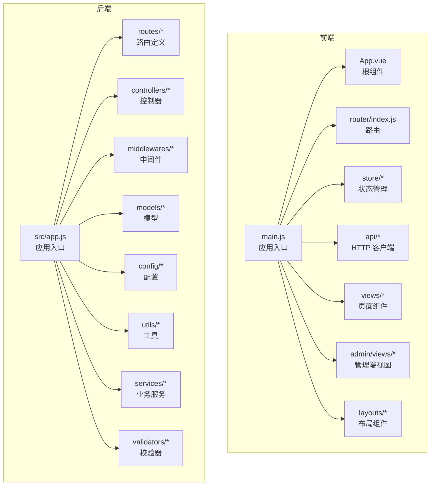
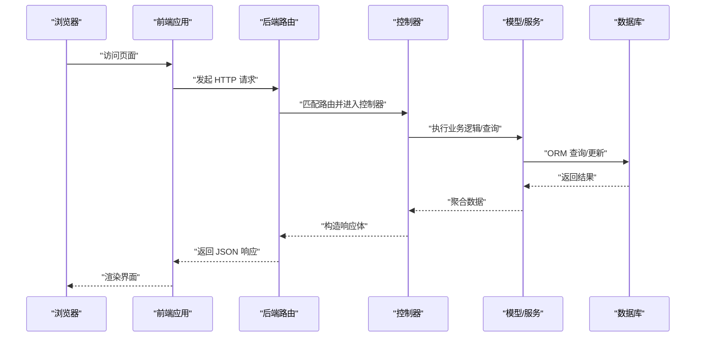
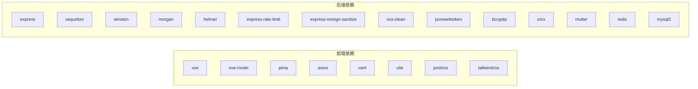

# 代码规范与质量标准

<cite>
**本文引用的文件**
- [backend/package.json](file://backend/package.json)
- [frontend/package.json](file://frontend/package.json)
- [backend/src/app.js](file://backend/src/app.js)
- [backend/src/controllers/userController.js](file://backend/src/controllers/userController.js)
- [frontend/src/main.js](file://frontend/src/main.js)
- [frontend/src/App.vue](file://frontend/src/App.vue)
- [backend/src/middlewares/errorHandler.js](file://backend/src/middlewares/errorHandler.js)
- [backend/src/utils/response.js](file://backend/src/utils/response.js)
- [backend/src/config/jwt.js](file://backend/src/config/jwt.js)
- [backend/src/config/database.js](file://backend/src/config/database.js)
- [backend/src/config/logger.js](file://backend/src/config/logger.js)
- [backend/src/routes/index.js](file://backend/src/routes/index.js)
- [backend/src/routes/userRoutes.js](file://backend/src/routes/userRoutes.js)
- [backend/src/models/User.js](file://backend/src/models/User.js)
- [backend/src/models/UserAddress.js](file://backend/src/models/UserAddress.js)
- [backend/src/services/index.js](file://backend/src/services/index.js)
- [backend/src/validators/index.js](file://backend/src/validators/index.js)
- [backend/src/utils/security.js](file://backend/src/utils/security.js)
- [backend/src/init.js](file://backend/src/init.js)
- [backend/src/utils/order.js](file://backend/src/utils/order.js)
- [backend/src/config/constants.js](file://backend/src/config/constants.js)
- [backend/test-current-hash.js](file://backend/test-current-hash.js)
- [backend/test-login.js](file://backend/test-login.js)
- [backend/test-product-create.js](file://backend/test-product-create.js)
- [backend/check-users.js](file://backend/check-users.js)
- [backend/reset-password.js](file://backend/reset-password.js)
- [backend/diagnose.js](file://backend/diagnose.js)
- [backend/test-bcrypt.js](file://backend/test-bcrypt.js)
- [backend/fix-password.js](file://backend/fix-password.js)
- [backend/check-password.js](file://backend/check-password.js)
- [backend/debug-bcrypt.js](file://backend/debug-bcrypt.js)
- [backend/debug-create-product.js](file://backend/debug-create-product.js)
- [backend/debug-login.js](file://backend/debug-login.js)
- [backend/test-simple.js](file://backend/test-simple.js)
- [backend/test-full.js](file://backend/test-full.js)
- [backend/test-endpoint.js](file://backend/test-endpoint.js)
- [backend/test-env.js](file://backend/test-env.js)
- [backend/test-new-password.js](file://backend/test-new-password.js)
- [backend/test-bcrypt.js](file://backend/test-bcrypt.js)
- [backend/scripts/check_users.js](file://backend/scripts/check_users.js)
- [backend/scripts/reset-admin-password.js](file://backend/scripts/reset-admin-password.js)
- [frontend/vite.config.js](file://frontend/vite.config.js)
- [frontend/postcss.config.js](file://frontend/postcss.config.js)
- [frontend/tailwind.config.js](file://frontend/tailwind.config.js)
- [frontend/src/router/index.js](file://frontend/src/router/index.js)
- [frontend/src/store/user.js](file://frontend/src/store/user.js)
- [frontend/src/store/cart.js](file://frontend/src/store/cart.js)
- [frontend/src/api/adminRequest.js](file://frontend/src/api/adminRequest.js)
- [frontend/src/api/request.js](file://frontend/src/api/request.js)
- [frontend/src/api/index.js](file://frontend/src/api/index.js)
- [frontend/src/views/Home.vue](file://frontend/src/views/Home.vue)
- [frontend/src/views/Login.vue](file://frontend/src/views/Login.vue)
- [frontend/src/views/Cart.vue](file://frontend/src/views/Cart.vue)
- [frontend/src/views/ProductDetail.vue](file://frontend/src/views/ProductDetail.vue)
- [frontend/src/views/Orders.vue](file://frontend/src/views/Orders.vue)
- [frontend/src/views/OrderDetail.vue](file://frontend/src/views/OrderDetail.vue)
- [frontend/src/views/Checkout.vue](file://frontend/src/views/Checkout.vue)
- [frontend/src/views/Profile.vue](file://frontend/src/views/Profile.vue)
- [frontend/src/views/Addresses.vue](file://frontend/src/views/Addresses.vue)
- [frontend/src/views/AddressEdit.vue](file://frontend/src/views/AddressEdit.vue)
- [frontend/src/views/Favorites.vue](file://frontend/src/views/Favorites.vue)
- [frontend/src/views/Coupons.vue](file://frontend/src/views/Coupons.vue)
- [frontend/src/views/Qualifications.vue](file://frontend/src/views/Qualifications.vue)
- [frontend/src/views/RecipeDetail.vue](file://frontend/src/views/RecipeDetail.vue)
- [frontend/src/views/Recipes.vue](file://frontend/src/views/Recipes.vue)
- [frontend/src/admin/views/Home.vue](file://frontend/src/admin/views/Home.vue)
- [frontend/src/admin/views/Login.vue](file://frontend/src/admin/views/Login.vue)
- [frontend/src/admin/views/Products.vue](file://frontend/src/admin/views/Products.vue)
- [frontend/src/admin/views/Orders.vue](file://frontend/src/admin/views/Orders.vue)
- [frontend/src/admin/views/Users.vue](file://frontend/src/admin/views/Users.vue)
- [frontend/src/admin/views/Settings.vue](file://frontend/src/admin/views/Settings.vue)
- [frontend/src/admin/views/Stats.vue](file://frontend/src/admin/views/Stats.vue)
- [frontend/src/admin/views/Banners.vue](file://frontend/src/admin/views/Banners.vue)
- [frontend/src/admin/views/Notices.vue](file://frontend/src/admin/views/Notices.vue)
- [frontend/src/admin/views/Recipes.vue](file://frontend/src/admin/views/Recipes.vue)
- [frontend/src/admin/views/Coupons.vue](file://frontend/src/admin/views/Coupons.vue)
- [frontend/src/layouts/TabbarLayout.vue](file://frontend/src/layouts/TabbarLayout.vue)
- [frontend/src/data/regions.js](file://frontend/src/data/regions.js)
- [frontend/src/style.css](file://frontend/src/style.css)
- [README.md](file://README.md)
</cite>

## 目录
1. 引言
2. 项目结构
3. 核心组件
4. 架构总览
5. 详细组件分析
6. 依赖关系分析
7. 性能考虑
8. 故障排查指南
9. 结论
10. 附录

## 引言
本文件为“趣配鲜”项目的代码规范与质量标准文档，覆盖后端 Node.js/Express、前端 Vue 3 应用的代码风格、可维护性、安全性与性能要求。当前仓库未内置 ESLint、Prettier、TypeScript、JSDoc 等规范配置文件，本文将基于现有代码与工程结构，提出一套可落地的规范建议与实施路径，并给出与实际源码映射的架构图与流程图，帮助团队统一开发体验、提升代码质量与可维护性。

## 项目结构
项目采用前后端分离架构：前端使用 Vite + Vue 3 + Pinia + Vue Router；后端使用 Express + Sequelize + Winston 日志 + Morgan 访问日志。路由、控制器、模型、中间件、工具与配置模块清晰分层，便于规范化管理。

图表来源
- [frontend/src/main.js:1-56](file://frontend/src/main.js#L1-L56)
- [frontend/src/App.vue:1-10](file://frontend/src/App.vue#L1-L10)
- [frontend/src/router/index.js](file://frontend/src/router/index.js)
- [frontend/src/store/user.js](file://frontend/src/store/user.js)
- [frontend/src/store/cart.js](file://frontend/src/store/cart.js)
- [frontend/src/api/adminRequest.js](file://frontend/src/api/adminRequest.js)
- [frontend/src/api/request.js](file://frontend/src/api/request.js)
- [frontend/src/api/index.js](file://frontend/src/api/index.js)
- [backend/src/app.js:1-84](file://backend/src/app.js#L1-L84)
- [backend/src/routes/index.js](file://backend/src/routes/index.js)
- [backend/src/controllers/userController.js:1-409](file://backend/src/controllers/userController.js#L1-L409)
- [backend/src/middlewares/errorHandler.js](file://backend/src/middlewares/errorHandler.js)
- [backend/src/models/User.js](file://backend/src/models/User.js)
- [backend/src/models/UserAddress.js](file://backend/src/models/UserAddress.js)
- [backend/src/config/database.js](file://backend/src/config/database.js)
- [backend/src/config/logger.js](file://backend/src/config/logger.js)

章节来源
- [backend/src/app.js:1-84](file://backend/src/app.js#L1-L84)
- [frontend/src/main.js:1-56](file://frontend/src/main.js#L1-L56)
- [frontend/src/App.vue:1-10](file://frontend/src/App.vue#L1-L10)

## 核心组件
- 前端应用入口负责挂载应用、注入插件与全局状态，统一初始化用户会话。
- 后端应用入口集中配置安全中间件、限流、日志、静态资源与路由前缀，确保一致的安全与可观测性。
- 控制器层封装业务接口逻辑，统一返回体与错误处理，避免在路由中直接处理业务细节。
- 模型层通过 Sequelize 定义实体关系，配合工具与服务层实现复杂业务。
- 中间件层提供认证、错误捕获与兜底处理，保证异常可控与响应一致。

章节来源
- [frontend/src/main.js:1-56](file://frontend/src/main.js#L1-L56)
- [backend/src/app.js:1-84](file://backend/src/app.js#L1-L84)
- [backend/src/controllers/userController.js:1-409](file://backend/src/controllers/userController.js#L1-L409)
- [backend/src/middlewares/errorHandler.js](file://backend/src/middlewares/errorHandler.js)
- [backend/src/models/User.js](file://backend/src/models/User.js)
- [backend/src/models/UserAddress.js](file://backend/src/models/UserAddress.js)

## 架构总览
下图展示了从浏览器到后端数据库的整体调用链路，以及安全与日志的关键节点。

图表来源
- [frontend/src/api/request.js](file://frontend/src/api/request.js)
- [backend/src/routes/index.js](file://backend/src/routes/index.js)
- [backend/src/controllers/userController.js:1-409](file://backend/src/controllers/userController.js#L1-L409)
- [backend/src/models/User.js](file://backend/src/models/User.js)
- [backend/src/config/database.js](file://backend/src/config/database.js)

## 详细组件分析

### 前端应用入口与组件规范
- 应用入口负责创建应用实例、安装路由与状态管理，并初始化用户会话；一次性注册 UI 组件库以减少打包体积与按需加载成本。
- 根组件保持简洁，仅承载路由出口；页面组件遵循单一职责，尽量无副作用。
- 规范要点
  - 入口文件仅做装配，不放业务逻辑。
  - 页面组件使用组合式 API，避免混用选项式 API。
  - 路由守卫与鉴权在中间件/拦截器层处理，不在组件内分散实现。
  - 使用 Pinia 管理全局状态，避免跨层级传递 props。

章节来源
- [frontend/src/main.js:1-56](file://frontend/src/main.js#L1-L56)
- [frontend/src/App.vue:1-10](file://frontend/src/App.vue#L1-L10)
- [frontend/src/router/index.js](file://frontend/src/router/index.js)
- [frontend/src/store/user.js](file://frontend/src/store/user.js)
- [frontend/src/store/cart.js](file://frontend/src/store/cart.js)

### 后端应用入口与安全中间件
- 安全中间件顺序：Helmet → CORS → JSON/URL 编码限制 → XSS 清理 → Mongo 注入清理 → 速率限制 → 访问日志 → 静态资源 → 路由 → 错误处理。
- 环境变量控制：CORS 来源、API 前缀、限流窗口与阈值、日志输出等。
- 规范要点
  - 严格限制请求体大小与编码方式，防止 OOM 与解析异常。
  - 速率限制参数化，便于不同环境调整。
  - 日志统一输出到文件，便于审计与问题定位。

章节来源
- [backend/src/app.js:1-84](file://backend/src/app.js#L1-L84)
- [backend/src/config/logger.js](file://backend/src/config/logger.js)
- [backend/src/config/database.js](file://backend/src/config/database.js)

### 控制器层与统一响应/错误处理
- 控制器方法遵循“输入校验 → 业务处理 → 统一响应/错误”的模式，避免在控制器中直接抛出异常。
- 统一响应工具提供成功与失败两种包装，错误处理中间件负责兜底与日志记录。
- 规范要点
  - 所有接口返回结构一致，字段明确。
  - 错误码与消息国际化预留空间。
  - 对外暴露的错误信息不泄露内部实现细节。

章节来源
- [backend/src/controllers/userController.js:1-409](file://backend/src/controllers/userController.js#L1-L409)
- [backend/src/utils/response.js](file://backend/src/utils/response.js)
- [backend/src/middlewares/errorHandler.js](file://backend/src/middlewares/errorHandler.js)

### 模型与数据访问层
- 使用 Sequelize 定义实体关系，查询时注意分页、排序与条件拼装，避免 N+1 查询。
- 规范要点
  - 字段命名采用下划线风格，与数据库保持一致。
  - 关联查询显式选择需要的列，避免 SELECT *。
  - 复杂查询拆分为服务层方法，便于测试与复用。

章节来源
- [backend/src/models/User.js](file://backend/src/models/User.js)
- [backend/src/models/UserAddress.js](file://backend/src/models/UserAddress.js)
- [backend/src/utils/order.js](file://backend/src/utils/order.js)

### 路由与鉴权中间件
- 路由层只做请求转发与参数提取，鉴权与权限校验在中间件完成。
- 管理端与普通端路由分离，避免权限交叉。
- 规范要点
  - 路由命名清晰，路径语义化。
  - 参数与查询字符串统一校验，拒绝非法输入。

章节来源
- [backend/src/routes/index.js](file://backend/src/routes/index.js)
- [backend/src/routes/userRoutes.js](file://backend/src/routes/userRoutes.js)
- [backend/src/middlewares/auth.js](file://backend/src/middlewares/auth.js)
- [backend/src/middlewares/adminAuth.js](file://backend/src/middlewares/adminAuth.js)

### 配置与常量
- JWT 秘钥、数据库连接、日志级别、API 前缀等通过环境变量管理，避免硬编码。
- 常量集中存放，便于统一维护。
- 规范要点
  - 开发/生产环境差异通过环境变量隔离。
  - 敏感信息不提交到版本库。

章节来源
- [backend/src/config/jwt.js](file://backend/src/config/jwt.js)
- [backend/src/config/constants.js](file://backend/src/config/constants.js)

### 工具与服务
- 工具类提供通用能力（如加密、响应封装、安全清洗），服务层封装业务流程。
- 规范要点
  - 工具函数纯函数化，便于测试。
  - 服务方法粒度适中，避免过长链路。

章节来源
- [backend/src/utils/security.js](file://backend/src/utils/security.js)
- [backend/src/services/index.js](file://backend/src/services/index.js)

### 前端页面与组件
- 页面组件按功能划分，复用布局与通用组件，避免重复逻辑。
- 管理端与用户端页面分离，权限控制在路由层实现。
- 规范要点
  - 组件属性与事件清晰，避免隐式耦合。
  - 表单与列表交互使用状态管理统一处理。

章节来源
- [frontend/src/views/Home.vue](file://frontend/src/views/Home.vue)
- [frontend/src/views/Login.vue](file://frontend/src/views/Login.vue)
- [frontend/src/views/Cart.vue](file://frontend/src/views/Cart.vue)
- [frontend/src/views/Orders.vue](file://frontend/src/views/Orders.vue)
- [frontend/src/views/OrderDetail.vue](file://frontend/src/views/OrderDetail.vue)
- [frontend/src/views/Checkout.vue](file://frontend/src/views/Checkout.vue)
- [frontend/src/admin/views/Home.vue](file://frontend/src/admin/views/Home.vue)
- [frontend/src/admin/views/Products.vue](file://frontend/src/admin/views/Products.vue)
- [frontend/src/admin/views/Orders.vue](file://frontend/src/admin/views/Orders.vue)
- [frontend/src/admin/views/Users.vue](file://frontend/src/admin/views/Users.vue)
- [frontend/src/layouts/TabbarLayout.vue](file://frontend/src/layouts/TabbarLayout.vue)

## 依赖关系分析
- 前端依赖以 Vue 3 生态为主，构建工具链采用 Vite + PostCSS + TailwindCSS。
- 后端依赖以 Web 服务与数据访问为核心，安全与日志中间件完善。
- 测试与开发工具：Jest、Supertest、Nodemon、Vite 插件生态。

图表来源
- [frontend/package.json:1-26](file://frontend/package.json#L1-L26)
- [backend/package.json:1-50](file://backend/package.json#L1-L50)

章节来源
- [frontend/package.json:1-26](file://frontend/package.json#L1-L26)
- [backend/package.json:1-50](file://backend/package.json#L1-L50)

## 性能考虑
- 后端
  - 限制请求体大小与编码，避免内存压力。
  - 合理设置速率限制，保护系统免受突发流量冲击。
  - 数据库查询使用索引与分页，避免全表扫描。
- 前端
  - 按需引入 UI 组件，减少首屏包体。
  - 图片与静态资源使用 CDN 与懒加载。
  - 列表渲染使用虚拟滚动与分页加载。

## 故障排查指南
- 启动失败
  - 检查数据库连接配置与环境变量。
  - 查看日志输出，定位初始化阶段错误。
- 接口异常
  - 使用统一错误响应定位业务异常。
  - 核对路由与控制器方法签名是否一致。
- 安全告警
  - 关注速率限制触发与日志中的异常请求。
  - 检查 XSS 与注入清理中间件是否生效。

章节来源
- [backend/src/app.js:55-84](file://backend/src/app.js#L55-L84)
- [backend/src/middlewares/errorHandler.js](file://backend/src/middlewares/errorHandler.js)
- [backend/src/config/logger.js](file://backend/src/config/logger.js)

## 结论
本规范文档基于现有代码与工程结构，提出了前后端统一的开发与质量标准。建议尽快引入 ESLint、Prettier、JSDoc 与 TypeScript（可选）等工具链，结合 SonarQube/CodeClimate 进行静态分析与覆盖率统计，持续优化代码质量与可维护性。

## 附录

### 代码规范与质量标准（建议）
- ESLint 规则建议
  - 优先采用 eslint:recommended 或 airbnb-base，结合 vue/vue3-essential（前端）。
  - 禁止 console.warn/console.error，统一使用日志库。
  - 函数复杂度阈值：单函数不超过 10 LOC，分支不超过 5。
  - 文件最大行数：不超过 300 行。
- Prettier 格式化
  - 单引号、尾逗号、行末分号按团队约定统一。
  - 缩进 2 空格，行宽 100。
- TypeScript 类型检查（可选）
  - 逐步迁移至 TS，为公共 API 与工具函数补充类型声明。
- JSDoc 注释
  - 公共函数/接口提供简要说明、参数与返回值注释。
- 变量命名约定
  - 常量：UPPER_SNAKE_CASE；变量/函数：camelCase；类/接口：PascalCase。
- 代码质量检查工具
  - Jest + Supertest：单元与集成测试。
  - 覆盖率：函数与分支不低于 80%。
  - SonarQube/CodeClimate：复杂度、重复率、安全漏洞扫描。
- 代码审查标准
  - 复杂度阈值、安全扫描、性能基线（接口响应时间、内存占用）。
- 静态分析与合规
  - 依赖漏洞扫描：npm audit/snyk。
  - 许可证合规：白名单机制，禁止 GPL 系列。
- 重构指南
  - 时机：影响范围小、风险可控；策略：小步快跑、充分测试；保障：自动化测试覆盖、回滚预案。

### 实际代码示例（规范写法 vs 反例）
- 规范写法
  - 控制器方法：先校验输入，再调用服务，最后统一返回。
  - 统一响应：success/error 包裹，错误码与消息一致。
- 反例
  - 在控制器中直接打印日志并抛出异常。
  - 返回结构不统一，字段随意增删。

章节来源
- [backend/src/controllers/userController.js:7-42](file://backend/src/controllers/userController.js#L7-L42)
- [backend/src/utils/response.js](file://backend/src/utils/response.js)
- [backend/src/middlewares/errorHandler.js](file://backend/src/middlewares/errorHandler.js)