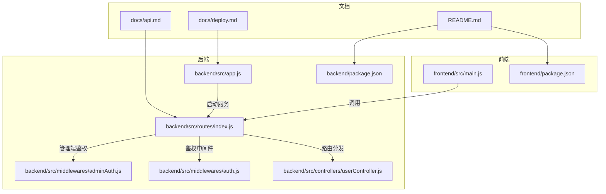
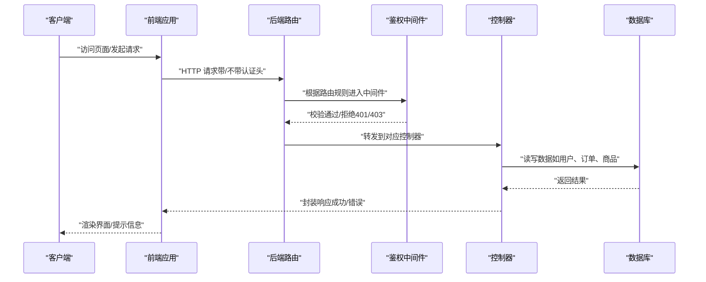
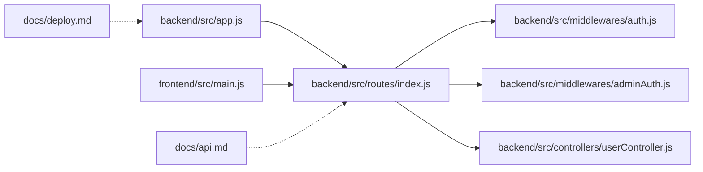

# 团队协作与沟通

<cite>
**本文引用的文件**
- [README.md](file://README.md)
- [backend/src/app.js](file://backend/src/app.js)
- [backend/src/controllers/userController.js](file://backend/src/controllers/userController.js)
- [backend/src/middlewares/auth.js](file://backend/src/middlewares/auth.js)
- [backend/src/middlewares/adminAuth.js](file://backend/src/middlewares/adminAuth.js)
- [backend/src/routes/index.js](file://backend/src/routes/index.js)
- [backend/package.json](file://backend/package.json)
- [frontend/src/main.js](file://frontend/src/main.js)
- [frontend/package.json](file://frontend/package.json)
- [docs/api.md](file://docs/api.md)
- [docs/deploy.md](file://docs/deploy.md)
</cite>

## 目录
1. [引言](#引言)
2. [项目结构](#项目结构)
3. [核心组件](#核心组件)
4. [架构总览](#架构总览)
5. [详细组件分析](#详细组件分析)
6. [依赖关系分析](#依赖关系分析)
7. [性能考量](#性能考量)
8. [故障排查指南](#故障排查指南)
9. [结论](#结论)
10. [附录](#附录)

## 引言
本文件面向“趣配鲜”项目团队，旨在提供一套系统化的团队协作与沟通规范，覆盖角色分工、沟通机制、任务管理、知识共享、冲突解决、远程协作工具配置、培训发展与团队文化等维度。文档同时结合仓库现有架构与文档，给出可落地的流程建议与最佳实践，帮助团队在快速迭代中保持高效协同与高质量交付。

## 项目结构
项目采用前后端分离架构，后端基于 Node.js + Express，前端基于 Vue 3 + Vite，数据库为 MySQL，ORM 使用 Sequelize；文档包含 API 文档与部署指南。整体结构清晰，便于分层协作与职责划分。

图表来源
- [backend/src/app.js:1-84](file://backend/src/app.js#L1-L84)
- [backend/src/routes/index.js:1-27](file://backend/src/routes/index.js#L1-L27)
- [backend/src/middlewares/auth.js:1-181](file://backend/src/middlewares/auth.js#L1-L181)
- [backend/src/middlewares/adminAuth.js:1-77](file://backend/src/middlewares/adminAuth.js#L1-L77)
- [backend/src/controllers/userController.js:1-426](file://backend/src/controllers/userController.js#L1-L426)
- [frontend/src/main.js:1-56](file://frontend/src/main.js#L1-L56)
- [docs/api.md:1-422](file://docs/api.md#L1-L422)
- [docs/deploy.md:1-457](file://docs/deploy.md#L1-L457)
- [README.md:1-235](file://README.md#L1-L235)

章节来源
- [README.md:46-83](file://README.md#L46-L83)
- [backend/src/app.js:17-84](file://backend/src/app.js#L17-L84)
- [frontend/src/main.js:10-56](file://frontend/src/main.js#L10-L56)

## 核心组件
- 后端应用入口负责安全中间件、速率限制、日志、静态资源与路由挂载，并在开发环境进行数据库同步与初始化。
- 路由模块统一挂载各业务路由前缀，提供健康检查端点。
- 鉴权中间件支持强制登录与可选登录两种模式，解析 JWT 并校验用户状态。
- 管理端鉴权中间件对管理员身份与角色进行严格校验。
- 用户控制器实现注册、登录、地址管理、密码管理等用户侧核心能力。
- 前端应用入口完成应用初始化、路由与状态管理挂载，并在启动时尝试恢复用户会话。

章节来源
- [backend/src/app.js:19-54](file://backend/src/app.js#L19-L54)
- [backend/src/routes/index.js:11-24](file://backend/src/routes/index.js#L11-L24)
- [backend/src/middlewares/auth.js:4-148](file://backend/src/middlewares/auth.js#L4-L148)
- [backend/src/middlewares/adminAuth.js:5-50](file://backend/src/middlewares/adminAuth.js#L5-L50)
- [backend/src/controllers/userController.js:8-94](file://backend/src/controllers/userController.js#L8-L94)
- [frontend/src/main.js:16-18](file://frontend/src/main.js#L16-L18)

## 架构总览
下图展示了从客户端到后端服务的整体交互流程，以及鉴权与路由分发的关键节点。

图表来源
- [backend/src/routes/index.js:11-16](file://backend/src/routes/index.js#L11-L16)
- [backend/src/middlewares/auth.js:4-148](file://backend/src/middlewares/auth.js#L4-L148)
- [backend/src/controllers/userController.js:96-111](file://backend/src/controllers/userController.js#L96-L111)
- [backend/src/app.js:49-53](file://backend/src/app.js#L49-L53)

## 详细组件分析

### 角色分工与职责边界
- 开发人员
  - 负责前后端功能开发、单元测试与集成测试、代码审查与质量保障。
  - 关注安全中间件、速率限制、日志与异常处理的正确性与性能。
- 测试人员
  - 制定测试计划与用例，覆盖用户认证、订单流程、地址管理等核心场景。
  - 基于 API 文档进行接口测试，关注错误码与边界条件。
- 运维人员
  - 负责生产环境部署、Nginx 反代、SSL 证书、PM2 进程守护与日志监控。
  - 制定备份策略与故障排查手册，确保服务可用性与稳定性。
- 产品经理
  - 负责需求定义、优先级排序、验收标准制定与跨部门协调。
  - 基于用户行为与业务指标持续优化产品体验。

章节来源
- [docs/api.md:14-422](file://docs/api.md#L14-L422)
- [docs/deploy.md:15-457](file://docs/deploy.md#L15-L457)
- [backend/src/app.js:19-54](file://backend/src/app.js#L19-L54)

### 沟通机制
- 日常站会
  - 每日固定时间进行站立同步，聚焦昨日进展、今日计划与阻塞事项。
- 迭代评审
  - 每个迭代结束进行成果演示与用户故事验收，收集反馈并更新需求池。
- 回顾会议
  - 总结过程中的经验教训，沉淀改进措施并纳入下一轮迭代。
- 异步沟通
  - 使用即时通讯工具进行日常讨论与问题澄清，重要决策记录在共享文档中。

### 任务管理流程
- 需求分析
  - 明确用户价值与验收标准，拆解为可执行的任务卡片。
- 任务分解
  - 将复杂功能拆分为前后端子任务，明确依赖关系与前置条件。
- 优先级排序
  - 基于业务价值与风险评估确定优先级，使用四象限法或 MoSCoW 方法。
- 进度跟踪
  - 通过看板可视化任务状态，每日更新进展，及时暴露风险。

### 知识共享机制
- 技术分享
  - 定期组织分享会，主题涵盖新技术、架构演进、安全加固与性能优化。
- 文档维护
  - API 文档、部署指南与常见问题库保持同步更新，形成知识沉淀。
- 经验总结
  - 每次迭代后输出复盘报告，提炼可复用的最佳实践。
- 最佳实践传播
  - 将编码规范、提交规范与安全实践固化为团队标准。

章节来源
- [docs/api.md:1-422](file://docs/api.md#L1-L422)
- [docs/deploy.md:1-457](file://docs/deploy.md#L1-L457)
- [README.md:212-226](file://README.md#L212-L226)

### 冲突解决流程
- 分歧处理
  - 通过数据与事实驱动讨论，必要时引入第三方专家意见。
- 决策机制
  - 采用“多数决定 + 技术负责人终审”的方式，确保方案可落地。
- 团队共识建立
  - 通过最小可行方案验证假设，逐步达成一致。

### 远程协作工具配置
- 项目管理
  - 使用看板工具（如 Jira/Tapd/Notion）进行任务分配与进度追踪。
- 即时通讯
  - 使用企业微信/钉钉/Slack 等工具进行日常沟通与问题澄清。
- 文档协作
  - 使用飞书/石墨/Confluence 等平台维护 API 文档、设计稿与流程规范。
- 代码与评审
  - Git 工作流配合 Pull Request 审查，确保代码质量与知识传递。

### 培训与发展计划
- 技能提升
  - 制定个人成长计划，围绕前端框架、后端架构、数据库优化与安全合规开展学习。
- 导师制度
  - 新成员配备导师，协助完成环境搭建、代码规范与业务理解。
- 职业规划
  - 结合个人兴趣与团队需求，明确技术/管理双通道发展路径。

### 团队文化建设
- 价值观认同
  - 明确“用户至上、质量第一、敏捷协作、持续改进”的团队价值观。
- 工作氛围
  - 鼓励开放沟通与互相帮助，营造积极向上的工作氛围。
- 凝聚力培养
  - 定期组织团建与技术沙龙，增强团队归属感与专业自豪感。

## 依赖关系分析
后端应用通过路由模块统一接入各业务控制器，并在中间件层完成鉴权与安全控制；前端应用通过路由与状态管理完成页面与数据交互。API 文档与部署指南为协作提供标准化参考。

图表来源
- [backend/src/app.js:17-54](file://backend/src/app.js#L17-L54)
- [backend/src/routes/index.js:11-16](file://backend/src/routes/index.js#L11-L16)
- [backend/src/middlewares/auth.js:4-148](file://backend/src/middlewares/auth.js#L4-L148)
- [backend/src/middlewares/adminAuth.js:5-50](file://backend/src/middlewares/adminAuth.js#L5-L50)
- [backend/src/controllers/userController.js:8-94](file://backend/src/controllers/userController.js#L8-L94)
- [frontend/src/main.js:16-18](file://frontend/src/main.js#L16-L18)
- [docs/api.md:14-422](file://docs/api.md#L14-L422)
- [docs/deploy.md:15-457](file://docs/deploy.md#L15-L457)

章节来源
- [backend/package.json:18-49](file://backend/package.json#L18-L49)
- [frontend/package.json:10-25](file://frontend/package.json#L10-L25)

## 性能考量
- 接口限流
  - 后端已内置速率限制中间件，建议结合业务峰值合理调整窗口与阈值。
- 缓存与数据库优化
  - 可引入 Redis 缓存热点数据，按部署指南添加索引以优化查询性能。
- 静态资源与反向代理
  - Nginx 配置中启用 Gzip 压缩与缓存策略，减少带宽与延迟。
- 监控与日志
  - 使用 PM2 与 Nginx 日志进行性能观测，定期分析慢请求与错误趋势。

章节来源
- [backend/src/app.js:32-39](file://backend/src/app.js#L32-L39)
- [docs/deploy.md:413-441](file://docs/deploy.md#L413-L441)

## 故障排查指南
- 常见问题定位
  - 数据库连接失败：检查服务状态、配置文件与防火墙。
  - 前端页面空白：确认构建产物与 Nginx 路径配置。
  - API 请求失败：检查后端进程状态与端口占用。
  - SSL 证书问题：确认证书续期与域名解析。
- 日志定位
  - 应用日志：PM2 日志查看与滚动。
  - Web 服务器：Nginx 访问与错误日志。
  - 数据库：MySQL 错误日志与慢查询日志。

章节来源
- [docs/deploy.md:392-409](file://docs/deploy.md#L392-L409)
- [docs/deploy.md:328-349](file://docs/deploy.md#L328-L349)

## 结论
通过明确的角色分工、规范的沟通机制、系统化的任务管理与知识共享体系，结合安全与性能优化的最佳实践，“趣配鲜”团队可以在保证交付质量的同时，持续提升协作效率与团队凝聚力。建议尽快落地工具链与流程规范，并在迭代中不断优化。

## 附录
- API 文档与部署指南是团队协作的重要依据，建议定期复盘与更新。
- 建议补充测试用例与自动化测试流程，进一步提升交付稳定性。

章节来源
- [docs/api.md:1-422](file://docs/api.md#L1-L422)
- [docs/deploy.md:1-457](file://docs/deploy.md#L1-L457)