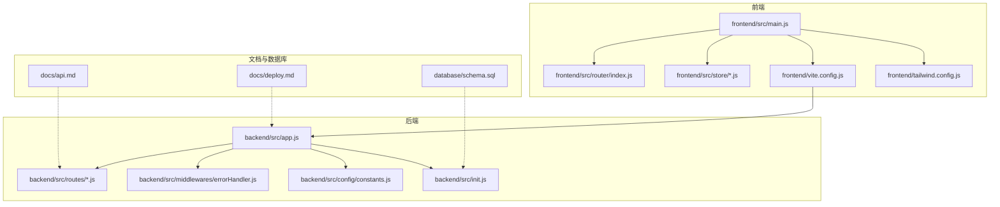
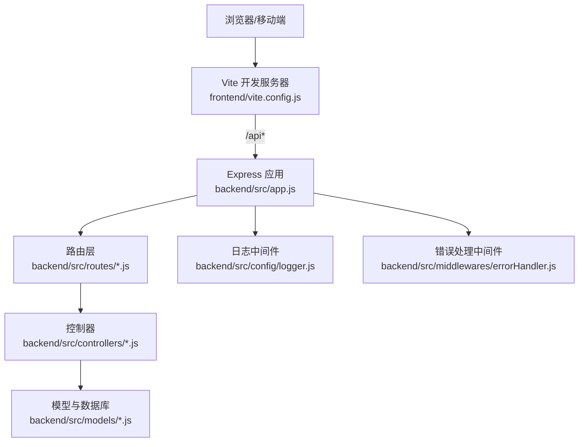
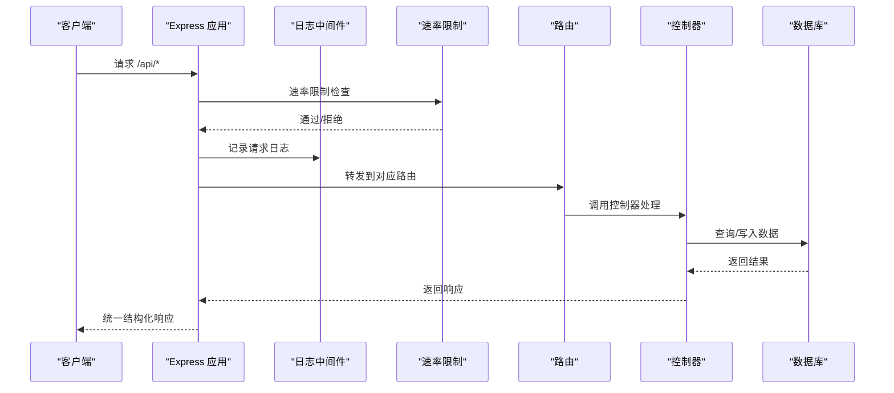
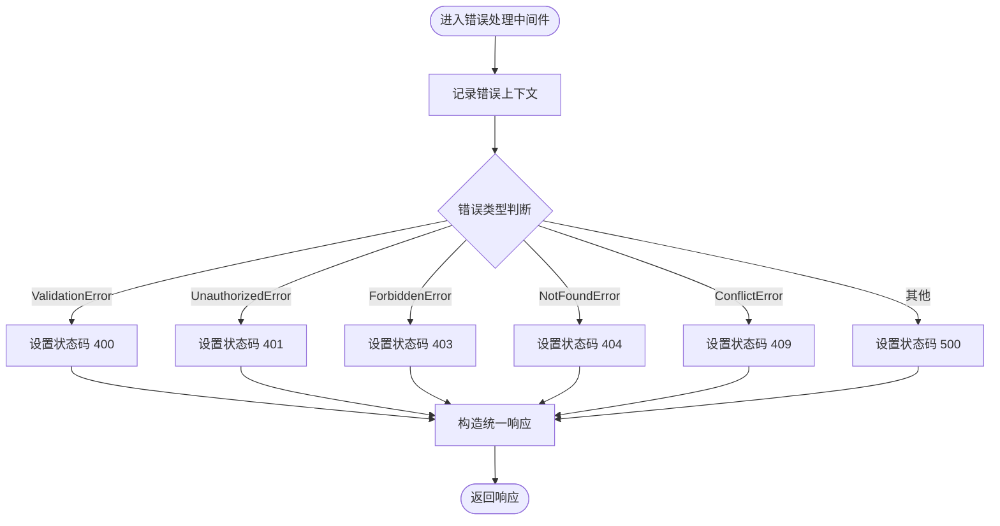
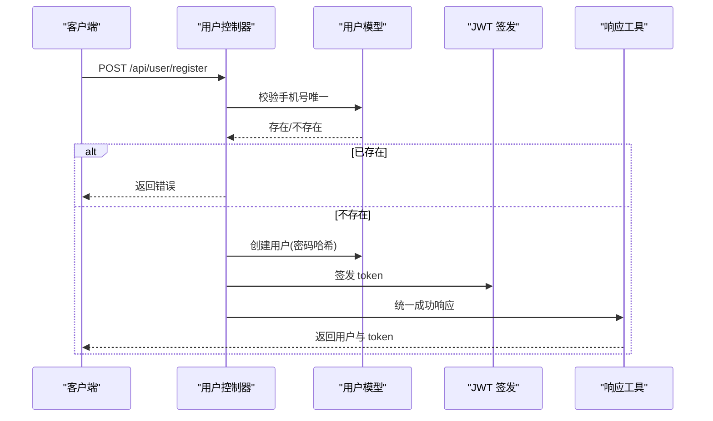
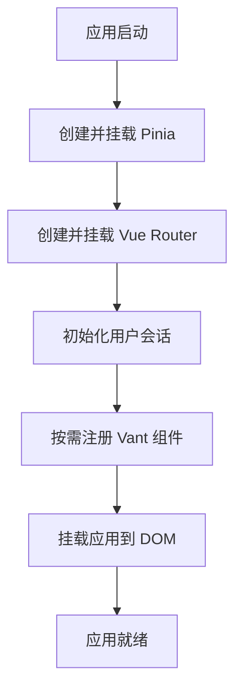
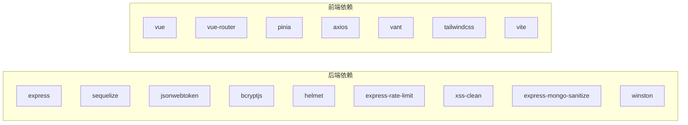

# 开发流程

<cite>
**本文引用的文件**
- [README.md](file://README.md)
- [backend/package.json](file://backend/package.json)
- [frontend/package.json](file://frontend/package.json)
- [backend/src/app.js](file://backend/src/app.js)
- [frontend/vite.config.js](file://frontend/vite.config.js)
- [frontend/tailwind.config.js](file://frontend/tailwind.config.js)
- [backend/src/config/constants.js](file://backend/src/config/constants.js)
- [backend/src/middlewares/errorHandler.js](file://backend/src/middlewares/errorHandler.js)
- [backend/src/controllers/userController.js](file://backend/src/controllers/userController.js)
- [frontend/src/main.js](file://frontend/src/main.js)
- [docs/api.md](file://docs/api.md)
- [docs/deploy.md](file://docs/deploy.md)
- [database/schema.sql](file://database/schema.sql)
</cite>

## 目录
1. 引言
2. 项目结构
3. 核心组件
4. 架构总览
5. 详细组件分析
6. 依赖关系分析
7. 性能考虑
8. 故障排查指南
9. 结论
10. 附录

## 引言
本文件面向趣配鲜项目的开发团队，提供从代码规范、质量标准、版本控制、开发环境、测试策略、代码审查、持续集成、性能监控、文档维护到团队协作的全流程指南。内容基于仓库现有实现与文档进行提炼总结，并结合通用最佳实践给出可落地的建议。

## 项目结构
项目采用前后端分离架构：
- 后端：Node.js + Express，使用数据库连接、日志、中间件、路由与控制器等模块化组织。
- 前端：Vue 3 + Vite，使用 Pinia 状态管理、Vue Router 路由、Vant UI 组件库与 TailwindCSS 样式。
- 文档：API 文档与部署指南位于 docs 目录。
- 数据库：初始化脚本位于 database/schema.sql。

图表来源
- [frontend/src/main.js:1-56](file://frontend/src/main.js#L1-L56)
- [frontend/vite.config.js:1-26](file://frontend/vite.config.js#L1-L26)
- [frontend/tailwind.config.js:1-24](file://frontend/tailwind.config.js#L1-L24)
- [backend/src/app.js:1-84](file://backend/src/app.js#L1-L84)
- [backend/src/middlewares/errorHandler.js:1-47](file://backend/src/middlewares/errorHandler.js#L1-L47)
- [backend/src/config/constants.js:1-132](file://backend/src/config/constants.js#L1-L132)
- [docs/api.md](file://docs/api.md)
- [docs/deploy.md](file://docs/deploy.md)
- [database/schema.sql](file://database/schema.sql)

章节来源
- [README.md:46-83](file://README.md#L46-L83)
- [frontend/src/main.js:1-56](file://frontend/src/main.js#L1-L56)
- [backend/src/app.js:1-84](file://backend/src/app.js#L1-L84)

## 核心组件
- 后端应用入口与安全中间件：负责加载环境变量、启用安全头、CORS、速率限制、日志、静态资源与路由挂载。
- 错误处理中间件：统一捕获异常与 404，输出结构化错误响应。
- 常量与文案配置：集中定义业务状态、文案、品牌信息与分页参数。
- 用户控制器：实现注册、登录、资料管理、地址管理与管理员用户管理等核心业务。
- 前端应用入口：初始化 Pinia、路由、Vant 组件库，并在启动时恢复用户会话。
- 构建与代理：Vite 开发服务器与代理配置，TailwindCSS 内容扫描路径与主题扩展。

章节来源
- [backend/src/app.js:1-84](file://backend/src/app.js#L1-L84)
- [backend/src/middlewares/errorHandler.js:1-47](file://backend/src/middlewares/errorHandler.js#L1-L47)
- [backend/src/config/constants.js:1-132](file://backend/src/config/constants.js#L1-L132)
- [backend/src/controllers/userController.js:1-409](file://backend/src/controllers/userController.js#L1-L409)
- [frontend/src/main.js:1-56](file://frontend/src/main.js#L1-L56)
- [frontend/vite.config.js:1-26](file://frontend/vite.config.js#L1-L26)
- [frontend/tailwind.config.js:1-24](file://frontend/tailwind.config.js#L1-L24)

## 架构总览
系统采用前后端分离模式，前端通过代理访问后端 API。后端通过中间件统一处理安全、日志与错误，路由层承载各业务模块，控制器处理具体业务逻辑，模型与数据库交互由 ORM 管理。

图表来源
- [frontend/vite.config.js:14-19](file://frontend/vite.config.js#L14-L19)
- [backend/src/app.js:41-53](file://backend/src/app.js#L41-L53)
- [backend/src/middlewares/errorHandler.js:1-47](file://backend/src/middlewares/errorHandler.js#L1-L47)

## 详细组件分析

### 后端应用入口与中间件链
- 安全与防护：启用安全头、CORS、XSS 清理、Mongo 注入清理与速率限制。
- 日志：使用 Morgan 输出到统一日志通道。
- 静态资源：上传文件目录静态托管。
- 路由挂载：根据前缀挂载路由，并注册 404 与错误处理中间件。
- 初始化：开发环境下自动同步数据库并执行初始化流程。

图表来源
- [backend/src/app.js:19-53](file://backend/src/app.js#L19-L53)
- [backend/src/middlewares/errorHandler.js:1-47](file://backend/src/middlewares/errorHandler.js#L1-L47)

章节来源
- [backend/src/app.js:1-84](file://backend/src/app.js#L1-L84)
- [backend/src/middlewares/errorHandler.js:1-47](file://backend/src/middlewares/errorHandler.js#L1-L47)

### 错误处理中间件
- 统一记录错误上下文（URL、方法、IP、堆栈）。
- 根据错误类型映射 HTTP 状态码。
- 在生产环境隐藏堆栈细节，开发环境返回堆栈便于定位。

图表来源
- [backend/src/middlewares/errorHandler.js:3-37](file://backend/src/middlewares/errorHandler.js#L3-L37)

章节来源
- [backend/src/middlewares/errorHandler.js:1-47](file://backend/src/middlewares/errorHandler.js#L1-L47)

### 用户控制器（示例：登录/注册）
- 注册：校验手机号唯一性、生成密码哈希、创建用户并签发 JWT。
- 登录：查询用户、校验状态、比对密码、更新最后登录时间、签发 JWT。
- 地址管理：增删改查、默认地址切换。
- 管理员能力：用户列表、详情与状态变更。

图表来源
- [backend/src/controllers/userController.js:7-42](file://backend/src/controllers/userController.js#L7-L42)

章节来源
- [backend/src/controllers/userController.js:1-409](file://backend/src/controllers/userController.js#L1-L409)

### 前端应用入口与组件库初始化
- 初始化 Pinia、Vue Router。
- 按需引入 Vant 组件并全局注册常用组件。
- 启动时恢复用户会话状态。

图表来源
- [frontend/src/main.js:10-55](file://frontend/src/main.js#L10-L55)

章节来源
- [frontend/src/main.js:1-56](file://frontend/src/main.js#L1-L56)

### 构建与代理配置
- Vite 代理：将 /api 前缀转发至后端服务，便于本地联调。
- 构建输出：dist 目录，关闭 SourceMap。
- TailwindCSS：content 扫描路径覆盖 src 下各类文件，主题扩展品牌色与字体。

章节来源
- [frontend/vite.config.js:1-26](file://frontend/vite.config.js#L1-L26)
- [frontend/tailwind.config.js:1-24](file://frontend/tailwind.config.js#L1-L24)

## 依赖关系分析
- 后端依赖：Express、Sequelize、JWT、bcrypt、Morgan、Helmet、Rate Limit、XSS 清理、Mongo Sanitize、Winston 等。
- 前端依赖：Vue 3、Vue Router、Pinia、Axios、Vant、TailwindCSS、Vite。
- 包管理脚本：后端提供 dev/test，前端提供 dev/build/preview。

图表来源
- [backend/package.json:18-40](file://backend/package.json#L18-L40)
- [frontend/package.json:10-24](file://frontend/package.json#L10-L24)

章节来源
- [backend/package.json:1-50](file://backend/package.json#L1-L50)
- [frontend/package.json:1-26](file://frontend/package.json#L1-L26)

## 性能考虑
- 服务器端
  - 速率限制：通过中间件限制请求频率，避免突发流量冲击。
  - 日志：统一输出到日志通道，便于性能与异常追踪。
  - 数据库：开发环境自动同步，生产环境谨慎同步策略。
- 客户端
  - 构建关闭 SourceMap，减少体积与调试成本。
  - 按需引入 UI 组件，降低首屏体积。
- 建议
  - 引入性能监控（如埋点与指标上报），建立基线与告警阈值。
  - 对热点接口增加缓存策略（Redis/CDN），并配合接口幂等设计。
  - 前端路由懒加载与图片资源优化，缩短 TTI/TTI。

章节来源
- [backend/src/app.js:32-45](file://backend/src/app.js#L32-L45)
- [frontend/vite.config.js:21-24](file://frontend/vite.config.js#L21-L24)

## 故障排查指南
- 启动失败
  - 检查数据库连接与初始化日志，确认开发环境自动同步是否成功。
  - 查看日志中间件输出，定位具体错误来源。
- 接口异常
  - 使用错误处理中间件返回的统一结构，结合状态码与消息快速定位。
  - 生产环境隐藏堆栈，开发环境开启以获取详细堆栈。
- 前端联调
  - 确认 Vite 代理配置指向后端服务端口。
  - 检查静态资源目录与上传文件访问权限。

章节来源
- [backend/src/app.js:57-79](file://backend/src/app.js#L57-L79)
- [backend/src/middlewares/errorHandler.js:3-37](file://backend/src/middlewares/errorHandler.js#L3-L37)
- [frontend/vite.config.js:14-19](file://frontend/vite.config.js#L14-L19)

## 结论
本项目已具备清晰的前后端分层与基础安全防护能力。建议在此基础上完善代码规范与质量工具（ESLint/Prettier）、测试体系（单元/集成/端到端）、CI/CD 流水线、性能监控与文档同步机制，以支撑团队高效协作与高质量交付。

## 附录

### 代码规范与质量标准
- 代码风格
  - 使用 ESLint 与 Prettier 统一风格，保持前后端一致。
  - 命名规范：变量 camelCase，组件 PascalCase。
- Git 提交规范
  - 类型：feat、fix、docs、style、refactor。
  - 标题简洁明确，正文描述动机与影响。

章节来源
- [README.md:212-226](file://README.md#L212-L226)

### 版本控制流程
- 分支策略
  - main：稳定发布分支。
  - develop：集成分支，合并特性分支。
  - feature/*：新功能开发。
  - hotfix/*：紧急修复。
- 合并与发布
  - 通过 Pull Request 合并，至少一次审查通过。
  - 发布前执行构建与关键测试，打标签并发布。

章节来源
- [README.md:144-184](file://README.md#L144-L184)

### 开发环境配置
- IDE 设置
  - VS Code 推荐插件：ESLint、Prettier、TailwindCSS Intellisense、Vetur/Volar。
  - 前端：启用保存时格式化与 ESLint 自动修复。
- 调试工具
  - 后端：Node 调试器附加到 dev 进程。
  - 前端：浏览器开发者工具与 Vue DevTools。
- 开发辅助
  - 使用 .env 示例文件配置环境变量。
  - 前端代理指向后端服务端口，便于联调。

章节来源
- [README.md:111-137](file://README.md#L111-L137)
- [frontend/vite.config.js:12-20](file://frontend/vite.config.js#L12-L20)

### 测试策略
- 单元测试
  - 后端：Jest + Supertest，覆盖控制器与工具函数。
  - 前端：Vitest + Vue Test Utils，覆盖组件与 Store。
- 集成测试
  - 路由与控制器端到端验证，模拟数据库与外部依赖。
- 端到端测试
  - 使用 Playwright/Cypress，覆盖关键用户路径（注册、登录、下单）。

章节来源
- [backend/package.json:9](file://backend/package.json#L9)
- [frontend/package.json:5](file://frontend/package.json#L5)

### 代码审查流程
- PR 规范
  - 标题与描述清晰，关联 Issue。
  - 变更最小化，附带测试用例。
- 审查标准
  - 正确性、安全性、可维护性、性能与兼容性。
- 反馈机制
  - 使用评论与线程讨论，要求修改后复核。

章节来源
- [backend/package.json:9](file://backend/package.json#L9)
- [frontend/package.json:5](file://frontend/package.json#L5)

### 持续集成配置
- 流水线阶段
  - 代码检查（ESLint/Prettier）。
  - 单元测试与覆盖率报告。
  - 集成测试与数据库准备。
  - 构建前端产物与后端打包。
  - 部署（开发/预发布/生产）。
- 缓存与并发
  - 缓存依赖安装与构建产物。
  - 并行执行不同阶段以提升效率。

章节来源
- [backend/package.json:9](file://backend/package.json#L9)
- [frontend/package.json:5](file://frontend/package.json#L5)

### 性能监控与优化
- 监控指标
  - 接口耗时、错误率、资源体积、首屏时间。
- 基准测试
  - 使用 Lighthouse/自研脚本对关键页面做基准对比。
- 优化策略
  - 资源压缩与懒加载、缓存策略、CDN 加速、数据库索引优化。

章节来源
- [backend/src/app.js:32-45](file://backend/src/app.js#L32-L45)
- [frontend/vite.config.js:21-24](file://frontend/vite.config.js#L21-L24)

### 文档维护流程
- 文档与代码同步
  - API 变更同步更新 docs/api.md；部署流程更新 docs/deploy.md。
  - 数据库结构变更同步 database/schema.sql。
- 版本化
  - 重要变更在 README 或变更日志中记录。

章节来源
- [docs/api.md](file://docs/api.md)
- [docs/deploy.md](file://docs/deploy.md)
- [database/schema.sql](file://database/schema.sql)

### 团队协作指南
- 沟通机制
  - 使用即时通讯工具与每日站会同步进展。
- 任务分配
  - 通过 Issue/需求卡片分配，明确负责人与截止时间。
- 进度跟踪
  - 使用看板（如 GitHub Projects）可视化任务状态。

章节来源
- [README.md:144-184](file://README.md#L144-L184)

### 开发工具推荐与配置模板
- 前端
  - Vite 插件：@vitejs/plugin-vue、autoprefixer、tailwindcss。
  - 样式：TailwindCSS 内容扫描路径覆盖 src 下各类文件。
- 后端
  - 测试：Jest + Supertest。
  - 开发：nodemon 自动重启。
- 通用
  - .eslintrc 与 .prettierrc 统一风格。
  - .gitignore 忽略 node_modules、logs、.env 等。

章节来源
- [frontend/vite.config.js:1-26](file://frontend/vite.config.js#L1-L26)
- [frontend/tailwind.config.js:3-6](file://frontend/tailwind.config.js#L3-L6)
- [backend/package.json:42-44](file://backend/package.json#L42-L44)