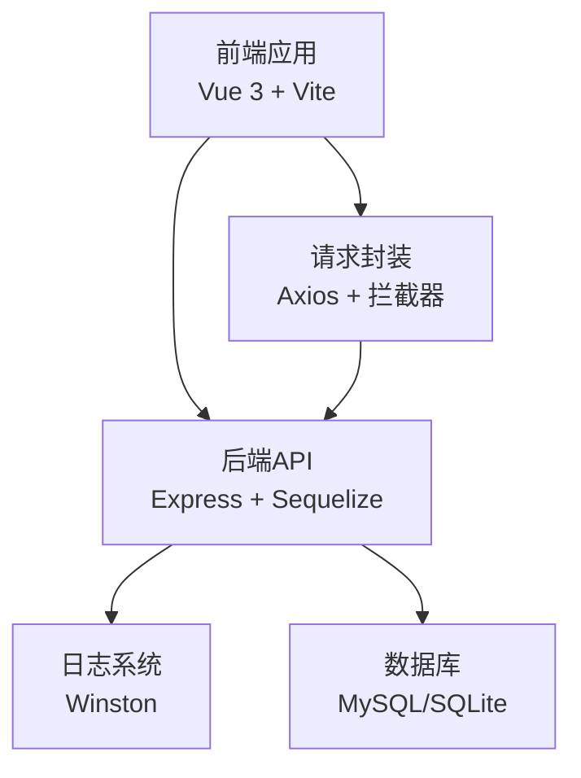
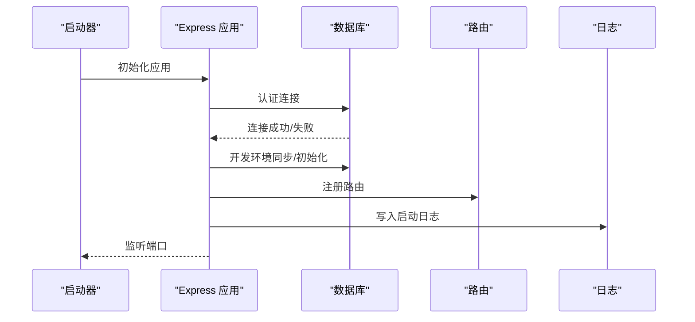
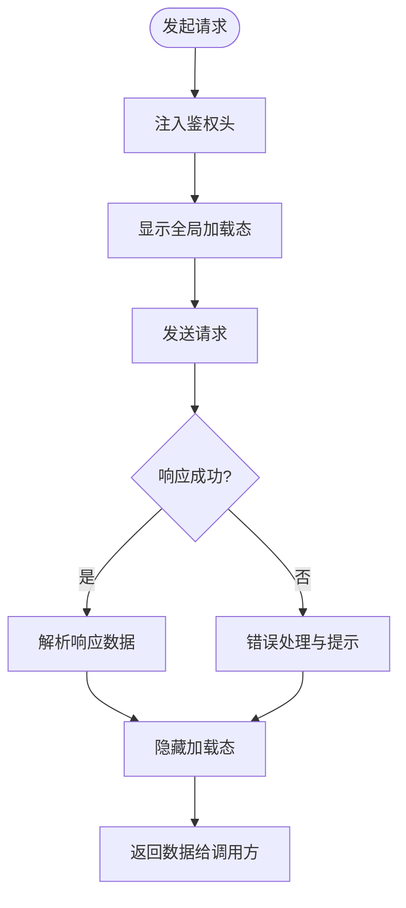
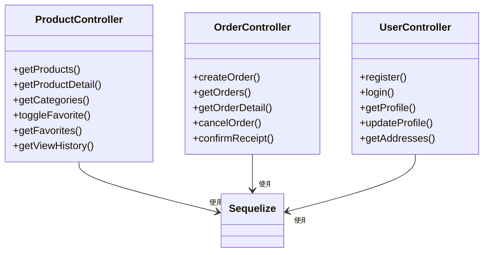
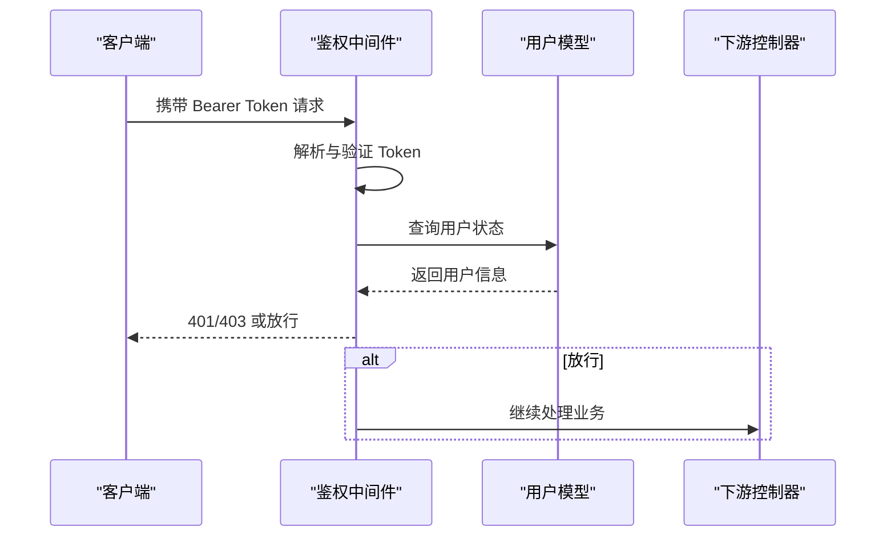
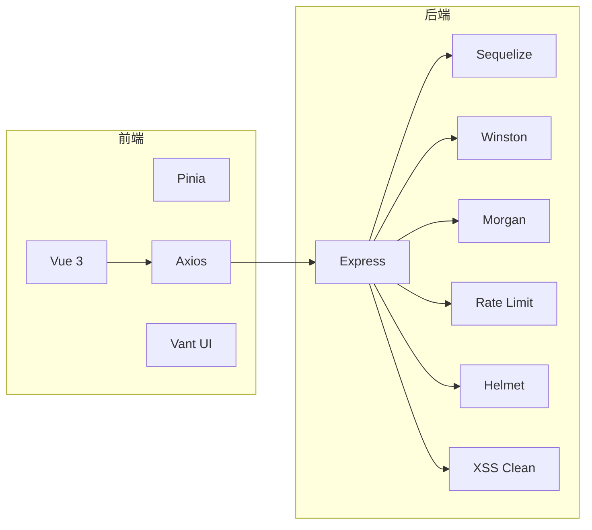

# 性能监控与优化

<cite>
**本文引用的文件**   
- [backend/package.json](file://backend/package.json)
- [frontend/package.json](file://frontend/package.json)
- [backend/src/app.js](file://backend/src/app.js)
- [backend/src/config/logger.js](file://backend/src/config/logger.js)
- [backend/src/middlewares/errorHandler.js](file://backend/src/middlewares/errorHandler.js)
- [backend/src/config/database.js](file://backend/src/config/database.js)
- [backend/src/routes/index.js](file://backend/src/routes/index.js)
- [backend/src/controllers/productController.js](file://backend/src/controllers/productController.js)
- [backend/src/controllers/orderController.js](file://backend/src/controllers/orderController.js)
- [backend/src/controllers/userController.js](file://backend/src/controllers/userController.js)
- [backend/src/middlewares/auth.js](file://backend/src/middlewares/auth.js)
- [backend/src/utils/response.js](file://backend/src/utils/response.js)
- [backend/src/config/constants.js](file://backend/src/config/constants.js)
- [frontend/src/main.js](file://frontend/src/main.js)
- [frontend/src/api/request.js](file://frontend/src/api/request.js)
- [frontend/vite.config.js](file://frontend/vite.config.js)
- [backend/test-endpoint.js](file://backend/test-endpoint.js)
- [backend/test-full.js](file://backend/test-full.js)
</cite>

## 目录
1. [简介](#简介)
2. [项目结构](#项目结构)
3. [核心组件](#核心组件)
4. [架构总览](#架构总览)
5. [详细组件分析](#详细组件分析)
6. [依赖关系分析](#依赖关系分析)
7. [性能考量](#性能考量)
8. [故障排查指南](#故障排查指南)
9. [结论](#结论)
10. [附录](#附录)

## 简介
本文件面向“趣配鲜”项目的性能监控与优化，系统化梳理前后端性能指标、监控方案、基准测试方法、优化策略、工具使用、诊断流程与预算管理，并结合仓库现有实现给出落地建议与可操作的配置示例。

## 项目结构
- 前端采用 Vue 3 + Vite，Axios 封装统一请求拦截与全局加载提示。
- 后端基于 Express + Sequelize，集成日志、速率限制、CORS、XSS/注入防护等中间件。
- 数据库支持 SQLite 与 MySQL，生产环境默认 MySQL，开发环境可切换 SQLite。
- 提供基础的健康检查端点与统一响应格式，便于监控与可观测性接入。

图表来源
- [frontend/src/main.js:1-56](file://frontend/src/main.js#L1-L56)
- [frontend/src/api/request.js:1-111](file://frontend/src/api/request.js#L1-L111)
- [backend/src/app.js:1-84](file://backend/src/app.js#L1-L84)
- [backend/src/config/database.js:1-56](file://backend/src/config/database.js#L1-L56)
- [backend/src/config/logger.js:1-52](file://backend/src/config/logger.js#L1-L52)

章节来源
- [frontend/package.json:1-26](file://frontend/package.json#L1-L26)
- [backend/package.json:1-50](file://backend/package.json#L1-L50)
- [frontend/vite.config.js:1-26](file://frontend/vite.config.js#L1-L26)
- [backend/src/app.js:1-84](file://backend/src/app.js#L1-L84)

## 核心组件
- 前端请求层：统一拦截器、加载态控制、错误提示与鉴权头注入。
- 后端应用层：中间件链（CORS、Helmet、XSS、速率限制、日志）、路由聚合、错误处理。
- 数据访问层：Sequelize 连接池配置、模型查询与分页。
- 统一响应：success/error/paginate 格式，便于前端消费与监控埋点。

章节来源
- [frontend/src/api/request.js:1-111](file://frontend/src/api/request.js#L1-L111)
- [backend/src/app.js:1-84](file://backend/src/app.js#L1-L84)
- [backend/src/config/database.js:1-56](file://backend/src/config/database.js#L1-L56)
- [backend/src/utils/response.js:1-32](file://backend/src/utils/response.js#L1-L32)

## 架构总览
后端启动流程包含数据库连接、开发环境同步与初始化、监听端口；同时挂载路由与中间件，提供健康检查端点。

图表来源
- [backend/src/app.js:55-81](file://backend/src/app.js#L55-L81)
- [backend/src/config/database.js:10-53](file://backend/src/config/database.js#L10-L53)
- [backend/src/config/logger.js:10-40](file://backend/src/config/logger.js#L10-L40)

章节来源
- [backend/src/app.js:1-84](file://backend/src/app.js#L1-L84)

## 详细组件分析

### 前端性能监控与优化
- 页面加载时间：Vite 默认构建关闭 SourceMap，有助于减少体积与解析开销；可通过浏览器 DevTools 的 Performance/Network 面板观测首屏与交互延迟。
- 关键渲染路径：组件按需引入 Vant UI 组件，避免全量引入导致的包体膨胀；建议开启路由级懒加载与图片懒加载。
- 内存与 JS 执行：Axios 拦截器统一处理加载态与错误提示，避免重复请求与无谓重渲染；建议对高频接口做防抖/节流与缓存策略。
- 请求超时与重试：当前 Axios 超时为 30 秒，建议根据业务场景调整并配合指数退避重试。

图表来源
- [frontend/src/api/request.js:29-61](file://frontend/src/api/request.js#L29-L61)

章节来源
- [frontend/src/api/request.js:1-111](file://frontend/src/api/request.js#L1-L111)
- [frontend/vite.config.js:21-24](file://frontend/vite.config.js#L21-L24)

### 后端性能监控与优化
- API 响应时间：建议在中间件链中增加请求耗时统计与慢请求告警；结合 Morgan/Winston 输出到文件/日志系统。
- 数据库查询优化：连接池参数已配置，建议对高频查询建立索引、避免 N+1 查询（如商品详情中的收藏、浏览历史、评论），使用 include 的 where 条件尽量走索引。
- 缓存命中率：可引入 Redis 缓存热点数据（如首页聚合、商品列表分页、分类树），设置合理 TTL 并实现读写一致性策略。
- 服务器资源监控：结合系统监控（CPU/内存/IO）与进程存活健康检查端点，实现自动扩缩容与告警。

图表来源
- [backend/src/controllers/productController.js:1-527](file://backend/src/controllers/productController.js#L1-L527)
- [backend/src/controllers/orderController.js:1-626](file://backend/src/controllers/orderController.js#L1-L626)
- [backend/src/controllers/userController.js:1-426](file://backend/src/controllers/userController.js#L1-L426)

章节来源
- [backend/src/controllers/productController.js:1-527](file://backend/src/controllers/productController.js#L1-L527)
- [backend/src/controllers/orderController.js:1-626](file://backend/src/controllers/orderController.js#L1-L626)
- [backend/src/controllers/userController.js:1-426](file://backend/src/controllers/userController.js#L1-L426)

### 鉴权与错误处理
- 鉴权中间件：从 Authorization 头解析 JWT，校验用户状态与软删除；失败时返回标准化错误。
- 错误处理：统一记录错误上下文（URL、方法、IP、堆栈），按错误类型映射 HTTP 状态码。

图表来源
- [backend/src/middlewares/auth.js:4-148](file://backend/src/middlewares/auth.js#L4-L148)
- [backend/src/middlewares/errorHandler.js:3-44](file://backend/src/middlewares/errorHandler.js#L3-L44)

章节来源
- [backend/src/middlewares/auth.js:1-181](file://backend/src/middlewares/auth.js#L1-L181)
- [backend/src/middlewares/errorHandler.js:1-47](file://backend/src/middlewares/errorHandler.js#L1-L47)

### 数据库与连接池
- MySQL 连接池：最大 20，最小 5，获取超时 60s，空闲 10s；适合中小规模并发。
- SQLite：开发默认，适合本地调试与轻量场景。

章节来源
- [backend/src/config/database.js:38-43](file://backend/src/config/database.js#L38-L43)

### 统一响应与分页
- success/error/paginate：统一返回结构，前端可直接消费；分页字段包含总数、页码、页大小与总页数。

章节来源
- [backend/src/utils/response.js:1-32](file://backend/src/utils/response.js#L1-L32)

### 健康检查与路由聚合
- 健康检查端点：返回服务状态与时间戳，便于探活与编排系统使用。
- 路由聚合：按模块拆分，统一前缀与中间件链。

章节来源
- [backend/src/routes/index.js:18-24](file://backend/src/routes/index.js#L18-L24)
- [backend/src/app.js:49-53](file://backend/src/app.js#L49-L53)

## 依赖关系分析
- 前端依赖：Vue 3、Vue Router、Pinia、Axios、Vant UI、TailwindCSS。
- 后端依赖：Express、Sequelize、Winston、Morgan、Rate Limit、Helmet、CORS、XSS 清理、Multer、Redis、MySQL2 等。

图表来源
- [frontend/package.json:10-16](file://frontend/package.json#L10-L16)
- [backend/package.json:18-39](file://backend/package.json#L18-L39)

章节来源
- [frontend/package.json:1-26](file://frontend/package.json#L1-L26)
- [backend/package.json:1-50](file://backend/package.json#L1-L50)

## 性能考量
- 指标定义
  - 响应时间：后端接口 P95/P99、前端首屏/交互延迟。
  - 吞吐量：每秒请求数（QPS）、并发事务数。
  - 并发用户数：活跃会话数、在线用户峰值。
  - 资源利用率：CPU、内存、磁盘 IO、数据库连接池占用率。
- 前端
  - 使用浏览器 DevTools 的 Performance/Network 面板进行页面加载与交互性能分析。
  - 对高频接口做缓存与去抖/节流，减少不必要的请求。
- 后端
  - 在中间件链中埋点统计请求耗时与错误率，结合日志系统输出到集中式日志平台。
  - 对热点查询建立索引，避免 N+1，使用连接池上限与超时参数平衡吞吐与延迟。
- 基准测试
  - 压力测试：逐步提升并发与请求速率，观察 P95 延迟与错误率拐点。
  - 负载测试：在稳定负载下持续运行，观察内存泄漏与 GC 抖动。
  - 容量规划：基于峰值 QPS 与资源利用率确定扩容阈值与副本数。

## 故障排查指南
- 问题定位
  - 查看 Winston 日志文件（error/combined/access），定位错误堆栈与请求上下文。
  - 结合健康检查端点判断服务存活与数据库连通性。
- 根因分析
  - 鉴权失败：检查 Authorization 头、Token 格式与用户状态。
  - 数据库异常：检查连接池参数、慢查询与锁等待。
  - 前端请求失败：查看拦截器错误分支与 Toast 提示。
- 解决方案
  - 优化慢查询与索引，启用 Redis 缓存热点数据。
  - 调整连接池与超时参数，必要时拆分只读实例。
  - 前端增加重试与降级策略，避免阻塞 UI。

章节来源
- [backend/src/config/logger.js:10-40](file://backend/src/config/logger.js#L10-L40)
- [backend/src/routes/index.js:18-24](file://backend/src/routes/index.js#L18-L24)
- [backend/src/middlewares/auth.js:4-148](file://backend/src/middlewares/auth.js#L4-L148)
- [frontend/src/api/request.js:50-109](file://frontend/src/api/request.js#L50-L109)

## 结论
通过统一的监控指标、日志与错误处理、合理的数据库与缓存策略，以及系统化的基准测试与容量规划，可显著提升“趣配鲜”在高并发场景下的稳定性与用户体验。建议尽快引入 APM 工具与集中式日志平台，完善告警与自动化运维能力。

## 附录

### 性能指标与阈值建议
- 接口 P95 响应时间：< 200ms（核心路径）
- 错误率：< 0.1%
- 并发连接池使用率：< 80%
- 内存增长速率：稳定或可控
- 前端首屏时间：< 1.5s，交互延迟 < 100ms

### 监控与日志配置示例
- 后端日志
  - 文件轮转与级别分离，保留 access.log 以便审计与分析。
  - 建议增加性能埋点：请求耗时、SQL 耗时、缓存命中率。
- 健康检查
  - 使用健康端点对接探针，实现自动重启与扩缩容。

章节来源
- [backend/src/config/logger.js:22-38](file://backend/src/config/logger.js#L22-L38)
- [backend/src/routes/index.js:18-24](file://backend/src/routes/index.js#L18-L24)

### 基准测试与优化实践
- 压力测试
  - 使用压测工具（如 wrk/JMeter）模拟峰值流量，观察系统拐点。
- 负载测试
  - 长时间运行，监控内存与 GC 行为，识别潜在泄漏。
- 优化实践
  - 数据库：索引优化、连接池调优、只读分离。
  - 缓存：热点数据缓存、多级缓存（本地/Redis）、TTL 策略。
  - 前端：懒加载、图片优化、CDN 加速、Service Worker 缓存。

### 工具使用建议
- 前端
  - Chrome DevTools：Performance/Network/Lighthouse。
  - Vite 构建：关闭 sourcemap 以减少体积与解析开销。
- 后端
  - Node.js Profiler：火焰图定位 CPU 热点。
  - APM：如 New Relic/DataDog/Sentry（自建可考虑 OpenTelemetry 生态）。
  - 日志：集中式日志平台（ELK/Graylog）采集 Winston 输出。

章节来源
- [frontend/vite.config.js:21-24](file://frontend/vite.config.js#L21-L24)
- [backend/package.json:18-39](file://backend/package.json#L18-L39)

### 实际监控配置示例（概念性）
- 后端中间件埋点（概念）
  - 在请求进入与退出时记录时间戳，计算耗时并写入日志。
  - 对慢请求（>200ms）打标签并上报 APM。
- 前端拦截器（概念）
  - 统一记录请求 URL、方法、耗时与状态码，上报性能面板。
  - 对 401/403/5xx 自动弹窗提示并记录上下文。

[本节为概念性说明，不直接对应具体源码文件]

### 优化案例（概念性）
- 案例 1：商品详情页加载缓慢
  - 优化：合并收藏/浏览历史/评论查询，使用 Redis 缓存详情页静态片段。
- 案例 2：订单创建接口偶发超时
  - 优化：调整连接池超时，拆分库存扣减与订单创建事务，增加幂等与补偿机制。

[本节为概念性说明，不直接对应具体源码文件]