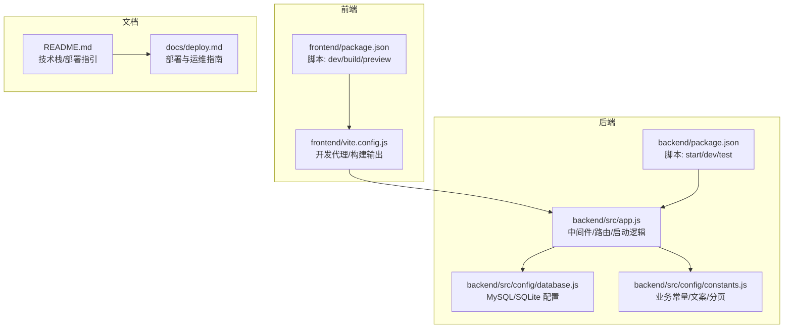
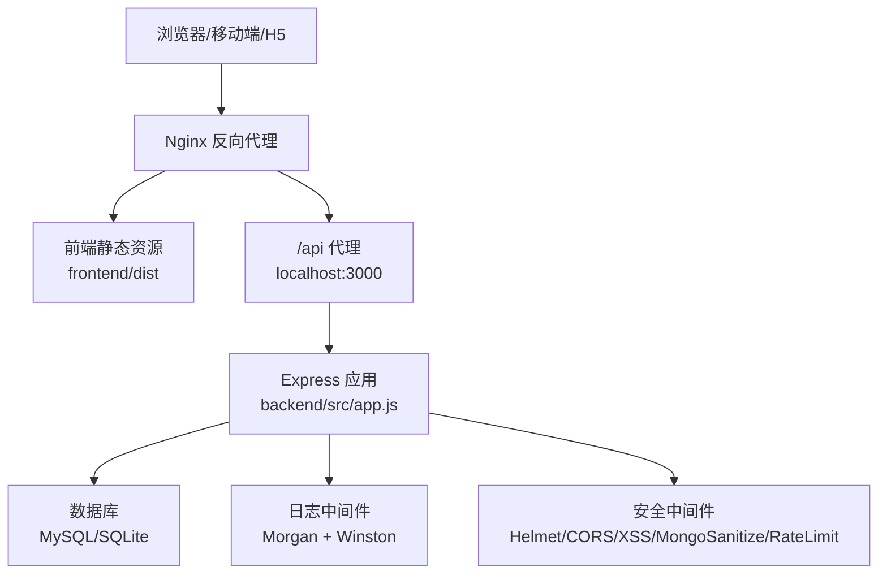
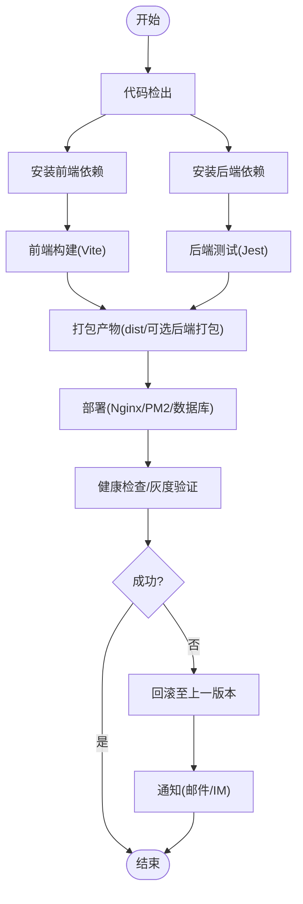
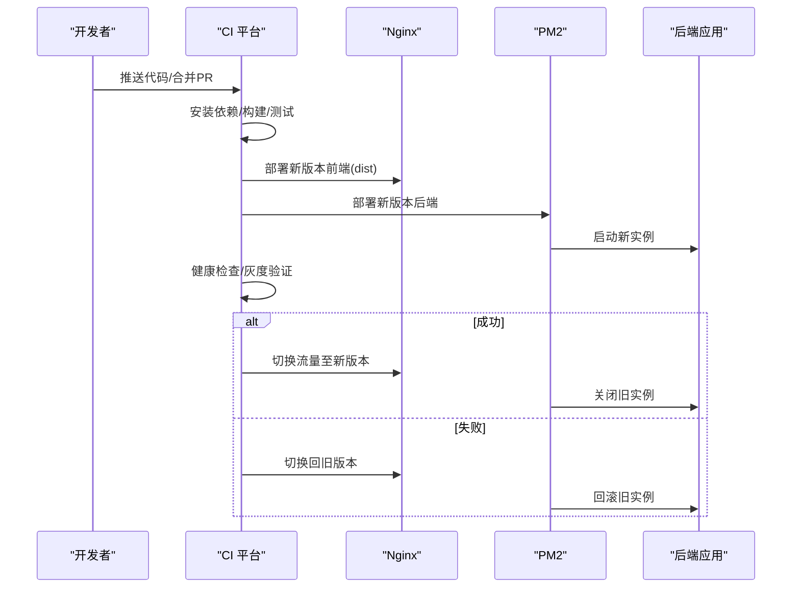
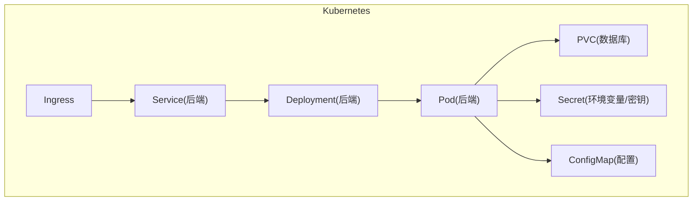
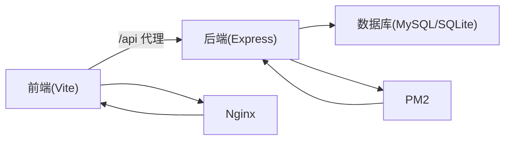

# 持续集成与部署

<cite>
**本文引用的文件**
- [README.md](file://README.md)
- [docs/deploy.md](file://docs/deploy.md)
- [backend/package.json](file://backend/package.json)
- [frontend/package.json](file://frontend/package.json)
- [backend/src/app.js](file://backend/src/app.js)
- [backend/src/config/database.js](file://backend/src/config/database.js)
- [backend/src/config/constants.js](file://backend/src/config/constants.js)
- [frontend/vite.config.js](file://frontend/vite.config.js)
</cite>

## 目录
1. [引言](#引言)
2. [项目结构](#项目结构)
3. [核心组件](#核心组件)
4. [架构总览](#架构总览)
5. [详细组件分析](#详细组件分析)
6. [依赖关系分析](#依赖关系分析)
7. [性能考量](#性能考量)
8. [故障排除指南](#故障排除指南)
9. [结论](#结论)
10. [附录](#附录)

## 引言
本文件面向“趣配鲜”项目的持续集成与部署（CI/CD），围绕流水线设计、构建流程、测试集成、部署策略、环境管理、容器化与Kubernetes部署、监控与告警、发布流程及最佳实践展开，帮助团队实现稳定、可重复、可观测的交付过程。

## 项目结构
- 前端采用 Vue 3 + Vite，构建产物输出至 dist 目录，开发服务器端口 5173，默认代理后端 /api 到本地 3000。
- 后端采用 Node.js + Express，使用 dotenv 加载环境变量，数据库支持 MySQL 与 SQLite 两种模式，开发环境会自动同步模型并初始化数据。
- 文档目录包含部署指南，涵盖服务器环境准备、数据库配置、后端/前端部署、Nginx 反向代理、SSL 证书、安全加固、PM2 运维监控与备份策略等。

**图表来源**
- [frontend/package.json:1-26](file://frontend/package.json#L1-L26)
- [frontend/vite.config.js:1-26](file://frontend/vite.config.js#L1-L26)
- [backend/package.json:1-50](file://backend/package.json#L1-L50)
- [backend/src/app.js:1-84](file://backend/src/app.js#L1-L84)
- [backend/src/config/database.js:1-56](file://backend/src/config/database.js#L1-L56)
- [backend/src/config/constants.js:1-132](file://backend/src/config/constants.js#L1-L132)
- [README.md:144-184](file://README.md#L144-L184)
- [docs/deploy.md:15-170](file://docs/deploy.md#L15-L170)

**章节来源**
- [README.md:46-83](file://README.md#L46-L83)
- [docs/deploy.md:15-170](file://docs/deploy.md#L15-L170)

## 核心组件
- 前端构建与开发
  - 使用 Vite 进行开发与生产构建，开发代理将 /api 请求转发至后端 3000 端口，生产构建关闭 SourceMap。
- 后端启动与数据库
  - Express 应用加载安全中间件、CORS、速率限制、日志、静态资源与路由；根据 NODE_ENV 在开发环境自动同步模型并初始化数据；支持 MySQL 与 SQLite 两种数据库配置。
- 测试与脚本
  - 后端使用 Jest 进行单元/集成测试；前端使用 Vite 的 dev/build/preview 脚本。
- 部署与运维
  - README 提供生产部署步骤（Nginx 反代 + PM2 启动后端），deploy.md 提供更详细的服务器准备、数据库、SSL、安全加固、PM2 监控与备份策略。

**章节来源**
- [frontend/vite.config.js:1-26](file://frontend/vite.config.js#L1-L26)
- [backend/src/app.js:1-84](file://backend/src/app.js#L1-L84)
- [backend/src/config/database.js:1-56](file://backend/src/config/database.js#L1-L56)
- [backend/package.json:1-50](file://backend/package.json#L1-L50)
- [frontend/package.json:1-26](file://frontend/package.json#L1-L26)
- [README.md:144-184](file://README.md#L144-L184)
- [docs/deploy.md:15-170](file://docs/deploy.md#L15-L170)

## 架构总览
下图展示了从浏览器到后端 API，再到数据库的整体链路，以及 Nginx 作为反向代理与静态资源服务的角色。

**图表来源**
- [frontend/vite.config.js:12-24](file://frontend/vite.config.js#L12-L24)
- [backend/src/app.js:17-53](file://backend/src/app.js#L17-L53)
- [backend/src/config/database.js:9-53](file://backend/src/config/database.js#L9-L53)
- [docs/deploy.md:207-264](file://docs/deploy.md#L207-L264)

## 详细组件分析

### CI/CD 流水线设计
- 触发条件
  - 推送主分支、合并 Pull Request、打标签、定时任务（如数据库索引优化脚本）。
- 执行步骤
  - 代码检出 → 依赖安装（前后端分别安装）→ 前端构建（Vite 生产构建）→ 后端编译/构建（如需）→ 单元测试（Jest）→ 产物打包（前端 dist、后端可选打包）→ 部署（PM2/Nginx/数据库迁移）→ 健康检查与灰度发布（可选）。
- 失败处理
  - 失败时立即停止后续步骤，发送通知（邮件/IM），保留构建日志，回滚上一稳定版本（若启用蓝绿/滚动回滚）。

[本图为概念性流程示意，无需图表来源]

### 构建流程配置
- 前端构建
  - 使用 Vite 生产构建，输出目录 dist，关闭 SourceMap；开发代理将 /api 指向后端 3000。
- 后端编译与打包
  - 当前 package.json 中未定义 build 脚本，建议增加 Babel/TypeScript 编译或直接使用 Node.js 运行源码；如需打包，可在 CI 中生成 dist 并配合 PM2 运行。
- 依赖安装
  - 前后端分别执行 npm install；生产环境建议使用 --production 安装后端依赖。
- 打包优化
  - 建议在 CI 中开启压缩、分块与缓存策略（如前端 CDN、HTTP 缓存头）。

**章节来源**
- [frontend/vite.config.js:21-24](file://frontend/vite.config.js#L21-L24)
- [frontend/package.json:5-9](file://frontend/package.json#L5-L9)
- [backend/package.json:6-10](file://backend/package.json#L6-L10)
- [docs/deploy.md:123-128](file://docs/deploy.md#L123-L128)

### 自动化测试集成
- 测试执行
  - 后端使用 Jest；可在 CI 中执行 npm run test，并生成 JUnit XML 报告以便集成平台解析。
- 覆盖率收集
  - Jest 支持覆盖率输出，建议在 CI 中上传覆盖率到覆盖率平台（如 Codecov）。
- 测试报告生成
  - 生成 HTML/XML 报告并归档，便于审阅与审计。

**章节来源**
- [backend/package.json:9](file://backend/package.json#L9)

### 部署策略
- 蓝绿部署
  - 使用两套后端实例（A/B），通过负载均衡器切换流量；前端通过域名或路径区分版本，确保平滑切换。
- 滚动更新
  - PM2 使用 --wait-ready 与优雅关闭，逐实例重启，避免中断。
- 回滚机制
  - 保存最近 N 个版本产物，失败时一键回滚；结合 Nginx 配置快速切换。

[本图为概念性流程示意，无需图表来源]

### 环境管理
- 开发环境
  - NODE_ENV=development，自动同步数据库模型并初始化数据；前端代理指向本地后端。
- 测试/预生产环境
  - 使用独立数据库与环境变量，启用严格 CORS 与速率限制；开启日志与监控。
- 生产环境
  - 使用 PM2 管理进程，Nginx 提供反向代理与静态资源服务，启用 HTTPS 与缓存；数据库使用 MySQL，生产专用账号与只读副本（可选）。

**章节来源**
- [backend/src/app.js:62-69](file://backend/src/app.js#L62-L69)
- [frontend/vite.config.js:12-20](file://frontend/vite.config.js#L12-L20)
- [docs/deploy.md:130-159](file://docs/deploy.md#L130-L159)

### 容器化部署方案
- Docker 镜像构建
  - 前端：基于 Nginx 镜像，将 dist 目录拷贝至 /usr/share/nginx/html；后端：基于 Node:alpine，安装依赖、复制代码、设置工作目录与启动命令。
- Kubernetes 部署
  - 使用 Deployment 管理副本数与滚动更新；Service 暴露后端服务；Ingress 管理外部访问与 TLS；ConfigMap/Secret 管理环境变量与敏感信息。
- 资源管理
  - 为后端设置 CPU/内存请求与限制；持久化数据库使用 PVC；启用水平/垂直 Pod 自动扩缩容（HPA/VPA）。

[本图为概念性架构示意，无需图表来源]

### 监控与告警
- 健康检查
  - Nginx/PM2/应用均提供健康探针；CI 在部署后进行端到端健康检查。
- 性能监控
  - 使用指标采集（如 Prometheus Exporter）、APM（如 New Relic/AppDynamics）与日志聚合（ELK/Fluentd）。
- 异常通知
  - CI 失败、服务不可用、数据库异常、磁盘/内存告警均应触发通知（邮件/IM/短信）。

**章节来源**
- [docs/deploy.md:326-349](file://docs/deploy.md#L326-L349)

### 发布流程
- 版本管理
  - 使用语义化版本（SemVer），打 Tag 触发 CI；变更日志自动生成。
- 发布审批
  - 预生产环境必须经过 QA 审批；生产发布需双人复核与紧急预案。
- 发布后验证
  - 自动化冒烟测试、关键路径回归测试、性能基线对比、业务指标校验。

**章节来源**
- [docs/deploy.md:444-457](file://docs/deploy.md#L444-L457)

### 部署最佳实践
- 零停机部署
  - 使用滚动更新与优雅关闭；前端静态资源长缓存，版本化文件名。
- 数据迁移
  - 使用迁移工具（如 Sequelize Migrations）；先写只读、再切换写入、最后清理旧结构。
- 配置管理
  - 使用 Secret/ConfigMap 管理敏感配置；禁止将密钥写入镜像或代码仓库。

**章节来源**
- [backend/src/config/database.js:9-53](file://backend/src/config/database.js#L9-L53)
- [docs/deploy.md:351-369](file://docs/deploy.md#L351-L369)

## 依赖关系分析
- 前端对后端的依赖
  - 开发阶段通过 Vite 代理 /api 至后端 3000；生产阶段通过 Nginx 将 /api 代理至后端服务。
- 后端对数据库的依赖
  - 通过 Sequelize 连接 MySQL 或 SQLite；开发环境自动同步模型并初始化数据。
- 部署对运维工具的依赖
  - PM2 管理 Node 进程；Nginx 提供反向代理与静态资源；SSL 证书由 Let’s Encrypt 管理。

**图表来源**
- [frontend/vite.config.js:12-20](file://frontend/vite.config.js#L12-L20)
- [backend/src/app.js:47-53](file://backend/src/app.js#L47-L53)
- [backend/src/config/database.js:9-53](file://backend/src/config/database.js#L9-L53)
- [docs/deploy.md:207-264](file://docs/deploy.md#L207-L264)

**章节来源**
- [frontend/vite.config.js:12-20](file://frontend/vite.config.js#L12-L20)
- [backend/src/app.js:47-53](file://backend/src/app.js#L47-L53)
- [backend/src/config/database.js:9-53](file://backend/src/config/database.js#L9-L53)
- [docs/deploy.md:207-264](file://docs/deploy.md#L207-L264)

## 性能考量
- 前端
  - 启用 Gzip/Br 压缩、静态资源长缓存、CDN 加速；构建时移除 SourceMap。
- 后端
  - 启用 Redis 缓存热点数据；数据库建立合适索引；合理设置连接池大小。
- 网络
  - Nginx 启用 SSL/TLS 优化与超时参数调优；CDN 缓存策略与回源优化。

**章节来源**
- [docs/deploy.md:434-441](file://docs/deploy.md#L434-L441)
- [docs/deploy.md:424-432](file://docs/deploy.md#L424-L432)

## 故障排除指南
- 无法连接数据库
  - 检查数据库服务状态、连接参数与权限；确认 .env 配置正确。
- 前端页面空白
  - 检查前端构建是否成功、dist 目录是否存在、Nginx 静态路径配置。
- API 请求失败
  - 检查后端 PM2 状态、端口占用、日志输出；确认 /api 代理配置。
- SSL 证书问题
  - 检查证书路径与权限、自动续期任务；必要时手动执行续期。

**章节来源**
- [docs/deploy.md:392-409](file://docs/deploy.md#L392-L409)

## 结论
通过明确的 CI/CD 流水线、完善的构建与测试策略、稳健的部署与回滚机制、严格的环境隔离与监控告警，以及容器化与 Kubernetes 的标准化部署，趣配鲜项目可实现高质量、低风险、可扩展的持续交付。

## 附录
- CI/CD 配置示例（概念性）
  - 触发：主分支推送、PR 合并、标签创建。
  - 步骤：安装依赖 → 前端构建 → 后端测试 → 产物打包 → 部署 → 健康检查 → 回滚策略。
  - 工具：GitHub Actions/Jenkins/Pipeline；Docker/Kubernetes；Prometheus/Alertmanager；ELK/Slack。
- 发布检查清单（摘自部署文档）
  - 数据库配置完成、后端服务启动正常、前端构建成功、Nginx 配置正确、SSL 证书安装完成、防火墙与安全配置完成、备份策略配置完成、关键业务流程测试完成。

**章节来源**
- [docs/deploy.md:444-457](file://docs/deploy.md#L444-L457)