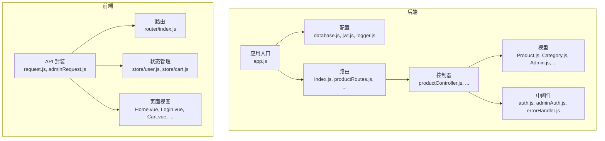
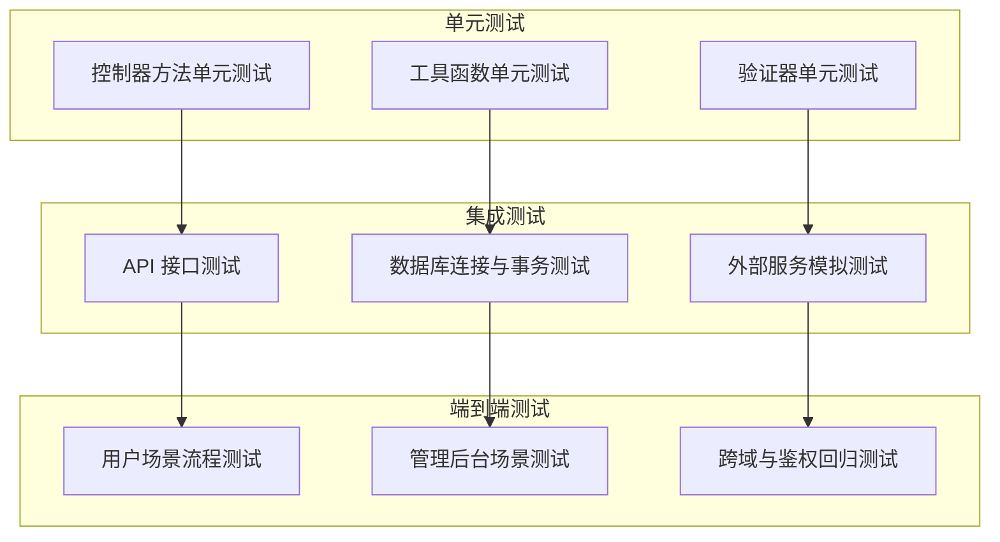
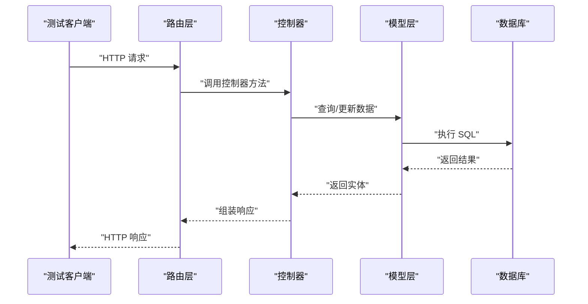
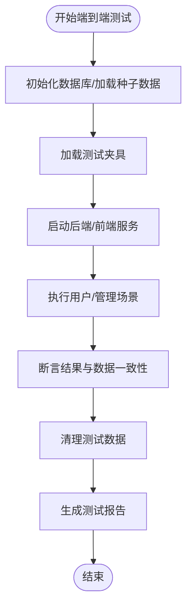
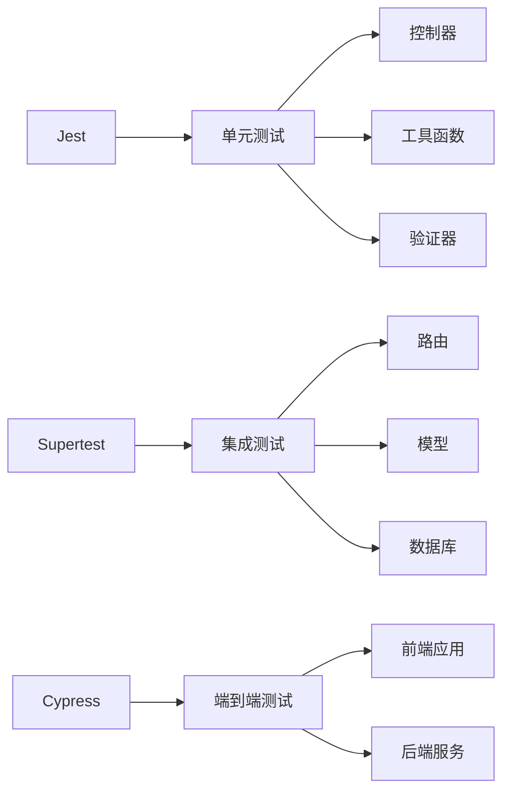

# 测试策略与实施

<cite>
**本文引用的文件**
- [backend/package.json](file://backend/package.json)
- [backend/src/app.js](file://backend/src/app.js)
- [backend/test-endpoint.js](file://backend/test-endpoint.js)
- [backend/test-full.js](file://backend/test-full.js)
- [backend/test-simple.js](file://backend/test-simple.js)
- [backend/src/config/database.js](file://backend/src/config/database.js)
- [backend/src/controllers/productController.js](file://backend/src/controllers/productController.js)
- [backend/src/middlewares/adminAuth.js](file://backend/src/middlewares/adminAuth.js)
- [backend/src/middlewares/auth.js](file://backend/src/middlewares/auth.js)
- [backend/src/models/Product.js](file://backend/src/models/Product.js)
- [backend/src/models/Category.js](file://backend/src/models/Category.js)
- [backend/src/models/Admin.js](file://backend/src/models/Admin.js)
- [backend/src/routes/index.js](file://backend/src/routes/index.js)
- [backend/src/routes/productRoutes.js](file://backend/src/routes/productRoutes.js)
- [backend/src/utils/security.js](file://backend/src/utils/security.js)
- [backend/src/utils/response.js](file://backend/src/utils/response.js)
- [backend/src/utils/order.js](file://backend/src/utils/order.js)
- [backend/src/validators/index.js](file://backend/src/validators/index.js)
- [backend/src/services/index.js](file://backend/src/services/index.js)
- [backend/src/init.js](file://backend/src/init.js)
- [backend/docs/api.md](file://backend/docs/api.md)
- [frontend/package.json](file://frontend/package.json)
- [frontend/vite.config.js](file://frontend/vite.config.js)
- [frontend/src/api/request.js](file://frontend/src/api/request.js)
- [frontend/src/api/adminRequest.js](file://frontend/src/api/adminRequest.js)
- [frontend/src/router/index.js](file://frontend/src/router/index.js)
- [frontend/src/store/user.js](file://frontend/src/store/user.js)
- [frontend/src/store/cart.js](file://frontend/src/store/cart.js)
- [frontend/src/views/Home.vue](file://frontend/src/views/Home.vue)
- [frontend/src/views/Login.vue](file://frontend/src/views/Login.vue)
- [frontend/src/views/Cart.vue](file://frontend/src/views/Cart.vue)
- [frontend/src/views/Checkout.vue](file://frontend/src/views/Checkout.vue)
- [frontend/src/views/Orders.vue](file://frontend/src/views/Orders.vue)
- [frontend/src/views/OrderDetail.vue](file://frontend/src/views/OrderDetail.vue)
- [frontend/src/admin/views/Home.vue](file://frontend/src/admin/views/Home.vue)
- [frontend/src/admin/views/Login.vue](file://frontend/src/admin/views/Login.vue)
- [frontend/src/admin/views/Products.vue](file://frontend/src/admin/views/Products.vue)
- [frontend/src/admin/views/Orders.vue](file://frontend/src/admin/views/Orders.vue)
- [frontend/src/admin/views/Stats.vue](file://frontend/src/admin/views/Stats.vue)
</cite>

## 目录
1. [引言](#引言)
2. [项目结构](#项目结构)
3. [核心组件](#核心组件)
4. [架构总览](#架构总览)
5. [详细组件分析](#详细组件分析)
6. [依赖关系分析](#依赖关系分析)
7. [性能考虑](#性能考虑)
8. [故障排查指南](#故障排查指南)
9. [结论](#结论)
10. [附录](#附录)

## 引言
本文件面向“趣配鲜”项目的测试策略与实施，系统化构建从单元测试、集成测试到端到端测试的金字塔体系，明确各层级比例与适用场景；给出后端 Jest 配置、Mock 策略、测试用例编写与覆盖率目标；提供 API 测试、数据库连接测试与外部服务模拟方案；详述前端 Cypress 配置、用户场景测试与回归策略；说明测试数据管理（准备、快照、隔离）；介绍性能测试（负载、压力、基准）；阐述 CI/CD 中的测试集成、并行执行与报告生成；最后总结测试最佳实践（命名、断言、维护），并以仓库中现有测试脚本作为参考路径。

## 项目结构
后端采用 Express + Sequelize 架构，按职责分层组织：配置、控制器、中间件、模型、路由、工具、验证器、服务等。前端为 Vue3 应用，采用 Vite 构建，路由与状态管理分离，API 层区分用户与管理端请求封装。

图表来源
- [backend/src/app.js:1-84](file://backend/src/app.js#L1-L84)
- [backend/src/config/database.js](file://backend/src/config/database.js)
- [backend/src/controllers/productController.js](file://backend/src/controllers/productController.js)
- [backend/src/middlewares/auth.js](file://backend/src/middlewares/auth.js)
- [backend/src/middlewares/adminAuth.js](file://backend/src/middlewares/adminAuth.js)
- [backend/src/models/Product.js](file://backend/src/models/Product.js)
- [backend/src/models/Category.js](file://backend/src/models/Category.js)
- [backend/src/models/Admin.js](file://backend/src/models/Admin.js)
- [backend/src/routes/index.js](file://backend/src/routes/index.js)
- [backend/src/routes/productRoutes.js](file://backend/src/routes/productRoutes.js)
- [frontend/src/api/request.js](file://frontend/src/api/request.js)
- [frontend/src/api/adminRequest.js](file://frontend/src/api/adminRequest.js)
- [frontend/src/router/index.js](file://frontend/src/router/index.js)
- [frontend/src/store/user.js](file://frontend/src/store/user.js)
- [frontend/src/store/cart.js](file://frontend/src/store/cart.js)

章节来源
- [backend/src/app.js:1-84](file://backend/src/app.js#L1-L84)
- [backend/package.json:1-50](file://backend/package.json#L1-L50)

## 核心组件
- 应用入口与中间件：负责安全头、CORS、速率限制、日志、静态资源与全局错误处理。
- 数据库配置：提供连接池、事务与开发环境下的自动同步与初始化。
- 控制器与路由：暴露业务接口，承载鉴权与业务逻辑。
- 模型：定义实体与关联，配合 Sequelize 实现 ORM。
- 工具与验证：统一响应格式、安全处理与订单辅助逻辑。
- 前端 API 封装：区分用户与管理端请求，集中处理拦截器与错误。

章节来源
- [backend/src/app.js:1-84](file://backend/src/app.js#L1-L84)
- [backend/src/config/database.js](file://backend/src/config/database.js)
- [backend/src/controllers/productController.js](file://backend/src/controllers/productController.js)
- [backend/src/middlewares/auth.js](file://backend/src/middlewares/auth.js)
- [backend/src/middlewares/adminAuth.js](file://backend/src/middlewares/adminAuth.js)
- [backend/src/models/Product.js](file://backend/src/models/Product.js)
- [backend/src/utils/response.js](file://backend/src/utils/response.js)
- [backend/src/utils/security.js](file://backend/src/utils/security.js)
- [backend/src/utils/order.js](file://backend/src/utils/order.js)
- [frontend/src/api/request.js](file://frontend/src/api/request.js)
- [frontend/src/api/adminRequest.js](file://frontend/src/api/adminRequest.js)

## 架构总览
下图展示后端测试金字塔与典型调用链路，突出控制器-路由-模型-数据库的层次关系，并标注测试覆盖重点。

## 详细组件分析

### 单元测试策略与实施
- 测试金字塔比例建议：单元测试占 70%，集成测试占 20%，端到端测试占 10%。单元测试优先保证纯函数、工具函数与控制器内部逻辑的正确性。
- Jest 配置要点：
  - 使用默认配置，结合 devDependencies 中的 jest 与 supertest。
  - 建议启用覆盖率收集，设置阈值（如语句、分支、函数、行覆盖率不低于 80%）。
  - 使用环境变量隔离数据库（如 TEST_DB_URL），避免污染主库。
- Mock 策略：
  - 对外部依赖（数据库、Redis、第三方 HTTP 服务）进行模块级 Mock。
  - 对控制器依赖的工具函数与服务进行函数级 Mock，确保输入输出可控。
- 测试用例编写：
  - 命名遵循“行为+情境+期望”的模式，例如：should_return_error_when_missing_required_fields。
  - 断言策略：优先断言返回值与副作用，其次断言调用次数与参数。
  - 边界条件：空值、超长字符串、负数、非法枚举值等。
- 覆盖率要求：
  - 关键路径必须覆盖，非关键路径可接受较低覆盖率但需有理由说明。
  - 对安全相关逻辑（鉴权、加密、支付）提高覆盖率阈值。

章节来源
- [backend/package.json:41-45](file://backend/package.json#L41-L45)
- [backend/src/utils/response.js](file://backend/src/utils/response.js)
- [backend/src/utils/security.js](file://backend/src/utils/security.js)
- [backend/src/utils/order.js](file://backend/src/utils/order.js)
- [backend/src/validators/index.js](file://backend/src/validators/index.js)

### 集成测试方案
- API 测试：
  - 使用 supertest 直接对路由进行 HTTP 请求，绕过真实网络栈。
  - 覆盖 GET/POST/PUT/DELETE 与鉴权中间件，验证响应码、响应体与头部。
  - 对敏感接口（如商品管理、订单操作）进行鉴权与权限控制测试。
- 数据库连接测试：
  - 在测试前连接 TEST_DB_URL，执行迁移或同步，确保表结构一致。
  - 使用事务包裹测试用例，失败时回滚，保证测试隔离。
- 外部服务模拟：
  - 使用 Mock 服务器或内存数据库（如 sqlite3）替代真实 MySQL/Redis。
  - 对上传、支付、短信等外部依赖进行契约测试（Contract Test）。

图表来源
- [backend/src/routes/index.js](file://backend/src/routes/index.js)
- [backend/src/routes/productRoutes.js](file://backend/src/routes/productRoutes.js)
- [backend/src/controllers/productController.js](file://backend/src/controllers/productController.js)
- [backend/src/models/Product.js](file://backend/src/models/Product.js)
- [backend/src/config/database.js](file://backend/src/config/database.js)

章节来源
- [backend/src/app.js:1-84](file://backend/src/app.js#L1-L84)
- [backend/src/config/database.js](file://backend/src/config/database.js)
- [backend/src/controllers/productController.js](file://backend/src/controllers/productController.js)
- [backend/src/routes/productRoutes.js](file://backend/src/routes/productRoutes.js)

### 端到端测试流程
- 现有脚本参考：
  - 简易端到端脚本：直接启动临时服务器，模拟前端请求，验证商品创建流程与数据落库。
  - 完整端到端脚本：生成 JWT、拉取分类、构造商品数据、调用创建接口、验证与清理。
  - 端点测试脚本：无需认证的端点测试，便于快速定位接口问题。
- 流程设计：
  - 用户场景：登录 -> 查看商品 -> 加入购物车 -> 下单 -> 订单查询。
  - 管理后台场景：登录 -> 商品列表 -> 新增/编辑 -> 上架/下架 -> 订单处理。
  - 回归策略：每次变更后运行全量回归集，重点关注鉴权、支付、库存一致性。
- 数据准备与隔离：
  - 使用数据库快照或种子数据，测试前恢复至干净状态。
  - 为每个测试用例生成唯一标识数据，避免并发冲突。
- 报告与回放：
  - 生成测试报告（HTML/XML），记录截图与日志。
  - 提供失败用例重放脚本，便于本地复现。

章节来源
- [backend/test-simple.js:1-79](file://backend/test-simple.js#L1-L79)
- [backend/test-full.js:1-181](file://backend/test-full.js#L1-L181)
- [backend/test-endpoint.js:1-183](file://backend/test-endpoint.js#L1-L183)

### 测试数据管理
- 准备策略：
  - 使用固定种子数据与动态生成数据相结合，确保边界条件覆盖。
  - 对图片、文件等资源使用占位链接或本地缓存。
- 快照与隔离：
  - 使用事务或数据库快照技术，在测试前后恢复状态。
  - 对并发测试使用命名空间或随机后缀，避免冲突。
- 外部依赖：
  - 对支付、短信、文件上传等外部服务进行 Mock 或沙盒环境对接。

章节来源
- [backend/src/config/database.js](file://backend/src/config/database.js)
- [backend/src/models/Product.js](file://backend/src/models/Product.js)
- [backend/src/models/Category.js](file://backend/src/models/Category.js)
- [backend/src/models/Admin.js](file://backend/src/models/Admin.js)

### 性能测试方法
- 负载测试：
  - 使用压测工具对关键接口（商品列表、下单、支付回调）施加并发负载，观察响应时间与错误率。
- 压力测试：
  - 逐步提升并发与数据规模，定位瓶颈（CPU、内存、数据库连接池、磁盘 IO）。
- 性能基准测试：
  - 建立基线指标（P50/P95 响应时间、吞吐量、资源占用），版本间对比评估。
- 前端性能：
  - 使用 Lighthouse 或 Web Vitals 监控首屏渲染、交互延迟与稳定性。

章节来源
- [backend/src/app.js:32-39](file://backend/src/app.js#L32-L39)
- [backend/src/middlewares/auth.js](file://backend/src/middlewares/auth.js)
- [backend/src/middlewares/adminAuth.js](file://backend/src/middlewares/adminAuth.js)

### 测试自动化与 CI/CD
- 测试集成：
  - 在 CI 中分别执行单元测试、集成测试与端到端测试，失败即阻断发布。
- 并行执行：
  - 将测试任务拆分为多个 Job 并行运行，缩短流水线时长。
- 报告生成：
  - 输出 JUnit XML、Coverage Report 与性能报告，供质量门禁与可视化看板使用。
- 环境隔离：
  - 为不同分支与 PR 提供独立的测试数据库与缓存实例，避免相互影响。

章节来源
- [backend/package.json:6-9](file://backend/package.json#L6-L9)
- [backend/src/app.js:1-84](file://backend/src/app.js#L1-L84)

### 测试最佳实践
- 命名规范：
  - describe 描述功能域，it 描述具体行为，避免模糊描述。
- 断言策略：
  - 先断言结果，再断言副作用；对异步逻辑使用 await 与超时控制。
- 维护策略：
  - 重构测试代码与被测代码同等重要；删除无意义的测试，补充缺失场景。
- 文档与示例：
  - 为复杂流程提供测试用例路径与预期结果说明，便于新成员上手。

章节来源
- [backend/src/utils/response.js](file://backend/src/utils/response.js)
- [backend/src/utils/security.js](file://backend/src/utils/security.js)

## 依赖关系分析
后端测试涉及的关键依赖与耦合如下：

图表来源
- [backend/package.json:41-45](file://backend/package.json#L41-L45)
- [backend/src/controllers/productController.js](file://backend/src/controllers/productController.js)
- [backend/src/utils/response.js](file://backend/src/utils/response.js)
- [backend/src/utils/security.js](file://backend/src/utils/security.js)
- [backend/src/routes/index.js](file://backend/src/routes/index.js)
- [backend/src/models/Product.js](file://backend/src/models/Product.js)
- [backend/src/config/database.js](file://backend/src/config/database.js)

章节来源
- [backend/package.json:41-45](file://backend/package.json#L41-L45)
- [backend/src/controllers/productController.js](file://backend/src/controllers/productController.js)
- [backend/src/utils/response.js](file://backend/src/utils/response.js)
- [backend/src/utils/security.js](file://backend/src/utils/security.js)
- [backend/src/routes/index.js](file://backend/src/routes/index.js)
- [backend/src/models/Product.js](file://backend/src/models/Product.js)
- [backend/src/config/database.js](file://backend/src/config/database.js)

## 性能考虑
- 数据库性能：
  - 为高频查询建立索引，避免 N+1 查询；使用分页与缓存降低压力。
- 接口性能：
  - 控制响应体大小，启用 Gzip 压缩；对大文件上传使用流式处理。
- 并发与限流：
  - 结合速率限制中间件与队列系统，防止突发流量击垮系统。
- 前端性能：
  - 图片懒加载、组件按需加载、路由懒加载，减少初始包体积。

章节来源
- [backend/src/app.js:32-39](file://backend/src/app.js#L32-L39)
- [backend/src/config/database.js](file://backend/src/config/database.js)

## 故障排查指南
- 常见问题定位：
  - 数据库连接失败：检查连接串、端口与凭据；确认容器/服务已就绪。
  - 鉴权失败：核对 JWT 密钥、过期时间与签名算法；检查中间件顺序。
  - 参数校验失败：根据模型验证错误定位字段与约束。
- 现有脚本辅助：
  - 使用端点测试脚本快速验证接口行为与错误信息。
  - 使用完整端到端脚本验证从登录到下单的完整链路。
- 日志与监控：
  - 启用 Morgan 与 Winston 日志，结合错误中间件捕获异常。
  - 对关键接口埋点，统计成功率与耗时分布。

章节来源
- [backend/test-endpoint.js:1-183](file://backend/test-endpoint.js#L1-L183)
- [backend/test-full.js:1-181](file://backend/test-full.js#L1-L181)
- [backend/src/app.js:1-84](file://backend/src/app.js#L1-L84)
- [backend/src/middlewares/errorHandler.js](file://backend/src/middlewares/errorHandler.js)

## 结论
通过构建以单元测试为基础、集成测试为中坚、端到端测试为保障的测试金字塔，结合 Mock 策略、数据快照与隔离、性能与回归测试，能够有效提升“趣配鲜”系统的质量与交付效率。建议在 CI/CD 中强制执行测试并通过率门槛，持续优化测试覆盖率与执行效率。

## 附录
- 测试脚本参考路径：
  - 简易端到端：[backend/test-simple.js:1-79](file://backend/test-simple.js#L1-L79)
  - 完整端到端：[backend/test-full.js:1-181](file://backend/test-full.js#L1-L181)
  - 端点测试：[backend/test-endpoint.js:1-183](file://backend/test-endpoint.js#L1-L183)
- API 文档参考：[backend/docs/api.md](file://backend/docs/api.md)
- 前端配置参考：[frontend/package.json](file://frontend/package.json)
- 前端构建配置：[frontend/vite.config.js](file://frontend/vite.config.js)
- 前端路由与状态：[frontend/src/router/index.js](file://frontend/src/router/index.js), [frontend/src/store/user.js](file://frontend/src/store/user.js), [frontend/src/store/cart.js](file://frontend/src/store/cart.js)
- 前端页面视图：[frontend/src/views/Home.vue](file://frontend/src/views/Home.vue), [frontend/src/views/Login.vue](file://frontend/src/views/Login.vue), [frontend/src/views/Cart.vue](file://frontend/src/views/Cart.vue), [frontend/src/views/Checkout.vue](file://frontend/src/views/Checkout.vue), [frontend/src/views/Orders.vue](file://frontend/src/views/Orders.vue), [frontend/src/views/OrderDetail.vue](file://frontend/src/views/OrderDetail.vue), [frontend/src/admin/views/Home.vue](file://frontend/src/admin/views/Home.vue), [frontend/src/admin/views/Login.vue](file://frontend/src/admin/views/Login.vue), [frontend/src/admin/views/Products.vue](file://frontend/src/admin/views/Products.vue), [frontend/src/admin/views/Orders.vue](file://frontend/src/admin/views/Orders.vue), [frontend/src/admin/views/Stats.vue](file://frontend/src/admin/views/Stats.vue)