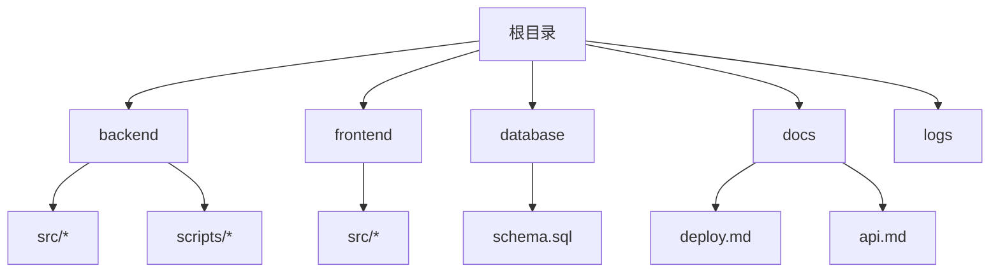
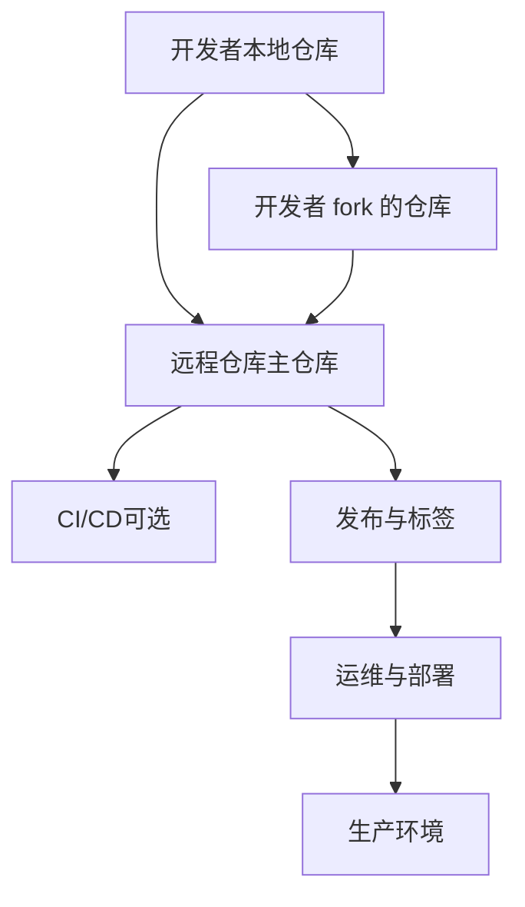
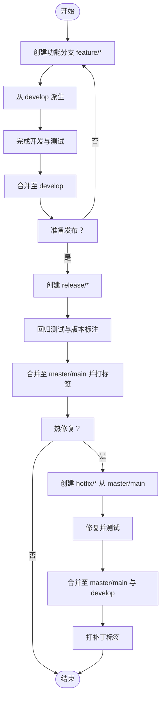
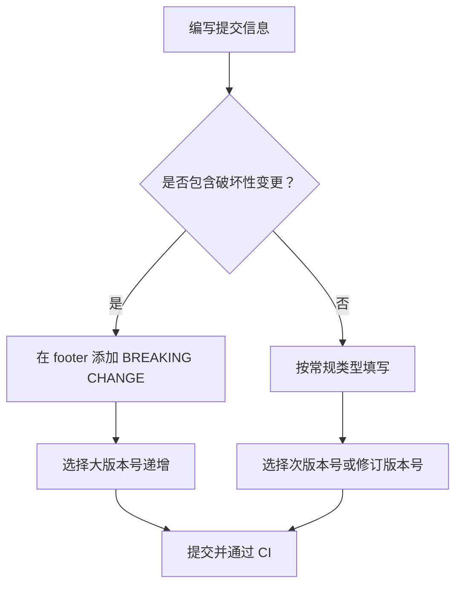
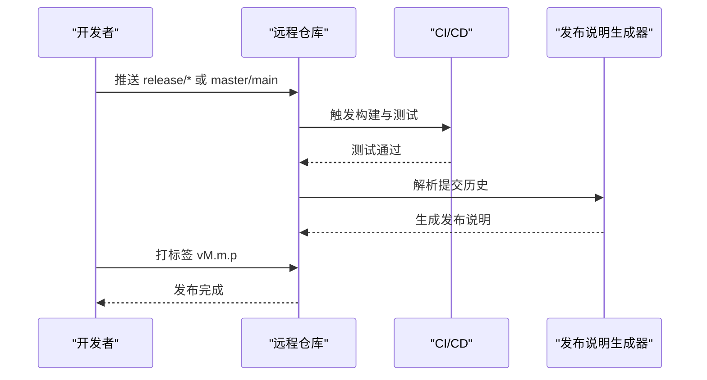
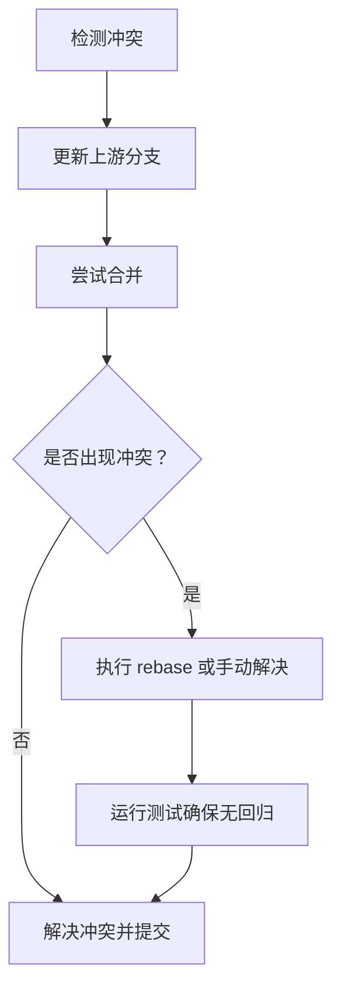
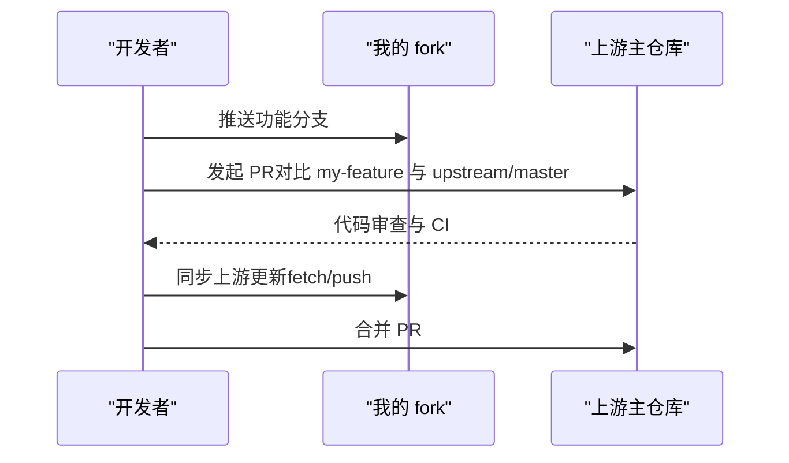
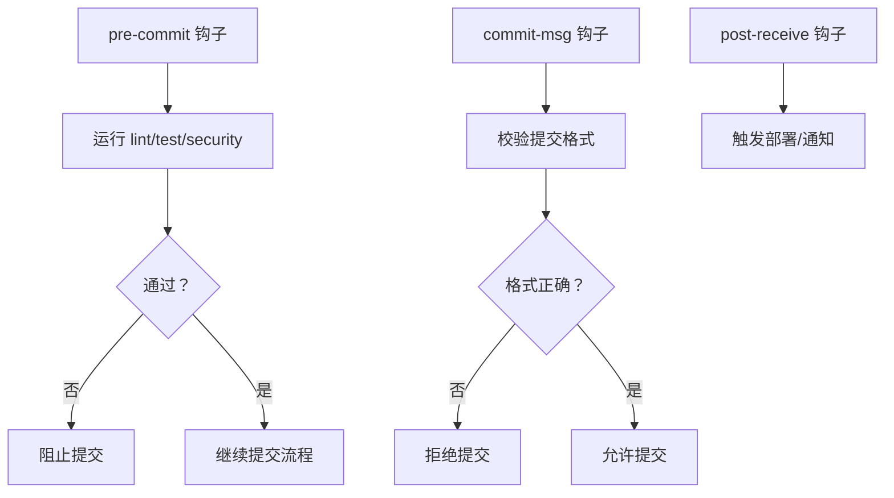
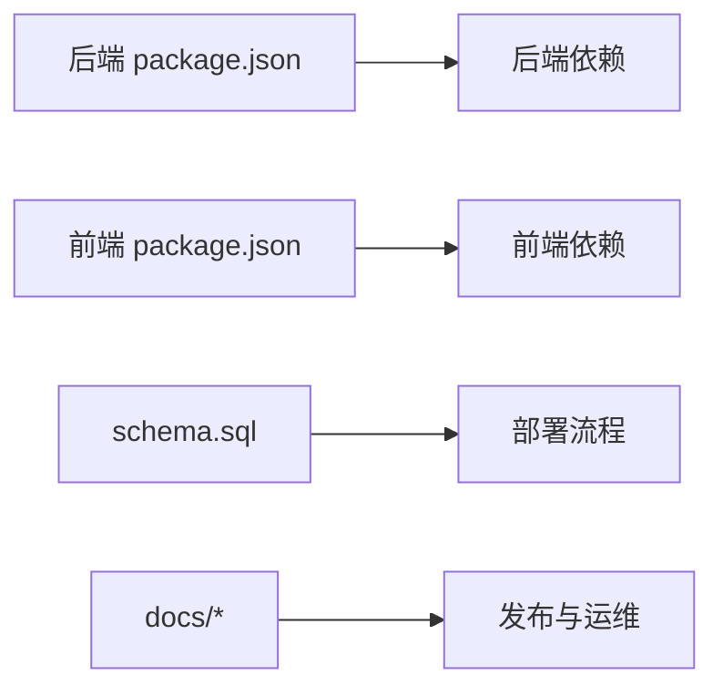

# 版本控制流程

<cite>
**本文引用的文件**
- [README.md](file://README.md)
- [deploy.md](file://docs/deploy.md)
- [package.json（后端）](file://backend/package.json)
- [package.json（前端）](file://frontend/package.json)
- [schema.sql](file://database/schema.sql)
- [check-users.js（后端脚本）](file://backend/scripts/check_users.js)
- [reset-admin-password.js（后端脚本）](file://backend/scripts/reset-admin-password.js)
- [test-env.js（后端测试）](file://backend/test-env.js)
- [api.md](file://docs/api.md)
</cite>

## 目录
1. 引言
2. 项目结构
3. 核心组件
4. 架构总览
5. 详细组件分析
6. 依赖分析
7. 性能考虑
8. 故障排查指南
9. 结论
10. 附录

## 引言
本文件面向“趣配鲜”项目团队，提供一套完整的版本控制流程规范与实践指南，覆盖分支策略、提交规范、标签与发布、冲突解决、远程协作、Git 钩子配置以及常见问题处理。目标是统一开发流程、提升协作效率、保障发布质量。

## 项目结构
项目采用前后端分离架构，包含后端 Node.js 应用、前端 Vue 应用、数据库初始化脚本、部署与 API 文档等。版本控制应围绕以下关键目录进行：
- backend：后端服务、配置、控制器、模型、中间件、工具与脚本
- frontend：前端应用、路由、状态管理、视图与 API 封装
- database：数据库初始化 SQL
- docs：部署与接口文档
- logs：运行日志（非版本控制对象）

章节来源
- [README.md: 95](file://README.md#L95)

## 核心组件
- 分支策略：采用 Git Flow 变体，结合主分支保护与功能/热修复分支命名规范
- 提交规范：约定式提交（Conventional Commits），明确变更类型与破坏性变更声明
- 标签与发布：语义化版本（SemVer）与自动化发布说明生成
- 冲突解决：合并优先，必要时 rebase；保持历史整洁
- 远程协作：fork 工作流、上游同步与推送策略
- Git 钩子：pre-commit、commit-msg、post-receive 等

章节来源
- [deploy.md: 1-379:1-379](file://docs/deploy.md#L1-L379)
- [package.json（后端）](file://backend/package.json)
- [package.json（前端）](file://frontend/package.json)

## 架构总览
下图展示版本控制在项目中的角色与交互关系：开发者本地仓库、远程仓库、CI/CD（如需）、发布与运维。

## 详细组件分析

### 分支策略
- 主分支保护
  - master/main 仅允许通过受控方式合并（如 Pull Request 或 Merge Request），禁止直接推送
  - 强制代码审查与状态检查（CI 通过）
- 功能分支（feature/*）
  - 命名规范：feature/模块名/简短描述，例如 feature/cart/add-promotion
  - 从 develop 或主分支最新代码派生，完成后回并至 develop
- 开发分支（develop）
  - 作为集成分支，持续集成来自各功能分支的更改
- 发布分支（release/*）
  - 当准备发布时从 develop 创建，用于最后的回归测试与版本号标注
  - 发布完成后合并回 master/main 并打上语义化版本标签
- 热修复分支（hotfix/*）
  - 从 master/main 派生，紧急修复后回并至 master/main 与 develop，并打补丁标签

### 提交规范
- 提交消息格式
  - type(scope): subject
  - body（可选）：详细说明变更动机与影响
  - footer（可选）：破坏性变更声明与关闭 Issue
- 变更类型分类
  - feat：新功能
  - fix：缺陷修复
  - docs：文档更新
  - style：不影响逻辑的样式/格式调整
  - refactor：重构（既不修复缺陷也不新增功能）
  - perf：性能优化
  - test：新增或修改测试
  - chore：构建流程、依赖管理等杂项
- 破坏性变更声明
  - 在 footer 明确标注 BREAKING CHANGE: 变更描述
  - 同时提高语义化版本的大版本号

### 标签管理与发布
- 语义化版本（SemVer）
  - MAJOR.MINOR.PATCH
  - 依据提交类型与破坏性变更决定版本号
- 版本标签创建
  - 仅在 master/main 上创建标签
  - 标签名建议使用 vMAJOR.MINOR.PATCH
- 发布说明生成
  - 基于提交历史与标签范围自动生成
  - 可结合工具（如 conventional-changelog）自动化产出

### 冲突解决流程
- 合并优先
  - 优先使用 merge commit，保留完整历史
- rebase 策略
  - 仅在功能分支内部、未公开推送前使用 rebase，保持线性历史
- 历史记录维护
  - 避免对已合并到主分支的历史进行 rebase
  - 如需修改历史，使用 cherry-pick 或新建提交修正

### 远程仓库管理
- fork 工作流
  - 在远程平台 fork 主仓库，本地克隆自己的 fork
  - 通过 Pull Request 合并到主仓库
- 上游同步
  - 定期将主仓库作为上游远程源同步到本地 fork
  - 保持本地功能分支与上游最新同步
- 推送策略
  - 功能分支推送至个人 fork
  - 主分支仅允许受控合并（PR/MR）

### Git 钩子配置
- pre-commit
  - 运行代码风格检查、单元测试与安全扫描
  - 通过后再允许提交
- commit-msg
  - 校验提交消息是否符合约定式提交规范
  - 不合规则拒绝提交
- post-receive（可选）
  - 在远程仓库接收推送后触发部署或通知
  - 与 CI/CD 集成，实现自动化发布

### 实际操作示例
- 新功能开发
  - 从 develop 创建 feature/cart/promotion
  - 开发完成后合并至 develop
- 发布准备
  - 从 develop 创建 release/1.2.3
  - 进行回归测试与版本标注
  - 合并至 master/main 并打标签 v1.2.3
- 紧急修复
  - 从 master/main 创建 hotfix/urgent-fix
  - 合并至 master/main 与 develop，并打补丁标签 v1.2.4

章节来源
- [deploy.md: 1-379:1-379](file://docs/deploy.md#L1-L379)
- [api.md](file://docs/api.md)

## 依赖分析
- 后端与前端均包含 package.json，用于管理依赖与脚本
- 数据库初始化脚本 schema.sql 为部署阶段的关键资产
- 文档目录包含部署与 API 文档，支撑版本发布与运维

章节来源
- [package.json（后端）](file://backend/package.json)
- [package.json（前端）](file://frontend/package.json)
- [schema.sql](file://database/schema.sql)
- [deploy.md: 1-379:1-379](file://docs/deploy.md#L1-L379)

## 性能考虑
- 合理使用分支与合并策略，避免过长的功能分支导致频繁冲突
- 在 CI 中分层测试（单元、集成、端到端），缩短反馈周期
- 使用增量构建与缓存策略，减少重复工作
- 对大型二进制或日志文件，避免纳入版本控制，使用外部存储或忽略规则

## 故障排查指南
- 提交被拒绝（commit-msg 校验失败）
  - 检查提交消息是否符合约定式提交格式
  - 确认破坏性变更声明是否正确
- 合并冲突
  - 同步上游分支，重新合并或执行 rebase
  - 运行测试确保无回归
- 标签缺失或版本不一致
  - 在 master/main 上创建并推送标签
  - 校验发布说明生成是否基于正确标签范围
- 远程推送被拒
  - 确认是否需要先同步上游
  - 检查权限与保护规则

章节来源
- [test-env.js（后端测试）](file://backend/test-env.js)

## 结论
通过统一的分支策略、严格的提交规范、完善的标签与发布流程、清晰的冲突解决机制、规范的远程协作与 Git 钩子配置，“趣配鲜”项目可以显著提升开发效率与发布质量。建议团队在日常工作中持续遵循本指南，并根据项目演进适时调整策略。

## 附录
- 建议工具
  - 提交消息校验：commitlint + @commitlint/config-conventional
  - 变更日志生成：conventional-changelog
  - 代码质量：ESLint/Prettier（前端）与 ESLint/StandardJS（后端）
- 参考文档
  - 部署与运维：见 docs/deploy.md
  - 接口文档：见 docs/api.md