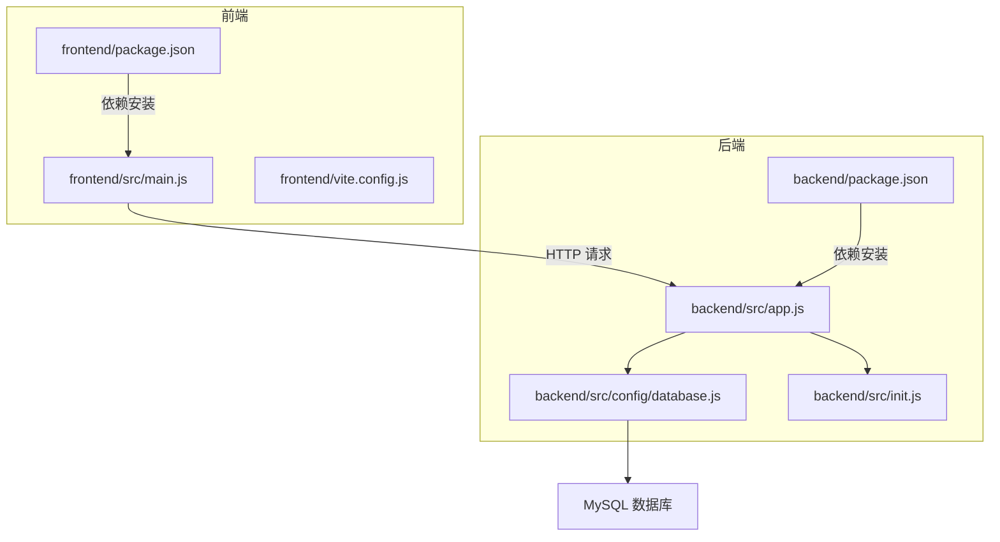
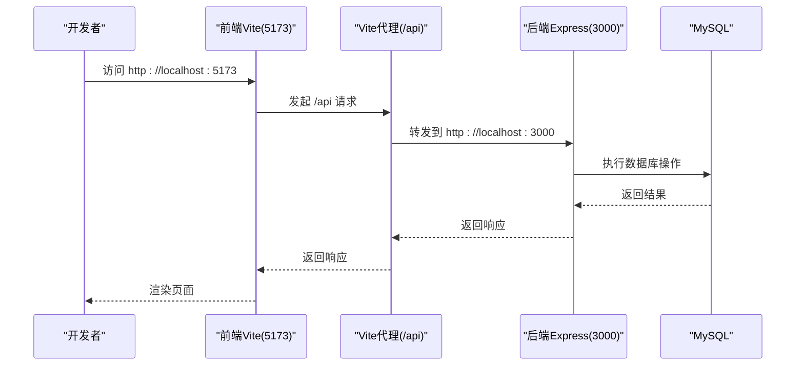
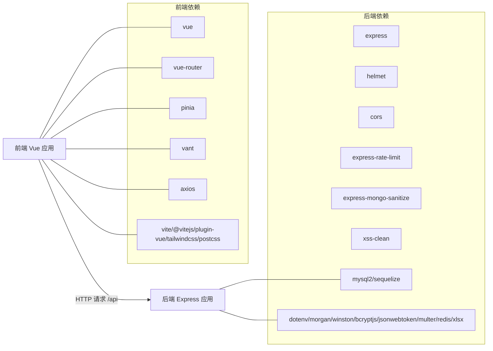

# 快速开始

<cite>
**本文引用的文件**
- [README.md](file://README.md)
- [backend/package.json](file://backend/package.json)
- [frontend/package.json](file://frontend/package.json)
- [backend/src/config/database.js](file://backend/src/config/database.js)
- [frontend/vite.config.js](file://frontend/vite.config.js)
- [backend/src/app.js](file://backend/src/app.js)
- [database/schema.sql](file://database/schema.sql)
- [backend/src/init.js](file://backend/src/init.js)
- [start-backend.cmd](file://start-backend.cmd)
- [start-frontend.cmd](file://start-frontend.cmd)
- [backend/src/config/constants.js](file://backend/src/config/constants.js)
</cite>

## 目录
1. [引言](#引言)
2. [项目结构](#项目结构)
3. [核心组件](#核心组件)
4. [架构总览](#架构总览)
5. [详细组件分析](#详细组件分析)
6. [依赖分析](#依赖分析)
7. [性能考虑](#性能考虑)
8. [故障排除指南](#故障排除指南)
9. [结论](#结论)
10. [附录](#附录)

## 引言
本指南面向首次接触“趣配鲜”项目的开发者，帮助你在最短时间内完成环境准备、数据库初始化、前后端启动与验证，确保开发环境正确配置。你将获得：
- 环境要求与安装步骤（Node.js、MySQL 等）
- 数据库初始化命令与要点
- .env 环境变量配置要点与示例字段
- 前后端分别启动步骤（端口、依赖安装、开发模式）
- 常见问题与排障建议（端口冲突、数据库连接失败等）
- 项目结构快速浏览与关键文件定位
- 完整的安装成功验证步骤

## 项目结构
项目采用前后端分离架构，后端基于 Node.js + Express，前端基于 Vue 3 + Vite，数据库使用 MySQL（Sequelize）。关键目录与职责概览如下：
- backend：后端服务，包含配置、控制器、模型、中间件、路由、工具与初始化脚本
- frontend：前端应用，包含页面视图、API 封装、状态管理、路由与构建配置
- database：数据库初始化脚本 schema.sql
- docs：API 文档与部署指南
- logs：日志目录（由后端日志模块生成）

图表来源
- [backend/src/app.js:1-84](file://backend/src/app.js#L1-L84)
- [backend/src/config/database.js:1-56](file://backend/src/config/database.js#L1-L56)
- [backend/src/init.js:1-502](file://backend/src/init.js#L1-L502)
- [frontend/vite.config.js:1-26](file://frontend/vite.config.js#L1-L26)
- [backend/package.json:1-50](file://backend/package.json#L1-L50)
- [frontend/package.json:1-26](file://frontend/package.json#L1-L26)

章节来源
- [README.md:46-83](file://README.md#L46-L83)
- [backend/package.json:1-50](file://backend/package.json#L1-L50)
- [frontend/package.json:1-26](file://frontend/package.json#L1-L26)

## 核心组件
- 后端应用入口与启动逻辑：负责加载环境变量、初始化安全中间件、路由挂载、数据库连接与同步、监听端口
- 数据库配置：支持 MySQL 与 SQLite 两种模式，生产默认使用 MySQL
- 前端应用入口：初始化 Vue 应用、Pinia、路由与 UI 组件库，并在启动时尝试恢复用户会话
- Vite 开发服务器：默认端口 5173，代理 /api 到后端 3000 端口
- 数据库初始化：开发环境下自动创建管理员、测试用户、分类、商品、食谱、Banner、公告、资质与协议等基础数据

章节来源
- [backend/src/app.js:1-84](file://backend/src/app.js#L1-L84)
- [backend/src/config/database.js:1-56](file://backend/src/config/database.js#L1-L56)
- [frontend/src/main.js:1-56](file://frontend/src/main.js#L1-L56)
- [frontend/vite.config.js:1-26](file://frontend/vite.config.js#L1-L26)
- [backend/src/init.js:1-502](file://backend/src/init.js#L1-L502)

## 架构总览
后端通过 Express 提供 RESTful API，前端通过 Vite 提供开发服务器并通过代理转发 /api 请求到后端。数据库通过 Sequelize 连接 MySQL。

图表来源
- [frontend/vite.config.js:14-19](file://frontend/vite.config.js#L14-L19)
- [backend/src/app.js:49-74](file://backend/src/app.js#L49-L74)

章节来源
- [README.md:139-143](file://README.md#L139-L143)
- [frontend/vite.config.js:12-20](file://frontend/vite.config.js#L12-L20)
- [backend/src/app.js:49-74](file://backend/src/app.js#L49-L74)

## 详细组件分析

### 环境准备与安装
- 环境要求
  - Node.js >= 18.x
  - npm >= 9.x
  - MySQL >= 8.0
- 安装步骤
  - 克隆仓库后，分别在 backend 与 frontend 目录执行依赖安装
  - Windows 用户可使用仓库提供的启动脚本，自动设置 Node 路径并启动服务

章节来源
- [README.md:85-90](file://README.md#L85-L90)
- [README.md:115-125](file://README.md#L115-L125)
- [start-backend.cmd:1-4](file://start-backend.cmd#L1-L4)
- [start-frontend.cmd:1-4](file://start-frontend.cmd#L1-L4)

### 数据库初始化
- 创建数据库与导入 schema.sql
  - 登录 MySQL，创建数据库并使用 source 命令导入 schema.sql
- 初始化完成后，后端开发模式会自动同步模型并执行初始化脚本，创建管理员、测试用户、分类、商品、食谱、Banner、公告、资质与协议等基础数据

章节来源
- [README.md:100-109](file://README.md#L100-L109)
- [database/schema.sql:1-11](file://database/schema.sql#L1-L11)
- [backend/src/init.js:17-31](file://backend/src/init.js#L17-L31)

### .env 环境变量配置
- 后端 .env 示例字段（按需补充）
  - 数据库相关：DB_NAME、DB_USER、DB_PASSWORD、DB_HOST、DB_PORT、DB_CONNECTION、DB_FILENAME
  - 服务器相关：PORT、API_PREFIX、CORS_ORIGIN、NODE_ENV
  - 安全与限流：RATE_LIMIT_WINDOW_MS、RATE_LIMIT_MAX_REQUESTS
  - 日志与静态资源：NODE_ENV、API_PREFIX
- 注意事项
  - 若 DB_CONNECTION 设置为 sqlite，将使用 sqlite 文件作为数据源
  - 若 DB_CONNECTION 未设置或为 mysql，将使用 MySQL 配置

章节来源
- [backend/src/config/database.js:10-53](file://backend/src/config/database.js#L10-L53)
- [backend/src/app.js:1-16](file://backend/src/app.js#L1-L16)

### 前后端分别启动
- 后端（端口 3000）
  - 进入 backend 目录，安装依赖后运行开发模式
  - 或使用 start-backend.cmd 自动设置 Node 路径并启动
- 前端（端口 5173）
  - 进入 frontend 目录，安装依赖后运行开发模式
  - 或使用 start-frontend.cmd 自动设置 Node 路径并启动
- 端口与代理
  - 前端默认端口 5173，Vite 将 /api 代理到后端 3000 端口
  - 后端默认端口 3000，可通过环境变量 PORT 修改

章节来源
- [README.md:127-137](file://README.md#L127-L137)
- [frontend/vite.config.js:12-20](file://frontend/vite.config.js#L12-L20)
- [backend/src/app.js:55-56](file://backend/src/app.js#L55-L56)
- [start-backend.cmd:1-4](file://start-backend.cmd#L1-L4)
- [start-frontend.cmd:1-4](file://start-frontend.cmd#L1-L4)

### 关键文件与职责速览
- 后端
  - app.js：应用入口、中间件、路由、端口监听、数据库连接与同步
  - database.js：数据库连接配置（MySQL/SQLite）
  - init.js：开发环境下的数据初始化（管理员、用户、分类、商品、食谱、Banner、公告、资质、协议）
  - constants.js：业务常量（订单状态、优惠券类型、管理员角色等）
- 前端
  - main.js：应用初始化、Pinia、路由、UI 组件注册、用户会话恢复
  - vite.config.js：开发服务器端口与 /api 代理配置

章节来源
- [backend/src/app.js:1-84](file://backend/src/app.js#L1-L84)
- [backend/src/config/database.js:1-56](file://backend/src/config/database.js#L1-L56)
- [backend/src/init.js:1-502](file://backend/src/init.js#L1-L502)
- [backend/src/config/constants.js:1-132](file://backend/src/config/constants.js#L1-L132)
- [frontend/src/main.js:1-56](file://frontend/src/main.js#L1-L56)
- [frontend/vite.config.js:1-26](file://frontend/vite.config.js#L1-L26)

## 依赖分析
- 后端依赖
  - Web 框架与安全：express、helmet、cors、xss-clean、express-rate-limit、express-mongo-sanitize
  - 数据库：mysql2、sequelize
  - 工具：dotenv、morgan、winston、bcryptjs、jsonwebtoken、multer、redis、xlsx
  - 开发工具：jest、nodemon、supertest
- 前端依赖
  - 框架与 UI：vue、vue-router、pinia、vant
  - 构建与样式：vite、@vitejs/plugin-vue、tailwindcss、postcss
  - HTTP：axios
  - 开发工具：@vitejs/plugin-vue、autoprefixer、tailwindcss、vite

图表来源
- [backend/package.json:18-44](file://backend/package.json#L18-L44)
- [frontend/package.json:10-24](file://frontend/package.json#L10-L24)

章节来源
- [backend/package.json:1-50](file://backend/package.json#L1-L50)
- [frontend/package.json:1-26](file://frontend/package.json#L1-L26)

## 性能考虑
- 数据库连接池：后端配置了最大连接数、最小连接数、获取超时与空闲超时，适合中等规模并发
- 限流策略：默认窗口与最大请求数可在 .env 中调整，避免突发流量导致服务过载
- 日志级别：开发环境开启日志输出，生产环境建议关闭或降级
- 前端代理：开发阶段使用 Vite 代理减少跨域与调试成本

章节来源
- [backend/src/config/database.js:38-43](file://backend/src/config/database.js#L38-L43)
- [backend/src/app.js:32-39](file://backend/src/app.js#L32-L39)

## 故障排除指南
- 端口冲突
  - 后端端口：若 3000 已被占用，可在 .env 中设置 PORT 为其他可用端口
  - 前端端口：若 5173 已被占用，可在 vite.config.js 中修改 server.port
- 数据库连接失败
  - 确认数据库已创建且 schema.sql 已导入
  - 检查 .env 中 DB_* 配置（DB_NAME、DB_USER、DB_PASSWORD、DB_HOST、DB_PORT）
  - 若使用 SQLite，确认 DB_CONNECTION 设为 sqlite 并提供 DB_FILENAME
- 代理无效或 404
  - 确认前端 Vite 代理配置指向后端 3000 端口
  - 确认后端 API 前缀与前端请求一致（默认 /api）
- 启动脚本无法找到 Node
  - 使用仓库提供的 start-backend.cmd 与 start-frontend.cmd，它们已内置 Node 路径

章节来源
- [frontend/vite.config.js:12-20](file://frontend/vite.config.js#L12-L20)
- [backend/src/app.js:49-74](file://backend/src/app.js#L49-L74)
- [backend/src/config/database.js:10-53](file://backend/src/config/database.js#L10-L53)
- [start-backend.cmd:1-4](file://start-backend.cmd#L1-L4)
- [start-frontend.cmd:1-4](file://start-frontend.cmd#L1-L4)

## 结论
按照本指南完成环境准备、数据库初始化与前后端启动后，你将拥有一个可运行的开发环境。建议在开发过程中关注数据库连接、端口占用与代理配置，遇到问题优先检查 .env 与 Vite 代理设置。后续可参考文档目录中的 API 文档与部署指南进行生产部署。

## 附录

### 安装成功验证步骤
- 启动后端：访问后端日志，确认数据库连接成功与服务器监听端口
- 启动前端：访问 http://localhost:5173，确认页面渲染与网络请求代理正常
- 管理后台：访问 http://localhost:5173/admin/login，确认管理端路由可用
- 数据初始化：开发模式下，确认管理员、测试用户、分类、商品、食谱、Banner、公告、资质与协议等数据已初始化

章节来源
- [backend/src/app.js:58-74](file://backend/src/app.js#L58-L74)
- [backend/src/init.js:17-31](file://backend/src/init.js#L17-L31)
- [README.md:139-143](file://README.md#L139-L143)