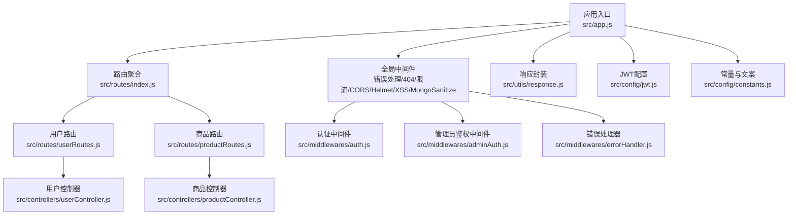
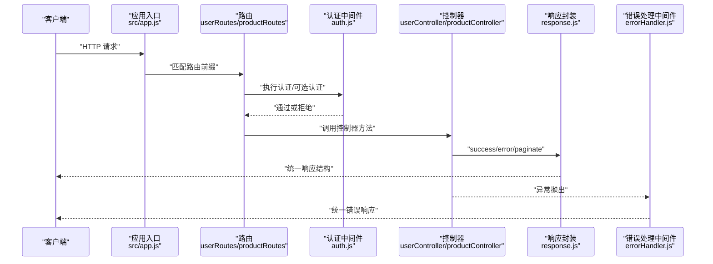
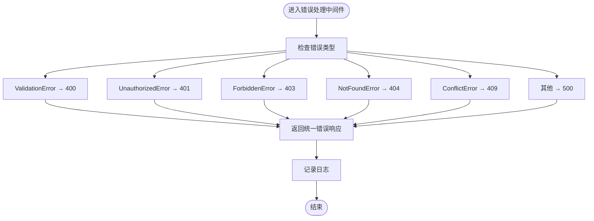
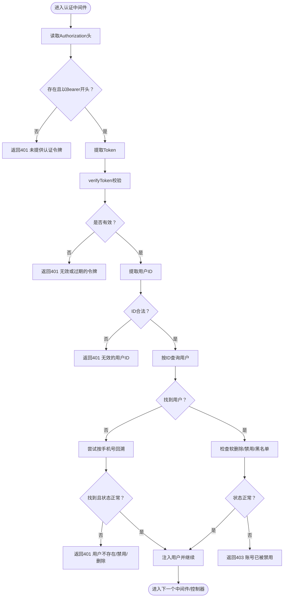
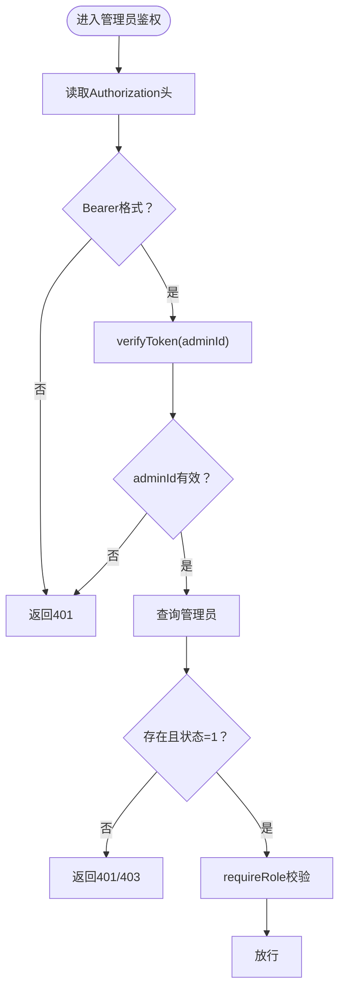
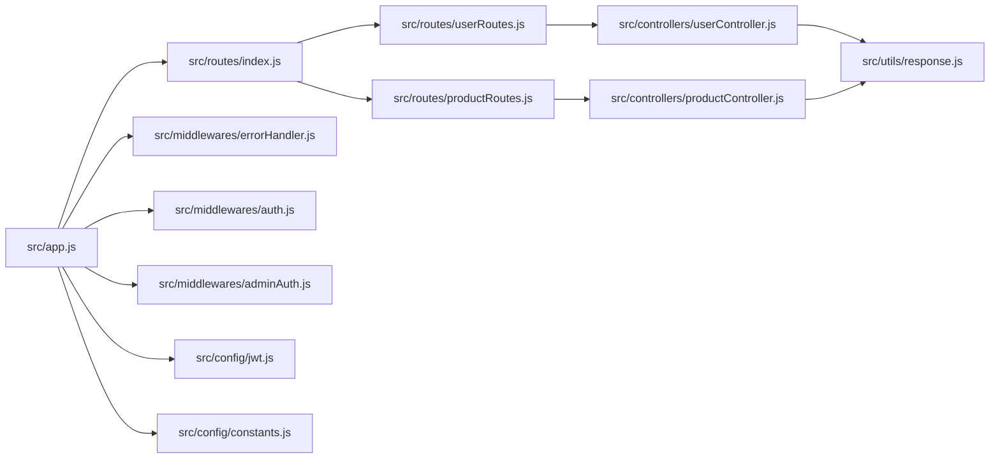

# API接口错误

<cite>
**本文引用的文件**
- [backend/test-endpoint.js](file://backend/test-endpoint.js)
- [backend/src/middlewares/errorHandler.js](file://backend/src/middlewares/errorHandler.js)
- [backend/src/utils/response.js](file://backend/src/utils/response.js)
- [backend/src/middlewares/auth.js](file://backend/src/middlewares/auth.js)
- [backend/src/middlewares/adminAuth.js](file://backend/src/middlewares/adminAuth.js)
- [backend/src/config/jwt.js](file://backend/src/config/jwt.js)
- [backend/src/controllers/userController.js](file://backend/src/controllers/userController.js)
- [backend/src/controllers/productController.js](file://backend/src/controllers/productController.js)
- [backend/src/routes/index.js](file://backend/src/routes/index.js)
- [backend/src/routes/userRoutes.js](file://backend/src/routes/userRoutes.js)
- [backend/src/routes/productRoutes.js](file://backend/src/routes/productRoutes.js)
- [backend/src/config/constants.js](file://backend/src/config/constants.js)
- [backend/src/app.js](file://backend/src/app.js)
- [backend/package.json](file://backend/package.json)
</cite>

## 目录
1. [简介](#简介)
2. [项目结构](#项目结构)
3. [核心组件](#核心组件)
4. [架构总览](#架构总览)
5. [详细组件分析](#详细组件分析)
6. [依赖关系分析](#依赖关系分析)
7. [性能与限流](#性能与限流)
8. [故障排除指南](#故障排除指南)
9. [结论](#结论)
10. [附录](#附录)

## 简介
本指南聚焦于“趣配鲜”项目的API接口错误排查与调试，覆盖常见HTTP状态码错误、请求参数验证失败、认证授权问题、响应格式错误、错误处理中间件工作原理、自定义错误响应实现、调试技巧（curl、Postman、浏览器Network面板）、常见错误的解决方案（401/403/404/500等）、API版本兼容性与向后兼容策略、以及限流与防刷机制的配置与调试方法。文档同时提供基于仓库现有脚本与中间件的实操步骤，帮助快速定位与修复问题。

## 项目结构
后端采用Express + Sequelize架构，路由按模块划分，控制器负责业务逻辑，中间件统一处理认证、鉴权与错误处理，响应封装工具提供一致的返回格式。

图表来源
- [backend/src/app.js:1-84](file://backend/src/app.js#L1-L84)
- [backend/src/routes/index.js:1-27](file://backend/src/routes/index.js#L1-L27)
- [backend/src/routes/userRoutes.js:1-25](file://backend/src/routes/userRoutes.js#L1-L25)
- [backend/src/routes/productRoutes.js:1-15](file://backend/src/routes/productRoutes.js#L1-L15)
- [backend/src/controllers/userController.js:1-409](file://backend/src/controllers/userController.js#L1-L409)
- [backend/src/controllers/productController.js:1-527](file://backend/src/controllers/productController.js#L1-L527)
- [backend/src/middlewares/auth.js:1-181](file://backend/src/middlewares/auth.js#L1-L181)
- [backend/src/middlewares/adminAuth.js:1-77](file://backend/src/middlewares/adminAuth.js#L1-L77)
- [backend/src/middlewares/errorHandler.js:1-47](file://backend/src/middlewares/errorHandler.js#L1-L47)
- [backend/src/utils/response.js:1-32](file://backend/src/utils/response.js#L1-L32)
- [backend/src/config/jwt.js:1-41](file://backend/src/config/jwt.js#L1-L41)
- [backend/src/config/constants.js:1-132](file://backend/src/config/constants.js#L1-L132)

章节来源
- [backend/src/app.js:1-84](file://backend/src/app.js#L1-L84)
- [backend/src/routes/index.js:1-27](file://backend/src/routes/index.js#L1-L27)

## 核心组件
- 错误处理中间件：统一捕获异常，输出结构化错误响应，并记录日志。
- 认证中间件：解析Authorization头，校验JWT，加载用户信息，处理软删除与禁用状态。
- 管理员鉴权中间件：校验管理员令牌与角色，支持超级管理员豁免与角色限制。
- 响应封装工具：提供success/error/paginate三类统一响应格式，便于前后端一致性。
- 控制器：各模块业务逻辑实现，包含参数校验、数据库操作与错误分支处理。
- 路由：按模块组织API路径，挂载认证/鉴权中间件与控制器。

章节来源
- [backend/src/middlewares/errorHandler.js:1-47](file://backend/src/middlewares/errorHandler.js#L1-L47)
- [backend/src/middlewares/auth.js:1-181](file://backend/src/middlewares/auth.js#L1-L181)
- [backend/src/middlewares/adminAuth.js:1-77](file://backend/src/middlewares/adminAuth.js#L1-L77)
- [backend/src/utils/response.js:1-32](file://backend/src/utils/response.js#L1-L32)
- [backend/src/controllers/userController.js:1-409](file://backend/src/controllers/userController.js#L1-L409)
- [backend/src/controllers/productController.js:1-527](file://backend/src/controllers/productController.js#L1-L527)

## 架构总览
下面的序列图展示一次典型API调用从请求到响应的关键节点，包括认证、业务处理与错误处理。

图表来源
- [backend/src/app.js:1-84](file://backend/src/app.js#L1-L84)
- [backend/src/routes/userRoutes.js:1-25](file://backend/src/routes/userRoutes.js#L1-L25)
- [backend/src/routes/productRoutes.js:1-15](file://backend/src/routes/productRoutes.js#L1-L15)
- [backend/src/middlewares/auth.js:1-181](file://backend/src/middlewares/auth.js#L1-L181)
- [backend/src/utils/response.js:1-32](file://backend/src/utils/response.js#L1-L32)
- [backend/src/middlewares/errorHandler.js:1-47](file://backend/src/middlewares/errorHandler.js#L1-L47)

## 详细组件分析

### 错误处理中间件
- 功能：捕获未处理异常，根据错误类型映射标准HTTP状态码，生产环境隐藏堆栈细节，开发环境输出堆栈。
- 关键行为：
  - ValidationError → 400
  - UnauthorizedError → 401
  - ForbiddenError → 403
  - NotFoundError → 404
  - ConflictError → 409
  - 其他 → 500
- 404未找到：单独的notFoundHandler统一返回。

图表来源
- [backend/src/middlewares/errorHandler.js:1-47](file://backend/src/middlewares/errorHandler.js#L1-L47)

章节来源
- [backend/src/middlewares/errorHandler.js:1-47](file://backend/src/middlewares/errorHandler.js#L1-L47)

### 认证中间件（用户）
- 功能：从Authorization头解析Bearer Token，校验JWT有效性，加载用户信息，处理软删除与禁用状态，支持开发环境下的测试用户自动创建。
- 关键判断：
  - 缺少或格式不正确 → 401
  - 解析失败或过期 → 401
  - 令牌无用户ID → 401
  - 数据库未找到用户且无法通过手机号回溯 → 401
  - 用户被软删除 → 401
  - 用户禁用或拉黑 → 403
- 可选认证：optionalAuth允许未登录访问，仅在令牌有效时注入用户上下文。

图表来源
- [backend/src/middlewares/auth.js:1-181](file://backend/src/middlewares/auth.js#L1-L181)

章节来源
- [backend/src/middlewares/auth.js:1-181](file://backend/src/middlewares/auth.js#L1-L181)

### 管理员鉴权中间件
- 功能：校验管理员令牌中的adminId，查询管理员状态，支持角色限制与超级管理员豁免。
- 关键判断：
  - 缺失或格式不正确 → 401
  - 令牌无效或adminId缺失 → 401
  - 管理员不存在 → 401
  - 管理员状态非启用 → 403
  - 角色不在允许集合 → 403

图表来源
- [backend/src/middlewares/adminAuth.js:1-77](file://backend/src/middlewares/adminAuth.js#L1-L77)

章节来源
- [backend/src/middlewares/adminAuth.js:1-77](file://backend/src/middlewares/adminAuth.js#L1-L77)

### 响应封装工具
- success：统一成功响应，包含success、message、data。
- error：统一错误响应，包含success、message、可选errors字段。
- paginate：分页响应，包含分页元数据。
- 使用场景：控制器中优先使用此工具，确保前后端契约一致。

章节来源
- [backend/src/utils/response.js:1-32](file://backend/src/utils/response.js#L1-L32)

### 控制器示例（用户/商品）
- 用户控制器：注册、登录、资料查询/更新、地址管理、密码重置/找回等，均使用响应封装工具返回。
- 商品控制器：商品列表/详情、分类、收藏、浏览历史、管理员商品/分类管理等，包含参数校验与数据库异常分支处理。

章节来源
- [backend/src/controllers/userController.js:1-409](file://backend/src/controllers/userController.js#L1-L409)
- [backend/src/controllers/productController.js:1-527](file://backend/src/controllers/productController.js#L1-L527)

### JWT配置
- 提供生成与校验访问令牌与刷新令牌的方法，支持自定义密钥与过期时间。
- 认证中间件依赖verifyToken进行解码与校验。

章节来源
- [backend/src/config/jwt.js:1-41](file://backend/src/config/jwt.js#L1-L41)
- [backend/src/middlewares/auth.js:1-181](file://backend/src/middlewares/auth.js#L1-L181)
- [backend/src/middlewares/adminAuth.js:1-77](file://backend/src/middlewares/adminAuth.js#L1-L77)

## 依赖关系分析
- 应用入口集中配置CORS、Helmet、XSS清理、Mongo注入清理、限流、日志、静态资源与路由挂载，并注册404与错误处理中间件。
- 路由层按模块组织，用户与商品路由分别挂载auth中间件，部分公开接口使用optionalAuth。
- 控制器层依赖响应封装工具与模型，处理参数校验与数据库异常，向上抛出标准化错误。

图表来源
- [backend/src/app.js:1-84](file://backend/src/app.js#L1-L84)
- [backend/src/routes/index.js:1-27](file://backend/src/routes/index.js#L1-L27)
- [backend/src/routes/userRoutes.js:1-25](file://backend/src/routes/userRoutes.js#L1-L25)
- [backend/src/routes/productRoutes.js:1-15](file://backend/src/routes/productRoutes.js#L1-L15)
- [backend/src/controllers/userController.js:1-409](file://backend/src/controllers/userController.js#L1-L409)
- [backend/src/controllers/productController.js:1-527](file://backend/src/controllers/productController.js#L1-L527)
- [backend/src/middlewares/errorHandler.js:1-47](file://backend/src/middlewares/errorHandler.js#L1-L47)
- [backend/src/middlewares/auth.js:1-181](file://backend/src/middlewares/auth.js#L1-L181)
- [backend/src/middlewares/adminAuth.js:1-77](file://backend/src/middlewares/adminAuth.js#L1-L77)
- [backend/src/utils/response.js:1-32](file://backend/src/utils/response.js#L1-L32)
- [backend/src/config/jwt.js:1-41](file://backend/src/config/jwt.js#L1-L41)
- [backend/src/config/constants.js:1-132](file://backend/src/config/constants.js#L1-L132)

章节来源
- [backend/src/app.js:1-84](file://backend/src/app.js#L1-L84)
- [backend/src/routes/index.js:1-27](file://backend/src/routes/index.js#L1-L27)

## 性能与限流
- 限流中间件：基于express-rate-limit，默认窗口与最大请求数可通过环境变量配置，统一返回“请求过于频繁”的提示。
- 安全与防护：Helmet增强头部安全，XSS与Mongo注入清理减少攻击面。
- 日志：Morgan结合Winston输出访问日志，便于审计与性能分析。

章节来源
- [backend/src/app.js:32-39](file://backend/src/app.js#L32-L39)
- [backend/src/app.js:41-45](file://backend/src/app.js#L41-L45)
- [backend/package.json:18-39](file://backend/package.json#L18-L39)

## 故障排除指南

### 一、常见HTTP状态码错误诊断
- 400（参数/数据验证失败）
  - 现象：控制器内对请求参数进行显式校验或Sequelize校验失败。
  - 排查要点：检查控制器参数校验分支与数据库约束错误类型映射。
  - 参考路径：
    - [backend/src/controllers/userController.js:1-409](file://backend/src/controllers/userController.js#L1-L409)
    - [backend/src/controllers/productController.js:266-346](file://backend/src/controllers/productController.js#L266-L346)
- 401（未授权/令牌无效）
  - 现象：认证中间件返回未提供令牌、无效或过期令牌、用户ID无效等。
  - 排查要点：确认Authorization头格式、JWT密钥与过期配置、用户状态。
  - 参考路径：
    - [backend/src/middlewares/auth.js:1-181](file://backend/src/middlewares/auth.js#L1-L181)
    - [backend/src/config/jwt.js:1-41](file://backend/src/config/jwt.js#L1-L41)
- 403（禁止访问/账号禁用）
  - 现象：用户被软删除、禁用或拉黑；管理员账号禁用或权限不足。
  - 排查要点：检查用户状态、软删除标记、管理员角色与requireRole。
  - 参考路径：
    - [backend/src/middlewares/auth.js:123-137](file://backend/src/middlewares/auth.js#L123-L137)
    - [backend/src/middlewares/adminAuth.js:34-48](file://backend/src/middlewares/adminAuth.js#L34-L48)
- 404（资源不存在）
  - 现象：查询不到用户、商品、分类等资源。
  - 排查要点：确认ID合法性、软删除过滤、查询条件。
  - 参考路径：
    - [backend/src/controllers/userController.js:344-366](file://backend/src/controllers/userController.js#L344-L366)
    - [backend/src/controllers/productController.js:246-264](file://backend/src/controllers/productController.js#L246-L264)
- 500（服务器内部错误）
  - 现象：未捕获异常或数据库/系统错误。
  - 排查要点：查看错误处理中间件日志、堆栈信息。
  - 参考路径：
    - [backend/src/middlewares/errorHandler.js:1-47](file://backend/src/middlewares/errorHandler.js#L1-L47)

章节来源
- [backend/src/controllers/userController.js:1-409](file://backend/src/controllers/userController.js#L1-L409)
- [backend/src/controllers/productController.js:1-527](file://backend/src/controllers/productController.js#L1-L527)
- [backend/src/middlewares/auth.js:1-181](file://backend/src/middlewares/auth.js#L1-L181)
- [backend/src/middlewares/adminAuth.js:1-77](file://backend/src/middlewares/adminAuth.js#L1-L77)
- [backend/src/middlewares/errorHandler.js:1-47](file://backend/src/middlewares/errorHandler.js#L1-L47)

### 二、请求参数验证失败
- 自检清单：
  - 必填字段是否为空或仅空白字符
  - 数字字段是否为合法数值
  - 外键ID是否存在且未被删除
  - JSON字段是否可解析
- 建议：
  - 在控制器内先做显式校验，再进行数据库操作
  - 对Sequelize异常进行类型区分，返回明确的错误信息
- 参考路径：
  - [backend/src/controllers/productController.js:266-346](file://backend/src/controllers/productController.js#L266-L346)
  - [backend/src/controllers/userController.js:7-42](file://backend/src/controllers/userController.js#L7-L42)

章节来源
- [backend/src/controllers/productController.js:266-346](file://backend/src/controllers/productController.js#L266-L346)
- [backend/src/controllers/userController.js:7-42](file://backend/src/controllers/userController.js#L7-L42)

### 三、认证授权问题
- 401常见原因：
  - 缺失Authorization头或格式错误
  - JWT签名密钥不一致或过期
  - 令牌中缺少用户ID
  - 用户被软删除或禁用
- 403常见原因：
  - 用户状态异常或被拉黑
  - 管理员账号禁用或角色不足
- 排查步骤：
  - 检查Authorization头格式（Bearer）
  - 校验JWT密钥与过期时间
  - 核对用户状态与软删除标记
  - 管理员角色与requireRole
- 参考路径：
  - [backend/src/middlewares/auth.js:1-181](file://backend/src/middlewares/auth.js#L1-L181)
  - [backend/src/middlewares/adminAuth.js:1-77](file://backend/src/middlewares/adminAuth.js#L1-L77)
  - [backend/src/config/jwt.js:1-41](file://backend/src/config/jwt.js#L1-L41)

章节来源
- [backend/src/middlewares/auth.js:1-181](file://backend/src/middlewares/auth.js#L1-L181)
- [backend/src/middlewares/adminAuth.js:1-77](file://backend/src/middlewares/adminAuth.js#L1-L77)
- [backend/src/config/jwt.js:1-41](file://backend/src/config/jwt.js#L1-L41)

### 四、响应格式错误
- 统一响应结构：
  - 成功：success=true, message, data
  - 错误：success=false, message, [errors], [stack(开发环境)]
  - 分页：success=true, message, data, pagination{page,pageSize,total,totalPages}
- 排查要点：
  - 控制器是否使用响应封装工具
  - 错误处理中间件是否拦截并转换
- 参考路径：
  - [backend/src/utils/response.js:1-32](file://backend/src/utils/response.js#L1-L32)
  - [backend/src/middlewares/errorHandler.js:1-47](file://backend/src/middlewares/errorHandler.js#L1-L47)

章节来源
- [backend/src/utils/response.js:1-32](file://backend/src/utils/response.js#L1-L32)
- [backend/src/middlewares/errorHandler.js:1-47](file://backend/src/middlewares/errorHandler.js#L1-L47)

### 五、使用test-endpoint.js脚本测试端点
- 脚本功能：启动本地测试服务器，提供POST /test-create-product端点，模拟前端请求体，内置参数校验与数据库操作。
- 使用步骤：
  1) 准备环境变量（如数据库连接、JWT密钥等）
  2) 启动脚本：node backend/test-endpoint.js
  3) 使用curl或浏览器发起请求，观察控制台日志与响应
- 关键点：
  - 内置参数校验（名称、价格、分类、主图等）
  - 分类存在性检查
  - 数据库异常捕获与错误映射
- 参考路径：
  - [backend/test-endpoint.js:1-183](file://backend/test-endpoint.js#L1-L183)

章节来源
- [backend/test-endpoint.js:1-183](file://backend/test-endpoint.js#L1-L183)

### 六、调试技巧
- curl命令测试：
  - GET /api/products：获取商品列表
  - GET /api/products/:id：获取商品详情（可选登录）
  - POST /api/users/login：登录获取令牌
  - PUT /api/users/profile：携带Authorization头更新资料
- Postman使用：
  - 设置全局变量（如Authorization: Bearer <token>）
  - 使用Collection Runner批量测试
- 浏览器开发者工具Network面板：
  - 查看请求头（Authorization、Content-Type）
  - 查看响应状态码与Body
  - 查看Cookies与Headers中的跨域与认证信息

章节来源
- [backend/src/routes/userRoutes.js:1-25](file://backend/src/routes/userRoutes.js#L1-L25)
- [backend/src/routes/productRoutes.js:1-15](file://backend/src/routes/productRoutes.js#L1-L15)
- [backend/src/app.js:49-50](file://backend/src/app.js#L49-L50)

### 七、常见API错误解决方案
- 401未授权
  - 确认Authorization头格式与令牌有效
  - 校验JWT密钥与过期时间
  - 检查用户状态与软删除
- 403禁止访问
  - 检查用户状态、黑名单与管理员角色
- 404未找到
  - 校验ID合法性与软删除过滤
- 500服务器错误
  - 查看错误处理中间件日志与堆栈
  - 检查数据库连接与模型约束

章节来源
- [backend/src/middlewares/auth.js:1-181](file://backend/src/middlewares/auth.js#L1-L181)
- [backend/src/middlewares/adminAuth.js:1-77](file://backend/src/middlewares/adminAuth.js#L1-L77)
- [backend/src/middlewares/errorHandler.js:1-47](file://backend/src/middlewares/errorHandler.js#L1-L47)

### 八、API版本兼容性与向后兼容策略
- 版本前缀：通过API_PREFIX环境变量控制（默认/api），可在部署时切换不同版本路径。
- 向后兼容建议：
  - 新增字段使用可选参数，避免破坏既有调用
  - 对废弃字段保留读取但不再写入，或在响应中注明deprecated
  - 严格遵循HTTP状态码语义与响应结构
- 参考路径：
  - [backend/src/app.js:49](file://backend/src/app.js#L49)
  - [backend/src/config/constants.js:125-130](file://backend/src/config/constants.js#L125-L130)

章节来源
- [backend/src/app.js:49](file://backend/src/app.js#L49)
- [backend/src/config/constants.js:125-130](file://backend/src/config/constants.js#L125-L130)

### 九、限流与防刷机制
- 限流配置：窗口时间与最大请求数可通过环境变量配置，统一提示“请求过于频繁”。
- 防刷建议：
  - 结合IP白名单与风控策略
  - 对敏感接口（登录、重置密码）单独限流
  - 使用Redis存储计数器（当前代码未引入Redis，可按需扩展）
- 参考路径：
  - [backend/src/app.js:32-39](file://backend/src/app.js#L32-L39)
  - [backend/package.json:18-39](file://backend/package.json#L18-L39)

章节来源
- [backend/src/app.js:32-39](file://backend/src/app.js#L32-L39)
- [backend/package.json:18-39](file://backend/package.json#L18-L39)

## 结论
本指南基于仓库现有代码与脚本，提供了从架构到具体组件的全面故障排除路径。通过统一的响应封装、严格的认证鉴权中间件与完善的错误处理机制，能够快速定位并解决大多数API错误。配合curl、Postman与浏览器Network面板，可高效完成端到端调试。对于版本兼容与限流防刷，建议结合环境变量与部署策略进行精细化配置。

## 附录
- 常用端点参考：
  - 用户：/api/users/register, /api/users/login, /api/users/profile, /api/users/addresses/*
  - 商品：/api/products/, /api/products/:id, /api/products/categories, /api/products/favorites/*
- 健康检查：/api/home/health

章节来源
- [backend/src/routes/index.js:1-27](file://backend/src/routes/index.js#L1-L27)
- [backend/src/routes/userRoutes.js:1-25](file://backend/src/routes/userRoutes.js#L1-L25)
- [backend/src/routes/productRoutes.js:1-15](file://backend/src/routes/productRoutes.js#L1-L15)