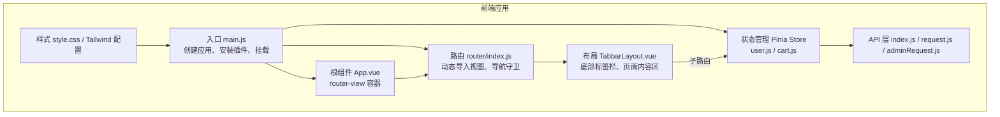
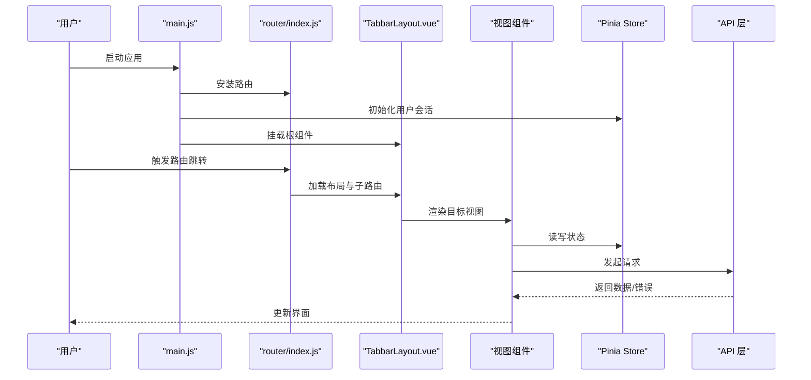
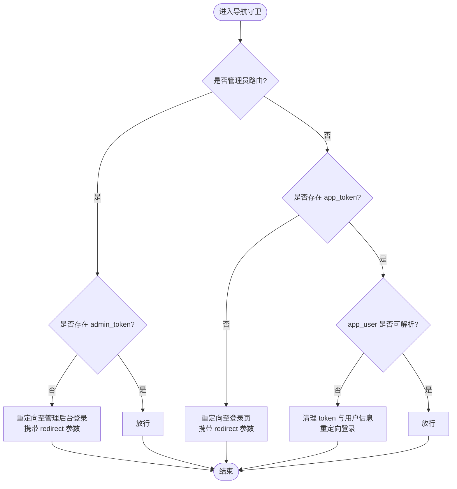
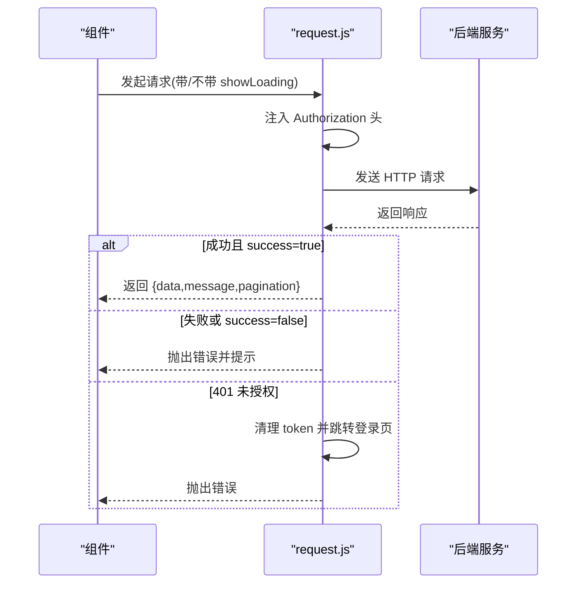
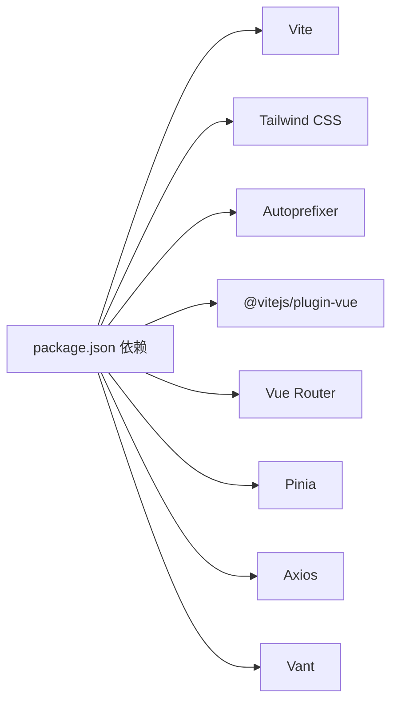

# 前端渲染问题

<cite>
**本文引用的文件**
- [frontend/package.json](file://frontend/package.json)
- [frontend/vite.config.js](file://frontend/vite.config.js)
- [frontend/postcss.config.js](file://frontend/postcss.config.js)
- [frontend/tailwind.config.js](file://frontend/tailwind.config.js)
- [frontend/src/main.js](file://frontend/src/main.js)
- [frontend/src/App.vue](file://frontend/src/App.vue)
- [frontend/src/router/index.js](file://frontend/src/router/index.js)
- [frontend/src/style.css](file://frontend/src/style.css)
- [frontend/src/layouts/TabbarLayout.vue](file://frontend/src/layouts/TabbarLayout.vue)
- [frontend/src/store/user.js](file://frontend/src/store/user.js)
- [frontend/src/store/cart.js](file://frontend/src/store/cart.js)
- [frontend/src/views/Home.vue](file://frontend/src/views/Home.vue)
- [frontend/src/views/Login.vue](file://frontend/src/views/Login.vue)
- [frontend/src/admin/views/Login.vue](file://frontend/src/admin/views/Login.vue)
- [frontend/src/api/index.js](file://frontend/src/api/index.js)
- [frontend/src/api/request.js](file://frontend/src/api/request.js)
- [frontend/src/api/adminRequest.js](file://frontend/src/api/adminRequest.js)
</cite>

## 目录
1. [简介](#简介)
2. [项目结构](#项目结构)
3. [核心组件](#核心组件)
4. [架构总览](#架构总览)
5. [详细组件分析](#详细组件分析)
6. [依赖关系分析](#依赖关系分析)
7. [性能考虑](#性能考虑)
8. [故障排除指南](#故障排除指南)
9. [结论](#结论)
10. [附录](#附录)

## 简介
本指南面向“趣配鲜”Vue.js前端应用，聚焦于常见渲染与运行时问题的诊断与修复，覆盖以下方面：
- 应用启动失败、组件渲染异常、路由跳转错误、样式加载问题
- Vite 构建与开发流程中的模块解析、CSS 导入、静态资源路径问题
- Vue 组件生命周期问题（挂载失败、数据绑定异常、事件处理错误）
- 路由导航守卫问题（重定向循环、权限校验失败、懒加载组件异常）
- 样式系统问题（Tailwind CSS 配置、主题切换、移动端适配）
- 浏览器兼容性（polyfill、ES6+ 支持）
- 前端性能（首屏加载、内存泄漏、渲染卡顿）

## 项目结构
前端采用 Vite + Vue 3 + Pinia + Vue Router + Vant 的技术栈，目录组织按功能域划分，包含视图、布局、路由、状态管理、API 封装与样式配置。

图表来源
- [frontend/src/main.js:1-56](file://frontend/src/main.js#L1-L56)
- [frontend/src/App.vue:1-10](file://frontend/src/App.vue#L1-L10)
- [frontend/src/router/index.js:1-192](file://frontend/src/router/index.js#L1-L192)
- [frontend/src/layouts/TabbarLayout.vue:1-99](file://frontend/src/layouts/TabbarLayout.vue#L1-L99)
- [frontend/src/store/user.js:1-96](file://frontend/src/store/user.js#L1-L96)
- [frontend/src/store/cart.js:1-68](file://frontend/src/store/cart.js#L1-L68)
- [frontend/src/api/index.js:1-138](file://frontend/src/api/index.js#L1-L138)
- [frontend/src/style.css:1-71](file://frontend/src/style.css#L1-L71)
- [frontend/tailwind.config.js:1-24](file://frontend/tailwind.config.js#L1-L24)

章节来源
- [frontend/package.json:1-26](file://frontend/package.json#L1-L26)
- [frontend/vite.config.js:1-26](file://frontend/vite.config.js#L1-L26)
- [frontend/src/main.js:1-56](file://frontend/src/main.js#L1-L56)
- [frontend/src/App.vue:1-10](file://frontend/src/App.vue#L1-L10)
- [frontend/src/router/index.js:1-192](file://frontend/src/router/index.js#L1-L192)
- [frontend/src/layouts/TabbarLayout.vue:1-99](file://frontend/src/layouts/TabbarLayout.vue#L1-L99)
- [frontend/src/store/user.js:1-96](file://frontend/src/store/user.js#L1-L96)
- [frontend/src/store/cart.js:1-68](file://frontend/src/store/cart.js#L1-L68)
- [frontend/src/api/index.js:1-138](file://frontend/src/api/index.js#L1-L138)
- [frontend/src/style.css:1-71](file://frontend/src/style.css#L1-L71)
- [frontend/tailwind.config.js:1-24](file://frontend/tailwind.config.js#L1-L24)

## 核心组件
- 应用入口与全局安装
  - 创建应用实例、安装 Pinia、Vue Router、全局样式与 Vant 组件库
  - 初始化用户会话，随后挂载应用
- 根组件与路由容器
  - 根组件仅包含路由出口，实际页面由路由驱动
- 路由与导航守卫
  - 使用 history 模式，动态导入视图；基于 meta 字段控制标题、权限、隐藏标签栏等
  - 守卫中对 app_token、app_user、admin_token 进行校验，并处理重定向
- 布局与页面
  - TabbarLayout 提供底部标签栏与页面内容区，根据路由 meta 控制显示与安全区域适配
  - Home 页面负责首页数据拉取、购物车初始化与交互
- 状态管理
  - 用户 Store：token、用户信息持久化、登录态初始化、登出
  - 购物车 Store：列表、数量、金额计算、增删改查
- API 层
  - request.js：通用请求封装，含拦截器、加载提示、鉴权头、401/403 处理
  - adminRequest.js：后台专用请求封装，独立 baseURL 与拦截逻辑
  - index.js：业务 API 聚合导出

章节来源
- [frontend/src/main.js:1-56](file://frontend/src/main.js#L1-L56)
- [frontend/src/App.vue:1-10](file://frontend/src/App.vue#L1-L10)
- [frontend/src/router/index.js:150-192](file://frontend/src/router/index.js#L150-L192)
- [frontend/src/layouts/TabbarLayout.vue:1-99](file://frontend/src/layouts/TabbarLayout.vue#L1-L99)
- [frontend/src/views/Home.vue:107-184](file://frontend/src/views/Home.vue#L107-L184)
- [frontend/src/store/user.js:24-96](file://frontend/src/store/user.js#L24-L96)
- [frontend/src/store/cart.js:5-68](file://frontend/src/store/cart.js#L5-L68)
- [frontend/src/api/request.js:29-111](file://frontend/src/api/request.js#L29-L111)
- [frontend/src/api/adminRequest.js:29-93](file://frontend/src/api/adminRequest.js#L29-L93)
- [frontend/src/api/index.js:1-138](file://frontend/src/api/index.js#L1-L138)

## 架构总览

图表来源
- [frontend/src/main.js:1-56](file://frontend/src/main.js#L1-L56)
- [frontend/src/router/index.js:1-192](file://frontend/src/router/index.js#L1-L192)
- [frontend/src/layouts/TabbarLayout.vue:1-99](file://frontend/src/layouts/TabbarLayout.vue#L1-L99)
- [frontend/src/store/user.js:69-83](file://frontend/src/store/user.js#L69-L83)
- [frontend/src/api/request.js:29-111](file://frontend/src/api/request.js#L29-L111)

## 详细组件分析

### 路由与导航守卫
- 典型问题
  - 权限校验失败导致反复跳转登录页
  - 重定向参数丢失或编码错误
  - 管理后台与前台共用 token，导致误判
  - 懒加载组件加载超时或路径错误
- 关键点
  - 守卫中区分是否管理员路由与普通路由
  - 对 requiresAuth 与 isAdmin 分支分别处理
  - 对 app_user 的 JSON 解析失败进行清理
  - 动态导入组件按需加载，避免首屏体积过大
- 排查步骤
  - 打开浏览器开发者工具 Network 面板，观察鉴权相关请求与响应码
  - 在守卫函数中增加日志，确认 to.meta 字段与 token 状态
  - 检查路由表中懒加载路径是否正确
  - 若出现循环重定向，检查 redirect 参数与 next 调用顺序

图表来源
- [frontend/src/router/index.js:155-189](file://frontend/src/router/index.js#L155-L189)

章节来源
- [frontend/src/router/index.js:150-192](file://frontend/src/router/index.js#L150-L192)

### 组件生命周期与渲染
- 典型问题
  - onMounted 中异步请求未处理错误，导致页面空白
  - 数据绑定异常：字段缺失或类型不符
  - 事件处理未解绑，造成内存泄漏
- 关键点
  - Home 页面在挂载后拉取首页数据并初始化购物车
  - TabbarLayout 监听路由变化同步标签栏选中状态
  - 用户 Store 在应用启动时初始化本地 token 与用户信息
- 排查步骤
  - 在组件的 onMounted 中增加 try/catch 并打印错误堆栈
  - 检查模板中使用的字段是否与接口返回一致
  - 使用 Vue DevTools 观察组件状态变化与事件绑定情况
  - 对定时器、轮询、订阅在组件卸载时清理

章节来源
- [frontend/src/views/Home.vue:178-183](file://frontend/src/views/Home.vue#L178-L183)
- [frontend/src/layouts/TabbarLayout.vue:58-75](file://frontend/src/layouts/TabbarLayout.vue#L58-L75)
- [frontend/src/store/user.js:69-83](file://frontend/src/store/user.js#L69-L83)

### 样式系统与 Tailwind CSS
- 典型问题
  - Tailwind 类名未生效：content 配置遗漏或未生成
  - 主题色与字体未生效：颜色/字体扩展未正确声明
  - 移动端安全区域与底部占位未适配
- 关键点
  - style.css 引入 Tailwind 指令
  - tailwind.config.js 扩展颜色与字体
  - TabbarLayout 根据 meta 控制底部占位与安全区域
- 排查步骤
  - 确认 content 包含 src 下所有模板文件
  - 重新运行构建以生成新类名
  - 检查 scoped 样式是否覆盖了 Tailwind 生成的类
  - 在移动端设备或浏览器模拟器中验证安全区域

章节来源
- [frontend/src/style.css:1-71](file://frontend/src/style.css#L1-L71)
- [frontend/tailwind.config.js:1-24](file://frontend/tailwind.config.js#L1-L24)
- [frontend/src/layouts/TabbarLayout.vue:78-98](file://frontend/src/layouts/TabbarLayout.vue#L78-L98)

### API 请求与鉴权
- 典型问题
  - 401 未登录/令牌过期：自动跳转登录页
  - 403 权限不足：提示无权限
  - 请求头未携带 token：接口返回 401
  - 响应体格式不一致：success 字段判断失败
- 关键点
  - request.js 统一注入 Authorization 头
  - 响应拦截器根据 success 字段决定是否抛错
  - 401 时根据当前路径区分前台/后台并清理对应 token
- 排查步骤
  - 查看请求拦截器是否正确设置 Authorization
  - 检查响应拦截器对 success 字段的判断逻辑
  - 确认后端返回的错误码与消息是否符合预期
  - 使用网络面板查看请求头与响应体结构

图表来源
- [frontend/src/api/request.js:29-111](file://frontend/src/api/request.js#L29-L111)

章节来源
- [frontend/src/api/request.js:29-111](file://frontend/src/api/request.js#L29-L111)
- [frontend/src/api/adminRequest.js:29-93](file://frontend/src/api/adminRequest.js#L29-L93)
- [frontend/src/api/index.js:1-138](file://frontend/src/api/index.js#L1-L138)

## 依赖关系分析
- 构建与打包
  - Vite 插件：@vitejs/plugin-vue
  - CSS 工具链：tailwindcss、autoprefixer、postcss
  - 别名：@ 指向 src
- 运行时依赖
  - Vue 3、Vue Router 4、Pinia、Axios、Vant 4
- 开发依赖
  - Vite 5、Tailwind CSS 3、PostCSS、Autoprefixer

图表来源
- [frontend/package.json:10-24](file://frontend/package.json#L10-L24)

章节来源
- [frontend/package.json:1-26](file://frontend/package.json#L1-L26)
- [frontend/vite.config.js:1-26](file://frontend/vite.config.js#L1-L26)
- [frontend/postcss.config.js:1-7](file://frontend/postcss.config.js#L1-L7)

## 性能考虑
- 首屏加载
  - 使用路由懒加载减少初始包体积
  - 合理拆分第三方组件按需引入
  - 避免在首屏渲染中执行重型计算
- 内存泄漏
  - 在组件卸载时清理定时器、轮询、事件监听
  - 及时释放大对象引用
- 渲染卡顿
  - 使用虚拟滚动处理长列表
  - 合理使用 computed 与缓存派生状态
  - 避免不必要的响应式数据变更

## 故障排除指南

### 一、应用启动失败
- 症状
  - 页面空白、控制台报错
- 可能原因
  - main.js 中挂载节点不存在或拼写错误
  - 路由安装顺序错误或路由表定义异常
  - Vant 组件注册过多导致初始化耗时
- 排查步骤
  - 确认 index.html 中存在挂载节点
  - 检查 main.js 中 app.mount('#app') 是否正确
  - 逐步注释 Vant 组件注册，定位是否因组件过多导致初始化失败
  - 查看控制台错误堆栈，定位具体模块

章节来源
- [frontend/src/main.js:1-56](file://frontend/src/main.js#L1-L56)
- [frontend/src/App.vue:1-10](file://frontend/src/App.vue#L1-L10)

### 二、组件渲染异常
- 症状
  - 页面元素不显示、样式错乱、图片不加载
- 可能原因
  - 模板中字段缺失或类型不符
  - 图片 URL 为空或跨域
  - scoped 样式覆盖 Tailwind 类
- 排查步骤
  - 在组件 mounted 中打印响应数据，核对字段
  - 检查图片链接与占位图逻辑
  - 使用浏览器开发者工具 Elements 面板检查最终样式
  - 将 scoped 样式迁移至全局或使用 ::v-deep

章节来源
- [frontend/src/views/Home.vue:125-139](file://frontend/src/views/Home.vue#L125-L139)
- [frontend/src/style.css:1-71](file://frontend/src/style.css#L1-L71)

### 三、路由跳转错误
- 症状
  - 点击无反应、跳转到错误页面、循环重定向
- 可能原因
  - 导航守卫中 token 缺失或解析失败
  - 重定向参数未正确编码/解码
  - 子路由路径与 Tabbar 映射不一致
- 排查步骤
  - 在守卫中增加日志，确认 to.meta 与 token 状态
  - 检查 redirect 参数的 encode/decode 是否成对出现
  - 核对 TabbarLayout 中 path-to-tab 映射与路由表一致

章节来源
- [frontend/src/router/index.js:155-189](file://frontend/src/router/index.js#L155-L189)
- [frontend/src/layouts/TabbarLayout.vue:31-48](file://frontend/src/layouts/TabbarLayout.vue#L31-L48)

### 四、样式加载问题
- 症状
  - Tailwind 类名不生效、颜色/字体未应用、移动端底部遮挡
- 可能原因
  - Tailwind content 未包含模板文件
  - 未引入 style.css 或 Tailwind 指令
  - scoped 样式优先级过高
- 排查步骤
  - 确认 tailwind.config.js 的 content 路径包含 src 下所有模板
  - 重新构建以生成新类名
  - 检查 style.css 是否被正确引入
  - 使用 !important 临时验证是否为优先级问题

章节来源
- [frontend/tailwind.config.js:3-6](file://frontend/tailwind.config.js#L3-L6)
- [frontend/src/style.css:1-3](file://frontend/src/style.css#L1-L3)
- [frontend/src/layouts/TabbarLayout.vue:86-97](file://frontend/src/layouts/TabbarLayout.vue#L86-L97)

### 五、Vite 构建与开发问题
- 模块解析失败
  - 使用 @ 别名时路径错误或大小写不一致
- CSS 导入错误
  - Tailwind 指令未引入或 postcss 配置缺失
- 静态资源路径问题
  - 资源路径在生产环境相对路径不正确
- 排查步骤
  - 检查 vite.config.js 中 alias 与 build.outDir
  - 确认 postcss.config.js 中启用 tailwindcss 与 autoprefixer
  - 使用绝对路径或确保资源在 public 目录下

章节来源
- [frontend/vite.config.js:7-11](file://frontend/vite.config.js#L7-L11)
- [frontend/postcss.config.js:1-7](file://frontend/postcss.config.js#L1-L7)

### 六、Vue 组件生命周期问题
- 组件挂载失败
  - onMounted 中未捕获异常导致后续逻辑中断
- 数据绑定异常
  - 接口返回字段与模板不一致
- 事件处理错误
  - 未在组件卸载时移除事件监听
- 排查步骤
  - 在 onMounted 中包裹 try/catch 并打印错误
  - 核对模板与响应数据结构
  - 使用 beforeUnmount 清理定时器与事件

章节来源
- [frontend/src/views/Home.vue:178-183](file://frontend/src/views/Home.vue#L178-L183)

### 七、路由导航守卫问题
- 路由重定向循环
  - 重定向参数未正确处理或 next 调用多次
- 权限验证失败
  - token 缺失、格式错误或解析失败
- 懒加载组件加载异常
  - 动态导入路径错误或网络超时
- 排查步骤
  - 在守卫中打印 to、from、next 调用链
  - 检查动态导入路径与文件存在性
  - 核对权限字段与 token 状态

章节来源
- [frontend/src/router/index.js:155-189](file://frontend/src/router/index.js#L155-L189)

### 八、样式系统问题
- Tailwind CSS 配置错误
  - colors/fontFamily 未生效
- 主题切换失效
  - 未使用 Tailwind 扩展或覆盖了默认类
- 移动端适配问题
  - 安全区域与底部 Tabbar 占位未正确计算
- 排查步骤
  - 重新构建并确认生成类名
  - 检查 scoped 样式是否覆盖关键类
  - 使用 env(safe-area-inset-bottom) 与 padding-bottom 计算

章节来源
- [frontend/tailwind.config.js:7-20](file://frontend/tailwind.config.js#L7-L20)
- [frontend/src/layouts/TabbarLayout.vue:86-97](file://frontend/src/layouts/TabbarLayout.vue#L86-L97)

### 九、浏览器兼容性问题
- 现象
  - ES6+ 语法报错、Promise/async 不支持
- 原因
  - 未引入 polyfill 或构建目标不匹配
- 处理建议
  - 在入口引入必要的 polyfill
  - 调整构建目标或使用 @vitejs/plugin-react 的兼容配置

章节来源
- [frontend/package.json:18-24](file://frontend/package.json#L18-L24)

### 十、前端性能问题
- 首屏加载慢
  - 路由懒加载未启用、第三方库过大
- 内存泄漏
  - 未清理定时器、事件监听、订阅
- 渲染卡顿
  - 大量 DOM 操作、频繁响应式更新
- 优化建议
  - 使用路由懒加载与组件按需引入
  - 合理拆分与缓存派生状态
  - 使用虚拟列表与防抖节流

## 结论
本指南从应用启动、路由导航、组件渲染、样式系统、构建与兼容性、性能优化六个维度提供了系统性的故障排除方法。建议在开发与排障过程中结合浏览器开发者工具与日志输出，逐步缩小问题范围，并依据本文提供的排查步骤逐一验证。

## 附录
- 常用命令
  - 开发：npm run dev
  - 构建：npm run build
  - 预览：npm run preview
- 关键配置
  - Vite：别名、代理、端口、输出目录
  - Tailwind：content、theme.extend、plugins
  - PostCSS：tailwindcss、autoprefixer