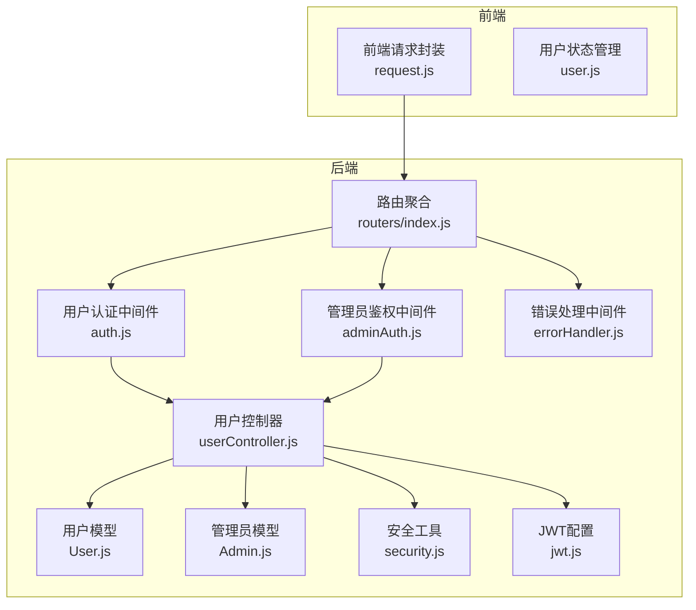
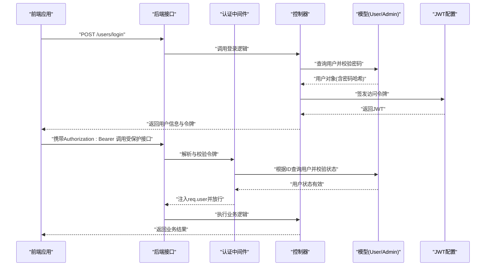
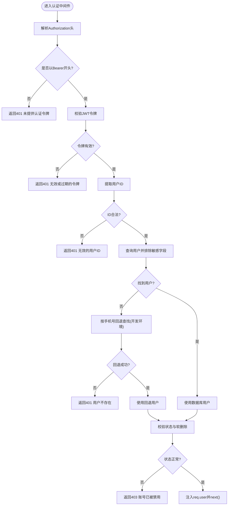
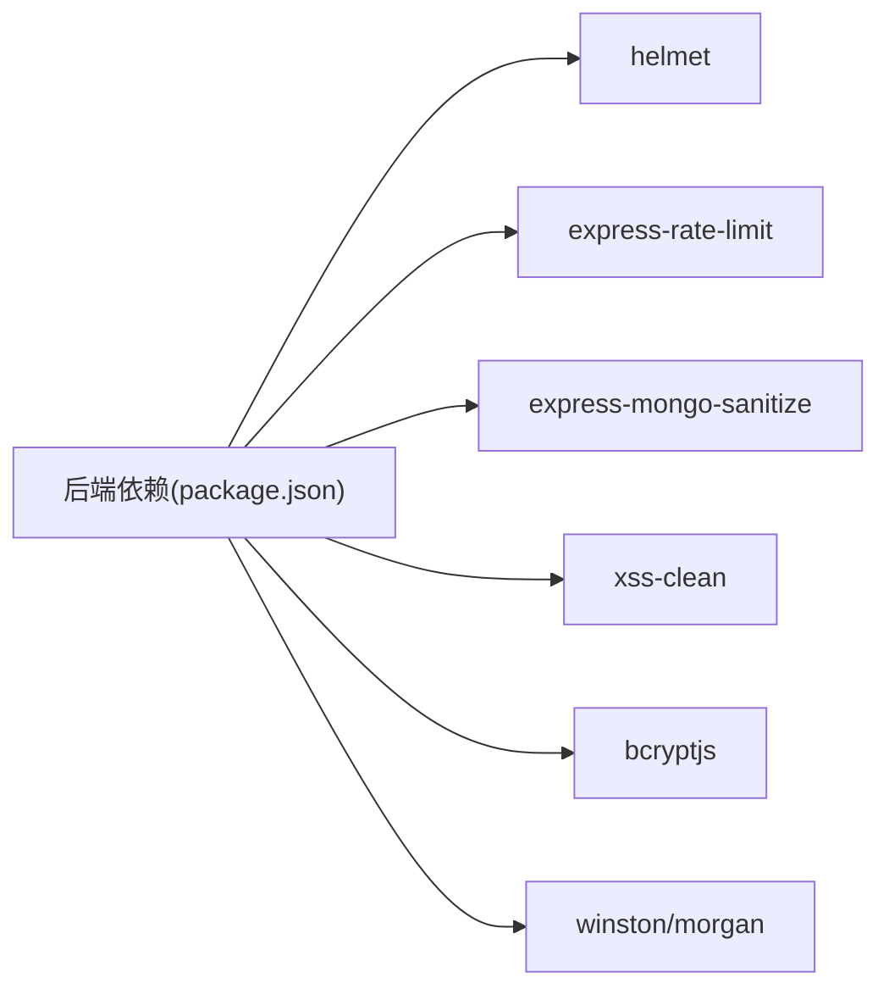
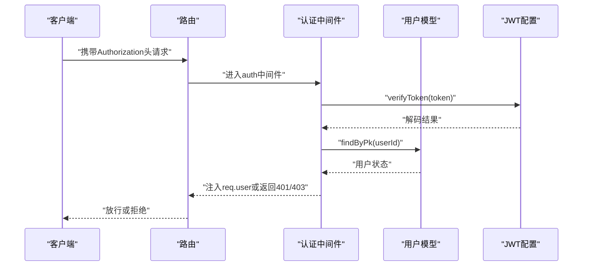

# 安全问题处理

<cite>
**本文引用的文件**
- [backend/src/config/jwt.js](file://backend/src/config/jwt.js)
- [backend/src/middlewares/auth.js](file://backend/src/middlewares/auth.js)
- [backend/src/middlewares/adminAuth.js](file://backend/src/middlewares/adminAuth.js)
- [backend/src/utils/security.js](file://backend/src/utils/security.js)
- [backend/src/controllers/userController.js](file://backend/src/controllers/userController.js)
- [backend/src/models/User.js](file://backend/src/models/User.js)
- [backend/src/models/Admin.js](file://backend/src/models/Admin.js)
- [backend/src/middlewares/errorHandler.js](file://backend/src/middlewares/errorHandler.js)
- [backend/src/routers/index.js](file://backend/src/routers/index.js)
- [frontend/src/api/request.js](file://frontend/src/api/request.js)
- [frontend/src/store/user.js](file://frontend/src/store/user.js)
- [backend/package.json](file://backend/package.json)
</cite>

## 目录
1. [引言](#引言)
2. [项目结构](#项目结构)
3. [核心组件](#核心组件)
4. [架构总览](#架构总览)
5. [详细组件分析](#详细组件分析)
6. [依赖关系分析](#依赖关系分析)
7. [性能与安全权衡](#性能与安全权衡)
8. [故障排除指南](#故障排除指南)
9. [结论](#结论)
10. [附录](#附录)

## 引言
本指南面向“趣配鲜”项目的开发与运维团队，聚焦于常见安全风险的识别、检测与防护，覆盖以下主题：
- 常见安全威胁：SQL注入、XSS、CSRF、暴力破解等
- JWT认证机制的安全配置要点：密钥管理、过期策略、签名算法与安全响应头
- 输入验证与数据过滤：后端参数校验与前端表单验证
- 权限控制体系：角色模型、路由级与API级访问控制
- HTTPS与安全传输：SSL/TLS与HSTS配置要点
- 安全审计与日志：异常登录、敏感操作与事件追踪
- 第三方安全工具集成：WAF、IDS、安全扫描

本指南以代码库为依据，结合实际实现进行分析，并给出可落地的改进建议。

## 项目结构
后端采用Express + Sequelize + JWT的典型Node.js架构，前端基于Vue 3 + Vite + Pinia + Vant。安全相关能力分布于：
- 中间件层：认证、鉴权、错误处理
- 控制器层：业务接口与参数处理
- 模型层：用户与管理员实体及密码哈希策略
- 工具层：加解密与数据脱敏
- 前端：统一请求拦截、令牌持久化与自动登出

图表来源
- [backend/src/routers/index.js:1-27](file://backend/src/routers/index.js#L1-L27)
- [backend/src/middlewares/auth.js:1-181](file://backend/src/middlewares/auth.js#L1-L181)
- [backend/src/middlewares/adminAuth.js:1-77](file://backend/src/middlewares/adminAuth.js#L1-L77)
- [backend/src/controllers/userController.js:1-426](file://backend/src/controllers/userController.js#L1-L426)
- [backend/src/models/User.js:1-150](file://backend/src/models/User.js#L1-L150)
- [backend/src/models/Admin.js:1-96](file://backend/src/models/Admin.js#L1-L96)
- [backend/src/utils/security.js:1-48](file://backend/src/utils/security.js#L1-L48)
- [backend/src/config/jwt.js:1-41](file://backend/src/config/jwt.js#L1-L41)
- [backend/src/middlewares/errorHandler.js:1-47](file://backend/src/middlewares/errorHandler.js#L1-L47)

章节来源
- [backend/src/routers/index.js:1-27](file://backend/src/routers/index.js#L1-L27)

## 核心组件
- JWT配置与签发/校验：集中于JWT配置模块，提供访问令牌与刷新令牌生成与校验。
- 用户认证中间件：从Authorization头解析Bearer令牌，解码并查询用户，执行状态与软删校验。
- 管理员鉴权中间件：校验管理员令牌与角色，支持超级管理员豁免与细粒度角色检查。
- 安全工具：提供对称加密、敏感字段脱敏等实用函数。
- 错误处理中间件：统一记录错误上下文并返回标准化错误响应。
- 前端请求拦截：自动注入令牌、处理401/403语义、触发自动登出与提示。

章节来源
- [backend/src/config/jwt.js:1-41](file://backend/src/config/jwt.js#L1-L41)
- [backend/src/middlewares/auth.js:1-181](file://backend/src/middlewares/auth.js#L1-L181)
- [backend/src/middlewares/adminAuth.js:1-77](file://backend/src/middlewares/adminAuth.js#L1-L77)
- [backend/src/utils/security.js:1-48](file://backend/src/utils/security.js#L1-L48)
- [backend/src/middlewares/errorHandler.js:1-47](file://backend/src/middlewares/errorHandler.js#L1-L47)
- [frontend/src/api/request.js:1-111](file://frontend/src/api/request.js#L1-L111)

## 架构总览
下图展示一次典型用户登录与后续受保护接口调用的流程，突出认证、鉴权与错误处理的关键节点。

图表来源
- [backend/src/controllers/userController.js:45-94](file://backend/src/controllers/userController.js#L45-L94)
- [backend/src/middlewares/auth.js:4-148](file://backend/src/middlewares/auth.js#L4-L148)
- [backend/src/models/User.js:131-147](file://backend/src/models/User.js#L131-L147)
- [backend/src/config/jwt.js:10-24](file://backend/src/config/jwt.js#L10-L24)

## 详细组件分析

### 组件A：认证与鉴权中间件
- 功能职责
  - 解析Authorization头，提取Bearer令牌
  - 使用JWT配置模块校验令牌有效性
  - 通过用户ID查询数据库，校验软删除与状态
  - 提供可选认证（不影响业务流程）
  - 管理员路径：校验管理员令牌与角色，支持超级管理员豁免
- 关键点
  - 令牌解析与校验失败时返回401
  - 用户不存在或被禁用返回401/403
  - 开发环境下的测试回退逻辑需在生产关闭
- 改进建议
  - 对令牌ID与数据库ID不一致场景增加审计日志
  - 在用户状态异常时记录IP与UA便于风控

图表来源
- [backend/src/middlewares/auth.js:4-148](file://backend/src/middlewares/auth.js#L4-L148)

章节来源
- [backend/src/middlewares/auth.js:1-181](file://backend/src/middlewares/auth.js#L1-L181)
- [backend/src/middlewares/adminAuth.js:1-77](file://backend/src/middlewares/adminAuth.js#L1-L77)

### 组件B：JWT配置与令牌生命周期
- 功能职责
  - 集中管理JWT密钥、过期时间与刷新令牌
  - 提供生成与校验访问令牌、刷新令牌的函数
- 关键点
  - 默认密钥与过期时间来自环境变量，需在生产强制覆盖
  - 刷新令牌独立密钥与过期策略，降低单点失效风险
- 改进建议
  - 强制要求HTTPS传输JWT
  - 设置HttpOnly SameSite Cookie作为补充载体（如需）
  - 引入JTI去重与黑名单机制防止重放

章节来源
- [backend/src/config/jwt.js:1-41](file://backend/src/config/jwt.js#L1-L41)

### 组件C：安全工具与数据脱敏
- 功能职责
  - AES对称加解密（用于特定字段）
  - 敏感信息脱敏：手机号、姓名、身份证、邮箱
- 关键点
  - 加密密钥来自环境变量，需妥善保管
  - 脱敏仅用于显示与日志，不替代数据库字段加密
- 改进建议
  - 对存储的敏感字段（如手机号、身份证）采用强加密
  - 脱敏策略应符合GDPR/CCPA等法规要求

章节来源
- [backend/src/utils/security.js:1-48](file://backend/src/utils/security.js#L1-L48)

### 组件D：错误处理与日志
- 功能职责
  - 统一记录错误上下文（消息、堆栈、URL、方法、IP）
  - 将常见异常映射为标准HTTP状态码
- 关键点
  - 开发环境输出堆栈，生产环境隐藏细节
- 改进建议
  - 结合结构化日志与集中式日志系统
  - 对401/403事件增加审计指标

章节来源
- [backend/src/middlewares/errorHandler.js:1-47](file://backend/src/middlewares/errorHandler.js#L1-L47)

### 组件E：前端请求拦截与会话管理
- 功能职责
  - 自动注入Authorization头
  - 处理401/403语义：清理本地令牌并跳转登录
  - 统一toast提示与加载态
- 关键点
  - 区分前台与后台路由的登出行为
  - 本地存储令牌需配合HTTPS与安全存储策略
- 改进建议
  - 对令牌过期增加静默刷新或明确提示
  - 增加请求重试与幂等性控制

章节来源
- [frontend/src/api/request.js:1-111](file://frontend/src/api/request.js#L1-L111)
- [frontend/src/store/user.js:1-96](file://frontend/src/store/user.js#L1-L96)

## 依赖关系分析
后端依赖中包含多项安全相关库：
- helmet：提供常见安全响应头
- express-rate-limit：速率限制
- express-mongo-sanitize/xss-clean：输入清理与XSS防护
- bcryptjs：密码哈希
- winston/morgan：日志记录

图表来源
- [backend/package.json:18-40](file://backend/package.json#L18-L40)

章节来源
- [backend/package.json:1-50](file://backend/package.json#L1-50)

## 性能与安全权衡
- JWT体积与网络开销：令牌过大将影响请求头大小，建议仅存放必要声明
- 数据库查询与索引：认证中间件频繁按ID查询用户，需确保ID与phone字段索引完善
- 日志量与I/O：错误处理中间件记录详细上下文，生产需结合日志轮转与采样
- 速率限制：对登录/验证码接口启用限流，防止暴力破解

## 故障排除指南

### SQL注入
- 症状
  - 接口报错或返回异常数据
- 检测
  - 查看控制器是否直接拼接SQL或使用原始查询
  - 确认是否使用ORM查询构造器与参数绑定
- 防护
  - 使用ORM查询（如Sequelize）与参数绑定
  - 对外部输入进行白名单校验与长度限制
  - 定期进行SQL注入扫描与渗透测试

章节来源
- [backend/src/controllers/userController.js:307-344](file://backend/src/controllers/userController.js#L307-L344)

### XSS跨站脚本
- 症状
  - 前端渲染异常内容或弹窗
- 检测
  - 检查前端模板与DOM操作
  - 确认后端响应是否对输出内容进行HTML转义
- 防护
  - 启用Helmet的CSP与XSS防护头
  - 使用xss-clean对请求体进行清理
  - 前端渲染时避免innerHtml，使用框架内置转义

章节来源
- [backend/package.json:26-39](file://backend/package.json#L26-L39)

### CSRF跨站请求伪造
- 症状
  - 未授权操作发生
- 检测
  - 检查是否使用同源策略与CSRF令牌
- 防护
  - 对关键操作启用SameSite Cookie与CSRF令牌
  - 使用CORS白名单与Origin校验

章节来源
- [backend/package.json:21](file://backend/package.json#L21)

### 暴力破解
- 症状
  - 登录失败次数异常增多
- 检测
  - 观察登录接口的IP与账户尝试频率
- 防护
  - 启用express-rate-limit对登录接口限流
  - 引入验证码与二次验证
  - 记录异常登录并触发告警

章节来源
- [backend/package.json:27](file://backend/package.json#L27)

### JWT安全配置
- 症状
  - 令牌泄露、重放攻击、跨域问题
- 检测
  - 检查密钥是否硬编码、过期时间是否合理
- 防护
  - 强制HTTPS传输，设置HttpOnly与SameSite Cookie
  - 使用强随机密钥与定期轮换
  - 引入JTI去重与黑名单机制

章节来源
- [backend/src/config/jwt.js:1-41](file://backend/src/config/jwt.js#L1-L41)

### 输入验证与数据过滤
- 症状
  - 参数类型错误、越界、注入
- 检测
  - 控制器参数是否经过校验
- 防护
  - 使用express-validator进行参数校验
  - 后端严格类型转换与边界检查
  - 前端表单联动校验与实时提示

章节来源
- [backend/src/controllers/userController.js:8-43](file://backend/src/controllers/userController.js#L8-L43)

### 权限控制系统
- 症状
  - 低权限用户访问高权限接口
- 检测
  - 管理员鉴权中间件是否正确应用
- 防护
  - 路由级与API级双重鉴权
  - 角色枚举与权限矩阵清晰定义

章节来源
- [backend/src/middlewares/adminAuth.js:1-77](file://backend/src/middlewares/adminAuth.js#L1-L77)

### HTTPS与安全传输
- 症状
  - 令牌在明文网络中传输
- 检测
  - 是否强制HTTPS与HSTS
- 防护
  - 配置SSL证书与HSTS头
  - 前端请求基地址指向HTTPS

章节来源
- [backend/package.json:29](file://backend/package.json#L29)

### 安全审计与日志分析
- 症状
  - 未发现异常登录或敏感操作
- 检测
  - 错误处理中间件是否记录上下文
- 防护
  - 统一错误日志格式与集中存储
  - 对401/403事件建立监控与告警

章节来源
- [backend/src/middlewares/errorHandler.js:1-47](file://backend/src/middlewares/errorHandler.js#L1-L47)

### 第三方安全工具集成
- WAF：阻断常见攻击载荷
- IDS：检测异常流量与模式
- 安全扫描：定期扫描漏洞与弱口令

章节来源
- [backend/package.json:18-40](file://backend/package.json#L18-L40)

## 结论
本项目在认证与权限方面具备基础能力，但在生产部署层面仍需补齐以下关键项：
- 强制HTTPS与HSTS
- 完善JWT安全配置（密钥轮换、HttpOnly、SameSite）
- 强化输入校验与速率限制
- 增强日志与审计能力
- 引入WAF/IDS与自动化安全扫描

## 附录

### JWT配置清单
- 必填环境变量
  - JWT_SECRET：访问令牌密钥
  - JWT_EXPIRE：访问令牌过期时间
  - JWT_REFRESH_SECRET：刷新令牌密钥
  - JWT_REFRESH_EXPIRE：刷新令牌过期时间
- 建议
  - 密钥长度≥32字节，定期轮换
  - 过期时间按业务场景设定（短期令牌+刷新令牌）

章节来源
- [backend/src/config/jwt.js:3-8](file://backend/src/config/jwt.js#L3-L8)

### 认证流程序列图（代码级）

图表来源
- [backend/src/middlewares/auth.js:4-148](file://backend/src/middlewares/auth.js#L4-L148)
- [backend/src/models/User.js:131-147](file://backend/src/models/User.js#L131-L147)
- [backend/src/config/jwt.js:18-24](file://backend/src/config/jwt.js#L18-L24)