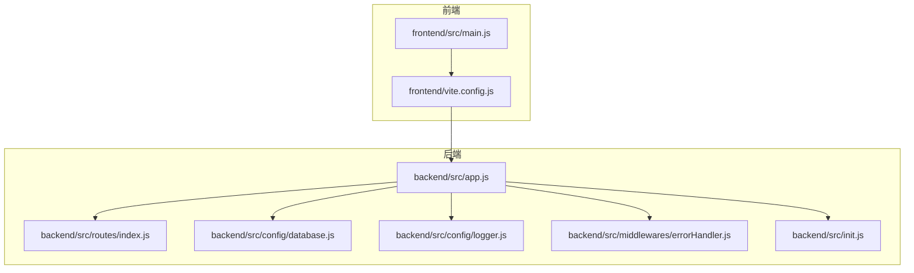
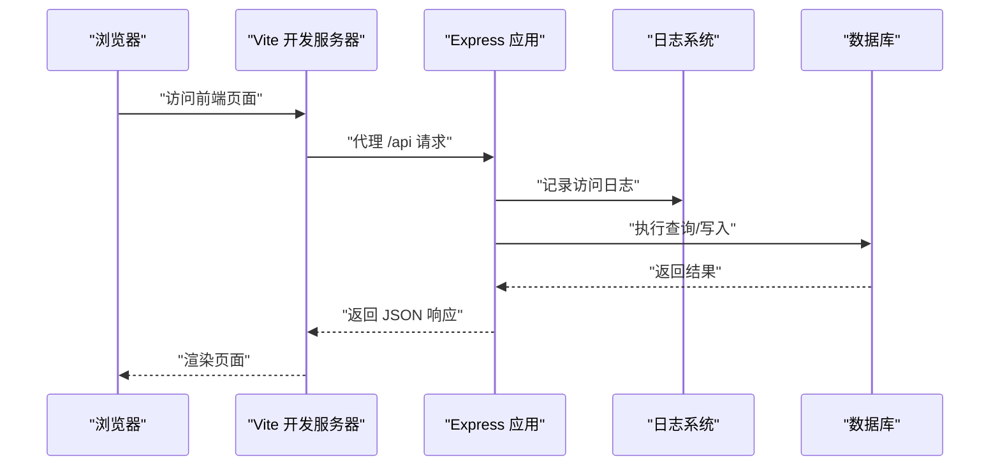
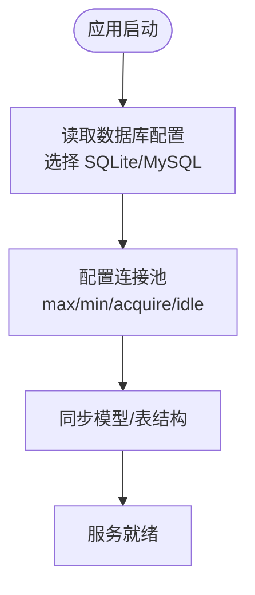
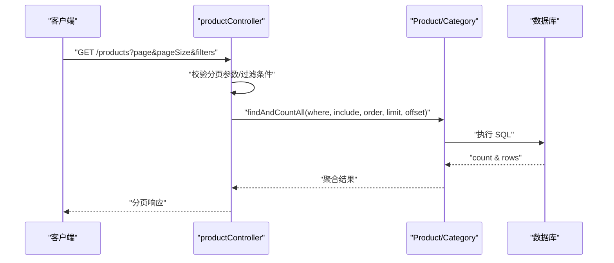
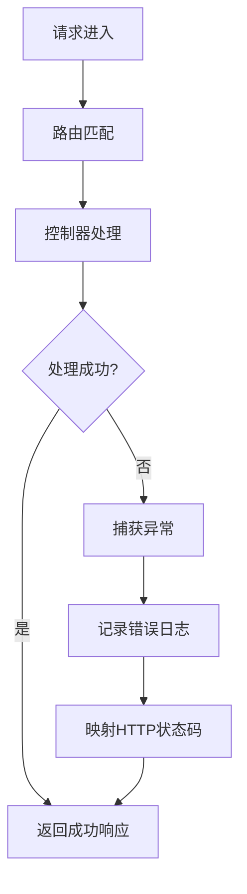
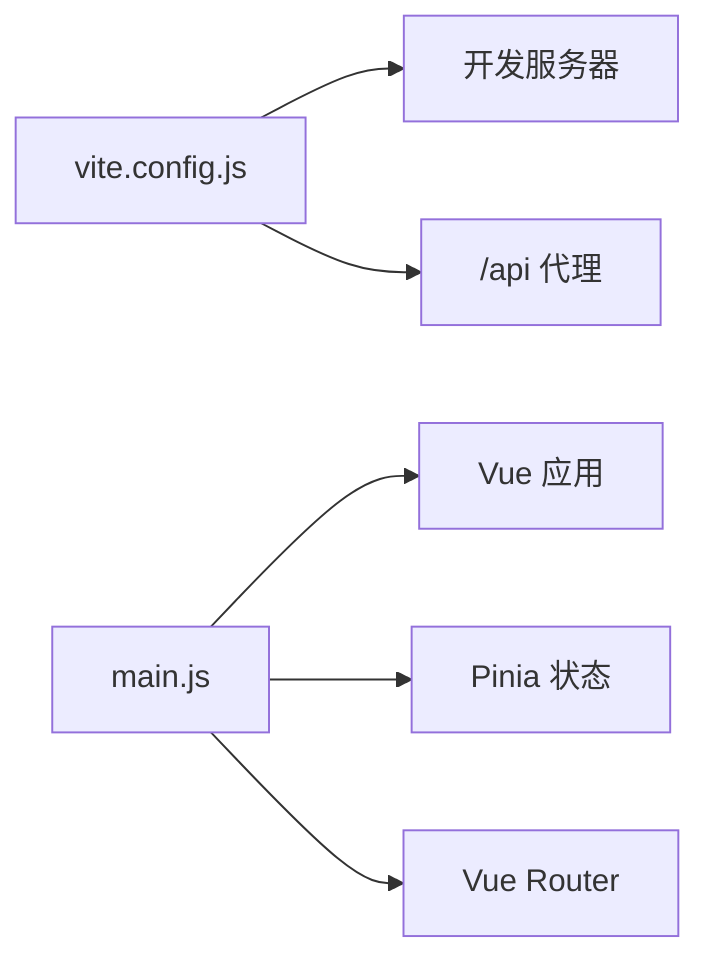
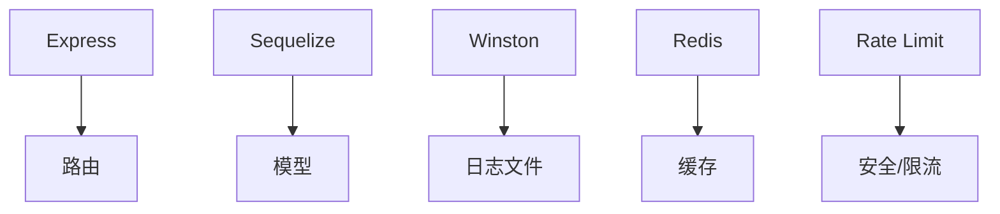

# 性能问题诊断

<cite>
**本文引用的文件**
- [backend/package.json](file://backend/package.json)
- [frontend/package.json](file://frontend/package.json)
- [backend/src/app.js](file://backend/src/app.js)
- [backend/src/init.js](file://backend/src/init.js)
- [backend/src/config/database.js](file://backend/src/config/database.js)
- [backend/src/config/logger.js](file://backend/src/config/logger.js)
- [backend/src/middlewares/errorHandler.js](file://backend/src/middlewares/errorHandler.js)
- [backend/src/routes/index.js](file://backend/src/routes/index.js)
- [backend/src/controllers/productController.js](file://backend/src/controllers/productController.js)
- [backend/src/models/Product.js](file://backend/src/models/Product.js)
- [backend/src/models/User.js](file://backend/src/models/User.js)
- [frontend/vite.config.js](file://frontend/vite.config.js)
- [frontend/src/main.js](file://frontend/src/main.js)
- [backend/diagnose.js](file://backend/diagnose.js)
</cite>

## 目录
1. [简介](#简介)
2. [项目结构](#项目结构)
3. [核心组件](#核心组件)
4. [架构总览](#架构总览)
5. [详细组件分析](#详细组件分析)
6. [依赖关系分析](#依赖关系分析)
7. [性能考量](#性能考量)
8. [故障排查指南](#故障排查指南)
9. [结论](#结论)
10. [附录](#附录)

## 简介
本指南面向“趣配鲜”项目的性能问题诊断与优化，覆盖系统响应慢、内存占用高、CPU 使用率异常、并发能力不足等常见问题。文档结合现有代码结构，给出基于 Node.js 内置性能分析工具（profiler、heapdump、进程监控）、数据库查询优化（慢查询日志、索引与查询优化）、前端性能优化（懒加载、图片压缩、代码分割、缓存策略）、缓存系统配置（Redis、浏览器缓存、CDN）、负载均衡与水平扩展（多实例部署、会话共享）、监控与告警（APM 集成、指标采集、异常告警）、以及性能测试（压测、负载测试、基准测试）的实操建议。

## 项目结构
后端采用 Express + Sequelize 的典型 Node.js 架构，前端使用 Vue 3 + Vite。整体以模块化组织：路由层、控制器层、模型层、中间件与配置层清晰分离；数据库连接池与日志系统已具备基础能力；开发与生产环境差异通过环境变量控制。

**图表来源**
- [frontend/src/main.js:1-56](file://frontend/src/main.js#L1-L56)
- [frontend/vite.config.js:1-26](file://frontend/vite.config.js#L1-L26)
- [backend/src/app.js:1-84](file://backend/src/app.js#L1-L84)
- [backend/src/routes/index.js:1-27](file://backend/src/routes/index.js#L1-L27)
- [backend/src/config/database.js:1-56](file://backend/src/config/database.js#L1-L56)
- [backend/src/config/logger.js:1-52](file://backend/src/config/logger.js#L1-L52)
- [backend/src/middlewares/errorHandler.js:1-47](file://backend/src/middlewares/errorHandler.js#L1-L47)
- [backend/src/init.js:1-502](file://backend/src/init.js#L1-L502)

**章节来源**
- [backend/src/app.js:1-84](file://backend/src/app.js#L1-L84)
- [backend/src/routes/index.js:1-27](file://backend/src/routes/index.js#L1-L27)
- [backend/src/config/database.js:1-56](file://backend/src/config/database.js#L1-L56)
- [backend/src/config/logger.js:1-52](file://backend/src/config/logger.js#L1-L52)
- [backend/src/middlewares/errorHandler.js:1-47](file://backend/src/middlewares/errorHandler.js#L1-L47)
- [backend/src/init.js:1-502](file://backend/src/init.js#L1-L502)
- [frontend/vite.config.js:1-26](file://frontend/vite.config.js#L1-L26)
- [frontend/src/main.js:1-56](file://frontend/src/main.js#L1-L56)

## 核心组件
- 应用入口与中间件：Helmet、CORS、XSS 清理、Mongo 注入清理、限流、日志、静态资源、路由挂载与错误处理。
- 数据库连接：支持 SQLite 与 MySQL，配置连接池与日志开关，定义表命名风格与时间戳字段。
- 日志系统：Winston 输出 error/combined/access 文件，开发环境输出控制台。
- 错误处理：统一错误响应与日志记录，区分业务与系统错误。
- 初始化流程：数据库认证、同步、种子数据与演示账号初始化。
- 前端构建与代理：Vite 开发服务器、API 代理、生产构建与源码映射策略。

**章节来源**
- [backend/src/app.js:1-84](file://backend/src/app.js#L1-L84)
- [backend/src/config/database.js:1-56](file://backend/src/config/database.js#L1-L56)
- [backend/src/config/logger.js:1-52](file://backend/src/config/logger.js#L1-L52)
- [backend/src/middlewares/errorHandler.js:1-47](file://backend/src/middlewares/errorHandler.js#L1-L47)
- [backend/src/init.js:1-502](file://backend/src/init.js#L1-L502)
- [frontend/vite.config.js:1-26](file://frontend/vite.config.js#L1-L26)

## 架构总览
后端服务通过 Express 提供 REST API，前端通过 Vite 开发服务器与后端交互，开发阶段使用本地代理将 /api 请求转发至后端。数据库层通过 Sequelize 连接 MySQL 或 SQLite，支持连接池与查询日志。

**图表来源**
- [frontend/vite.config.js:14-19](file://frontend/vite.config.js#L14-L19)
- [backend/src/app.js:41-50](file://backend/src/app.js#L41-L50)
- [backend/src/config/logger.js:21-39](file://backend/src/config/logger.js#L21-L39)
- [backend/src/config/database.js:38-43](file://backend/src/config/database.js#L38-L43)

## 详细组件分析

### 数据库连接与查询性能
- 连接池配置：最大连接数、最小空闲、获取超时、空闲回收，适合中等并发场景。
- 查询日志：开发模式开启 Sequelize 日志，便于定位慢查询与异常 SQL。
- 模型设计：JSON 字段用于富文本/数组，注意查询时避免全表扫描与不必要的 JSON 解析。

**图表来源**
- [backend/src/config/database.js:9-53](file://backend/src/config/database.js#L9-L53)

**章节来源**
- [backend/src/config/database.js:1-56](file://backend/src/config/database.js#L1-L56)

### 控制器与查询优化要点
- 列表查询：分页参数校验、WHERE 条件拼装、排序字段固定顺序，避免动态 OR 条件导致索引失效。
- 详情查询：严格 ID 类型校验，包含关联查询时注意 JOIN 与 LIMIT，避免 N+1 查询。
- 收藏/浏览历史：使用 findOrCreate 并增量更新，注意唯一索引与幂等性。

**图表来源**
- [backend/src/controllers/productController.js:6-42](file://backend/src/controllers/productController.js#L6-L42)
- [backend/src/models/Product.js:1-190](file://backend/src/models/Product.js#L1-L190)

**章节来源**
- [backend/src/controllers/productController.js:1-527](file://backend/src/controllers/productController.js#L1-L527)
- [backend/src/models/Product.js:1-190](file://backend/src/models/Product.js#L1-L190)

### 错误处理与日志
- 统一错误响应：根据错误类型映射 HTTP 状态码，开发环境返回堆栈，生产环境隐藏细节。
- 访问日志：morgan 结合 Winston 输出到文件，便于审计与性能分析。

**图表来源**
- [backend/src/middlewares/errorHandler.js:3-37](file://backend/src/middlewares/errorHandler.js#L3-L37)
- [backend/src/app.js:41-50](file://backend/src/app.js#L41-L50)
- [backend/src/config/logger.js:10-39](file://backend/src/config/logger.js#L10-L39)

**章节来源**
- [backend/src/middlewares/errorHandler.js:1-47](file://backend/src/middlewares/errorHandler.js#L1-L47)
- [backend/src/config/logger.js:1-52](file://backend/src/config/logger.js#L1-L52)
- [backend/src/app.js:1-84](file://backend/src/app.js#L1-L84)

### 前端构建与运行
- 开发服务器：端口与代理配置，将 /api 转发至后端 3000 端口。
- 依赖与脚本：Vue 3、Pinia、Vant 移动端 UI、Vite 构建工具链。
- 主入口：全局注册 UI 组件与路由，初始化用户会话。

**图表来源**
- [frontend/vite.config.js:12-24](file://frontend/vite.config.js#L12-L24)
- [frontend/src/main.js:1-56](file://frontend/src/main.js#L1-L56)

**章节来源**
- [frontend/vite.config.js:1-26](file://frontend/vite.config.js#L1-L26)
- [frontend/src/main.js:1-56](file://frontend/src/main.js#L1-L56)

## 依赖关系分析
- 后端依赖：Express、Sequelize、MySQL2、Redis、Winston、Morgan、Helmet、Rate Limit 等。
- 前端依赖：Vue 3、Vue Router、Pinia、Vant、Vite。
- 关键耦合点：路由 -> 控制器 -> 模型；日志中间件贯穿请求生命周期；数据库连接池影响整体吞吐。

**图表来源**
- [backend/package.json:18-40](file://backend/package.json#L18-L40)
- [frontend/package.json:10-24](file://frontend/package.json#L10-L24)

**章节来源**
- [backend/package.json:1-50](file://backend/package.json#L1-L50)
- [frontend/package.json:1-26](file://frontend/package.json#L1-L26)

## 性能考量
- Node.js 内置性能分析
  - CPU Profiling：使用 --prof 生成 V8 profile，结合 clinic doctor/clinic flame 定位热点函数。
  - Heap Dump：使用 --inspect-brk 在内存峰值附近触发快照，结合 heapdump/clinic bubbleprof 分析内存泄漏。
  - 进程监控：使用 top/htop、pidstat、strace 观察 CPU、内存、上下文切换与系统调用。
- 数据库查询优化
  - 慢查询日志：MySQL 开启 slow_query_log，设置 long_query_time；SQLite 可通过 Sequelize 日志观察。
  - 索引优化：为高频过滤字段（如 category_id、is_on_sale、created_at）建立复合索引；避免在 WHERE 中对列做函数运算。
  - 查询语句优化：减少 SELECT *，明确字段；避免 N+1 查询，使用 include 预加载；分页使用 limit+offset，必要时使用覆盖索引。
- 前端性能优化
  - 组件懒加载：路由级懒加载与动态 import，减少首屏 JS 体积。
  - 图片压缩与格式：优先 WebP/JPEG2000，按需加载与尺寸裁剪；使用 v-lazy 指令延迟加载。
  - 代码分割：Vite 默认按入口拆分，合理拆分第三方库与业务代码；启用动态导入。
  - 缓存策略：HTTP 缓存（ETag/Cache-Control）、Service Worker、CDN 缓存。
- 缓存系统
  - Redis：热点数据（商品详情、分类、购物车）缓存；设置过期策略与淘汰机制；使用连接池。
  - 浏览器缓存：静态资源强缓存、版本化；接口响应缓存（协商缓存）。
  - CDN 加速：静态资源走 CDN，边缘节点缓存；回源压缩与 Gzip。
- 负载均衡与水平扩展
  - 多实例部署：PM2/容器编排多副本；反向代理（Nginx/Haproxy）分发请求。
  - 会话共享：Redis 存储 Session；或无状态化（JWT），避免粘性会话。
- 监控与告警
  - APM：DataDog/NewRelic/AppDynamics 或开源 OpenTelemetry + Jaeger/Prometheus/Grafana。
  - 指标采集：QPS、P95/P99 延迟、错误率、连接池利用率、GC 指标。
  - 异常告警：阈值告警、趋势告警、变更告警（灰度/发布）。
- 性能测试
  - 压力测试：wrk/Artillery/JMeter，模拟峰值并发与持久压力。
  - 负载测试：逐步加压，观察系统拐点与恢复能力。
  - 基准测试：针对关键路径（商品列表、下单流程）做回归对比。

[本节为通用性能指导，无需特定文件引用]

## 故障排查指南
- 快速自检清单
  - 确认数据库连接：连接池大小、超时、日志开关。
  - 检查慢查询：开启慢查询日志，定位耗时 SQL。
  - 查看访问日志：结合错误日志定位异常请求与堆栈。
  - 评估前端体积：Bundle 分析，识别大依赖与重复打包。
- Node.js 诊断脚本
  - 使用内置 profiler 与 heapdump 采集 CPU/内存数据，结合火焰图与堆快照分析。
  - 使用诊断脚本（如现有 diagnose.js）验证数据库连通性、表结构与最小化创建流程，排除环境问题。
- 常见问题定位
  - 响应慢：关注控制器复杂度、数据库查询、外部依赖（上传/支付/短信）。
  - 内存高：排查对象泄漏、缓存未清理、大对象未释放。
  - CPU 高：热点函数、阻塞 I/O、循环计算、正则滥用。
  - 并发不足：连接池过小、限流过严、队列积压。

**章节来源**
- [backend/diagnose.js:1-107](file://backend/diagnose.js#L1-L107)
- [backend/src/config/logger.js:1-52](file://backend/src/config/logger.js#L1-L52)
- [backend/src/config/database.js:1-56](file://backend/src/config/database.js#L1-L56)

## 结论
通过对现有代码的分析，系统在中间件、日志、数据库连接与错误处理方面已具备基础性能观测与治理能力。建议在此基础上完善数据库慢查询治理、引入缓存与 CDN、优化前端构建与懒加载、建立 APM 监控与压测体系，并结合 Node.js 内置分析工具进行持续优化。以上措施将显著提升系统稳定性与用户体验。

## 附录
- 环境变量与配置建议
  - 数据库：DB_CONNECTION、DB_NAME/DB_USER/DB_PASSWORD、DB_HOST/DB_PORT、NODE_ENV、日志开关。
  - 限流：RATE_LIMIT_WINDOW_MS、RATE_LIMIT_MAX_REQUESTS。
  - 日志：LOG_DIR、LOG_LEVEL。
  - API：API_PREFIX、CORS_ORIGIN。
- 建议新增配置项
  - Redis：REDIS_URL、REDIS_POOL_SIZE。
  - CDN：CDN_BASE_URL、STATIC_CACHE_AGE。
  - APM：APM_ENABLED、APM_SERVER_URL。

[本节为通用配置建议，无需特定文件引用]