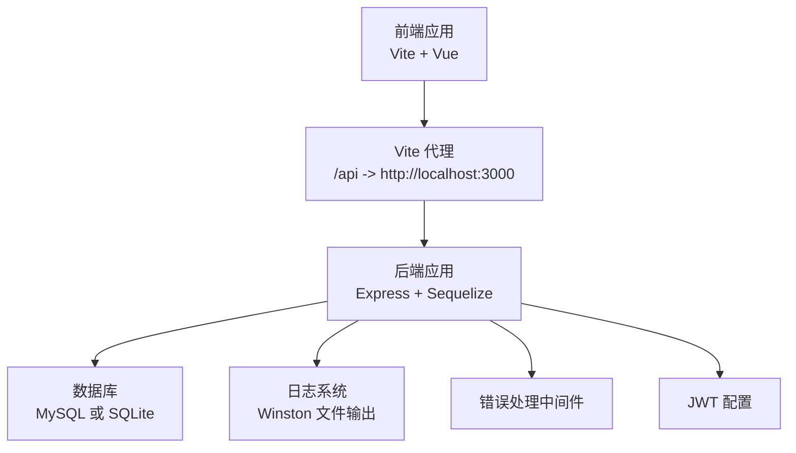
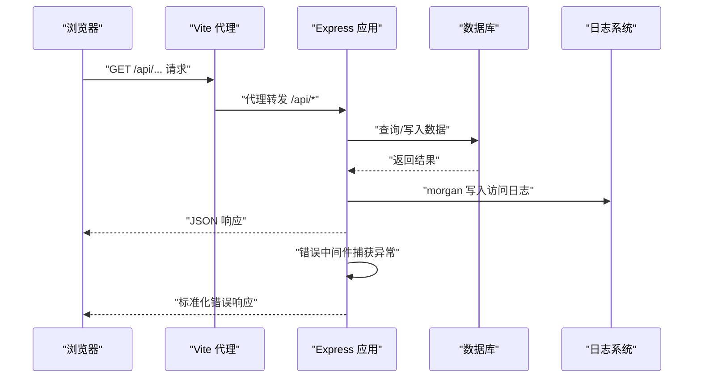
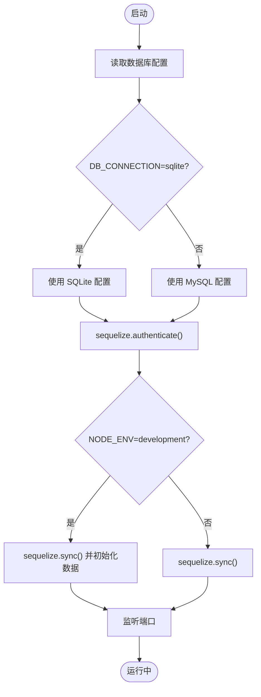
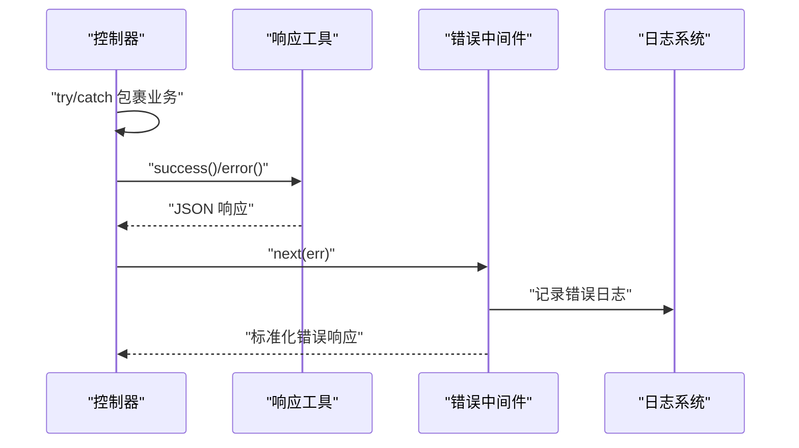
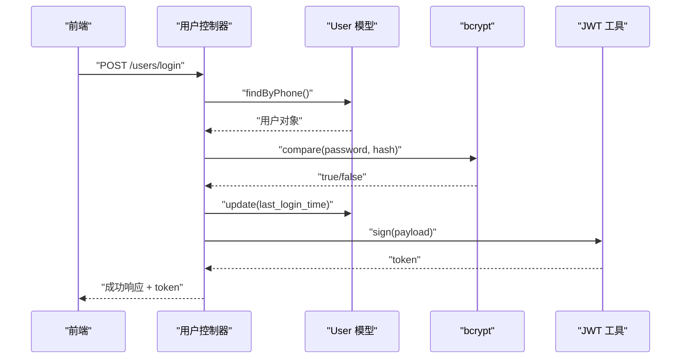
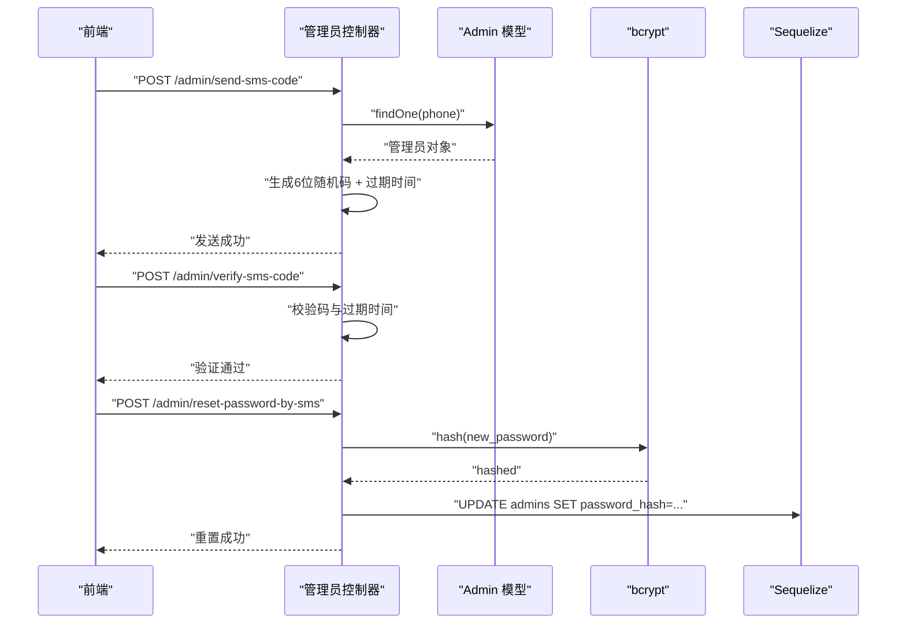
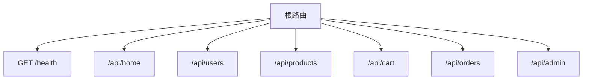
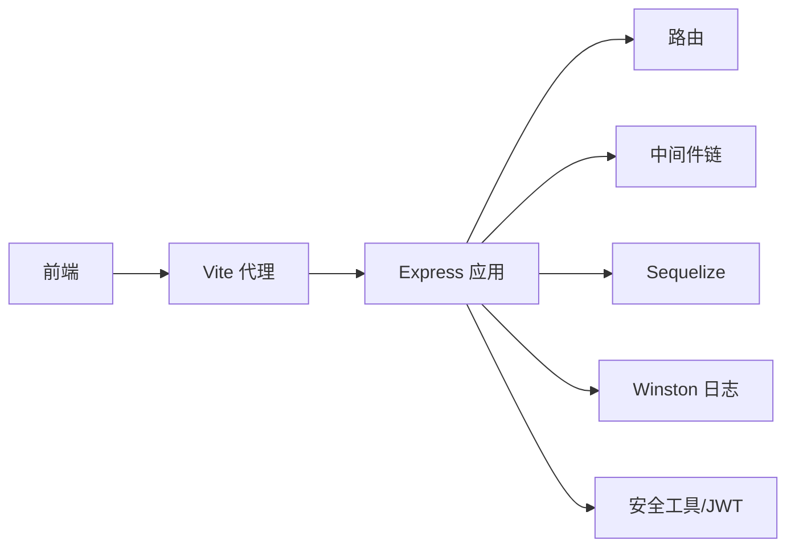

# 故障排除

<cite>
**本文引用的文件**
- [backend/src/app.js](file://backend/src/app.js)
- [backend/src/config/database.js](file://backend/src/config/database.js)
- [backend/src/middlewares/errorHandler.js](file://backend/src/middlewares/errorHandler.js)
- [backend/src/config/logger.js](file://backend/src/config/logger.js)
- [backend/src/routers/index.js](file://backend/src/routers/index.js)
- [backend/src/controllers/userController.js](file://backend/src/controllers/userController.js)
- [backend/src/controllers/adminController.js](file://backend/src/controllers/adminController.js)
- [backend/src/models/User.js](file://backend/src/models/User.js)
- [backend/src/config/constants.js](file://backend/src/config/constants.js)
- [backend/src/utils/security.js](file://backend/src/utils/security.js)
- [backend/src/config/jwt.js](file://backend/src/config/jwt.js)
- [backend/src/utils/response.js](file://backend/src/utils/response.js)
- [backend/package.json](file://backend/package.json)
- [frontend/vite.config.js](file://frontend/vite.config.js)
- [backend/diagnose.js](file://backend/diagnose.js)
- [backend/test-full.js](file://backend/test-full.js)
</cite>

## 目录
1. [简介](#简介)
2. [项目结构](#项目结构)
3. [核心组件](#核心组件)
4. [架构总览](#架构总览)
5. [详细组件分析](#详细组件分析)
6. [依赖关系分析](#依赖关系分析)
7. [性能考虑](#性能考虑)
8. [故障排除指南](#故障排除指南)
9. [结论](#结论)
10. [附录](#附录)

## 简介
本指南面向“趣配鲜”项目的开发与运维人员，聚焦于常见问题的诊断与解决，覆盖数据库连接、API 错误、前端渲染异常、系统监控与日志分析、开发环境问题排查、生产环境应急处理、网络与安全问题、性能诊断与优化、第三方服务集成问题、调试工具与技巧以及预防性维护建议。文档以代码为依据，结合实际部署与开发场景，提供可执行的排障步骤与最佳实践。

## 项目结构
后端采用 Express + Sequelize 架构，前端基于 Vue 3 + Vite，通过代理将前端请求转发至后端 API。整体采用模块化路由组织业务模块，并通过统一中间件处理错误与 404。

图表来源
- [frontend/vite.config.js:12-20](file://frontend/vite.config.js#L12-L20)
- [backend/src/app.js:17-50](file://backend/src/app.js#L17-L50)
- [backend/src/config/database.js:10-53](file://backend/src/config/database.js#L10-L53)
- [backend/src/config/logger.js:21-39](file://backend/src/config/logger.js#L21-L39)
- [backend/src/middlewares/errorHandler.js:3-44](file://backend/src/middlewares/errorHandler.js#L3-L44)
- [backend/src/config/jwt.js:3-8](file://backend/src/config/jwt.js#L3-L8)

章节来源
- [backend/src/app.js:1-84](file://backend/src/app.js#L1-L84)
- [frontend/vite.config.js:1-26](file://frontend/vite.config.js#L1-L26)

## 核心组件
- 应用入口与启动：负责 CORS、速率限制、日志、静态资源、路由挂载、数据库连接与初始化、端口监听。
- 数据库配置：支持 SQLite 与 MySQL，提供连接池、时区、字符集等参数。
- 日志系统：Winston 输出 error/combined/access 三类日志文件，支持控制台输出。
- 错误处理：集中捕获异常，区分业务错误类型并返回标准化响应。
- 路由与控制器：按模块划分路由，控制器实现用户、管理员、订单、商品等业务逻辑。
- 安全与加密：密码哈希、JWT、敏感信息掩码与 AES 加解密。
- 响应工具：统一封装成功/失败响应与分页响应格式。

章节来源
- [backend/src/app.js:17-84](file://backend/src/app.js#L17-L84)
- [backend/src/config/database.js:10-53](file://backend/src/config/database.js#L10-L53)
- [backend/src/config/logger.js:10-52](file://backend/src/config/logger.js#L10-L52)
- [backend/src/middlewares/errorHandler.js:3-44](file://backend/src/middlewares/errorHandler.js#L3-L44)
- [backend/src/utils/response.js:1-32](file://backend/src/utils/response.js#L1-L32)
- [backend/src/utils/security.js:1-48](file://backend/src/utils/security.js#L1-L48)
- [backend/src/config/jwt.js:10-32](file://backend/src/config/jwt.js#L10-L32)

## 架构总览
后端服务启动时进行数据库连通性校验与表结构同步，开发环境自动初始化数据，随后监听端口对外提供 API。前端通过 Vite 代理将 /api 前缀请求转发到后端。全局中间件负责错误与 404 统一处理，日志中间件将访问日志写入 Winston。

图表来源
- [frontend/vite.config.js:14-18](file://frontend/vite.config.js#L14-L18)
- [backend/src/app.js:41-50](file://backend/src/app.js#L41-L50)
- [backend/src/middlewares/errorHandler.js:3-44](file://backend/src/middlewares/errorHandler.js#L3-L44)
- [backend/src/config/logger.js:21-39](file://backend/src/config/logger.js#L21-L39)

## 详细组件分析

### 数据库连接与初始化
- 支持 SQLite 与 MySQL 两种模式，通过环境变量切换。
- 开发环境自动同步表结构并初始化数据，生产环境仅同步。
- 提供连接池参数与日志开关，便于开发调试。

图表来源
- [backend/src/config/database.js:10-53](file://backend/src/config/database.js#L10-L53)
- [backend/src/app.js:57-79](file://backend/src/app.js#L57-L79)

章节来源
- [backend/src/config/database.js:10-53](file://backend/src/config/database.js#L10-L53)
- [backend/src/app.js:57-79](file://backend/src/app.js#L57-L79)

### 错误处理与统一响应
- 错误中间件记录错误上下文（URL、方法、IP、堆栈），并根据错误类型映射 HTTP 状态码。
- 控制器统一使用响应工具返回成功/失败/分页格式，便于前端解析。

图表来源
- [backend/src/middlewares/errorHandler.js:3-44](file://backend/src/middlewares/errorHandler.js#L3-L44)
- [backend/src/utils/response.js:1-32](file://backend/src/utils/response.js#L1-L32)
- [backend/src/config/logger.js:10-52](file://backend/src/config/logger.js#L10-L52)

章节来源
- [backend/src/middlewares/errorHandler.js:3-44](file://backend/src/middlewares/errorHandler.js#L3-L44)
- [backend/src/utils/response.js:1-32](file://backend/src/utils/response.js#L1-L32)

### 用户登录与密码安全
- 登录流程包含用户查询、状态校验、密码比较、最后登录时间更新与 JWT 签发。
- 密码哈希在模型层自动处理，支持明文密码入库前的哈希转换。
- 提供忘记密码与重置密码流程，配合短信验证码（内存存储）。

图表来源
- [backend/src/controllers/userController.js:44-93](file://backend/src/controllers/userController.js#L44-L93)
- [backend/src/models/User.js:131-147](file://backend/src/models/User.js#L131-L147)
- [backend/src/config/jwt.js:10-16](file://backend/src/config/jwt.js#L10-L16)

章节来源
- [backend/src/controllers/userController.js:44-93](file://backend/src/controllers/userController.js#L44-L93)
- [backend/src/models/User.js:131-147](file://backend/src/models/User.js#L131-L147)
- [backend/src/config/jwt.js:10-16](file://backend/src/config/jwt.js#L10-L16)

### 管理员与短信验证码
- 管理员登录、密码重置、角色管理与统计接口。
- 短信验证码采用内存存储，带过期时间，支持校验与重置密码。

图表来源
- [backend/src/controllers/adminController.js:268-347](file://backend/src/controllers/adminController.js#L268-L347)

章节来源
- [backend/src/controllers/adminController.js:268-347](file://backend/src/controllers/adminController.js#L268-L347)

### 健康检查与路由组织
- 根路由提供健康检查接口，便于外部探活。
- 路由按模块划分，统一挂载到 /api 前缀。

图表来源
- [backend/src/routers/index.js:18-24](file://backend/src/routers/index.js#L18-L24)
- [backend/src/app.js:49-50](file://backend/src/app.js#L49-L50)

章节来源
- [backend/src/routers/index.js:18-24](file://backend/src/routers/index.js#L18-L24)
- [backend/src/app.js:49-50](file://backend/src/app.js#L49-L50)

## 依赖关系分析
- 后端依赖：Express、Sequelize、Winston、Morgan、CORS、Helmet、Rate Limit、XSS 清理、Mongo 注入清理、JWT、Bcrypt、Multer、Redis、Axios、XLSX 等。
- 前端依赖：Vue 3、Vue Router、Pinia、Axios、Vant、TailwindCSS、Vite。
- 关键耦合点：Express 中间件链、路由与控制器、数据库连接、日志与错误处理、JWT 与安全工具。

图表来源
- [backend/src/app.js:17-53](file://backend/src/app.js#L17-L53)
- [backend/package.json:18-39](file://backend/package.json#L18-L39)
- [frontend/vite.config.js:12-20](file://frontend/vite.config.js#L12-L20)

章节来源
- [backend/package.json:18-39](file://backend/package.json#L18-L39)
- [frontend/vite.config.js:12-20](file://frontend/vite.config.js#L12-L20)

## 性能考虑
- 数据库连接池：合理设置最大/最小连接数与获取超时，避免高并发下的连接争用。
- 查询优化：对高频查询建立索引，避免 N+1 查询，使用分页与条件过滤。
- 缓存策略：对热点数据使用 Redis 缓存，设置合理的过期时间与失效策略。
- 日志级别：生产环境降低日志量，避免磁盘 IO 抖动；开发环境开启详细日志辅助定位。
- 前端构建：关闭 SourceMap 以减少体积与调试成本。

章节来源
- [backend/src/config/database.js:38-43](file://backend/src/config/database.js#L38-L43)
- [backend/src/config/logger.js:10-52](file://backend/src/config/logger.js#L10-L52)
- [frontend/vite.config.js:21-24](file://frontend/vite.config.js#L21-L24)

## 故障排除指南

### 一、数据库连接问题
- 症状：启动时报数据库连接失败或无法同步表结构。
- 排查步骤：
  - 检查数据库类型与连接参数（主机、端口、用户名、密码、数据库名、文件路径）。
  - 确认数据库服务运行正常，网络可达。
  - 开发环境确认 .env 文件加载顺序与路径。
  - 查看日志目录是否存在及权限是否足够。
- 解决方案：
  - 修正 .env 中的数据库配置项。
  - 若使用 SQLite，确认文件路径与权限。
  - 若使用 MySQL，确认字符集与时区设置与应用一致。

章节来源
- [backend/src/config/database.js:5-53](file://backend/src/config/database.js#L5-L53)
- [backend/src/app.js:57-79](file://backend/src/app.js#L57-L79)
- [backend/src/config/logger.js:5-8](file://backend/src/config/logger.js#L5-L8)

### 二、API 接口错误
- 常见错误类型：
  - 400 验证错误：请求体字段缺失或格式不符。
  - 401 未授权：缺少或无效的 JWT。
  - 403 禁止访问：权限不足或账户被禁用。
  - 404 资源不存在：路径或 ID 错误。
  - 500 服务器内部错误：未捕获异常或业务逻辑异常。
- 排查步骤：
  - 查看统一错误响应中的 message 与 stack（开发环境）。
  - 使用诊断脚本或端到端测试脚本定位具体环节。
  - 对照控制器与模型定义，核对字段类型与约束。
- 解决方案：
  - 在控制器中完善输入校验与错误分支。
  - 在中间件中正确传递用户上下文与权限校验。
  - 对数据库约束错误（如外键、唯一性）给出明确提示。

章节来源
- [backend/src/middlewares/errorHandler.js:3-44](file://backend/src/middlewares/errorHandler.js#L3-L44)
- [backend/diagnose.js:84-101](file://backend/diagnose.js#L84-L101)
- [backend/test-full.js:95-116](file://backend/test-full.js#L95-L116)

### 三、前端渲染异常
- 症状：页面空白、接口 404、跨域错误。
- 排查步骤：
  - 检查 Vite 代理配置是否指向后端地址与端口。
  - 确认 API 前缀与后端路由一致。
  - 打开浏览器开发者工具查看 Network 与 Console。
- 解决方案：
  - 修改 vite.config.js 的代理 target 与 changeOrigin。
  - 确保后端 CORS 允许前端域名与凭证配置。
  - 核对前端请求路径与后端路由前缀。

章节来源
- [frontend/vite.config.js:12-20](file://frontend/vite.config.js#L12-L20)
- [backend/src/app.js:21-24](file://backend/src/app.js#L21-L24)
- [backend/src/app.js:49-50](file://backend/src/app.js#L49-L50)

### 四、系统监控与日志分析
- 日志级别与输出：
  - 通过环境变量设置日志级别与输出目录。
  - Winston 输出 error/combined/access 三类文件，生产环境建议只保留 error 与 combined。
- 日志分析要点：
  - 访问日志用于流量与路径分析；错误日志用于定位异常堆栈。
  - 结合 morgan 与 winston，统一格式化时间戳与元数据。
- 性能分析：
  - 使用 Node.js Profiler 分析 CPU 与内存占用。
  - 关注慢查询与阻塞操作，结合数据库慢日志定位。

章节来源
- [backend/src/config/logger.js:10-52](file://backend/src/config/logger.js#L10-L52)
- [backend/src/app.js:41-45](file://backend/src/app.js#L41-L45)

### 五、开发环境问题排查
- 端口冲突：
  - 后端默认端口 3000，前端默认 5173；若冲突修改对应配置。
- 依赖安装失败：
  - 清理 node_modules 与 lock 文件，更换镜像源或使用 pnpm。
- 配置错误：
  - 检查 .env 文件内容与加载路径，确保数据库、JWT、日志等参数正确。
- 初始化问题：
  - 开发环境会自动同步表结构与初始化数据，若失败查看日志与数据库权限。

章节来源
- [backend/src/app.js:55-79](file://backend/src/app.js#L55-L79)
- [backend/src/config/database.js:5](file://backend/src/config/database.js#L5)

### 六、生产环境应急处理
- 服务重启：
  - 使用进程管理器（PM2）守护进程，配置健康检查与自动重启。
- 数据库恢复：
  - 备份策略：定期导出 SQL 或备份 SQLite 文件。
  - 恢复流程：停止服务 -> 恢复数据 -> 启动服务 -> 验证健康检查。
- 性能降级：
  - 临时关闭非关键接口，启用缓存，限制并发与速率。
  - 降低日志级别与频率，避免磁盘 IO 抖动。

章节来源
- [backend/src/app.js:57-79](file://backend/src/app.js#L57-L79)
- [backend/src/config/logger.js:10-52](file://backend/src/config/logger.js#L10-L52)

### 七、网络与安全问题
- 跨域问题：
  - 后端 CORS 配置允许前端域名与凭证；前端代理 target 与 changeOrigin 必须正确。
- 认证失败与权限错误：
  - 检查 JWT Secret 是否一致，过期时间是否合理。
  - 核对权限中间件与角色常量，确保用户状态正常。
- 敏感信息保护：
  - 使用 AES 对手机号等敏感信息进行加解密与掩码显示。
  - 密码必须使用 Bcrypt 哈希存储，避免明文或弱加密。

章节来源
- [backend/src/app.js:21-24](file://backend/src/app.js#L21-L24)
- [backend/src/config/jwt.js:3-8](file://backend/src/config/jwt.js#L3-L8)
- [backend/src/utils/security.js:16-38](file://backend/src/utils/security.js#L16-L38)
- [backend/src/models/User.js:131-147](file://backend/src/models/User.js#L131-L147)

### 八、性能问题诊断与优化
- 数据库查询优化：
  - 为高频查询字段建立索引；避免 SELECT *；使用分页与条件过滤。
  - 使用事务批量写入，减少往返次数。
- 内存泄漏检测：
  - 使用 Node.js 内置 heap 与 profiler，关注长生命周期对象与事件监听器。
- 缓存策略调整：
  - 对热点数据使用 Redis 缓存，设置 TTL 与失效策略。
  - 前端缓存接口响应，减少重复请求。

章节来源
- [backend/src/config/database.js:38-43](file://backend/src/config/database.js#L38-L43)
- [backend/src/utils/security.js:1-48](file://backend/src/utils/security.js#L1-L48)

### 九、第三方服务集成问题
- 支付接口：
  - 核对接口签名算法与参数顺序；记录回调日志与幂等处理。
- 短信服务：
  - 与管理员短信验证码流程类似，建议使用队列与重试机制。
- 文件存储：
  - 统一上传接口与鉴权；对大文件分片上传与断点续传。

章节来源
- [backend/src/controllers/adminController.js:268-347](file://backend/src/controllers/adminController.js#L268-L347)

### 十、调试工具与技巧
- 浏览器开发者工具：
  - Network 面板查看请求/响应与状态码；Console 查看错误堆栈。
- Node.js 调试器：
  - 使用 --inspect 参数与 Chrome DevTools 远程调试；断点定位异常。
- 数据库客户端：
  - 使用可视化工具连接数据库，执行 SQL 验证数据一致性与索引情况。

章节来源
- [backend/src/middlewares/errorHandler.js:4-10](file://backend/src/middlewares/errorHandler.js#L4-L10)

### 十一、预防性维护建议
- 周期性巡检：
  - 健康检查接口、数据库连通性、磁盘空间与日志轮转。
- 版本与依赖管理：
  - 定期升级依赖，关注安全公告；锁定兼容版本。
- 备份与演练：
  - 制定备份策略并定期演练恢复流程。
- 监控告警：
  - 设置关键指标阈值（错误率、响应时间、连接数、CPU/内存）并告警。

章节来源
- [backend/src/routers/index.js:18-24](file://backend/src/routers/index.js#L18-L24)
- [backend/src/config/logger.js:21-39](file://backend/src/config/logger.js#L21-L39)

## 结论
本指南从系统架构、核心组件、日志与错误处理、开发与生产环境、性能与安全等多个维度提供了“趣配鲜”项目的故障排除方法。建议团队在日常开发中遵循统一的响应格式、严格的输入校验与权限控制，并建立完善的监控与备份体系，以提升系统的稳定性与可维护性。

## 附录
- 常用命令与脚本：
  - 后端启动：开发模式与生产模式脚本。
  - 诊断脚本：用于定位商品创建失败等问题。
  - 端到端测试：模拟前端请求流程，验证接口链路。

章节来源
- [backend/package.json:6-9](file://backend/package.json#L6-L9)
- [backend/diagnose.js:11-105](file://backend/diagnose.js#L11-L105)
- [backend/test-full.js:120-179](file://backend/test-full.js#L120-L179)