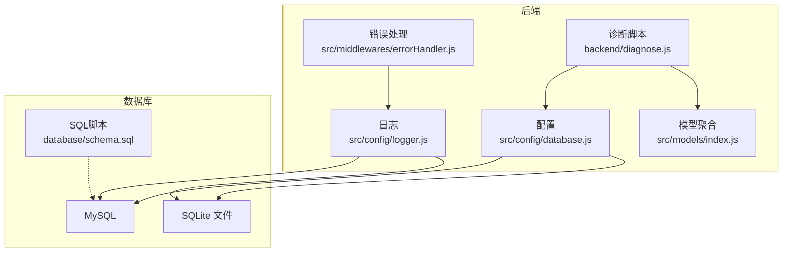
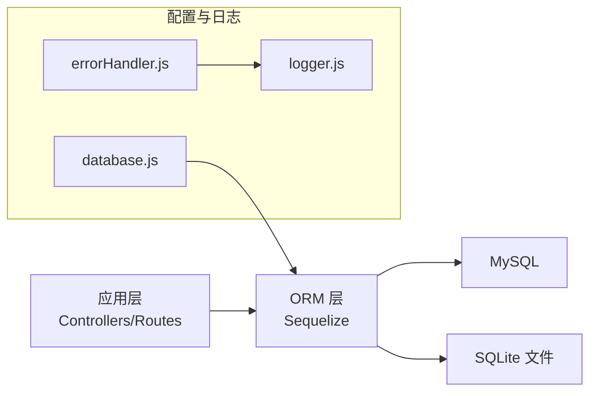
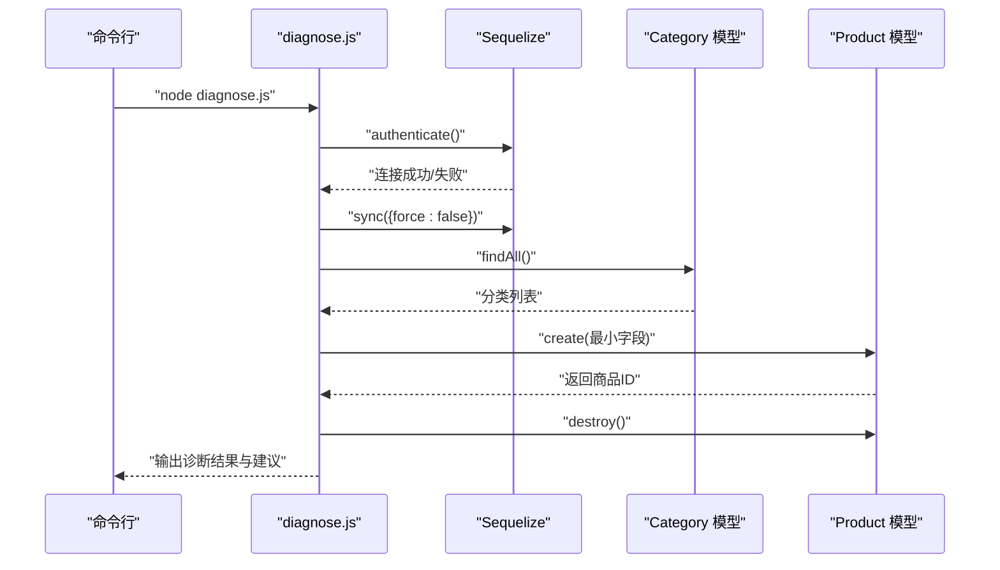
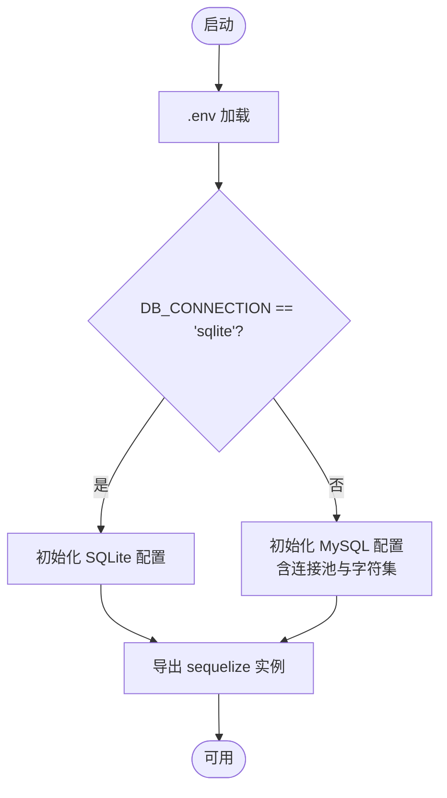
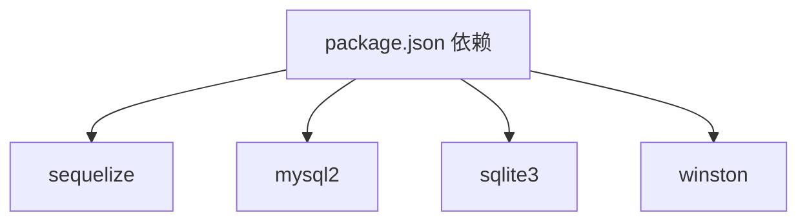

# 数据库问题

<cite>
**本文引用的文件**
- [diagnose.js](file://backend/diagnose.js)
- [database.js](file://backend/src/config/database.js)
- [index.js](file://backend/src/models/index.js)
- [errorHandler.js](file://backend/src/middlewares/errorHandler.js)
- [logger.js](file://backend/src/config/logger.js)
- [schema.sql](file://database/schema.sql)
- [package.json](file://backend/package.json)
- [test-env.js](file://backend/test-env.js)
- [check-password.js](file://check-password.js)
</cite>

## 目录
1. [简介](#简介)
2. [项目结构](#项目结构)
3. [核心组件](#核心组件)
4. [架构总览](#架构总览)
5. [详细组件分析](#详细组件分析)
6. [依赖分析](#依赖分析)
7. [性能考虑](#性能考虑)
8. [故障排除指南](#故障排除指南)
9. [结论](#结论)
10. [附录](#附录)

## 简介
本指南面向“趣配鲜”项目的数据库运维与开发人员，围绕数据库连接失败、表结构不匹配、数据同步错误、迁移失败、性能问题、备份恢复、权限排查与监控日志等主题，提供系统化的诊断与解决方案。文档同时详解如何使用项目内置的诊断脚本进行健康检查，并给出MySQL与SQLite两种数据库模式下的排障要点。

## 项目结构
后端采用Node.js + Sequelize ORM，数据库配置位于配置模块，模型定义集中在models目录并通过统一入口导出；错误处理中间件与日志模块负责异常捕获与日志输出；数据库脚本位于database目录；诊断脚本位于根目录。

图表来源
- [database.js:1-56](file://backend/src/config/database.js#L1-L56)
- [logger.js:1-52](file://backend/src/config/logger.js#L1-L52)
- [errorHandler.js:1-46](file://backend/src/middlewares/errorHandler.js#L1-L46)
- [index.js:1-92](file://backend/src/models/index.js#L1-L92)
- [diagnose.js:1-107](file://backend/diagnose.js#L1-L107)
- [schema.sql:777-805](file://database/schema.sql#L777-L805)

章节来源
- [database.js:1-56](file://backend/src/config/database.js#L1-L56)
- [logger.js:1-52](file://backend/src/config/logger.js#L1-L52)
- [errorHandler.js:1-46](file://backend/src/middlewares/errorHandler.js#L1-L46)
- [index.js:1-92](file://backend/src/models/index.js#L1-L92)
- [diagnose.js:1-107](file://backend/diagnose.js#L1-L107)
- [schema.sql:777-805](file://database/schema.sql#L777-L805)

## 核心组件
- 数据库配置模块：根据环境变量动态选择MySQL或SQLite，设置连接池、时区、字符集、日志开关与表命名策略。
- 模型聚合：集中导入与定义模型间关联关系，便于统一管理。
- 错误处理中间件：标准化错误响应与日志记录，包含堆栈信息。
- 日志模块：基于winston输出多文件日志，支持开发与生产环境差异化配置。
- 诊断脚本：执行连接测试、表结构同步、数据完整性与外键约束验证，并清理测试数据。
- SQL脚本：包含索引、备份记录表等结构定义，用于MySQL初始化与维护。

章节来源
- [database.js:1-56](file://backend/src/config/database.js#L1-L56)
- [index.js:1-92](file://backend/src/models/index.js#L1-L92)
- [errorHandler.js:1-46](file://backend/src/middlewares/errorHandler.js#L1-L46)
- [logger.js:1-52](file://backend/src/config/logger.js#L1-L52)
- [diagnose.js:1-107](file://backend/diagnose.js#L1-L107)
- [schema.sql:777-805](file://database/schema.sql#L777-L805)

## 架构总览
数据库层通过Sequelize抽象连接MySQL或SQLite，应用层通过模型与中间件实现业务与错误处理，日志模块贯穿全链路输出。

图表来源
- [database.js:1-56](file://backend/src/config/database.js#L1-L56)
- [logger.js:1-52](file://backend/src/config/logger.js#L1-L52)
- [errorHandler.js:1-46](file://backend/src/middlewares/errorHandler.js#L1-L46)

## 详细组件分析

### 诊断脚本（diagnose.js）
- 功能：连接测试、表结构同步、分类数据检查、最小字段商品创建测试、外键约束与验证错误提示、清理测试数据。
- 关键流程：连接认证 → 表结构同步 → 读取分类 → 创建测试商品 → 销毁测试数据 → 输出结果与建议。
- 错误处理：对验证错误与外键约束错误进行专项提示；打印堆栈以便定位。

图表来源
- [diagnose.js:11-79](file://backend/diagnose.js#L11-L79)

章节来源
- [diagnose.js:1-107](file://backend/diagnose.js#L1-L107)

### 数据库配置（database.js）
- 数据库类型：通过环境变量选择MySQL或SQLite。
- MySQL参数：主机、端口、用户名、密码、数据库名、字符集、时区、连接池、日志开关、表命名策略。
- SQLite参数：存储文件路径、日志开关、表命名策略。
- 环境变量加载：从项目根目录加载.env文件。

图表来源
- [database.js:5-53](file://backend/src/config/database.js#L5-L53)

章节来源
- [database.js:1-56](file://backend/src/config/database.js#L1-L56)

### 模型聚合与关联（index.js）
- 导入多个模型并建立一对多/多对一/一对一关联。
- 统一导出sequelize实例与各模型，供控制器与路由使用。

章节来源
- [index.js:1-92](file://backend/src/models/index.js#L1-L92)

### 错误处理与日志（errorHandler.js、logger.js）
- 错误处理中间件：捕获各类错误，记录到日志并返回标准化响应。
- 日志模块：按级别输出到不同文件，开发环境输出到控制台。

章节来源
- [errorHandler.js:1-46](file://backend/src/middlewares/errorHandler.js#L1-L46)
- [logger.js:1-52](file://backend/src/config/logger.js#L1-L52)

### SQL脚本与索引（schema.sql）
- 包含索引定义与备份记录表结构，用于MySQL初始化与维护。
- 示例：订单日志、备份记录等表的索引与字段设计。

章节来源
- [schema.sql:777-805](file://database/schema.sql#L777-L805)

## 依赖分析
- ORM与驱动：Sequelize作为ORM，MySQL使用mysql2驱动，SQLite使用sqlite3驱动。
- 日志：winston负责日志输出与轮转。
- 开发工具：Jest、Nodemon用于测试与热重载。

图表来源
- [package.json:18-40](file://backend/package.json#L18-L40)

章节来源
- [package.json:1-50](file://backend/package.json#L1-L50)

## 性能考虑
- 连接池配置：最大连接数、最小空闲、获取超时、空闲回收时间，需结合并发与数据库承载能力调整。
- 字符集与排序规则：MySQL使用utf8mb4与对应排序规则，避免emoji与多语言字符异常。
- 索引策略：根据查询热点字段建立合适索引，避免全表扫描。
- 日志开销：生产环境关闭SQL日志或限制日志级别，降低IO与CPU消耗。
- ORM批量操作：批量插入/更新时减少往返次数，避免逐条写入。

章节来源
- [database.js:38-50](file://backend/src/config/database.js#L38-L50)
- [schema.sql:777-805](file://database/schema.sql#L777-L805)

## 故障排除指南

### 一、数据库连接失败
- 症状：启动时报连接拒绝、凭证错误、主机不可达。
- 诊断步骤：
  - 使用诊断脚本进行连接测试，确认authenticate是否抛错。
  - 检查环境变量加载是否正确，使用环境变量检测脚本验证DB_CONNECTION、DB_FILENAME、NODE_ENV等。
  - 根据配置模块判断当前数据库类型，核对MySQL主机/端口/账号/密码或SQLite文件路径是否存在。
- 解决方案：
  - MySQL：确认网络连通、防火墙放行、账号权限、字符集一致。
  - SQLite：确认storage路径存在且可读写，文件权限正确。

章节来源
- [diagnose.js:14-18](file://backend/diagnose.js#L14-L18)
- [test-env.js:1-16](file://backend/test-env.js#L1-L16)
- [database.js:10-53](file://backend/src/config/database.js#L10-L53)

### 二、表结构不匹配/同步错误
- 症状：运行时报字段缺失、类型不匹配、外键约束失败。
- 诊断步骤：
  - 使用诊断脚本执行同步（force=false），观察是否报错。
  - 查看模型定义与实际表结构差异，关注freezeTableName与驼峰转下划线策略。
  - 检查SQL脚本中的索引与字段定义，确保与模型一致。
- 解决方案：
  - 使用Sequelize同步（谨慎使用force=true）或编写迁移脚本逐步修正。
  - 对于生产库，优先通过迁移工具与手动ALTER语句修正，避免强制覆盖。

章节来源
- [diagnose.js:20-23](file://backend/diagnose.js#L20-L23)
- [database.js:16-22](file://backend/src/config/database.js#L16-L22)
- [schema.sql:777-805](file://database/schema.sql#L777-L805)

### 三、数据同步错误（外键/验证）
- 症状：创建商品时报外键约束失败或字段验证失败。
- 诊断步骤：
  - 诊断脚本会针对Sequelize验证错误与外键约束错误输出具体字段与提示。
  - 先确保关联实体存在（如分类），再尝试创建子实体。
- 解决方案：
  - 修复数据一致性（补全缺失的分类），或调整模型校验规则。
  - 在业务层先校验外键存在性，再发起创建请求。

章节来源
- [diagnose.js:89-99](file://backend/diagnose.js#L89-L99)

### 四、数据库迁移失败
- 症状：迁移命令执行中断、字段重复、索引冲突。
- 处理方案：
  - 使用Sequelize同步（仅限开发环境）或迁移工具进行版本化管理。
  - 手动修复：根据错误提示执行ALTER/CREATE/DROP语句，确保与模型定义一致。
  - 生产环境：先备份，再在低峰期执行，回滚计划先行。

章节来源
- [diagnose.js:20-23](file://backend/diagnose.js#L20-L23)
- [schema.sql:777-805](file://database/schema.sql#L777-L805)

### 五、数据库性能问题
- 症状：查询缓慢、连接池耗尽、锁等待。
- 诊断步骤：
  - 开启SQL日志（开发环境）观察慢查询。
  - 检查连接池参数（max/min/acquire/idle）是否合理。
  - 分析热点表与索引，补充缺失索引或优化WHERE/JOIN条件。
- 解决方案：
  - 调整连接池上限与超时时间。
  - 为高频查询字段添加索引，避免SELECT *。
  - 使用分页与LIMIT限制结果集。

章节来源
- [database.js:38-43](file://backend/src/config/database.js#L38-L43)
- [logger.js:10-39](file://backend/src/config/logger.js#L10-L39)
- [schema.sql:777-805](file://database/schema.sql#L777-L805)

### 六、数据备份与恢复
- 备份：
  - MySQL：使用mysqldump生成全量/增量备份，记录备份名称、路径、大小、状态到备份记录表。
  - SQLite：直接复制数据库文件，配合版本控制或云存储。
- 恢复：
  - MySQL：停止服务后还原SQL文件，重建索引与缓存。
  - SQLite：替换数据库文件，重启服务。
- 紧急恢复：
  - 若主库损坏，优先从最近一次成功备份恢复。
  - 恢复后验证关键表完整性与索引状态。

章节来源
- [schema.sql:787-798](file://database/schema.sql#L787-L798)

### 七、数据库权限问题
- 症状：登录失败、无法创建/修改表、无法读取数据。
- 排查步骤：
  - MySQL：确认用户权限（SELECT/INSERT/UPDATE/DELETE/CREATE/DROP/INDEX/ALTER）与主机白名单。
  - SQLite：确认文件权限与进程用户。
- 解决方案：
  - 为应用账户授予最小必要权限，避免使用root。
  - 使用只读账号用于报表查询，写入账号用于业务操作。

章节来源
- [database.js:26-30](file://backend/src/config/database.js#L26-L30)

### 八、监控与日志分析
- 日志模块：按级别输出到error/combined/access文件，支持堆栈追踪。
- 错误处理中间件：统一记录请求URL、方法、IP与堆栈，便于定位问题。
- 建议：
  - 生产环境开启日志轮转与保留策略。
  - 结合数据库慢查询日志与应用日志进行交叉分析。

章节来源
- [logger.js:10-39](file://backend/src/config/logger.js#L10-L39)
- [errorHandler.js:3-10](file://backend/src/middlewares/errorHandler.js#L3-L10)

### 九、使用诊断脚本进行健康检查
- 运行方式：在项目根目录执行诊断脚本。
- 检查内容：
  - 数据库连接认证
  - 表结构同步
  - 分类数据可用性
  - 最小字段商品创建与外键约束
  - 清理测试数据
- 输出解读：
  - 成功：输出“商品创建功能正常”，并给出前端接口与请求头方面的进一步排查建议。
  - 失败：输出错误名称、消息、验证失败字段明细或外键约束提示，并打印堆栈。

章节来源
- [diagnose.js:11-107](file://backend/diagnose.js#L11-L107)

### 十、密码与用户数据验证（辅助排查）
- 使用独立脚本查询SQLite用户表的手机号与密码哈希，确认是否为bcrypt哈希格式。
- 用途：排查登录失败是否由密码哈希不匹配导致。

章节来源
- [check-password.js:1-16](file://check-password.js#L1-L16)

## 结论
通过规范的环境变量配置、完善的日志与错误处理、结构化的模型与索引设计，以及定期的健康检查与备份演练，“趣配鲜”项目可显著降低数据库故障率并提升恢复效率。建议在生产环境中严格区分权限与连接池参数，持续监控慢查询与连接池状态，并以迁移与备份为保障，确保数据安全与业务连续性。

## 附录
- 诊断脚本运行建议：在开发环境先用诊断脚本验证一切正常后再部署至生产。
- MySQL初始化：参考SQL脚本中的索引与表结构，确保与模型定义一致。
- SQLite本地开发：确保storage路径存在且具备读写权限。