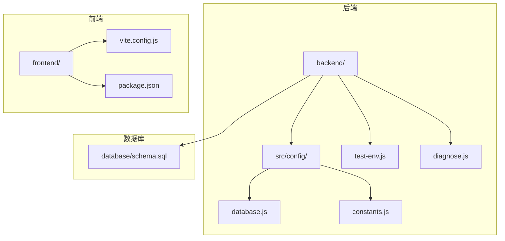
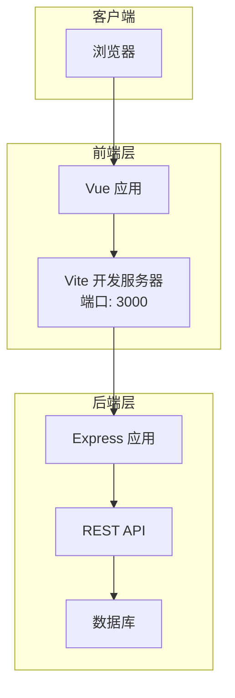
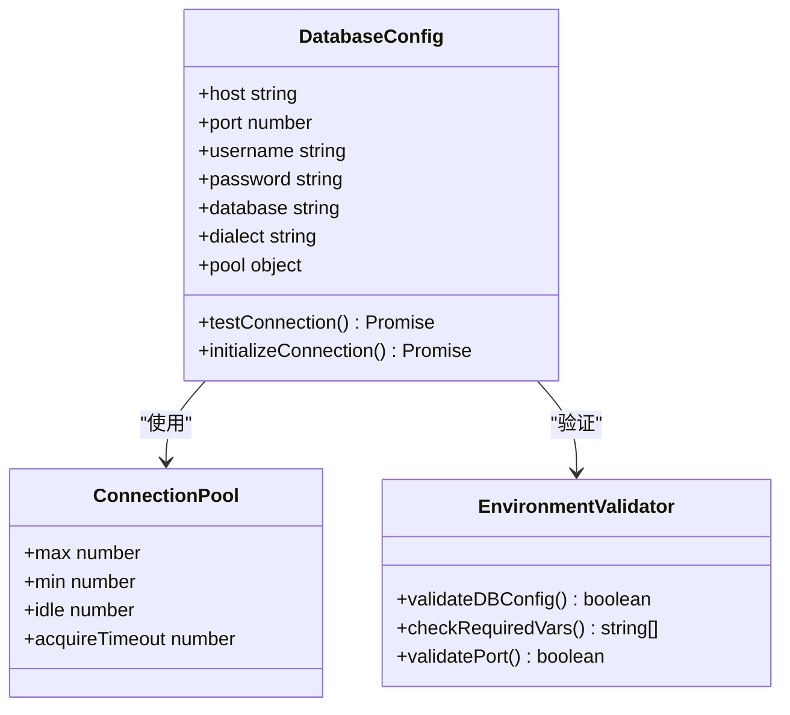
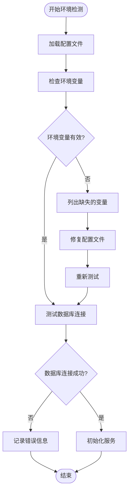
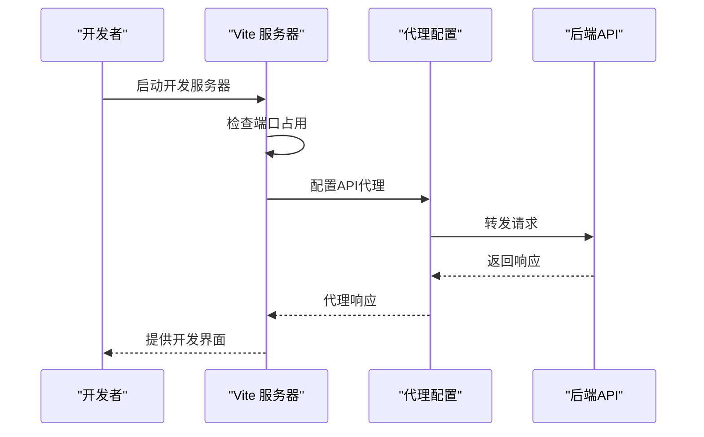
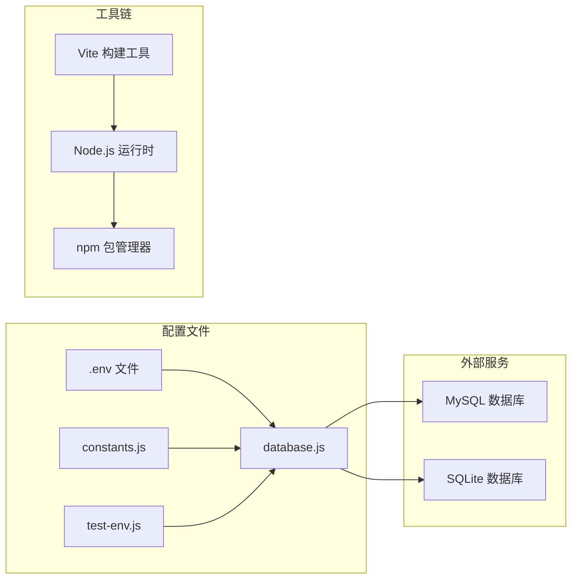
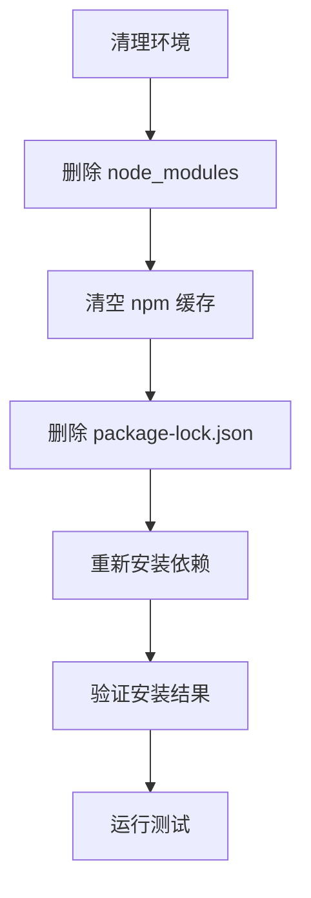

# 环境配置问题

<cite>
**本文档引用的文件**
- [package.json](file://backend/package.json)
- [database.js](file://backend/src/config/database.js)
- [constants.js](file://backend/src/config/constants.js)
- [test-env.js](file://backend/test-env.js)
- [diagnose.js](file://backend/diagnose.js)
- [start-backend.cmd](file://start-backend.cmd)
- [vite.config.js](file://frontend/vite.config.js)
- [package.json](file://frontend/package.json)
- [schema.sql](file://database/schema.sql)
- [README.md](file://README.md)
</cite>

## 目录
1. [简介](#简介)
2. [项目结构](#项目结构)
3. [核心组件](#核心组件)
4. [架构概览](#架构概览)
5. [详细组件分析](#详细组件分析)
6. [依赖关系分析](#依赖关系分析)
7. [性能考虑](#性能考虑)
8. [故障排除指南](#故障排除指南)
9. [结论](#结论)

## 简介
本指南专注于趣配鲜项目的环境配置问题诊断与解决，覆盖开发环境搭建过程中的常见配置问题，包括数据库连接配置错误、环境变量设置不当、端口冲突以及依赖安装失败等问题。文档提供系统化的排查步骤、修复方法和最佳实践，帮助开发者快速定位并解决配置相关问题。

## 项目结构
项目采用前后端分离架构，包含后端Node.js服务、前端Vue应用、数据库脚本和部署文档。关键配置文件分布在后端的src/config目录中，前端的vite.config.js中，以及根目录的启动脚本中。



**图表来源**
- [database.js](file://backend/src/config/database.js)
- [constants.js](file://backend/src/config/constants.js)
- [vite.config.js](file://frontend/vite.config.js)
- [schema.sql](file://database/schema.sql)

**章节来源**
- [README.md](file://README.md)
- [backend/package.json](file://backend/package.json)
- [frontend/package.json](file://frontend/package.json)

## 核心组件
本节分析影响环境配置的关键组件及其职责。

- 数据库配置模块：负责管理数据库连接参数、连接池配置和连接测试功能。
- 常量配置模块：定义应用运行所需的常量值，包括端口号、调试模式等。
- 环境检测工具：提供环境变量验证和配置诊断功能。
- 前端构建配置：定义开发服务器端口、代理配置等前端环境参数。

**章节来源**
- [database.js](file://backend/src/config/database.js)
- [constants.js](file://backend/src/config/constants.js)
- [test-env.js](file://backend/test-env.js)
- [vite.config.js](file://frontend/vite.config.js)

## 架构概览
系统采用前后端分离架构，后端通过REST API提供数据服务，前端通过Vite开发服务器提供用户界面。数据库作为后端数据存储层，支持MySQL和SQLite两种模式。



**图表来源**
- [vite.config.js](file://frontend/vite.config.js)
- [database.js](file://backend/src/config/database.js)

## 详细组件分析

### 数据库配置组件
数据库配置组件是环境配置的核心，负责管理数据库连接参数和连接状态。



**图表来源**
- [database.js](file://backend/src/config/database.js)
- [constants.js](file://backend/src/config/constants.js)

#### 数据库连接参数
- 主机地址：支持localhost、127.0.0.1或自定义域名
- 端口：MySQL默认3306，SQLite无端口概念
- 用户名：数据库访问凭据
- 密码：数据库访问凭据
- 数据库名称：目标数据库实例

#### 连接池配置
- 最大连接数：控制同时活跃的数据库连接数量
- 最小连接数：保持的最小连接数
- 空闲超时：连接最大空闲时间
- 获取超时：获取连接的最大等待时间

**章节来源**
- [database.js](file://backend/src/config/database.js)
- [constants.js](file://backend/src/config/constants.js)

### 环境变量检测组件
环境变量检测组件提供完整的配置验证功能。



**图表来源**
- [test-env.js](file://backend/test-env.js)
- [diagnose.js](file://backend/diagnose.js)

**章节来源**
- [test-env.js](file://backend/test-env.js)
- [diagnose.js](file://backend/diagnose.js)

### 前端开发服务器配置
前端开发服务器配置直接影响端口分配和代理设置。



**图表来源**
- [vite.config.js](file://frontend/vite.config.js)

**章节来源**
- [vite.config.js](file://frontend/vite.config.js)

## 依赖关系分析
系统依赖关系主要体现在配置文件之间的相互引用和工具链的依赖。



**图表来源**
- [database.js](file://backend/src/config/database.js)
- [constants.js](file://backend/src/config/constants.js)
- [test-env.js](file://backend/test-env.js)

**章节来源**
- [backend/package.json](file://backend/package.json)
- [frontend/package.json](file://frontend/package.json)

## 性能考虑
- 数据库连接池大小应根据预期并发用户数调整
- 环境变量缓存可减少重复读取开销
- 前端开发服务器的热重载机制在大型项目中可能影响性能
- 日志级别应根据环境调整，避免生产环境产生过多日志

## 故障排除指南

### 数据库连接配置错误

#### 问题症状
- 应用启动时报数据库连接错误
- 查询操作返回连接超时
- 数据库连接池耗尽

#### 排查步骤
1. 检查数据库服务状态
   - 确认MySQL服务正在运行
   - 验证数据库实例可达性
   - 测试基本的数据库连接

2. 验证配置参数
   ```mermaid
flowchart TD
A["检查 .env 文件"] --> B["验证主机地址"]
B --> C["确认端口号"]
C --> D["核对用户名密码"]
D --> E["确认数据库名称"]
E --> F["测试连接字符串"]
```

3. 使用内置测试工具
   - 运行环境检测脚本验证配置
   - 执行数据库连接测试
   - 检查连接池状态

#### 解决方案
- 修正主机地址为正确的IP或域名
- 确保端口与数据库服务配置一致
- 验证用户权限和密码正确性
- 创建不存在的数据库实例

**章节来源**
- [database.js](file://backend/src/config/database.js)
- [test-env.js](file://backend/test-env.js)

### 环境变量设置不当

#### 问题症状
- 应用无法启动或频繁重启
- 功能模块加载失败
- 配置值显示为undefined

#### 排查步骤
1. 检查.env文件完整性
   - 确认所有必需变量都已设置
   - 验证变量格式正确性
   - 检查特殊字符转义

2. 验证变量作用域
   - 确认变量在正确环境中生效
   - 检查环境继承关系
   - 验证变量优先级

3. 使用诊断工具
   - 运行环境检测脚本
   - 查看详细的错误日志
   - 对比不同环境的配置

#### 解决方案
- 补充缺失的环境变量
- 修正变量值的格式
- 设置正确的默认值
- 建立环境变量模板

**章节来源**
- [test-env.js](file://backend/test-env.js)
- [diagnose.js](file://backend/diagnose.js)

### 端口冲突问题

#### 问题症状
- 开发服务器启动失败
- 端口被其他进程占用
- 应用无法正常访问

#### 排查步骤
1. 检测端口占用情况
   - 使用系统工具查看端口使用
   - 识别占用端口的进程
   - 确定进程类型和用途

2. 分析冲突来源
   - 检查前后端端口配置
   - 验证第三方服务占用
   - 确认防火墙设置

3. 实施解决方案
   - 修改配置中的端口号
   - 终止占用进程
   - 重新分配端口范围

#### 常见端口问题
- **3000端口**：前端开发服务器默认端口
- **8080端口**：后端API服务常用端口
- **数据库端口**：MySQL默认3306

**章节来源**
- [vite.config.js](file://frontend/vite.config.js)
- [constants.js](file://backend/src/config/constants.js)

### 依赖安装失败

#### 问题症状
- npm install执行失败
- 模块解析错误
- 版本冲突警告

#### 排查步骤
1. 检查Node.js版本兼容性
   - 确认Node.js版本满足要求
   - 验证npm版本兼容性
   - 检查平台特定依赖

2. 清理缓存和重建
   - 删除node_modules目录
   - 清理npm缓存
   - 重新安装依赖

3. 处理版本冲突
   - 分析冲突的包依赖树
   - 升级或降级冲突包
   - 使用锁定文件确保一致性

#### 标准安装流程


**章节来源**
- [backend/package.json](file://backend/package.json)
- [frontend/package.json](file://frontend/package.json)

### 数据库配置差异处理

#### MySQL vs SQLite 配置差异
1. **连接参数差异**
   - MySQL需要完整的连接字符串
   - SQLite使用文件路径作为连接参数
   - 端口配置在MySQL中必需

2. **初始化流程差异**
   - MySQL需要手动创建数据库
   - SQLite自动创建数据库文件
   - 权限配置要求不同

3. **性能特性差异**
   - MySQL支持并发连接
   - SQLite适合单用户场景
   - 索引和查询优化策略不同

**章节来源**
- [database.js](file://backend/src/config/database.js)
- [schema.sql](file://database/schema.sql)

### Node.js版本兼容性

#### 版本要求检查
- 确认Node.js版本符合项目要求
- 验证ES6+语法支持
- 检查实验性特性的可用性

#### 兼容性解决方案
- 使用版本管理工具切换Node.js版本
- 更新项目配置以支持新版本
- 降级到兼容的Node.js版本

**章节来源**
- [backend/package.json](file://backend/package.json)
- [frontend/package.json](file://frontend/package.json)

## 结论
环境配置问题通常源于配置文件错误、依赖不匹配或端口冲突。通过系统化的排查流程和标准化的修复方法，大多数配置问题都可以快速解决。建议建立完善的环境配置检查清单，定期验证配置的有效性，并制定应急恢复预案。