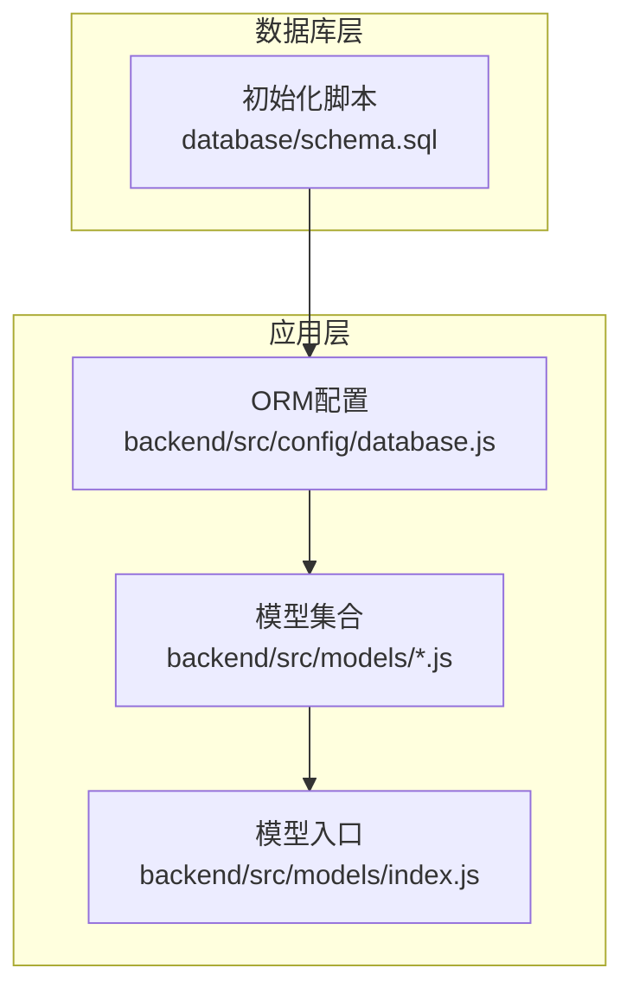
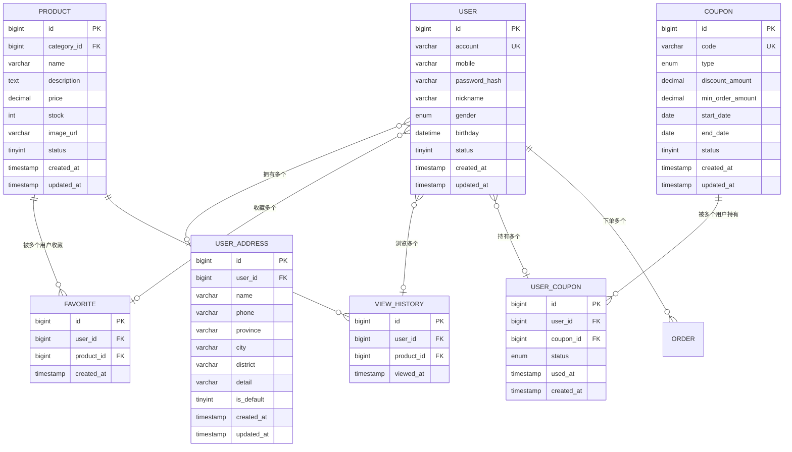
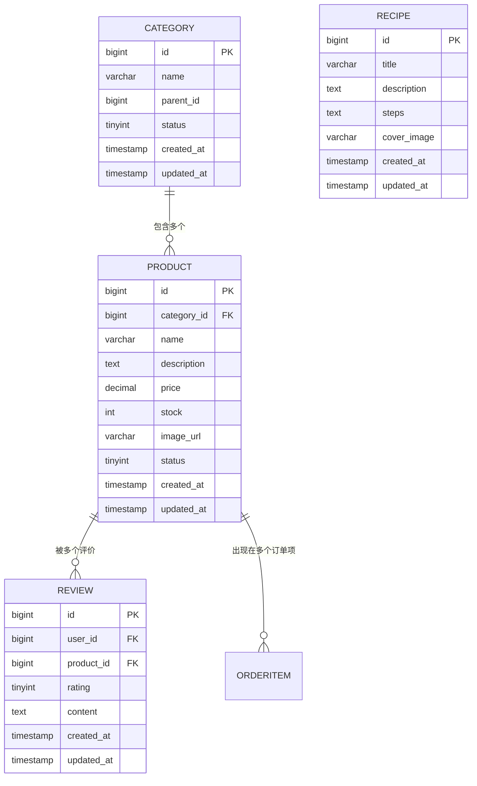
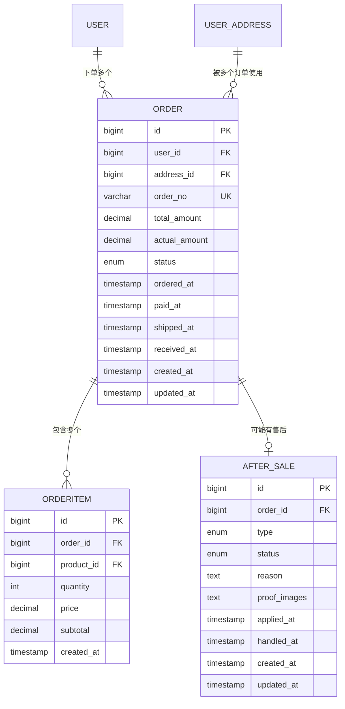
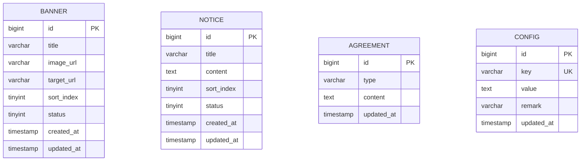
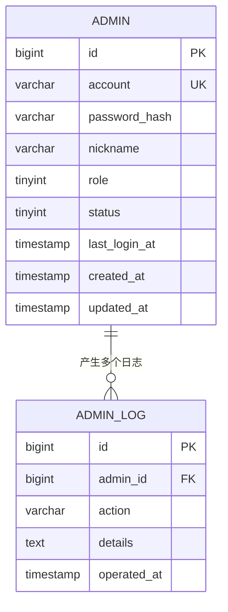
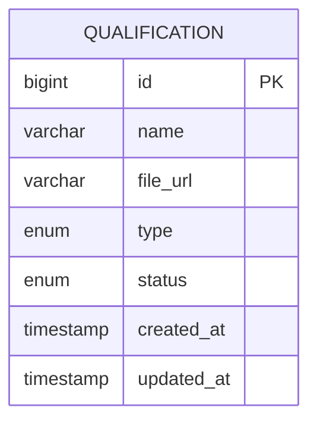
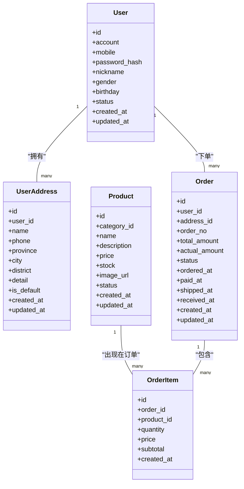

# 数据库设计

<cite>
**本文引用的文件**
- [schema.sql](file://database/schema.sql)
- [database.js](file://backend/src/config/database.js)
- [Admin.js](file://backend/src/models/Admin.js)
- [AdminLog.js](file://backend/src/models/AdminLog.js)
- [AfterSale.js](file://backend/src/models/AfterSale.js)
- [Agreement.js](file://backend/src/models/Agreement.js)
- [Banner.js](file://backend/src/models/Banner.js)
- [Cart.js](file://backend/src/models/Cart.js)
- [Category.js](file://backend/src/models/Category.js)
- [Config.js](file://backend/src/models/Config.js)
- [Coupon.js](file://backend/src/models/Coupon.js)
- [Favorite.js](file://backend/src/models/Favorite.js)
- [Notice.js](file://backend/src/models/Notice.js)
- [Order.js](file://backend/src/models/Order.js)
- [OrderItem.js](file://backend/src/models/OrderItem.js)
- [Product.js](file://backend/src/models/Product.js)
- [Qualification.js](file://backend/src/models/Qualification.js)
- [Recipe.js](file://backend/src/models/Recipe.js)
- [Review.js](file://backend/src/models/Review.js)
- [User.js](file://backend/src/models/User.js)
- [UserAddress.js](file://backend/src/models/UserAddress.js)
- [UserCoupon.js](file://backend/src/models/UserCoupon.js)
- [ViewHistory.js](file://backend/src/models/ViewHistory.js)
- [index.js](file://backend/src/models/index.js)
</cite>

## 目录
1. [简介](#简介)
2. [项目结构](#项目结构)
3. [核心组件](#核心组件)
4. [架构总览](#架构总览)
5. [详细组件分析](#详细组件分析)
6. [依赖分析](#依赖分析)
7. [性能考虑](#性能考虑)
8. [故障排查指南](#故障排查指南)
9. [结论](#结论)
10. [附录](#附录)

## 简介
本文件面向“趣配鲜”项目的数据库设计与实现，基于仓库中的数据库初始化脚本与 Sequelize ORM 模型，系统化梳理数据库整体架构、表结构设计、主外键关系、索引策略、数据完整性约束、业务规则与数据字典，并给出查询优化、迁移与版本管理、备份与恢复等实践建议。文档同时提供 ER 图与类图，帮助开发者与运维人员快速理解与维护数据库。

## 项目结构
数据库相关的核心文件分布如下：
- 初始化脚本：database/schema.sql
- ORM 配置：backend/src/config/database.js
- ORM 模型：backend/src/models/*.js 及其聚合入口 backend/src/models/index.js

**图表来源**
- [schema.sql](file://database/schema.sql)
- [database.js](file://backend/src/config/database.js)
- [index.js](file://backend/src/models/index.js)

**章节来源**
- [schema.sql](file://database/schema.sql)
- [database.js](file://backend/src/config/database.js)
- [index.js](file://backend/src/models/index.js)

## 核心组件
本节从数据库脚本与 ORM 模型两个维度，概述核心数据实体及其职责边界：
- 用户域：用户、地址、收藏、浏览历史、优惠券持有
- 商品域：商品、分类、评价、搭配食谱
- 订单域：订单、订单项、售后
- 运营域：横幅、公告、协议、配置
- 管理域：管理员、管理员日志
- 资质域：资质文件（如供应商/产品认证）

上述实体在脚本中通过建表语句定义，在 Sequelize 模型中以类的形式映射，形成“表-模型”的一一对应关系，便于后续进行关联查询与事务控制。

**章节来源**
- [schema.sql](file://database/schema.sql)
- [User.js](file://backend/src/models/User.js)
- [Product.js](file://backend/src/models/Product.js)
- [Order.js](file://backend/src/models/Order.js)
- [Banner.js](file://backend/src/models/Banner.js)
- [Admin.js](file://backend/src/models/Admin.js)
- [Qualification.js](file://backend/src/models/Qualification.js)

## 架构总览
下图展示数据库层与应用层的交互关系，以及主要实体之间的关联方向：

```mermaid
graph TB
subgraph "数据库"
TBL_USER["用户表"]
TBL_ADDR["地址表"]
TBL_FAV["收藏表"]
TBL_VIEW["浏览历史表"]
TBL_COUPON["优惠券表"]
TBL_U2C["用户-优惠券持有表"]
TBL_CATEGORY["分类表"]
TBL_PRODUCT["商品表"]
TBL_REVIEW["评价表"]
TBL_RECIPE["食谱表"]
TBL_ORDER["订单表"]
TBL_ORDERITEM["订单项表"]
TBL_AFTERSALE["售后表"]
TBL_BANNER["横幅表"]
TBL_NOTICE["公告表"]
TBL_AGREEMENT["协议表"]
TBL_CONFIG["配置表"]
TBL_ADMIN["管理员表"]
TBL_ADMINLOG["管理员日志表"]
TBL_QUAL["资质文件表"]
end
subgraph "应用层"
M_USER["User 模型"]
M_ADDR["UserAddress 模型"]
M_FAV["Favorite 模型"]
M_VIEW["ViewHistory 模型"]
M_COUPON["Coupon 模型"]
M_U2C["UserCoupon 模型"]
M_CATEGORY["Category 模型"]
M_PRODUCT["Product 模型"]
M_REVIEW["Review 模型"]
M_RECIPE["Recipe 模型"]
M_ORDER["Order 模型"]
M_ORDERITEM["OrderItem 模型"]
M_AFTERSALE["AfterSale 模型"]
M_BANNER["Banner 模型"]
M_NOTICE["Notice 模型"]
M_AGREEMENT["Agreement 模型"]
M_CONFIG["Config 模型"]
M_ADMIN["Admin 模型"]
M_ADMINLOG["AdminLog 模型"]
M_QUAL["Qualification 模型"]
end
M_USER --> TBL_USER
M_ADDR --> TBL_ADDR
M_FAV --> TBL_FAV
M_VIEW --> TBL_VIEW
M_COUPON --> TBL_COUPON
M_U2C --> TBL_U2C
M_CATEGORY --> TBL_CATEGORY
M_PRODUCT --> TBL_PRODUCT
M_REVIEW --> TBL_REVIEW
M_RECIPE --> TBL_RECIPE
M_ORDER --> TBL_ORDER
M_ORDERITEM --> TBL_ORDERITEM
M_AFTERSALE --> TBL_AFTERSALE
M_BANNER --> TBL_BANNER
M_NOTICE --> TBL_NOTICE
M_AGREEMENT --> TBL_AGREEMENT
M_CONFIG --> TBL_CONFIG
M_ADMIN --> TBL_ADMIN
M_ADMINLOG --> TBL_ADMINLOG
M_QUAL --> TBL_QUAL
```

**图表来源**
- [schema.sql](file://database/schema.sql)
- [User.js](file://backend/src/models/User.js)
- [UserAddress.js](file://backend/src/models/UserAddress.js)
- [Favorite.js](file://backend/src/models/Favorite.js)
- [ViewHistory.js](file://backend/src/models/ViewHistory.js)
- [Coupon.js](file://backend/src/models/Coupon.js)
- [UserCoupon.js](file://backend/src/models/UserCoupon.js)
- [Category.js](file://backend/src/models/Category.js)
- [Product.js](file://backend/src/models/Product.js)
- [Review.js](file://backend/src/models/Review.js)
- [Recipe.js](file://backend/src/models/Recipe.js)
- [Order.js](file://backend/src/models/Order.js)
- [OrderItem.js](file://backend/src/models/OrderItem.js)
- [AfterSale.js](file://backend/src/models/AfterSale.js)
- [Banner.js](file://backend/src/models/Banner.js)
- [Notice.js](file://backend/src/models/Notice.js)
- [Agreement.js](file://backend/src/models/Agreement.js)
- [Config.js](file://backend/src/models/Config.js)
- [Admin.js](file://backend/src/models/Admin.js)
- [AdminLog.js](file://backend/src/models/AdminLog.js)
- [Qualification.js](file://backend/src/models/Qualification.js)

## 详细组件分析

### 用户域
- 用户表：存储用户基本信息与登录凭证；支持唯一索引保证账号唯一性。
- 地址表：记录用户的收货地址，支持默认地址标记。
- 收藏表：记录用户收藏的商品。
- 浏览历史表：记录用户浏览过的商品。
- 优惠券持有表：记录用户持有的优惠券状态与使用情况。

**图表来源**
- [schema.sql](file://database/schema.sql)
- [User.js](file://backend/src/models/User.js)
- [UserAddress.js](file://backend/src/models/UserAddress.js)
- [Favorite.js](file://backend/src/models/Favorite.js)
- [ViewHistory.js](file://backend/src/models/ViewHistory.js)
- [Coupon.js](file://backend/src/models/Coupon.js)
- [UserCoupon.js](file://backend/src/models/UserCoupon.js)
- [Product.js](file://backend/src/models/Product.js)

**章节来源**
- [schema.sql](file://database/schema.sql)
- [User.js](file://backend/src/models/User.js)
- [UserAddress.js](file://backend/src/models/UserAddress.js)
- [Favorite.js](file://backend/src/models/Favorite.js)
- [ViewHistory.js](file://backend/src/models/ViewHistory.js)
- [Coupon.js](file://backend/src/models/Coupon.js)
- [UserCoupon.js](file://backend/src/models/UserCoupon.js)
- [Product.js](file://backend/src/models/Product.js)

### 商品域
- 分类表：商品分类树形结构或扁平结构均可，用于商品归类。
- 商品表：记录商品详情、价格、库存、状态与图片。
- 评价表：记录用户对商品的评价内容与评分。
- 食谱表：记录搭配食谱信息，可与商品建立多对多关系。

**图表来源**
- [schema.sql](file://database/schema.sql)
- [Category.js](file://backend/src/models/Category.js)
- [Product.js](file://backend/src/models/Product.js)
- [Review.js](file://backend/src/models/Review.js)
- [Recipe.js](file://backend/src/models/Recipe.js)
- [OrderItem.js](file://backend/src/models/OrderItem.js)

**章节来源**
- [schema.sql](file://database/schema.sql)
- [Category.js](file://backend/src/models/Category.js)
- [Product.js](file://backend/src/models/Product.js)
- [Review.js](file://backend/src/models/Review.js)
- [Recipe.js](file://backend/src/models/Recipe.js)
- [OrderItem.js](file://backend/src/models/OrderItem.js)

### 订单域
- 订单表：记录下单用户、收货地址、支付与配送状态、优惠使用情况。
- 订单项表：记录订单内具体商品与数量、单价、小计金额。
- 售后表：记录退换货申请、处理状态与凭证。

**图表来源**
- [schema.sql](file://database/schema.sql)
- [Order.js](file://backend/src/models/Order.js)
- [OrderItem.js](file://backend/src/models/OrderItem.js)
- [AfterSale.js](file://backend/src/models/AfterSale.js)
- [User.js](file://backend/src/models/User.js)
- [UserAddress.js](file://backend/src/models/UserAddress.js)

**章节来源**
- [schema.sql](file://database/schema.sql)
- [Order.js](file://backend/src/models/Order.js)
- [OrderItem.js](file://backend/src/models/OrderItem.js)
- [AfterSale.js](file://backend/src/models/AfterSale.js)
- [User.js](file://backend/src/models/User.js)
- [UserAddress.js](file://backend/src/models/UserAddress.js)

### 运营域
- 横幅表：首页轮播图资源与排序。
- 公告表：运营公告列表。
- 协议表：用户协议与隐私政策文本。
- 配置表：系统运行参数与开关。

**图表来源**
- [schema.sql](file://database/schema.sql)
- [Banner.js](file://backend/src/models/Banner.js)
- [Notice.js](file://backend/src/models/Notice.js)
- [Agreement.js](file://backend/src/models/Agreement.js)
- [Config.js](file://backend/src/models/Config.js)

**章节来源**
- [schema.sql](file://database/schema.sql)
- [Banner.js](file://backend/src/models/Banner.js)
- [Notice.js](file://backend/src/models/Notice.js)
- [Agreement.js](file://backend/src/models/Agreement.js)
- [Config.js](file://backend/src/models/Config.js)

### 管理域
- 管理员表：后台登录与权限主体。
- 管理员日志表：记录管理员操作轨迹。

**图表来源**
- [schema.sql](file://database/schema.sql)
- [Admin.js](file://backend/src/models/Admin.js)
- [AdminLog.js](file://backend/src/models/AdminLog.js)

**章节来源**
- [schema.sql](file://database/schema.sql)
- [Admin.js](file://backend/src/models/Admin.js)
- [AdminLog.js](file://backend/src/models/AdminLog.js)

### 资质域
- 资质文件表：存储供应商或产品的认证材料链接与状态。

**图表来源**
- [schema.sql](file://database/schema.sql)
- [Qualification.js](file://backend/src/models/Qualification.js)

**章节来源**
- [schema.sql](file://database/schema.sql)
- [Qualification.js](file://backend/src/models/Qualification.js)

## 依赖分析
- 模型到表的映射：每个 Sequelize 模型对应一个数据库表，字段名与约束由脚本定义，模型通过数据类型与关系方法进行声明式绑定。
- 关联关系：一对多（如用户-订单、分类-商品）、一对一（如订单-地址）、多对多（通过中间表实现，如用户-优惠券）。
- 外键约束：脚本中定义了外键，确保引用完整性；模型层面通过 belongsTo/hasMany/belongsToMany 等关系方法进行声明。
- 索引策略：脚本中对唯一键（UK）与常用查询键（如订单号、账户、优惠券码）建立了索引，提升查询效率。

**图表来源**
- [User.js](file://backend/src/models/User.js)
- [UserAddress.js](file://backend/src/models/UserAddress.js)
- [Order.js](file://backend/src/models/Order.js)
- [OrderItem.js](file://backend/src/models/OrderItem.js)
- [Product.js](file://backend/src/models/Product.js)

**章节来源**
- [index.js](file://backend/src/models/index.js)
- [User.js](file://backend/src/models/User.js)
- [Order.js](file://backend/src/models/Order.js)
- [OrderItem.js](file://backend/src/models/OrderItem.js)
- [Product.js](file://backend/src/models/Product.js)

## 性能考虑
- 索引策略
  - 唯一键：账户、手机号、订单号、优惠券码等建立唯一索引，保障业务唯一性并加速查找。
  - 查询热点：对频繁过滤与连接的字段（如 user_id、product_id、order_id）建立普通索引。
  - 范围查询：对时间字段（如 created_at、ordered_at、paid_at）建立索引，避免全表扫描。
- 查询优化
  - 使用 JOIN 时限定必要列，避免 SELECT *。
  - 对分页查询使用覆盖索引，减少回表。
  - 对高并发写入场景，合理拆分大事务，降低锁竞争。
- 缓存与异步
  - 将静态配置与热门商品信息引入缓存层，降低数据库压力。
  - 对非实时性需求采用消息队列异步处理（如订单状态变更通知）。

## 故障排查指南
- 常见错误定位
  - 唯一约束冲突：检查账户、手机号、订单号、优惠券码是否重复。
  - 外键约束失败：确认关联对象是否存在且状态正常。
  - 时间字段异常：核对时区设置与默认值。
- 日志与审计
  - 启用慢查询日志与错误日志，定期巡检。
  - 管理员操作通过 AdminLog 记录，便于追溯。
- 回滚与修复
  - 对于误删/误改，结合备份与 binlog 进行点位恢复。
  - 修复索引问题时，优先重建二级索引，避免长时间锁表。

**章节来源**
- [AdminLog.js](file://backend/src/models/AdminLog.js)
- [database.js](file://backend/src/config/database.js)

## 结论
本设计以“表-模型”一致映射为核心，围绕用户、商品、订单、运营与管理五大域构建清晰的数据模型。通过合理的索引与约束，兼顾了数据一致性与查询性能。建议在后续迭代中持续完善索引策略、引入缓存与异步机制，并规范数据迁移与备份流程，确保系统稳定与可演进。

## 附录

### 数据字典与业务规则
- 用户域
  - 账户/手机号：唯一标识，登录与联系使用。
  - 密码：加密存储，禁止明文。
  - 性别/生日：用于画像与营销。
  - 地址默认标记：同一用户仅允许一个默认地址。
- 商品域
  - 库存：扣减需在事务中完成，防止超卖。
  - 状态：上架/下架影响前端展示与购买。
- 订单域
  - 订单号：全局唯一，用于对外展示与对账。
  - 实付金额：由商品小计、优惠、运费等计算得出。
  - 状态机：下单、支付、发货、收货、售后等阶段流转。
- 运营域
  - 排序字段：用于前端轮播与列表展示顺序。
  - 状态：启用/禁用控制生效范围。
- 管理域
  - 角色：区分超级管理员与普通管理员。
  - 登录时间：用于会话与风控。

**章节来源**
- [schema.sql](file://database/schema.sql)
- [User.js](file://backend/src/models/User.js)
- [Product.js](file://backend/src/models/Product.js)
- [Order.js](file://backend/src/models/Order.js)
- [Banner.js](file://backend/src/models/Banner.js)
- [Notice.js](file://backend/src/models/Notice.js)
- [Admin.js](file://backend/src/models/Admin.js)

### 数据迁移与版本管理
- 新增字段
  - 使用迁移工具（如 Sequelize CLI）生成迁移文件，先添加列再补默认值/索引。
  - 对大表加索引采用在线DDL（如 PT-ALTE），避免长事务锁表。
- 表结构调整
  - 修改列类型或长度前，评估数据范围与索引影响。
  - 删除列前，确认无外部依赖并做好回滚准备。
- 版本策略
  - 以“功能版本+日期”命名迁移文件，按顺序执行。
  - 在灰度环境先行验证，再逐步推广至生产。

### 数据备份与恢复
- 备份策略
  - 全量备份：每周一次，保留至少7天。
  - 增量备份：每日一次，结合binlog实现点位恢复。
- 恢复演练
  - 定期进行RTO/RPO测试，验证备份可用性与恢复时效。
- 安全加固
  - 备份文件加密存储，限制访问权限。
  - 生产库与备份库网络隔离，避免交叉污染。