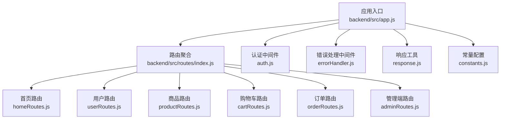
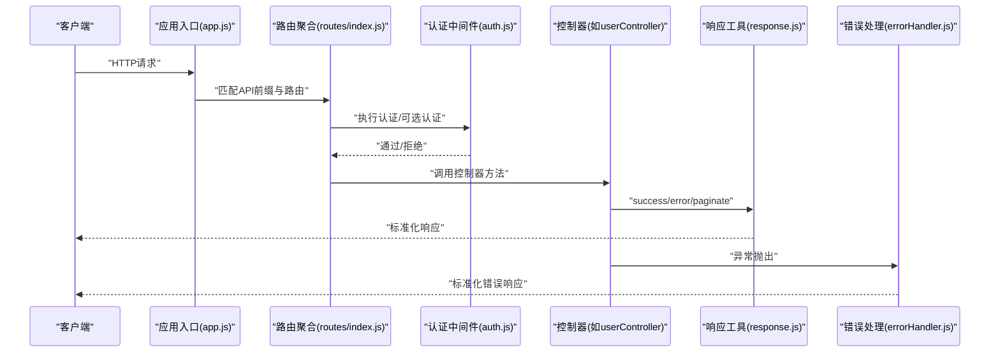
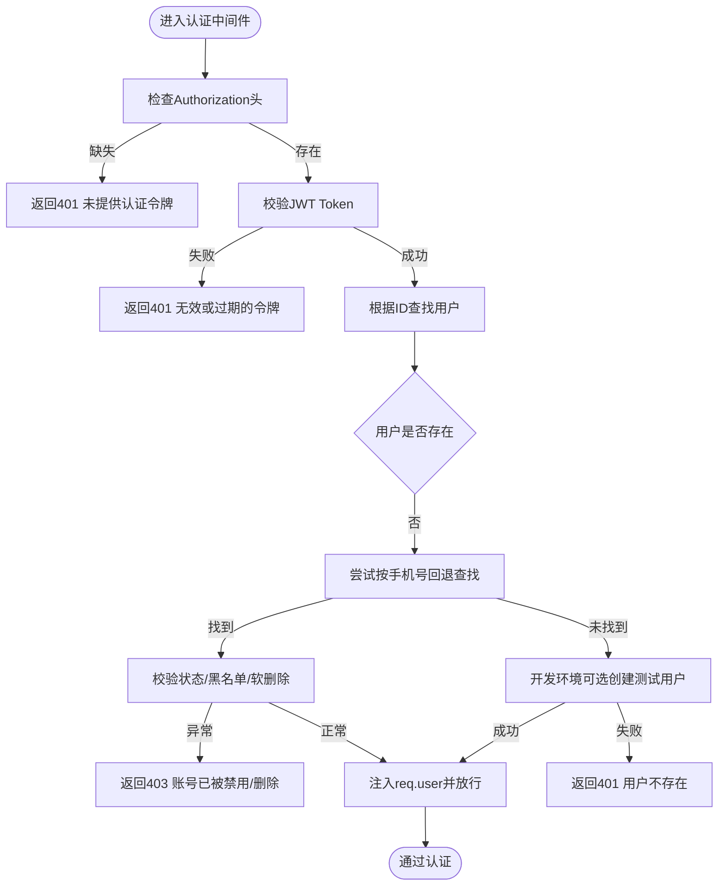
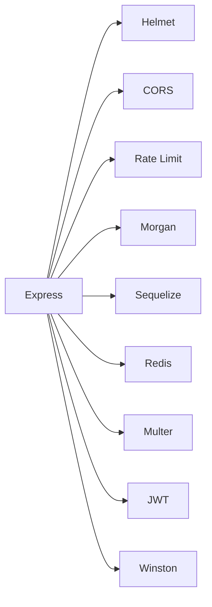

# API架构设计

<cite>
**本文引用的文件**
- [backend/src/app.js](file://backend/src/app.js)
- [backend/src/routes/index.js](file://backend/src/routes/index.js)
- [backend/src/routes/homeRoutes.js](file://backend/src/routes/homeRoutes.js)
- [backend/src/routes/userRoutes.js](file://backend/src/routes/userRoutes.js)
- [backend/src/routes/productRoutes.js](file://backend/src/routes/productRoutes.js)
- [backend/src/routes/cartRoutes.js](file://backend/src/routes/cartRoutes.js)
- [backend/src/routes/orderRoutes.js](file://backend/src/routes/orderRoutes.js)
- [backend/src/routes/adminRoutes.js](file://backend/src/routes/adminRoutes.js)
- [backend/src/middlewares/auth.js](file://backend/src/middlewares/auth.js)
- [backend/src/middlewares/errorHandler.js](file://backend/src/middlewares/errorHandler.js)
- [backend/src/utils/response.js](file://backend/src/utils/response.js)
- [backend/src/config/constants.js](file://backend/src/config/constants.js)
- [backend/package.json](file://backend/package.json)
- [docs/api.md](file://docs/api.md)
</cite>

## 目录
1. [引言](#引言)
2. [项目结构](#项目结构)
3. [核心组件](#核心组件)
4. [架构总览](#架构总览)
5. [详细组件分析](#详细组件分析)
6. [依赖关系分析](#依赖关系分析)
7. [性能考量](#性能考量)
8. [故障排查指南](#故障排查指南)
9. [结论](#结论)
10. [附录](#附录)

## 引言
本文件面向“趣配鲜”项目的后端API架构设计与实现规范，系统化梳理RESTful API设计原则、路由组织、数据传输格式、版本控制策略、文档生成与维护机制、性能优化策略、测试与质量保证以及监控与调试工具使用指南。文档基于实际代码库进行分析，确保内容可追溯、可落地。

## 项目结构
后端采用Express框架，遵循“路由-中间件-控制器-模型-工具”的分层组织方式。核心入口负责中间件装配、静态资源与API前缀挂载；路由模块按功能域分组；控制器封装业务逻辑；工具模块提供统一响应与错误处理；配置模块集中管理常量与环境变量。

图表来源
- [backend/src/app.js:1-84](file://backend/src/app.js#L1-L84)
- [backend/src/routes/index.js:1-27](file://backend/src/routes/index.js#L1-L27)
- [backend/src/middlewares/auth.js:1-181](file://backend/src/middlewares/auth.js#L1-L181)
- [backend/src/middlewares/errorHandler.js:1-47](file://backend/src/middlewares/errorHandler.js#L1-L47)
- [backend/src/utils/response.js:1-32](file://backend/src/utils/response.js#L1-L32)
- [backend/src/config/constants.js:1-132](file://backend/src/config/constants.js#L1-L132)

章节来源
- [backend/src/app.js:1-84](file://backend/src/app.js#L1-L84)
- [backend/src/routes/index.js:1-27](file://backend/src/routes/index.js#L1-L27)

## 核心组件
- 应用入口与中间件栈
  - 安全与防护：Helmet、CORS、XSS清理、MongoSanitize
  - 速率限制：express-rate-limit
  - 日志：Morgan结合Winston输出到日志流
  - 静态资源：上传目录映射
  - API前缀：可配置的API前缀路径
- 路由分组
  - 首页、用户、商品、购物车、订单、管理端等子路由
  - 全局健康检查接口
- 统一响应与错误处理
  - 成功/失败/分页三类响应模板
  - 标准化错误码与消息，开发/生产环境差异化返回
- 认证与鉴权
  - JWT Bearer Token认证
  - 可选认证中间件用于匿名可访问场景
  - 管理员权限中间件
- 常量与配置
  - 订单、售后、优惠券、收藏、浏览历史、管理员角色等枚举常量
  - 分页默认值与最大值

章节来源
- [backend/src/app.js:1-84](file://backend/src/app.js#L1-L84)
- [backend/src/utils/response.js:1-32](file://backend/src/utils/response.js#L1-L32)
- [backend/src/middlewares/errorHandler.js:1-47](file://backend/src/middlewares/errorHandler.js#L1-L47)
- [backend/src/middlewares/auth.js:1-181](file://backend/src/middlewares/auth.js#L1-L181)
- [backend/src/config/constants.js:1-132](file://backend/src/config/constants.js#L1-L132)

## 架构总览
下图展示从客户端到控制器的典型调用链，以及认证、错误处理与响应封装的关键节点。

图表来源
- [backend/src/app.js:1-84](file://backend/src/app.js#L1-L84)
- [backend/src/routes/index.js:1-27](file://backend/src/routes/index.js#L1-L27)
- [backend/src/middlewares/auth.js:1-181](file://backend/src/middlewares/auth.js#L1-L181)
- [backend/src/utils/response.js:1-32](file://backend/src/utils/response.js#L1-L32)
- [backend/src/middlewares/errorHandler.js:1-47](file://backend/src/middlewares/errorHandler.js#L1-L47)

## 详细组件分析

### 路由设计与分组
- 路由前缀与挂载
  - 应用通过可配置前缀挂载全部路由，便于多版本并存与部署隔离
- 子路由分组
  - 首页：首页数据、搜索、配置、协议、资质、食谱列表与详情
  - 用户：注册、登录、个人资料、地址管理、优惠券、重置密码、忘记密码
  - 商品：分类、列表、详情、收藏切换、收藏列表、浏览历史
  - 购物车：获取、添加、更新、删除单项与清空
  - 订单：创建、列表、详情、取消、确认收货、售后、评价
  - 管理端：管理员登录、资料、统计、商品/分类、订单、用户、优惠券、食谱、横幅、公告、系统设置等
- 参数传递与嵌套资源
  - 路由参数：如订单ID、地址ID、商品ID等
  - 查询参数：分页、筛选、关键字搜索等
  - 嵌套资源：如订单下的售后、评价；管理端下的商品/分类/订单/用户/优惠券/食谱/横幅/公告

章节来源
- [backend/src/routes/index.js:1-27](file://backend/src/routes/index.js#L1-L27)
- [backend/src/routes/homeRoutes.js:1-15](file://backend/src/routes/homeRoutes.js#L1-L15)
- [backend/src/routes/userRoutes.js:1-25](file://backend/src/routes/userRoutes.js#L1-L25)
- [backend/src/routes/productRoutes.js:1-15](file://backend/src/routes/productRoutes.js#L1-L15)
- [backend/src/routes/cartRoutes.js:1-13](file://backend/src/routes/cartRoutes.js#L1-L13)
- [backend/src/routes/orderRoutes.js:1-18](file://backend/src/routes/orderRoutes.js#L1-L18)
- [backend/src/routes/adminRoutes.js:1-82](file://backend/src/routes/adminRoutes.js#L1-L82)

### 认证与鉴权流程
- JWT Bearer Token
  - 客户端在请求头携带Authorization: Bearer <token>
  - 认证中间件解析并校验Token，解析用户ID，加载用户信息并注入到请求对象
- 可选认证
  - 对于匿名可访问场景，使用可选认证中间件仅在有效Token存在时注入用户信息
- 管理员权限
  - 管理端路由统一使用管理员鉴权中间件，确保后台操作安全
- 用户状态与软删除
  - 认证中间件同时校验用户状态、黑名单与软删除标记，防止禁用/删除用户继续访问

图表来源
- [backend/src/middlewares/auth.js:1-181](file://backend/src/middlewares/auth.js#L1-L181)

章节来源
- [backend/src/middlewares/auth.js:1-181](file://backend/src/middlewares/auth.js#L1-L181)

### 数据传输格式与状态码
- 统一响应结构
  - 成功响应：success(data, message, statusCode)
  - 失败响应：error(message, statusCode, errors)
  - 分页响应：paginate(data, pagination, message)
- 错误响应
  - 标准字段：success=false、message、开发环境附加stack
  - 常见错误类型映射：Validation、Unauthorized、Forbidden、NotFound、Conflict
- 状态码
  - 控制器内使用语义化HTTP状态码，错误处理器统一转换为标准错误响应
- 常量与分页
  - 订单、售后、优惠券、收藏、浏览历史、管理员角色等枚举常量
  - 分页默认值与最大值定义，避免过大请求

章节来源
- [backend/src/utils/response.js:1-32](file://backend/src/utils/response.js#L1-L32)
- [backend/src/middlewares/errorHandler.js:1-47](file://backend/src/middlewares/errorHandler.js#L1-L47)
- [backend/src/config/constants.js:1-132](file://backend/src/config/constants.js#L1-L132)

### API版本控制与向后兼容
- 版本策略
  - 当前仓库未体现明确的v2/v3等版本分支；建议在路由前缀上引入版本号（例如/api/v1），以便未来演进
- 向后兼容
  - 新增字段采用可选策略，不破坏现有客户端
  - 严格控制删除与重命名，必要时提供迁移指引
- 文档与实现一致性
  - 现有文档与实现存在差异（如文档中的/api/auth与实际路由/api/users），建议统一并保持文档实时更新

章节来源
- [backend/src/app.js:49-50](file://backend/src/app.js#L49-L50)
- [docs/api.md:1-422](file://docs/api.md#L1-L422)

### API文档生成与维护
- 现状
  - 提供独立的Markdown文档，覆盖端点、参数、响应示例与状态码
- 建议
  - 引入OpenAPI/Swagger自动生成与校验，结合CI保证文档与实现一致
  - 将文档与路由注释结合，形成“契约优先”的开发流程

章节来源
- [docs/api.md:1-422](file://docs/api.md#L1-L422)

### 性能优化策略
- 缓存机制
  - 利用Redis缓存热点数据（如首页聚合、商品详情、分类、配置）
  - 缓存键命名规范与失效策略，避免脏读
- 批量操作
  - 购物车清空、批量收藏切换等接口减少往返
- 异步处理
  - 订单导出、报表统计等耗时任务异步化，返回任务ID与轮询接口
- 数据库优化
  - 合理索引、分页查询、延迟关联、只取必要字段
- 中间件优化
  - 速率限制、请求体大小限制、防XSS/Mongo注入

章节来源
- [backend/package.json:18-39](file://backend/package.json#L18-L39)
- [backend/src/app.js:26-39](file://backend/src/app.js#L26-L39)

### 测试策略与质量保证
- 单元测试与集成测试
  - 使用Jest与Supertest对关键路由与控制器进行测试
- 覆盖场景
  - 正常流程、边界条件、异常与错误处理、认证与权限
- CI/CD
  - 在构建流水线中加入测试步骤与覆盖率报告

章节来源
- [backend/package.json:9,42-44](file://backend/package.json#L9,L42-L44)

### 监控与调试
- 日志
  - Morgan输出访问日志，Winston统一记录错误堆栈与上下文
- 健康检查
  - 全局健康接口返回服务状态与时间戳
- 调试
  - 开发环境可打印中间件与控制器内部日志，定位问题
- 运维
  - 结合Nginx/容器日志与错误处理器，建立告警与追踪

章节来源
- [backend/src/app.js:41-45](file://backend/src/app.js#L41-L45)
- [backend/src/middlewares/errorHandler.js:3-10](file://backend/src/middlewares/errorHandler.js#L3-L10)
- [backend/src/routes/index.js:18-24](file://backend/src/routes/index.js#L18-L24)

## 依赖关系分析
- 外部依赖
  - Web框架：Express
  - 安全与防护：Helmet、CORS、XSS清理、MongoSanitize、Rate Limit
  - 数据库：Sequelize + MySQL/SQLite
  - 认证：JWT
  - 日志：Morgan + Winston
  - 文件上传：Multer
  - 缓存：Redis
  - 工具：dayjs、crypto-js、xlsx等
- 内部耦合
  - 路由依赖控制器，控制器依赖模型与工具
  - 中间件贯穿认证、错误处理与日志
  - 响应工具与错误处理器被各控制器复用

图表来源
- [backend/package.json:18-39](file://backend/package.json#L18-L39)

章节来源
- [backend/package.json:18-39](file://backend/package.json#L18-L39)

## 性能考量
- 接口层面
  - 合理使用分页与筛选，避免一次性返回大量数据
  - 对高频接口启用缓存，降低数据库压力
- 数据库层面
  - 为常用查询字段建立索引，避免全表扫描
  - 使用连接池与事务控制，减少锁竞争
- 网络与安全
  - 启用速率限制与请求体大小限制，防止滥用
  - 使用HTTPS与CORS白名单，降低中间人攻击风险

## 故障排查指南
- 常见问题定位
  - 401/403：检查Authorization头、Token有效性、用户状态与管理员权限
  - 404：核对路由是否正确、资源是否存在
  - 500：查看错误处理器日志，关注stack与上下文
- 调试技巧
  - 在认证中间件与控制器中增加关键节点日志
  - 使用curl或Postman验证请求参数与头部
- 运维建议
  - 建立统一的日志收集与告警机制
  - 对高风险接口增加熔断与降级策略

章节来源
- [backend/src/middlewares/errorHandler.js:3-44](file://backend/src/middlewares/errorHandler.js#L3-L44)
- [backend/src/middlewares/auth.js:4-148](file://backend/src/middlewares/auth.js#L4-L148)

## 结论
本项目在RESTful设计、路由分组、统一响应与错误处理方面具备清晰的实现规范。建议后续完善版本控制策略、统一文档与实现、引入缓存与异步处理，并强化测试与监控体系，以支撑业务持续增长与高质量交付。

## 附录
- 关键实现参考路径
  - 应用入口与中间件装配：[backend/src/app.js:1-84](file://backend/src/app.js#L1-L84)
  - 路由聚合与分组：[backend/src/routes/index.js:1-27](file://backend/src/routes/index.js#L1-L27)
  - 认证中间件：[backend/src/middlewares/auth.js:1-181](file://backend/src/middlewares/auth.js#L1-L181)
  - 错误处理中间件：[backend/src/middlewares/errorHandler.js:1-47](file://backend/src/middlewares/errorHandler.js#L1-L47)
  - 统一响应工具：[backend/src/utils/response.js:1-32](file://backend/src/utils/response.js#L1-L32)
  - 常量与分页配置：[backend/src/config/constants.js:1-132](file://backend/src/config/constants.js#L1-L132)
  - 现有API文档：[docs/api.md:1-422](file://docs/api.md#L1-L422)