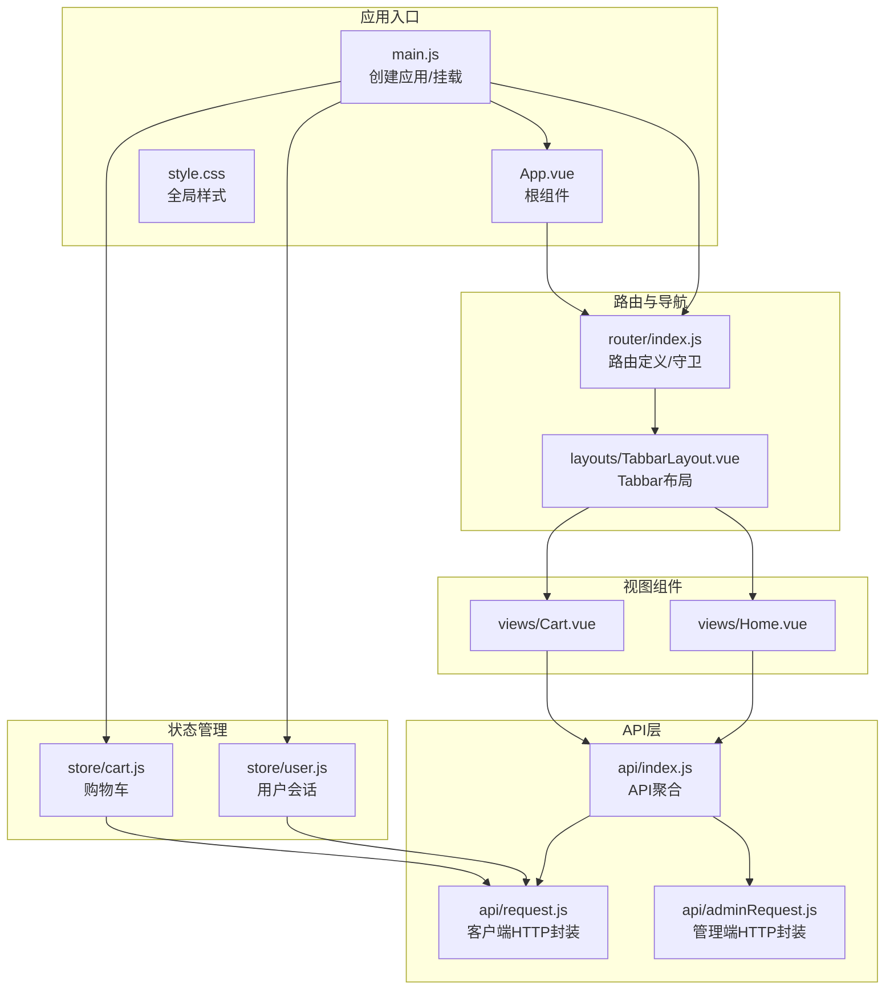
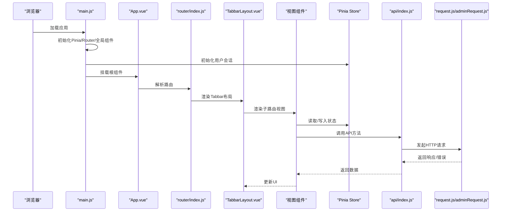
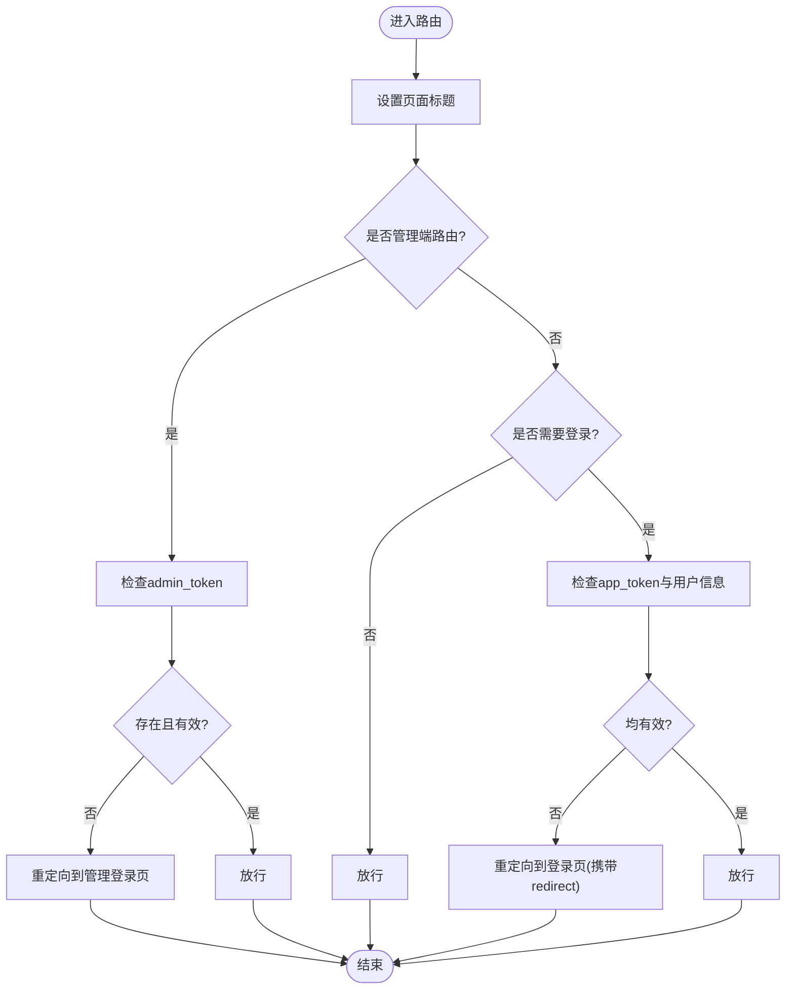
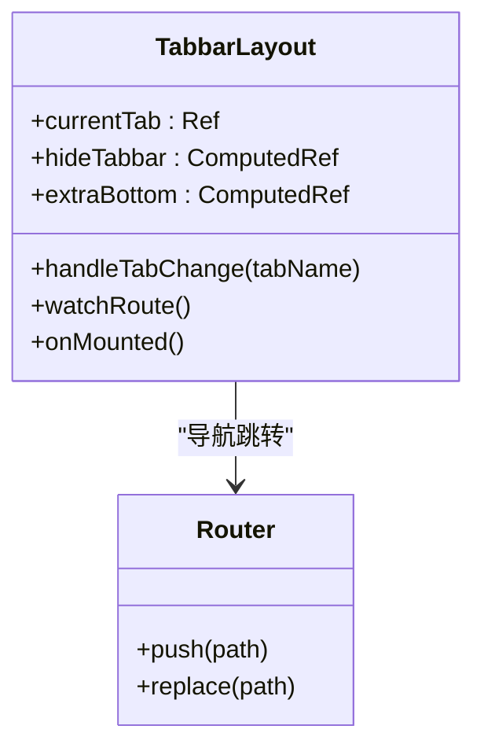
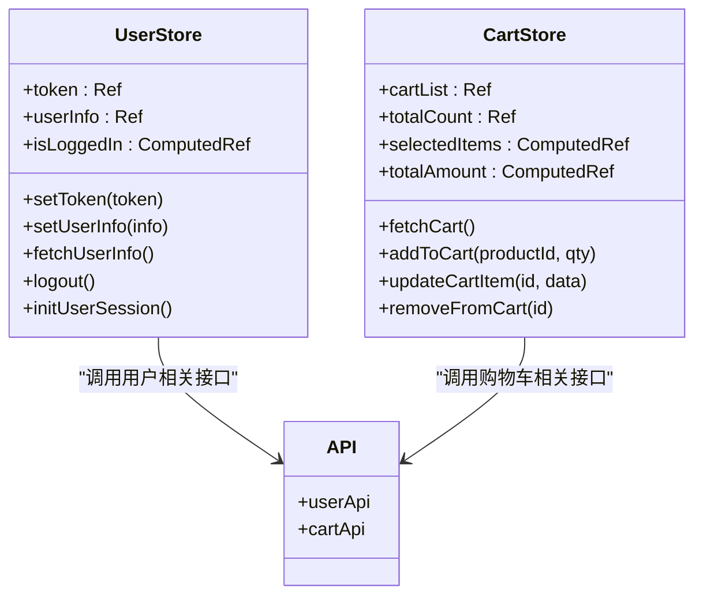
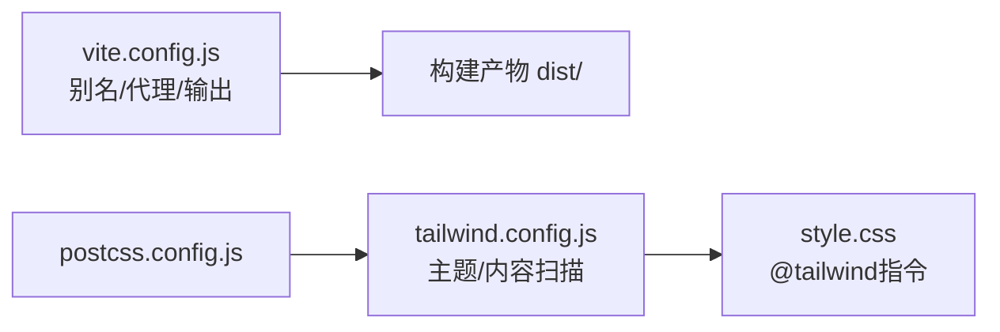
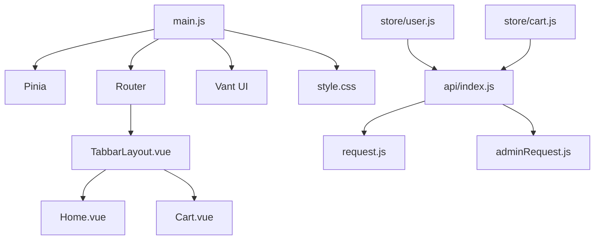

# 前端架构设计

<cite>
**本文档引用的文件**
- [main.js](file://frontend/src/main.js)
- [App.vue](file://frontend/src/App.vue)
- [router/index.js](file://frontend/src/router/index.js)
- [layouts/TabbarLayout.vue](file://frontend/src/layouts/TabbarLayout.vue)
- [store/user.js](file://frontend/src/store/user.js)
- [store/cart.js](file://frontend/src/store/cart.js)
- [api/index.js](file://frontend/src/api/index.js)
- [api/request.js](file://frontend/src/api/request.js)
- [api/adminRequest.js](file://frontend/src/api/adminRequest.js)
- [views/Home.vue](file://frontend/src/views/Home.vue)
- [views/Cart.vue](file://frontend/src/views/Cart.vue)
- [style.css](file://frontend/src/style.css)
- [package.json](file://frontend/package.json)
- [vite.config.js](file://frontend/vite.config.js)
- [tailwind.config.js](file://frontend/tailwind.config.js)
</cite>

## 目录
1. [引言](#引言)
2. [项目结构](#项目结构)
3. [核心组件](#核心组件)
4. [架构总览](#架构总览)
5. [详细组件分析](#详细组件分析)
6. [依赖关系分析](#依赖关系分析)
7. [性能考虑](#性能考虑)
8. [故障排除指南](#故障排除指南)
9. [结论](#结论)

## 引言
本文件为“趣配鲜”项目的前端架构设计文档，面向Vue.js 3.x应用，围绕组件化开发模式、路由与导航体系、状态管理、布局组件复用、组件通信机制、构建配置与样式系统、以及响应式与移动端适配策略进行系统性阐述。文档旨在帮助开发者快速理解项目整体架构，并在后续迭代中保持一致的设计与实现风格。

## 项目结构
前端采用典型的Vue 3 + Vite + Pinia + Vue Router + Vant + Tailwind CSS技术栈，目录组织遵循功能域划分与层次化设计：
- 应用入口与全局配置：main.js、App.vue、style.css
- 路由与导航：router/index.js
- 布局与通用组件：layouts/TabbarLayout.vue
- 视图组件：views/ 下按业务模块划分
- 状态管理：store/ 下按领域划分（user、cart）
- API封装：api/ 下按业务域划分（index.js导出聚合，request.js与adminRequest.js分别封装客户端与管理端HTTP层）
- 构建与样式：package.json、vite.config.js、tailwind.config.js、postcss.config.js

**图表来源**
- [main.js:1-56](file://frontend/src/main.js#L1-L56)
- [App.vue:1-10](file://frontend/src/App.vue#L1-L10)
- [router/index.js:1-192](file://frontend/src/router/index.js#L1-L192)
- [layouts/TabbarLayout.vue:1-99](file://frontend/src/layouts/TabbarLayout.vue#L1-L99)
- [store/user.js:1-96](file://frontend/src/store/user.js#L1-L96)
- [store/cart.js:1-68](file://frontend/src/store/cart.js#L1-L68)
- [api/index.js:1-136](file://frontend/src/api/index.js#L1-L136)
- [api/request.js:1-111](file://frontend/src/api/request.js#L1-L111)
- [api/adminRequest.js:1-93](file://frontend/src/api/adminRequest.js#L1-L93)
- [views/Home.vue:1-200](file://frontend/src/views/Home.vue#L1-L200)
- [views/Cart.vue:1-200](file://frontend/src/views/Cart.vue#L1-L200)

**章节来源**
- [main.js:1-56](file://frontend/src/main.js#L1-L56)
- [router/index.js:1-192](file://frontend/src/router/index.js#L1-L192)
- [package.json:1-26](file://frontend/package.json#L1-L26)

## 核心组件
- 应用入口与依赖注入：在入口文件中创建应用实例、安装Pinia与Vue Router，并一次性初始化用户会话；同时批量注册Vant UI组件，确保按需使用的组件库能力。
- 根组件：最外层容器，仅承载路由出口，实现页面级切换。
- 路由与导航：集中定义业务路由与后台路由，统一前置守卫处理标题、鉴权与重定向逻辑。
- 布局组件：TabbarLayout作为主应用的Tabbar容器，负责Tab切换、页面滚动归零、Tabbar显隐与底部安全区适配。
- 状态管理：Pinia Store按领域拆分，用户会话与购物车独立维护，计算属性驱动UI更新。
- API封装：通过API聚合导出各域方法，底层HTTP封装分别处理客户端与管理端请求拦截、加载态与错误提示、鉴权头注入与Token失效处理。

**章节来源**
- [main.js:1-56](file://frontend/src/main.js#L1-L56)
- [App.vue:1-10](file://frontend/src/App.vue#L1-L10)
- [router/index.js:155-189](file://frontend/src/router/index.js#L155-L189)
- [layouts/TabbarLayout.vue:1-99](file://frontend/src/layouts/TabbarLayout.vue#L1-L99)
- [store/user.js:1-96](file://frontend/src/store/user.js#L1-L96)
- [store/cart.js:1-68](file://frontend/src/store/cart.js#L1-L68)
- [api/index.js:1-136](file://frontend/src/api/index.js#L1-L136)
- [api/request.js:1-111](file://frontend/src/api/request.js#L1-L111)
- [api/adminRequest.js:1-93](file://frontend/src/api/adminRequest.js#L1-L93)

## 架构总览
下图展示从入口到视图组件的数据与控制流路径，以及状态管理与API层的交互关系。

**图表来源**
- [main.js:1-56](file://frontend/src/main.js#L1-L56)
- [router/index.js:1-192](file://frontend/src/router/index.js#L1-L192)
- [layouts/TabbarLayout.vue:1-99](file://frontend/src/layouts/TabbarLayout.vue#L1-L99)
- [views/Home.vue:1-200](file://frontend/src/views/Home.vue#L1-L200)
- [views/Cart.vue:1-200](file://frontend/src/views/Cart.vue#L1-L200)
- [store/user.js:1-96](file://frontend/src/store/user.js#L1-L96)
- [store/cart.js:1-68](file://frontend/src/store/cart.js#L1-L68)
- [api/index.js:1-136](file://frontend/src/api/index.js#L1-L136)
- [api/request.js:1-111](file://frontend/src/api/request.js#L1-L111)
- [api/adminRequest.js:1-93](file://frontend/src/api/adminRequest.js#L1-L93)

## 详细组件分析

### 路由与导航体系
- 路由结构：采用嵌套路由，主应用以TabbarLayout为父级，子路由覆盖首页、商品、食谱、购物车、个人中心及多个业务详情页；后台管理路由独立于主应用路由树，支持管理员专用页面。
- 导航守卫：前置守卫统一设置页面标题；对需要鉴权的路由检查Token与用户信息；对管理端路由检查管理员Token；鉴权失败时自动跳转至登录页并携带redirect参数。
- 页面跳转：TabbarLayout内部通过路由名映射到路径，实现Tab与页面的双向同步；部分页面通过meta控制是否隐藏Tabbar与额外底部空间。

**图表来源**
- [router/index.js:155-189](file://frontend/src/router/index.js#L155-L189)

**章节来源**
- [router/index.js:1-192](file://frontend/src/router/index.js#L1-L192)
- [layouts/TabbarLayout.vue:1-99](file://frontend/src/layouts/TabbarLayout.vue#L1-L99)

### 布局组件设计：TabbarLayout
- 设计理念：将Tabbar与页面内容解耦，通过computed动态控制Tabbar显隐与底部安全区适配；监听路由变化同步当前激活Tab，保证用户交互与URL一致性。
- 复用策略：所有主应用页面共享同一TabbarLayout，通过meta字段灵活控制显示行为；页面滚动归零避免历史滚动影响新页面体验。

**图表来源**
- [layouts/TabbarLayout.vue:22-76](file://frontend/src/layouts/TabbarLayout.vue#L22-L76)

**章节来源**
- [layouts/TabbarLayout.vue:1-99](file://frontend/src/layouts/TabbarLayout.vue#L1-L99)

### 状态管理：Pinia Store 组织
- 用户会话（user）：持久化存储Token与用户信息，提供登录态判断、资料拉取、登出与会话初始化；与路由守卫配合完成鉴权。
- 购物车（cart）：维护购物车列表、选中项与总价计算；提供增删改查与远程同步方法，确保UI与服务端一致。

**图表来源**
- [store/user.js:24-95](file://frontend/src/store/user.js#L24-L95)
- [store/cart.js:5-67](file://frontend/src/store/cart.js#L5-L67)
- [api/index.js:1-136](file://frontend/src/api/index.js#L1-L136)

**章节来源**
- [store/user.js:1-96](file://frontend/src/store/user.js#L1-L96)
- [store/cart.js:1-68](file://frontend/src/store/cart.js#L1-L68)
- [api/index.js:1-136](file://frontend/src/api/index.js#L1-L136)

### 组件通信机制
- Props传递：视图组件通过API返回数据驱动渲染，如首页轮播、分类、商品与食谱列表。
- 事件触发：组件内部通过事件回调触发导航或状态更新，如点击商品跳转详情、修改数量后同步服务端。
- 插槽使用：在布局与UI组件中使用具名插槽实现头部区域自定义，如搜索框、客服图标等。

示例参考：
- 首页组件通过导航事件跳转至商品列表与详情页，同时在挂载时拉取购物车数据。
- 购物车组件通过复选框与步进器控制选中状态与数量变更，异步更新服务端并刷新本地状态。

**章节来源**
- [views/Home.vue:107-184](file://frontend/src/views/Home.vue#L107-L184)
- [views/Cart.vue:43-123](file://frontend/src/views/Cart.vue#L43-L123)

### 前端构建配置与样式系统
- 构建工具：Vite提供开发服务器与生产打包，配置了路径别名、开发代理与输出目录。
- 样式系统：Tailwind CSS通过PostCSS按需生成类，主题扩展了品牌色与字体族；全局样式统一基础排版与安全区适配。

**图表来源**
- [vite.config.js:1-26](file://frontend/vite.config.js#L1-L26)
- [tailwind.config.js:1-24](file://frontend/tailwind.config.js#L1-L24)
- [style.css:1-71](file://frontend/src/style.css#L1-L71)

**章节来源**
- [package.json:1-26](file://frontend/package.json#L1-L26)
- [vite.config.js:1-26](file://frontend/vite.config.js#L1-L26)
- [tailwind.config.js:1-24](file://frontend/tailwind.config.js#L1-L24)
- [style.css:1-71](file://frontend/src/style.css#L1-L71)

### 响应式设计与移动端适配
- 安全区适配：TabbarLayout与视图组件使用环境变量适配iPhone等机型的安全区域，确保Tabbar与底部按钮不被遮挡。
- 视觉规范：Tailwind主题定义品牌主色与辅助色，统一组件视觉风格；全局样式对常用元素进行基础排版与字体优化。
- 交互细节：Tabbar布局在页面切换时滚动归零，提升移动端阅读体验；购物车与首页等页面针对移动端交互进行优化。

**章节来源**
- [layouts/TabbarLayout.vue:78-98](file://frontend/src/layouts/TabbarLayout.vue#L78-L98)
- [views/Home.vue:186-200](file://frontend/src/views/Home.vue#L186-L200)
- [views/Cart.vue:125-200](file://frontend/src/views/Cart.vue#L125-L200)
- [tailwind.config.js:7-20](file://frontend/tailwind.config.js#L7-L20)
- [style.css:11-20](file://frontend/src/style.css#L11-L20)

## 依赖关系分析
- 入口依赖：main.js依赖Pinia、Router、Vant组件库与全局样式；初始化用户会话后挂载应用。
- 路由依赖：router/index.js依赖TabbarLayout与各视图组件；前置守卫依赖localStorage中的Token与用户信息。
- 状态依赖：store/user.js与store/cart.js依赖api/index.js导出的API方法；API方法进一步依赖request.js或adminRequest.js。
- 视图依赖：views/Home.vue与views/Cart.vue依赖对应Store与API方法，同时依赖Vant UI组件实现交互。

**图表来源**
- [main.js:1-56](file://frontend/src/main.js#L1-L56)
- [router/index.js:1-192](file://frontend/src/router/index.js#L1-L192)
- [layouts/TabbarLayout.vue:1-99](file://frontend/src/layouts/TabbarLayout.vue#L1-L99)
- [views/Home.vue:1-200](file://frontend/src/views/Home.vue#L1-L200)
- [views/Cart.vue:1-200](file://frontend/src/views/Cart.vue#L1-L200)
- [store/user.js:1-96](file://frontend/src/store/user.js#L1-L96)
- [store/cart.js:1-68](file://frontend/src/store/cart.js#L1-L68)
- [api/index.js:1-136](file://frontend/src/api/index.js#L1-L136)
- [api/request.js:1-111](file://frontend/src/api/request.js#L1-L111)
- [api/adminRequest.js:1-93](file://frontend/src/api/adminRequest.js#L1-L93)

**章节来源**
- [main.js:1-56](file://frontend/src/main.js#L1-L56)
- [router/index.js:1-192](file://frontend/src/router/index.js#L1-L192)
- [api/index.js:1-136](file://frontend/src/api/index.js#L1-L136)

## 性能考虑
- 懒加载路由：路由组件采用动态导入，减少首屏体积与初次渲染时间。
- 组件懒加载：Vant组件在入口处批量注册，实际使用时按需引入可进一步优化。
- 请求拦截：统一处理加载态与错误提示，避免重复弹窗与无意义的重试。
- 计算属性：Store中使用计算属性减少重复计算，提高渲染效率。
- 构建优化：Vite默认启用代码分割与Tree-shaking；生产环境关闭SourceMap降低体积。

[本节为通用指导，无需具体文件引用]

## 故障排除指南
- 登录态异常：若出现Token过期导致的401错误，HTTP拦截器会自动清理Token并跳转登录页；可在控制台查看Token校验分支与错误码。
- 管理端鉴权：管理端路由若未携带有效Token，将重定向至管理登录页；检查localStorage中的admin_token。
- 请求失败：HTTP拦截器统一处理401/403/404/500等状态码并提示消息；关注控制台输出的错误信息。
- 购物车不同步：数量变更或删除后需等待服务端响应并刷新本地状态；若异常，检查对应API调用与错误处理分支。

**章节来源**
- [api/request.js:50-109](file://frontend/src/api/request.js#L50-L109)
- [api/adminRequest.js:48-91](file://frontend/src/api/adminRequest.js#L48-L91)
- [router/index.js:155-189](file://frontend/src/router/index.js#L155-L189)

## 结论
“趣配鲜”前端采用清晰的分层架构：入口与全局配置、路由与导航、布局与通用组件、视图与状态管理、API封装与HTTP拦截、构建与样式系统。该架构在保证开发效率的同时，兼顾了移动端体验与可维护性。建议在后续迭代中持续完善组件文档、补充单元测试与E2E测试，并根据业务增长逐步优化路由懒加载与资源加载策略。