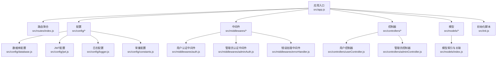
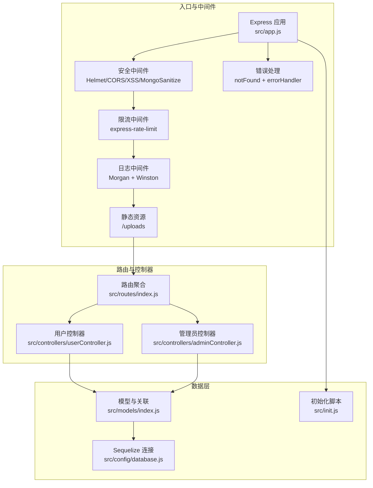
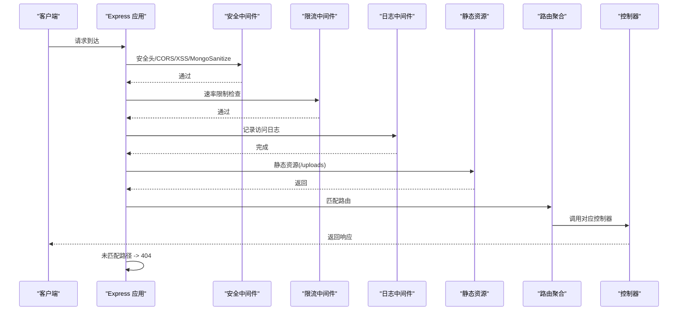
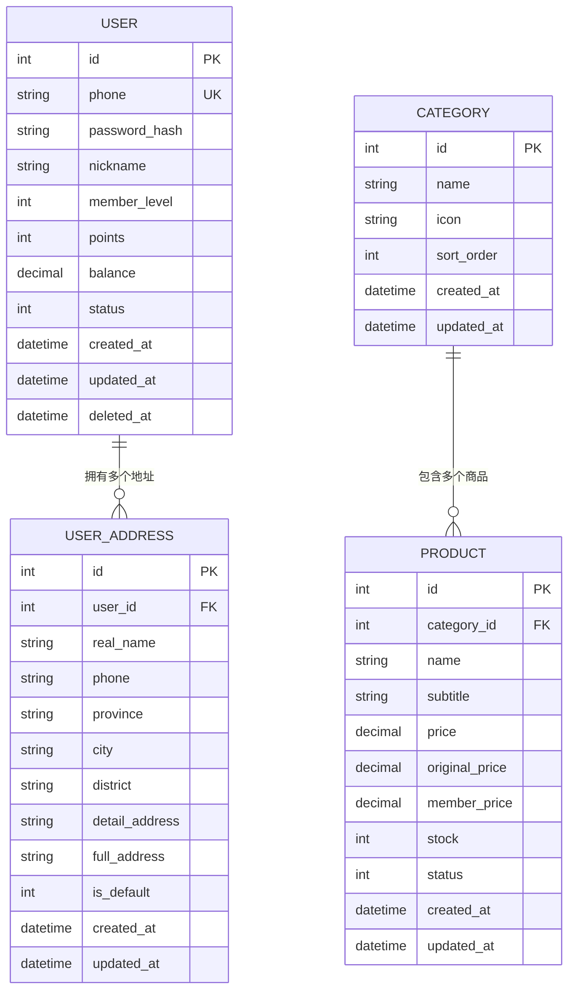
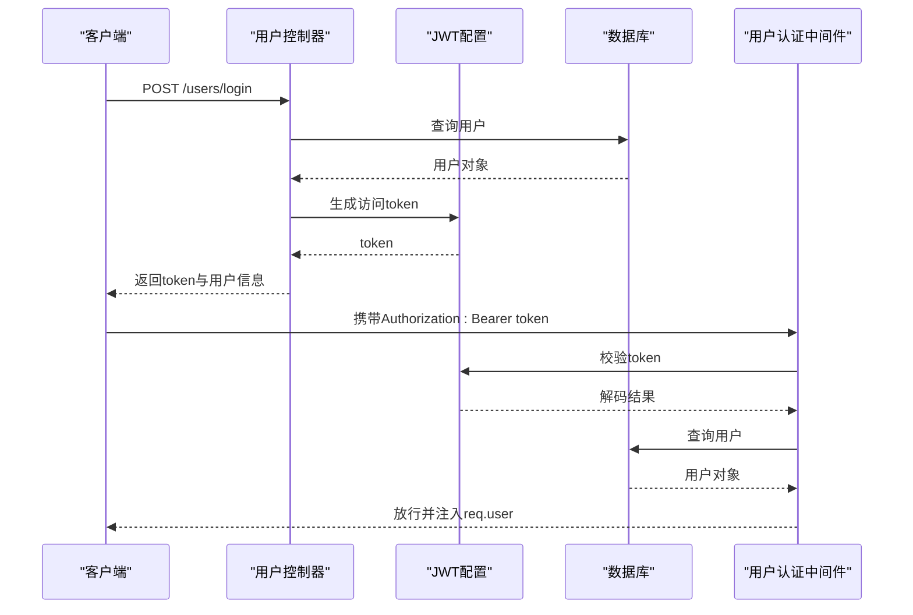
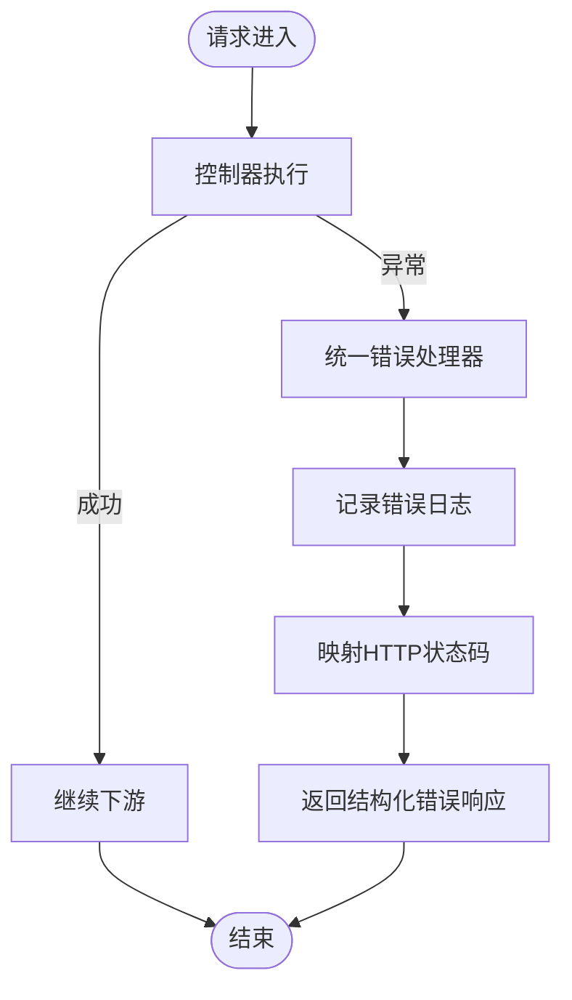
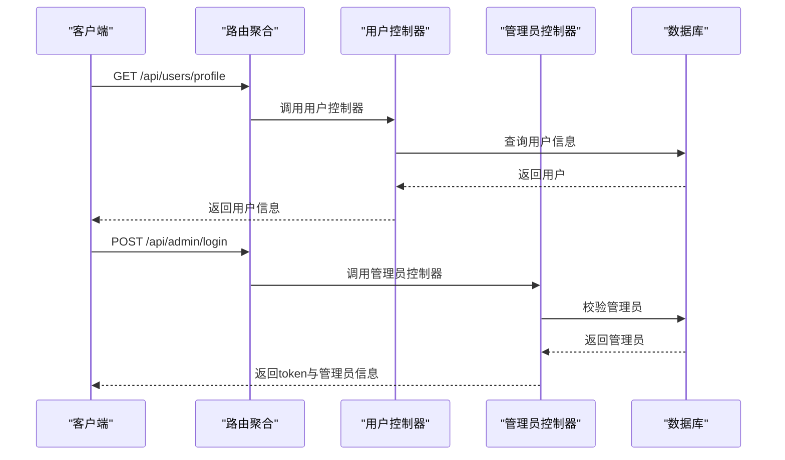
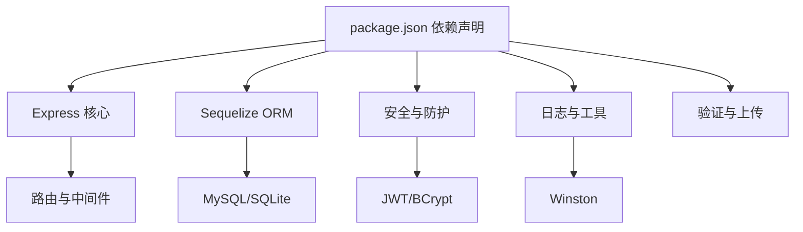

# 后端架构设计

<cite>
**本文引用的文件**
- [backend/src/app.js](file://backend/src/app.js)
- [backend/src/init.js](file://backend/src/init.js)
- [backend/src/config/database.js](file://backend/src/config/database.js)
- [backend/src/config/jwt.js](file://backend/src/config/jwt.js)
- [backend/src/config/logger.js](file://backend/src/config/logger.js)
- [backend/src/config/constants.js](file://backend/src/config/constants.js)
- [backend/src/middlewares/auth.js](file://backend/src/middlewares/auth.js)
- [backend/src/middlewares/adminAuth.js](file://backend/src/middlewares/adminAuth.js)
- [backend/src/middlewares/errorHandler.js](file://backend/src/middlewares/errorHandler.js)
- [backend/src/routes/index.js](file://backend/src/routes/index.js)
- [backend/src/models/index.js](file://backend/src/models/index.js)
- [backend/src/controllers/userController.js](file://backend/src/controllers/userController.js)
- [backend/src/controllers/adminController.js](file://backend/src/controllers/adminController.js)
- [backend/package.json](file://backend/package.json)
- [backend/.env](file://backend/.env)
</cite>

## 目录
1. [引言](#引言)
2. [项目结构](#项目结构)
3. [核心组件](#核心组件)
4. [架构总览](#架构总览)
5. [详细组件分析](#详细组件分析)
6. [依赖分析](#依赖分析)
7. [性能考虑](#性能考虑)
8. [故障排查指南](#故障排查指南)
9. [结论](#结论)
10. [附录](#附录)

## 引言
本文件为“趣配鲜”项目的后端架构设计文档，面向后端开发者与运维人员，系统梳理基于 Express.js 的应用配置、中间件体系、MVC 架构落地、数据库与 ORM 设计、JWT 认证与权限控制、错误处理与日志、安全防护以及 API 路由与请求处理链路。文档以代码为依据，辅以可视化图表帮助理解。

## 项目结构
后端采用模块化分层组织：
- 配置层：数据库、JWT、日志、常量等
- 中间件层：认证、管理员认证、错误处理
- 控制器层：用户、管理员、商品、订单、购物车等业务控制器
- 模型层：Sequelize ORM 模型及关联定义
- 路由层：按功能域划分的路由聚合
- 启动与初始化：应用启动、数据库连接与初始化脚本

**图表来源**
- [backend/src/app.js:1-84](file://backend/src/app.js#L1-L84)
- [backend/src/routes/index.js:1-27](file://backend/src/routes/index.js#L1-L27)
- [backend/src/config/database.js:1-56](file://backend/src/config/database.js#L1-L56)
- [backend/src/config/jwt.js:1-41](file://backend/src/config/jwt.js#L1-L41)
- [backend/src/config/logger.js:1-52](file://backend/src/config/logger.js#L1-L52)
- [backend/src/config/constants.js:1-132](file://backend/src/config/constants.js#L1-L132)
- [backend/src/middlewares/auth.js:1-181](file://backend/src/middlewares/auth.js#L1-L181)
- [backend/src/middlewares/adminAuth.js:1-77](file://backend/src/middlewares/adminAuth.js#L1-L77)
- [backend/src/middlewares/errorHandler.js:1-47](file://backend/src/middlewares/errorHandler.js#L1-L47)
- [backend/src/controllers/userController.js:1-409](file://backend/src/controllers/userController.js#L1-L409)
- [backend/src/controllers/adminController.js:1-457](file://backend/src/controllers/adminController.js#L1-L457)
- [backend/src/models/index.js:1-92](file://backend/src/models/index.js#L1-L92)

**章节来源**
- [backend/src/app.js:1-84](file://backend/src/app.js#L1-L84)
- [backend/src/routes/index.js:1-27](file://backend/src/routes/index.js#L1-L27)

## 核心组件
- 应用入口与中间件链：集中于应用入口文件，统一挂载安全中间件、限流、静态资源、路由与错误处理。
- 数据库与 ORM：通过 Sequelize 连接 SQLite 或 MySQL，统一时间戳命名与表名冻结策略。
- JWT 与认证：独立配置模块，提供生成与校验 token 的能力；用户与管理员分别有专用中间件。
- 日志系统：Winston 输出到文件与控制台，按级别分文件存储。
- 错误处理：统一捕获异常，输出结构化错误响应并记录日志。
- 初始化脚本：开发环境下自动建表、创建默认管理员、测试用户、基础数据等。

**章节来源**
- [backend/src/app.js:1-84](file://backend/src/app.js#L1-L84)
- [backend/src/config/database.js:1-56](file://backend/src/config/database.js#L1-L56)
- [backend/src/config/jwt.js:1-41](file://backend/src/config/jwt.js#L1-L41)
- [backend/src/config/logger.js:1-52](file://backend/src/config/logger.js#L1-L52)
- [backend/src/middlewares/errorHandler.js:1-47](file://backend/src/middlewares/errorHandler.js#L1-L47)
- [backend/src/init.js:1-502](file://backend/src/init.js#L1-L502)

## 架构总览
后端采用经典的 MVC 架构：
- Model：Sequelize 模型与关联，封装数据访问与业务实体
- View：本项目为 API 服务，不包含传统视图层
- Controller：处理请求、调用服务逻辑、返回标准化响应
- Middleware：统一处理安全、限流、认证、错误与日志
- Routes：按领域拆分路由，聚合到统一入口

**图表来源**
- [backend/src/app.js:1-84](file://backend/src/app.js#L1-L84)
- [backend/src/routes/index.js:1-27](file://backend/src/routes/index.js#L1-L27)
- [backend/src/controllers/userController.js:1-409](file://backend/src/controllers/userController.js#L1-L409)
- [backend/src/controllers/adminController.js:1-457](file://backend/src/controllers/adminController.js#L1-L457)
- [backend/src/config/database.js:1-56](file://backend/src/config/database.js#L1-L56)
- [backend/src/models/index.js:1-92](file://backend/src/models/index.js#L1-L92)
- [backend/src/init.js:1-502](file://backend/src/init.js#L1-L502)

## 详细组件分析

### 应用入口与中间件链
- 安全与防护：启用 Helmet、CORS、XSS 清理、Mongo 注入清理、速率限制、Morgan 日志集成自定义 Winston。
- 路由挂载：根据环境变量 API 前缀挂载路由；未匹配路径统一 404。
- 启动流程：数据库连接与同步、开发环境初始化、监听端口并输出 API 地址。

**图表来源**
- [backend/src/app.js:19-53](file://backend/src/app.js#L19-L53)
- [backend/src/routes/index.js:11-24](file://backend/src/routes/index.js#L11-L24)

**章节来源**
- [backend/src/app.js:1-84](file://backend/src/app.js#L1-L84)

### 数据库与 ORM 设计
- 连接配置：支持 SQLite 与 MySQL，开发默认 SQLite，生产可切换 MySQL；统一时间戳字段命名与表名冻结。
- 初始化：开发环境启动时同步表结构并执行初始化脚本，创建默认管理员、测试用户、分类、商品、食谱、Banner、公告、资质、协议等数据。
- 模型关联：在模型索引中集中定义一对一、一对多、多对多关系，确保跨模块查询一致性。

**图表来源**
- [backend/src/config/database.js:10-52](file://backend/src/config/database.js#L10-L52)
- [backend/src/init.js:17-289](file://backend/src/init.js#L17-L289)
- [backend/src/models/index.js:27-67](file://backend/src/models/index.js#L27-L67)

**章节来源**
- [backend/src/config/database.js:1-56](file://backend/src/config/database.js#L1-L56)
- [backend/src/init.js:1-502](file://backend/src/init.js#L1-L502)
- [backend/src/models/index.js:1-92](file://backend/src/models/index.js#L1-L92)

### JWT 认证与权限控制
- JWT 配置：独立模块，提供生成与校验 token 的方法，支持主 token 与刷新 token。
- 用户认证中间件：从 Authorization 头解析 Bearer token，解码后查询用户，校验状态与软删除，支持开发环境下的测试用户回退。
- 管理员认证中间件：校验管理员 token，检查状态；提供角色权限装饰器，支持超级管理员豁免与角色白名单。
- 控制器集成：用户登录/注册、管理员登录、密码重置等均使用 JWT 返回 token。

**图表来源**
- [backend/src/controllers/userController.js:44-93](file://backend/src/controllers/userController.js#L44-L93)
- [backend/src/config/jwt.js:10-32](file://backend/src/config/jwt.js#L10-L32)
- [backend/src/middlewares/auth.js:4-148](file://backend/src/middlewares/auth.js#L4-L148)

**章节来源**
- [backend/src/config/jwt.js:1-41](file://backend/src/config/jwt.js#L1-L41)
- [backend/src/middlewares/auth.js:1-181](file://backend/src/middlewares/auth.js#L1-L181)
- [backend/src/middlewares/adminAuth.js:1-77](file://backend/src/middlewares/adminAuth.js#L1-L77)
- [backend/src/controllers/userController.js:1-409](file://backend/src/controllers/userController.js#L1-L409)
- [backend/src/controllers/adminController.js:1-457](file://backend/src/controllers/adminController.js#L1-L457)

### 错误处理与日志
- 统一错误处理器：捕获异常，记录错误日志（含 URL、方法、IP、堆栈），按错误类型映射 HTTP 状态码，开发环境返回堆栈。
- 404 处理器：未匹配路由统一返回资源不存在。
- 日志系统：Winston 输出到文件与控制台，按级别分文件，支持彩色控制台输出。

**图表来源**
- [backend/src/middlewares/errorHandler.js:3-44](file://backend/src/middlewares/errorHandler.js#L3-L44)
- [backend/src/config/logger.js:10-49](file://backend/src/config/logger.js#L10-L49)

**章节来源**
- [backend/src/middlewares/errorHandler.js:1-47](file://backend/src/middlewares/errorHandler.js#L1-L47)
- [backend/src/config/logger.js:1-52](file://backend/src/config/logger.js#L1-L52)

### API 路由设计与请求处理链
- 路由聚合：按功能域拆分路由（首页、用户、商品、购物车、订单、后台），统一挂载到 /api 前缀。
- 健康检查：提供 /health 接口用于探活。
- 控制器职责：用户控制器处理注册、登录、资料、地址、密码等；管理员控制器处理登录、统计、角色、短信验证码等。

**图表来源**
- [backend/src/routes/index.js:4-24](file://backend/src/routes/index.js#L4-L24)
- [backend/src/controllers/userController.js:95-110](file://backend/src/controllers/userController.js#L95-L110)
- [backend/src/controllers/adminController.js:8-49](file://backend/src/controllers/adminController.js#L8-L49)

**章节来源**
- [backend/src/routes/index.js:1-27](file://backend/src/routes/index.js#L1-L27)
- [backend/src/controllers/userController.js:1-409](file://backend/src/controllers/userController.js#L1-L409)
- [backend/src/controllers/adminController.js:1-457](file://backend/src/controllers/adminController.js#L1-L457)

## 依赖分析
- Express 生态：CORS、Helmet、XSS 清理、Mongo 注入清理、速率限制、Morgan、Winston。
- 数据库：Sequelize + mysql2 或 sqlite3，支持连接池与日志开关。
- 安全：bcryptjs、jsonwebtoken、crypto-js（用于加密场景）。
- 工具：dayjs、xlsx、multer（文件上传）、axios（外部调用）。
- 开发：Jest、Nodemon、Supertest。

**图表来源**
- [backend/package.json:18-39](file://backend/package.json#L18-L39)

**章节来源**
- [backend/package.json:1-50](file://backend/package.json#L1-L50)

## 性能考虑
- 数据库连接池：MySQL 配置了最大连接数、最小连接数、获取超时与空闲超时，建议结合实际并发调整。
- 速率限制：默认窗口与最大请求数可按环境变量配置，建议针对不同接口差异化限流。
- 日志级别：生产环境建议提升日志级别并减少控制台输出，降低 I/O 压力。
- 静态资源：上传目录静态托管，建议配合 CDN 与缓存策略优化。
- 初始化脚本：仅在开发环境执行，避免生产环境不必要的初始化开销。

## 故障排查指南
- 启动失败：检查数据库连接参数、端口占用、环境变量是否正确。
- 认证失败：核对 Authorization 头格式、JWT 秘钥、token 是否过期、用户状态与黑名单。
- 404 路由：确认 API 前缀、路由是否正确挂载、控制器是否存在。
- 日志定位：查看 logs 目录中的 error.log、combined.log、access.log，结合请求 URL 与 IP 快速定位问题。
- 初始化异常：开发环境初始化失败通常为重复数据或约束冲突，检查初始化脚本与数据库状态。

**章节来源**
- [backend/src/app.js:57-79](file://backend/src/app.js#L57-L79)
- [backend/src/middlewares/errorHandler.js:3-44](file://backend/src/middlewares/errorHandler.js#L3-L44)
- [backend/src/config/logger.js:22-38](file://backend/src/config/logger.js#L22-L38)

## 结论
本项目以 Express 为基础，结合 Sequelize ORM 实现清晰的数据层抽象，采用 JWT 实现用户与管理员双通道认证，配合统一中间件与错误处理机制，形成稳定可扩展的后端架构。通过模块化与分层设计，便于后续功能迭代与维护。

## 附录
- 环境变量示例与用途参考 .env 文件。
- 常量定义集中于 constants.js，涵盖订单、售后、优惠券、管理员角色等枚举。

**章节来源**
- [backend/.env:1-55](file://backend/.env#L1-L55)
- [backend/src/config/constants.js:1-132](file://backend/src/config/constants.js#L1-L132)