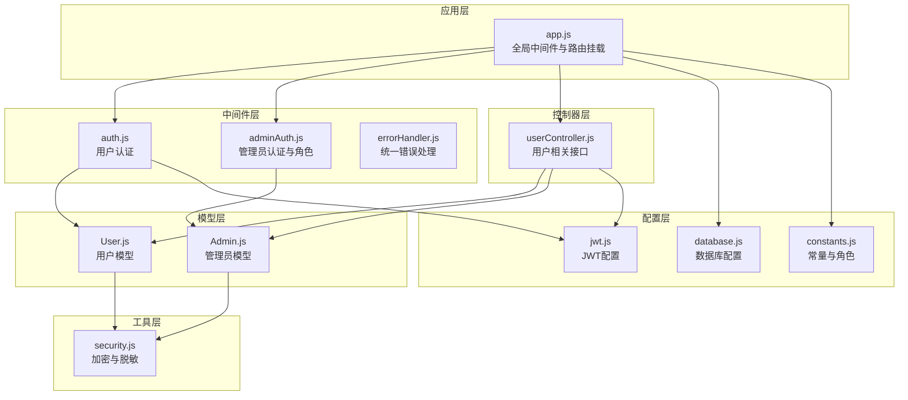
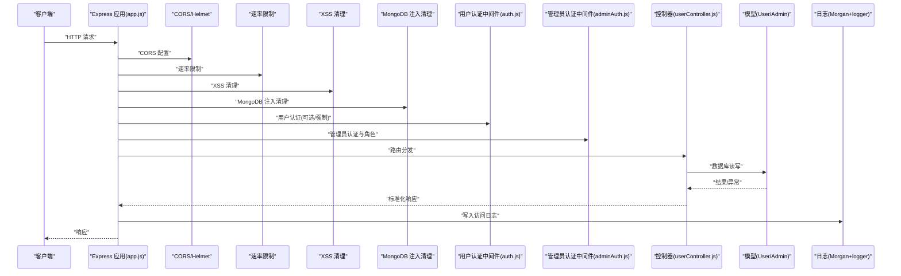
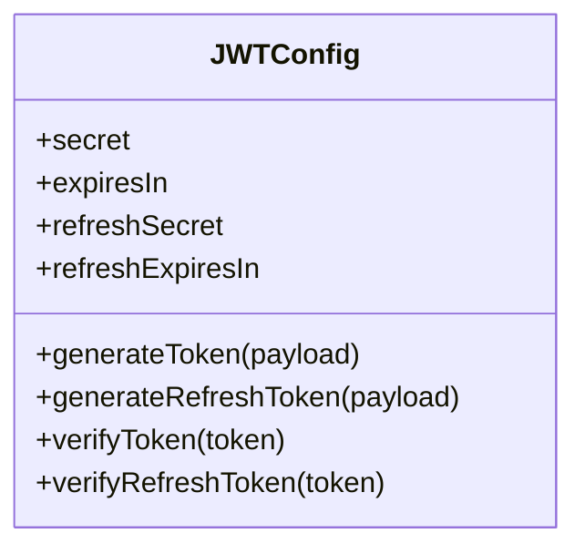
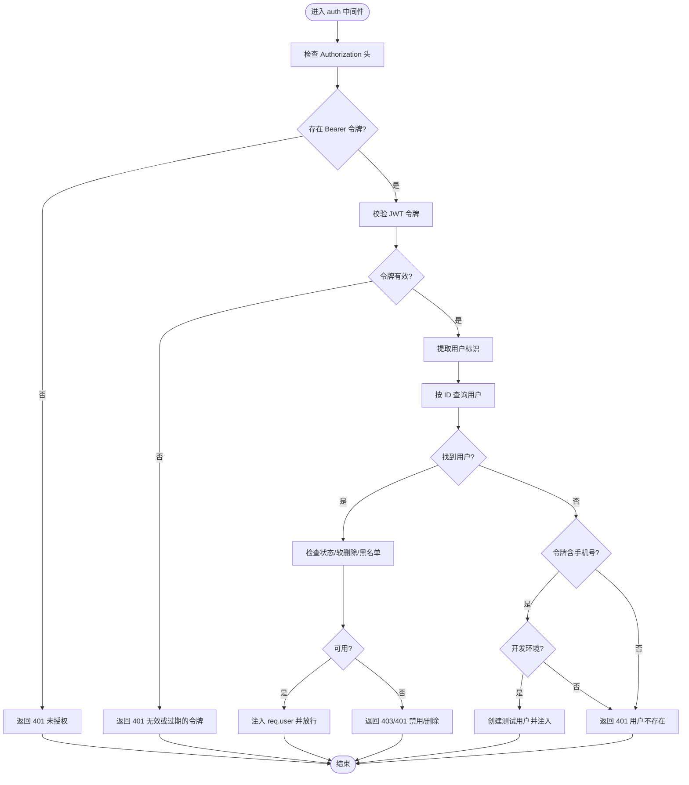
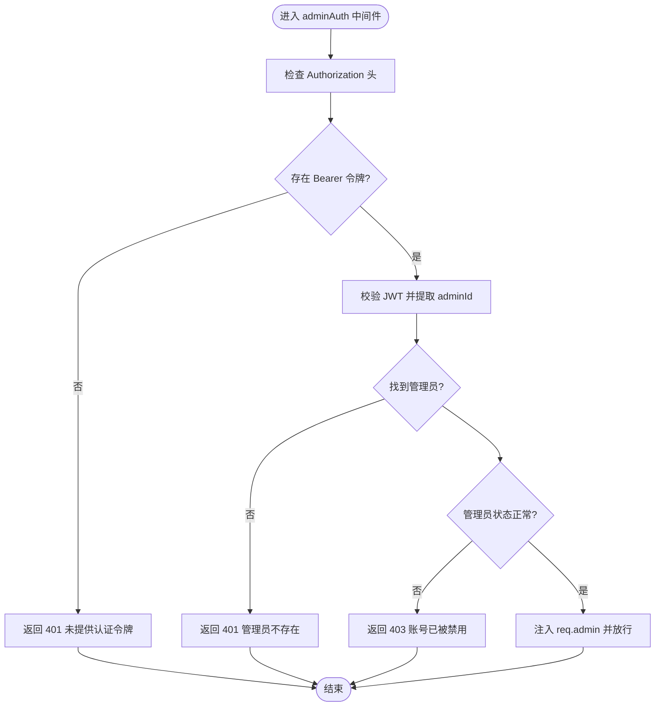
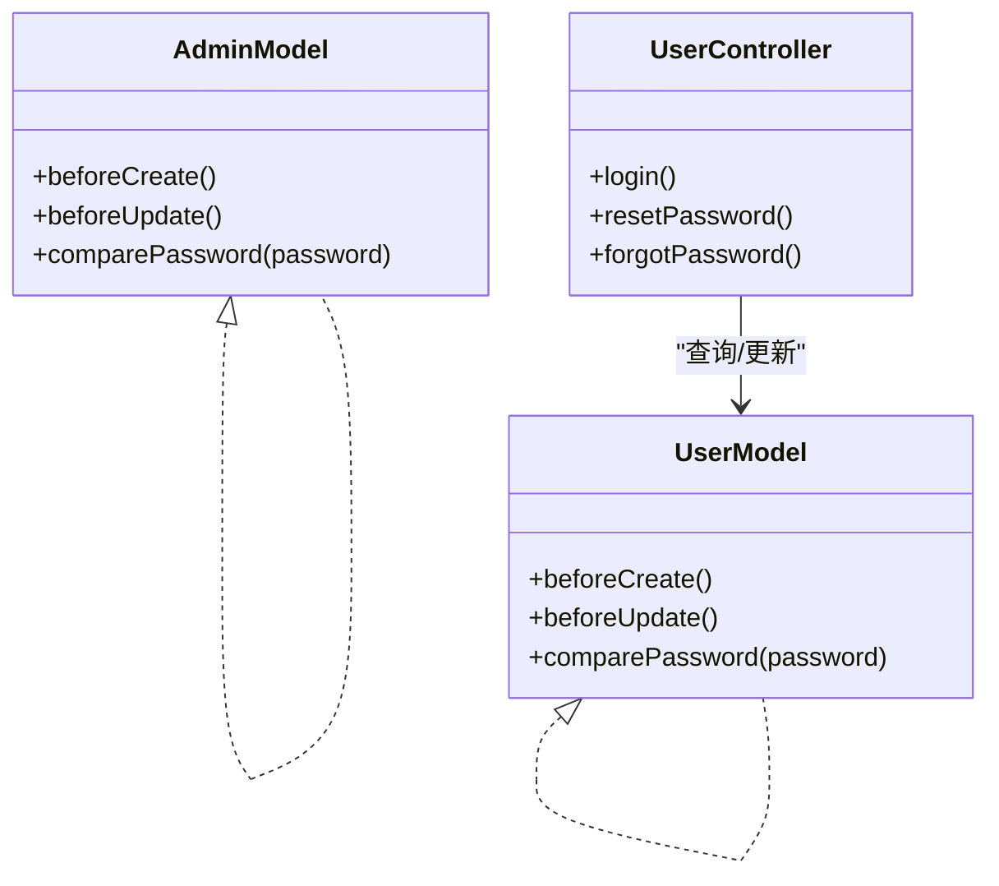
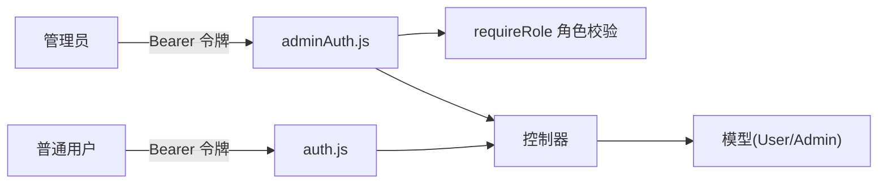
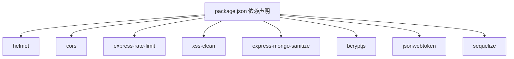

# 安全架构设计

<cite>
**本文引用的文件**
- [backend/src/config/jwt.js](file://backend/src/config/jwt.js)
- [backend/src/middlewares/auth.js](file://backend/src/middlewares/auth.js)
- [backend/src/middlewares/adminAuth.js](file://backend/src/middlewares/adminAuth.js)
- [backend/src/utils/security.js](file://backend/src/utils/security.js)
- [backend/src/controllers/userController.js](file://backend/src/controllers/userController.js)
- [backend/src/models/User.js](file://backend/src/models/User.js)
- [backend/src/models/Admin.js](file://backend/src/models/Admin.js)
- [backend/src/config/constants.js](file://backend/src/config/constants.js)
- [backend/src/middlewares/errorHandler.js](file://backend/src/middlewares/errorHandler.js)
- [backend/src/app.js](file://backend/src/app.js)
- [backend/src/config/database.js](file://backend/src/config/database.js)
- [backend/package.json](file://backend/package.json)
</cite>

## 目录
1. [引言](#引言)
2. [项目结构](#项目结构)
3. [核心组件](#核心组件)
4. [架构总览](#架构总览)
5. [详细组件分析](#详细组件分析)
6. [依赖关系分析](#依赖关系分析)
7. [性能与安全特性](#性能与安全特性)
8. [故障排查指南](#故障排查指南)
9. [结论](#结论)
10. [附录](#附录)

## 引言
本文件为“趣配鲜”项目的全面安全架构设计文档，聚焦系统安全防护体系，涵盖认证与授权、密码加密策略、输入验证与数据净化、权限控制、API 安全设计、错误处理与日志记录、安全漏洞防护与渗透测试建议，以及安全事件响应与应急处理方案。文档面向技术与非技术读者，力求以渐进式复杂度呈现，辅以可视化图示帮助理解。

## 项目结构
后端采用 Express + Sequelize 架构，安全相关能力主要分布在以下层次：
- 应用层：全局中间件（CORS、Helmet、速率限制、XSS 清理、MongoDB 注入清理、日志）、路由入口
- 中间件层：用户认证中间件、管理员认证与角色校验中间件、统一错误处理
- 控制器层：业务控制器（如用户控制器），负责调用模型与返回标准化响应
- 模型层：用户与管理员模型，内置密码哈希钩子与字段约束
- 工具层：通用安全工具（对称加密、敏感信息脱敏）
- 配置层：JWT 配置、数据库配置、常量定义（含管理员角色）

图表来源
- [backend/src/app.js:1-84](file://backend/src/app.js#L1-L84)
- [backend/src/middlewares/auth.js:1-181](file://backend/src/middlewares/auth.js#L1-L181)
- [backend/src/middlewares/adminAuth.js:1-77](file://backend/src/middlewares/adminAuth.js#L1-L77)
- [backend/src/controllers/userController.js:1-426](file://backend/src/controllers/userController.js#L1-L426)
- [backend/src/models/User.js:1-150](file://backend/src/models/User.js#L1-L150)
- [backend/src/models/Admin.js:1-96](file://backend/src/models/Admin.js#L1-L96)
- [backend/src/utils/security.js:1-48](file://backend/src/utils/security.js#L1-L48)
- [backend/src/config/jwt.js:1-41](file://backend/src/config/jwt.js#L1-L41)
- [backend/src/config/constants.js:1-132](file://backend/src/config/constants.js#L1-L132)
- [backend/src/config/database.js:1-56](file://backend/src/config/database.js#L1-L56)

章节来源
- [backend/src/app.js:1-84](file://backend/src/app.js#L1-L84)
- [backend/src/config/database.js:1-56](file://backend/src/config/database.js#L1-L56)

## 核心组件
- JWT 认证与刷新机制：集中于配置模块，提供生成与校验方法，并支持独立的访问令牌与刷新令牌密钥与过期策略。
- 用户认证中间件：解析 Authorization 头，校验 JWT，回源查询用户状态与软删除标记，支持开发环境下的测试用户回退。
- 管理员认证与角色中间件：校验管理员 JWT，检查管理员状态与角色，提供基于角色的权限拦截。
- 密码加密策略：bcrypt 在模型钩子与控制器中均有体现，确保密码入库前进行加盐哈希。
- 输入验证与数据净化：启用 Helmet、xss-clean、express-mongo-sanitize，结合 express-validator 可进一步完善。
- 权限控制：用户态与管理员态双轨制，管理员角色枚举与超级管理员豁免逻辑。
- API 安全设计：CORS、速率限制、安全头部、静态资源访问控制。
- 错误处理与日志：统一错误处理器与 Morgan 日志流，生产环境脱敏输出。
- 敏感信息保护：对称加密工具与多字段脱敏策略（手机号、姓名、身份证、邮箱）。

章节来源
- [backend/src/config/jwt.js:1-41](file://backend/src/config/jwt.js#L1-L41)
- [backend/src/middlewares/auth.js:1-181](file://backend/src/middlewares/auth.js#L1-L181)
- [backend/src/middlewares/adminAuth.js:1-77](file://backend/src/middlewares/adminAuth.js#L1-L77)
- [backend/src/utils/security.js:1-48](file://backend/src/utils/security.js#L1-L48)
- [backend/src/controllers/userController.js:1-426](file://backend/src/controllers/userController.js#L1-L426)
- [backend/src/models/User.js:1-150](file://backend/src/models/User.js#L1-L150)
- [backend/src/models/Admin.js:1-96](file://backend/src/models/Admin.js#L1-L96)
- [backend/src/config/constants.js:1-132](file://backend/src/config/constants.js#L1-L132)
- [backend/src/middlewares/errorHandler.js:1-47](file://backend/src/middlewares/errorHandler.js#L1-L47)
- [backend/src/app.js:1-84](file://backend/src/app.js#L1-L84)

## 架构总览
下图展示从客户端到后端各层的安全交互流程，重点标注认证、授权、数据净化与日志审计的关键节点。

图表来源
- [backend/src/app.js:1-84](file://backend/src/app.js#L1-L84)
- [backend/src/middlewares/auth.js:1-181](file://backend/src/middlewares/auth.js#L1-L181)
- [backend/src/middlewares/adminAuth.js:1-77](file://backend/src/middlewares/adminAuth.js#L1-L77)
- [backend/src/controllers/userController.js:1-426](file://backend/src/controllers/userController.js#L1-L426)
- [backend/src/middlewares/errorHandler.js:1-47](file://backend/src/middlewares/errorHandler.js#L1-L47)

## 详细组件分析

### JWT 认证机制设计与实现
- 配置项：支持独立的访问令牌与刷新令牌密钥及过期时间，可通过环境变量覆盖。
- 生成与校验：提供生成与校验方法，分别用于访问令牌与刷新令牌。
- 使用场景：用户登录成功后签发访问令牌；管理员登录后签发管理员令牌；后续受保护接口通过中间件校验。

图表来源
- [backend/src/config/jwt.js:1-41](file://backend/src/config/jwt.js#L1-L41)

章节来源
- [backend/src/config/jwt.js:1-41](file://backend/src/config/jwt.js#L1-L41)

### 用户认证中间件（auth.js）
- 请求头解析：要求 Bearer 令牌格式，否则返回未授权。
- 令牌校验：使用 JWT 配置中的密钥校验访问令牌。
- 用户检索：根据令牌中的用户标识查询用户，排除敏感字段。
- 状态与软删除：检查用户状态、黑名单与软删除标记，拒绝禁用账户。
- 开发回退：当按 ID 查询不到用户但令牌包含手机号时，在开发环境可回退创建测试用户。
- 可选认证：提供 optionalAuth，仅在存在有效令牌且用户可用时注入 req.user。

图表来源
- [backend/src/middlewares/auth.js:1-181](file://backend/src/middlewares/auth.js#L1-L181)

章节来源
- [backend/src/middlewares/auth.js:1-181](file://backend/src/middlewares/auth.js#L1-L181)

### 管理员认证与角色中间件（adminAuth.js）
- 令牌解析与校验：要求 Bearer 令牌，校验管理员标识。
- 管理员状态：查询管理员并检查状态，禁用则拒绝访问。
- 角色控制：提供 requireRole 中间件，支持超级管理员豁免与细粒度角色判断。

图表来源
- [backend/src/middlewares/adminAuth.js:1-77](file://backend/src/middlewares/adminAuth.js#L1-L77)

章节来源
- [backend/src/middlewares/adminAuth.js:1-77](file://backend/src/middlewares/adminAuth.js#L1-L77)

### 密码加密策略（bcrypt）
- 入库加盐哈希：用户与管理员模型均在创建/更新前自动对密码字段加盐并哈希。
- 登录对比：控制器中使用 bcrypt 对比明文与哈希值。
- 安全参数：统一使用 bcrypt 的安全轮数，避免弱加密。

图表来源
- [backend/src/models/User.js:1-150](file://backend/src/models/User.js#L1-L150)
- [backend/src/models/Admin.js:1-96](file://backend/src/models/Admin.js#L1-L96)
- [backend/src/controllers/userController.js:1-426](file://backend/src/controllers/userController.js#L1-L426)

章节来源
- [backend/src/models/User.js:1-150](file://backend/src/models/User.js#L1-L150)
- [backend/src/models/Admin.js:1-96](file://backend/src/models/Admin.js#L1-L96)
- [backend/src/controllers/userController.js:1-426](file://backend/src/controllers/userController.js#L1-L426)

### 输入验证与数据净化
- XSS 防护：启用 xss-clean，过滤潜在恶意脚本。
- MongoDB 注入防护：启用 express-mongo-sanitize，清理查询中的注入字符。
- 速率限制：express-rate-limit 提供窗口与最大请求数配置，防止暴力请求。
- CORS 配置：支持跨域来源与凭据，需结合前端域名严格配置。
- 安全头部：Helmet 设置常见安全头部，降低浏览器层面风险。
- 建议：结合 express-validator 进行业务字段校验，补充白名单与长度/格式限制。

章节来源
- [backend/src/app.js:1-84](file://backend/src/app.js#L1-L84)
- [backend/package.json:18-40](file://backend/package.json#L18-L40)

### 权限控制体系
- 用户态：通过 auth 中间件强制认证，支持可选认证。
- 管理员态：adminAuth 中间件强制管理员认证，requireRole 实现角色分级。
- 角色枚举：constants 中定义管理员角色，包含超级管理员、运营、客服、财务等。

图表来源
- [backend/src/middlewares/auth.js:1-181](file://backend/src/middlewares/auth.js#L1-L181)
- [backend/src/middlewares/adminAuth.js:1-77](file://backend/src/middlewares/adminAuth.js#L1-L77)
- [backend/src/config/constants.js:62-68](file://backend/src/config/constants.js#L62-L68)

章节来源
- [backend/src/config/constants.js:62-68](file://backend/src/config/constants.js#L62-L68)
- [backend/src/middlewares/auth.js:1-181](file://backend/src/middlewares/auth.js#L1-L181)
- [backend/src/middlewares/adminAuth.js:1-77](file://backend/src/middlewares/adminAuth.js#L1-L77)

### API 安全设计
- 请求频率限制：基于时间窗口与最大请求数的全局限流。
- CORS 配置：允许指定来源与携带凭据，生产环境应限定来源。
- 安全头部：Helmet 默认开启常见安全策略。
- 静态资源：上传目录静态托管需配合访问控制与文件类型限制。
- 建议：对敏感接口增加 IP 白名单、二次验证码、风控埋点与实时阻断。

章节来源
- [backend/src/app.js:19-49](file://backend/src/app.js#L19-L49)
- [backend/package.json:18-40](file://backend/package.json#L18-L40)

### 错误处理与日志记录
- 统一错误处理器：捕获标准错误类型并映射为 HTTP 状态码，生产环境隐藏堆栈。
- 访问日志：Morgan 将请求信息写入 winston 日志系统，便于审计与追踪。
- 建议：对敏感字段进行脱敏（如手机号、邮箱），记录关键操作审计日志。

章节来源
- [backend/src/middlewares/errorHandler.js:1-47](file://backend/src/middlewares/errorHandler.js#L1-L47)
- [backend/src/app.js:41-45](file://backend/src/app.js#L41-L45)

### 敏感信息保护与脱敏
- 对称加密：提供 AES 加密/解密工具，密钥来自环境变量。
- 脱敏策略：对手机号、姓名、身份证、邮箱进行部分掩码处理，避免明文泄露。
- 数据库字段：用户模型包含加密存储的手机号字段，建议在接口层统一脱敏输出。

章节来源
- [backend/src/utils/security.js:1-48](file://backend/src/utils/security.js#L1-L48)
- [backend/src/models/User.js:36-40](file://backend/src/models/User.js#L36-L40)

## 依赖关系分析
- 外部依赖：helmet、cors、express-rate-limit、xss-clean、express-mongo-sanitize、bcryptjs、jsonwebtoken、sequelize 等。
- 内部耦合：控制器依赖模型与 JWT 配置；认证中间件依赖模型与 JWT；错误处理依赖日志系统。
- 风险点：若环境变量缺失，可能使用默认密钥或宽松策略，需在部署清单中强制校验。

图表来源
- [backend/package.json:18-40](file://backend/package.json#L18-L40)

章节来源
- [backend/package.json:18-40](file://backend/package.json#L18-L40)

## 性能与安全特性
- 性能影响：速率限制与日志会带来额外开销，建议在高并发场景下优化日志级别与限流阈值。
- 安全收益：Helmet 提升头部安全；xss-clean 与 mongo-sanitize 降低注入风险；bcrypt 提升密码存储安全性。
- 建议：引入 Redis 缓存热点数据，对登录失败与验证码接口增加更细粒度的限流；对敏感操作增加二次确认与风控校验。

## 故障排查指南
- 认证失败
  - 检查 Authorization 头格式是否为 Bearer 令牌。
  - 校验 JWT 密钥与过期时间配置是否正确。
  - 开发环境测试用户回退逻辑是否触发。
- 用户被禁用/删除
  - 检查用户状态、黑名单与软删除标记。
- 管理员权限不足
  - 校验管理员角色与 requireRole 角色列表。
- 密码相关问题
  - 确认 bcrypt 钩子是否生效，哈希轮数是否一致。
- 日志与审计
  - 查看统一错误处理器与访问日志，定位异常请求与堆栈信息。

章节来源
- [backend/src/middlewares/auth.js:1-181](file://backend/src/middlewares/auth.js#L1-L181)
- [backend/src/middlewares/adminAuth.js:1-77](file://backend/src/middlewares/adminAuth.js#L1-L77)
- [backend/src/middlewares/errorHandler.js:1-47](file://backend/src/middlewares/errorHandler.js#L1-L47)

## 结论
本项目在安全方面已具备较为完善的基础设施：JWT 认证、bcrypt 密码哈希、Helmet/CORS/速率限制/XSS/MongoDB 注入清理、统一错误处理与日志审计。建议在生产环境中强化环境变量校验、细化输入验证、完善管理员角色与权限矩阵、加强敏感操作风控与审计，并定期开展渗透测试与安全演练，持续提升整体安全韧性。

## 附录
- 部署清单建议
  - 强制设置 JWT_SECRET、JWT_REFRESH_SECRET、ENCRYPT_KEY 等敏感环境变量。
  - 生产环境固定 CORS 来源，关闭开发环境测试用户回退。
  - 启用更严格的速率限制与 IP 黑名单策略。
- 渗透测试建议
  - 模拟暴力破解、JWT 重放、SQL 注入、XSS、CSRF、越权访问等场景。
  - 对上传接口进行文件类型与大小校验，限制可执行文件。
- 应急响应
  - 发现异常立即冻结受影响账户，审查日志与审计记录。
  - 快速轮换密钥与证书，通知用户修改密码并进行二次验证。
  - 建立安全事件响应小组，明确职责与沟通渠道。