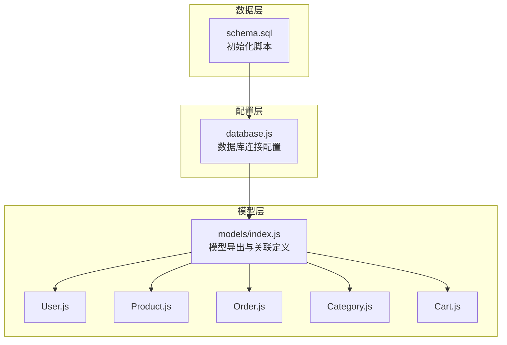
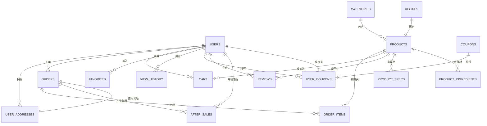
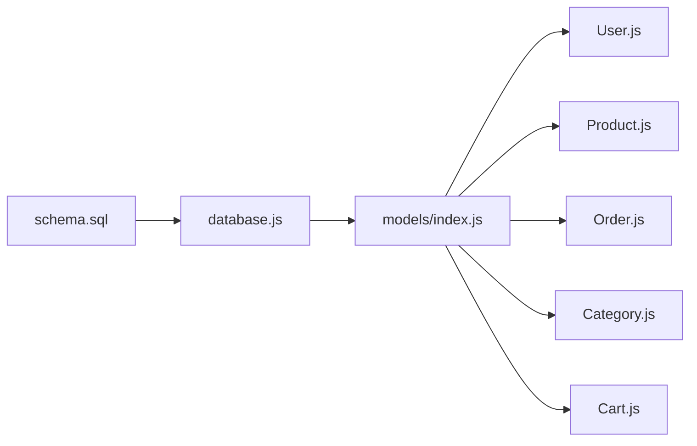

# 数据库架构设计

<cite>
**本文引用的文件**
- [backend/src/config/database.js](file://backend/src/config/database.js)
- [backend/src/models/index.js](file://backend/src/models/index.js)
- [database/schema.sql](file://database/schema.sql)
- [backend/src/models/User.js](file://backend/src/models/User.js)
- [backend/src/models/Product.js](file://backend/src/models/Product.js)
- [backend/src/models/Order.js](file://backend/src/models/Order.js)
- [backend/src/models/Category.js](file://backend/src/models/Category.js)
- [backend/src/models/Cart.js](file://backend/src/models/Cart.js)
</cite>

## 目录
1. [简介](#简介)
2. [项目结构](#项目结构)
3. [核心组件](#核心组件)
4. [架构总览](#架构总览)
5. [详细组件分析](#详细组件分析)
6. [依赖分析](#依赖分析)
7. [性能考虑](#性能考虑)
8. [故障排查指南](#故障排查指南)
9. [结论](#结论)
10. [附录](#附录)

## 简介
本文件为“趣配鲜”项目的数据库架构设计文档，面向开发与运维人员，系统性阐述数据库设计原则、ER 关系模型、Sequelize ORM 的配置与使用、核心数据模型（User、Product、Order 等）的字段与约束、连接池与事务策略、索引与查询优化、迁移与版本管理、数据完整性与业务规则、以及备份恢复与监控方案。文档以仓库现有代码与 SQL 初始化脚本为依据，确保可追溯与可落地。

## 项目结构
后端采用 Node.js + Sequelize 架构，数据库配置集中于统一入口，模型定义按功能域拆分，模型间通过外键与关联方法建立关系；数据库初始化脚本位于 database/schema.sql，覆盖主要业务表及索引、约束。

图表来源
- [backend/src/config/database.js:1-56](file://backend/src/config/database.js#L1-L56)
- [backend/src/models/index.js:1-92](file://backend/src/models/index.js#L1-L92)
- [database/schema.sql:1-862](file://database/schema.sql#L1-L862)

章节来源
- [backend/src/config/database.js:1-56](file://backend/src/config/database.js#L1-L56)
- [backend/src/models/index.js:1-92](file://backend/src/models/index.js#L1-L92)
- [database/schema.sql:1-862](file://database/schema.sql#L1-L862)

## 核心组件
- 数据库连接配置：支持 SQLite 与 MySQL 双栈，统一通过环境变量切换；MySQL 默认启用连接池与 UTC+8 时区；所有模型统一使用下划线命名与时间戳字段名。
- 模型与关联：在 models/index.js 中集中定义模型间一对多/多对一/一对一关系，并通过外键约束与级联策略保障数据一致性。
- 初始化脚本：schema.sql 提供完整的建表、索引、外键与注释，覆盖用户、商品、订单、促销、售后、管理与配置等核心域。

章节来源
- [backend/src/config/database.js:1-56](file://backend/src/config/database.js#L1-L56)
- [backend/src/models/index.js:27-67](file://backend/src/models/index.js#L27-L67)
- [database/schema.sql:14-136](file://database/schema.sql#L14-L136)

## 架构总览
数据库层采用关系型设计，围绕“用户—订单—商品”主线构建 ER 模型，辅以分类、购物车、优惠券、售后、公告、Banner、配置等支撑域。Sequelize 在应用层负责 ORM 映射、关联查询与事务控制。

图表来源
- [backend/src/models/index.js:27-67](file://backend/src/models/index.js#L27-L67)
- [database/schema.sql:14-136](file://database/schema.sql#L14-L136)

## 详细组件分析

### 数据库连接与 ORM 配置
- 连接类型：支持 sqlite 与 mysql，sqlite 用于本地开发；mysql 用于生产，设置字符集 utf8mb4、时区 +08:00、日志开关受 NODE_ENV 控制。
- 连接池：最大 20、最小 5、获取超时 60s、空闲回收 10s，适合中小规模并发。
- ORM 行为：统一开启 timestamps、createdAt/updatedAt/ deletedAt 字段名、下划线命名、冻结表名，便于与 SQL 脚本保持一致。

章节来源
- [backend/src/config/database.js:10-53](file://backend/src/config/database.js#L10-L53)

### 核心数据模型设计

#### 用户模型 User
- 设计要点：支持微信 openid/unionid、手机号加密存储、邮箱、实名与身份证、会员等级与到期时间、积分与余额、黑名单标记、标签 JSON、登录时间与 IP、软删除。
- 安全增强：ORM 钩子自动对明文密码进行 bcrypt 加盐哈希；提供 comparePassword 实例方法。
- 约束与索引：phone、openid、member_level、status 等常用过滤字段建立索引；deleted_at 支持软删除。

章节来源
- [backend/src/models/User.js:5-129](file://backend/src/models/User.js#L5-L129)
- [database/schema.sql:16-44](file://database/schema.sql#L16-L44)

#### 商品模型 Product
- 设计要点：分类外键、名称副标题、主图轮播、视频、描述、价格与会员价、库存与类型、销量、评分与评价数、适用人数/烹饪时长/难度、标签 JSON、产地/保质期/存储条件、配料表/生产者信息、是否上下架/新品/热销/推荐、排序。
- 约束与索引：category_id、is_on_sale、is_new、is_hot、sales、sort_order 等建立索引；外键限制为 RESTRICT，避免误删。

章节来源
- [backend/src/models/Product.js:4-187](file://backend/src/models/Product.js#L4-L187)
- [database/schema.sql:93-136](file://database/schema.sql#L93-L136)

#### 订单模型 Order
- 设计要点：唯一订单号、用户与地址外键、总额/优惠/运费/实付、积分使用与获取、优惠券、配送方式/时间/备注、支付方式/时间/第三方交易号、发票信息、状态机、各节点时间戳、管理员备注。
- 约束与索引：order_no 唯一；user_id/address_id/status/created_at 建立索引；外键限制策略体现业务约束。

章节来源
- [backend/src/models/Order.js:4-157](file://backend/src/models/Order.js#L4-L157)
- [database/schema.sql:228-265](file://database/schema.sql#L228-L265)

#### 分类模型 Category
- 设计要点：父子分类、名称、图标/图片、描述、排序、状态。
- 约束与索引：parent_id、status、sort_order 建立索引。

章节来源
- [backend/src/models/Category.js:4-53](file://backend/src/models/Category.js#L4-L53)
- [database/schema.sql:74-88](file://database/schema.sql#L74-L88)

#### 购物车模型 Cart
- 设计要点：用户-商品-规格组合、数量、选中状态、忌口备注。
- 约束与索引：user_id/product_id 建立索引；外键级联删除保证数据整洁。

章节来源
- [backend/src/models/Cart.js:4-47](file://backend/src/models/Cart.js#L4-L47)
- [database/schema.sql:209-223](file://database/schema.sql#L209-L223)

### Sequelize 关系映射与查询优化
- 关系映射：在 models/index.js 中集中声明外键与别名，如 User-UserAddress、User-Order、Category-Product、Order-OrderItem、User-Cart、Product-Review、Order-AfterSale 等，形成清晰的一对多/一对一链路。
- 查询优化建议：
  - 使用 include 预加载关联，避免 N+1 查询。
  - 对高频过滤字段（如 user_id、order_no、status、category_id）建立复合索引。
  - 对时间范围查询（created_at、pay_time）使用范围索引。
  - 对 JSON 字段检索谨慎使用，必要时考虑 denormalized 辅助列或全文索引（视数据库版本）。

章节来源
- [backend/src/models/index.js:27-67](file://backend/src/models/index.js#L27-L67)

### 数据完整性与业务规则
- 外键与级联：
  - 用户地址、购物车、用户优惠券、评价、售后、签到记录、积分兑换记录等均对 users 做 CASCADE 删除，保障用户删除时清理其附属数据。
  - 商品、订单项、售后、评价等对 orders 做 CASCADE 或 RESTRICT，防止悬挂引用。
- 约束与唯一性：
  - 订单号唯一（order_no）。
  - 收藏与浏览记录对 (user_id, type, target_id) 建立唯一索引，避免重复记录。
  - 用户名唯一（admins.username）。
- 业务状态机：
  - 订单状态枚举覆盖待付款至售后完结全流程，配合各节点时间戳字段，便于审计与报表。

章节来源
- [database/schema.sql:228-265](file://database/schema.sql#L228-L265)
- [database/schema.sql:339-348](file://database/schema.sql#L339-L348)
- [database/schema.sql:353-364](file://database/schema.sql#L353-L364)
- [database/schema.sql:677-694](file://database/schema.sql#L677-L694)

### 索引设计原则与查询性能优化
- 原则：
  - 主键与唯一键自动建立索引；对高频过滤、排序、连接字段建立索引。
  - 复合索引优先覆盖最左前缀匹配与等值过滤。
  - 时间字段建立范围扫描友好索引，避免函数包裹导致失效。
- 典型索引：
  - 用户：idx_phone、idx_openid、idx_member_level、idx_status。
  - 商品：idx_category_id、idx_is_on_sale、idx_is_new、idx_is_hot、idx_sales、idx_sort_order。
  - 订单：idx_order_no、idx_user_id、idx_status、idx_created_at。
  - 优惠券：idx_type、idx_is_active、idx_start_end_time。
  - 收藏/浏览：联合唯一索引 uk_user_type_target。
  - 管理员：idx_username、idx_role、idx_status。
- 优化建议：
  - EXPLAIN 分析慢查询，关注回表与排序。
  - 合理拆分大表与分区（视数据库版本），对历史数据归档。
  - 使用只读副本承载报表与离线任务。

章节来源
- [database/schema.sql:40-43](file://database/schema.sql#L40-L43)
- [database/schema.sql:129-135](file://database/schema.sql#L129-L135)
- [database/schema.sql:259-264](file://database/schema.sql#L259-L264)
- [database/schema.sql:312-315](file://database/schema.sql#L312-L315)
- [database/schema.sql:345-347](file://database/schema.sql#L345-L347)
- [database/schema.sql:361-363](file://database/schema.sql#L361-L363)
- [database/schema.sql:691-693](file://database/schema.sql#L691-L693)

### 数据迁移策略与版本管理
- 迁移方式：当前采用初始化脚本 schema.sql 一次性建表，适用于中小型项目快速上线。
- 版本管理建议：
  - 引入数据库迁移工具（如 db-migrate、Umzug），将每次结构变更封装为迁移文件，记录迁移版本与执行时间。
  - 对生产迁移先在测试环境验证，再灰度发布。
  - 保留回滚脚本，确保异常可逆。
- 当前脚本优势：结构清晰、注释完整、索引与约束明确，便于后续迁移工具解析与比对。

章节来源
- [database/schema.sql:1-862](file://database/schema.sql#L1-L862)

### 数据库连接池、事务与并发控制
- 连接池：MySQL 默认池大小 20/5，获取超时 60s，空闲 10s，满足一般并发需求；可根据 QPS 与慢查询比例调整。
- 事务：
  - 使用 Sequelize transaction 包裹订单创建、支付回调、库存扣减、积分与余额变动等强一致性流程。
  - 对高并发写入场景，采用乐观锁（版本号）或悲观锁（SELECT ... FOR UPDATE）控制资源竞争。
- 并发控制：
  - 对库存扣减、积分与余额变动采用原子操作与事务边界保护。
  - 对热点数据引入缓存（Redis）与最终一致性策略，降低数据库压力。

章节来源
- [backend/src/config/database.js:38-43](file://backend/src/config/database.js#L38-L43)

### 备份恢复与监控
- 备份策略：
  - 全量备份：每周一次，保留 4 份；增量备份：每日一次，保留 7 天。
  - 备份文件记录备份名称、类型、路径、大小、状态与错误信息，便于追踪。
- 恢复流程：
  - 指定时间点恢复（PITR）需启用二进制日志；无日志时采用全量+增量合并。
  - 恢复前校验备份完整性与版本兼容性。
- 监控指标：
  - 连接数、活跃会话、慢查询、锁等待、缓冲池命中率、磁盘 IO、复制延迟（主从）。
  - 告警阈值：连接数接近上限、慢查询占比超 5%、锁等待超时、备份失败。

章节来源
- [database/schema.sql:787-798](file://database/schema.sql#L787-L798)

## 依赖分析
- 组件耦合：
  - models/index.js 作为中心枢纽，集中导入与定义模型关系，降低控制器与服务层对具体外键的感知。
  - User、Product、Order 为核心实体，被多个领域模型依赖（如 Cart、OrderItem、Review、AfterSale）。
- 外部依赖：
  - Sequelize 作为 ORM；bcryptjs 用于密码安全；dotenv 用于环境变量加载。
- 潜在风险：
  - 若未来模型数量增长，需拆分 models/index.js 的关系定义，避免单文件膨胀。
  - 外键级联策略需与业务规则保持一致，避免误删或悬挂数据。

图表来源
- [backend/src/config/database.js:1-56](file://backend/src/config/database.js#L1-L56)
- [backend/src/models/index.js:1-92](file://backend/src/models/index.js#L1-L92)
- [database/schema.sql:1-862](file://database/schema.sql#L1-L862)

章节来源
- [backend/src/models/index.js:1-92](file://backend/src/models/index.js#L1-L92)

## 性能考虑
- 写入优化：
  - 批量插入与更新，减少往返；对库存与积分采用原子自增/自减。
  - 事务粒度适中，避免长时间持有行锁。
- 读取优化：
  - 使用索引覆盖查询，避免回表；对复杂报表使用物化视图或宽表。
  - 对 JSON 字段检索谨慎使用，必要时冗余辅助列。
- 存储与归档：
  - 历史订单与日志定期归档至冷存储；压缩与分片提升查询效率。

## 故障排查指南
- 连接问题：
  - 检查 .env 中 DB_CONNECTION、DB_HOST、DB_PORT、DB_NAME、DB_USER、DB_PASSWORD 是否正确。
  - 开发环境下确认 logging 输出，定位 SQL 语法或参数绑定问题。
- 外键冲突：
  - 插入前确认关联对象存在且状态有效；对 RESTRICT 外键，先创建主表记录再创建子表。
- 锁与死锁：
  - 识别热点行，调整索引与事务顺序；必要时降级为读写分离。
- 密码与安全：
  - 确认 User 模型钩子已生效，避免明文存储；对敏感字段（手机号）脱敏与加密。

章节来源
- [backend/src/config/database.js:5](file://backend/src/config/database.js#L5)
- [backend/src/models/User.js:131-147](file://backend/src/models/User.js#L131-L147)

## 结论
本数据库架构以清晰的 ER 模型与严格的外键约束为基础，结合 Sequelize 的关系映射与连接池配置，满足“趣配鲜”电商场景的核心需求。通过合理的索引设计与查询优化、完善的迁移与备份策略，以及对事务与并发控制的重视，可在保证数据一致性的同时兼顾性能与可维护性。建议在后续演进中引入数据库迁移工具与更细粒度的关系拆分，持续优化热点路径与容量规划。

## 附录
- 初始化脚本：database/schema.sql 提供完整建表与约束定义，建议作为迁移基线。
- 模型导出：backend/src/models/index.js 统一导出所有模型与关系，便于应用层按需引用。