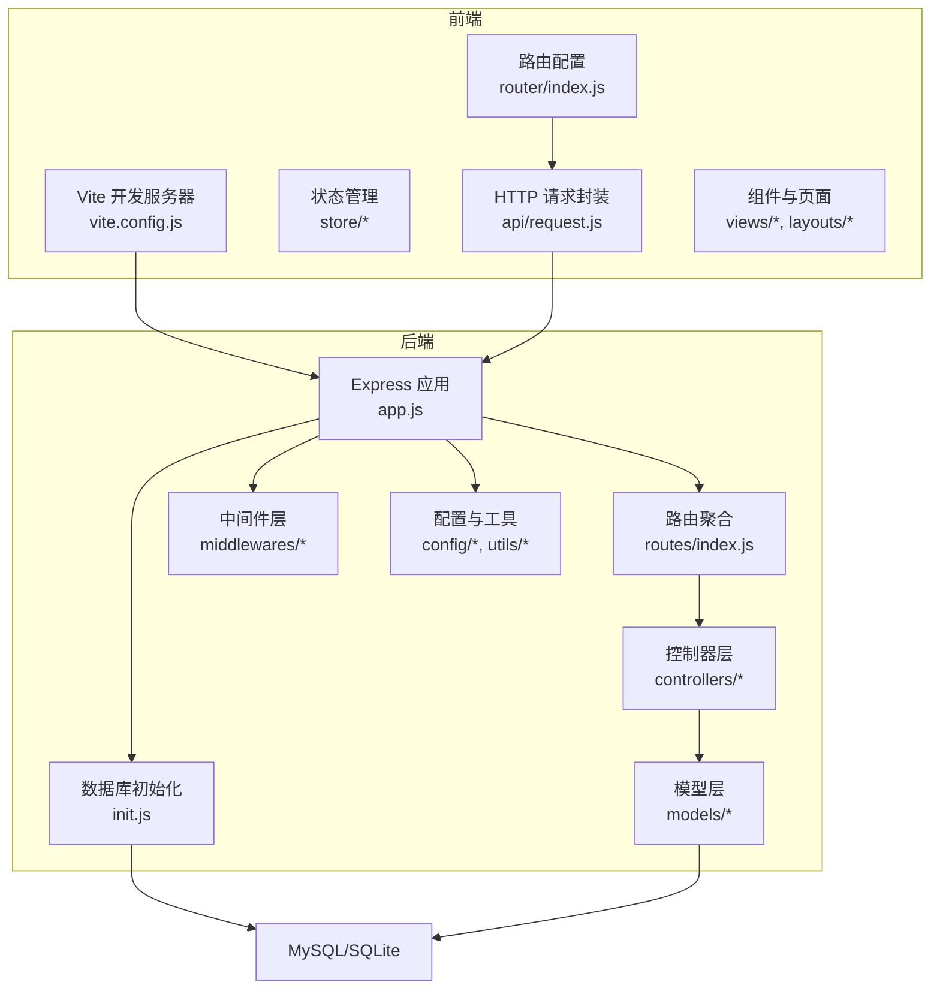
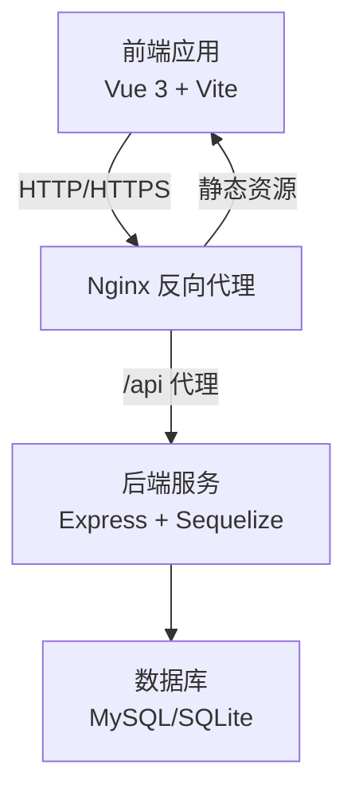
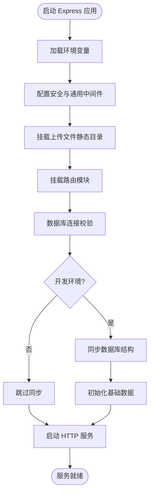
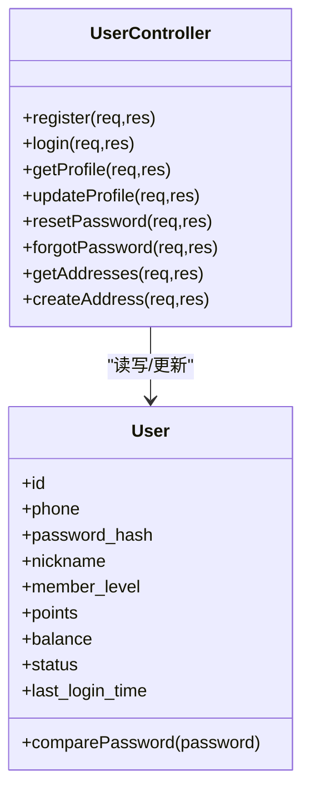
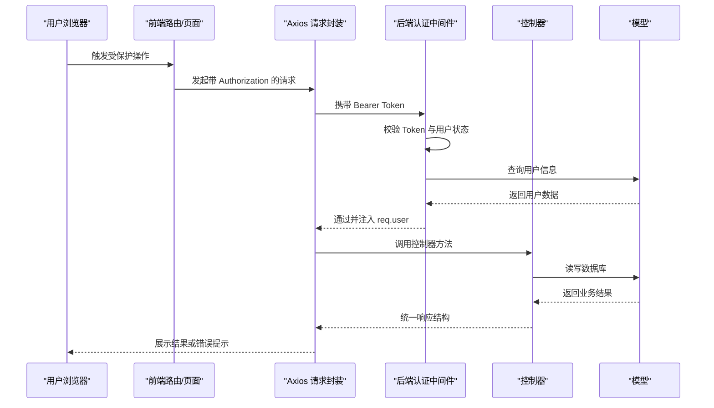
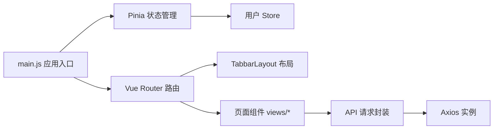
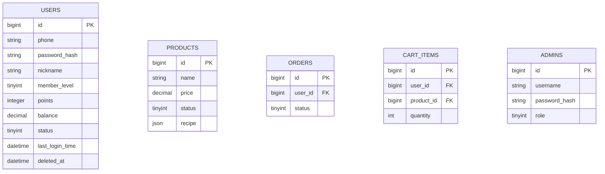
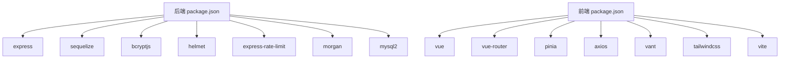

# 整体架构概览

<cite>
**本文引用的文件**
- [backend/src/app.js](file://backend/src/app.js)
- [backend/src/init.js](file://backend/src/init.js)
- [backend/package.json](file://backend/package.json)
- [frontend/package.json](file://frontend/package.json)
- [README.md](file://README.md)
- [backend/src/routes/index.js](file://backend/src/routes/index.js)
- [frontend/src/router/index.js](file://frontend/src/router/index.js)
- [backend/src/config/database.js](file://backend/src/config/database.js)
- [backend/src/middlewares/auth.js](file://backend/src/middlewares/auth.js)
- [frontend/src/store/user.js](file://frontend/src/store/user.js)
- [frontend/src/api/request.js](file://frontend/src/api/request.js)
- [backend/src/controllers/userController.js](file://backend/src/controllers/userController.js)
- [backend/src/models/User.js](file://backend/src/models/User.js)
- [backend/src/config/constants.js](file://backend/src/config/constants.js)
- [frontend/vite.config.js](file://frontend/vite.config.js)
- [backend/src/utils/security.js](file://backend/src/utils/security.js)
- [frontend/tailwind.config.js](file://frontend/tailwind.config.js)
</cite>

## 目录
1. [引言](#引言)
2. [项目结构](#项目结构)
3. [核心组件](#核心组件)
4. [架构总览](#架构总览)
5. [详细组件分析](#详细组件分析)
6. [依赖分析](#依赖分析)
7. [性能考量](#性能考量)
8. [故障排查指南](#故障排查指南)
9. [结论](#结论)
10. [附录](#附录)

## 引言
本项目“趣配鲜”是一个面向食谱净菜配送的电商平台，提供「预处理净菜+定量调料+烹饪教程」的一站式解决方案。系统采用前后端分离架构，后端基于 Node.js + Express，前端基于 Vue 3 + Vite，数据库采用 MySQL（支持 SQLite），并通过 Sequelize 实现 ORM 映射。系统遵循 MVC 架构模式，后端以控制器（Controller）处理业务逻辑，中间件（Middleware）统一处理安全与异常，前端以组件化开发配合 Pinia 状态管理与 Vue Router 路由管理。

## 项目结构
项目分为三个主要部分：
- 后端服务（backend）：Express 应用、路由、控制器、模型、中间件、配置与初始化脚本
- 前端应用（frontend）：Vue 3 应用、路由、状态管理（Pinia）、API 封装、UI 组件与样式
- 数据库脚本（database）：初始化 SQL 脚本
- 文档（docs）：API 文档与部署指南

图表来源
- [backend/src/app.js:1-84](file://backend/src/app.js#L1-L84)
- [backend/src/routes/index.js:1-27](file://backend/src/routes/index.js#L1-L27)
- [frontend/vite.config.js:1-26](file://frontend/vite.config.js#L1-L26)
- [backend/src/init.js:1-502](file://backend/src/init.js#L1-L502)

章节来源
- [README.md:46-83](file://README.md#L46-L83)
- [backend/src/app.js:1-84](file://backend/src/app.js#L1-L84)
- [frontend/vite.config.js:1-26](file://frontend/vite.config.js#L1-L26)

## 核心组件
- 后端 Express 应用：集中配置中间件、静态资源、路由挂载、数据库连接与启动流程
- 路由聚合：按模块拆分路由并统一挂载，提供健康检查接口
- 控制器：封装用户、商品、订单、购物车、营销等业务接口
- 模型与 ORM：基于 Sequelize 的数据模型定义与钩子处理
- 中间件：认证鉴权、可选认证、错误处理与全局安全中间件
- 前端应用：Vue 3 + Vite，路由守卫、Pinia 状态管理、Axios 封装与 UI 组件库
- 数据库：MySQL/SQLite 双环境支持，开发环境自动同步与初始化

章节来源
- [backend/src/app.js:1-84](file://backend/src/app.js#L1-L84)
- [backend/src/routes/index.js:1-27](file://backend/src/routes/index.js#L1-L27)
- [backend/src/controllers/userController.js:1-200](file://backend/src/controllers/userController.js#L1-L200)
- [backend/src/models/User.js:1-150](file://backend/src/models/User.js#L1-L150)
- [backend/src/middlewares/auth.js:1-181](file://backend/src/middlewares/auth.js#L1-L181)
- [frontend/src/router/index.js:1-192](file://frontend/src/router/index.js#L1-L192)
- [frontend/src/store/user.js:1-96](file://frontend/src/store/user.js#L1-L96)
- [frontend/src/api/request.js:1-111](file://frontend/src/api/request.js#L1-L111)
- [backend/src/config/database.js:1-56](file://backend/src/config/database.js#L1-L56)
- [backend/src/init.js:1-502](file://backend/src/init.js#L1-L502)

## 架构总览
系统采用前后端分离设计，前端通过 Axios 发起请求，后端通过 Express 提供 RESTful API。认证采用 JWT，密码使用 bcrypt 加密，数据库通过 Sequelize 进行访问。开发阶段前端通过 Vite 代理到后端端口，生产环境通过 Nginx 反向代理将静态资源与 API 请求分别指向前端构建目录与后端服务。

图表来源
- [frontend/vite.config.js:12-20](file://frontend/vite.config.js#L12-L20)
- [README.md:159-177](file://README.md#L159-L177)
- [backend/src/config/database.js:24-53](file://backend/src/config/database.js#L24-L53)

## 详细组件分析

### 后端 Express 核心配置
- 中间件体系：Helmet、CORS、XSS 清理、Mongo 注入清理、速率限制、 Morgan 日志、静态资源托管
- 路由分发：统一 API 前缀，按模块挂载路由，提供健康检查
- 启动流程：数据库连接与同步、开发环境数据初始化、监听端口

图表来源
- [backend/src/app.js:19-79](file://backend/src/app.js#L19-L79)
- [backend/src/init.js:5-491](file://backend/src/init.js#L5-L491)

章节来源
- [backend/src/app.js:1-84](file://backend/src/app.js#L1-L84)
- [backend/src/init.js:1-502](file://backend/src/init.js#L1-L502)

### 路由与控制器（MVC）
- 路由聚合：统一挂载 home、users、products、cart、orders、admin 等模块路由
- 控制器职责：用户注册/登录/资料、地址管理、订单流程、商品与营销相关接口
- 模型定义：User 等核心实体字段与钩子（密码哈希、软删除）

图表来源
- [backend/src/controllers/userController.js:1-200](file://backend/src/controllers/userController.js#L1-L200)
- [backend/src/models/User.js:1-150](file://backend/src/models/User.js#L1-L150)

章节来源
- [backend/src/routes/index.js:1-27](file://backend/src/routes/index.js#L1-L27)
- [backend/src/controllers/userController.js:1-200](file://backend/src/controllers/userController.js#L1-L200)
- [backend/src/models/User.js:1-150](file://backend/src/models/User.js#L1-L150)

### 认证与安全
- 前端：Axios 请求拦截器自动附加 Bearer Token，响应拦截器统一处理 401/403 与错误提示
- 后端：JWT 解析与校验，用户状态校验，可选认证中间件，安全工具函数（加密/脱敏）
- 数据库：bcrypt 密码哈希钩子，软删除支持

图表来源
- [frontend/src/api/request.js:29-109](file://frontend/src/api/request.js#L29-L109)
- [backend/src/middlewares/auth.js:4-148](file://backend/src/middlewares/auth.js#L4-L148)
- [backend/src/controllers/userController.js:95-110](file://backend/src/controllers/userController.js#L95-L110)
- [backend/src/models/User.js:131-147](file://backend/src/models/User.js#L131-L147)

章节来源
- [frontend/src/api/request.js:1-111](file://frontend/src/api/request.js#L1-L111)
- [backend/src/middlewares/auth.js:1-181](file://backend/src/middlewares/auth.js#L1-L181)
- [backend/src/utils/security.js:1-48](file://backend/src/utils/security.js#L1-L48)
- [backend/src/models/User.js:1-150](file://backend/src/models/User.js#L1-L150)

### 前端架构（组件化、状态管理与路由）
- 组件化开发：页面组件与布局组件分离，使用 Vant 移动端 UI 组件库
- 状态管理：Pinia Store 管理用户会话（token、用户信息），支持持久化
- 路由配置：Tabbar 布局与多级嵌套路由，路由守卫控制访问权限与标题设置
- 开发代理：Vite 将 /api 代理到后端端口，便于联调

图表来源
- [frontend/src/main.js:1-56](file://frontend/src/main.js#L1-L56)
- [frontend/src/store/user.js:1-96](file://frontend/src/store/user.js#L1-L96)
- [frontend/src/router/index.js:1-192](file://frontend/src/router/index.js#L1-L192)
- [frontend/src/api/request.js:1-111](file://frontend/src/api/request.js#L1-L111)
- [frontend/vite.config.js:12-20](file://frontend/vite.config.js#L12-L20)

章节来源
- [frontend/src/main.js:1-56](file://frontend/src/main.js#L1-L56)
- [frontend/src/store/user.js:1-96](file://frontend/src/store/user.js#L1-L96)
- [frontend/src/router/index.js:1-192](file://frontend/src/router/index.js#L1-L192)
- [frontend/vite.config.js:1-26](file://frontend/vite.config.js#L1-L26)

### 数据库设计与初始化
- 数据库配置：支持 MySQL 与 SQLite，开发环境自动同步与初始化
- 模型定义：User 等核心实体，含软删除、时间戳与密码哈希钩子
- 初始化脚本：创建管理员、测试用户、分类、商品、食谱、Banner、公告、资质与协议等

图表来源
- [backend/src/models/User.js:5-129](file://backend/src/models/User.js#L5-L129)
- [backend/src/config/database.js:10-53](file://backend/src/config/database.js#L10-L53)
- [backend/src/init.js:17-491](file://backend/src/init.js#L17-L491)

章节来源
- [backend/src/config/database.js:1-56](file://backend/src/config/database.js#L1-L56)
- [backend/src/models/User.js:1-150](file://backend/src/models/User.js#L1-L150)
- [backend/src/init.js:1-502](file://backend/src/init.js#L1-L502)

### API 设计规范与安全架构
- API 设计：统一响应结构（success、data、message、pagination），错误码与消息标准化
- 安全措施：Helmet、CORS、XSS 清理、Mongo 注入清理、速率限制、JWT、bcrypt、敏感信息脱敏
- 前端安全：Token 自动附加、401 自动跳转登录、错误提示统一处理

章节来源
- [frontend/src/api/request.js:50-109](file://frontend/src/api/request.js#L50-L109)
- [backend/src/app.js:19-45](file://backend/src/app.js#L19-L45)
- [backend/src/middlewares/auth.js:1-181](file://backend/src/middlewares/auth.js#L1-L181)
- [backend/src/utils/security.js:1-48](file://backend/src/utils/security.js#L1-L48)

## 依赖分析
- 后端依赖：Express、Sequelize、bcryptjs、helmet、cors、express-rate-limit、morgan、winston、mysql2、redis、xlsx、xss-clean 等
- 前端依赖：Vue 3、Vue Router、Pinia、Axios、Vant、TailwindCSS、Vite 等
- 开发与构建：Vite 插件、PostCSS、TailwindCSS 配置

图表来源
- [backend/package.json:18-39](file://backend/package.json#L18-L39)
- [frontend/package.json:10-24](file://frontend/package.json#L10-L24)

章节来源
- [backend/package.json:1-50](file://backend/package.json#L1-L50)
- [frontend/package.json:1-26](file://frontend/package.json#L1-L26)

## 性能考量
- 传输与序列化：Express 限制请求体大小，避免过大负载
- 速率限制：全局速率限制降低恶意请求与滥用风险
- 数据库连接池：MySQL 连接池参数可调，平衡并发与资源占用
- 前端构建：关闭 SourceMap，减少体积与调试成本
- 缓存与静态资源：生产环境建议启用缓存与 CDN

章节来源
- [backend/src/app.js:26-39](file://backend/src/app.js#L26-L39)
- [backend/src/config/database.js:38-43](file://backend/src/config/database.js#L38-L43)
- [frontend/vite.config.js:21-24](file://frontend/vite.config.js#L21-L24)

## 故障排查指南
- 登录/鉴权失败：检查 Authorization 头、Token 是否过期或无效、用户状态是否被禁用
- 数据库连接问题：确认 DB_HOST/DB_PORT/DB_NAME/DB_USER/DB_PASSWORD 环境变量，开发环境可查看同步日志
- 前端无法访问后端：确认 Vite 代理配置与后端 API 前缀一致
- 401/403 错误：前端会自动清除本地 Token 并跳转登录页，检查后端中间件与用户状态

章节来源
- [frontend/src/api/request.js:70-98](file://frontend/src/api/request.js#L70-L98)
- [backend/src/middlewares/auth.js:4-148](file://backend/src/middlewares/auth.js#L4-L148)
- [backend/src/config/database.js:5-53](file://backend/src/config/database.js#L5-L53)
- [frontend/vite.config.js:14-19](file://frontend/vite.config.js#L14-L19)

## 结论
本项目采用成熟的前后端分离架构，后端以 Express + Sequelize 构建 RESTful API，前端以 Vue 3 + Vite 实现组件化与状态管理，结合 JWT 认证与 bcrypt 密码加密，满足食品电商的合规与安全需求。模块划分清晰，MVC 模式明确，具备良好的可扩展性与可维护性。建议在生产环境中进一步完善缓存策略、监控与日志体系，并持续优化数据库索引与查询性能。

## 附录
- 技术栈与版本要求：后端 Node.js >= 18，前端 Vue 3 + Vite，数据库 MySQL >= 8.0
- 部署建议：Nginx 反向代理、SSL 证书、PM2 进程守护
- 样式与主题：TailwindCSS 主题色与字体配置

章节来源
- [README.md:85-90](file://README.md#L85-L90)
- [README.md:144-184](file://README.md#L144-L184)
- [frontend/tailwind.config.js:1-24](file://frontend/tailwind.config.js#L1-L24)