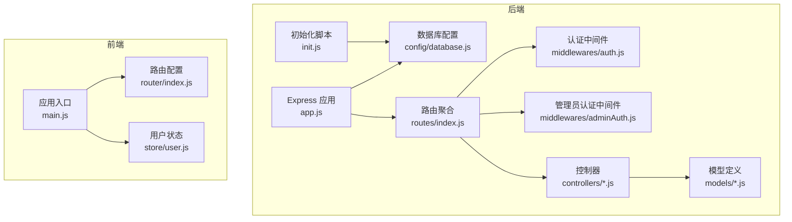
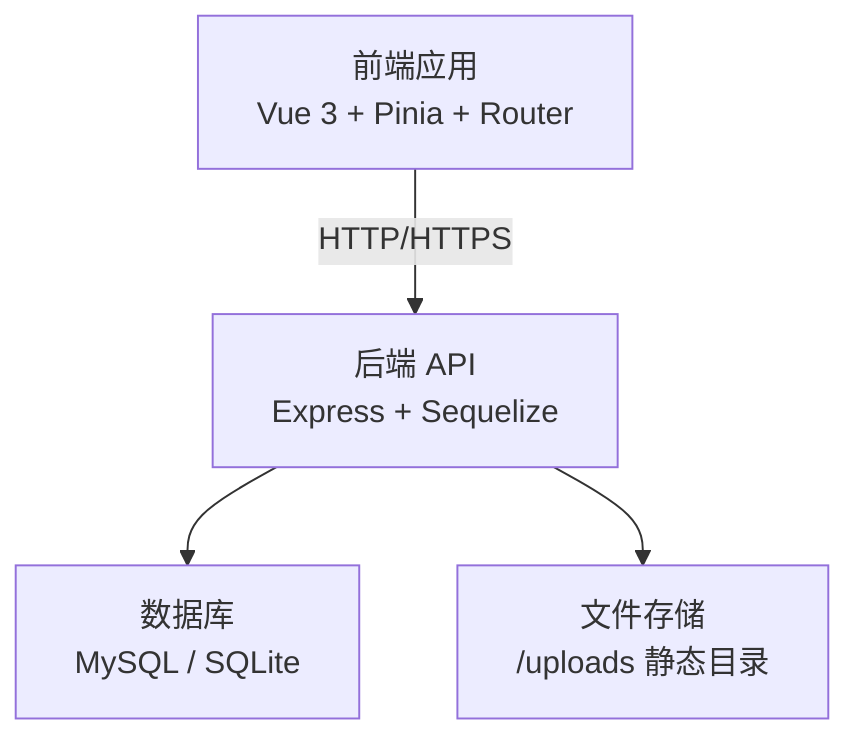
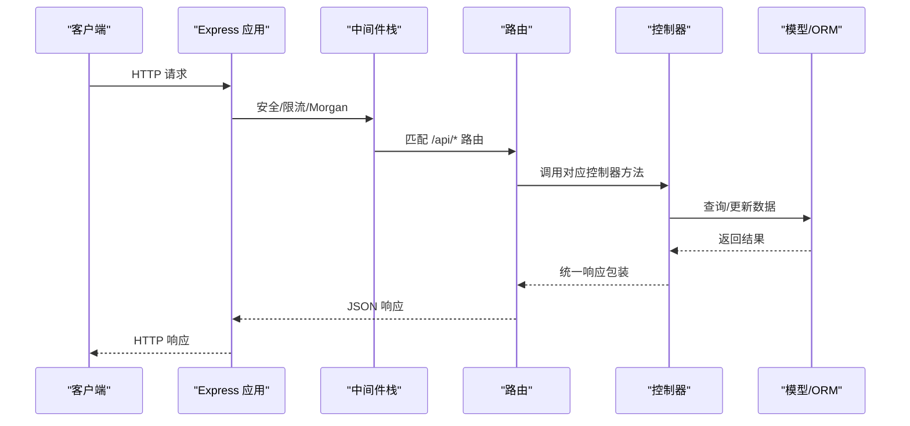
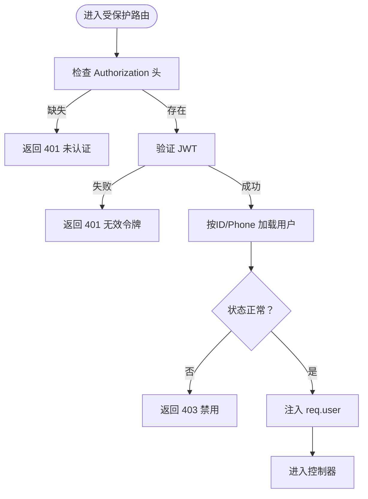
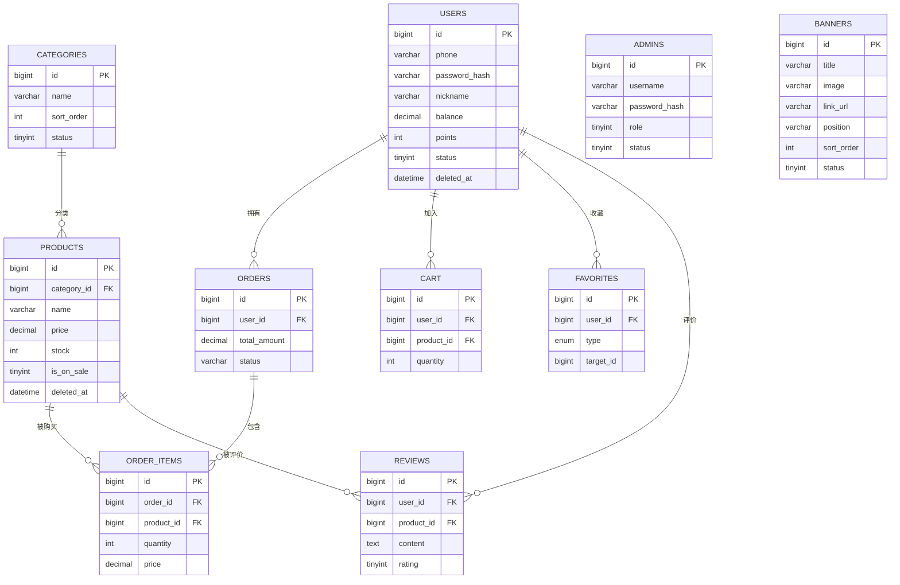
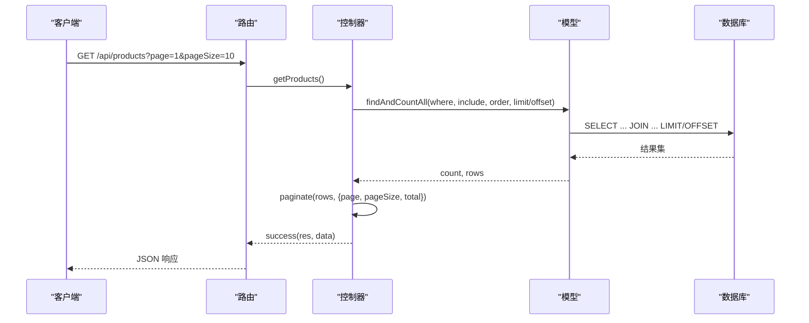
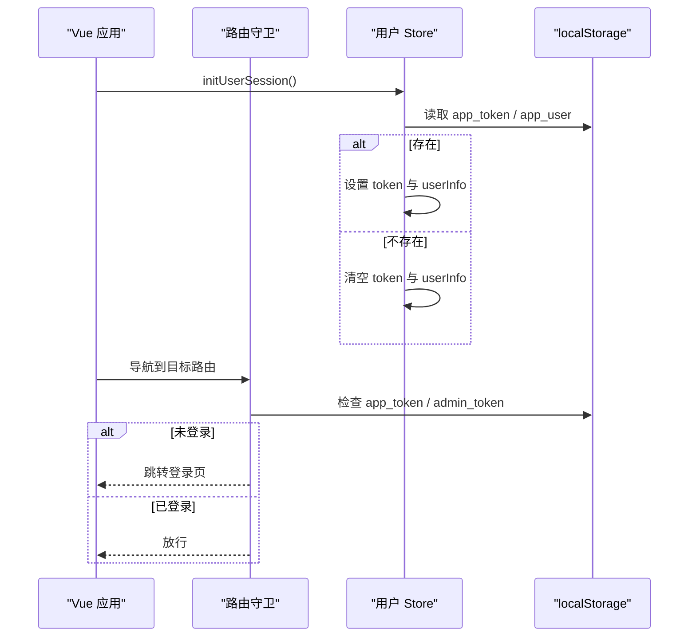
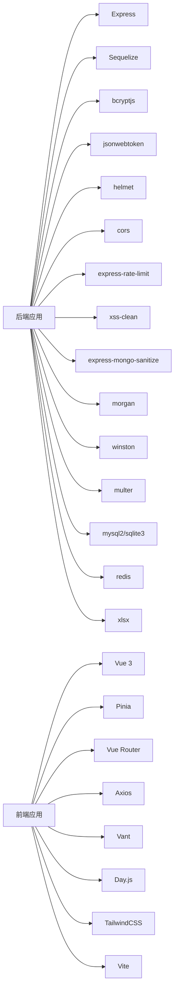

# 架构设计

<cite>
**本文引用的文件**
- [backend/src/app.js](file://backend/src/app.js)
- [backend/src/init.js](file://backend/src/init.js)
- [backend/src/routes/index.js](file://backend/src/routes/index.js)
- [backend/src/config/database.js](file://backend/src/config/database.js)
- [backend/src/middlewares/auth.js](file://backend/src/middlewares/auth.js)
- [backend/src/middlewares/adminAuth.js](file://backend/src/middlewares/adminAuth.js)
- [backend/src/models/User.js](file://backend/src/models/User.js)
- [backend/src/models/Product.js](file://backend/src/models/Product.js)
- [backend/src/controllers/userController.js](file://backend/src/controllers/userController.js)
- [backend/src/controllers/productController.js](file://backend/src/controllers/productController.js)
- [backend/package.json](file://backend/package.json)
- [frontend/src/main.js](file://frontend/src/main.js)
- [frontend/src/router/index.js](file://frontend/src/router/index.js)
- [frontend/src/store/user.js](file://frontend/src/store/user.js)
- [frontend/package.json](file://frontend/package.json)
- [database/schema.sql](file://database/schema.sql)
- [docs/api.md](file://docs/api.md)
- [docs/deploy.md](file://docs/deploy.md)
</cite>

## 目录
1. [简介](#简介)
2. [项目结构](#项目结构)
3. [核心组件](#核心组件)
4. [架构总览](#架构总览)
5. [详细组件分析](#详细组件分析)
6. [依赖分析](#依赖分析)
7. [性能考虑](#性能考虑)
8. [故障排查指南](#故障排查指南)
9. [结论](#结论)
10. [附录](#附录)

## 简介
本项目为“趣配鲜”生鲜预处理食材电商系统，采用前后端分离架构：后端基于 Express.js 提供 RESTful API，使用 Sequelize ORM 连接 MySQL 或 SQLite；前端基于 Vue 3 + Pinia + Vue Router 构建移动端 Web 应用，采用 Vant 移动组件库。系统遵循 MVC 模式，后端以路由-控制器-模型为核心层次，前端以组件-状态-路由为核心层次，结合 JWT 认证、密码加密、输入校验与安全中间件，构建安全、可扩展、易维护的电商系统。

## 项目结构
- 后端（backend）
  - 配置与入口：app.js、config/database.js、init.js
  - 路由与中间件：routes/index.js、middlewares/auth.js、middlewares/adminAuth.js
  - 控制器与模型：controllers/*、models/*
  - 工具与安全：utils/security.js、validators/*、config/jwt.js、config/logger.js
- 前端（frontend）
  - 应用入口：main.js
  - 路由与状态：router/index.js、store/user.js、store/cart.js
  - 视图与页面：views/*、admin/views/*、layouts/*
  - API 封装：api/request.js、api/adminRequest.js、api/index.js
- 文档与脚本
  - 接口文档：docs/api.md
  - 部署文档：docs/deploy.md
  - 数据库脚本：database/schema.sql
  - 初始化脚本：scripts/*

**图表来源**
- [backend/src/app.js:1-84](file://backend/src/app.js#L1-L84)
- [backend/src/routes/index.js:1-27](file://backend/src/routes/index.js#L1-L27)
- [backend/src/middlewares/auth.js:1-181](file://backend/src/middlewares/auth.js#L1-L181)
- [backend/src/middlewares/adminAuth.js:1-77](file://backend/src/middlewares/adminAuth.js#L1-L77)
- [backend/src/config/database.js:1-56](file://backend/src/config/database.js#L1-L56)
- [backend/src/controllers/userController.js:1-409](file://backend/src/controllers/userController.js#L1-L409)
- [backend/src/controllers/productController.js:1-527](file://backend/src/controllers/productController.js#L1-L527)
- [backend/src/init.js:1-502](file://backend/src/init.js#L1-L502)
- [frontend/src/main.js:1-56](file://frontend/src/main.js#L1-L56)
- [frontend/src/router/index.js:1-192](file://frontend/src/router/index.js#L1-L192)
- [frontend/src/store/user.js:1-96](file://frontend/src/store/user.js#L1-L96)

**章节来源**
- [backend/src/app.js:1-84](file://backend/src/app.js#L1-L84)
- [backend/src/config/database.js:1-56](file://backend/src/config/database.js#L1-L56)
- [backend/src/init.js:1-502](file://backend/src/init.js#L1-L502)
- [frontend/src/main.js:1-56](file://frontend/src/main.js#L1-L56)

## 核心组件
- 后端核心
  - 应用入口与中间件栈：Helmet、CORS、XSS 清理、MongoDB 注入防护、限流、 Morgan 日志、静态资源、路由挂载
  - 数据库连接：Sequelize 支持 SQLite/MySQL，统一配置与连接池
  - 中间件：通用认证（JWT）、可选认证、管理员认证与角色控制
  - 控制器：用户、商品、购物车、订单、首页、公告、优惠券、Banner、设置等业务控制器
  - 模型：User、Product、Category、Order、Cart、Review、Favorite、ViewHistory 等
- 前端核心
  - 应用入口：创建 Vue 实例、安装 Pinia、Vue Router、Vant 组件库
  - 路由：Tabbar 布局、页面级路由、鉴权守卫（用户/管理员）
  - 状态：Pinia Store（用户会话、购物车），持久化到 localStorage
  - API：封装 axios 请求、统一响应处理、错误拦截

**章节来源**
- [backend/src/app.js:1-84](file://backend/src/app.js#L1-L84)
- [backend/src/middlewares/auth.js:1-181](file://backend/src/middlewares/auth.js#L1-L181)
- [backend/src/middlewares/adminAuth.js:1-77](file://backend/src/middlewares/adminAuth.js#L1-L77)
- [backend/src/config/database.js:1-56](file://backend/src/config/database.js#L1-L56)
- [backend/src/controllers/userController.js:1-409](file://backend/src/controllers/userController.js#L1-L409)
- [backend/src/controllers/productController.js:1-527](file://backend/src/controllers/productController.js#L1-L527)
- [backend/src/models/User.js:1-150](file://backend/src/models/User.js#L1-L150)
- [backend/src/models/Product.js:1-190](file://backend/src/models/Product.js#L1-L190)
- [frontend/src/main.js:1-56](file://frontend/src/main.js#L1-L56)
- [frontend/src/router/index.js:1-192](file://frontend/src/router/index.js#L1-L192)
- [frontend/src/store/user.js:1-96](file://frontend/src/store/user.js#L1-L96)

## 架构总览
系统采用前后端分离，后端提供 RESTful API，前端通过 axios 调用接口，后端通过 JWT 实现用户态管理，管理员后台独立路由与鉴权。数据库通过 Sequelize ORM 抽象，支持开发（SQLite）与生产（MySQL）切换。

**图表来源**
- [backend/src/app.js:47-50](file://backend/src/app.js#L47-L50)
- [backend/src/config/database.js:10-52](file://backend/src/config/database.js#L10-L52)
- [frontend/src/main.js:1-56](file://frontend/src/main.js#L1-L56)

## 详细组件分析

### 后端应用与中间件体系
- 安全与防护
  - Helmet 设置安全头部
  - CORS 允许跨域与凭证
  - XSS 清理、MongoDB 注入清理
  - 速率限制（可配置窗口与最大请求数）
  - Morgan 日志写入统一 logger
- 路由与静态资源
  - API 前缀可配置，默认 /api
  - /uploads 静态文件服务
- 启动流程
  - 数据库连接与同步（开发环境自动同步并初始化）
  - 错误处理中间件（404 与全局错误）

**图表来源**
- [backend/src/app.js:19-53](file://backend/src/app.js#L19-L53)
- [backend/src/routes/index.js:1-27](file://backend/src/routes/index.js#L1-L27)
- [backend/src/controllers/userController.js:1-42](file://backend/src/controllers/userController.js#L1-L42)
- [backend/src/controllers/productController.js:6-42](file://backend/src/controllers/productController.js#L6-L42)

**章节来源**
- [backend/src/app.js:1-84](file://backend/src/app.js#L1-L84)
- [backend/src/routes/index.js:1-27](file://backend/src/routes/index.js#L1-L27)

### 认证与授权（JWT + 中间件）
- 用户认证中间件
  - 解析 Authorization 头，校验 JWT
  - 从 User 表加载用户信息（排除敏感字段）
  - 支持软删除、禁用/黑名单检查
  - 可选认证（不强制失败）
- 管理员认证中间件
  - 校验管理员 JWT，检查状态
  - 角色控制（超级管理员可豁免）
- 密码与安全
  - 用户模型在创建/更新时自动加密密码
  - 登录时比较密码

**图表来源**
- [backend/src/middlewares/auth.js:4-148](file://backend/src/middlewares/auth.js#L4-L148)
- [backend/src/models/User.js:131-147](file://backend/src/models/User.js#L131-L147)

**章节来源**
- [backend/src/middlewares/auth.js:1-181](file://backend/src/middlewares/auth.js#L1-L181)
- [backend/src/middlewares/adminAuth.js:1-77](file://backend/src/middlewares/adminAuth.js#L1-L77)
- [backend/src/models/User.js:1-150](file://backend/src/models/User.js#L1-L150)

### 数据库设计与 ORM（Sequelize）
- 连接配置
  - 支持 SQLite 与 MySQL，开发默认 SQLite，生产默认 MySQL
  - 连接池、时区、字符集、冻结表名、时间戳字段命名
- 关键实体
  - 用户 User：手机号、昵称、头像、余额、积分、状态、黑名单、软删除
  - 商品 Product：分类、价格、库存、销量、评分、标签、上架状态、排序
  - 订单 Order/订单项 OrderItem：关联用户与商品
  - 购物车 Cart、收藏 Favorite、浏览历史 ViewHistory、评论 Review
  - 管理员 Admin、Banner、公告 Notice、优惠券 Coupon、设置 Config
- 设计原则
  - 使用软删除（deleted_at）避免物理删除
  - 时间戳统一 createdAt/updatedAt
  - JSON 字段用于富文本/数组数据
  - 外键约束与索引建议（见性能章节）

**图表来源**
- [backend/src/models/User.js:5-129](file://backend/src/models/User.js#L5-L129)
- [backend/src/models/Product.js:4-187](file://backend/src/models/Product.js#L4-L187)
- [database/schema.sql](file://database/schema.sql)

**章节来源**
- [backend/src/config/database.js:1-56](file://backend/src/config/database.js#L1-L56)
- [backend/src/models/User.js:1-150](file://backend/src/models/User.js#L1-L150)
- [backend/src/models/Product.js:1-190](file://backend/src/models/Product.js#L1-L190)
- [database/schema.sql](file://database/schema.sql)

### API 设计与控制器（MVC）
- 路由分发
  - /api/home、/api/users、/api/products、/api/cart、/api/orders、/api/admin
  - 健康检查 /api/health
- 控制器职责
  - 用户：注册、登录、资料、地址、密码重置
  - 商品：列表、详情、分类、收藏、浏览历史、管理端 CRUD
  - 订单：下单、支付、查询、售后
  - 管理：Banner、公告、优惠券、设置、统计
- 响应规范
  - 成功/错误统一封装工具（success/error/paginate）
  - 分页参数 page/pageSize 默认值与总数计算
- 输入校验与异常处理
  - Sequelize 校验错误、外键约束错误、数据库错误分类处理
  - 控制器内 try/catch + 错误响应

**图表来源**
- [backend/src/routes/index.js:11-16](file://backend/src/routes/index.js#L11-L16)
- [backend/src/controllers/productController.js:6-42](file://backend/src/controllers/productController.js#L6-L42)
- [backend/src/utils/response.js](file://backend/src/utils/response.js)

**章节来源**
- [backend/src/routes/index.js:1-27](file://backend/src/routes/index.js#L1-L27)
- [backend/src/controllers/userController.js:1-409](file://backend/src/controllers/userController.js#L1-L409)
- [backend/src/controllers/productController.js:1-527](file://backend/src/controllers/productController.js#L1-L527)

### 前端架构（组件化 + 状态管理 + 路由）
- 应用入口
  - 创建 Vue 应用、安装 Pinia、Vue Router
  - 初始化用户会话（读取 localStorage）
  - 挂载 Vant 组件库
- 路由与导航
  - Tabbar 布局与子路由
  - 鉴权守卫：用户登录态与管理员登录态
  - 页面标题动态设置
- 状态管理
  - 用户 Store：token、用户信息、登录态计算属性、持久化
  - 购物车 Store：商品数量、总价计算、持久化
- 视图与页面
  - 商品、订单、地址、收藏、优惠券、售后、协议、资质等页面
  - 管理后台页面（产品、订单、用户、设置、统计、食谱、Banner、公告）

**图表来源**
- [frontend/src/main.js:16-18](file://frontend/src/main.js#L16-L18)
- [frontend/src/router/index.js:155-189](file://frontend/src/router/index.js#L155-L189)
- [frontend/src/store/user.js:69-83](file://frontend/src/store/user.js#L69-L83)

**章节来源**
- [frontend/src/main.js:1-56](file://frontend/src/main.js#L1-L56)
- [frontend/src/router/index.js:1-192](file://frontend/src/router/index.js#L1-L192)
- [frontend/src/store/user.js:1-96](file://frontend/src/store/user.js#L1-L96)

### 安全架构设计
- 认证
  - JWT：登录签发、有效期、解析与校验
  - 中间件：强制认证与可选认证
- 密码安全
  - bcrypt 加盐哈希，创建/更新自动处理
- 输入安全
  - XSS 清理、MongoDB 注入清理、速率限制
  - 前端输入校验与后端参数校验
- 权限控制
  - 管理员角色分级、超级管理员豁免
  - 路由级与控制器级权限校验

**章节来源**
- [backend/src/middlewares/auth.js:1-181](file://backend/src/middlewares/auth.js#L1-L181)
- [backend/src/middlewares/adminAuth.js:1-77](file://backend/src/middlewares/adminAuth.js#L1-L77)
- [backend/src/models/User.js:131-147](file://backend/src/models/User.js#L131-L147)
- [backend/src/app.js:19-39](file://backend/src/app.js#L19-L39)

### 系统集成方案
- 文件存储
  - /uploads 静态目录提供上传文件访问
- 缓存策略
  - Redis 依赖存在，可用于会话、验证码、热点数据缓存（需在控制器中接入）
- 第三方服务
  - 微信相关字段（openid/unionid）预留，便于后续对接
  - 支付、物流、短信等可通过新增控制器与中间件扩展

**章节来源**
- [backend/src/app.js:47-47](file://backend/src/app.js#L47-L47)
- [backend/package.json:34-34](file://backend/package.json#L34-L34)

## 依赖分析
- 后端依赖
  - Express、Sequelize、bcryptjs、jsonwebtoken、helmet、cors、express-rate-limit、xss-clean、express-mongo-sanitize、morgan、winston、multer、mysql2/sqlite3、redis、xlsx
- 前端依赖
  - Vue 3、Pinia、Vue Router、Axios、Vant、Day.js、TailwindCSS、Vite

**图表来源**
- [backend/package.json:18-39](file://backend/package.json#L18-L39)
- [frontend/package.json:10-24](file://frontend/package.json#L10-L24)

**章节来源**
- [backend/package.json:1-50](file://backend/package.json#L1-L50)
- [frontend/package.json:1-26](file://frontend/package.json#L1-L26)

## 性能考虑
- 数据库优化
  - 常用查询字段建立索引（如 users.phone、products.category_id、orders.user_id）
  - 分页查询使用 LIMIT/OFFSET，必要时引入覆盖索引
  - 软删除字段 deleted_at 参与查询时建议加索引
- 查询优化
  - 控制器中尽量减少 N+1 查询，使用 include 预加载关联
  - 大字段（JSON/TEXT）按需查询，避免 SELECT *
- 前端性能
  - 图片懒加载、骨架屏、路由组件懒加载
  - Pinia 状态持久化避免重复请求
  - Vite 构建优化、按需引入 Vant 组件
- 缓存
  - Redis 缓存热点商品、分类、Banner、公告
  - JWT 令牌短期有效，减少数据库鉴权压力

[本节为通用指导，无需具体文件引用]

## 故障排查指南
- 启动失败
  - 数据库连接失败：检查 .env 配置（DB_CONNECTION、DB_*）
  - 端口占用：修改 PORT 或释放端口
- 认证失败
  - 令牌缺失或过期：确认前端是否携带 Bearer Token
  - 用户状态异常：检查用户状态、黑名单、软删除
- 控制器报错
  - 参数校验失败：查看 Sequelize 校验错误与外键约束
  - 数据库错误：查看日志与错误响应
- 前端登录态异常
  - localStorage 读取失败：清理残留数据或检查浏览器隐私模式
  - 路由跳转循环：检查鉴权守卫逻辑与 redirect 参数

**章节来源**
- [backend/src/app.js:75-78](file://backend/src/app.js#L75-L78)
- [backend/src/middlewares/auth.js:141-147](file://backend/src/middlewares/auth.js#L141-L147)
- [frontend/src/router/index.js:155-189](file://frontend/src/router/index.js#L155-L189)
- [frontend/src/store/user.js:13-22](file://frontend/src/store/user.js#L13-L22)

## 结论
本项目通过清晰的前后端分离架构、严谨的 MVC 层次划分、完善的认证与安全机制、以及可扩展的数据库与缓存策略，构建了面向移动端的生鲜电商系统。后端以 Express + Sequelize 为基础，前端以 Vue 3 + Pinia + Router 为核心，配合统一的 API 设计与错误处理，具备良好的可维护性与扩展性。建议后续完善 Redis 缓存、接入支付与物流、补充单元测试与接口文档。

## 附录
- 接口文档：docs/api.md
- 部署文档：docs/deploy.md
- 数据库脚本：database/schema.sql
- 初始化脚本：scripts/*

**章节来源**
- [docs/api.md](file://docs/api.md)
- [docs/deploy.md](file://docs/deploy.md)
- [database/schema.sql](file://database/schema.sql)